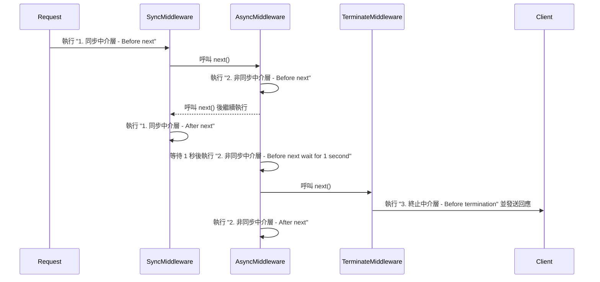

> **前言:**  
> 最近在公司被分派一個 Koa backend 的功能開發任務，雖然我平時多數時間主要負責前端相關的工作，不過因為學生時期有稍微接觸過一點 Express，它與 Koa 都是 Node.js 知名 web 框架，所以閱讀程式碼時並不會太陌生。這兩者雖然有不少相似之處，但實際使用後發現，它們在設計理念和使用體驗上有很大的不同。

<!-- truncate -->

## **簡介**

**Express** 是目前 Node.js 最知名且下載量最多的 web 框架。誕生於 2010 年，它是當時第一批專為 Node.js 設計的 Web 框架之一。因為簡單易學、功能強大，再加上豐富的社群資源，Express 很快成為開發者的首選工具，也推動了 Node.js 生態系統的成長，甚至啟發了後來許多框架的設計。

到了 2013 年，Express 的開發團隊推出了一個新框架：**Koa**。Koa 主打簡潔與輕量，移除了內建中介軟體，讓開發者可以自行選擇需要的模組來打造應用。Koa 的一大特色是原生支援 async/await，解決了 Express 在同步與異步操作上的一些限制。相較之下，Express 的中介軟體基於 callback 設計，內部的 next() 函數是同步執行，無法像 Koa 那樣等待下層中介軟體完成後再繼續執行。這點我們稍後會在後續的章節透過範例來詳細說明。

這篇文章整理了我的學習心得，希望能帶大家深入了解 Express 和 Koa 的核心差異。如果你和我一樣在查資料時曾經有「哦，原來是這樣！」的驚喜，期待這篇文章能再次帶給你那樣的體驗。


<br/>

## **框架的內建功能**

### **Express：開箱即用**

如果你使用過 Express，那你一定知道它最大的優點就是「方便」。Express 是一個接近於完整的框架，它內建了不少功能，讓開發者可以快速啟動專案，少去找第三方套件的麻煩。Express 還附帶了許多便捷方法來處理各種需求，例如：

- `express.Router()`：提供靈活的路由管理。
- `express.static()`：方便地設定靜態文件服務。
- `express.set()`：用於應用設定。
- `express.json()` 和 `express.urlencoded()`：內建的 body parser，讓你能輕鬆解析 JSON 和 URL 編碼的請求體。

簡單看個範例：

```jsx title="src/index.ts"
const express = require('express');
const app = express();

app.use(express.json()); // 內建 body parser
app.get('/', (req, res) => {
  res.send('Hello from Express!');
});

app.listen(3000, () => console.log('Express server running on http://localhost:3000'));
```

這段程式碼展示了 Express 如何快速設定一個簡單的 HTTP 伺服器。只需要幾行程式碼，不需要下載額外的第三方套件，就能處理基本的路由和請求解析。

### **Koa：極簡核心**

反觀 **Koa**，它的設計理念是「保持核心極簡」。換句話說，Koa 的核心不包含任何預設的中介層，連基本的路由和 body parser 都需要你自己安裝。這樣的設計讓開發者能夠有極高的自由度，按照自己的需求去組裝應用程式。

Koa 特別適合那些不依賴大量路徑管理的 HTTP 服務，比如 Webhook 或聊天機器人，因為它不會預設任何結構，開發者可以靈活選擇所需的中介軟體來實現功能。

舉個簡單的例子來看看如何在 Koa 中新增路由和 body parser：

```jsx title="src/index.ts"
const Koa = require('koa');
const Router = require('@koa/router');
const bodyParser = require('koa-bodyparser');

const app = new Koa();
const router = new Router();

app.use(bodyParser()); // 需要手動引入 body parser

router.get('/', (ctx) => {
  ctx.body = 'Hello from Koa with Router and Body Parser!';
});

app.use(router.routes()).use(router.allowedMethods());

app.listen(3000, () => console.log('Koa server running on http://localhost:3000'));

```

可以看到，使用 Koa 時需要我們手動安裝 `@koa/router` 和 `koa-bodyparser` 等套件，來補足 Express 內建的功能。這樣的設計讓 Koa 的核心保持簡潔，並給予開發者極大的掌控權。當然，自由也意味著在搭建應用時需要更多的決策和設置，這對於習慣快速啟動專案的人來說，可能需要適應一下。


<br/>


## **Request/Response 處理方式**

### **Express：使用 `req` 和 `res` 物件**

在 Express 中，處理請求和回應的核心是 `req`（Request）和 `res`（Response）物件。這兩個物件由 Express 根據 Node.js 原生的 `http.IncomingMessage` 和 `http.ServerResponse` 包裝而來，並添加了更多方便開發的屬性與方法。

req 提供了各種屬性和方法，用於存取請求相關的數據，例如：

- `req.body`：存取 POST 請求的資料。
- `req.params`：存取路由中的參數。
- `req.query`：存取 URL 中的查詢參數。

res 物件則用來處理回應，包括：

- `res.send()`：發送回應。
- `res.json()`：發送 JSON 格式的回應。
- `res.status()`：設置 HTTP 狀態碼。

以下是一個簡單的 Express 範例，展示如何處理請求和回應：

```jsx title="src/index.ts"
const express = require('express');
const app = express();

app.use(express.json()); // 解析 JSON 請求體

app.get('/greet/:name', (req, res) => {
  const name = req.params.name;
  res.status(200).json({ message: `Hello, ${name}!` });
});

app.listen(3000, () => console.log('Express server is running on http://localhost:3000'));
```

### **Koa：使用 `ctx` 上下文物件**

Koa 的 Request/Response 處理則是基於 `ctx(Context)` 物件。ctx 封裝了 `request` 和 `response`，並將它們整合到一個乾淨的 API 中，讓開發者更方便地操作。

每個請求都會生成一個獨立的 ctx，開發者可以直接在這個物件上存取或修改請求與回應。Koa 將 Node.js 原生的 `req` 和 `res` 包裝成 `ctx.request` 和 `ctx.response`，並提供了額外功能。

在 Koa 中，常見的請求操作包括：

ctx.request.body：存取 POST 請求的數據（需搭配 koa-bodyparser）。
ctx.params：存取路由參數（需搭配路由模組，如 @koa/router）。
ctx.query：存取 URL 查詢參數。
回應操作則包括：

ctx.body：設置回應內容。
ctx.status：設置 HTTP 狀態碼。

以下是一個簡單的 Koa 範例：

```jsx title="src/index.ts"
const Koa = require('koa');
const Router = require('@koa/router');
const bodyParser = require('koa-bodyparser');

const app = new Koa();
const router = new Router();

app.use(bodyParser()); // 解析 JSON 請求體

router.get('/greet/:name', (ctx) => {
  const name = ctx.params.name;
  ctx.status = 200;
  ctx.body = { message: `Hello, ${name}!` };
});

app.use(router.routes()).use(router.allowedMethods());

app.listen(3000, () => console.log('Koa server is running on http://localhost:3000'));
```

除了 ctx.request 和 ctx.response，ctx 還包括許多方便的 helper methods 與屬性，讓開發者更輕鬆處理常見任務。以下是一些實用的例子：

- **`ctx.querystring`**：返回原始的查詢字符串。例如，對於 URL `http://localhost:3000/greet?name=John&age=30`，`ctx.querystring` 會返回 `"name=John&age=30"`。
- **`ctx.throw(status, message)`**：主動拋出錯誤，簡化錯誤處理。例如，`ctx.throw(400, 'Bad Request')` 會在錯誤發生處立即中斷執行後續的中介軟體，並返回 400 狀態碼和錯誤訊息。
- **`ctx.state`**：一個共享物件，用於在中介軟體之間傳遞數據。例如，可以在認證中介軟體中設定用戶資訊，供後續的業務邏輯使用。
- **`ctx.is(types)`**：檢查請求的 Content-Type 是否匹配指定類型。例如，`ctx.is('json', 'text')` 可判斷請求是否為 JSON 或純文本。


<br/>


## **中介層（Middleware）的執行機制**

在後端開發中，中介層（middleware）的作用是讓請求在抵達路由處理器之前或回應送出之前進行處理。常見的用途包括日誌記錄、驗證、錯誤處理、解析請求體等。中介層的目標是提升應用的可擴充性和模組化，讓開發和維護更高效。透過一層層「守門員」依序處理請求，應用邏輯可以被拆分成清晰的小步驟，各自負責不同功能。

在設計上，Express 和 Koa 的中介層有一個核心差異：

1. **Express** 的中介層基於 **callback**，執行 `next()` 時是同步的。也就是說，呼叫 `next()` 後，接下來的程式碼會立即執行，並不會等待後續中介層完成。
2. **Koa** 的中介層基於 **Promise**，允許使用 `async/await`。當執行 `await next()` 時，程式會暫停並等待後續中介層完成後，才繼續執行接下來的程式碼。這種設計符合「洋蔥模型」，讓非同步邏輯處理更加直觀自然。

### **洋蔥模型**
在深入了解 Koa 和 Express 的中介層之前，我們先來介紹一個核心概念——**洋蔥模型**，這是 Koa 中介層設計的基礎。洋蔥模型的運作方式就像剝洋蔥：請求先經過最外層的中介層，依次「穿透」到最內層。請求處理完成後，回應再從最內層開始逐層返回到外層。下圖就是一個非常經典的例子：


我們可以把中介層的洋蔥模型機制理解為兩個階段：
1. **進入階段**：執行該中介層函數 `next()` 前的邏輯，順序是從最先註冊的中介層執行到最晚註冊的中介層。
2. **返回階段**：執行該中介層函數 `next()` 後的邏輯，順序則反過來，從最晚註冊的中介層執行到最早註冊的中介層。
   
### **Express：線性、同步執行**

前面我們有提到，**Express** 的中介層採用線性、同步的執行模式。請求進入時，中介層按照註冊順序依次執行，透過 `next()` 將控制權傳遞給下一個中介層。然而，在處理非同步操作時，這種同步特性可能會導致執行順序看起來有些不直觀。

**觀察範例**  
以下是一段範例程式碼，展示了 Express 中同步與非同步中介層的執行特性：

```tsx title="src/middleware/testMiddleware.ts"
import { Request, Response, NextFunction } from "express";

export const syncMiddleware = (
  req: Request,
  res: Response,
  next: NextFunction
) => {
  console.log("1. 同步中介層 - Before next");
  next();
  console.log("1. 同步中介層 - After next");
};

export const asyncMiddleware = async (
  req: Request,
  res: Response,
  next: NextFunction
) => {
  console.log("2. 非同步中介層 - Before next");
  await new Promise<void>((resolve) =>
    setTimeout(() => {
      console.log("2. 非同步中介層 - Before next wait for 1 second");
      resolve();
    }, 1000)
  ); // 模擬非同步事件
  next();
  console.log("2. 非同步中介層 - After next");
};

export const terminateMiddleware = (
  req: Request,
  res: Response,
  next: NextFunction
) => {
  console.log("3. 終止中介層 - Before termination");
  res.send("Request terminated by middleware");
  // 不執行 next()，這裡會終止請求
};
```

**執行結果**

```
1. 同步中介層 - Before next
2. 非同步中介層 - Before next
1. 同步中介層 - After next
2. 非同步中介層 - Before next wait for 1 second
3. 終止中介層 - Before termination
2. 非同步中介層 - After next
```

相信對 Express 不熟的讀者第一眼看到這個執行結果可能會覺得有點難以理解，咦？為什麼 `1. 同步中介層 - After next` 會跑到 `2. 非同步中介層 - Before next wait for 1 second` 前面執行呢？

**解釋執行邏輯**  
因為 Express 的中介層是基於 **callback** 設計的，當 `next()` 被執行時，控制權會立刻交給下一個中介層，但 `next()` 後的程式碼不會等待後續中介層的非同步邏輯完成才執行。如果我們試圖中介層的執行邏輯拆解成 callback 的話大概會像這樣：

```jsx
((req, res) => {
  console.log("1. 同步中介層 - Before next");
  ((req, res) => {
    console.log("2. 非同步中介層 - Before next");
    // 呼叫非同步邏輯，進入等待
    (async (req, res) => {
      console.log("2. 非同步中介層 - Before next wait for 1 second");
      await new Promise((resolve) => setTimeout(resolve, 1000));
      ((req, res) => {
        console.log("3. 終止中介層 - Before termination");
        res.send("Request terminated by middleware");
      })(req, res);
      console.log("2. 非同步中介層 - After next");
    })(req, res);
  console.log("1. 同步中介層 - After next");  // 這行在等待非同步結果前就執行
})(req, res);

```

若看到這邊你還是覺得有點難理解，以下的時序圖可以幫助你理解 middleware 內部運行順序的邏輯



:::tip
有些文章提到可以把 Express 的 middleware 理解為一個 `FIFO Queue`（先進先出），但我認為這種說法存在誤區。因為在實際運行中，執行順序取決於是否涉及非同步操作。

**同步操作下的 LIFO 行為**  
當中介層中沒有任何非同步操作時，`next()` 的執行順序更接近 **LIFO**（後進先出）的呼叫堆疊（call stack）。因為 `next()` 將控制權傳遞給下一個中介層後，當所有中介層的進入邏輯執行完畢，返回階段會從最後一個中介層開始逐層返回，與堆疊的後進先出特性類似。

**非同步操作與 Event Loop 的影響**  
當中介層中有非同步操作（如 `setTimeout` 或 `Promise`）時，執行順序變得更複雜。此時，非同步任務會被放入事件隊列（event queue）中，等到主執行緒空閒時再執行。這意味著中介層執行順序受到 JavaScript **Event Loop** 機制的驅動：

1. **進入階段**：同步邏輯按註冊順序執行，直到遇到非同步操作。
2. **非同步操作**：將任務交給事件隊列等待執行，主執行緒繼續處理其他中介層。
3. **返回階段**：當事件隊列中的非同步任務完成後，主執行緒會取回控制權，繼續執行 `next()` 後的程式。

因此，Express 的中介層執行邏輯並非簡單的 FIFO 隊列，而是同步情況下的 **LIFO 行為**，結合 Event Loop 的 **非同步調度**。
:::

### **Koa：洋蔥模型**

在了解了 **Express** 線性、同步的中介層執行後，我們來看看 **Koa** 如何處理中介層。Koa 採用了所謂的 **「洋蔥模型」**，這種設計讓中介層的執行順序清晰且可預測：從外到內，再從內到外。

**觀察範例**  
以下是一個簡單的 Koa 中介層範例：

```tsx title="src/middleware/testMiddleware.ts"
import { Context, Next } from "koa";

export const syncMiddleware = async (ctx: Context, next: Next) => {
  console.log("1. 同步中介層 - Before next");
  await next();
  console.log("1. 同步中介層 - After next");
};

export const asyncMiddleware = async (ctx: Context, next: Next) => {
  console.log("2. 非同步中介層 - Before next");
  await new Promise<void>((resolve) =>
    setTimeout(() => {
      console.log("2. 非同步中介層 - Before next wait for 1 second");
      resolve();
    }, 1000)
  );
  await next();
  console.log("2. 非同步中介層 - After next");
};

export const terminateMiddleware = async (ctx: Context, next: Next) => {
  console.log("3. 終止中介層 - Before termination");
  ctx.body = "Request terminated by middleware";
  // 不執行 next()，這裡會終止請求
};
```

**執行結果**：

```
1. 同步中介層 - Before next
2. 非同步中介層 - Before next
2. 非同步中介層 - Before next wait for 1 second
3. 終止中介層 - Before termination
2. 非同步中介層 - After next
1. 同步中介層 - After next
```

**解釋執行邏輯**  
Koa 的中介層基於 **Promise** 設計，執行順序遵循以下邏輯：

1. **進入階段（外到內）：** 當執行 `await next()` 時，控制權會傳遞到下一個中介層。
2. **返回階段（內到外）：** 當內層中介層執行完畢後，控制權返回到當前中介層，繼續執行 `next()` 之後的程式碼。

可以發現，Koa 的 middleware 運行順序相比於 Express 要好預測得多了，不論是同不還是非同步邏輯，程式碼的執行順序都是「外到內，內到外」。對於開發者來說，Koa 的洋蔥模型提供了更可控的執行流程。特別是在處理非同步邏輯時，Koa 的設計讓控制流更清晰，並減少了對開發者的心智負擔。


<br/>


## **中介層（Middleware）執行細節探討**

### **Express：回應與中介層執行的陷阱**

在 Express 中，當中介層執行 `res.send()` 等方法發送回應時，請求流程就會被終止，不會再繼續執行後面的中介層或程式碼。如如果在回應後意外執行 `next()`，會拋出以下錯誤：
```
Error: Cannot set headers after they are sent to the client
```
這是因為回應頭已經被發送，不能再次修改。因此，開發者需謹慎處理回應後的邏輯，避免不必要的 `next()` 呼叫。

**範例**：
```tsx title="src/middleware/testMiddleware.ts"
import { Request, Response, NextFunction } from "express";

export const terminateMiddleware = (
  req: Request,
  res: Response,
  next: NextFunction
) => {
  console.log("3. 終止中介層 - Before termination");
  res.send("Request terminated by middleware");
  next(); // 將導致錯誤：Cannot set headers after they are sent to the client
};

```

**預期結果**：

```
1. 終止中介層 - Before termination
Express Error: Error: Cannot set headers after they are sent to the client
```

:::caution[設計注意事項]
在設計 Express 中介層時，務必確保以下幾點：  
1. **終止中介層：** 確認回應邏輯執行完畢後，避免再呼叫 `next()`。
2. **錯誤處理：** 如果有錯誤回應邏輯，例如 `res.status(500).send()`，應將後續處理責任中止。
3. **明確流程：** 確保所有中介層對回應的處理是清晰可控的，避免因誤用 `next()` 而導致不可預測的錯誤。
:::

### **Koa：回應後的執行與控制**

與 **Express** 不同，**Koa** 的設計允許即使設置了 `ctx.body` 回應請求，後續的中介層仍然會繼續執行。這種設計為開發者提供了更多的靈活性，可以在設置回應後進行額外的邏輯處理，例如記錄日誌或執行清理操作。

**範例**：

```tsx title="src/middleware/testMiddleware.ts"
import { Context, Next } from "koa";

export const terminateMiddleware = async (ctx: Context, next: Next) => {
  console.log("3. 終止中介層 - Before termination");
  ctx.body = "Request terminated by middleware";
  await next(); // 即使設置了 ctx.body，後面的中介層仍會執行
};

export const logMiddleware = async (ctx: Context, next: Next) => {
  console.log("4. 日誌記錄中介層 - 執行中");
  await next();
  console.log("4. 日誌記錄中介層 - 完成");
};
```

**預期結果**：

```markdown
3. 終止中介層 - Before termination
4. 日誌記錄中介層 - 執行中
4. 日誌記錄中介層 - 完成
...
```

:::info[關鍵特性]
1. **後續執行：** 即使設置了 `ctx.body`，後續中介層的邏輯仍會執行，除非中介層中斷了請求流程（如拋出錯誤）。
2. **靈活性：** 開發者可以在回應設置後繼續執行額外邏輯，例如：
    - **記錄日誌：** 紀錄請求與回應的相關資訊。
    - **資源清理：** 釋放資料庫連線或清除暫存。
    - **監控處理：** 收集性能數據或追蹤請求。
:::


<br/>


## **錯誤處理**

### **Express 的錯誤處理**

在 Express 中，有兩種類型的中介層：

- **一般**中介層：參數為 `(req, res, next)`，處理正常的請求和回應邏輯。
- **錯誤處理**中介層：參數為 `(err, req, res, next)`，必須接受 4 個參數。這樣的中介層專門用於捕獲和處理應用程式中的錯誤。Express 會自動識別並執行這種中介層來處理錯誤。

當 Express 檢測到一個這個中介層帶有四個參數`(err, req, res, next)`時，它會將其視為錯誤處理中間件，並且只在以下情況下執行它：

- 當中介層或路由處理器呼叫 `next(error)` 時。
- 當程式碼中主動拋出異常（如 `throw new Error(...)`）時。

當錯誤發生時，Express 會跳過後續的正常中介層，直接執行錯誤處理中介層。

**錯誤處理範例**

以下我們透過範例來看在 Express 中如何做錯誤處理：

```jsx title="src/index.ts"
app.use((req, res, next) => {
  console.log("第一個中介層 - Before next");
  next(new Error("模擬錯誤"));
  console.log("第一個中介層 - After next"); // 這行仍然會被執行
});

app.use((req, res, next) => {
  console.log("第二個中介層");
  next(); // 這行不會被執行，因為錯誤已經傳遞到錯誤處理中間件
});

// 錯誤處理中介層，必須放在所有其他中間件和路由之後
app.use((err, req, res, next) => {
  console.error("錯誤捕獲:", err.message);
  res.status(500).send("發生錯誤");
});
```

**執行結果**：

```
第一個中間件 - Before next
第一個中間件 - After next
錯誤捕獲: 模擬錯誤
```

:::info[注意事項]
1. **`next(error)` 的行為：**
    - 傳遞錯誤後，Express 會跳過正常中介層，直接進入錯誤處理中介層。
    - 但調用 `next(error)` 並不會中止上層中介層的程式碼執行，`next()` 後的邏輯仍然會執行（如範例中的 `After next` 日誌）。
2. **錯誤處理中介層的位置：**
    - 必須放在所有其他中介層和路由之後，否則無法捕獲錯誤。
3. **拋出異常：**
    - 主動 `throw` 也會觸發錯誤處理中介層，行為與 `next(error)` 一致。
:::

:::note[為什麼錯誤處理中介層，必須放在所有其他中間件和路由之後？]
如前所述，因為 Express 採用線性執行模型，`next()` 會將控制權傳遞給下一個中介層或路由。如果錯誤處理中介層不放在最後，Express 將無法正確捕獲和處理錯誤 `next(error)` 向後傳遞的錯誤。
:::

### **Koa 的錯誤處理**

在 **Koa** 中，錯誤處理的機制與 **Express** 有一些根本上的不同。Koa 採用了原生的 `async/await` 和 `try...catch` 結構，讓邏輯更加直觀。這種設計使每層中介層能集中捕捉和處理錯誤，而不需要額外設置專用的錯誤處理中介層。

**錯誤處理的特性**
- `try...catch` 捕捉異常： 每層中介層都可以使用 `try...catch` 捕捉異常，未捕捉的錯誤會傳遞到全局錯誤監聽器。
- 自動停止流程： 當發生錯誤時，Koa 會中止 `next()` 後的程式碼執行，避免不必要的邏輯被執行。
- 全局錯誤監聽器： 使用 `ctx.app.emit('error', err, ctx)`，可以將錯誤傳遞到全局監聽器進行集中處理。


**範例**：  
讓我們看一個簡單的例子，展示如何在 Koa 中使用 `try...catch` 來捕獲和處理錯誤：

```tsx title="src/index.ts"
import Koa, { Context, Next } from 'koa';

const app = new Koa();
// 全局錯誤監聽器
app.on('error', (err, ctx) => {
  console.error('全局錯誤監聽器捕獲錯誤:', err.message);
  // 可以在此處添加日誌記錄或通知系統等處理
});

// 一般中介層，包含 try...catch 來捕獲錯誤
app.use(async (ctx: Context, next: Next) => {
  try {
    console.log('第一個中介層 - Before next');
    await next(); // 傳遞控制權給下一個中介層
    console.log('第一個中介層 - After next'); // 這行在發生錯誤時不會執行
  } catch (err) {
    console.error('第一個中介層捕獲錯誤:', err.message);
    ctx.status = 500;
    ctx.body = '伺服器發生錯誤';
    ctx.app.emit('error', err, ctx); // 將錯誤發送到全局監聽器
  }
});

// 模擬異常的中介層
app.use(async (ctx: Context, next: Next) => {
  console.log('第二個中介層 - Before throw');
  throw new Error('模擬錯誤'); // 主動拋出錯誤
  console.log('第二個中介層 - After throw'); // 不會執行
});

app.listen(3000, () => {
  console.log('Koa server is running on http://localhost:3000');
});
```

**執行結果**：

```
第一個中介層 - Before next
第二個中介層 - Before throw
第一個中介層捕獲錯誤: 模擬錯誤
全局錯誤監聽器捕獲錯誤: 模擬錯誤
```

**客戶端回應**：

```
伺服器發生錯誤
```

**關鍵邏輯解析:**  
在這個範例中，當 `第二個中介層` 拋出錯誤後，Koa 會立即進入 `第一個中介層` 的 `catch` 區塊，設置 HTTP 狀態碼為 500 並回傳錯誤訊息，同時停止執行 `第一個中介層` 中 `next()` 後的程式碼。這種機制確保錯誤發生後，流程能夠被中止，並進行適當的錯誤處理。

除了使用 `try...catch` 來捕捉錯誤，Koa 還提供了 `ctx.app.emit('error', err, ctx)` 方法來將錯誤事件發送給應用的全局錯誤監聽器。這在大型應用中特別有用，因為它允許集中處理所有錯誤，例如記錄日誌或發送通知，而不需要在每個中介層中重複錯誤處理邏輯。

在這個範例中， `ctx.app.emit('error', err, ctx)` 被調用時，全局監聽器 `app.on('error', …)` 會接收到這個錯誤事件，並根據需求進行集中處理。


<br/>


## **Reference**

- [**Express vs Koa**](https://medium.com/@gary92.gs/express-vs-koa-e48458020ce4)
- [**釐清 Express.js 和 Koa.js 的設計差異**](https://medium.com/cow-say/%E9%87%90%E6%B8%85-express-js-%E5%92%8C-koa-js-%E7%9A%84%E8%A8%AD%E8%A8%88%E5%B7%AE%E7%95%B0-7f95c9f5d596)
- [**NodeJS 輕量開發框架 Expressjs 與 Koa2 的區別**](https://johnnywang1994.github.io/book/articles/js/express-vs-koa.html#nodejs-%E8%BC%95%E9%87%8F%E9%96%8B%E7%99%BC%E6%A1%86%E6%9E%B6-expressjs-%E8%88%87-koa2-%E7%9A%84%E5%8D%80%E5%88%A5)
- [**浅谈 Koa 和 Express 的中间件设计模式**](https://blog.xav1er.com/p/middleware-of-koa-and-express/)
- [**Koa vs Express**](https://github.com/koajs/koa/blob/master/docs/koa-vs-express.md)