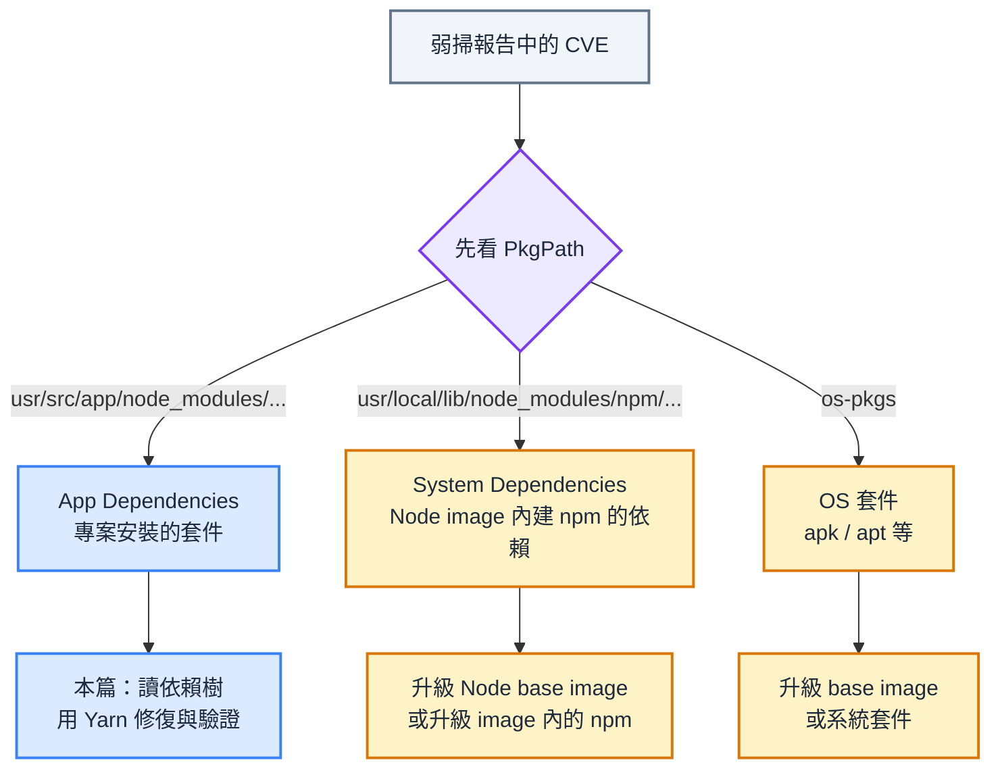
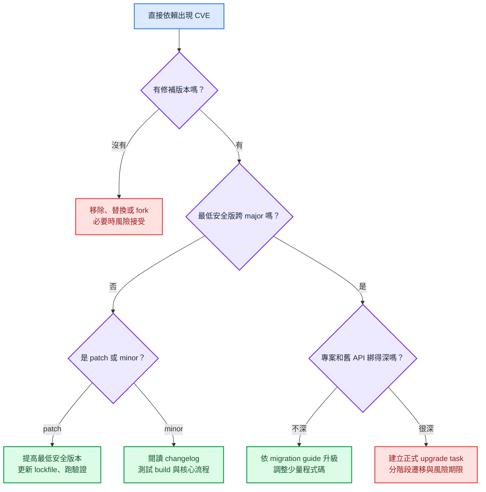
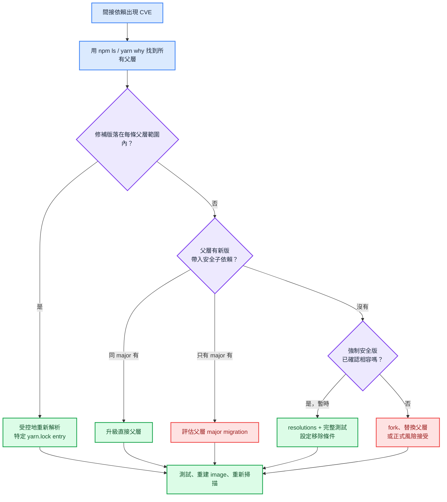

最近在公司常常在處理 Node.js 專案的套件 CVE 弱點修復，趁著記憶力還很新鮮來記錄一下最近整理的完整判斷決策流程。最一開始看到弱掃報告裡的 CVE、Fixed Version 與一長串 `node_modules` 路徑時，我只知道「有套件要升」，卻不知道該怎麼升。前幾次只能一邊查資料、一邊問 AI，直到處理過幾種不同的依賴關係後，我才慢慢發現：**修復 Node.js 套件漏洞，其實是一個讀依賴樹、判斷版本範圍，再選擇最小安全變更的過程。** 因為當弱點落在直接依賴、間接依賴、嚴格版本宣告或多年未維護的套件上，後續選擇會完全不同。這篇文章我會把自己碰過與整理過的情境拆成案例，讓每一個決策都能看見前因後果。

<!-- truncate -->


:::note 本文使用的套件管理器
本文以 **Yarn Classic（Yarn 1）** 專案為主，修復時會改 `package.json`、`yarn.lock`，並使用 Yarn 執行安裝與升級。Yarn Berry、npm-only、pnpm 都有各自的 lockfile 與覆寫機制，不能把本文的 Yarn 指令直接搬過去混用。

:::

<br/>

## **弱掃報告的第一個分岔：區分漏洞來源**

我在 [如何使用 Trivy 在開發階段提前發現安全漏洞](2026-02-24-如何使用%20Trivy%20在開發階段提前發現安全漏洞.md) 這篇文章提過，通常，主流的弱點掃描工具會同時掃到**作業系統套件(os-pkgs)** 以及**語言生態系套件(lang-pkgs)**。

對於後者而言：

- 若 `PkgPath` 類似 `usr/src/app/node_modules/axios/package.json`，套件是由專案的 `package.json` 與 lockfile 安裝進來的。這種漏洞通常能靠升級專案依賴、調整解析版本，或是更換父層套件修補，也是本文要介紹的重點。
- 相反地，`usr/local/lib/node_modules/npm/node_modules/...` 通常屬於 Node.js base image 帶進來的 npm 工具本身。就算專案裡沒有使用該套件，掃描器仍然會在 image 裡找到它。此時改 `package.json` 不會產生任何效果，正確方向是檢查 Node base image 是否已有修補版，或依團隊規範升級 image 內的 npm。




<br/>

## **理解專案的依賴關係**

確認漏洞屬於 App Dependencies 後，第一件事是找出它在依賴樹中的位置：它可能是專案直接安裝的套件，也可能是某個直接依賴再帶進來的套件。

### **直接依賴與間接依賴**

假設根目錄的 `package.json` 只有這個宣告：

```json title="package.json"
{
  "dependencies": {
    "react-router-dom": "^6.30.2"
  }
}
```

`react-router-dom` 是**直接依賴**，因為它直接寫在根目錄的 `package.json`。它再安裝的 `react-router` 與 `@remix-run/router` 則是**間接依賴**。實際安裝後的邏輯關係如下：

```text
my-app
└─ react-router-dom@6.30.2                 # 直接依賴
   ├─ @remix-run/router@1.23.1             # 間接依賴
   └─ react-router@6.30.2
      └─ @remix-run/router@1.23.1 (deduped)
```

`deduped` 表示兩條路徑共用同一份已安裝的套件，而不是再裝第二份 `@remix-run/router`。不過它仍然有兩條邏輯上的依賴路徑，之後碰到多個父層時，不能只看其中一條。

### **解讀 `yarn.lock`**

新手常常誤會的是 `package.json` 的 `6.30.2` 不見得是「目前已安裝的版本」，而是可接受的**版本範圍（version range）**。Yarn 第一次安裝時會在這個範圍內選一個版本，再把結果記進 `yarn.lock`。因此真正需要比對弱掃版本的，是 lockfile 的 `version` 欄位：


```text title="yarn.lock"
react-router-dom@^6.30.2:
  version "6.30.2"
  resolved "https://registry.yarnpkg.com/react-router-dom/-/react-router-dom-6.30.2.tgz"
  dependencies:
    "@remix-run/router" "1.23.1"
    react-router "6.30.2"
```

lockfile entry 的第一行是「哪個版本範圍需要被解析」，`version` 才是這次安裝實際選到的版本。父層的 `dependencies` 區塊則記錄它允許或要求子套件的範圍。以後面常用的虛構範例來說：

```text title="yarn.lock"
package-a@^1.1.0:
  version "1.1.0"
  dependencies:
    vulnerable-lib "^1.0.0"

vulnerable-lib@^1.0.0:
  version "1.0.3"
```

這代表 `package-a` 允許 `vulnerable-lib` 從 `1.0.0` 升到 `2.0.0` 之前的任何版本，所以 `1.0.9` 可以被重新解析進來；若它寫的是精確的 `"1.0.3"`，就不能把 `1.0.9` 當成自然升級。這也是間接依賴修復前必須先看的限制。

:::note 版本範圍標記符號補充說明：
- `^1.0.0` 表示 `>= 1.0.0` 且 `< 2.0.0`
- `~1.0.0` 表示 `>= 1.0.0` 且 `< 1.1.0`，
- 而 `1.0.3` 則只接受 `1.0.3` 本身
:::

<br/>

## **追查弱點與依賴關係時會用的指令**

有了依賴樹與 lockfile 的概念後，接下來要補齊幾個判斷所需的事實：弱點的安全版本是什麼、現在是誰帶進來、父層允許哪個範圍，以及父層是否已經有帶入修補版的新版本。我在 Yarn Classic 專案中仍會使用 npm 做查詢，因為 `npm ls` 的樹狀輸出很直觀；這些指令都是唯讀查詢，不會改動 `package.json` 或 `yarn.lock`。

### **先用 `yarn audit` 確認弱點與修補下限**

若漏洞是從專案端發現，我會先執行：

```bash
yarn audit
```

輸出內容會隨漏洞資料庫而改變，實務上我主要看 `Package`、`Patched in`、`Dependency of` 與 `Path` 這幾個欄位：

```text
┌───────────────┬────────────────────────────────────┐
│ Package       │ vulnerable-lib                     │
│ Patched in    │ >= 1.0.9                           │
│ Dependency of │ package-a                          │
│ Path          │ package-a > vulnerable-lib         │
└───────────────┴────────────────────────────────────┘
```

若來源是 image scan，則用報告中的 `PkgName`、`InstalledVersion`、`FixedVersion` 與 `PkgPath` 對照同一件事。無論從哪裡發現，這一步只得到「哪個版本有洞」與「安全下限」，還不知道改哪個套件才正確。

### **用 `npm ls` 找到目前的父層**

接著我會查出漏洞套件在當前安裝結果中的所有路徑。以 `@remix-run/router@1.23.1` 為例：

```bash
npm ls @remix-run/router
```

```text
my-app@1.0.0 /path/to/my-app
└─┬ react-router-dom@6.30.2
  ├── @remix-run/router@1.23.1
  └─┬ react-router@6.30.2
    └── @remix-run/router@1.23.1 deduped
```

這個結果先排除了「直接升級 `@remix-run/router`」的直覺做法：根目錄直接安裝的是 `react-router-dom`，`@remix-run/router` 是它帶進來的間接依賴。`npm ls` 也會把 `deduped` 顯示出來，剛好能確認同一個弱點是否從多條路徑進入專案。

### **用 `npm info` 看父層的版本範圍與可升級版本**

知道父層名稱後，我會先看「目前這一版父層到底怎麼宣告子套件」：

```bash
npm info react-router-dom@6.30.2 dependencies
```

```text
{
  '@remix-run/router': '1.23.1',
  'react-router': '6.30.2'
}
```

`1.23.1` 是精確版本，不允許 Yarn 自己浮動到 `1.23.2`。因此即使弱掃要求 `@remix-run/router >= 1.23.2`，刪掉它的 lockfile entry 也不會修好，必須再確認父層有沒有新版本：

```bash
npm info react-router-dom versions
```

```text
[
  ...,
  '6.30.1',
  '6.30.2',
  '6.30.3',
  ...
]
```

最後查候選版本的依賴內容：

```bash
npm info react-router-dom@6.30.3 dependencies
```

```text
{
  '@remix-run/router': '1.23.2',
  'react-router': '6.30.3'
}
```

這樣才能確定修復點是 `react-router-dom@6.30.3`，而不是直接強壓 `@remix-run/router`。後面每個間接依賴案例，都是依序用這四個問題收斂出來的。

<br/>


## **直接依賴安全漏洞的修復策略**

若漏洞套件本來就寫在專案根目錄的 `package.json`，這種情況通常比較容易追查與修復，判斷流程如下圖所示，總共可以分成 5 種情境：



### **案例一：patch 升級即可修復**

假設根 `package.json` 有 `"http-client": "^1.6.0"`，掃描器要求 `http-client >= 1.6.8`。`http-client` 是直接依賴，`1.6.8` 又仍在 `^1.6.0` 可接受的範圍內，這是最單純的情況。

我會把最低可接受版本明確提高：

```bash
yarn upgrade http-client@^1.6.8
```

### **案例二：minor 升級能修，但可能有隱性 breaking change**

假設根目錄的 `package.json` 有 `build-helper@3.1.0`，其修補版是 `3.4.0`。理論上若套件有根據 **semver** 原則發佈，minor 版本不應破壞既有 API，但實務上 npm 生態不一定完全可靠。尤其是 build tool、bundler、lint plugin 與 framework plugin 常常會改變預設設定、輸出格式或 peer dependency 條件。

即使當作 minor 升級，我還是會先升級套件：

```bash
yarn upgrade build-helper@^3.4.0
```

不過必須做額外的確認，如：

- 看 changelog / release note
- 跑 unit test、build、lint、e2e
- 特別測一次最依賴該工具的核心流程


### **案例三：需要 major 升級，但專案只用到少量 API**

假設根目錄的 `package.json` 有 `report-kit@1.x`，且只有 `2.0.0` 才修好；而剛好專案只用了幾個 API，升級後只需要改動少量的程式碼。

業界的標準處理方式是先升級 major

```bash
yarn upgrade report-kit@^2.0.0
```

接著：

- 依 migration guide 修改程式碼
- 補上修改處的測試，確認輸出的報表仍符合需求。
- 特別測一次最依賴該工具的核心流程

### **案例四：需要 major 升級，但專案深度綁定舊版**

再假設根目錄的 `package.json` 有 `legacy-bundler@4.x`，只能靠升到 `5.x` 修補，但專案的 loader、plugin、CI 設定與部署產物都深度綁定 `v4`。此時「升一個套件」其實已經是一個涉及建置流程的遷移工作。

我會把它從一般弱掃修補切成正式的 upgrade task：

- 先盤點 breaking changes 與使用點
- 再建立獨立 branch
- 把套件使用處集中封裝
- 做大版本更新後逐步調整程式碼
- 補足測試與部署驗證
- 最後分階段測試與合併。


若客戶進版時程不允許一次完成，通常會做：

- 記錄漏洞可利用的條件
- 確認現有補償控制
- 設定風險接受期限
- 安排正式的 upgrade task

> 如果弱點只影響某個 CLI build tool，而且不會進 production runtime，風險可能可以暫時接受；但如果是 production server 會處理外部輸入的套件，就不適合長期拖延。
>

### **案例五：套件停止維護，而且沒有修補版本**

`old-excel-reader@0.18.5` 假設已經多年沒有維護，掃描器也沒有提供 Fixed Version。這種情況最危險的不是升級難，而是根本沒有可以升的方向。

我的評估順序通常是：

- 先確認功能是否還在使用，能移除就移除
- 不能移除時尋找持續維護的替代套件
- 替換成本太高時才評估 fork 套件並自行修補
- 若短期只能風險接受，文件至少要說清楚漏洞是否接觸外部輸入、是否會跑在 production runtime、有哪些補償控制，以及何時重新評估。


<br/>


## **間接依賴安全漏洞的修復策略**

直接依賴的案例都能從根 `package.json` 動手；間接依賴則多了一層限制，必須尊重父套件當初宣告的相容範圍。這也是我最初覺得複雜、後來卻最有規律可循的部分。為了讓「實際安裝版本」與「父層宣告範圍」不混在一起，下面樹狀圖的套件版號代表目前安裝的版本，行尾的註解才是父層宣告的範圍。



### **案例一：修補版仍在父層允許範圍內**

假設目前的依賴關係如下。弱掃報告指出 `vulnerable-lib@1.0.3` 有漏洞，要求至少升到 `1.0.9`：

```text
my-app
└─ package-a@1.1.0
   └─ vulnerable-lib@1.0.3   # package-a 宣告：^1.0.0
```

`^1.0.0` 允許 `1.0.9`，所以父層本身不需要更新，問題只在 lockfile 還保存舊的解析結果。

Yarn Classic 的 lockfile entry 可能像這樣：

```text title="yarn.lock"
vulnerable-lib@^1.0.0:
  version "1.0.3"
  resolved "https://registry.yarnpkg.com/vulnerable-lib/-/vulnerable-lib-1.0.3.tgz"
  integrity sha512-...
```

在確認**所有引用這個 entry 的版本範圍都能接受安全版**後，我會在獨立 commit 中只移除這一整段 entry，再執行：

```bash
yarn install
```


`yarn install` 發現 lockfile 缺少該範圍的解析紀錄後，會從 registry 重新選一個符合 `^1.0.0` 的版本。若 registry 中最新的安全版本是 `1.0.9`，這段 `yarn.lock` 會被寫回成：

```diff title="yarn.lock"
 vulnerable-lib@^1.0.0:
-  version "1.0.3"
-  resolved "https://registry.yarnpkg.com/vulnerable-lib/-/vulnerable-lib-1.0.3.tgz"
-  integrity sha512-...
+  version "1.0.9"
+  resolved "https://registry.yarnpkg.com/vulnerable-lib/-/vulnerable-lib-1.0.9.tgz"
+  integrity sha512-...
```

entry 的 key 還是 `vulnerable-lib@^1.0.0`，因為父層的需求沒有變；變的是 Yarn 在這個範圍內選到的實際版本。重新安裝後，我會再執行 `npm ls vulnerable-lib`，確認輸出真的已經是 `1.0.9`。


:::warning 不要刪除整份 `yarn.lock`
整份 lockfile 刪掉再安裝，會讓所有可浮動依賴一起重新解析，diff 變得巨大，也難以知道哪個變更修了漏洞。這個案例的目的只是更新一個已確認可安全浮動的解析結果。

重新解析時不能使用 `--frozen-lockfile`，因為它的用途正是禁止 lockfile 被更新；等安全版寫回 lockfile、完成檢查後，CI 才應繼續使用 `--frozen-lockfile` 保持可重現安裝。
:::

### **案例二：修補版不被舊父層允許，但同 major 父層已有新版**

假設目前安裝的 `package-a@1.1.4` 只允許 `vulnerable-lib` v1，而 `1.x` 全部有漏洞，安全版從 `2.0.0` 才開始：

```text
my-app
└─ package-a@1.1.4
   └─ vulnerable-lib@1.0.3   # package-a 宣告：^1.0.0
```

直接把子依賴升到 v2 會越過父層的相容性邊界。

不過查詢 package-a 新版本的依賴資訊，發現 `package-a@1.2.0` 已改成宣告 `vulnerable-lib@^2.0.0`。此時真正該升的是父層：

```bash
npm info package-a@1.1.4 dependencies
npm info package-a@1.2.0 dependencies
yarn upgrade package-a@^1.2.0
```

升級後的關係才會變成：

```text
my-app
└─ package-a@1.2.0
   └─ vulnerable-lib@2.0.0   # package-a 宣告：^2.0.0
```

因為新版 `package-a` 已經調整它自己的 dependency range，所以 `vulnerable-lib` 會自然被帶到 patched version。這個做法讓專案只需驗證 `package-a` 的 minor 升級是否影響自己的使用方式。

### **案例三：父層必須 major upgrade 才能帶入安全子依賴**

如果 `package-a@1.x` 全部都依賴 `vulnerable-lib@1.x`，只有 `package-a@2.x` 才改用 `vulnerable-lib` v2，關係會像這樣：

```text
my-app
└─ package-a@1.8.0
   └─ vulnerable-lib@1.0.3   # package-a 宣告：^1.0.0

可修復的目標
my-app
└─ package-a@2.0.0
   └─ vulnerable-lib@2.0.0   # package-a 宣告：^2.0.0
```

這個間接依賴問題就回到了前面「直接依賴 major 升級」的案例三或案例四的判斷流程。要升的仍是根目錄直接使用的 `package-a`，只是它的升級理由是為了換掉子依賴。

### **案例四：父層久未發布新版，但 `resolutions` 是合理的暫時修補**

假設父層把 `vulnerable-lib` 精確鎖在 `1.0.3`，而不是一個可浮動的版本範圍：

```text
my-app
└─ package-a@1.1.4
   └─ vulnerable-lib@1.0.3   # package-a 宣告：1.0.3
```

公告指出 `1.0.9` 是修補同一個 API 的 patch，但上游遲遲沒有發布新版。團隊也已在獨立環境驗證 `package-a` 搭配 `1.0.9` 的核心功能、測試與 build 都正常。這才是我會考慮 Yarn Classic `resolutions` 的情境：

```json title="package.json"
{
  "resolutions": {
    "package-a/vulnerable-lib": "1.0.9"
  }
}
```

接著執行 `yarn install`，確認 lockfile 與 `npm ls vulnerable-lib` 都反映指定版本。

:::info resolutions 的使用時機
`resolutions` 能讓根專案在依賴樹解析時覆寫特定子依賴版本，[Yarn 文件](https://classic.yarnpkg.com/en/docs/selective-version-resolutions/)也將「重要安全更新但上游尚未調整子依賴」列為典型用途。

但我會把它當作**有到期日的相容性假設**：必須保留相關測試、追蹤 `package-a` 是否發布正式修補版，並在父層更新後移除 `resolutions`。它不是直接依賴升級的替代品，更不是不必測試的萬用開關。
:::

### **案例五：父層久未發布新版，但安全版是 breaking change，不能用 `resolutions` 硬壓**

沿用案例四的關係，但假設修補版本只有 `vulnerable-lib@2.0.0`，而且 API 從 `oldParse(input)` 改成 `parse(input, options)`：

```text
my-app
└─ package-a@1.1.4
   └─ vulnerable-lib@1.0.3   # package-a 宣告：1.0.3
```

此時即使在根目錄寫下強制覆寫：

```json title="package.json"
{
  "resolutions": {
    "vulnerable-lib": "2.0.0"
  }
}
```

`package-a@1.1.4` 內部仍會用 v1 的方式呼叫：

```ts
// package-a@1.1.4 期待的是 v1 API
const result = vulnerableLib.oldParse(input);
```

安裝可能順利完成，程式卻會在 runtime 因為 `oldParse is not a function` 失敗。這種情況應回到父層看是否可以 major upgrade、替換父層，或在父層很小且維護成本可接受時 fork 後修改它的 API 呼叫。若都無法立即完成，才提出書面解釋有期限的風險接受。

### **案例六：多個父層帶入同一個弱點，必須看完所有路徑**

假設父層 `package-a` 與 `package-b` 都依賴於 `vulnerable-lib`，這有可能會遇到兩種情況：

**版本範圍互相重疊時，可以收斂到同一個修復版本。**

```text
my-app
├─ package-a@1.1.0
│  └─ vulnerable-lib@1.0.3   # package-a 宣告：^1.0.0
└─ package-b@2.4.0
   └─ vulnerable-lib@1.0.3   # package-b 宣告：~1.0.0（deduped）
```

因為 `1.0.9` 同時符合兩個父層的依賴範圍，`yarn.lock` 可能會用一個 entry 合併記錄它們：

```text title="yarn.lock"
vulnerable-lib@^1.0.0, vulnerable-lib@~1.0.0:
  version "1.0.3"
```

刪除這個 entry 後再跑一次 `yarn install`，兩條路徑就能一起重新解析到 `1.0.9`。

**版本範圍衝突時，Yarn 會保留兩份不同 major 的套件。**

```text
my-app
├─ package-a@1.1.0
│  └─ vulnerable-lib@1.0.3   # package-a 宣告：^1.0.0
└─ package-b@2.4.0
   └─ vulnerable-lib@2.0.0   # package-b 宣告：^2.0.0
```

這種情況即便重新解析，Yarn 也只會把 `package-b` 帶到安全的 v2；`package-a` 仍被困在 vulnerable 的 v1 範圍。這時候就必須回到本章節的案例二、三、四、五，升級父層、評估 `resolutions` 是否相容，或採取其他處置。


<br/>


## **Reference**

- **[如何使用 Trivy 在開發階段提前發現安全漏洞](./2026-02-24-如何使用%20Trivy%20在開發階段提前發現安全漏洞.md)**
- **[CVE-2026-22029，NVD](https://nvd.nist.gov/vuln/detail/CVE-2026-22029)**
- **[yarn audit，Yarn Classic](https://classic.yarnpkg.com/en/docs/cli/audit/)**
- **[npm ls，npm Docs](https://docs.npmjs.com/cli/v11/commands/npm-ls/)**
- **[npm info / npm view，npm Docs](https://docs.npmjs.com/cli/v11/commands/npm-view/)**
- **[Selective dependency resolutions，Yarn Classic](https://classic.yarnpkg.com/en/docs/selective-version-resolutions/)**
- **[yarn upgrade，Yarn Classic](https://classic.yarnpkg.com/en/docs/cli/upgrade/)**
- **[yarn install，Yarn Classic](https://classic.yarnpkg.com/en/docs/cli/install/)**
