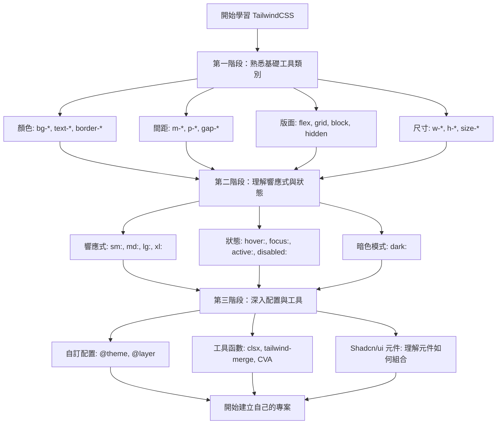

<!-- truncate -->

## **前言**

自從 shadcn/ui 在 2023 年 問世以來，它迅速席捲整個 React 生態圈。短短一年之內，這個「不是 UI Library 的 UI Library」幾乎成了前端開發者間的共同話題。shadcn 在 2023 年甚至被評為 GitHub 當年度最熱門的開源專案，其火熱程度相信每位 React 開發者都感受得到。

這兩年來，幾乎所有 React 圈知名的 YouTuber 與 KOL 都在談 shadcn。越來越多初學者的第一個 UI 套件，不再是老牌的 **Bootstrap**、**MUI** 或 **Ant Design**，而是直接選擇了 **shadcn/ui**。更有趣的是，許多人甚至略過了傳統 CSS，直接投入 **TailwindCSS** 的懷抱，不得不感嘆前端的潮流真的變化得太快了(別更了，快學不動了 🥲)。我從第一次接觸 React，到第一份正式工作，一路都使用 **MUI**。在三年前，它仍是 React 生態中最具代表性的 component library。而如今，看到全世界都在玩 shadcn，連讓 AI 生成 React 專案的範例都會自動引入 shadcn，讓我也不得不跟上潮流來玩玩看 shadcn(俗話說打不贏就加入 😎)。

作為一個 MUI 的老用戶，我能明顯感受到 shadcn 與 MUI 之間的開發體驗差異。shadcn 的美感與客製化能力確實勝出，但就我的學習體驗來說，對初學者而言 shadcn 的學習曲線並不算平緩。畢竟它本質上不是傳統的 UI Library，而是一組以 **TailwindCSS** 為核心堆砌出的「可複製元件範本」。若對 TailwindCSS 不夠熟悉，剛開始入門 shadcn 就會陷入知道怎麼抄但不會改，或者只能讓 AI 幫你改的處境。

這也正是我想寫這個系列文的原因，希望幫助自己和想開始玩 shadcn 的人補上一些關鍵的 TailwindCSS 知識。在深入 shadcn 之前，先把基礎打穩，理解它的設計哲學與底層邏輯，開發體驗會順暢得多。

這是一個完整的 TailwindCSS 與 shadcn/ui 學習系列，總共分為五篇文章：

1. **從 MUI 到 TailwindCSS 設計哲學的轉變（本篇）**
2. [理解 TailwindCSS 的運作原理](https://notes.boshkuo.com/blog/tailwindcss-knowledge-before-shadcn-ui-2)
3. [TailwindCSS v4 內建 Utility Classes 速查](https://notes.boshkuo.com/blog/tailwindcss-knowledge-before-shadcn-ui-3)
4. [透過 @theme 自訂設計系統](https://notes.boshkuo.com/blog/tailwindcss-knowledge-before-shadcn-ui-4)
5. [解析 shadcn/ui 的設計系統](https://notes.boshkuo.com/blog/tailwindcss-knowledge-before-shadcn-ui-5)
6. [shadcn/ui 生態系工具鏈](https://notes.boshkuo.com/blog/tailwindcss-knowledge-before-shadcn-ui-6)

在這幾篇文章記錄了我在學習過程中遇到了許多困惑，像是：

- **MUI 到 TailwindCSS 的概念轉換**
- **改如何正確配置環境**
- **TailwindCSS 工具鏈**
- **切換主題的實作**

## **「Utility-First」的設計哲學**

作為 MUI 的長期使用者，我一直都很習慣這樣寫元件：

```tsx
import { Button } from "@mui/material";

function MyComponent() {
  return (
    <Button variant="contained" color="primary">
      點擊我
    </Button>
  );
}
```

這是典型的  **Component-Based（元件導向）**  設計。使用預先封裝好的元件，透過 props 來控制樣式變化。

而 TailwindCSS 採用的是  **Utility-First（工具優先）**  設計哲學：

```tsx
function MyComponent() {
  return (
    <button className="bg-blue-500 text-white px-4 py-2 rounded hover:bg-blue-600">
      點擊我
    </button>
  );
}
```

有各種「工具類別」（utility classes）可以選擇：`bg-blue-500`（背景色）、`text-white`（文字顏色）、`px-4`（水平內距）、`py-2`（垂直內距）、`rounded`（圓角）。我們可以自由組合這些工具，打造出想要的樣式。

:::tip
Utility-First 不代表「沒有元件」，而是「先用工具類別組合出樣式，再視需要封裝成元件」。這個順序的差異，決定了你的開發流程。
:::

## **TailwindCSS 的崛起與 Shadcn/ui 的爆紅現象**

### **TailwindCSS 為什麼會崛起？**

近年來，越來越多公司希望打造獨特的設計系統與品牌識別，而不是讓產品看起來只是另一個 Material Design 或 Bootstrap。傳統元件庫的「一體適用」風格反而成了限制。要深度客製化一個現成元件庫，往往比從零開始更複雜。TailwindCSS 成為了其中一條解決方向，它提供一套完整的設計語彙（例如間距、顏色、字型大小等 token），卻不強加任何美學風格，因此成為建立自家設計系統的理想工具。

### **TailwindCSS 與傳統 CSS 的維護性差異**

傳統 CSS 的問題：

```css
/* styles.css */
.button-primary {
  background-color: #3b82f6;
  color: white;
  padding: 0.5rem 1rem;
  border-radius: 0.375rem;
}

.button-primary:hover {
  background-color: #2563eb;
}

/* 三個月後，專案裡可能有 50 個類似的 class... */
.btn-blue {
  /* ... */
}
.primary-btn {
  /* ... */
}
.action-button {
  /* ... */
}
```

TailwindCSS 的解決方案：

```tsx
// 所有樣式都在 HTML 中，一眼就能看出這個按鈕長什麼樣子
<button className="bg-blue-500 text-white px-4 py-2 rounded hover:bg-blue-600">
  點擊我
</button>
```

這種方式的優勢：

- **沒有命名煩惱**：不用想「這個按鈕該叫什麼 class 名稱」
- **樣式就在眼前**：不用在 HTML 和 CSS 檔案之間跳來跳去
- **刪除即清理**：刪除元件時，樣式也一起消失，不會留下死 CSS

### **Shadcn/ui 的爆紅：可複製的元件範例集合**

而  `shadcn/ui`  的爆紅，正是這股潮流下的必然結果。它不是傳統的「樣式黑箱式元件庫」，而是一組  **可複製的元件範例集合**。開發者透過 CLI 工具，直接把元件程式碼「複製」到專案裡，並擁有  **100% 修改權**。這種模式結合了 TailwindCSS 的 Utility-First 哲學，讓開發者能在「快速起步」與「完全掌控」之間找到最佳平衡。

傳統元件庫（如 MUI）：

```bash
npm install @mui/material  # 安裝整個套件
```

```tsx
import { Button } from "@mui/material"; // 從 node_modules 引入
```

Shadcn/ui 的做法：

```bash
npx shadcn@latest add button  # 把元件「複製」到你的專案裡
```

```tsx
import { Button } from "@/components/ui/button"; // 從你自己的專案引入
```

這帶來幾個關鍵優勢：

1. **完全掌控**：元件的程式碼在你的專案裡，你可以隨意修改
2. **零依賴負擔**：只安裝你需要的元件，不會有用不到的程式碼
3. **學習最佳實踐**：每個元件都是 TailwindCSS + TypeScript 的範例

## **MUI 使用者的 TailwindCSS 學習路徑**

以下我整理了我自己的 TailwindCSS 學習路徑：



**學習重點：**

- **第一階段**：專注在最常用的類別，建立肌肉記憶
- **第二階段**：理解如何處理不同裝置尺寸與使用者互動
- **第三階段**：學習進階配置，打造自己的設計系統
