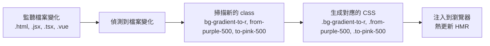
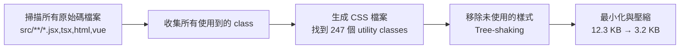
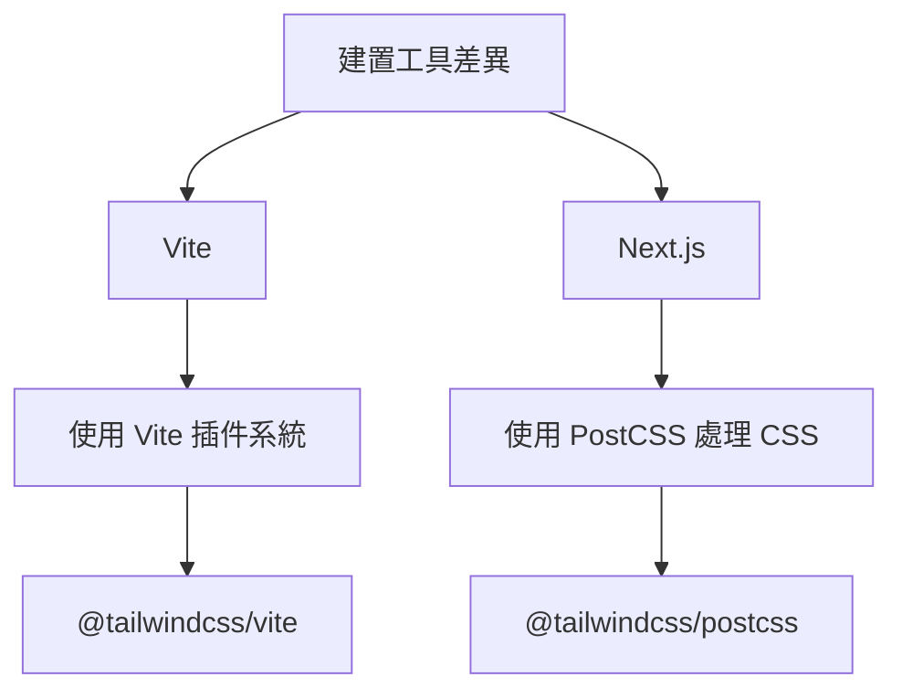

<!-- truncate -->

> 本文是「使用 shadcn/ui 前該補的 TailwindCSS 基礎知識」系列文章的第二篇
>
> **系列文章：**
>
> 1. [從 MUI 到 TailwindCSS 設計哲學的轉變](https://notes.boshkuo.com/blog/tailwindcss-knowledge-before-shadcn-ui-1)
> 2. **理解 TailwindCSS 的運作原理（本篇）**
> 3. TailwindCSS v4 基礎語法速查
> 4. 深入 TailwindCSS v4 的進階配置
> 5. shadcn/ui 生態系工具鏈

## **核心套件：tailwindcss**

到目前為止，你可能會有個疑問：「照理來說瀏覽器根本看不懂 `bg-blue-500` 這種 class 啊？它到底是怎麼變成真正的 CSS 的？」

這個問題的答案就藏在 TailwindCSS 的核心套件 `tailwindcss` 中。這個套件是 TailwindCSS 的核心引擎，負責：

- 解析你的 HTML/JSX/TSX 檔案
- 掃描所有使用到的 class 名稱
- 生成對應的 CSS 規則

```tsx
// TailwindCSS 會掃描這個檔案
function Card() {
  return (
    <div className="bg-white rounded-lg p-4 shadow-md">
      {/* TailwindCSS 看到：bg-white, rounded-lg, p-4, shadow-md */}
      <h2 className="text-xl font-bold">標題</h2>
      {/* TailwindCSS 看到：text-xl, font-bold */}
    </div>
  );
}
```

然後生成對應的 CSS：

```css
.bg-white {
  background-color: #fff;
}
.rounded-lg {
  border-radius: 0.5rem;
}
.p-4 {
  padding: 1rem;
}
.shadow-md {
  box-shadow: 0 4px 6px -1px rgba(0, 0, 0, 0.1);
}
.text-xl {
  font-size: 1.25rem;
  line-height: 1.75rem;
}
.font-bold {
  font-weight: 700;
}
```

這就是 TailwindCSS 的核心工作：**將 utility class 名稱轉換成真正的 CSS 規則**。但這個轉換過程是如何發生的呢？在探究這個問題之前我們需要先理解 TailwindCSS 與 PostCSS 的關係。

<br/>

## **PostCSS 與 TailwindCSS 的關係**

PostCSS 是什麼？簡單來說，它是「CSS 的 Babel」。

> **Babel** 的角色：將現代 JavaScript 轉換成瀏覽器能理解的 JavaScript
> **PostCSS** 的角色：將現代 CSS（或特殊語法）轉換成瀏覽器能理解的 CSS

而 TailwindCSS 其實本質上就是一個 PostCSS 插件。讓我們看看處理流程：


實際範例：

```css
/* src/index.css - 輸入 */
@import "tailwindcss";

@theme {
  --color-primary: oklch(0.6171 0.1375 39.0427);
}
```

PostCSS + TailwindCSS 處理後：

```css
/* 輸出 - 瀏覽器能理解的 CSS */
:root {
  --color-primary: oklch(0.6171 0.1375 39.0427);
}

.bg-primary {
  background-color: var(--color-primary);
}

.text-primary {
  color: var(--color-primary);
}

/* ... 其他使用到的 utility classes */
```

<br/>

## **JIT 引擎：Just-In-Time 編譯**

理解了 PostCSS 與 TailwindCSS 的關係後，現在我們可以來繼續探索更關鍵的問題：**當專案中有成千上萬個可能的 utility class 時，TailwindCSS 如何知道該生成哪些 CSS？**

TailwindCSS 使用 **JIT (Just-In-Time) 即時編譯引擎** 來解決這個問題。簡單來說，它會在你開發和打包時掃描程式碼，找出實際用到的 class，再即時生成對應的 CSS。讓我們看看它在不同階段是怎麼運作的。

### **開發階段 (Development) - 即時掃描與生成**

在開發模式下，JIT 引擎會監聽檔案變化（如  `.html`、`.jsx`、`.tsx`、`.vue`  等），即時掃描新的 class 並立即生成對應的 CSS。

```tsx
// 你在開發時新增了一個元件
function NewComponent() {
  return (
    <div className="bg-gradient-to-r from-purple-500 to-pink-500">
      {/* JIT 引擎立即偵測到這些 class */}
      漸層背景
    </div>
  );
}
```

**JIT 引擎的處理流程：**



```css
/* 生成的 CSS */
.bg-gradient-to-r {
  background-image: linear-gradient(to right, ...);
}
.from-purple-500 {
  --tw-gradient-from: #a855f7;
}
.to-pink-500 {
  --tw-gradient-to: #ec4899;
}
```

:::tip[**JIT 的優勢：**]

- **快速**：只生成你用到的 CSS，不會產生幾 MB 的完整 CSS 檔
- **精準**：支援任意值，如  `w-[237px]`、`bg-[#1da1f2]`
- **即時**：修改 class 後立即看到效果
  :::

### **打包階段 (Build) - 最終掃描與最佳化**

在打包時，JIT 引擎會掃描所有原始碼檔案，收集所有使用到的 class，然後生成最小化的 CSS 檔案並移除未使用的樣式。

```bash
npm run build
```

**JIT 引擎的處理流程：**



:::warning[**重點提醒：**]
 JIT 引擎只會掃描「靜態的 class 名稱」。以下寫法會導致樣式遺失：

❌ **錯誤做法**：動態組合 class 名稱

```tsx
// JIT 引擎看不到完整的 class 名稱const color = 'blue';
<div className={`bg-${color}-500`}>  // ❌ 不會生成 bg-blue-500
```

✅ **正確做法**：使用完整的 class 名稱

```tsx
// 方法 1：條件判斷
<div className={color === 'blue' ? 'bg-blue-500' : 'bg-red-500'}>

// 方法 2：使用物件映射const colorMap = {
  blue: 'bg-blue-500',
  red: 'bg-red-500',
};
<div className={colorMap[color]}>
```

:::

<br/>

## **在不同環境中配置 TailwindCSS**

理解了 TailwindCSS 的運作原理後，讓我們看看如何在實際專案中配置它。不同的建置工具（Vite、Next.js）有不同的整合方式，這是因為它們背後的  **CSS 處理機制**略有不同。



### **Vite 專案配置**

Vite 有自己的插件系統，可以直接處理 CSS 轉換。因此 TailwindCSS 提供了專用的 Vite 插件。

**安裝套件：**

```bash
npm install -D tailwindcss @tailwindcss/vite
```

- `tailwindcss`：核心引擎
- `@tailwindcss/vite`：Vite 插件，將 TailwindCSS 整合進 Vite 的建置流程

`vite.config.ts`：

```tsx
import tailwindcss from "@tailwindcss/vite";
import { defineConfig } from "vite";

export default defineConfig({
  plugins: [
    react(),
    tailwindcss(), // 直接作為 Vite 插件
  ],
});
```

`src/index.css`：

```css
@import "tailwindcss";
```

### **Next.js 專案配置**

Next.js 使用 PostCSS 來處理 CSS（包括內建的 CSS Modules、Autoprefixer、CSS-in-JS 等）。因此 TailwindCSS 需要作為 PostCSS 插件來整合。

**安裝套件：**

```bash
npm install -D tailwindcss @tailwindcss/postcss
```

- `tailwindcss`：核心引擎
- `@tailwindcss/postcss`：PostCSS 插件，將 TailwindCSS 整合進 PostCSS 處理流程

`postcss.config.mjs：`

```jsx
export default {
  plugins: {
    "@tailwindcss/postcss": {}, // 作為 PostCSS 插件
  },
};
```

`app/globals.css：`

```css
@import "tailwindcss";
```

## **Reference**

- **[TailwindCSS Official Documentation](https://tailwindcss.com/docs)**
- **[PostCSS Documentation](https://postcss.org/)**
- **[Vite Documentation](https://vitejs.dev/)**
- **[Next.js Documentation - CSS Support](https://nextjs.org/docs/app/building-your-application/styling/css)**
- **[JIT Mode in TailwindCSS](https://tailwindcss.com/docs/just-in-time-mode)**
