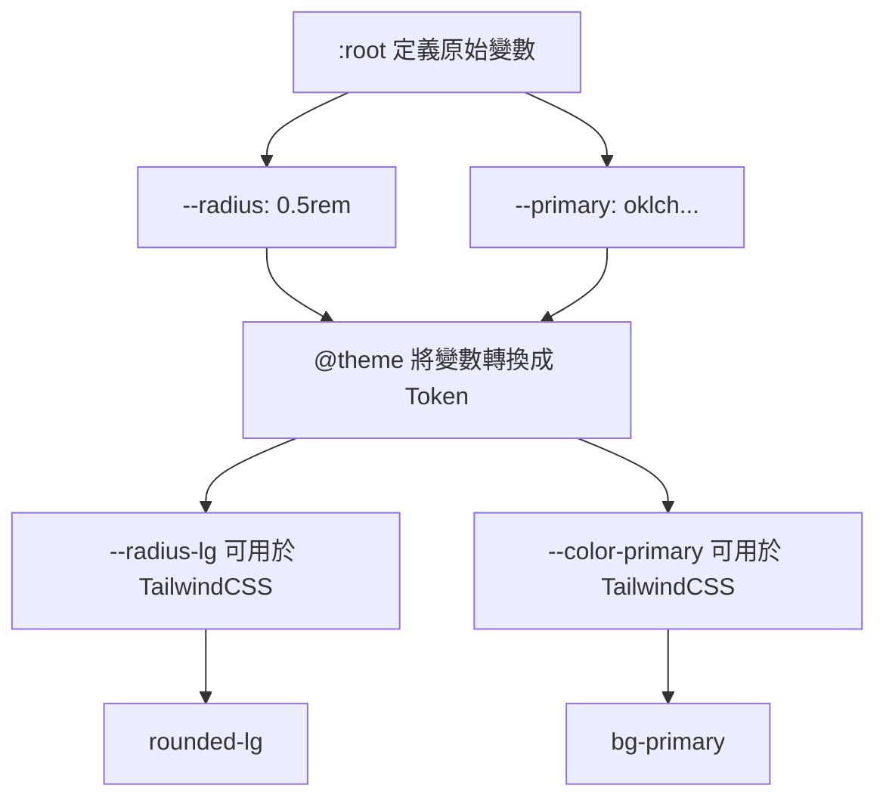

<!-- truncate -->

> 本文是「使用 shadcn/ui 前該補的 TailwindCSS 基礎知識」系列文章的第四篇
>
> **系列文章：**
>
> 1. [從 MUI 到 TailwindCSS 設計哲學的轉變](https://notes.boshkuo.com/blog/tailwindcss-knowledge-before-shadcn-ui-1)
> 2. [理解 TailwindCSS 的運作原理](https://notes.boshkuo.com/blog/tailwindcss-knowledge-before-shadcn-ui-2)
> 3. [TailwindCSS v4 基礎語法速查](https://notes.boshkuo.com/blog/tailwindcss-knowledge-before-shadcn-ui-3)
> 4. **深入 TailwindCSS v4 的進階配置（本篇）**
> 5. shadcn/ui 生態系工具鏈

在前三篇文章中，我們已經理解了從 MUI 到 TailwindCSS 的設計哲學轉變、TailwindCSS 的運作原理，以及基礎語法的使用方式。現在，是時候深入探討 TailwindCSS v4 的進階配置了。

本篇文章將以 shadcn/ui 範例程式碼的 `index.css` 或 `globals.css` 為例，解析 TailwindCSS v4 的進階語法，如：`@theme inline`、`@layer`、`@custom-variant`，並介紹亮暗模式的實現原理。


## **@theme：定義設計 Token**

### **什麼是 Design Token？**

在 shadcn/ui 範例程式碼的 `index.css` 或 `globals.css` 中，經常會看到類似這樣的程式碼：

```css
@theme inline {
  --color-primary: var(--primary);
  --radius-lg: var(--radius);
}

:root {
  --primary: oklch(0.6171 0.1375 39.0427);
  --radius: 0.5rem;
}

.dark {
  --primary: oklch(0.8 0.15 250);
}
```

剛開始用 shadcn/ui 時，我大概能猜得到 `:root` 和 `.dark` 是在定義主題變數，但還是有幾個疑問：

- `@theme inline` 是什麼？看起來也挺像主題變數的，跟 `:root` 有什麼差別？
- 這些變數如何變成 TailwindCSS 的 utility class？

這些變數其實就是 **Design Token**，它就像是設計系統的「變數庫」。在設計一個網站時，會需要定義：

- 主色調、次要色調
- 不同大小的間距
- 統一的圓角大小
- 陰影效果

這些都可以定義成 Token，然後在整個專案中重複使用。`@theme` 就是 TailwindCSS v4 提供的工具，用來將這些 Design Token 轉換成可用的 utility class。

### **@theme 的基本語法與使用方式**

以下是一段範例程式碼：

```css
@theme inline {
  --radius-sm: calc(var(--radius) - 4px);
  --radius-md: calc(var(--radius) - 2px);
  --radius-lg: var(--radius);
  --radius-xl: calc(var(--radius) + 4px);

  --color-primary: var(--primary);
  --color-secondary: var(--secondary);
  --color-destructive: var(--destructive);
}

:root {
  --radius: 0.5rem;
  --primary: oklch(0.6171 0.1375 39.0427);
  --secondary: oklch(0.9245 0.0138 92.9892);
}
```

這段程式碼做了什麼？



### **Token 轉換成 Utility Class 的規則**

從上面的例子我們可以看出，定義了 `--color-primary` 後，在 React 或 HTML 中就可以使用 `bg-primary`。這背後有一套明確的命名轉換規則。

:::tip
關於各種 Token 類型的詳細用法，可以參考 [TailwindCSS v4 官方文件 - Theme](https://tailwindcss.com/docs/v4-beta#theme) 以及本系列的第三篇文章：[TailwindCSS v4 基礎語法速查](https://notes.boshkuo.com/blog/tailwindcss-knowledge-before-shadcn-ui-3)。
:::


**規則 1：移除類型前綴**

Token 名稱的類型前綴（如 `--color-`、`--spacing-`、`--radius-` 等）在轉換成 utility class 時會被移除，只保留語意名稱。

**規則 2：配合屬性前綴使用**

不同的 CSS 屬性有不同的 TailwindCSS 前綴，需要搭配使用：

| Token 類型 | 定義範例                | 使用方式                                 |
| ---------- | ----------------------- | ---------------------------------------- |
| 顏色       | `--color-brand`         | `bg-brand`、`text-brand`、`border-brand` |
| 間距       | `--spacing-lg`          | `p-lg`、`m-lg`、`gap-lg`                 |
| 圓角       | `--radius-card`         | `rounded-card`                           |
| 寬度       | `--width-sidebar`       | `w-sidebar`、`min-w-sidebar`             |
| 高度       | `--height-header`       | `h-header`、`max-h-header`               |
| 字型       | `--font-family-heading` | `font-heading`                           |
| 字體大小   | `--font-size-xl`        | `text-xl`                                |
| 字重       | `--font-weight-bold`    | `font-bold`                              |
| 陰影       | `--shadow-card`         | `shadow-card`                            |
| 透明度     | `--opacity-soft`        | `opacity-soft`                           |

**實際範例：**

```css
/* 在 index.css 定義 */
@theme inline {
  --color-brand: #ff6b6b;
  --spacing-card: 1.5rem;
  --radius-button: 0.375rem;
  --font-family-heading: 'Inter', sans-serif;
  --font-size-xl: 1.25rem;
  --shadow-elevated: 0 4px 6px rgba(0, 0, 0, 0.1);
  --width-sidebar: 16rem;
}
```

```tsx
// 在 React/HTML 中使用
function Card() {
  return (
    <div className="
      bg-brand              {/* --color-brand */}
      p-card                {/* --spacing-card */}
      rounded-button        {/* --radius-button */}
      shadow-elevated       {/* --shadow-elevated */}
      w-sidebar             {/* --width-sidebar */}
    ">
      <h1 className="font-heading text-xl">  {/* --font-family-heading, --font-size-xl */}
        標題
      </h1>
    </div>
  );
}
```

:::info[圓角的命名差異]

圓角的轉換規則有一個特別之處：Token 定義時使用 `--radius-`，但對應的 utility class 前綴是 `rounded-`：

- `--radius-lg` → `rounded-lg`（Token 用 `radius`，utility 用 `rounded`）
- `--radius-button` → `rounded-button`

這與其他 Token 不同，例如顏色：

- `--color-primary` → `bg-primary`（都是 `color` 相關）
:::


<br/>


## **@theme inline：inline 關鍵字的作用**

在前面的範例中，我們看到的都是 `@theme inline`，而不是單純的 `@theme`。這兩者之間的差異在於是否保留 CSS 變數的動態特性，而這個差異將會直接影響了暗色模式等主題切換功能的實現（會在後面的「方法二：使用語意化顏色」章節中詳細介紹）。

### **inline 關鍵字的作用：保留動態特性**

`inline` 這個關鍵字非常重要，它告訴 Tailwind：「這些主題變數的值是『動態的』，它們的值會在瀏覽器執行時 (runtime) 透過引用其他 CSS 變數來決定，而不是在編譯時 (build time) 就固定下來。」

讓我們用實際範例來理解：

**不加 `inline` 的情況：**

```css
/* 定義 */
@theme {
  --color-primary: var(--primary);
}

:root {
  --primary: oklch(0.6171 0.1375 39.0427);
}

.dark {
  --primary: oklch(0.8 0.15 250);
}
```

TailwindCSS 在編譯時會生成：

```css
:root {
  --color-primary: var(--primary); /* 編譯出的全域變數 */
}

.bg-primary {
  background-color: var(--color-primary); /* utility 使用上面的 --color-primary */
}
```

這樣做的問題是，`--color-primary` 的值在 `:root` 層級就被「鎖定」了。當在深層的 `.dark` 選擇器中改變 `--primary` 的值時（關於 `.dark` 的原理後面會詳細說明），`--color-primary` 可能無法即時反應這個變化，導致 `bg-primary` 拿到的仍然是舊的值。

**加上 `inline` 的情況：**

```css
/* 定義 */
@theme inline {
  --color-primary: var(--primary);
}

:root {
  --primary: oklch(0.6171 0.1375 39.0427);
}

.dark {
  --primary: oklch(0.8 0.15 250);
}
```

TailwindCSS 會跳過中間的 `--color-primary` 變數，直接讓 utility class 引用你指定的語意變數：

```css
.bg-primary {
  background-color: var(--primary); /* 沒有中繼的 --color-primary，直接引用 --primary */
}
```

這樣一來，`--primary` 的值在任何層級被改動（無論是 `.dark`、`[data-theme="..."]`，甚至是某個特定的元件容器），`bg-primary` 都會即時地、正確地反映出最新的顏色。


<br/>


## **實作亮暗主題 - 方法一：使用 dark: 前綴**

在理解了 `@theme inline` 的運作原理後，接下來探討如何實作完整的亮暗主題切換功能。

在 TailwindCSS 中，有**兩種主要方式**實現亮暗主題：

1. **方法一：使用 `dark:` 前綴**（需要為每個樣式寫兩次）
2. **方法二：使用語意化顏色**（自動適應，推薦）

:::tip
關於暗色模式的基本用法，可以參考本系列的第三篇文章：[TailwindCSS v4 基礎語法速查 - 暗色模式](https://notes.boshkuo.com/blog/tailwindcss-knowledge-before-shadcn-ui-3#%E6%9A%97%E8%89%B2%E6%A8%A1%E5%BC%8F)。本篇將深入探討其背後的實現原理。
:::


本章節介紹的**方法一**需要為每個樣式明確指定亮色和暗色兩種狀態。

**使用方式：**

```html
<div class="bg-white dark:bg-gray-800 text-gray-900 dark:text-white">
  需要為每個樣式寫兩次
</div>
```

關鍵就在 `dark:` 這個前綴，我們稱之為**變體 (Variant)**。它就像一個條件觸發器，意思是：「當『dark』這個條件成立時，才套用後面的樣式」。

:::info[常見的變體有:]
- `hover:` → 滑鼠 hover 狀態才套用
- `focus:` → 元件被 focus 才套用
- `dark:` → 在 `.dark` 主題下才套用
:::

> 那麼，這個叫做 dark 的條件到底是什麼？這就需要我們親自來定義它。
>


### **用 @custom-variant 定義 dark: 變體**

Tailwind v4 提供了 `@custom-variant` 工具，可以自訂變體。要定義 `dark:` 變體，需要在 CSS 中加上這一行：

```css
@custom-variant dark (&:is(.dark *)); /* shadcn 預設定義 */
```

我們把它拆解成三個部分來看：

1. **`@custom-variant`**：這是告訴 Tailwind：「我要創造一個新的變體了！」
2. **`dark`**：這是你為這個變體取的名字。因為我們取名為 `dark`，所以之後就能用 `dark:`。如果你把它取名為 `night-mode`，那你之後就要寫 `night-mode:bg-primary`。
3. **`(&:is(.dark *))`**：這是最關鍵的觸發規則，它在定義 CSS 選擇器。把它翻譯成白話文就是：「當我這個元素（`&`）被放在任何一個帶有 `.dark` class 的祖先元素裡面時」。

### **背後的編譯原理**

當寫下 `dark:bg-foreground dark:text-background` 時，背後的編譯流程如下：

**1. Tailwind 編譯基本的 utility class**

當 Tailwind 看到 `bg-background text-foreground`，它會根據 `@theme` 的設定產生基本的 utility class：

```css
.bg-background { background-color: var(--color-background); }
.text-foreground { color: var(--color-foreground); }
```

**2. Tailwind 編譯 dark: 變體**

當 Tailwind 看到 `dark:bg-foreground dark:text-background`，它會去查找叫做 `dark` 的變體。它找到了你用 `@custom-variant` 定義的規則 `(&:is(.dark *))`。於是，它會把這個規則和 utility class 結合起來，產生一個新的、帶有條件的 class：

```css
/* dark 變體展開後 → 等價於加上 .dark 包起來 */
.dark .dark\:bg-foreground { background-color: var(--color-foreground); }
.dark .dark\:text-background { color: var(--color-background); }
```

這個新選擇器 `.dark .dark\:bg-foreground` 的意思是：「只有當一個元素同時擁有 `dark:bg-foreground` 這個 class，『並且』它是 `.dark` 元素的後代時，這個樣式才會生效。」

### **為什麼要用 &:is(.dark \*) 而不是 .dark &？**

這是一個很重要的細節！`&:is(.dark *)` 允許 `.dark` class 在元素的**任何祖先層級**，而不是只能在直接父層。

```tsx
// ✅ 使用 &:is(.dark *)
<html className="dark">
  <body>
    <div>
      <div className="dark:bg-gray-900">
        {/* ✅ 會生效，因為 .dark 是祖先元素 */}
      </div>
    </div>
  </body>
</html>
```

### **在 React 中控制亮暗主題**

在 React 中，可以透過控制 `<html>` 元素的 `.dark` class 來切換主題：

```tsx
import { useState, useEffect } from "react"

export default function App() {
  const [dark, setDark] = useState(false)

  useEffect(() => {
    document.documentElement.classList.toggle("dark", dark)
  }, [dark])

  return (
    <div className="min-h-screen grid place-items-center">
      <button
        className="px-4 py-2 rounded-md bg-white dark:bg-gray-800 text-gray-900 dark:text-white"
        onClick={() => setDark(d => !d)}
      >
        切換 {dark ? "Light" : "Dark"}
      </button>
    </div>
  )
}
```

**完整流程：**

```
1. 用 @custom-variant 定義 dark: 變體
2. 在元件中為每個樣式寫兩次（一次亮色，一次 dark: 暗色）
3. 用 JavaScript 控制 <html> 的 .dark class
```


<br/>


## **實作亮暗主題 - 方法二：使用語意化顏色（推薦）**

這是 shadcn/ui 採用的方法，也是前面「@theme inline：inline 關鍵字的作用」章節介紹的 `@theme inline` 與 `:root`/`.dark` 分工的實際應用。這種方法只需要定義一次樣式，顏色會自動適應主題。

**設定方式：**

```css
/* index.css */@theme inline {
  --color-background: var(--background);
  --color-foreground: var(--foreground);
}

:root {
  --background: white;/* 亮色模式的背景色 */
  --foreground: black;/* 亮色模式的文字色 */
}

.dark {
  --background: #1a1a1a;/* 暗色模式的背景色 */
  --foreground: white;/* 暗色模式的文字色 */
}
```

**使用方式：**

```tsx
<div className="bg-background text-foreground">
  自動適應亮暗主題，不需要 dark: 前綴
</div>
```

之所以可以這樣自動切換，其原理就是前面 [@theme inline：inline 關鍵字的作用](#theme-inlineinline-關鍵字的作用) 章節所介紹的內容。


### **@theme inline 與 :root/.dark 的分工**

在這個設計中，Design Token 的定義分成兩層：

**第一層：`:root` 和 `.dark` 定義原始值**

```css
:root {
  --background: white;/* 亮色模式的背景色 */
  --foreground: black;/* 亮色模式的文字色 */
}

.dark {
  --background: #1a1a1a;/* 暗色模式的背景色 */
  --foreground: white;/* 暗色模式的文字色 */
}
```

這些是 **CSS 變數**，只能用 `var(--background)` 的方式在 CSS 中使用，**不能直接用於 TailwindCSS class**。

**第二層：`@theme inline` 將原始值轉換成 TailwindCSS Token**

```css
@theme inline {
  --color-background: var(--background); /* 將 --background 轉換成 TailwindCSS 可用的 Token */
  --color-foreground: var(--foreground);
}
```

這些是 **TailwindCSS Token**，可以直接用於 utility class：

```tsx
// ✅ 可以使用
<div className="bg-background text-foreground">

// ❌ 不能這樣用（--background 不是 TailwindCSS Token）
<div className="bg-[var(--background)]">
```


這種分層設計的好處是：

1. **在 `:root`/`.dark` 中切換主題值**（例如暗色模式）
2. **在 `@theme inline` 中定義 TailwindCSS Token**
3. **Token 會自動反映主題值的變化**

:::tip[關鍵在於 `inline`]
因為使用了 `@theme inline`，TailwindCSS 會保留 CSS 變數的動態特性，讓 utility class 直接引用 `var(--background)` 而不是固定的值。這樣當 `.dark` class 覆蓋 CSS 變數時，utility class 就能自動反映新的值。
:::

**實際運作流程：**

```
亮色模式：
<body>
  <div class="bg-background">
    → 讀取 var(--background)
    → 找到 :root { --background: white }
    → 顯示白色

暗色模式：
<body class="dark">
  <div class="bg-background">
    → 讀取 var(--background)
    → 找到 .dark { --background: #1a1a1a }（覆蓋 :root 的值）
    → 顯示深灰色
```

### **在 React 中控制主題**

在 React 中，可以透過控制 `<html>` 元素的 `.dark` class 來切換主題：

```tsx
import { useState, useEffect } from "react"

export default function App() {
  const [dark, setDark] = useState(false)

  useEffect(() => {
    document.documentElement.classList.toggle("dark", dark)
  }, [dark])

  return (
    <div className="min-h-screen grid place-items-center">
      <button
        className="px-4 py-2 rounded-md bg-primary text-primary-foreground"
        onClick={() => setDark(d => !d)}
      >
        切換 {dark ? "Light" : "Dark"}
      </button>
    </div>
  )
}
```

**完整流程：**

```
1. 在 :root 和 .dark 中定義原始顏色值
2. 用 @theme inline 將變數轉換成 TailwindCSS Token
3. 在元件中使用語意化的 utility class（如 bg-background）
4. 用 JavaScript 控制 <html> 的 .dark class
```


<br/>


## **@layer：組織樣式**

`@layer` 讓你可以控制樣式的優先順序，並且組織自訂的 CSS。

### **TailwindCSS 的三個層級**

TailwindCSS 將 CSS 分成三個層級：

```css
@layer base {
/* 基礎樣式：重置、預設樣式 */
}

@layer components {
/* 元件樣式：可重複使用的元件 class */
}

@layer utilities {
/* 工具樣式：單一用途的 utility class */
}
```

**層級優先順序：**

```
utilities > components > base
```

### **實務範例：@layer base 的應用**

```css
@layer base {
  * {
    @apply border-border outline-ring/50;
  }
  body {
    @apply bg-background text-foreground;
  }
}
```

這段程式碼做了什麼？

1. **所有元素（*）**：
    - 預設邊框顏色使用 `border-border`
    - 預設 outline 顏色使用 `outline-ring/50`（50% 透明度）
2. **body 元素**：
    - 背景色使用 `bg-background`
    - 文字顏色使用 `text-foreground`

**@apply 指令：**

`@apply` 讓你可以在 CSS 中使用 TailwindCSS 的 utility classes：

```css
.my-button {
  @apply bg-blue-500 text-white px-4 py-2 rounded hover:bg-blue-600;
}
```

### **什麼時候使用 @layer？**

三個層級的使用時機可以用「**你想要改變什麼？**」來判斷：

**@layer base：改變 HTML 元素的預設樣式**

**使用時機：** 當你想要改變「所有 `<h1>`」、「所有 `<a>`」、「所有 `<body>`」等 **HTML 元素本身** 的預設外觀時。

**特徵：**

- 針對 HTML 標籤（`h1`, `body`, `a`,  等）
- 全域生效，影響整個網站
- 通常在專案初期設定一次就不再修改

**範例：**

```css
@layer base {
/* 設定所有 h1 的預設樣式 */
  h1 {
    @apply text-4xl font-bold;
  }

/* 設定所有連結的預設樣式 */
  a {
    @apply text-blue-500 hover:underline;
  }

/* 設定所有元素的預設邊框和 outline */
  * {
    @apply border-border outline-ring/50;
  }
}
```

**實際效果：** 之後在 HTML 中寫 `<h1>標題</h1>`，就會自動套用 `text-4xl font-bold`，不需要額外加 class。

---

**@layer components：建立可重複使用的元件 class**

**使用時機：** 當你有一組樣式需要在多個地方重複使用，並且這組樣式代表一個「元件」（如按鈕、卡片）時。

**特徵：**

- 針對自訂的 class 名稱（`.btn-primary`, `.card` 等）
- 需要在 HTML 中手動加上 class 才會生效
- 通常用於建立設計系統中的元件

**範例：**

```css
@layer components {
  .btn-primary {
    @apply bg-blue-500 text-white px-4 py-2 rounded hover:bg-blue-600;
  }

  .card {
    @apply bg-white rounded-lg shadow-md p-6;
  }
}
```

**使用方式：**

```html
<button class="btn-primary">按鈕</button>
<div class="card">卡片內容</div>
```

:::warning[注意]
在現代的 TailwindCSS 開發中，通常**不建議過度使用 @layer components**。因為這會失去 Utility-First 的優勢。更好的做法是直接在 React/Vue 元件中組合 utility classes，或使用 CVA（下一篇文章會介紹）。
:::

---

**@layer utilities：建立自訂的 utility class**

**使用時機：** 當 TailwindCSS 內建的 utility class 不夠用，你需要新增一個「單一用途」的工具類別時。

**特徵：**

- 針對自訂的 utility class（`.text-balance`, `.scrollbar-hide` 等）
- 每個 class 只做一件事（單一職責）
- 用來擴充 TailwindCSS 的工具類別

**範例：**

```css
@layer utilities {
/* 新增文字平衡排版 */
  .text-balance {
    text-wrap: balance;
  }

/* 新增隱藏捲軸的工具 */
  .scrollbar-hide {
    -ms-overflow-style: none;
    scrollbar-width: none;
  }

  .scrollbar-hide::-webkit-scrollbar {
    display: none;
  }
}
```

**使用方式：**

```html
<h1 class="text-balance">這段標題會使用平衡排版</h1>
<div class="overflow-auto scrollbar-hide">捲動區域，但不顯示捲軸</div>
```

---

**快速判斷表**

| 我想要...                        | 使用哪個 layer                            | 範例                                      |
| -------------------------------- | ----------------------------------------- | ----------------------------------------- |
| 改變所有 `<h1>` 的預設樣式       | `@layer base`                             | `h1 { @apply text-4xl; }`                 |
| 建立一個按鈕元件 class           | `@layer components`                       | `.btn { @apply px-4 py-2; }`              |
| 新增一個工具 class（如隱藏捲軸） | `@layer utilities`                        | `.scrollbar-hide { ... }`                 |
| 在 React 元件中組合樣式          | **不使用 @layer**，直接用 utility classes | `<div className="px-4 py-2 bg-blue-500">` |


<br/>


## **Reference**

- [**TailwindCSS v4 Beta Documentation**](https://tailwindcss.com/docs/v4-beta)
- [**Theme Configuration - @theme**](https://tailwindcss.com/docs/v4-beta#theme)
- [**Custom Variants - @custom-variant**](https://tailwindcss.com/docs/v4-beta#custom-variants)
- [**Layers - @layer**](https://tailwindcss.com/docs/v4-beta#layers)
- [**Dark Mode**](https://tailwindcss.com/docs/dark-mode)