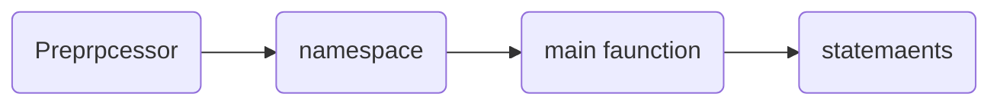

:::note
本文為 2021-Fall 學期旁聽台大資管系孔令傑教授開授的 **[Programming Design](http://www.im.ntu.edu.tw/~lckung/courses/public/PD/)** 所記錄的課程筆記。課程內容程式碼可以參閱我的 Github repo: **[C++ Programming-Design-2021-Fall
](https://github.com/Bosh-Kuo/Cplusplus-Programming-Design-2021-Fall)**
:::


## **C++ Program 執行階段**


<!-- more -->

```cpp
#include <iostream>  
using namespace std;
int main()
{
    //statement
    return 0;
}
```

```cpp
#include <iostream>  
int main()
{
    //scope resolution operator(::)
    std::cout << " Hello world!";
    return 0;
}
```


- *preprocessor*: `#`，開始於`#include`<標頭檔>（package)，在compiler編譯之前執行一些指令
- *header file*: 標頭檔，記錄一些通用得變數與函數的定義
    - `<iostream>`: 為一標頭檔header file，此為C++標準libary，cout,cin皆為iostream定義的變數
    - `#include "路徑"`：引進自己寫的函式
    - `# include <***>`: compiler在C++ standard library搜尋"***"(套件名)，並引入
- *namespace*: 命名空間：裝變數、函數、物件名稱的空間，程式執行時compiler會搜尋所看到的名稱是否定義於程式中或者是std namespace中
- *scope resolution operator(::)*: 範疇解析運算子，用上面程式碼舉例，目的為告訴compiler我現在使用的cout是裝在std命名空間裡的cout


## **Ternary if operator**

```C++
condition ? operation A : operation B
```
If `condition` is true do `operation A` otherwise do `operation B`


## **swich-case statement**

```cpp
swich (operator)
{
    case value1:
        statements
        break;
    case value2:
        statements
        break;
    ...
    default:
        statements
        break;
}
```
- `value` 只能回傳整數
- 不需要用大括號，用`:` 與 `case value`分段


## **Reference**
- [IM 1003 Programming Design](http://www.im.ntu.edu.tw/~lckung/courses/public/PD/)


