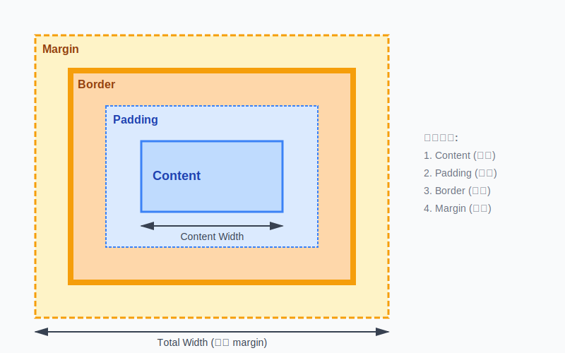
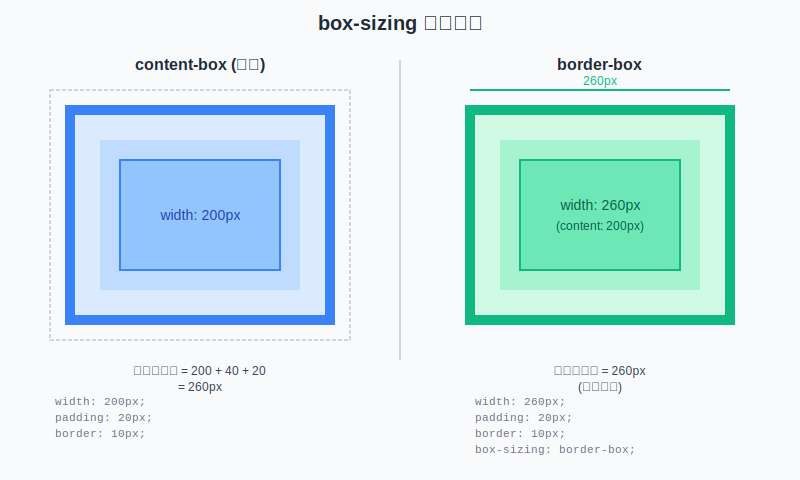
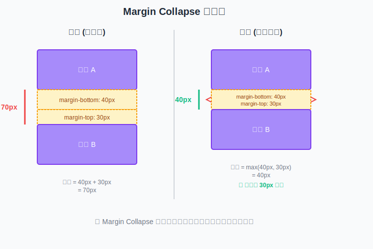

import {
BoxModelVisualization,
BoxSizingComparison,
MarginCollapseDemo
} from '@site/src/components/ExampleComponents/BoxModel';

## **Box Model 基本概念**

CSS Box Model（盒模型）是所有網頁佈局的核心，它決定了每個 HTML 元素在頁面上「如何計算大小」以及「如何占據空間」。要能確實掌握 CSS 佈局，理解 Box Model 幾乎是第一個必學的概念。它會影響我們如何設定寬度高度、如何排版、如何避免元素之間互相擠壓或重疊。

### **Box Model 的組成**

每個 HTML 元素都可以看作一個矩形盒子，這個盒子由四個部分組成(從內到外):



1. **Content (內容區域)**: 實際顯示內容的區域，如文字、圖片等
2. **Padding (內距)**: 內容與邊框之間的空間，背景色會延伸到 padding 區域
3. **Border (邊框)**: 圍繞在 padding 外圍的邊框線
4. **Margin (外距)**: 元素與其他元素之間的空間，完全透明

## **互動式 Box Model 視覺化**

透過下方的互動元件，你可以即時調整各個屬性來觀察 Box Model 的變化:

<BoxModelVisualization />

## **Box Model 屬性詳解**

### **1. Content (內容區域)**

內容區域是元素實際顯示內容的地方，其大小由 `width` 和 `height` 屬性控制。

```css
.box {
  width: 300px;
  height: 200px;
}
```

:::tip[重點]

- `width` 和 `height` 預設只設定 content 區域的大小
- 可以使用各種單位:px、%、em、rem、vw、vh 等
- 預設值為 `auto`，會根據內容自動調整

:::

### **2. Padding (內距)**

Padding 是指元素內容與邊框（border）之間的內部距離，用來為內容預留空白，使版面更易閱讀、不至於過於擁擠。

```css
/* 四個方向相同 */
.box {
  padding: 20px;
}

/* 垂直 | 水平 */
.box {
  padding: 10px 20px;
}

/* 上 | 水平 | 下 */
.box {
  padding: 10px 20px 30px;
}

/* 上 | 右 | 下 | 左 (順時針) */
.box {
  padding: 10px 20px 30px 40px;
}

/* 個別設定 */
.box {
  padding-top: 10px;
  padding-right: 20px;
  padding-bottom: 30px;
  padding-left: 40px;
}
```

:::tip[重點]

- Padding 不能為負值
- 背景色和背景圖會延伸到 padding 區域
- Padding 會增加元素的總尺寸(在 content-box 模式下)

:::

### **3. Border (邊框)**

Border 是圍繞在 padding 外圍的邊框線，可以設定寬度、樣式和顏色。

```css
/* 簡寫語法 */
.box {
  border: 2px solid #3b82f6;
}

/* 完整設定 */
.box {
  border-width: 2px;
  border-style: solid; /* solid(實線), dashed(虛線), dotted(點線), double(雙線), none(無邊框) */
  border-color: #3b82f6;
}

/* 個別方向 */
.box {
  border-top: 1px solid red;
  border-right: 2px dashed blue; /* dashed: 虛線 */
  border-bottom: 3px dotted green; /* dotted: 點線 */
  border-left: 4px double orange; /* double: 雙線 */
}

/* 其他樣式: groove(3D凹槽), ridge(3D凸起), inset(3D內嵌), outset(3D外凸) */

/* 圓角邊框 */
.box {
  border-radius: 8px;
}
```

### **4. Margin (外距)**

Margin 是元素與其他元素之間的空間，完全透明且不受背景色影響。

```css
/* 四個方向相同 */
.box {
  margin: 20px;
}

/* 垂直 | 水平 */
.box {
  margin: 10px 20px;
}

/* 上 | 水平 | 下 */
.box {
  margin: 10px 20px 30px;
}

/* 上 | 右 | 下 | 左 (順時針) */
.box {
  margin: 10px 20px 30px 40px;
}

/* 個別設定 */
.box {
  margin-top: 10px;
  margin-right: 20px;
  margin-bottom: 30px;
  margin-left: 40px;
}

/* 水平置中 */
.box {
  margin: 0 auto;
}

/* 負值 margin */
.box {
  margin-top: -10px; /* 可以使用負值 */
}
```

:::tip[重點]

- Margin 可以為負值，用於重疊元素或調整位置
- `margin: 0 auto` 可以讓區塊元素水平置中(需要設定 width)
- 垂直方向的 margin 會發生折疊(margin collapse)

:::

## **Box Model 尺寸計算**

### **預設計算方式 (content-box)**

在預設的 `box-sizing: content-box` 模式下:

```
總寬度 = width + padding-left + padding-right + border-left + border-right + margin-left + margin-right
總高度 = height + padding-top + padding-bottom + border-top + border-bottom + margin-top + margin-bottom
```

**範例:**

```css
.box {
  width: 300px;
  padding: 20px;
  border: 5px solid black;
  margin: 10px;
}
```

計算結果:

- Content 寬度: 300px
- 盒子寬度(不含 margin): 300 + 40 + 10 = **350px**
- 總寬度(含 margin): 350 + 20 = **370px**

### **實際範例圖示**

```
┌──────────────────────────────────────────┐ ← 總寬度: 370px
│ Margin: 10px                             │
│ ┌────────────────────────────────────┐   │
│ │ Border: 5px                        │   │ ← 盒子寬度: 350px
│ │ ┌──────────────────────────────┐   │   │
│ │ │ Padding: 20px                │   │   │
│ │ │ ┌────────────────────────┐   │   │   │
│ │ │ │ Content: 300px         │   │   │   │ ← Content 寬度: 300px
│ │ │ └────────────────────────┘   │   │   │
│ │ └──────────────────────────────┘   │   │
│ └────────────────────────────────────┘   │
└──────────────────────────────────────────┘
```

## **box-sizing 屬性**

`box-sizing` 屬性改變了 `width` 和 `height` 的計算方式，是現代 CSS 佈局中非常重要的屬性。

### **content-box (預設值)**

```css
.box {
  box-sizing: content-box; /* 預設值 */
  width: 300px;
  padding: 20px;
  border: 5px solid black;
}
/* 實際寬度 = 300 + 40 + 10 = 350px */
```

- `width` 和 `height` 只設定 content 區域
- Padding 和 border 會額外增加總尺寸
- 這是 CSS 的預設行為

### **border-box (推薦使用)**

```css
.box {
  box-sizing: border-box;
  width: 300px;
  padding: 20px;
  border: 5px solid black;
}
/* 實際寬度 = 300px (固定) */
/* Content 寬度 = 300 - 40 - 10 = 250px */
```

- `width` 和 `height` 包含 content、padding 和 border
- 總尺寸固定，更容易控制佈局
- 現代開發中的最佳實踐

### **全域設定 border-box**

建議在專案開始時就設定全域的 `box-sizing`:

```css
/* 推薦的全域設定 */
*,
*::before,
*::after {
  box-sizing: border-box;
}
```

或使用繼承方式:

```css
html {
  box-sizing: border-box;
}

*,
*::before,
*::after {
  box-sizing: inherit;
}
```

### **互動式比較**

透過下方的互動元件，你可以直接比較兩種模式的差異:



<BoxSizingComparison />

:::tip[box-sizing 重點差異]

- `content-box`: `width` 只包含 content，padding、border 會額外疊加在總寬度上
- `border-box`: `width` 已包含 content、padding、border，總寬度固定不變
- 建議預設使用 `border-box`，佈局計算更直覺，也能避免元件寬度超出預期

:::

## **Margin Collapse (外距折疊)**

Margin collapse 是 CSS 中一個特殊的行為，當兩個垂直方向的 margin 相遇時，它們會合併成一個 margin。

### **發生條件**

Margin collapse 只在以下情況發生:

1. **垂直方向**: 只有上下 margin 會折疊，左右不會
2. **區塊級元素**: 只有 block-level 元素會發生
3. **相鄰元素**: 元素之間沒有 border、padding 或內容分隔

### **折疊規則**

當 margin collapse 發生時:

```
實際間距 = max(margin-bottom, margin-top)
```

:::tip[Margin Collapse 規則]

- 僅在垂直方向(上下)的區塊級元素之間折疊，水平方向不受影響
- 父元素與第一個/最後一個子元素也可能一起折疊
- 元素之間只要被 padding、border、內容或 BFC/Flexbox/Grid 分隔就能阻止折疊
- 折疊後的間距取多個值中的最大值

:::

**範例:**

```css
.box1 {
  margin-bottom: 40px;
}

.box2 {
  margin-top: 30px;
}

/* 實際間距 = max(40px, 30px) = 40px */
/* 而不是 40px + 30px = 70px */
```

### **視覺化示意圖**



### **三種 Margin Collapse 情況**

#### **1. 相鄰兄弟元素**

```html
<div class="box1">Box 1</div>
<div class="box2">Box 2</div>
```

```css
.box1 {
  margin-bottom: 30px;
}
.box2 {
  margin-top: 20px;
}
/* 實際間距: 30px (取較大值) */
```

#### **2. 父子元素**

```html
<div class="parent">
  <div class="child">Child</div>
</div>
```

```css
.parent {
  margin-top: 20px;
}
.child {
  margin-top: 30px;
}
/* 父元素的 margin-top 會與子元素的 margin-top 折疊 */
/* 實際 margin-top: 30px */
```

#### **3. 空元素**

```html
<div class="empty"></div>
```

```css
.empty {
  margin-top: 20px;
  margin-bottom: 30px;
}
/* 如果元素沒有 height、padding、border */
/* margin-top 和 margin-bottom 會折疊 */
/* 實際 margin: 30px */
```

### **如何防止 Margin Collapse**

有多種方法可以防止 margin collapse:

#### **1. 使用 Padding 或 Border**

```css
.parent {
  padding-top: 1px; /* 或 border-top: 1px solid transparent; */
}
```

#### **2. 建立 BFC (Block Formatting Context)**

```css
.parent {
  overflow: hidden; /* 或 auto */
}

.parent {
  display: flow-root; /* 現代方法 */
}

.parent {
  float: left; /* 或 right */
}

.parent {
  position: absolute; /* 或 fixed */
}
```

#### **3. 使用 Flexbox 或 Grid**

```css
.parent {
  display: flex;
  flex-direction: column;
}

.parent {
  display: grid;
}
```

Flexbox 和 Grid 容器內的子元素不會發生 margin collapse。

### **互動式示範**

<MarginCollapseDemo />

<br/>

## **Reference**

- **[MDN - Box Model](https://developer.mozilla.org/en-US/docs/Learn/CSS/Building_blocks/The_box_model)**
- **[MDN - box-sizing](https://developer.mozilla.org/en-US/docs/Web/CSS/box-sizing)**
- **[MDN - Mastering Margin Collapsing](https://developer.mozilla.org/en-US/docs/Web/CSS/CSS_box_model/Mastering_margin_collapsing)**
- **[CSS Tricks - Box Sizing](https://css-tricks.com/box-sizing/)**
- **[CSS 習作｜認識 Box Model 運作原理，padding 和 margin 的使用時機是什麼？](https://vocus.cc/article/648aad14fd89780001ab7850)**
