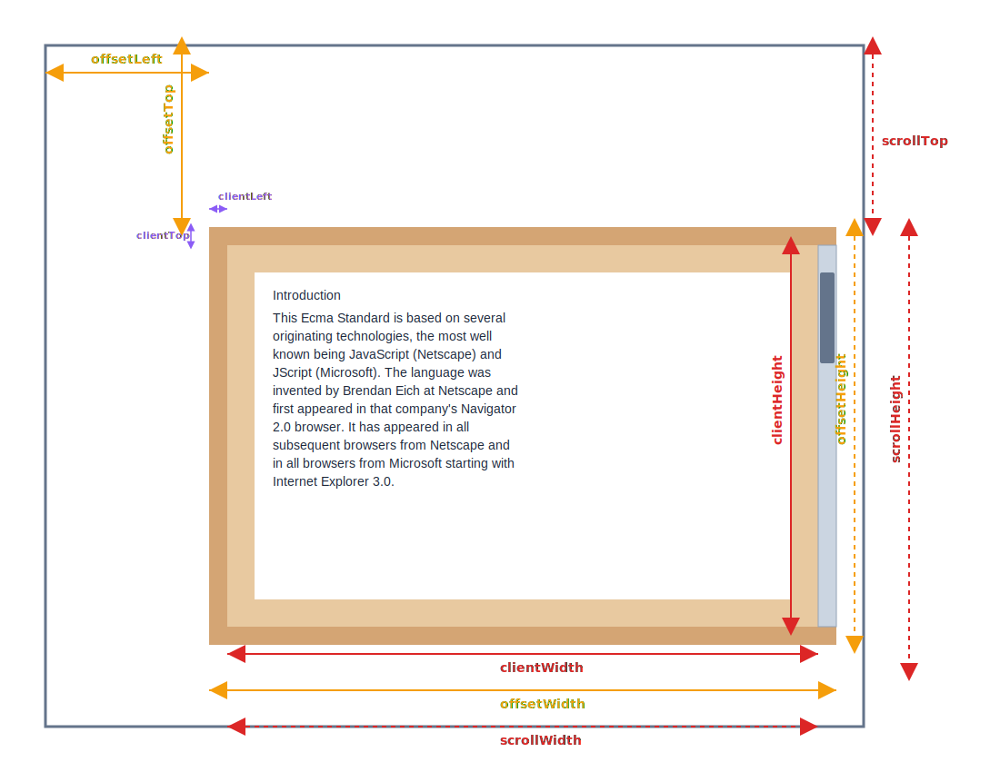
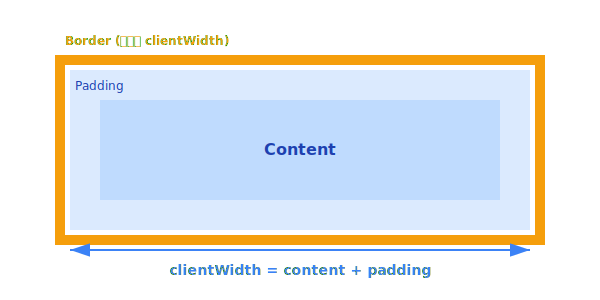
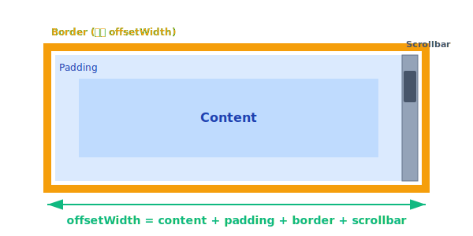
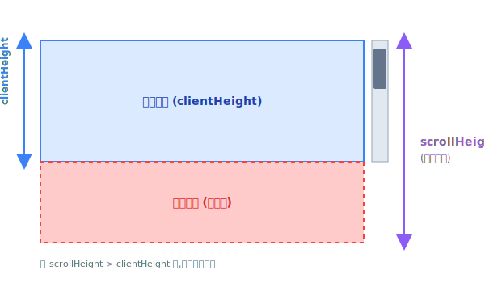
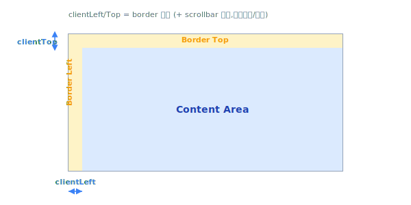
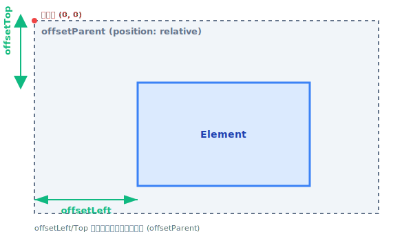
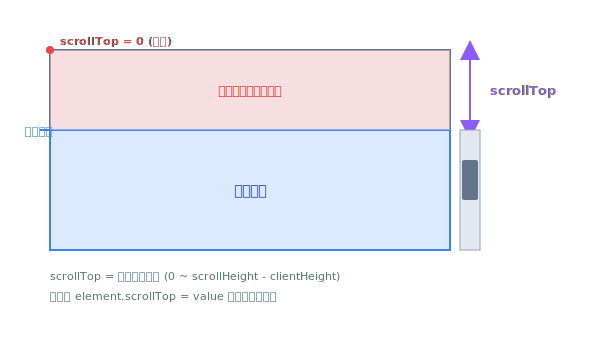
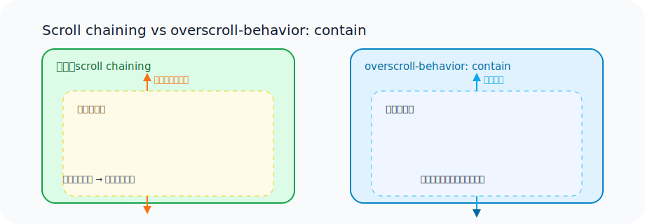
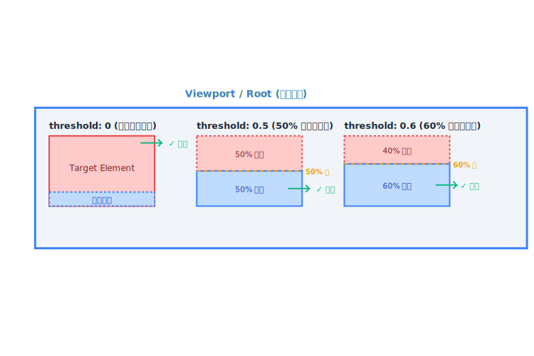

import {
OverscrollBoundaryDemo,
ElementBoundaryVisualizer,
LazyLoadInfiniteListDemo,
ScrollPaddingDemo,
ScrollSnapDemo,
} from '@site/src/components/ExampleComponents/Scroll';

## **元素尺寸：client / scroll / offset**

瀏覽器在渲染 DOM 盒子時，會將「實際內容大小」拆成三組常見的讀值：`client*`、`scroll*`、`offset*`。這些數值不只是 API 名稱，背後代表了不同的座標系統與邊界。



### **clientWidth / clientHeight**



`clientWidth` 與 `clientHeight` 代表「可視內容區域」，也就是 **內容 + padding**,但不包含 border 與捲動條。

### **offsetWidth / offsetHeight**



`offsetWidth` / `offsetHeight` 則會把 **content + padding + border + scrollbar** 全部加總，是「元素實際占位」的大小(不含 margin)。

### **scrollWidth / scrollHeight**



`scrollWidth` / `scrollHeight` 會量到「全部內容的真實長度」，即使有一大段被裁在可視區域之外仍會計算在內。當 `scrollHeight > clientHeight` 時，列表就可以滾動。

### **互動範例：元素邊界觀察器**

<ElementBoundaryVisualizer />

使用方式：點選不同情境並在盒子內滾動，即可看到右側即時更新的 client / scroll / offset 數值。三種情境對應以下觀察重點：

1. **固定高度**：client 與 scroll 尺寸接近，滾動距離有限。
2. **內容溢出**：scrollHeight 明顯大於 clientHeight，拖曳滾輪可觀察 scrollTop 的遞增幅度。
3. **多層邊框**：border / padding 讓 offset 尺寸高於 client。

只要把文字描述對應到圖層與數值，就能在腦中建立起「三種座標系統」的空間感。

<br/>

## **元素相對位置：client / scroll / offset**

### **clientLeft / clientTop**



`clientLeft` / `clientTop` 代表內容區域距離元素左/上邊內側的距離，大多數情況會等於 border 厚度（還會加上捲動條的寬度）。它可以用來調整 tooltip 或 caret，需要精準知道「內容起點」時非常有用。

### **offsetLeft / offsetTop**



`offsetLeft` / `offsetTop` 是元素相對於 `offsetParent` 的距離，也就是 CSS 定位（`position`）計算所用的座標系統。實務上最常見的 offsetParent 是最近的定位元素（`position: relative/absolute/fixed`）。

- 若沒有定位父層，offsetParent 會退回到 `body`。
- 因為包含邊框，所以將浮層、拖曳物件對齊時會比 `getBoundingClientRect()` 更貼近實際視覺。

### **scrollLeft / scrollTop**



`scrollTop` / `scrollLeft` 則記錄「內容滾動了多少」，0 代表尚未滾動，最大值約等於 `scrollHeight - clientHeight`。我們可以直接寫入 `element.scrollTop = 200` 來捲動畫面，也能監聽 `scroll` 事件搭配 Intersection Observer 或 requestAnimationFrame 驅動動畫。

:::tip[尺寸關係總結]

- `client* ≤ offset*`，因為 offset 還多了 border / scrollbar。
- 當沒有內容溢出時，`scroll* = client*`。
- 滾動並不會改變 client / offset / scroll 尺寸，只會改變 `scrollTop` / `scrollLeft` 值。

:::

<br/>

## **Scroll chaining 與 overscroll-behavior：邊界碰撞時的外溢效果**



預設情況下，當內層容器的 scrollport 碰到邊界，滾輪/手勢會沿著 scroll chain 往父層傳遞，外層也會跟著捲動。CSS `overscroll-behavior` 提供三種策略：

- `auto`（預設）：滾動動量可以外溢。
- `contain`：保留彈性效果，但阻止動量傳給父層。
- `none`：完全阻止外溢，同時禁止瀏覽器的下拉刷新。

常見情境包含模態視窗、側欄、地圖 viewer 等，一旦使用者把內層清單拉到底仍繼續滑動，就會不小心把背後頁面拖動。Chrome DevRel 的[指南](https://developer.chrome.com/blog/overscroll-behavior/)建議先試 `contain`，僅在確定需要時才使用 `none`。

### **互動範例：Overscroll Boundary Demo**

<OverscrollBoundaryDemo />

左側欄位採預設 `auto`，當內層段落觸底後繼續滑動即可看到外層「頁面」跟著移動；右側設為 `contain`，動量在邊界被截斷，外層保持靜止。

<br/>

## **scroll-padding：為滾動容器的內容設置一個緩衝區**

`scroll-padding` 用來為滾動容器預留緩衝，只要搭配 `scrollIntoView()` 或 scroll snapping，就能避免滾動結果緊貼著容器邊緣。

當使用 `scrollIntoView()` 或錨點導航時，預設行為會讓目標元素直接對齊容器邊緣，這在有固定標題列或需要視覺緩衝的情境下會造成閱讀困擾。`scroll-padding` 可以在滾動容器上設定內邊距，讓滾動停止時保留一段空間。

### **互動範例：Scroll Padding Demo**

<ScrollPaddingDemo />

### **核心程式碼**

在滾動容器上設定 `scroll-padding`：

```css
.scrollContainer {
  height: 300px;
  overflow-y: auto;
  scroll-padding: 2rem; /* 滾動時保留 2rem 的緩衝空間 */
}
```

搭配 `scrollIntoView()` 使用：

```tsx
const scrollToSection = (
  containerRef: React.RefObject<HTMLDivElement>,
  sectionId: string
) => {
  const container = containerRef.current;
  if (!container) return;

  const section = container.querySelector(`#${sectionId}`);
  if (section) {
    section.scrollIntoView({
      behavior: "smooth", // 平滑滾動
      block: "start", // 對齊容器開始位置
    });
  }
};
```

**重點說明：**

- `scroll-padding` 設定在**滾動容器**上，而非滾動項目
- 支援四個方向的獨立設定：`scroll-padding-top`、`scroll-padding-right`、`scroll-padding-bottom`、`scroll-padding-left`
- 特別適合有固定標題列、導航列的情境，避免內容被遮擋
- 與 `scrollIntoView({ block: 'start' })` 搭配時，目標元素會停在距離容器頂部 `scroll-padding` 的位置

<br/>

## **scroll-snap：自動吸附至特定位置**

`scroll-snap-type` / `scroll-snap-align` 可以定義滾動吸附的方向、模式與對齊方式。只要配置好 CSS，就能在純滑動的情境下自動停靠在卡片邊界。

Scroll Snap 讓滾動容器能夠自動「吸附」到特定位置，常見於輪播圖、卡片列表、全螢幕分頁等情境。透過 CSS 即可實現流暢的吸附效果，無需 JavaScript 介入。

### **互動範例：Scroll Snap Demo**

<ScrollSnapDemo />

### **核心程式碼**

在滾動容器上設定 `scroll-snap-type`：

```css
.scrollContainer {
  display: flex;
  overflow-x: auto;
  /* 
   * scroll-snap-type: [方向] [模式]
   * 方向：x (水平) | y (垂直) | both (雙向)
   * 模式：
   *   - mandatory: 強制吸附，滾動結束後必定停在吸附點
   *   - proximity: 接近吸附點時才吸附，使用者可以停在任意位置
   *   - none: 不啟用吸附
   */
  scroll-snap-type: x mandatory;
}
```

在滾動項目上設定 `scroll-snap-align`：

```css
.card {
  flex: 0 0 280px;
  /*
   * scroll-snap-align: [對齊方式]
   * - start: 項目的開始邊緣對齊容器的開始邊緣
   * - center: 項目的中心對齊容器的中心
   * - end: 項目的結束邊緣對齊容器的結束邊緣
   */
  scroll-snap-align: start;
}
```

**重點說明：**

- `scroll-snap-type` 設定在**滾動容器**上，`scroll-snap-align` 設定在**滾動項目**上
- `mandatory` 模式會強制吸附，適合輪播圖等需要精準對齊的情境
- `proximity` 模式較為寬鬆，適合長列表或內容瀏覽
- **在此範例中**，由於卡片寬度（280px）接近容器寬度，`mandatory` 和 `proximity` 的效果差異不明顯。在實際應用中，當滾動項目較小或數量較多時，`proximity` 會允許使用者停在非吸附點，而 `mandatory` 則會強制對齊最近的吸附點
- 可搭配 `scroll-padding` 調整吸附位置的偏移量

<br/>

## **Intersection Observer API**

Intersection Observer 允許我們監測「某個元素進入特定可視範圍」的狀態，不需頻繁監聽 `scroll`。搭配 lazy loading 或 infinite scroll 時，把觀測點（sentinel）放在列表尾端，就能在使用者接近底部的瞬間載入下一批資料。

### **理解 threshold 參數**

`threshold` 參數決定了「目標元素可見比例達到多少時觸發回調」。值介於 0.0 ~ 1.0 之間：

- `threshold: 0` → 目標元素剛進入視窗就觸發（哪怕只有 1px）
- `threshold: 0.5` → 目標元素 50% 進入視窗時觸發
- `threshold: 0.6` → 目標元素 60% 進入視窗時觸發
- `threshold: 1.0` → 目標元素 100% 完全進入視窗時觸發

也可以使用陣列設定多個閾值，每次跨越閾值時都會觸發回調：

```javascript
threshold: [0, 0.25, 0.5, 0.75, 1.0];
```



### **互動範例：Lazy Loading/無限滾輪**

<LazyLoadInfiniteListDemo />

實作原理：

1. 透過 `IntersectionObserver` 把觀測點（sentinel）掛在列表尾端，`root` 設為清單元素本身，`threshold: 0.6` 代表當 sentinel 有 60% 進入視窗才觸發。
2. 觀測器觸發時呼叫 `loadMore()` 追加下一批資料並更新批次計數。下方示範用 `setTimeout` 模擬 API 延遲；若要串接後端，把 `setTimeout` 那段替換成 `await fetch(...)` + 狀態更新即可。
3. `hasMore` 旗標控制觀察者是否繼續工作，當資料載滿後可以停止監聽，避免無限觸發。

核心程式碼（放在 React component 內）：

```tsx
const listRef = useRef<HTMLDivElement | null>(null);
const sentinelRef = useRef<HTMLDivElement | null>(null);

const loadMore = useCallback(() => {
  if (!hasMore || isLoading) return; // 已載滿或正在載入就不再觸發
  setIsLoading(true);

  // 這裡用 setTimeout 模擬 API 延遲；改接後端時換成 fetch/axios 即可
  setTimeout(() => {
    setItems((prev) => [...prev, ...createBatch(batchIndex)]);
    setBatchIndex((prev) => prev + 1);
    setHasMore(batchIndex + 1 <= MAX_BATCH);
    setIsLoading(false);
  }, 600);
}, [batchIndex, hasMore, isLoading]);

useEffect(() => {
  const root = listRef.current;
  const sentinel = sentinelRef.current;
  if (!root || !sentinel) return;

  const observer = new IntersectionObserver(
    (entries) => {
      if (entries[0].isIntersecting) {
        loadMore(); // 觀測點進入視圖 → 追加批次
      }
    },
    {
      root, // 把清單本身當作觀測視窗
      threshold: 0.6, // sentinel 進入 60% 面積才觸發
    }
  );

  observer.observe(sentinel);
  return () => observer.disconnect(); // 卸載時記得清理
}, [loadMore]);
```

操作建議：滑到列表底部或點「手動載入」，觀察上方統計數字與 sentinel 區塊的狀態變化。這個流程非常適合搭配 scroll boundary 的應用，例如只在使用者確實靠近內容邊界時才載入更多資料，避免一次渲染過多項目。

## **Reference**

- **[Element size and scrolling（shubo.io）](https://www.shubo.io/element-size-scrolling/)**
- **[Size and scroll (javascript.info)](https://javascript.info/size-and-scroll)**
- **[Overscroll behavior（Chrome Developers）](https://developer.chrome.com/blog/overscroll-behavior/)**
- **[CSS Scroll Snap（MDN）](https://developer.mozilla.org/docs/Web/CSS/CSS_scroll_snap)**
