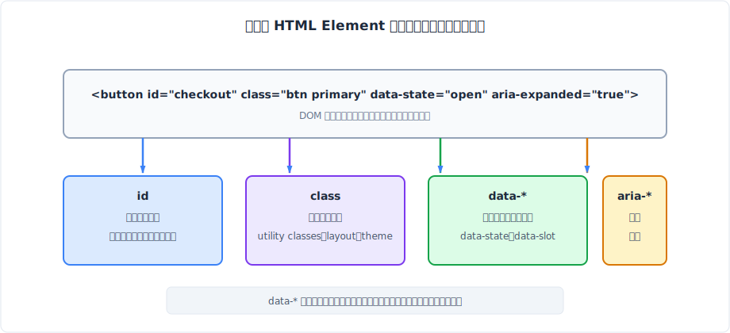
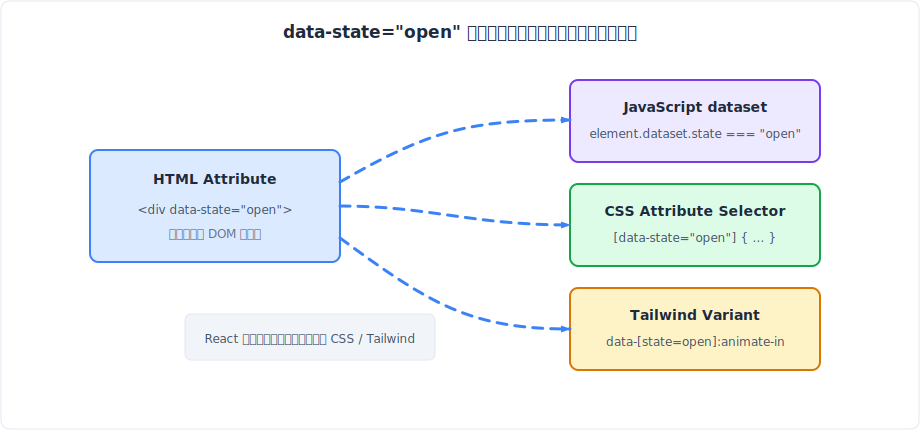
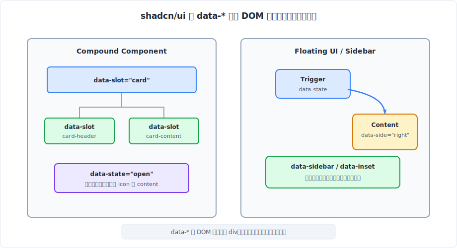
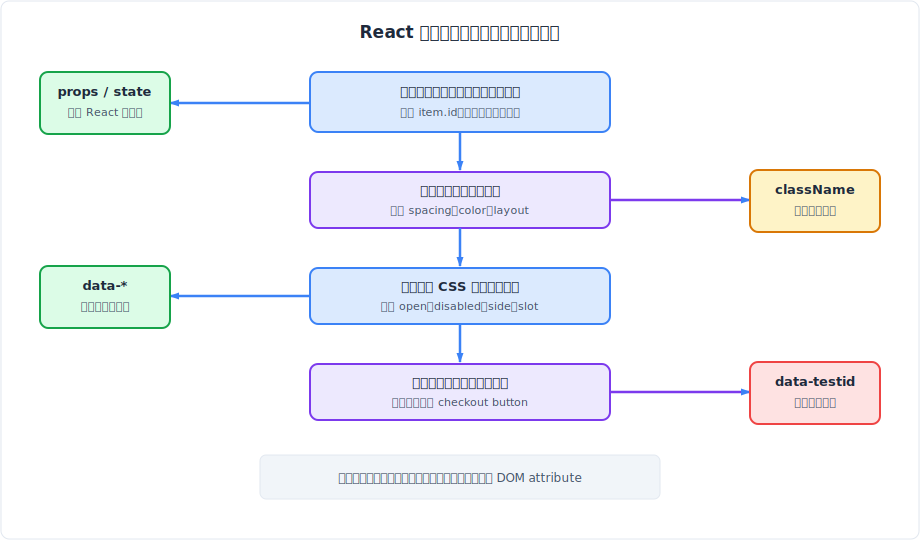

## **前言**

最近在使用 shadcn/ui 做專案時，我在元件原始碼一直看到一個很特別的屬性寫法：`data-*`，而且它們常常和 Tailwind class 寫在一起，看起來甚至會直接決定動畫方向、側邊欄收合狀態、元件內部某個區塊的樣式，比方說類似這樣的程式碼：

```HTML
<div data-state="open" data-slot="sidebar" className="data-[state=open]:animate-in group-data-[collapsible=icon]:hidden">
  ...
</div>
```

這讓我產生一個疑問：這些 `data-*` 屬性到底是 HTML 標準的一部分，還是 shadcn/ui 或 Tailwind 自己發明的語法？

<br/>

## **`data-*`：HTML 留給開發者的標準延展空間**



事實上 `data-*` 並不是某個 UI library 自創的命名慣例，而是 HTML 標準提供給開發者使用的 **Custom Data Attributes（自訂資料屬性）**。

如上圖所示：同一個 HTML element 可以同時擁有很多種 attribute，但它們不應該全部承擔同一種任務。`id` 偏向唯一定位，`class` 偏向樣式分類，`aria-*` 偏向輔助科技語意，而 `data-*` 最基礎的概念則是讓開發者把「和這個元素有關，但 HTML 沒有內建語意」的私有資訊附加在元素上。

### **為什麼 HTML 需要自訂資料屬性**

HTML 本身有一套標準 attribute，例如：
- `` 的 `src`、`alt`
- `<input>` 的 `type`、`value`
- `<button>` 的 `disabled`

這些 attribute 都有瀏覽器理解的標準行為。問題是，在真實開發裡，元件常常需要一些 HTML 標準沒有定義的資訊。例如：
- 一個可展開的面板可能需要標記目前是 `open` 還是 `closed`
- 一個浮動選單可能需要知道自己目前出現在觸發按鈕的 `top` 還是 `bottom`
- 一個卡片元件可能希望 DOM 上可以看出哪個節點是 `card-header`，哪個節點是 `card-content`

這些資訊對應的是應用程式或 UI library 自己的狀態，HTML 標準不可能替所有框架與所有產品預先定義好。

在沒有 `data-*` 的世界裡，開發者可能會開始亂加非標準 attribute：

```html
<div state="open" slot-name="card-header" sidebar-mode="icon">
  ...
</div>
```

這種寫法最大的問題是：HTML parser 雖然可能容忍它，但它不是一個清楚的標準約定。下一個讀程式的人不知道哪些 attribute 是 HTML 內建，哪些是專案自訂；工具、linter、型別檢查也比較難辨識。`data-*` 的價值，就是把這些自訂資訊放進一個**被標準承認的命名空間**裡：

```html
<div data-state="open" data-slot="card-header" data-sidebar="menu">
  ...
</div>
```

只要 attribute 名稱以 `data-` 開頭，它就明確表示：這是開發者附加在元素上的私有資料，不是瀏覽器內建行為的一部分。

:::note `data-*` 不是語意化 HTML 的替代品
如果 HTML 本身已經有正確的元素或 attribute，就應該優先使用標準語意。例如按鈕的不可用狀態應該使用 `disabled`，展開狀態若會影響輔助科技理解，也常常需要搭配 `aria-expanded`。`data-*` 比較適合補充元件內部狀態、樣式鉤子或測試定位，不適合拿來偽裝成瀏覽器本來就懂的語意。
:::

### **基本語法與命名規則**

`data-*` 的基本語法很單純：attribute 名稱必須以 `data-` 開頭，後面接自訂名稱。

```html
<article
  data-post-id="42"
  data-state="published"
  data-layout="compact"
>
  ...
</article>
```

我在整理時會把它拆成兩層來看：

| 位置            | 範例                  | 說明                                       |
| --------------- | --------------------- | ------------------------------------------ |
| attribute name  | `data-post-id`        | 給 DOM、CSS selector、`dataset` 辨識的名稱 |
| attribute value | `"42"`、`"published"` | 寫在 HTML attribute 裡的值，本質上是字串   |

這裡最容易忽略的是「值本質上是字串」。即使寫的是 `data-count="3"`，透過 DOM 讀出來也會是 `"3"`，不是數字 `3`。如果寫 `data-active="false"`，它也只是字串 `"false"`，不會自動變成 boolean `false`。

```js
const el = document.querySelector("[data-count]");

el.dataset.count; // "3"
typeof el.dataset.count; // "string"
```

命名上，我會優先使用小寫與 dash 分隔，例如 `data-user-id`、`data-state`、`data-sidebar-mode`。這樣寫有兩個好處：
- 第一，它符合 HTML attribute 常見的命名節奏
- 第二，透過 JavaScript `dataset` 讀取時，dash 分隔會自然轉成 **camelCase**，對應關係很清楚

```html
<button data-user-id="bosh" data-menu-state="open">
  編輯
</button>
```

```js
const button = document.querySelector("button");

button.dataset.userId; // "bosh"
button.dataset.menuState; // "open"
```

### **dataset：JavaScript 如何讀寫 `data-*`**

JavaScript 讀取 `data-*` 有兩種常見方式。

第一種是通用的 DOM API：`getAttribute()`。

```js
const menu = document.querySelector("[data-state]");

menu.getAttribute("data-state"); // "open"
```

第二種是 HTML 專門為 `data-*` 提供的 `dataset`。`dataset` 會回傳一個 `DOMStringMap`，把所有 `data-*` 集中成一個物件介面。

```js
const menu = document.querySelector("[data-state]");

menu.dataset.state; // "open"
```

如果 attribute 名稱裡有 dash，`dataset` 會把 `data-` 後面的名稱轉成 camelCase：

```html
<div data-index-number="123" data-user-role="admin"></div>
```

```js
const el = document.querySelector("div");

el.dataset.indexNumber; // "123"
el.dataset.userRole; // "admin"
```

寫入也一樣。當程式設定 `dataset` 的值時，瀏覽器會同步更新 DOM attribute。

```js
el.dataset.state = "closed";

// DOM 會變成：
// <div data-state="closed"></div>
```

這個同步能力讓 `data-*` 很適合成為 JavaScript 與 CSS 之間的橋樑。JavaScript 負責改變狀態，CSS 負責根據 attribute 套用樣式。也正是這個橋樑，後面會延伸出 Tailwind data variants 與 shadcn/ui 的設計方式。


<br/>


## **`data-*` 如何和 CSS 連動**

前面先釐清了 `data-*` 是 HTML 標準提供的延展空間，但這還不足以解釋它為什麼會在 UI library 裡變得這麼重要。關鍵在於：`data-*` 不只是 JavaScript 可以讀，它也是普通 HTML attribute，所以 CSS 可以直接用 attribute selector 選到它。



這張圖可以把 `data-*` 的角色串起來：HTML 負責承載狀態，JavaScript 可以透過 `dataset` 讀寫，CSS 可以透過 attribute selector 套樣式，而 Tailwind 只是把這件事包成更適合 utility class 的語法。

### **Attribute Selector：用屬性狀態選取元素**

CSS attribute selector 的基本語法是用中括號選取具有某個 attribute 的元素。這部分和之前整理的 [CSS 選擇器 Cheat Sheet](./01-css-seclector.md) 是同一個基礎。

```css
[data-disabled] {
  opacity: 0.5;
  pointer-events: none;
}
```

這段 CSS 的意思是：只要元素身上存在 `data-disabled` attribute，就套用這組樣式。不需要檢查值，存在就算符合。

如果需要判斷特定值，可以寫成：

```css
[data-state="open"] {
  opacity: 1;
  transform: scale(1);
}

[data-state="closed"] {
  opacity: 0;
  transform: scale(0.96);
}
```

這種寫法和用 class 控制樣式很像，但語意不同。`class="open"` 表面上看起來是在描述樣式分類，`data-state="open"` 則是在描述這個元素目前的狀態。**CSS 只是剛好根據這個狀態做出視覺反應。**

```html
<div class="popover" data-state="open">
  ...
</div>
```

```css
.popover {
  transition: opacity 150ms ease, transform 150ms ease;
}

.popover[data-state="open"] {
  opacity: 1;
  transform: translateY(0);
}

.popover[data-state="closed"] {
  opacity: 0;
  transform: translateY(-4px);
}
```

:::note 我的理解是：
當 class 名稱開始變成 `is-open`、`is-disabled`、`is-error` 時，通常就代表它其實不是純樣式分類，而是在**描述狀態**。這時改用 `data-state`、`data-disabled`、`data-error`，DOM 會更像是在**宣告事實**，而不是宣告某段 CSS class 應該被套用。
:::

### **attr()：把 `data-*` 值顯示到 CSS generated content**

除了選取元素以外，CSS 也可以透過 `attr()` 函數讀取 attribute 值，常見於 `::before` 或 `::after` 的 `content`。

```html
<span data-label="Beta"></span>
```

```css
span::before {
  content: attr(data-label);
  font-size: 12px;
}
```

這代表 CSS generated content 可以把 `data-label` 的值顯示出來。這在一些開發輔助標籤、debug badge、裝飾性文字上偶爾會有用。

:::warning 可見內容不要只藏在 data-* 裡
這裡有一個重要界線：如果文字本身是產品內容，例如文章標題、按鈕文字、錯誤訊息，就應該直接放在 HTML 內容或正確的語意元素中。`data-*` 可以輔助樣式或行為，但不應該成為主要內容來源。MDN 也特別提醒，輔助科技或搜尋爬蟲未必會把 data attribute 的值當成一般可見內容處理。
:::

### **`data-*`、class、id 的角色差異整理**


| 屬性     | 適合表達                               | 不適合表達                      |
| -------- | -------------------------------------- | ------------------------------- |
| `id`     | 文件內唯一定位、錨點、label 對應       | 大量重複元件狀態                |
| `class`  | 樣式分類、utility class、layout        | 複雜資料與產品狀態來源          |
| `data-*` | 元件狀態、結構角色、測試鉤子、工具鉤子 | 敏感資料、複雜物件、主要內容    |
| `aria-*` | 輔助科技需要理解的互動語意             | 只為了 CSS 選取而存在的私有狀態 |

以一個可展開按鈕為例，如果狀態會影響輔助科技理解，`aria-expanded` 很重要；如果狀態也要讓 CSS 套動畫，`data-state` 可以同時存在。

```tsx
<button
  aria-expanded={open}
  data-state={open ? "open" : "closed"}
  className="data-[state=open]:bg-slate-900 data-[state=open]:text-white"
>
  選單
</button>
```

:::note
這裡 `aria-expanded` 的讀者是輔助科技，`data-state` 的讀者是 CSS、測試工具與開發者。兩者看起來都在描述 open/closed，但服務的對象不同。
:::

<br/>

## **為什麼 shadcn/ui 會大量使用 `data-*`**

理解 `data-*` 可以被 CSS selector 使用之後，shadcn/ui 的寫法就會變得合理很多。shadcn/ui 本質上是把 Radix UI / base-ui 這類 headless primitive 的互動狀態，接到 Tailwind utility class 上。`data-*` 剛好是一個非常適合銜接這兩邊的介面。

### **className 負責視覺，`data-*` 負責狀態與結構**

在傳統寫法裡，元件狀態常常直接混進 `className`：

```tsx
<div
  className={cn(
    "rounded-md border p-4 transition",
    isOpen ? "scale-100 opacity-100" : "scale-95 opacity-0",
    disabled && "pointer-events-none opacity-50",
    hasError && "border-red-500"
  )}
>
  Content
</div>
```

這種寫法可以運作，但當狀態越來越多，`className` 會同時承擔兩件事：一邊宣告基礎視覺，一邊藏著狀態判斷。讀程式時必須在 JavaScript 條件式和 CSS class 之間來回切換。

改成 `data-*` 後，React 元件比較像是單純在 DOM 上宣告狀態：

```tsx
<div
  data-state={isOpen ? "open" : "closed"}
  data-disabled={disabled}
  data-error={hasError}
  className={cn(
    "rounded-md border p-4 transition",
    "data-[state=open]:scale-100 data-[state=open]:opacity-100",
    "data-[state=closed]:scale-95 data-[state=closed]:opacity-0",
    "data-[disabled=true]:pointer-events-none data-[disabled=true]:opacity-50",
    "data-[error=true]:border-red-500"
  )}
>
  Content
</div>
```

這裡的分工更清楚：`data-state`、`data-disabled`、`data-error` 描述目前事實；`className` 描述在不同事實下的視覺結果。這也是我理解 shadcn/ui 時最重要的轉折點：它不是不寫狀態，而是把狀態寫在 DOM attribute 上，讓 CSS 可以直接回應。

### **Tailwind Data Attribute Variants**

Tailwind 的 data attribute variants 可以理解成 attribute selector 的 utility class 寫法。原本 CSS 需要寫：

```css
[data-state="open"] {
  animation-name: enter;
}
```

在 Tailwind 裡可以寫成：

```tsx
<div
  data-state="open"
  className="data-[state=open]:animate-in data-[state=closed]:animate-out"
>
  ...
</div>
```

`data-[state=open]:animate-in` 的意思是：當目前元素符合 `[data-state="open"]` 時，套用 `animate-in` 這個 utility。Tailwind 不是發明了新的瀏覽器能力，而是把 CSS attribute selector 編譯成 utility variant。

Tailwind 也支援只判斷 attribute 是否存在：

```tsx
<button
  data-active
  className="border data-active:border-blue-500"
>
  Active
</button>
```

當狀態在父層時，可以使用 `group-data-*`。這在 compound component 裡很常見，因為父層知道狀態，子層只負責呈現。

```tsx
<button
  data-state={open ? "open" : "closed"}
  className="group inline-flex items-center gap-2"
>
  <span>展開內容</span>
  <svg className="transition-transform group-data-[state=open]:rotate-180" />
</button>
```

這段的意思是：`svg` 自己不知道 `open` 狀態，但它可以觀察外層 `.group` 的 `data-state`。當外層是 `data-state="open"`，內層 icon 旋轉。

`peer-data-*` 則用在兄弟元素狀態。常見情境是 input 影響旁邊的 label 或提示文字：

```tsx
<div>
  <input
    data-invalid={hasError}
    className="peer border data-[invalid=true]:border-red-500"
  />
  <p className="hidden text-red-500 peer-data-[invalid=true]:block">
    欄位格式不正確
  </p>
</div>
```

這些語法看起來像 Tailwind 特有技巧，但底層觀念仍然是 CSS selector：目前元素、父層 group、兄弟 peer，只要 DOM 上有穩定的 attribute，就能被 CSS 選到。

### **Radix UI/base-ui 與 shadcn/ui 的分工**

shadcn/ui 常見的 `data-state`、`data-side` 有一大部分來自 Radix UI/base-ui。Radix UI/base-ui 是 headless primitive，它負責處理可及性、鍵盤操作、focus 管理、開關狀態、浮動定位等複雜互動，但它不替產品決定最終視覺風格。

以 Dropdown Menu 為例，Radix/base-ui 的 Trigger 會輸出類似 `[data-state="open"]` 或 `[data-state="closed"]` 的狀態；Content 則可能輸出 `[data-side="top"]`、`[data-side="bottom"]`、`[data-align="start"]` 這類和浮動位置相關的資訊。

shadcn/ui 的角色，是把這些 headless 狀態接到 Tailwind class：

```tsx
<DropdownMenuContent
  className={cn(
    "z-50 rounded-md border bg-popover p-1 shadow-md",
    "data-[state=open]:animate-in data-[state=closed]:animate-out",
    "data-[side=bottom]:slide-in-from-top-2",
    "data-[side=top]:slide-in-from-bottom-2"
  )}
/>
```

這段可以拆成三層：

| 層級       | 負責內容                 | 例子                                      |
| ---------- | ------------------------ | ----------------------------------------- |
| Radix UI   | 互動狀態與 DOM attribute | `data-state="open"`、`data-side="bottom"` |
| shadcn/ui  | 元件預設樣式             | `rounded-md`、`shadow-md`、`animate-in`   |
| 專案程式碼 | 覆寫與組合               | 額外傳入 `className`                      |

這樣的設計讓狀態不被藏在 React 內部。只要打開 DevTools，就能直接看到浮動選單目前是開啟還是關閉、出現在上方還是下方。對元件庫來說，這是一種很實用的可觀察性。


<br/>


## **讀懂 shadcn/ui 常見的 `data-*`**

前面建立了 `data-*`、CSS selector 與 Tailwind variant 的關係後，回頭看 shadcn/ui 常見屬性就比較不會陌生。它們大致可以分成幾種角色：標記結構、描述狀態、描述位置、協助複雜佈局連動。



這張圖想表達的是：`data-*` 在 shadcn/ui 裡不是單一用途。`data-slot` 偏向結構語意，`data-state` 偏向互動狀態，`data-side` 偏向浮動位置，`data-sidebar` 與 `data-inset` 則偏向複雜佈局元件中的角色與模式。

### **data-slot：標記元件結構中的角色**

`data-slot` 是 shadcn/ui 新版元件裡很常看到的屬性。它的用途不是表示「這個元素目前狀態是什麼」，而是標記「這個 DOM 節點在元件結構中扮演什麼角色」。

例如一個 Card 元件在 React 裡看起來可能是這樣：

```tsx
<Card>
  <CardHeader>
    <CardTitle>帳單資訊</CardTitle>
  </CardHeader>
  <CardContent>
    ...
  </CardContent>
</Card>
```

渲染成 DOM 後，如果只有滿滿的 Tailwind class，DevTools 可能只會看到好幾層 `<div>`。但加上 `data-slot` 後，DOM 會比較容易閱讀：

```html
<div data-slot="card">
  <div data-slot="card-header">
    <div data-slot="card-title">帳單資訊</div>
  </div>
  <div data-slot="card-content">
    ...
  </div>
</div>
```

這對 debug 很有幫助。`data-slot="card-header"` 比一長串 spacing、border、typography utility 更能直接告訴我：這個節點是 Card Header，不只是某個普通 `div`。

另一個價值是外部覆寫。假設有一個頁面想微調某個複合元件內部 icon 的樣式，如果元件有提供穩定的 `data-slot`，外層就可以用 selector 精準命中，而不需要元件額外開一個 `iconClassName` prop。

```tsx
<AccordionTrigger className="[&_[data-slot=accordion-icon]]:text-red-500">
  展開詳細資訊
</AccordionTrigger>
```

這種方式特別適合底層 UI library，因為 library 不可能替每一個內部節點都預先設計 prop。但只要 DOM 結構有穩定的 slot 標記，使用者就能在必要時用 CSS selector 做細緻覆寫。

### **data-side：描述浮動元素的方位**

`data-side` 常出現在 Tooltip、Popover、DropdownMenu、ContextMenu 這類浮動元件。它描述浮動內容相對於觸發點的位置，常見值是 `top`、`bottom`、`left`、`right`。

這個屬性之所以重要，是因為浮動元素的實際位置不一定永遠等於開發者一開始設定的位置。假設原本希望 Dropdown 從按鈕下方展開，但如果按鈕已經靠近螢幕底部，浮動定位系統可能會為了避免溢出 viewport，自動把選單翻到上方。

此時動畫方向也應該跟著實際位置改變。選單從下方出現時，視覺上可能應該從上往下滑入；選單從上方出現時，則可能從下往上滑入。

```tsx
<DropdownMenuContent
  className={cn(
    "data-[side=bottom]:slide-in-from-top-2",
    "data-[side=top]:slide-in-from-bottom-2",
    "data-[side=left]:slide-in-from-right-2",
    "data-[side=right]:slide-in-from-left-2"
  )}
/>
```

這裡 `data-side` 的價值是把「實際渲染位置」暴露給 CSS。React 不需要在每次位置變動時手動計算該套哪個 class，定位系統只要把結果寫到 DOM attribute，Tailwind variant 就能做出對應動畫。

### **data-sidebar 與 data-inset：複雜元件中的佈局狀態**

`data-sidebar` 和 `data-inset` 常出現在 shadcn/ui 的 Sidebar 元件生態裡。Sidebar 不是單純的一個區塊，它通常包含 provider、外層容器、menu、menu item、menu button、rail、trigger、主要內容 inset 等多個部分，而且還要處理桌面版、手機版、收合模式、浮動模式、右側/左側位置。

在這種複雜元件裡，如果每一層都靠 props 往下傳遞狀態，元件很快會變得難以維護。`data-sidebar` 的用途就是把某個節點在 sidebar 系統中的角色標出來：

```html
<div data-sidebar="sidebar">
  <div data-sidebar="menu">
    <button data-sidebar="menu-button">Dashboard</button>
  </div>
</div>
```

`data-inset` 則常用來標記主要內容區域是否需要配合 Sidebar 模式做內縮或位移。當 Sidebar 是 floating 或 inset 變體時，主內容區域需要知道旁邊有一個會影響排版的邊界，這種資訊很適合變成 DOM 上的 layout state。

shadcn/ui Sidebar 文件裡也可以看到類似這樣的 Tailwind 寫法：

```tsx
<SidebarGroup className="group-data-[collapsible=icon]:hidden" />
```

這表示 Sidebar 外層 group 的 `data-collapsible` 狀態，可以直接影響裡面的 group 是否隱藏。狀態不需要一路透過 prop 傳到每一個子元件，CSS selector 就可以沿著 DOM 結構完成樣式連動。

:::info 複雜元件裡的 data-* 像是 DOM 層級的公開介面
對簡單元件來說，`data-*` 可能只是方便選取。但對 Sidebar、Dropdown、Select、Accordion 這類複合元件來說，`data-*` 更像是元件公開在 DOM 上的穩定介面。它讓外部樣式、測試工具、DevTools 都能理解元件目前的角色與狀態。
:::


<br/>


## **在 React 元件中什麼時候適合寫 `data-*`**

看完 shadcn/ui 的案例後，下一個問題是：在自己的 React 元件裡，是不是也應該大量加 `data-*`？我的判斷方式不是「有狀態就加」，而是先問這個值的讀者是誰。它是 React 商業邏輯要用的資料，還是 CSS、測試工具、DOM debug 需要看見的狀態？



這張圖的核心是：產品資料優先留在 React 資料流，純視覺樣式優先放在 `className`，需要被 CSS 或工具穩定選取的 DOM 狀態才適合放進 `data-*`。

### **狀態驅動樣式：取代過度複雜的條件 className**

第一個適合使用 `data-*` 的情境，是元件有多個狀態，而且這些狀態主要是為了驅動樣式。

傳統寫法可能是：

```tsx
<div
  className={cn(
    "rounded-md border p-4 transition",
    isActive && "bg-blue-500 text-white shadow-md",
    isDisabled && "cursor-not-allowed opacity-50",
    hasError && "border-red-500"
  )}
>
  Card
</div>
```

這段不是錯，但當狀態更多時，`className` 會越來越像一個小型狀態機。改成 `data-*` 後，狀態被放到 attribute，樣式則集中在 Tailwind variant：

```tsx
<div
  data-state={isActive ? "active" : "inactive"}
  data-disabled={isDisabled}
  data-error={hasError}
  className={cn(
    "rounded-md border p-4 transition",
    "data-[state=active]:bg-blue-500 data-[state=active]:text-white",
    "data-[state=active]:shadow-md",
    "data-[disabled=true]:cursor-not-allowed data-[disabled=true]:opacity-50",
    "data-[error=true]:border-red-500"
  )}
>
  Card
</div>
```

這樣寫的好處不是少打字，而是 DOM 會直接呈現元件狀態。打開 DevTools 時，看到 `data-state="active"`、`data-error="true"`，比從 `className` 裡反推目前狀態更直觀。

不過，boolean data attribute 在 React 裡有一個細節要注意。`data-disabled={false}` 可能仍然被序列化成字串或被保留的行為會受到 React 處理方式影響。若樣式需要精準判斷，我通常會選擇明確字串：

```tsx
<button
  data-disabled={isDisabled ? "true" : "false"}
  className="data-[disabled=true]:opacity-50"
>
  儲存
</button>
```

這樣 attribute selector 的條件非常明確，也比較不會混淆「attribute 存在」和「值是 true」這兩種不同語意。

### **E2E 測試與自動化腳本**

第二個常見情境是 E2E 測試，例如 Playwright 或 Cypress。測試腳本需要穩定地找到某個元素，但 `className` 和畫面文字都不是好的長期依賴。

`className` 主要服務樣式，設計改版時很容易變；文字可能因為文案調整或多國語系改變；`id` 則可能和真正的頁面錨點、表單關聯混在一起。測試專用的 `data-testid` 可以把「測試定位」這件事明確切出來。

```tsx
<button
  data-testid="submit-checkout-button"
  className="rounded-md bg-primary px-4 py-2 text-primary-foreground"
>
  結帳
</button>
```

測試腳本就可以穩定使用：

```ts
await page.getByTestId("submit-checkout-button").click();
```

這裡的 `data-testid` 不應該拿來驅動產品邏輯，也不應該拿來描述視覺狀態。它的定位很單純：給測試工具一個穩定、不受樣式與文案影響的鉤子。

### **複合元件與可覆寫的 DOM 語意**

第三個適合情境是開發底層 UI component，尤其是 compound component。像 Accordion、Card、Select、Tabs 這種元件，常常由多個子元件組合而成。元件使用者在 React JSX 裡看到的是有語意的 component name，但瀏覽器最後看到的是 DOM 節點。

傳統寫法可能會把父層狀態一路傳給子層：

```tsx
function AccordionItem({ children }: { children: React.ReactNode }) {
  const [open, setOpen] = React.useState(false);

  return (
    <button onClick={() => setOpen((value) => !value)}>
      {children}
      <AccordionIcon open={open} />
    </button>
  );
}

function AccordionIcon({ open }: { open: boolean }) {
  return (
    <svg className={open ? "rotate-180" : "rotate-0"} />
  );
}
```

當元件層級變深，這種 props 傳遞會越來越重。改用 `data-state` 與 `data-slot` 後，父層只要宣告自己的狀態，子層則宣告自己的角色：

```tsx
function AccordionTrigger({ children }: { children: React.ReactNode }) {
  const [open, setOpen] = React.useState(false);

  return (
    <button
      data-state={open ? "open" : "closed"}
      className="group inline-flex items-center gap-2"
      onClick={() => setOpen((value) => !value)}
    >
      {children}
      <AccordionIcon />
    </button>
  );
}

function AccordionIcon() {
  return (
    <svg
      data-slot="accordion-icon"
      className="transition-transform group-data-[state=open]:rotate-180"
    />
  );
}
```

這裡 `AccordionIcon` 不需要知道 React state，也不需要接 `open` prop。它只要透過 CSS 觀察父層的 `data-state`。同時，它用 `data-slot="accordion-icon"` 宣告自己的 DOM 角色。未來外部若需要覆寫 icon，也可以精準選到它：

```tsx
<AccordionTrigger className="[&_[data-slot=accordion-icon]]:text-red-500">
  訂單明細
</AccordionTrigger>
```

這種寫法不是所有元件都需要，但當元件要提供給團隊重複使用，且內部 DOM 結構需要被樣式覆寫、測試工具定位或 DevTools 閱讀時，`data-*` 會比額外開一堆細碎 props 更有彈性。


<br/>


## **`data-*` 不該用在什麼地方**

`data-*` 很方便，但它不是 React 狀態管理工具，也不是資料庫，更不是安全儲存空間。最後這一節整理我覺得最容易踩錯的幾個界線。

### **不要拿來取代 React props 或 state**

第一個反模式，是把原本應該留在 React 資料流裡的資料塞到 DOM，再從事件裡反查回來。

```tsx
<button
  data-id={item.id}
  onClick={(event) => {
    handleDelete(event.currentTarget.dataset.id);
  }}
>
  刪除
</button>
```

這種寫法帶有比較強的 Vanilla JavaScript 思維：資料先放到 DOM 上，事件發生時再從 DOM 拿回來。但在 React 裡，`item.id` 本來就在 render 的閉包中，沒有必要繞一圈經過 DOM。

比較自然的寫法是：

```tsx
<button onClick={() => handleDelete(item.id)}>
  刪除
</button>
```

這樣資料仍然留在 React 的資料流與 JavaScript 記憶體裡，型別也比較清楚。`data-*` 比較適合給 CSS、測試工具、DOM 觀察用，不適合成為商業邏輯資料傳遞的主要管道。

### **不要存放複雜資料或敏感資料**

第二個界線是資料型態與安全性。`data-*` 會直接出現在瀏覽器 DOM 裡，任何人打開 DevTools 都看得到。因此密碼、token、個資、權限資訊、未公開商業資料，都不應該放進 `data-*`。

```html
<!-- 錯誤示範：敏感資訊直接暴露在 DOM -->
<div data-api-token="secret-token-value"></div>
```

即使不是敏感資料，複雜物件也不適合塞進 `data-*`。HTML attribute 的值是字串，Object 直接放進去會變成沒有意義的 `"[object Object]"`。

```tsx
<div data-user={{ id: 1, name: "Bosh" }}>
  ...
</div>
```

如果用 `JSON.stringify()` 硬塞，雖然短期可能讀得回來，但 DOM 會變得臃腫，render 成本也會增加，而且資料來源變得很難追蹤。

```tsx
<div data-user={JSON.stringify(user)}>
  ...
</div>
```

這種資料應該留在 React state、server response、context、store 或閉包中。DOM attribute 適合放短小、穩定、可被字串描述的狀態，例如 `open`、`closed`、`top`、`bottom`、`card-header`，不適合放整包產品資料。

:::danger data-* 沒有任何保密能力
只要資料被渲染到 HTML attribute，就等於送到使用者瀏覽器。無論 attribute 名稱看起來多隱密，都不具備安全邊界。安全資料應該留在後端、HTTP-only cookie、受控 session 或其他真正的安全機制中。
:::

### **不要把真正可見或無障礙內容只放在 `data-*`**

第三個界線是內容可及性。`data-*` 可以被 CSS `attr()` 顯示出來，但這不代表它適合承載主要內容。因為這些值本質上是 attribute，不是一般 DOM text node。輔助科技、搜尋引擎、複製貼上、翻譯工具，未必會把它們當成正常內容處理。

比較不理想的寫法是：

```html
<button data-label="送出表單"></button>
```

```css
button::before {
  content: attr(data-label);
}
```

如果「送出表單」是按鈕真正要呈現的文字，就應該直接放在按鈕內容裡：

```html
<button>送出表單</button>
```

如果同時需要額外的狀態或測試定位，再加上 `data-*`：

```html
<button data-state="idle" data-testid="submit-form-button">
  送出表單
</button>
```

<br/>

## **Reference**

- **[Use data attributes - MDN](https://developer.mozilla.org/en-US/docs/Web/HTML/How_to/Use_data_attributes)**
- **[[技術分享] 什麼是 HTML 5 中的資料屬性（data-* attribute）](https://pjchender.dev/html/html-data-attribute/)**
- **[Tailwind CSS - Data attributes](https://tailwindcss.com/docs/hover-focus-and-other-states#data-attributes)**
- **[Radix UI Dropdown Menu - Data attributes](https://www.radix-ui.com/primitives/docs/components/dropdown-menu)**
- **[shadcn/ui Sidebar](https://ui.shadcn.com/docs/components/sidebar)**
