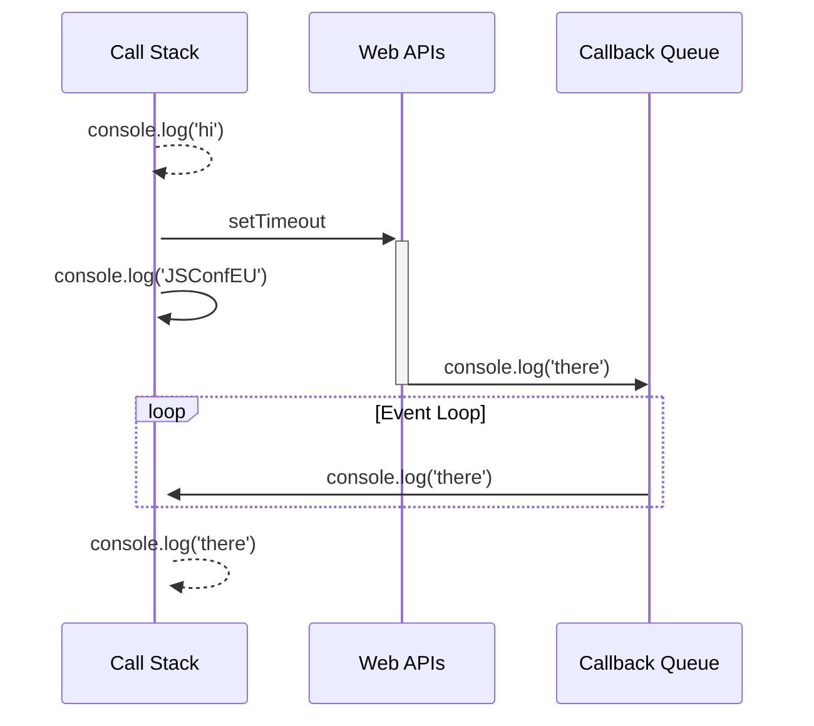

## **JavaScript 的運作方式**
JavaScript 是一種**單線程(single threaded)**的語言，這表示只有一個主執行緒(main thread)負責執行程式碼。這樣的設計主要是為了確保安全性和簡化語言的複雜度。但同時也意味著當遇到複雜或長時間的操作時，JavaScript 的執行緒就會被**阻塞(blocked)**，導致程式無法繼續執行，甚至造成整個應用程式的停止運作。為了解決這個問題，JavaScript 引入了`事件循環(Event Loop)`的概念，使得程式可以進行非阻塞的 IO 操作。


### **單線程(single threaded)**

單線程設計表示所有的程式碼都是逐一執行的，當前的任務必須先完成後，才能繼續下一個任務的執行。這樣的設計有許多好處，例如避免**競爭條件(race condition)**和**死鎖(deadlock)**等問題，簡化了語言的複雜度，使其易於學習和使用。

然而，當程式碼需要進行一些複雜且耗時的操作時，這種設計就會顯得有些不足。例如當程式需要向後端發送請求時，主執行緒就會被阻塞，無法進行其他任務的執行，這樣就會影響整個應用程式的效能和反應速度。

### **阻塞(Blocking)**
`阻塞（Blocking）`是指一個進程或線程因等待某個操作完成而停止執行的狀態，直到該操作完成後才會繼續執行下去。在阻塞狀態下，進程或線程無法進行其他任何操作，直到阻塞操作完成為止。舉例來說，大家一定都有經歷過按下某個按鈕後網頁當掉，任何按鈕網或選項都沒有反應的情況，這其實就是`阻塞(Blocking)`。當我們使用 JavaScript 進行網路請求時，如果使用了**同步請求**，則當瀏覽器發送請求給伺服器並等待回應時，JavaScript 的執行緒會進入阻塞狀態，無法進行其他任何操作，直到收到回應為止。在這個過程中，使用者無法與網頁進行互動，也無法執行其他任何 JavaScript 程式碼。

另一個常見的例子是使用**阻塞I/O操作**的文件讀取操作。當我們使用阻塞 I/O 操作從硬碟中讀取一個大型文件時，執行緒會等待所有數據從硬碟讀取到內存中後才繼續執行。在這個過程中，該執行緒是阻塞的，無法執行其他任何操作，因此會導致整個程式的執行速度變慢。


 <br/>


## **JavaScript 單執行緒卻可以並行處理(Concurrency)的祕密**
> 關於**Event Loop** 這個單元，我強力推薦讀者看這部介紹影片 [所以說event loop到底是什麼玩意兒？| Philip Roberts | JSConf EU](https://www.youtube.com/watch?v=8aGhZQkoFbQ&ab_channel=JSConf)

JavaScript 是一種單執行緒的語言，意味著它只有一個執行緒來處理所有的工作。然而，頁面中的任務仍然可以實現並行處理，最主要的原因是**運行環境**的`事件循環(Event Loop)`機制。以瀏覽器來舉例說明，**JavaScript Runtime** 確實只能在一個時間點執行一個動作，但瀏覽器並不是只有 **JavaScript Runtime** 而已，真正讓 JS 程式碼可以實現 **concurrency** 的其實是瀏覽器的 `WebAPIs` 與 `C++ APIs`。

`事件循環(Event Loop)`是與 JS 的運行（runtime）環境相關的機制，它與 JS（引擎）本身無關。常見的運行環境有**瀏覽器**、**Node.js**，每種運行環境可能都有自己實現`事件循環(Event Loop)`的方式，那些我們在 JS 中寫的非同步事件其實都是運行環境提供的功能。

> 以下這張圖呈現了 JavaScript 執行環境(瀏覽器 or Node.js)的`事件循環(Event Loop)`組成


### **Event Loop 的運作方式**

事件循環運作方式非常簡單，它由四個主要的部分組成：Call Stack（呼叫堆疊）、執行環境 API、 Callback Queue（回呼佇列）和 Event Loop（事件循環）。

- `Call Stack（呼叫堆疊）` 是一個 **LIFO（後進先出）**的資料結構，用來存儲 JavaScript 函數的調用信息。當函數被調用時，它的調用信息就會被壓入 Call Stack 中，當函數執行完畢時，它的調用信息就會從 Call Stack 中彈出。
  
- `執行環境 API`：為了避免**阻塞(blocking)**發生，JS 中許多耗時的操作都是透過**運行環境提供的 API** 來完成的，以瀏覽器舉例，**操作 DOM 節點的API: document.querySelector**、**計時器: setTimeout**、 **AJAX 請求: XMLHttpRequest** ，它們通通統稱為 `Web APIs`。執行環境處理異步任務時，會調用相關的 API並且等待結果，最後將異步任務的結果包成 callback function 後放置到 `Callback Queue` 中。
  
- `Callback Queue` 是一個 **FIFO（先進先出）**的資料結構，用來存儲異步事件的 callback function。當異步事件發生時，callback function 會被推送到 `Callback Queue` 中，等待 Event Loop 把它們取出並執行。

- `Event Loop` 將上述環節串成一個**無限循環**的流程，它不斷從 `Callback Queue` 中取出 callback function，將它們放入 `Call Stack` 中執行。當 `Call Stack` 為空時，`Event Loop` 會繼續監聽事件，等待新的 callback function 被推送到 `Callback Queue` 中。

:::info Loupe
[所以說event loop到底是什麼玩意兒？| Philip Roberts | JSConf EU](https://www.youtube.com/watch?v=8aGhZQkoFbQ&ab_channel=JSConf) 這部影片的講者開發了
[Loupe](http://latentflip.com/loupe/?code=JC5vbignYnV0dG9uJywgJ2NsaWNrJywgZnVuY3Rpb24gb25DbGljaygpIHsKICAgIHNldFRpbWVvdXQoZnVuY3Rpb24gdGltZXIoKSB7CiAgICAgICAgY29uc29sZS5sb2coJ1lvdSBjbGlja2VkIHRoZSBidXR0b24hJyk7ICAgIAogICAgfSwgMjAwMCk7Cn0pOwoKY29uc29sZS5sb2coIkhpISIpOwoKc2V0VGltZW91dChmdW5jdGlvbiB0aW1lb3V0KCkgewogICAgY29uc29sZS5sb2coIkNsaWNrIHRoZSBidXR0b24hIik7Cn0sIDUwMDApOwoKY29uc29sZS5sb2coIldlbGNvbWUgdG8gbG91cGUuIik7!!!PGJ1dHRvbj5DbGljayBtZSE8L2J1dHRvbj4%3D) 這個介紹 Event Loop 的互動式介面，可以讓讀者更清楚事件在 Event Loop 的哪個階段，強力推薦去玩玩看！
:::


### **非同步處理範例**

**Example: setTimeout**
```js
console.log('hi');

setTimeout(function () {
  console.log('there');
}, 1000);

console.log('JSConfEU');
// hi
// JSConfEU
// there
```

1. `console.log('hi')` 函數被加入到 Call Stack 中，被呼叫執行後被移出 Call Stack。
2. `setTimeout` 函數被加入到 Call Stack 中，被呼叫執行後被移出 Call Stack。由於 `setTimeout` 是 Web API 中的一個函數，所以會被送到 Web APIs 中執行。
3. `console.log('JSConfEU') `函數被加入到 Call Stack 中，被呼叫執行後被移出 Call Stack。
4. 因為 `setTimeout` 函數是 Web API 中的一個非同步函數，因此會被放到 Callback Queue 中。由於指定的延遲時間為 1 秒，因此 `setTimeout` 函數的回調函數將在一秒後添加到 Callback Queue 中。
5. 當 Call Stack 為空時，Event Loop 將會檢查 Callback Queue 中是否有 **Micro Task**。由於 `setTimeout` 函數的回調函數是一個 **Micro Task**，因此它會優先被取出並添加到 Call Stack 中執行。
6. `console.log('there')` 函數被加入到 Call Stack 中，被呼叫執行後被移出 Call Stack。





<br/>


## **工作佇列（task queue）:宏任務 (Macro Task) 與微任務 (Micro Task)**
JavaScript 是一種單線程的程式語言，它使用回呼函數（Callback Function）來執行非同步操作，如執行 **Web API**，瀏覽器事件和 XMLHttpRequests。在 JavaScript 中，回呼函數通常被添加到**回呼佇列（Callback Queue）**中。但其實不同的非同步任務還是有不同的優先執行順序。

### **什麼是宏任務(Macro Task)？** 
其實 `宏任務(Macro Task)` 就是指一般的非同步任務，例如設定一個定時器（setTimeout或setInterval）、 DOM 事件處理、AJAX 請求和一些其他異步操作。這些任務是通過 **Web APIs** 提供的方法添加到 JavaScript 引擎之外的線程中，當它們完成時，它們就會進入 **Callback Queue**，等待 JavaScript 引擎執行它們。取名為 `Macro Task` 只是為了跟 `Micro Task` 做出區別對比。


### **什麼是微任務(Micro Task)？**
`微任務(Micro Task)`是比宏任務更小的任務，通常是由 **Promise、process.nextTick(Node.js)、Object.observe、MutationObserver** 等 API 添加到回呼佇列中的任務。與宏任務不同，微任務通常是由JavaScript引擎本身執行的，而不是在 **Web API** 中執行。`Micro Task` 的 callback 不會被加到我們熟知的 `Callback Queue`，而是內部一個優先權更高的 `Micro Task Queue`。


### **宏任務 (Macro Task) 與微任務 (Micro Task)的順序**
當 Event Loop 開始運作時，它會先從**宏任務佇列 (Macro Task Queue)** 中取出一個任務，並把它放到**呼叫棧 (Call Stack)** 中執行。當一個宏任務執行完成後，它就會被從宏任務佇列中移除，Event Loop 會再次從宏任務佇列中取出下一個任務來執行。

在宏任務執行過程中，可能會產生微任務** (Micro Task)**，例如 **Promise 的 then 方法、MutationObserver 的回呼函式、process.nextTick 等等**。這些微任務會被放到**微任務佇列 (Micro Task Queue)** 中，當呼叫棧中的任務執行完成後，Event Loop 會優先處理微任務佇列中的任務。換句話說，`微任務的優先級高於宏任務`。因此，當同時有宏任務和微任務需要執行時，微任務會先被執行完畢，再繼續執行宏任務。


簡單來說，事件循環 (Event Loop) 的執行流程如下：

1. 從宏任務佇列中取出一個任務，放到呼叫棧中執行。
2. 當呼叫棧中的任務執行完成後，檢查微任務佇列是否有任務需要執行，如果有，就依次執行微任務佇列中的任務，直到微任務佇列為空。
3. 重複步驟 1。

**最後，我們來看一個簡單的範例來理解宏任務和微任務的執行順序：**

```js
console.log('1');

setTimeout(function() {
  console.log('2');
  Promise.resolve().then(function() {
    console.log('3');
  });
}, 0);

Promise.resolve().then(function() {
  console.log('4');
});

// 1 4 2 3
```

1. 首先，在 **Call Stack** 中，console.log('1')會被執行。接著，setTimeout 被呼叫。由於它是**宏任務 (Macro Task)**，所以它會被推到 Callback Queue中，等待事件循環(Event Loop)來執行它。

2. 接著，Promise.resolve().then()也會被執行，它是**微任務 (Micro Task)**，所以它會被推到 **Micro Task Queue** 中，等待事件循環(Event Loop)來執行它。在這個微任務中，console.log('4')會被執行。

3. 當 Call Stack 被清空後，事件循環(Event Loop)會開始運行，它會首先檢查 **Micro Task Queue**，發現有一個微任務要執行，因此它會執行Promise.resolve().then()，印出'4'。

4. 接著，事件循環(Event Loop)會檢查 Callback Queue，發現有一個宏任務 (Macro Task) 要執行，因此它會執行setTimeout()的回調函式。在這個宏任務中，console.log('2')會被執行，然後Promise.resolve().then()又被呼叫，並且它又是微任務(Micro Task)，所以它會被推到 **Micro Task Queue** 中，等待事件循環(Event Loop)來執行它。

5. 當宏任務(Macro Task)全部完成後，事件循環(Event Loop)又會檢查 **Micro Task Queue**，發現有一個微任務要執行，因此它會執行Promise.resolve().then()，印出'3'。


<br/>


## **Reference**
- [JavaScript - For Loop 常見的面試問題 (call stack, web apis, callback queue)](https://www.youtube.com/watch?v=smSZ4spzcrw&t=369s&ab_channel=WeiWei) (@WeiWei Youtube)
- [所以說event loop到底是什麼玩意兒？| Philip Roberts | JSConf EU](https://www.youtube.com/watch?v=8aGhZQkoFbQ&ab_channel=JSConf)
- [Loupe](http://latentflip.com/loupe/?code=JC5vbignYnV0dG9uJywgJ2NsaWNrJywgZnVuY3Rpb24gb25DbGljaygpIHsKICAgIHNldFRpbWVvdXQoZnVuY3Rpb24gdGltZXIoKSB7CiAgICAgICAgY29uc29sZS5sb2coJ1lvdSBjbGlja2VkIHRoZSBidXR0b24hJyk7ICAgIAogICAgfSwgMjAwMCk7Cn0pOwoKY29uc29sZS5sb2coIkhpISIpOwoKc2V0VGltZW91dChmdW5jdGlvbiB0aW1lb3V0KCkgewogICAgY29uc29sZS5sb2coIkNsaWNrIHRoZSBidXR0b24hIik7Cn0sIDUwMDApOwoKY29uc29sZS5sb2coIldlbGNvbWUgdG8gbG91cGUuIik7!!!PGJ1dHRvbj5DbGljayBtZSE8L2J1dHRvbj4%3D)
- [Debounce & Throttle — 那些前端開發應該要知道的小事(一)](https://medium.com/@alexian853/debounce-throttle-%E9%82%A3%E4%BA%9B%E5%89%8D%E7%AB%AF%E9%96%8B%E7%99%BC%E6%87%89%E8%A9%B2%E8%A6%81%E7%9F%A5%E9%81%93%E7%9A%84%E5%B0%8F%E4%BA%8B-%E4%B8%80-76a73a8cbc39)
- [[JS] 理解 JavaScript 中的事件循環、堆疊、佇列和併發模式（Learn event loop, stack, queue, and concurrency mode of JavaScript in depth）](https://pjchender.dev/javascript/js-event-loop-stack-queue/) (@PJCHENder)
- [Javascript : Event Queue & Event Loop](https://vocus.cc/article/62fbb9affd8978000155f039)
- [我知道你懂 Event Loop，但你了解到多深？](https://yeefun.github.io/event-loop-in-depth/)