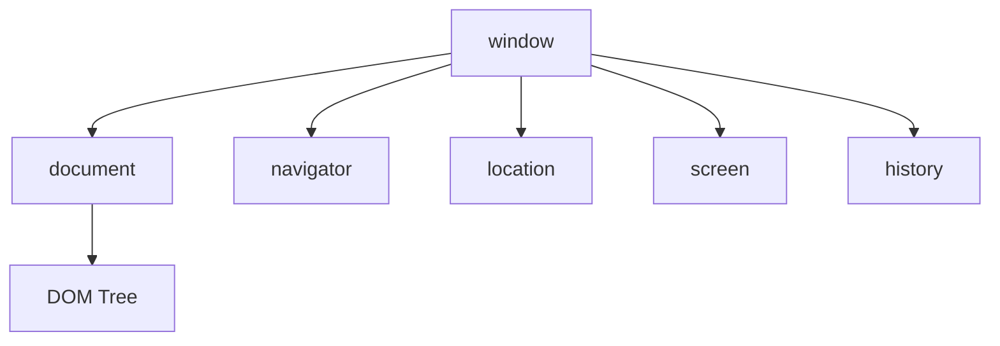
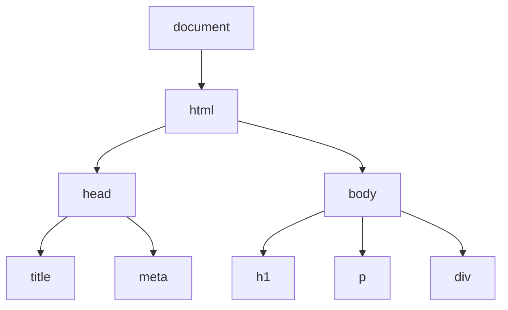

## **前言**
不知道大家剛開始學習 JS 的時候是否會跟我一樣好奇，我在寫前端時常常使用到的 **window.location**, **document.getElementById** 這些方法到了寫後端 NodeJS 時就不能使用了呢？其實，這是因為 JavaScript 實際上存在兩個不同的運行環境 - 運行**用戶端**程式碼的**`瀏覽器環境`**和運行**伺服器端**程式碼的 **`Node.js 環境`**。

JavaScript 是 ECMAScript 標準的一個實現。**瀏覽器**和 **Node.js** 環境都基於 ECMAScript 標準，但各自添加了不同的 API 來滿足特定環境的需求。

- 在`瀏覽器環境`中，JavaScript 被賦予了操作瀏覽器的能力，比如訪問和修改網頁內容(DOM)、監聽用戶交互事件、控制瀏覽器窗口等。這些功能由瀏覽器提供的一些內置對象實現，比如 **window、document、navigator** 等。
- 而在 `Node.js 環境`中，JavaScript 被用於編寫伺服器端的程式，沒有提供 BOM 和 DOM 這類操作網頁元素的 API。取而代之的是與文件系統、網絡請求相關的一些核心模組，如 **fs、http、path** 等。

> runtime in browser - 圖片來源：**[The JavaScript Engine and Runtime](https://medium.com/@firatatalay/the-javascript-engine-and-runtime-708a3e56736a)**

> runtime in Node.js - 圖片來源：**[The JavaScript Engine and Runtime](https://medium.com/@firatatalay/the-javascript-engine-and-runtime-708a3e56736a)**

回到今天的主題，實際上 **JavaScript** 這個程式語言的核心並沒有提供開發者在網頁的操作方法，這些操作方法都是由`瀏覽器`所提供，這些操作方法基本上會分別由這兩種物件所擁有：

- **BOM (Browser Object Model，瀏覽器物件模型)**
- **DOM (Document Object Model，文本物件模型)**

 

## **BOM**

BOM 是「**瀏覽器物件模型(Browser Object Model)**」的縮寫，它提供了JS 與瀏覽器窗口互動的能力，在 BOM 中，最頂層的物件是 `window`，它是一個代表瀏覽器窗口的物件，其他 BOM 物件都是 `window` 物件的屬性或方法。一些常見的 BOM 屬性與方法包括:

- **[window.navigator](https://developer.mozilla.org/en-US/docs/Web/API/Window/navigator)**: 提供有關瀏覽器的信息，如用戶代理、地理位置。
- **[window.location](https://developer.mozilla.org/en-US/docs/Web/API/Window/location)**: 允許獲取和設置當前窗口的URL並與之互動。
- **[window.origin](https://developer.mozilla.org/en-US/docs/Web/API/Window/origin)**: 返回窗口的原始來源，即協議、主機名和端口號。
- **[window.history](https://developer.mozilla.org/en-US/docs/Web/API/Window/history)**: 提供操作瀏覽器會話歷史（頁面訪問記錄）的方法。
- **[window.screen](https://developer.mozilla.org/en-US/docs/Web/API/Window/screen)**: 包含有關用戶螢幕的信息，如寬度和高度。
- **[window.alert](https://developer.mozilla.org/en-US/docs/Web/API/Window/alert)**: 顯示一個警告對話框。
- **[window.open](https://developer.mozilla.org/en-US/docs/Web/API/Window/open)**: 打開一個新窗口或標籤。
- **[window.close](https://developer.mozilla.org/en-US/docs/Web/API/Window/close)**: 關閉當前窗口。
- **[window.scrollTo](https://developer.mozilla.org/en-US/docs/Web/API/Window/scrollTo)**: 將窗口滾動到特定位置。
- **[window.setTimeout](https://developer.mozilla.org/en-US/docs/Web/API/WindowOrWorkerGlobalScope/setTimeout)**: 設置一個在指定時間後執行的定時器。
- **[window.setInterval](https://developer.mozilla.org/en-US/docs/Web/API/WindowOrWorkerGlobalScope/setInterval)**: 設置一個在指定時間間隔重複執行的定時器。
- **[window.localStorage](https://developer.mozilla.org/en-US/docs/Web/API/Window/localStorage)**: 提供對本地存儲功能的訪問，允許你存儲、讀取和刪除在瀏覽器中保存的數據。
- **[window.sessionStorage](https://developer.mozilla.org/en-US/docs/Web/API/Window/sessionStorage)**: 與 **`localStorage`** 類似，但存儲的數據在頁面會話結束時被清除。
- **[window.addEventListener](https://developer.mozilla.org/en-US/docs/Web/API/EventTarget/addEventListener)**: 用於在文檔或元素上附加事件處理器。
- **[window.removeEventListener](https://developer.mozilla.org/en-US/docs/Web/API/EventTarget/removeEventListener)**: 用於從文檔或元素上移除事件處理器。
- **[window.fetch](https://developer.mozilla.org/en-US/docs/Web/API/WindowOrWorkerGlobalScope/fetch)**: 提供一個強大的 API 來進行非同步 HTTP 請求，是 XMLHttpRequest 的現代替代品。

**BOM** 對於 Web 開發來說非常重要，因為它使得開發者能夠與瀏覽器進行交互，實現動態的網頁效果和功能。雖然 BOM 的具體實現可能因瀏覽器而異，但大部分現代瀏覽器都提供了一致的 BOM 接口和功能

 

## **DOM**

DOM 是「**文本物件模型(Document Object Model)**」的縮寫，DOM 將 HTML、XML 或 SVG 文檔表達為節點和對象的樹狀結構，這使得開發者可以通過 JavaScript 操縱這些元素。

### **DOM 的結構**

- **節點（Nodes）：**DOM 中的每個部分都是節點，包括整個文檔（文檔節點）、元素（標籤節點）、屬性、文本內容等。
- **元素（Elements）：**文檔的標籤形成元素節點，它們代表文檔的結構。例如，`
`、`
`、`<a>` 等都是元素節點。
- **屬性（Attributes）：**元素中的屬性，如 `class`、`id`、`href` 等，它們提供有關元素的額外信息。

### **DOM 的操作**

- **訪問節點**：可以使用各種方法訪問 DOM 樹中的節點，例如 `getElementById()`、`getElementsByTagName()`、`querySelector()` 等。
- **創建和修改節點**：可以使用 `createElement()`、`createTextNode()`、`appendChild()`、`removeChild()` 等方法來動態添加或刪除節點。
- **事件處理**：DOM 允許為元素分配事件處理程序，如點擊、鼠標移動、鍵盤事件等，使用 `addEventListener()` 和 `removeEventListener()` 方法來管理這些事件。

## **BOM 與 DOM 的區別**

**1. 功能範疇**

- **BOM**：關注於瀏覽器窗口及其相關功能，如窗口尺寸控制、URL管理、歷史記錄、定時器等。
- **DOM**：專注於文檔的結構，允許對HTML和XML文檔中的元素進行增刪查改操作。

**2. 操作對象**

- **BOM**：操作對象是瀏覽器窗口及其元件，不涉及文檔內容。
- **DOM**：操作對象是文檔內的元素和節點，如元素節點、文本節點和屬性節點。

**3. 標準化**

- **BOM**：沒有一個嚴格的標準，各瀏覽器廠商可能會有自己的實現和擴展。
- **DOM**：是一個由W3C（世界寬帶網絡聯盟）制定的國際標準，有清晰定義的API和規範。

## **Reference**

- **[重新認識 JavaScript: Day 11 前端工程師的主戰場：瀏覽器裡的 JavaScript](https://ithelp.ithome.com.tw/articles/10191666)**
- **[Differences between Node.js and the Browser](https://nodejs.org/en/learn/getting-started/differences-between-nodejs-and-the-browser#differences-between-nodejs-and-the-browser)**
- [**@MDN: Document Object Model (DOM)**](https://developer.mozilla.org/en-US/docs/Web/API/Document_Object_Model)
- [**@MDN: Window**](https://developer.mozilla.org/en-US/docs/Web/API/Window)