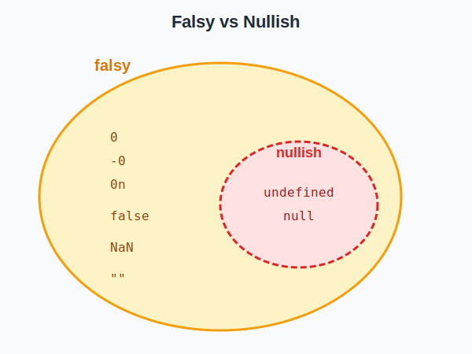

## **undefined vs null 的核心差異**


在 JavaScript 中，`undefined` 和 `null` 是兩個經常被混淆的原始型別。它們都代表「沒有值」，但背後的語義卻截然不同：一個是「系統層面的缺失」，另一個是「開發者刻意的設定」。

理解這兩者的差異，不僅能幫助我們寫出邏輯更清晰的程式碼，也是 JS 面試中的常見考點。讓我們先從一張表格快速掌握它們的核心差異：

| 特性               | undefined                      | null                           |
| ------------------ | ------------------------------ | ------------------------------ |
| **語義**           | 變數「尚未被賦值」或「不存在」 | 「刻意設定為空」或「沒有物件」 |
| **產生方式**       | 通常由 JavaScript 引擎自動賦予 | 由開發者主動設定               |
| **typeof 結果**    | `'undefined'`                  | `'object'`（歷史 bug）         |
| **數學運算**       | 轉換為 `NaN`                   | 轉換為 `0`                     |
| **JSON.stringify** | 屬性會被忽略                   | 會保留為 `null`                |


<br/>


## **undefined：未定義的值**

`undefined` 是 JavaScript 的原始型別（Primitive Type）之一，表示一個變數「尚未被賦值」或「不存在」。它通常是 JavaScript 引擎自動賦予的值，而非開發者主動設定。

### **什麼情況會產生 undefined？**

以下是常見會產生 `undefined` 的情境：

**1. 宣告變數但未賦值**

```javascript
let x;
console.log(x);  // undefined
```

**2. 存取物件中不存在的屬性**

```javascript
const obj = { name: 'Bosh' };
console.log(obj.age);  // undefined
```

**3. 存取陣列中不存在的索引**

```javascript
const arr = [1, 2, 3];
console.log(arr[10]);  // undefined
```

**4. 函式沒有明確的回傳值**

```javascript
function doSomething() {
  // 沒有 return 語句
}
console.log(doSomething());  // undefined
```

**5. 函式參數未傳入**

```javascript
function greet(name) {
  console.log(name);
}
greet();  // undefined
```

### **undefined 的特性**

```javascript
// typeof 回傳 'undefined'
console.log(typeof undefined);  // 'undefined'

// undefined 是一個全域變數（但不建議重新賦值）
console.log(window.undefined);  // undefined（瀏覽器環境）

// undefined 在布林轉換時為 false
console.log(Boolean(undefined));  // false

// undefined 參與數學運算會產生 NaN
console.log(1 + undefined);  // NaN
```

### **實務上如何處理 undefined**

在實務開發中，即便 `undefined` 不會讓程式整個 crash 掉，還是要記得主動處理，避免在後續的邏輯中產生意外的 bug。

```javascript
// ✅ 使用函式參數預設值
function greet(name = 'Guest') {
  console.log(`Hello, ${name}!`);
}

// ✅ 使用解構賦值預設值
const { name = 'Unknown', age = 0 } = user ?? {};

// ✅ 檢查 undefined 時使用 typeof（避免 ReferenceError）
if (typeof someVariable === 'undefined') {
  // 變數未定義
}

// ❌ 不建議主動賦值 undefined
let value = undefined;  // 不好的做法，讓它自然為 undefined 即可
```

<br/>


## **null：刻意設定的空值**

`null` 同樣是 JavaScript 的原始型別之一，但與 `undefined` 不同的是，`null` 表示「刻意設定為空」或「沒有物件」。它是開發者主動賦予的值，用來明確表示「這個變數有意義地設定為空值」。

### **什麼情況會使用 null？**

**1. 初始化一個之後會存放物件的變數**

```javascript
let user = null;  // 之後會存放使用者物件

// 登入後
user = { name: 'Bosh', email: 'bosh@example.com' };
```

**2. 清除變數的參考**

```javascript
let data = { items: [1, 2, 3] };
// 使用完畢後清除參考，讓垃圾回收機制可以回收記憶體
data = null;
```

**3. DOM API 找不到元素時回傳 null**

```javascript
const element = document.querySelector('.not-exist');
console.log(element);  // null
```

**4. 正規表達式沒有匹配結果時回傳 null**

```javascript
const result = 'hello'.match(/xyz/);
console.log(result);  // null
```

### **null 的特性**

```javascript
// typeof 回傳 'object'（這是一個歷史 bug）
console.log(typeof null);  // 'object'

// null 在布林轉換時為 false
console.log(Boolean(null));  // false

// null 參與數學運算會被轉換為 0
console.log(1 + null);  // 1
console.log(null * 5);  // 0
```

:::tip[常見面試考題]
Q: `typeof null` 的結果是什麼？為什麼？

A: `typeof null` 回傳 `'object'`。這是 JavaScript 誕生之初的歷史 bug，由於早期實作中 null 的位元標記與物件相同（都是 000），導致被誤判為物件。如果要正確判斷 null，應該使用 `value === null`。
:::

### **實務上如何使用 null**

我自己在開發時，會在以下情況主動使用 `null`：

```javascript
// ✅ 初始化之後會存放物件的變數
let currentUser = null;  // 明確表示「目前沒有使用者」

// ✅ 清除物件參考，幫助垃圾回收
let heavyData = { /* 大量資料 */ };
// 使用完畢後
heavyData = null;

// ✅ 設計 API 時，找不到結果回傳 null（與 DOM API 一致）
function findUserById(id) {
  const user = users.find(u => u.id === id);
  return user ?? null;  // 明確回傳 null 而非 undefined
}
```

<br/>


## **typeof null 的歷史 Bug**

如果你曾經在 console 中輸入 `typeof null`，你會得到一個令人困惑的結果：

```javascript
typeof null  // 'object'
```

這不是你的錯覺，也不是你對 JavaScript 理解有誤——這確實是一個從 1995 年就存在至今的 bug。

### **Bug 的技術成因**

要理解這個 bug，我們需要回到 JavaScript 最初的實作方式。在 Brendan Eich 於 1995 年用 10 天時間創造 JavaScript 時，他採用了一種常見的底層優化技術：**tagged pointer（標記指標）**。

在早期的 JavaScript 引擎中，每個值都以 32 位元（32-bit）的單位儲存。為了區分不同的資料型別，引擎使用最低的 1-3 位元作為**型別標記（type tag）**：

| 型別標記 | 資料型別               |
| -------- | ---------------------- |
| `000`    | Object（物件）         |
| `1`      | Int（31 位元有號整數） |
| `010`    | Double（浮點數）       |
| `100`    | String（字串）         |
| `110`    | Boolean（布林值）      |

問題出在 `null` 的表示方式：**`null` 被定義為空指標（null pointer），在大多數平台上就是 `0x00`**。也就是說 `null` 的所有 32 位元都是 0，包括**用來標記型別的最低位元**。


當 `typeof` 運算子檢查一個值的型別時，它會先讀取型別標記。由於 `null` 的型別標記是 `000`，與 **Object** 的標記完全相同，因此 `typeof null` 就回傳了 `'object'`。

### **為什麼至今仍未修復？**

這個 bug 在 JavaScript 誕生後不久就被發現了。2006 年，曾有人向 ECMAScript 委員會（TC39）提出修復提案，將 `typeof null` 改為回傳 `'null'`。

然而，這個提案最終被否決了。原因很簡單：**向後相容性（backward compatibility）**。

經過十多年的發展，已經有大量的程式碼依賴 `typeof null === 'object'` 這個行為。許多開發者會這樣寫：

```javascript
// 許多舊程式碼依賴這個行為
if (typeof value === 'object') {
  // 這裡的邏輯可能同時處理 object 和 null
}
```

如果突然修復這個 bug，這些程式碼都會出問題。TC39 權衡利弊後，決定保留這個「錯誤但穩定」的行為。這也是為什麼 JavaScript 經常被戲稱為「帶著歷史包袱前進」的語言。

### **如何正確判斷 null？**

既然 `typeof` 無法正確識別 `null`，我們需要使用其他方式：

```javascript
const value = null;

// 方法一：使用嚴格相等（最常用、最直觀）
value === null  // true

// 方法二：使用 Object.prototype.toString（可以精確識別所有型別）
Object.prototype.toString.call(null)  // '[object Null]'

// 方法三：同時檢查 null 和 undefined
value == null  // true（null 和 undefined 都會是 true）
```

:::tip[常見面試考題]
Q: 為什麼 `typeof null` 回傳 `'object'`？

A: 這是 JavaScript 誕生之初的歷史 bug。早期 JS 引擎使用 32 位元儲存值，最低位元作為型別標記，其中 `000` 代表物件。而 `null` 作為空指標，所有位元都是 0，導致型別標記也是 `000`，因此被誤判為物件。由於修復會破壞向後相容性，TC39 決定保留此行為。
:::

<br/>


## **更多 undefined vs null 的比較**

前面已經介紹過兩者的核心差異，這邊再補充一些實務上常遇到的比較情境。

### **相等性比較**

```javascript
// 寬鬆相等（==）：會進行型別轉換
console.log(null == undefined);   // true

// 嚴格相等（===）：不進行型別轉換
console.log(null === undefined);  // false

// 與自身比較
console.log(null === null);       // true
console.log(undefined === undefined);  // true
```

#### null 和 undefined 的寬鬆相等特殊規則

這是一個很容易搞混的地方：**`null` 和 `undefined` 在寬鬆相等時只會與彼此相等，不會與其他 falsy 值相等**。

| 表達式               |  結果   | 理由                         |
| -------------------- | :-----: | ---------------------------- |
| `null == undefined`  | `true`  | ECMAScript 規範中的特殊規則  |
| `null == 0`          | `false` | null 只與 undefined 寬鬆相等 |
| `null == ''`         | `false` | null 只與 undefined 寬鬆相等 |
| `null == false`      | `false` | null 只與 undefined 寬鬆相等 |
| `undefined == 0`     | `false` | undefined 只與 null 寬鬆相等 |
| `undefined == ''`    | `false` | undefined 只與 null 寬鬆相等 |
| `undefined == false` | `false` | undefined 只與 null 寬鬆相等 |

```javascript
// 這些結果可能會讓你意外
console.log(null == 0);         // false（不是 true！）
console.log(null == '');        // false
console.log(null == false);     // false
console.log(undefined == 0);    // false
console.log(undefined == '');   // false
console.log(undefined == false); // false

// 只有這個是 true
console.log(null == undefined); // true
```

### **實用技巧：`value != null` 的妙用**

上述的特殊規則讓 `value != null` 成為一個非常實用的慣用手法。

一般來說，我們都強調要使用嚴格相等（`===`）而非寬鬆相等（`==`）。但這是一個廣為接受的例外情況：

```javascript
// ✅ 推薦：使用 != null 同時檢查 null 和 undefined
if (value != null) {
  // 這段程式碼只會在 value 不是 null 也不是 undefined 時執行
  console.log(value);
}

// 等同於這個冗長的寫法
if (value !== null && value !== undefined) {
  console.log(value);
}
```

**為什麼這個技巧可行？**

1. `null == undefined` 是 `true`（規範特殊規則）
2. `null` 和 `undefined` 不與任何其他值寬鬆相等（包括 `0`、`''`、`false`）
3. 因此 `value != null` 等同於 `value !== null && value !== undefined`

**優點：**
- **簡潔**：比寫兩個嚴格不等的檢查更短
- **高效**：這是一個非常常見且被引擎最佳化的模式
- **語義明確**：當你不在乎值是 `null` 還是 `undefined`，只想確認它「確實存在且有值」時

**使用時機：**

當你想確認一個值「確實存在且有值」（即使值是 `0`、`''` 或 `false`），這是一個強大的工具：

```javascript
function processValue(value) {
  // 只要 value 不是 null 或 undefined，就處理它
  if (value != null) {
    return value.toString();
  }
  return 'No value';
}

processValue(0);         // '0'（0 是有效值）
processValue('');        // ''（空字串是有效值）
processValue(false);     // 'false'（false 是有效值）
processValue(null);      // 'No value'
processValue(undefined); // 'No value'
```

:::tip[常見面試考題]
Q: `null == 0` 的結果是什麼？為什麼？

A: `false`。雖然 `null` 在數學運算中會被轉換為 `0`（如 `null + 1 === 1`），但在寬鬆相等比較時，ECMAScript 規範特別規定 `null` 只與 `undefined` 相等，不會與其他任何值相等。這是規範中的特殊規則，不是型別轉換的結果。
:::

### **數值轉換的差異**

當 `null` 和 `undefined` 參與數學運算時，JavaScript 會嘗試將它們轉換為數字。這兩者的轉換結果截然不同，而且這個差異可能會導致難以察覺的 bug。

```javascript
// null 轉換為數字：0
console.log(Number(null));      // 0
console.log(null + 1);          // 1
console.log(null * 10);         // 0

// undefined 轉換為數字：NaN
console.log(Number(undefined)); // NaN
console.log(undefined + 1);     // NaN
console.log(undefined * 10);    // NaN
```

這個差異在實務中可能造成兩種截然不同的問題：

**`null` 的風險：無聲的錯誤**

`null` 轉換為 `0` 後，程式不會中斷，但可能會產生錯誤的計算結果：

```javascript
// 假設這是從 API 取得的資料，price 可能是 null
const items = [
  { name: 'A', price: 100 },
  { name: 'B', price: null },  // 缺少價格資料
  { name: 'C', price: 200 }
];

// 計算總價
const total = items.reduce((sum, item) => sum + item.price, 0);
console.log(total);  // 300（看起來正確，但其實漏算了 B 的價格）

// 計算平均價格
const avg = total / items.length;
console.log(avg);    // 100（錯誤！因為 null 被當成 0 計算了）
```

**`undefined` 的優勢：明顯的失敗**

`undefined` 轉換為 `NaN` 後，任何後續運算都會是 `NaN`，這讓錯誤更容易被發現：

```javascript
const items = [
  { name: 'A', price: 100 },
  { name: 'B' },  // 沒有 price 屬性，存取會得到 undefined
  { name: 'C', price: 200 }
];

const total = items.reduce((sum, item) => sum + item.price, 0);
console.log(total);  // NaN — 立刻發現問題！
```

:::tip[常見面試考題]
Q: `null + 1` 和 `undefined + 1` 的結果分別是什麼？

A: `null + 1` 是 `1`，`undefined + 1` 是 `NaN`。因為 `Number(null)` 是 `0`，而 `Number(undefined)` 是 `NaN`。這個差異在實務中很重要：`null` 參與運算可能產生「無聲的錯誤」，而 `undefined` 會讓錯誤立刻暴露。
:::

### **JSON 序列化的差異**

```javascript
const obj = {
  a: undefined,
  b: null,
  c: 'hello'
};

console.log(JSON.stringify(obj));
// '{"b":null,"c":"hello"}'
// undefined 的屬性會被忽略，null 會被保留
```

<br/>


## **補充：NaN 不是空值**

`NaN`（Not a Number）是一個容易與空值混淆的特殊值。雖然它經常在「無效資料」的情境中出現，但它**不是空值**——它的 `typeof` 是 `'number'`，是一個表示「數學運算失敗」的特殊數值。

### **什麼情況會產生 NaN？**

```javascript
// 無法解析為數字的字串
console.log(parseInt('hello'));  // NaN
console.log(Number('abc'));      // NaN

// 數學運算失敗
console.log(0 / 0);              // NaN
console.log(Math.sqrt(-1));      // NaN

// undefined 參與數學運算
console.log(1 + undefined);      // NaN

// NaN 參與任何運算
console.log(NaN + 1);            // NaN
```

### **NaN 的特殊性質**

`NaN` 有一個非常特殊的性質：**它不等於任何值，包括它自己**。

```javascript
console.log(NaN === NaN);  // false
console.log(NaN == NaN);   // false

// 這是 JavaScript 中唯一一個不等於自己的值
const x = NaN;
console.log(x !== x);  // true（可以用這個特性判斷 NaN）
```

:::tip[常見面試考題]
**Q: `NaN === NaN` 的結果是什麼？如何正確判斷一個值是否為 NaN？**

A: `NaN === NaN` 為 `false`，這是因為 IEEE 754 浮點數標準規定 NaN 不等於任何值。要判斷 NaN 應該使用 `Number.isNaN(value)`，而不是全域的 `isNaN()`（後者會先進行型別轉換）。
:::

### **如何正確判斷 NaN？**

```javascript
const value = NaN;

// 方法一：使用 Number.isNaN()（推薦）
console.log(Number.isNaN(value));  // true

// 方法二：使用全域 isNaN()（不推薦，會先進行型別轉換）
console.log(isNaN(value));         // true
console.log(isNaN('hello'));       // true（字串被轉換後變成 NaN）
console.log(Number.isNaN('hello')); // false（不會進行轉換）

// 方法三：利用 NaN 不等於自己的特性
console.log(value !== value);      // true
```

:::warning[注意事項]
`isNaN()` 和 `Number.isNaN()` 的行為不同：
- `isNaN()` 會先將參數轉換為數字，再判斷是否為 NaN
- `Number.isNaN()` 不會進行轉換，只有當參數確實是 NaN 時才回傳 true

建議使用 `Number.isNaN()` 以避免意外的型別轉換。
:::

<br/>


## **現代 JavaScript 的空值處理**

在 ES2020 之前，處理空值是一件相當繁瑣的事情。開發者經常需要寫出冗長的條件判斷，或是使用 `||` 運算子來提供預設值——但這往往會帶來意想不到的 bug。

ES2020 引入了兩個專門針對 `null` 和 `undefined` 設計的運算子：**Nullish Coalescing（`??`）** 和 **Optional Chaining（`?.`）**。這兩個運算子徹底改變了我們處理空值的方式，讓程式碼更加簡潔、安全且語義明確。

### **先釐清：Falsy vs Nullish**

在理解 `??` 之前，我們必須先搞清楚一個常見的混淆點：**Falsy 值和 Nullish 值涵蓋的範圍是不一樣的**。

- **Nullish**：只有 `null` 和 `undefined` 兩個值
- **Falsy**：在布林轉換時會變成 `false` 的值，共有 8 個



| 值          | Falsy? | Nullish? |
| ----------- | :----: | :------: |
| `null`      |   ✓    |    ✓     |
| `undefined` |   ✓    |    ✓     |
| `0`         |   ✓    |    ✗     |
| `''`        |   ✓    |    ✗     |
| `false`     |   ✓    |    ✗     |
| `NaN`       |   ✓    |    ✗     |
| `-0`        |   ✓    |    ✗     |
| `0n`        |   ✓    |    ✗     |

這個區別非常重要，因為 `||` 運算子是基於 **falsy** 判斷，而 `??` 運算子是基於 **nullish** 判斷。搞混這兩者，就會寫出難以察覺的 bug。

### **Nullish Coalescing Operator（??）**

#### 為什麼需要 `??`？

在 `??` 出現之前，開發者通常使用 `||` 來提供預設值：

```javascript
const userInput = 0;
const value = userInput || 100;
console.log(value);  // 100 — 但 0 是使用者刻意輸入的有效值！
```

問題在於 `||` 會在左側為**任何 falsy 值**時回傳右側，這包括 `0`、`''`、`false` 等可能是有效值的情況。

#### `??` 的解決方案

`??` 運算子**只在左側為 `null` 或 `undefined` 時**才回傳右側的值，完美解決了這個問題：

```javascript
const userInput = 0;
const value = userInput ?? 100;
console.log(value);  // 0 — 保留了使用者的有效輸入！
```

#### `||` vs `??` 完整比較

| 左側值      | `左側 \|\| '預設'` | `左側 ?? '預設'` |
| ----------- | ------------------ | ---------------- |
| `null`      | `'預設'`           | `'預設'`         |
| `undefined` | `'預設'`           | `'預設'`         |
| `0`         | `'預設'` ❌         | `0` ✓            |
| `''`        | `'預設'` ❌         | `''` ✓           |
| `false`     | `'預設'` ❌         | `false` ✓        |
| `NaN`       | `'預設'`           | `NaN`            |

```javascript
// 實際應用：表單預設值
function processForm(data) {
  const age = data.age ?? 0;        // 允許 age 為 0
  const name = data.name ?? '匿名';  // 允許 name 為空字串 ''
  const active = data.active ?? true; // 允許 active 為 false
  
  return { age, name, active };
}

processForm({ age: 0, name: '', active: false });
// { age: 0, name: '', active: false } — 所有值都被正確保留
```

### **Optional Chaining（?.）**

#### 問題：深層屬性存取的痛苦

在處理巢狀物件時，我們經常需要存取深層屬性。但如果中間任何一層是 `null` 或 `undefined`，程式就會拋出錯誤：

```javascript
const user = {
  name: 'Bosh',
  // address 不存在
};

// 💥 TypeError: Cannot read property 'city' of undefined
const city = user.address.city;
```

傳統的解決方式是層層檢查，但這會讓程式碼變得冗長且難以閱讀：

```javascript
// 傳統寫法：防禦性檢查
const city = user && user.address && user.address.city;

// 或使用三元運算子
const city = user ? (user.address ? user.address.city : undefined) : undefined;
```

#### `?.` 的優雅解法

Optional Chaining 讓我們可以安全地存取可能不存在的屬性，如果中間任何一層是 `null` 或 `undefined`，整個表達式會直接回傳 `undefined`，而不會拋出錯誤：

```javascript
const user = {
  name: 'Bosh',
  // address 不存在
};

// ✅ 安全存取，回傳 undefined
const city = user?.address?.city;
console.log(city);  // undefined（不會拋出錯誤）
```

#### `?.` 的三種使用方式

```javascript
// 1. 屬性存取
obj?.prop          // 等同於 obj == null ? undefined : obj.prop

// 2. 動態屬性存取
obj?.[expr]        // 等同於 obj == null ? undefined : obj[expr]

// 3. 函式呼叫
func?.()           // 等同於 func == null ? undefined : func()
```

```javascript
// 實際範例
const user = {
  name: 'Bosh',
  greet() {
    return `Hello, ${this.name}!`;
  }
};

// 屬性存取
console.log(user?.name);           // 'Bosh'
console.log(user?.address?.city);  // undefined

// 動態屬性存取
const key = 'name';
console.log(user?.[key]);          // 'Bosh'

// 函式呼叫
console.log(user?.greet?.());      // 'Hello, Bosh!'
console.log(user?.nonExistent?.()); // undefined（不會拋出錯誤）
```

### **`??` 與 `?.` 的黃金組合**

這兩個運算子經常搭配使用，形成一個強大的空值處理模式：**安全存取 + 預設值**。

```javascript
// 模式：object?.property ?? defaultValue

const user = null;
const userName = user?.name ?? 'Guest';
console.log(userName);  // 'Guest'
```

#### 實務範例：API 回應處理

```javascript
// 假設這是從 API 取得的回應
const response = {
  data: {
    user: {
      profile: null  // profile 可能不存在
    }
  }
};

// 安全地取得使用者頭像，若不存在則使用預設圖片
const avatar = response?.data?.user?.profile?.avatar ?? '/images/default-avatar.png';

// 安全地取得使用者設定，若不存在則使用預設值
const settings = {
  theme: response?.data?.user?.settings?.theme ?? 'light',
  language: response?.data?.user?.settings?.language ?? 'zh-TW',
  notifications: response?.data?.user?.settings?.notifications ?? true
};
```

:::tip[常見面試考題]
Q: `??` 和 `||` 有什麼差別？什麼時候該用哪一個？

A: `||` 在左側為任何 falsy 值（`false`、`0`、`''`、`null`、`undefined`、`NaN`）時回傳右側；`??` 只在左側為 `null` 或 `undefined` 時回傳右側。當 `0`、`''`、`false` 是有效值時，應該使用 `??`；當需要排除所有 falsy 值時，使用 `||`。
:::

<br/>


## **Reference**

- **[MDN - null](https://developer.mozilla.org/en-US/docs/Web/JavaScript/Reference/Operators/null)**
- **[MDN - undefined](https://developer.mozilla.org/en-US/docs/Web/JavaScript/Reference/Global_Objects/undefined)**
- **[MDN - Nullish coalescing operator (??)](https://developer.mozilla.org/en-US/docs/Web/JavaScript/Reference/Operators/Nullish_coalescing)**
- **[MDN - Optional chaining (?.)](https://developer.mozilla.org/en-US/docs/Web/JavaScript/Reference/Operators/Optional_chaining)**
- **[The history of "typeof null" - 2ality](https://2ality.com/2013/10/typeof-null.html)**
- **[MDN - Falsy](https://developer.mozilla.org/en-US/docs/Glossary/Falsy)**
