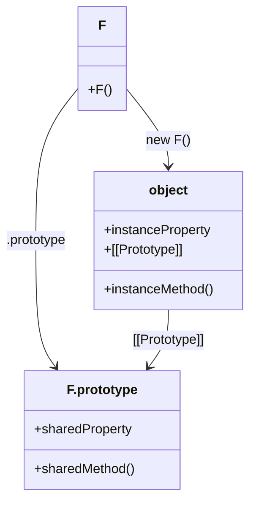
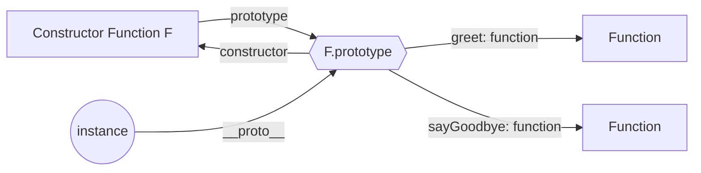

## **建構函式的概念與作用**

### **什麼是建構函式(constructor function)？**

在正式介紹 **prototype** 屬性之前，我們需要先認識與 **prototype** 屬性密切相關的**建構函式（constructor function）**，這個詞會在本文中多次出現。

在 JavaScript 中，建構函式是一種特殊的函式，用於創建和初始化物件實例。建構函式的主要功能是設置新物件的初始狀態，將屬性和方法賦值給新物件。此外，建構函式通常以大寫字母開頭，以區分於普通函式。

當使用 `new` 關鍵字來調用函式時，這個函式就被認為是建構函式。以下是建構函式的一般語法：

```jsx
function Person(name, age) {
  this.name = name; // 初始化 name 屬性
  this.age = age; // 初始化 age 屬性
  // 可以執行其他初始化操作
}
```

建構函式與普通函式在語法上非常相似，乍看之下可能會分不清兩者之間具體的區別，以下我整理了它們在用途和調用方式上的一些重要區別：

1. **用途**：
    - **建構函式**：主要用於創建新的物件實例，並初始化該物件的屬性和方法。
    - **普通函式**：執行特定的任務或計算，並返回結果。
2. **調用方式**：
    - **建構函式**：使用 `new` 關鍵字來調用，這會自動創建一個新物件，並將 `this` 綁定到這個新物件上。
    - **普通函式**：直接調用，不使用 `new` 關鍵字，`this` 綁定根據調用環境而定。

以下是兩者的區別範例：

```jsx
// 普通函式
function greet() {
  console.log("Hello!");
}
greet(); // Hello!

// 建構函式
function Person(name, age) {
  this.name = name;
  this.age = age;
}
let john = new Person('John', 30);
console.log(john.name); // John
```

### **建構函式與直接宣告物件的區別**

我在學習**建構函式**時發現一個有趣現象，就是大多數的人平常都不會用建構函式來創建物件，而是用下列這種寫法：

```jsx
const person = {
  name: 'Alice',
  age: 30
};
console.log(person.name); // Alice
```

在知道如何使用**建構函式**建立物件後不免心裡會產生一些疑問：

> 哦？ 原來物件還能這樣定義啊？
哦？ 原來這才是創建物件的正式寫法啊？
難道我一直都寫錯了嗎？
> 

在 JavaScript 中，創建物件的方式有多種，其中最常見的是使用**物件字面量**和**建構函式**。**物件字面量**是一種簡單直觀的創建物件方式。通過直接定義物件的屬性和值，可以快速創建一個新的物件，如上面的範例所示。

不過，其實在 JavaScript 內部，物件字面量仍然是通過內建的 `Object` 建構函式來創建物件的。換句話說，當你使用物件字面量創建物件時，JavaScript 引擎會在背後自動使用 `Object` 建構函式來完成這個過程。

```jsx
const person = { name: 'Alice', age: 30 };
// 相當於
const person = new Object();
person.name = 'Alice';
person.age = 30;
```

類似於**物件字面量**，**陣列字面量**也是創建陣列的一種簡化方法。通過直接定義陣列的元素，可以快速創建一個新的陣列。同樣地，儘管陣列字面量是一種簡單的創建方式，但在 JavaScript 內部，實際上是使用了內建的 `Array` 建構函式來創建陣列。

```jsx
const numbers = [1, 2, 3];
// 相當於
const numbers = new Array(1, 2, 3);
```

### **靜態成員與實例成員的差異**

在 JavaScript 中，建構函式可以有**靜態成員(Static Members)** 和**實例成員(Instance Members)**。

**靜態成員**是直接定義在建構函式本身上的屬性或方法。這些成員只能通過建構函式本身來訪問，而不能通過實例來訪問。

```jsx
function Person(name) {
  this.name = name;
}

// 定義靜態屬性
Person.species = 'Homo sapiens';

// 定義靜態方法
Person.describeSpecies = function() {
  console.log(`All humans belong to the species ${this.species}.`);
};

console.log(Person.species); // 'Homo sapiens'
Person.describeSpecies(); // "All humans belong to the species Homo sapiens."

let alice = new Person('Alice');
console.log(alice.species); // undefined
console.log(typeof alice.describeSpecies); // undefined

```

**實例成員**是在建構函式中使用 `this` 關鍵字定義的屬性或方法。這些成員是特定於每個實例的，必須通過實例來訪問。

```jsx
function Person(name) {
  this.name = name; // 定義實例屬性
  this.greet = function() { // 定義實例方法
    console.log(`Hello, my name is ${this.name}.`);
  };
}

let alice = new Person('Alice');
alice.greet(); // "Hello, my name is Alice."

let bob = new Person('Bob');
bob.greet(); // "Hello, my name is Bob."
```


<br/>


## **F.prototype 的定義與用途**

### **什麼是 F.prototype？**

在 JavaScript 中，`F.prototype` 是一個特殊的屬性，通常被稱為「原型屬性」，他實際上是提供**共享方法和屬性**的物件，所有由 `new F()` 創建的新物件都會自動繼承 `F.prototype` 上的所有屬性和方法。

> 簡單來說，假設 object 是由 `new F()` 創建的物件實例，那麼 `object.__proto__` 即為`F.prototype`
> 



這種共享的機制可以確保所有由同一建構函式創建的物件實例共享相同的方法和屬性，而不需要在每次創建新實例時重複定義它們，不僅節省了內存，還提供了一種簡單的方式來統一管理實例的方法和屬性。

:::note[注意]
`F.prototype` 是一個**屬性**，與前面提到的原型(prototype) 並不是同個東西。
:::

以下範例說明將方法定義於建構函式 **F** 本身，以及 **F.prototype** 的差別：

```jsx
function Person(name, age) {
  this.name = name;
  this.age = age;
  // 將方法定義於建構函式本身
  this.greet = function () {
	  console.log(`Hello, my name is ${this.name} and I am ${this.age} years old.`);
  }
}

// 在原型上定義方法
Person.prototype.sayHi = function() {
  console.log(`Hi, my name is ${this.name}.`);
};
  
let alice = new Person('Alice', 30);
let bob = new Person('Bob', 25);

alice.greet(); // "Hello, my name is Alice and I am 30 years old."
bob.greet();   // "Hello, my name is Bob and I am 25 years old."
console.log(alice.greet === bob.greet); // false

alice.sayHi(); // "Hi, my name is Alice."
bob.sayHi();   // "Hi, my name is Bob."
console.log(alice.greet === bob.sayHi); // true
```

### **F.prototype 的預設值**

當我們創建一個新的建構函式 `F` 時，JavaScript 會自動為這個建構函式分配一個預設的 `prototype` 物件。這個預設的 **prototype** 物件包含了一個唯一的屬性：`constructor`。這個 **constructor** 屬性指向建構函式 **F** 本身。

```jsx
function F() {}

// 檢查預設的 F.prototype 內容
console.log(F.prototype); 
// 輸出：{ constructor: F }
```

由於`constructor` 屬性默認指向創建該物件的建構函式，因此我們可以透過以下方法來檢查或追蹤物件的來源建構函式

```jsx
function Person(name) {
  this.name = name;
}

console.log(Person.prototype.constructor); 
// 輸出：function Person(name) { this.name = name; }

let john = new Person('John');
console.log(john.constructor); 
// 輸出：function Person(name) { this.name = name; }
```

除此之外，我們還可以用 `constructor` 屬性來驗證先前提到的內容：當使用**物件字面量**和**陣列字面量**來創建物件和陣列時，JavaScript 內部確實是通過建構函式來完成這個過程。

```jsx
// 使用物件、陣列字面量來宣告變數
const a = [1, 2, 3];
const b = {"name": "b"};

console.log(a.constructor === Array); // true
console.log(b.constructor === Object); // true
console.log(a.__proto__.constructor === Array); // true
console.log(b.__proto__.constructor === Object); // true
```

### **修改 F.prototype**

當我們修改 `F.prototype` 時，所有新創建的物件實例將會繼承新的原型屬性和方法。這使得我們可以在建構函式創建之後，動態地添加或修改方法和屬性。然而，這些修改不會影響到已經創建的物件實例，已創建的實例仍然會保留它們在創建時所繼承的原型屬性和方法。

修改 F.prototype 會導致新創建的物件實例與已創建的物件實例之間的原型鏈不同。新創建的實例將繼承**修改後的 F.prototype**，而已創建的實例仍然繼承**原始的 F.prototype**。這意味著新實例可以訪問修改後的屬性和方法，但已創建的實例無法訪問這些新添加或修改的屬性和方法。

以下舉一個修改 F.prototype 範例來輔助理解：

```jsx
// 定義建構函式
function Person(name) {
  this.name = name;
}

// 初始原型方法
Person.prototype.greet = function() {
  console.log(`Hello, my name is ${this.name}.`);
};

// 創建實例
let alice = new Person('Alice');
alice.greet(); // "Hello, my name is Alice."

// 修改原型
Person.prototype.greet = function() {
  console.log(`Hi, I'm ${this.name}.`);
};

// 創建新實例
let bob = new Person('Bob');
bob.greet(); // "Hi, I'm Bob."

// 檢查已創建的實例
alice.greet(); // "Hi, I'm Alice."

// 完全替換原型物件
Person.prototype = {
  introduce: function() {
    console.log(`I'm ${this.name}.`);
  }
};

// 創建另一個新實例
let charlie = new Person('Charlie');
charlie.introduce(); // "I'm Charlie."

// 檢查已創建的實例
bob.greet(); // "Hi, I'm Bob."
// bob 無法訪問新的 introduce 方法
console.log(typeof bob.introduce); // undefined
// alice 也無法訪問新的 introduce 方法
console.log(typeof alice.introduce); // undefined
```


<br/>


## **建構函式 F、物件實例與 F.prototype 的關係**

到目前為止，我們分別認識了建構函式與 `F.prototype`，相信第一次學習 JS 原型的你可能會對它們之間的關係感到困惑。這個章節我將簡單整理它們之間的關係，並通過範例來理解它們的互動方式。

### **建構函式 F 與 F.prototype 的關係**

每個建構函式在創建時，JavaScript 會自動為它分配一個 `prototype` 屬性，該屬性指向一個物件，這個物件包含了所有實例應該共享的方法和屬性。換句話說，`F.prototype` 是一個提供給所有由 `F` 創建的實例共享屬性和方法的容器。

```jsx
function Person(name) {
  this.name = name;
}

console.log(Person.prototype); 
// 輸出：{ constructor: Person }
```

### **物件實例與 F.prototype 的關係**

當使用 `new F()` 創建一個物件實例時，這個實例的內部屬性 `[[Prototype]]` 會被設置為 `F.prototype`，從而使得該實例可以訪問 `F.prototype` 上的所有屬性和方法。

```jsx
let alice = new Person('Alice');
console.log(alice.__proto__ === Person.prototype); 
// 輸出：true
```

### **原型鏈關係視覺化圖**




<br/>


## **instanceof 與 F.prototype 的關聯**

### **instanceof 的運作機制**

`instanceof` 是 JavaScript 中用來檢查一個物件是否是某個建構函式的實例的運算符。具體來說，它檢查的是該物件的原型鏈上是否存在該建構函式的 `prototype` 屬性。這個運算符的用途是確定物件與建構函式之間的繼承關係。

```jsx
function Person(name) {
  this.name = name;
}

let alice = new Person('Alice');

console.log(alice instanceof Person); // true
console.log(alice instanceof Object); // true
console.log(alice instanceof Array);  // false
```

### ** 使用 F.prototype 模擬實現 instanceof**

`instanceof` 知道原理之後，我們也可以來簡單模擬一下 instnaceof 在做的事，這樣可以讓我們更好地理解 `instanceof` 的內部工作原理：

```jsx
function Person(name) {
  this.name = name;
}

let alice = new Person('Alice');

// 模擬 instanceof 運作機制
function myInstanceof(instance, constructor) {
  let proto = instance.__proto__;
  
  // 已經找到達 prototype chain 的頂端(null)
  if (!instance) return false;
  
  // 沒找到的話，繼續往上找
  return instance.__proto__ === constructor.prototype ? true : myInstanceof(instance.__proto__, constructor);
}

console.log(myInstanceof(alice, Person)); // true
console.log(myInstanceof(alice, Object)); // true
console.log(myInstanceof(alice, Array));  // false

```


<br/>


## **回顧建構函式的實作細節**

看到這邊我們已經完整地認識了建構函式 F、**F.prototype**、**F.prototype** 的預設值等等知識，現在讓我們一起回頭來看建構函式的完整實作細節。

### **定義建構函式的步驟**

1. 宣告建構函式 

2. 在建構函式中，將物件屬性定義在 this 上 

3. 將建構函式的共享方法定義在 prototype 屬性裡 

4. 用 new 運算子呼叫建構函式創建一個新的物件實例。

### **new 運算子的內部工作**

當使用 `new` 關鍵字調用建構函式時，JavaScript 會自動執行以下操作：

1. 創建一個新的空物件。
2. 將這個新物件的 `__proto__` 屬性設置為建構函式的 `prototype` 屬性。
3. 執行建構函式中的程式碼，並將 `this` 綁定到這個新物件上。
4. 如果建構函式沒有顯示地返回其他物件，則自動返回這個新物件 (`this`)。

知道 `new` 的原理後，我們可以自己寫一個 newObj function 來模擬 `new` 做的工作：

```jsx
function Person(name, age) {
  this.name = name;
  this.age = age;
}

Person.prototype.greet = function() {
	console.log(`Hello, my name is ${this.name} and I am ${this.age} years old.`);
}

function newObj(Constructor, arguments) {
  var o = new Object();
  
  // 讓 o 繼承原型鍊
  o.__proto__ = Constructor.prototype;
  
  // 執行建構函式
  Constructor.apply(o, arguments);
  
  // 回傳建立好的物件
  return o;
}

let alice = newObject(Person,['Alice', 30]);
alice.greet(); // "Hello, my name is Alice and I am 30 years old."

```

### **如果沒有使用 new 運算子的話？**

當我們在調用建構函式時沒有使用 `new` 運算子，那麼建構函式內部的 `this` 將不會指向新創建的物件，而是會指向全域物件（在瀏覽器中是 `window`，在 Node.js 中是 `global`）或者在嚴格模式下是 `undefined`。這會導致以下問題：

1. `this` **綁定錯誤**
    
    在非嚴格模式下，`this` 會指向全域物件，可能意外地修改全域變數。
    
    ```jsx
    function Person(name, age) {
      this.name = name;
      this.age = age;
    }
    
    // 沒有使用 new
    const alice = Person('Alice', 30);
    console.log(alice); // undefined
    console.log(window.name); // 'Alice' (在瀏覽器中)
    console.log(window.age);  // 30 (在瀏覽器中)
    ```
    
2. **在嚴格模式下會引發錯誤**
    
    在嚴格模式下，`this` 為 `undefined`，直接調用建構函式會導致錯誤。
    
    ```jsx
    'use strict';
    
    function Person(name, age) {
      this.name = name;
      this.age = age;
    }
    
    // 沒有使用 new，會拋出錯誤
    const alice = Person('Alice', 30);
    // TypeError: Cannot set property 'name' of undefined
    ```
    

<br/>


## **Reference**

- [**@Javascript.info - F.prototype**](https://javascript.info/function-prototype)
- [**[教學] JavaScript Prototype (原型) 的用法**](https://www.shubo.io/javascript-prototype/)
- [**[教學] JavaScript new 運算子及建構函式的用法**](https://www.shubo.io/javascript-new/)
- [**最常見的 JavaScript 原型 (prototype) 面試題 ：原型 (prototype)、原型鏈 (prototype chain) 、原型繼承 (prototypal inheritance)**](https://www.explainthis.io/zh-hant/swe/most-common-js-prototype-questions)