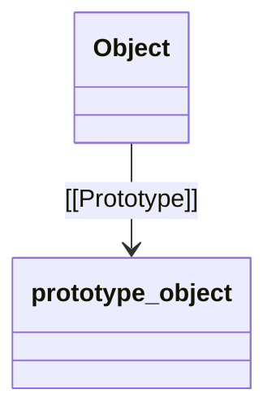
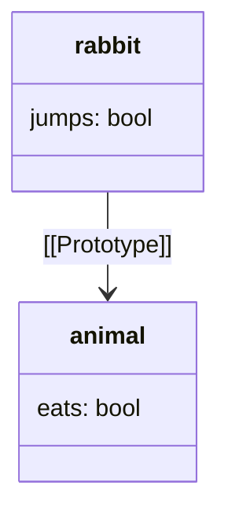
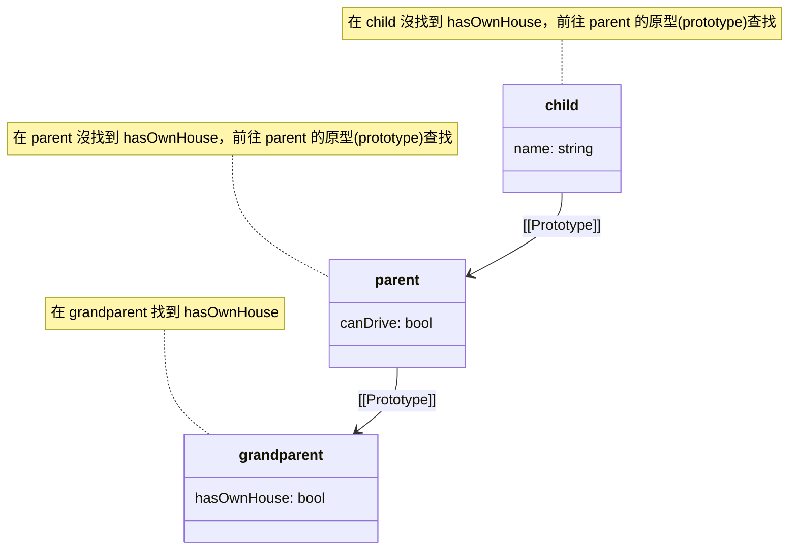

相信許多初次接觸 JavaScript **原型**的人都跟我有過同樣的經歷，在開始深入學習之前就被一連串相似的術語名詞弄得暈頭轉向，如`「proto」`、`「prototype」`、`「[[Prototype]]」`、`「原型 (prototype)」`、`「原型鏈 (prototype chain)」`、`「原型繼承 (prototypal inheritance)」`等。這些術語表面上相似，但實際上指涉的概念卻不相同，很容易混淆，即便我已經接觸 JavaScript 好一段時間了，要理解這些原型相關的知識還是花了我不少時間。

雖然在日常開發中，我們幾乎不會直接操作到物件的原型，但我認為，若想對 JavaScript 這個語言有更深層的理解，花一點時間學習原型仍然是非常重要且值得的。**原型繼承**雖然是一個抽象的概念，但卻是這門語言物件導向程式設計的核心基石。透徹理解原型，將為我們開啟對 JavaScript 更深層且宏觀的視野。由於原型涵蓋的概念與知識量很多，為了方便閱讀，我將會我對原型的理解拆成幾篇文章來介紹。本篇文章將會先簡單介紹**原型(Prototype)** 、**原型鏈(Prototype chain)** 與**原型繼承(Prototypal inheritance)** 的概念。本篇文章將帶領讀者先一步步認識 JS 原型中常見的名詞，以及最基本的概念，希望能夠幫助讀者建立起對 JS 原型的基礎認識。


<br/>


## **原型 (Prototype)**

### **JavaScript 中的原型(prototype)是什麼？**

在 JavaScript 中，每個物件都有一個隱藏屬性 `[[Prototype]]`，這個屬性指向另一個物件，這個被指向的物件稱為該物件的「**原型**」。原型的作用是讓物件可以繼承其他物件的屬性和方法，這是一種實現繼承的方式。



由於 `[[Prototype]]` 為內部屬性並無法直接被訪問到，JavaScript 提供了一個方便的屬性： `__proto__` ，來存取和修改物件的原型。`__proto__` 是一個非標準但被大多數現代瀏覽器支持的屬性，用於讀取和設置物件的原型。

例如：

```jsx
let animal = {
  eats: true
};

let rabbit = {
  jumps: true
};

rabbit.__proto__ = animal;

console.log(rabbit.eats); // true，從 animal 繼承
console.log(rabbit.jumps); // true，rabbit 自己的屬性
```

在這個例子中，我們使用 `__proto__` 來設置 rabbit 的原型為 animal，從而使 rabbit 繼承了 animal 的屬性。



:::danger
雖然 `__proto__` 在大多數瀏覽器中都被支持，但它並不是標準的一部分。為了更好的跨平台兼容性和程式碼的可讀性，建議使用標準的 `Object.getPrototypeOf` 和 `Object.setPrototypeOf` 方法來訪問和設置原型。
:::

### **原型(prototype) 的特性**

1. **所有物件都有原型**
    
    在 JavaScript 中，幾乎所有的物件在創建時都會自動被賦予一個原型，只有 `Object.prototype` 的原型是 `null`(這意味著 `Object.prototype` 是所有物件原型鏈的終點)。
    
    ```jsx
    let obj = {};
    console.log(Object.getPrototypeOf(obj) === Object.prototype); // true
    ```
    

2. **原型污染**

    由於所有繼承同一原型的物件都共享該原型的屬性和方法，因此修改原型可能會導致所有繼承該原型的物件發生變化。這在某些情況下可能會導致意料之外的行為，這種現象稱為「**原型污染**」。

    ```jsx
    let animal = {
      eats: true
    };

    let rabbit = {
      jumps: true,
      __proto__: animal
    };

    animal.eats = false;

    console.log(rabbit.eats); // false
    ```


<br/>


## **原型繼承(Prototypal Inheritance)**

### **原型繼承(Prototypal inheritance)的基本概念**

**原型繼承(Prototypal inheritance)** 是 JavaScript 中的一種繼承機制，它允許物件共享屬性和方法。如前面所講的，每個物件都有一個隱藏的內部屬性 `[[Prototype]]`，指向另一個物件，這個被指向的物件稱為「**原型(prototype)**」。當我們訪問一個物件的屬性或方法時，如果該物件本身沒有這個屬性或方法，JavaScript 會到它的`[[Prototype]]` 所指的原型物件裡去查詢，如果還是找不到，就會接著繼續到這個原型物件的的`[[Prototype]]` 所指的物件尋找，直到找到所需的屬性或方法或達到原型鏈的終點 `null` 為止，這就是待會要介紹的**原型鏈(Prototype chain)** 的概念

以下是一個示範原型繼承的簡單範例：

```jsx
let vehicle = {
  hasEngine: true,
  startEngine() {
    console.log("Engine started");
  }
};

let car = {
  wheels: 4,
  __proto__: vehicle
};

let electricCar = {
  batteryCapacity: "100 kWh",
  __proto__: car
};

console.log(electricCar.hasEngine); // true，從 vehicle 繼承
console.log(electricCar.wheels); // 4，從 car 繼承
console.log(electricCar.batteryCapacity); // "100 kWh"，electricCar 自己的屬性
electricCar.startEngine(); // "Engine started"，從 vehicle 繼承的方法
```

在這個範例中，electricCar 繼承了 car 和 vehicle 的屬性和方法。當我們訪問 electricCar.hasEngine 時，JavaScript 首先在 electricCar 物件本身查找這個屬性。如果找不到，它會在 electricCar 的原型（即 car）中查找，接著在 car 的原型（即 vehicle）中查找。

### **在原型上覆寫屬性和方法**

**覆寫(override)** 是指在物件本身定義一個與其原型中同名的屬性或方法。這樣做會導致物件本身的屬性或方法覆蓋原型中的對應屬性或方法，而不會改變原型中的屬性或方法。覆寫允許我們在保持原型繼承的同時，對某些屬性或方法進行定制化。

我們來看一個保留原型方法並擴展的覆寫原型方法範例：

```jsx
let vehicle = {
  start() {
    console.log("Vehicle starting");
  }
};

let car = {
  start() {
    // 調用原型中的 start 方法
    vehicle.start.call(this);
    console.log("Car starting");
  },
  __proto__: vehicle
};

car.start();
// "Vehicle starting"
// "Car starting"
```

在這個例子中，我們在 car 的 start 方法中調用了 vehicle 的 start 方法，然後再執行 car 自己的方法。這樣，我們就保留了原型中的行為，同時擴展了新的行為。

### **你的屬性不是你的屬性**

在 JavaScript 中，當我們訪問一個物件的屬性時，這個屬性不一定是定義在這個物件本身上的。這是因為 JavaScript 的**原型繼承**機制允許物件從它的**原型**繼承屬性和方法。因此，當我們訪問一個物件的屬性時，該屬性可能是從該物件的原型或更高層的**原型鏈**中繼承而來的。

要判斷一個屬性是來自物件本身還是繼承自原型鏈，可以使用 `hasOwnProperty` 方法。這個方法只會在屬性存在於物件本身時返回 `true`，而不會檢查原型鏈。

例如：

```jsx
let animal = {
  eats: true
};

let rabbit = {
  jumps: true,
  __proto__: animal
};

console.log(rabbit.hasOwnProperty('jumps')); // true，因為 jumps 是 rabbit 自己的屬性
console.log(rabbit.hasOwnProperty('eats')); // false，因為 eats 是從 animal 繼承的
```

在這個範例中，我們可以看到 rabbit 有自己的 jumps 屬性，但 eats 屬性是從 animal 繼承而來的。


<br/>


## **原型鏈(Prototype Chain)的運作原理**

### **什麼是原型鏈(Prototype Chain)？**

前面我們在學習原型繼承時已經稍微提到了所謂**原型鏈(Prototype chain)** 的概念，現在讓我們更深入地來了解它。

原型鏈是 JavaScript 中用來實現物件繼承的一種機制。每個物件都有一個內部屬性 `[[Prototype]]`，指向另一個物件，這個被指向的物件稱為「**原型**」。當我們訪問一個物件的屬性或方法時，如果該物件本身沒有這個屬性或方法，JavaScript 會前往該物件的 `[[Prototype]]` 屬性所指得物件，也就是「**原型**」上面查找。如果還是找不到的話則會繼續沿著所在物件的`[[Prototype]]` 屬性向上查找，直到找到所需的屬性或方法或達到原型鏈的終點 `null` 為止。這樣的連接方式形成了一條鏈，稱為「**原型鏈**」。

讓我們來看一個範例，說明原型鏈的工作原理：

```jsx
let grandparent = {
  hasOwnHouse: true
};

let parent = {
  canDrive: true,
  __proto__: grandparent
};

let child = {
  name: "Alice",
  __proto__: parent
};

console.log(child.name); // "Alice"，child 自己的屬性
console.log(child.canDrive); // true，從 parent 繼承
console.log(child.hasOwnHouse); // true，從 grandparent 繼承

```



:::tip
由於 JavaScript 的所有物件最終都會繼承自 **Object.prototype**，這就是為什麼所有物件都能使用如 **toString**、**hasOwnProperty** 等方法，因為這些方法定義在 **Object.prototype** 上。
所以任何原型鏈的終點都是 **Object.prototype**，它的 `[[Prototype]]` 為 **null**，這表示已經到達了原型鏈的頂端。

```jsx
console.log(Object.prototype.__proto__); // null
```

:::

### **自己實作原型鏈的查找機制**

知道了原型鏈的查找機制後，我們可以自己實作一個模擬原型鏈查找機制的函數，來理解這個過程。

```jsx
let grandparent = {
  hairColor: 'black'
};

let parent = Object.create(grandparent);
parent.canDrive = true;

let child = Object.create(parent);
child.name = 'Alice';

console.log(getProperty(child, 'name')); // 'Alice'，child 自己的屬性
console.log(getProperty(child, 'canDrive')); // true，從 parent 繼承
console.log(getProperty(child, 'hairColor')); // 'black'，從 grandparent 繼承
console.log(getProperty(child, 'age')); // undefined，沿著原型鏈查找不到

```

### **this 在原型鏈中的行為**

在 JavaScript 中，`this` 關鍵字的值取決於函數的調用方式。當一個方法被調用時，`this` 通常指向調用該方法的物件。當方法存在於原型鏈中時，`this` 依然指向實際調用該方法的物件，而不是方法定義所在的原型物件。

讓我們來看一個範例，說明 `this` 在原型鏈中的行為：

```jsx
let grandparent = {
  greet() {
    console.log(`Hello from ${this.role}`);
  }
};

let parent = {
  __proto__: grandparent,
  role: "parent"
};

let child = {
  __proto__: parent,
  role: "child"
};

child.greet(); // "Hello from child"
parent.greet(); // "Hello from parent"
```

在這個例子中，child 和 parent 都繼承了 grandparent 的 greet 方法。在調用 child.greet() 和 parent.greet() 時，`this` 分別指向 child 和 parent，因此輸出的角色與調用方法的物件對應。

> **延伸問題：如何顯式設置 `this`?**
> 

有時候，我們可能希望在調用函數時顯式設置 `this` 的值。


1. `call`
    
    **call** 方法允許我們傳遞一個新的 `this` 值並立即調用函數。
    
    ```jsx
    grandparent.greet.call(child); // "Hello from child"
    grandparent.greet.call(parent); // "Hello from parent"
    ```
    
2. `apply`
    
    **apply** 方法與 **call** 類似，但它接受一個參數數組來調用函數。
    
    ```jsx
    let person = {
      setDetails(name, age) {
        this.name = name;
        this.age = age;
      }
    };
    
    let individual = {};
    
    person.setDetails.apply(individual, ["Alice", 30]);
    console.log(individual); // { name: "Alice", age: 30 }
    ```
    
3. `bind`
   
    **bind** 方法則會創建一個新的函數，這個新函數的 `this` 值固定為指定的物件，無論如何調用該函數，`this` 的值都不會改變。
    
    ```jsx
    let greetChild = grandparent.greet.bind(child);
    greetChild(); // "Hello from child"
    ```
    

:::caution[在原型物件中使用箭頭函數的風險]

箭頭函數不具有自己的 `this` 值。相反，它會捕獲定義時的 `this` 值，並在其範圍內使用。這意味著在原型物件中使用箭頭函數時，`this` 會保持為定義時的值，而不是呼叫時的物件。

舉例來說：

```jsx
let animal = {
  walk() {
    console.log(`${this.name} is walking`);
  },
  jump: () => {
    console.log(`${this.name} is jumping`);
  }
};

let rabbit = {
  name: "Rabbit",
  __proto__: animal
};

rabbit.walk(); // "Rabbit is walking"
rabbit.jump(); // "undefined is jumping"
```

在這個例子中，**walk** 方法是使用**普通函式**定義的，因此 `this` 指向呼叫它的物件 **rabbit**。然而，**jump** 方法是使用**箭頭函數**定義的，`this` 指向箭頭函數定義時所在的範疇（即 **animal** 物件的範疇）。
由於 **animal** 物件沒有 name 屬性，因此 **this.name** 是 **undefined**。

:::


<br/>


## **Reference**

- [**@Javascript.info - Prototypes, inheritance**](https://javascript.info/prototypes)
- [**@Javascript.info - Prototypes, inheritance**](https://javascript.info/prototypes)
- [**[教學] JavaScript Prototype (原型) 的用法**](https://www.shubo.io/javascript-prototype/)
- [**原型基礎物件導向**](https://eyesofkids.gitbooks.io/javascript-start-from-es6/content/part4/prototype.html)