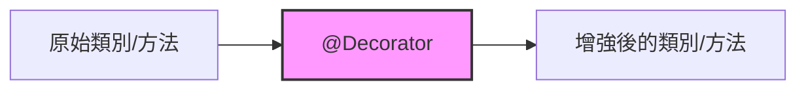
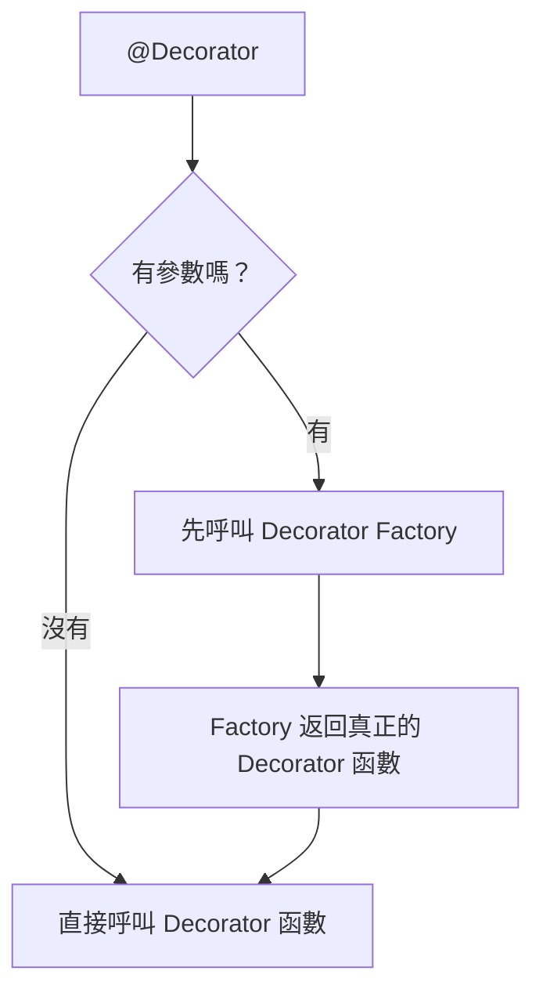
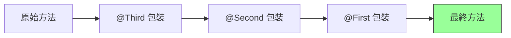
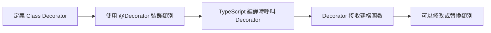
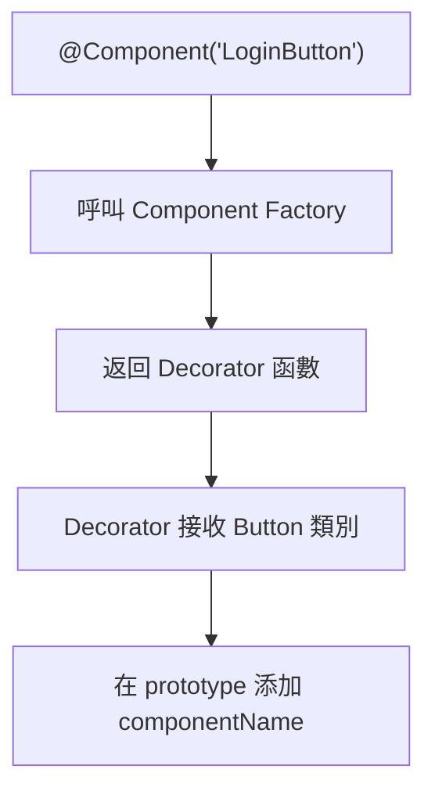
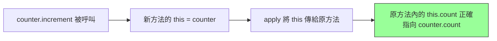
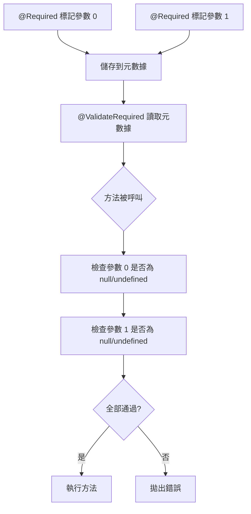
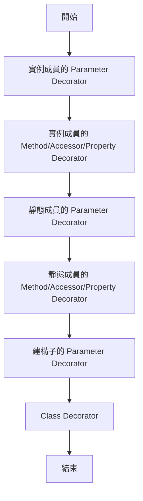

## **前言**

我第一次在工作裡接觸到 Decorator，是團隊後端從 Koa 技術轉型到 Nest.js 的那段期間。剛開始使用 Nest.js 時，其實我完全不清楚 Decorator 的原理，大多都是文件怎麼寫，我就怎麼寫——這裡放 `@Controller`、那裡加 `@Injectable`，照著文件寫能跑起來再說。但這些東西在 TypeScript 裡究竟是怎麼運作？背後為什麼要這樣設計？我其實完全沒有概念，一直停留在「照著範例抄」的階段。

最近想花點時間把 Decorator 的底層原理釐清，所以整理了這份筆記。內容包含我如何理解 Decorator、為什麼會需要它、以及我自己在實作過程中觀察到的行為，希望能把這些想法整理成一篇清楚的文章。

<br/>

## **什麼是 Decorator？**

### **Decorator 的本質**

我們可以把 Decorator 想成是：「在不改原本程式邏輯的前提下，替**類別**或**方法**貼上一些標籤（**metadata**），後續的程式碼或框架可以根據這些標籤做事」。這樣的方式可以把業務邏輯跟額外的關注點（像是日誌、權限、快取）分開來看，程式更好維護也比較乾淨。



### **為什麼需要 Decorator？**

在沒有 Decorator 之前，開發者們常常需要在每個方法內重複撰寫記錄日誌、權限檢查這類程式碼：

```tsx
// 沒有 Decorator 的世界
class UserService {
  createUser(name: string) {
    // 手動加上日誌
    console.log("開始創建用戶:", name);

    // 手動檢查權限
    if (!this.hasPermission()) {
      throw new Error("沒有權限");
    }

    // 實際的業務邏輯
    return { name, id: Math.random() };
  }

  updateUser(id: number, name: string) {
    // 又要重複寫一次日誌
    console.log("開始更新用戶:", id, name);

    // 又要重複檢查權限
    if (!this.hasPermission()) {
      throw new Error("沒有權限");
    }

    // 實際的業務邏輯
    return { id, name };
  }
}
```

造成的結果是：

- 🔴 **重複程式碼太多**：每個方法都要寫日誌、檢查權限
- 🔴 **業務邏輯不清晰**：真正的邏輯被這些「雜事」淹沒了
- 🔴 **難以維護**：如果要改日誌格式，每個方法都要改

在有了 Decorator 之後，我們可以把程式改寫如下：

```tsx
// 有 Decorator 的世界
class UserService {
  @Log
  @CheckPermission
  createUser(name: string) {
    // 只專注在業務邏輯
    return { name, id: Math.random() };
  }

  @Log
  @CheckPermission
  updateUser(id: number, name: string) {
    // 只專注在業務邏輯
    return { id, name };
  }
}
```

有 Decorator 輔助的好處顯而易見：

- ✅ **程式碼乾淨**：業務邏輯一目了然
- ✅ **可重用**：`@Log`  和  `@CheckPermission`  可以用在任何方法上
- ✅ **易維護**：要改日誌格式只需要改一個地方

### **Decorator 的基礎語法**

Decorator 使用  `@expression`  的形式，其中  `expression`  必須是一個函數：

```tsx
@DecoratorName
class MyClass {}

@DecoratorName
method() {}

@DecoratorName
property: string;
```

如果需要傳入參數，通常會寫成「裝飾器工廠」（Decorator Factory）：先呼叫一個函式傳參數，再回傳真正的裝飾器函式。

```tsx
@DecoratorName("參數1", "參數2")
class MyClass {}
```



### **多個 Decorator 疊加的執行順序**

一個方法可以有多個 Decorator，它們的執行順序是**由下往上**：

```tsx
class Example {
  @First
  @Second
  @Third
  method() {}
}

// 執行順序：Third → Second → First
```



### **TypeScript Decorator 的五種類型**

TypeScript 提供了五種 Decorator，分別可以裝飾不同的目標：

| Decorator 類型        | 裝飾目標      | 使用時機                       |
| --------------------- | ------------- | ------------------------------ |
| `Class Decorator`     | 類別          | 為類別添加元數據、修改建構函數 |
| `Method Decorator`    | 方法          | 日誌、性能測量、權限檢查       |
| `Property Decorator`  | 屬性          | 資料驗證、序列化配置           |
| `Accessor Decorator`  | getter/setter | 攔截屬性存取、快取             |
| `Parameter Decorator` | 方法參數      | 參數驗證、依賴注入             |

接下來，這篇文章會一個一個深入介紹。

### **必要的 tsconfig.json 配置**

由於 Decorator 是 TypeScript 的**實驗性功能**，預設是關閉的。我們必須在  `tsconfig.json`  中啟用它:

```json
{
  "compilerOptions": {
    "experimentalDecorators": true, // 必須設為 true
    "target": "ES2020", // 建議 ES2015 以上
    "module": "commonjs"
  }
}
```

> 由於 Decorator 目前還在 TC39(JavaScript 標準委員會)的提案階段。TypeScript 提前實現了這個功能,但語法可能會隨著標準演進而改變。不過也不用擔心，主流框架(Angular、NestJS、TypeORM)都在使用，並且已經相當穩定。

:::warning[重要提醒]

- 如果沒有啟用 `experimentalDecorators`,使用 Decorator 語法會報錯
- 對於 Parameter Decorator,還需要安裝 `reflect-metadata` 套件(稍後會詳細說明)

:::

<br/>

## **Class Decorator**

### **基本概念**

**Class Decorator** 是應用在類別聲明上的函數。它接收類別的建構函數作為參數，可以觀察、修改或替換類別定義。

```tsx
function ClassDecorator(constructor: Function) {
  // constructor 就是被裝飾的類別
}
```



### **範例 1：觀察類別**

最簡單的 Class Decorator，只是記錄類別的資訊：

```tsx
function LogClass(constructor: Function) {
  console.log("類別名稱:", constructor.name);
  console.log("建構函數:", constructor);
}

@LogClass
class User {
  name = "Bosh";
}

// 輸出：
// 類別名稱: User
// 建構函數: [class User]
```

:::tip

- Decorator 是在**類別定義時**執行，不是在創建實例時
- 這意味著上面的  `console.log`  會在程式編譯時就執行，而不是  `new User()`  時

:::

### **範例 2：Decorator Factory（接受參數）**

如果你想要傳入參數來自訂 Decorator 的行為，就需要使用 Decorator Factory：

```tsx
function Component(name: string) {
  // 這是 Factory，返回真正的 Decorator
  return function (constructor: Function) {
    console.log(`Component: ${name}`);
    // 在 prototype 上添加屬性
    (constructor.prototype as any).componentName = name;
  };
}

@Component("LoginButton")
class Button {
  render() {
    return "Button";
  }
}

const button = new Button();
console.log((button as any).componentName); // 'LoginButton'
```



### **範例 3：擴展類別**

Decorator 可以返回一個新的建構函數來替換原類別，這樣就能為類別添加新的屬性或方法：

```tsx
function Timestamped<T extends { new (...args: any[]): {} }>(constructor: T) {
  // 返回一個新的類別，繼承原類別
  return class extends constructor {
    createdAt = new Date();
  };
}

@Timestamped
class Article {
  title = "Hello Decorator";
}

const article = new Article() as any;
console.log(article.title); // 'Hello Decorator'
console.log(article.createdAt); // 當前時間
```

:::note[解析]

1. `@Timestamped` 裝飾器接收 Article 類別
2. 返回一個新類別，這個新類別繼承自 Article
3. 新類別多了一個 createdAt 屬性
4. TypeScript 用這個新類別替換原本的 Article

:::

### **Class Decorator 實務應用場景**

Class Decorator 在實務上常見的應用：

1. **依賴注入**（Angular、NestJS）

```tsx
@Injectable()
class UserService {}
```

2. **ORM 實體定義**（TypeORM）

```tsx
@Entity()
class User {
  @Column()
  name: string;
}
```

3. **自動註冊**

```tsx
@AutoRegister
class MyPlugin {}
```

<br/>

## **Method Decorator**

### **基本概念**

**Method Decorator** 是應用在方法上的函數。它可以觀察、修改或替換方法的定義。

```tsx
function MethodDecorator(
  target: any, // 類別的 prototype（實例方法）或建構函數（靜態方法）
  propertyKey: string, // 方法的名稱
  descriptor: PropertyDescriptor // 方法的屬性描述符
) {
  // descriptor.value 就是方法本身
}
```

### **理解 PropertyDescriptor**

在深入範例前，我們需要先理解  `PropertyDescriptor`。它是一個物件，描述了屬性的特徵：

```tsx
{
  value: any,             // 屬性的值（對方法來說就是函數本身）
  writable: boolean,      // 是否可以被重新賦值
  enumerable: boolean,    // 是否可以被列舉（for...in、Object.keys）
  configurable: boolean   // 是否可以被刪除或重新定義
}
```

如果你熟悉 JavaScript 的  `Object.defineProperty`，你可能會覺得這個結構很眼熟。沒錯，它們本質上是同一個東西！

`Object.defineProperty`  讓我們可以精確控制物件屬性的行為：

```tsx
// Object.defineProperty 的用法
Object.defineProperty(obj, "propertyName", {
  value: "some value",
  writable: true,
  enumerable: true,
  configurable: true,
});
```

在 Method Decorator 中，TypeScript 讓你直接拿到這個 descriptor，修改它，然後返回。這跟你手動呼叫  `Object.defineProperty`  是一樣的效果：

```tsx
// Decorator 做的事
function MyDecorator(target, propertyKey, descriptor) {
  descriptor.value = newFunction; // 修改 descriptor
  return descriptor; // 返回修改後的 descriptor
}

// 等同於
Object.defineProperty(target, propertyKey, {
  value: newFunction,
  writable: descriptor.writable,
  enumerable: descriptor.enumerable,
  configurable: descriptor.configurable,
});
```

所以 Decorator 其實是讓你用更優雅的方式來操作物件的屬性定義。

### **範例 1：日誌記錄**

最常見的應用就是自動記錄方法的呼叫：

```tsx
function Log(target: any, propertyKey: string, descriptor: PropertyDescriptor) {
  console.log(`@Log 裝飾 ${propertyKey} 方法`);

  // 保存原始方法
  const originalMethod = descriptor.value;

  // 替換為新方法
  descriptor.value = function (...args: any[]) {
    console.log(`調用: ${propertyKey}(${args.join(", ")})`);

    // 呼叫原始方法
    const result = originalMethod.apply(this, args);

    console.log(`返回:`, result);
    return result;
  };

  return descriptor;
}

class Calculator {
  @Log
  add(a: number, b: number): number {
    return a + b;
  }
}

const calc = new Calculator();
calc.add(5, 3);

// 輸出：
// @Log 裝飾 add 方法
// 調用: add(5, 3)
// 返回: 8
```

### **範例 2：執行時間測量**

想知道某個方法執行了多久也可以用 Decorator 輕鬆搞定：

```tsx
function Measure(
  target: any,
  propertyKey: string,
  descriptor: PropertyDescriptor
) {
  const originalMethod = descriptor.value;

  descriptor.value = function (...args: any[]) {
    const start = performance.now();
    const result = originalMethod.apply(this, args);
    const end = performance.now();

    console.log(`${propertyKey} 執行時間: ${(end - start).toFixed(2)}ms`);
    return result;
  };

  return descriptor;
}

class DataProcessor {
  @Measure
  processLargeArray() {
    let sum = 0;
    for (let i = 0; i < 1000000; i++) {
      sum += i;
    }
    return sum;
  }
}

const processor = new DataProcessor();
processor.processLargeArray();
// processLargeArray 執行時間: 2.34ms
```

### **範例 3：錯誤處理**

統一處理方法中的錯誤：

```tsx
function CatchError(
  target: any,
  propertyKey: string,
  descriptor: PropertyDescriptor
) {
  const originalMethod = descriptor.value;

  descriptor.value = function (...args: any[]) {
    try {
      return originalMethod.apply(this, args);
    } catch (error: any) {
      console.error(`${propertyKey} 發生錯誤: ${error.message}`);
      throw error; // 重新拋出，讓呼叫方決定如何處理
    }
  };

  return descriptor;
}

class Calculator {
  @CatchError
  divide(a: number, b: number): number {
    if (b === 0) throw new Error("除數不能為 0");
    return a / b;
  }
}

const calc = new Calculator();
calc.divide(10, 2); // 正常執行
calc.divide(10, 0); // divide 發生錯誤: 除數不能為 0
```

### **重要觀念解析： 為什麼要用  `apply(this, args)`  而不是直接呼叫原方法？**

**❌ 錯誤做法：**

```tsx
descriptor.value = function (...args: any[]) {
  // 錯誤：直接呼叫，this 會丟失！
  const result = originalMethod(...args);
  return result;
};
```

:::danger[直接呼叫 originalMethod(...args) 會有什麼問題？]

當你直接呼叫  `originalMethod(...args)`  時，方法內部的  `this`  會變成  `undefined`（嚴格模式）或全域物件（非嚴格模式）。

:::

這跟 JavaScript 的  `this`  綁定規則有關，在 JavaScript 中，`this`  的值取決於**函數如何被呼叫**，而不是在哪裡定義：

```tsx
class Person {
  name = "Bosh";

  greet() {
    console.log(this.name);
  }
}

const person = new Person();

// 情況 1: 作為方法呼叫
person.greet(); // 'Bosh'  ✅ this = person

// 情況 2: 把方法拿出來單獨呼叫
const greetFunc = person.greet;
greetFunc(); // undefined 或錯誤  ❌ this 丟失！
```

在 Decorator 中，當你這樣寫：

```tsx
const result = originalMethod(...args); // ❌
```

這等同於「情況 2」，方法被單獨呼叫，沒有跟任何物件綁定，所以：

- **嚴格模式下**（TypeScript 預設）：`this`  是  `undefined`
- **非嚴格模式下**：`this`  是全域物件（瀏覽器的  `window`  或 Node.js 的  `global`）

**✅ 正確做法：**

```tsx
descriptor.value = function (...args: any[]) {
  // 正確：使用 apply 綁定 this
  const result = originalMethod.apply(this, args);
  return result;
};
```

`apply(this, args)`  做了兩件事：

1. 將當前函數的  `this`（也就是實例本身）傳遞給原方法
2. 將參數陣列展開傳入



**其他寫法：**

```tsx
// 方法 1: 使用 apply（推薦）
const result = originalMethod.apply(this, args);

// 方法 2: 使用 call（參數較少時）
const result = originalMethod.call(this, arg1, arg2);

// 方法 3: 使用 bind（較少用）
const boundMethod = originalMethod.bind(this);
const result = boundMethod(...args);
```

### **Method Decorator 實務應用場景**

1. **權限檢查**

```tsx
@RequireAuth
@RequireRole('admin')
deleteUser(id: number) {}
```

2. **快取**

```tsx
@Cache(3600) // 快取 1 小時
getExpensiveData() {}
```

3. **Transaction 管理**

```tsx
@Transaction
async updateUserAndOrder() {}
```

<br/>

## **Property Decorator**

### **基本概念**

**Property Decorator** 是應用在屬性上的函數。與其他 Decorator 不同，它**沒有** `descriptor`  參數。

```tsx
function PropertyDecorator(
  target: any, // 類別的 prototype 或建構函數
  propertyKey: string // 屬性的名稱
) {
  // 注意：沒有 descriptor！
}
```

:::warning[重點提醒：]

- Property Decorator**不能直接修改屬性的值**
- 如果需要攔截屬性的讀寫，要使用`Object.defineProperty`

:::

### **範例 1：設定預設值**

```tsx
function Default(value: any) {
  return function (target: any, propertyKey: string) {
    console.log(`@Default(${value}) 在 ${propertyKey}`);

    let val = value;

    Object.defineProperty(target, propertyKey, {
      get() {
        return val;
      },
      set(newVal) {
        console.log(`${propertyKey} = ${newVal}`);
        val = newVal;
      },
      enumerable: true,
      configurable: true,
    });
  };
}

class Product {
  @Default(0)
  price!: number;
}

const product = new Product();
console.log(product.price); // 0
product.price = 100; // price = 100
```

### **範例 2：屬性驗證**

限制屬性的值必須在特定範圍內：

```tsx
function Range(min: number, max: number) {
  return function (target: any, propertyKey: string) {
    let value: number;

    Object.defineProperty(target, propertyKey, {
      get() {
        return value;
      },
      set(newVal: number) {
        if (newVal < min || newVal > max) {
          throw new Error(
            `${propertyKey} 必須在 ${min}-${max} 之間，但得到 ${newVal}`
          );
        }
        value = newVal;
        console.log(`✅ ${propertyKey} = ${value}`);
      },
      enumerable: true,
      configurable: true,
    });
  };
}

class Product {
  @Range(0, 100)
  discount!: number;
}

const product = new Product();
product.discount = 50; // ✅ discount = 50
product.discount = 150; // Error: discount 必須在 0-100 之間
```

### **Property Decorator 實務應用場景**

1. **ORM 欄位定義**（TypeORM）

```tsx
class User {
  @Column({ type: "varchar", length: 255 })
  name: string;

  @Column({ type: "int" })
  age: number;
}
```

2. **資料驗證**

```tsx
class UserForm {
  @Required
  @Email
  email: string;

  @MinLength(8)
  password: string;
}
```

<br/>

## **Accessor Decorator**

### **基本概念**

**Accessor Decorator** 是應用在 getter 或 setter 上的函數。它與 Method Decorator 非常相似，也有  `descriptor`  參數。

```tsx
function AccessorDecorator(
  target: any, // 類別的 prototype 或建構函數
  propertyKey: string, // 存取器的名稱
  descriptor: PropertyDescriptor
) {
  // descriptor.get: getter 函數
  // descriptor.set: setter 函數
}
```

:::warning[重點提醒：]

- TypeScript 不允許同時裝飾 getter 和 setter
- 只需要裝飾其中一個，Decorator 會同時作用於兩者

:::

### **範例 1：記錄存取**

```tsx
function LogAccess(
  target: any,
  propertyKey: string,
  descriptor: PropertyDescriptor
) {
  const originalGetter = descriptor.get;
  const originalSetter = descriptor.set;

  if (originalGetter) {
    descriptor.get = function () {
      const value = originalGetter.call(this);
      console.log(`讀取 ${propertyKey}: ${value}`);
      return value;
    };
  }

  if (originalSetter) {
    descriptor.set = function (value: any) {
      console.log(`設定 ${propertyKey}: ${value}`);
      originalSetter.call(this, value);
    };
  }

  return descriptor;
}

class Person {
  private _name: string = "";

  @LogAccess
  get name(): string {
    return this._name;
  }

  set name(value: string) {
    this._name = value;
  }
}

const person = new Person();
person.name = "Bosh"; // 設定 name: Bosh
console.log(person.name); // 讀取 name: Bosh
```

### **範例 2：計算結果快取**

對於計算量大的 getter，我們可以快取結果：

```tsx
function Memoize(
  target: any,
  propertyKey: string,
  descriptor: PropertyDescriptor
) {
  const originalGetter = descriptor.get;

  if (originalGetter) {
    const cacheKey = Symbol(`__cache_${propertyKey}__`);

    descriptor.get = function () {
      // 檢查快取
      if ((this as any)[cacheKey] !== undefined) {
        console.log(`💾 從快取讀取 ${propertyKey}`);
        return (this as any)[cacheKey];
      }

      // 計算並快取
      const value = originalGetter.call(this);
      (this as any)[cacheKey] = value;
      console.log(`⚡ 計算並快取 ${propertyKey}: ${value}`);
      return value;
    };
  }

  return descriptor;
}

class Rectangle {
  constructor(public width: number, public height: number) {}

  @Memoize
  get area(): number {
    console.log("🧮 計算面積...");
    return this.width * this.height;
  }
}

const rect = new Rectangle(5, 10);
console.log(rect.area); // 🧮 計算面積... ⚡ 計算並快取 area: 50
console.log(rect.area); // 💾 從快取讀取 area
```

<br/>

## **Parameter Decorator**

### **基本概念**

**Parameter Decorator** 是所有 Decorator 中最特別的一個。它**不能直接修改參數**，只能用來「觀察」參數的存在。

```tsx
function ParameterDecorator(
  target: any, // 類別的 prototype 或建構函數
  propertyKey: string, // 方法的名稱
  parameterIndex: number // 參數的索引位置（從 0 開始）
) {
  // 只能記錄資訊，不能修改參數
}
```

### **Parameter Decorator 的限制**

```tsx
function MyDecorator(target: any, propertyKey: string, parameterIndex: number) {
  // ❌ 你不能在這裡驗證參數
  // ❌ 你不能在這裡修改參數值
  // ✅ 你只能記錄「這個參數需要被處理」的資訊
}
```

**Parameter Decorator** 通常需要**配合 Method Decorator**  使用。工作流程是：

1. Parameter Decorator 記錄「哪些參數需要驗證」
2. Method Decorator 讀取這些記錄，在方法執行時進行驗證



### **reflect-metadata：元數據的儲存庫**

要實現上述流程，我們需要一個地方來儲存「哪些參數需要驗證」的資訊。這就是  `reflect-metadata`  的作用。

**安裝：**

```bash
npm install reflect-metadata
```

**使用：**

```tsx
import "reflect-metadata";

// 儲存元數據
Reflect.defineMetadata(key, value, target, propertyKey);

// 讀取元數據
Reflect.getOwnMetadata(key, target, propertyKey);
```

### **範例：必填參數驗證**

```tsx
import "reflect-metadata";

const requiredMetadataKey = Symbol("required");

// Parameter Decorator：記錄哪些參數是必填的
function Required(target: any, propertyKey: string, parameterIndex: number) {
  console.log(`@Required 在參數 ${parameterIndex}`);

  // 取得已記錄的必填參數列表
  const existingRequired: number[] =
    Reflect.getOwnMetadata(requiredMetadataKey, target, propertyKey) || [];

  // 加入當前參數的索引
  existingRequired.push(parameterIndex);

  // 儲存回去
  Reflect.defineMetadata(
    requiredMetadataKey,
    existingRequired,
    target,
    propertyKey
  );
}

// Method Decorator：驗證必填參數
function ValidateRequired(
  target: any,
  propertyKey: string,
  descriptor: PropertyDescriptor
) {
  console.log(`@ValidateRequired 在 ${propertyKey}`);

  const originalMethod = descriptor.value;

  descriptor.value = function (...args: any[]) {
    // 讀取必填參數列表
    const requiredParams: number[] =
      Reflect.getOwnMetadata(requiredMetadataKey, target, propertyKey) || [];

    // 逐一檢查
    for (const index of requiredParams) {
      if (args[index] === undefined || args[index] === null) {
        throw new Error(`參數 ${index} 在方法 ${propertyKey} 中是必填的`);
      }
    }

    // 驗證通過，執行原方法
    return originalMethod.apply(this, args);
  };

  return descriptor;
}

// 使用範例
class UserService {
  @ValidateRequired
  createUser(
    @Required username: string,
    @Required email: string,
    age?: number
  ) {
    console.log(`✅ 創建用戶: ${username}, ${email}, ${age || "N/A"}`);
    return { username, email, age };
  }
}

const service = new UserService();
service.createUser("Bosh", "bosh@example.com", 25); // ✅ 成功
service.createUser("John", null as any); // ❌ Error: 參數 1 是必填的
```

### **為什麼需要 reflect-metadata？**

你可能會想：「為什麼不用普通的物件或 Map 來儲存這些資訊？」

理論上可以，但  `reflect-metadata`  有以下優勢：

| 特性     | 普通物件       | reflect-metadata        |
| -------- | -------------- | ----------------------- |
| 命名衝突 | 容易發生       | 使用 Symbol，不會衝突   |
| 全域污染 | 會污染全域空間 | 元數據附加在物件上      |
| 標準化   | 自己定義 API   | 統一的 API              |
| 框架相容 | 可能衝突       | Angular、NestJS 都 用它 |
| 未來標準 | 不是標準       | TC39 提案               |

<br/>

## **Decorator 的執行順序**

當一個類別有多個 Decorator 時，執行順序是固定的：

```tsx
@ClassDecorator
class Example {
  @PropertyDecorator
  property: string;

  @AccessorDecorator
  get accessor() { return this.property; }
  set accessor(value: string) { this.property = value; }

  @MethodDecorator
  method(@ParameterDecorator param: string) {}

  static @PropertyDecorator staticProperty: string;

  static @MethodDecorator staticMethod() {}
}
```

**執行順序：**

1. **實例成員**：Parameter → Method/Accessor/Property
2. **靜態成員**：Parameter → Method/Accessor/Property
3. **建構子**：Parameter
4. **類別**：Class Decorator



<br/>

## **Reference**

- [**@TypeScript - Decorators**](https://www.typescriptlang.org/docs/handbook/decorators.html#handbook-content)
- [**@Javascript.info - Decorators and forwarding, call/apply**](https://javascript.info/call-apply-decorators)
- [**十分鐘帶你了解 TypeScript Decorator**](https://oldmo860617.medium.com/%E5%8D%81%E5%88%86%E9%90%98%E5%B8%B6%E4%BD%A0%E4%BA%86%E8%A7%A3-typescript-decorator-48c2ae9e246d)
- [**[React.js] 用 @decorator 來裝飾你的 Component 吧！**](https://larrylu.blog/react-decorator-hoc-2536db2737cb)
