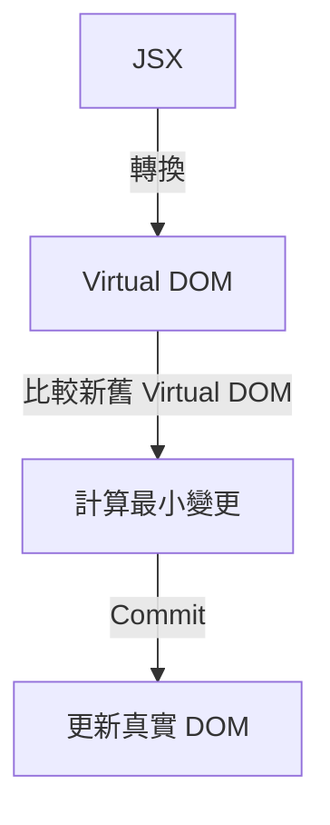
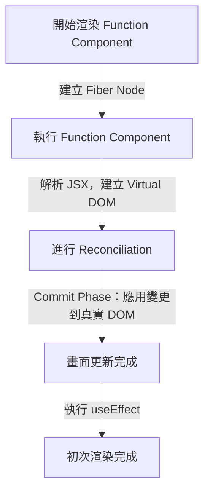
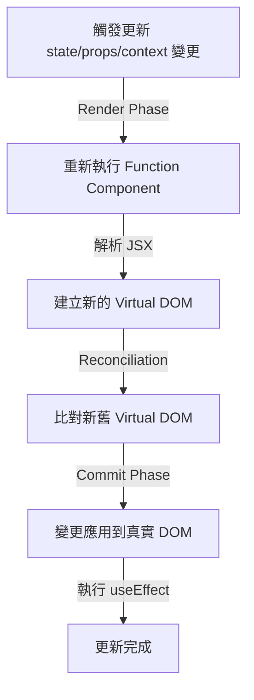
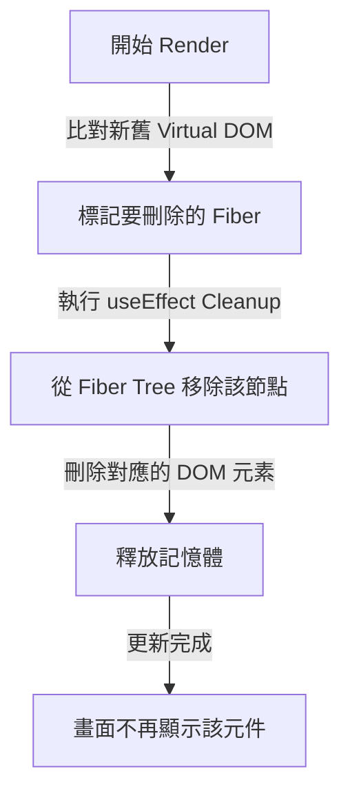

## **淺談 React Component 的生命週期**

### **何謂元件的生命週期？**

首先，我們來聊聊「生命週期」是什麼。簡單來說，生命週期就是一個 React 元件從被放到畫面上，到隨著資料改變而更新，再到最後從畫面上消失的過程，這些階段就是它的「生命週期」。

在技術上，生命週期有三個主要階段：

- **Mounting（掛載）**：元件第一次出現在畫面上的時候。
- **Updating（更新）**：元件的狀態或屬性改變，畫面需要重新渲染的時候。
- **Unmounting（卸載）**：元件從畫面上被移除的時候。

對於大部分的 React 開發者來說，只要知道元件在什麼時間點會進入哪個生命週期階段，以及 hooks 在各個階段會有什麼樣的行為，就足以應付所有開發任務。不過，我認為要成為更進階的 React 開發者，理解生命週期底層的運作原理也是很重要的。這篇文章會帶大家一起理解 Functional Component 在各個生命週期階段的工作細節。

### **從 Class Component 到 Function Component**

如果你曾經學過 **Class Component**，應該對它的生命週期方法（如 `componentDidMount`、`componentDidUpdate`、`componentWillUnmount`）不陌生。這些方法讓我們能夠在特定時間點執行某些動作，比如：

- **元件掛載時（Mount）**：像是向 API 取得初始資料。
- **元件更新時（Update）**：監聽 `props` 或 `state` 變化並做出對應反應。
- **元件卸載時（Unmount）**：清除計時器、取消訂閱、釋放資源。

但是，自從 **React v16**  推出了 **Functional Component** 開始，這些生命周期方法不見了，取而代之的是 **Hook**。如果你也經歷過 Functional Component 尚未完全取代 Class Component 的時期（也就是 React 官方網站同時有 functional component 教學與 class component 教學的時期），你可能跟我一樣，在網路上查詢 「React 元件生命週期」的關鍵字，卻只搜尋得到 Class Component 的生命週期方法，甚至會懷疑 *Function Component 如果只是單純的 JavaScript 函式，那它會有生命周期嗎？*

由於以前 class component 時代的 React 有很明確的生命週期方法，比如 `componentDidMount`（元件掛載時執行）、`componentDidUpdate`（元件更新時執行），還有 `componentWillUnmount`（元件卸載時執行）。轉換到 Functional Component 後，從表面上看，Function Component 只是個函式，感覺沒有「開始」或「結束」的概念。但實際上，每當 React 需要渲染一個 Function Component，它會按照一定的步驟來執行，而這些步驟構成了 Function Component 的「隱藏生命週期」。後面的章節將會介紹 React 底層是如何透過一些聰明的機制讓簡單的函數也能擁有「出生」、「改變」、「死亡」的過程。

:::tip[現階段我們可以這樣理解：]
- Class Component 是自己定義生命週期行為
- Functional Component 是把控制權交給 React，讓它用更聰明的方式處理。
:::


<br/>


## **React 的底層運作：生命週期的幕後推手**

在開始探究 Functional Component 生命週期每個階段的細節之前，我們先來簡單認識一下幾個支撐生命週期運作的 React 底層機制，並看看它們如何影響 Component 的「出生、變化、死亡」過程。

### **Virtual DOM：React 的 UI 記憶體模型**

在 JavaScript 中直接操作 DOM 時，每次更新畫面都需要與瀏覽器進行大量的溝通，這種操作相對來說是昂貴的。為了提升效能，React 引入了 **Virtual DOM**（虛擬 DOM）的概念，作為 **真實 DOM 的輕量級 JavaScript 版本**。我們可以把 Virtual DOM 想像成一個 **內存中的 DOM 樹**，React 會在這個虛擬環境中進行 UI 計算，然後再將最小範圍的變更應用到真實 DOM。

Virtual DOM 運作流程如下：

1. **JSX 轉換**：當我們呼叫 `ReactDOM.createRoot().render(<App />)` 或 `ReactDOM.render(<App />, document.getElementById('root'))`，React 會先把 JSX 轉換成 Virtual DOM。
2. **建立 Virtual DOM 樹**：React 會基於 JSX 描述的 UI 結構建立一棵 Virtual DOM 樹。
3. **比較新舊 Virtual DOM（Diffing）**：當狀態變化導致 UI 需要更新時，React 會比較新的 Virtual DOM 與舊的 Virtual DOM，計算出「最小變更集」。
4. **更新真實 DOM（Commit）**：最後，React 會將這些最小變更套用到真實 DOM，確保 UI 呈現正確的狀態。



:::tip[Virtual DOM 的優勢]
- **效能優化**：直接操作真實 DOM 代價高昂，而 Virtual DOM 允許 React 在內存中運算，最後一次性更新真實 DOM，減少不必要的重繪。
- **跨平台能力**：React Native 使用 Virtual DOM 來驅動原生 UI，React DOM 則對應瀏覽器環境。
- **程式碼結構清晰**：透過 JSX 讓開發者更直覺地描述 UI，而不用直接操作 DOM API。
:::

### **Reconciliation：React 如何決定哪些要更新？**

React 的核心更新機制叫做 **Reconciliation（調和）**，它的主要目標是找出 UI 變化的最小範圍，並只更新該部分的真實 DOM，而不是全部重新渲染。

Reconciliation 的流程如下：

1. **比較新舊 Virtual DOM（Diffing 演算法）**
    
    React 透過 **Diffing** 比較新的 Virtual DOM 與舊的 Virtual DOM，找出需要變更的地方。
    
    這裡有個重要規則：
    
    - **同級比較**：React 只會比較同一層級的節點，不會跨層級比較。
    - **Key 影響比較結果**：若兩個元素的 `key` 相同，React 會認為它們是相同的節點，否則會當作新元素來處理。
2. **標記變更**
    
    React 會標記需要變更的節點，這些標記可能是：
    
    - **新增節點**
    - **刪除節點**
    - **更新節點**
3. **Commit 更新到真實 DOM**
    
    當標記完成後，React 會將這些變更應用到真實 DOM，使畫面更新。
    

### **Fiber 架構：生命週期的執行引擎**

在 React 16 之前，React 是同步渲染的，當 UI 變更時，React 會一次性計算整棵 Virtual DOM，然後一次性更新 DOM。但這在大型應用程式中可能導致畫面卡頓，影響使用者體驗。因此，React 16 引入了 **Fiber 架構**，讓 React 變成「可中斷的渲染系統」。

那麼，究竟什麼是「**Fiber**」呢？若要全面且詳細地說明 **Fiber** 的話，可能一篇文章也說明不完，這邊就用最簡單的方式來簡介：

Fiber 是 React 內部的一個資料結構，每個 React 元件都有一個對應的 Fiber 節點，記錄它的狀態、屬性、副作用等等，這些節點組成了 **Fiber 樹**。在渲染階段(Render Phase)，React **根據 Fiber 樹** 計算哪些節點需要更新，在渲染階段這個過程**可以被打斷**，React 會優先處理更重要的更新。而在提交階段(Commit Phase)這個階段則**不會被打斷**，React 將計算好的變更應用到真實 DOM。

此外， Fiber 還包含了一些重要的特性，例如：

- **將渲染拆解為更小的單元**，允許 React 在計算期間讓出控制權，避免阻塞瀏覽器的 UI 更新。
- **支援可中斷的更新**，優先處理更重要的更新，提升使用者體驗。


<br/>


## **Mount 階段：元件的誕生**

當我們在 React 應用中渲染一個 Function Component，React 會執行一系列步驟，將它轉換為畫面上的 DOM。這個過程分為兩個主要階段：

1. **Render Phase（渲染階段）**：建立 Fiber 樹，計算變更。
2. **Commit Phase（提交階段）**：應用變更到真實 DOM，畫面正式出現。

### **初次渲染的完整流程**

當我們在 React 應用中渲染一個 Function Component，React 會執行一系列步驟，將它轉換為畫面上的 DOM。我們可以用以下流程圖來視覺化這個過程：



### **Render Phase：建立 Fiber 樹**

當我們執行 `ReactDOM.render(<App />)`，React 會開始**建立 Fiber 樹**。React 會為每個 Function Component 建立一個對應的 **Fiber 節點（Fiber Node）**，這些節點會記錄：

- **Component 的類型**（如 `function App()`）
- **對應的 JSX 結構**
- **狀態（State）**
- **props**
- **Effect（副作用）**

### **Render Phase：執行 Function Component**

接下來，React **執行 Function Component**，並呼叫它的 `return`，解析 JSX 結構。例如：

```tsx
const App = () => {
  console.log("App 組件被執行！");
  return <h1>Hello, React!</h1>;
};
```

當 React 執行 `App()`，它會執行 `console.log()`，然後回傳 `<h1>Hello, React!</h1>`，React 會根據這個回傳值來建立 Virtual DOM。

### **Render Phase：解析 JSX，建立 Virtual DOM**

當 `App()` 回傳 JSX 時，React 不會直接建立真實 DOM，而是先轉換成 Virtual DOM。

```tsx
const App = () => {
  return (
    <div>
      <h1>Hello, React!</h1>
    </div>
  );
};
```

這段 JSX 會被轉換成以下的 Virtual DOM：

```tsx
{
  type: "div",
  props: {
    children: [
      {
        type: "h1",
        props: { children: "Hello, React!" }
      }
    ]
  }
}
```

React 會將這些 Virtual DOM 物件與 Fiber 節點關聯起來，為下一步做準備。

### **Reconciliation：比對新舊 Virtual DOM**

在 Virtual DOM 建立後，React 會開始 **比對新舊 Virtual DOM（Reconciliation）**，找出哪些部分需要更新。初次渲染時，畫面上還沒有任何內容，因此 React 會標記整棵 Fiber 樹為 **需要新增**，所有節點都會被加入真實 DOM。

### **Commit Phase：變更提交到真實 DOM**

Render Phase 結束後，React 會進入 **Commit Phase**，在這個階段：

- React 將計算出的變更應用到真實 DOM
- useLayoutEffect 會在 DOM 更新後執行
- useEffect 會在畫面更新後（下一次畫面重繪後）執行


<br/>


## **Update 階段：元件的變化**

當 `state` 或 `props` 變更時，React 需要決定哪些部分應該更新，並執行對應的重新渲染邏輯。

這個過程與 Mount 階段類似，同樣分為兩個主要階段：

1. **Render Phase（渲染階段）**：重新執行 Function Component，計算變更。
2. **Commit Phase（提交階段）**：將變更應用到真實 DOM，觸發副作用。

### **什麼情況會觸發更新？**

React 會在以下幾種情況下觸發更新（重新渲染）：

1. **`state` 變更：** 透過 `useState` 或 `useReducer` 更新狀態，React 會重新執行該 Function Component。
2. **`props` 變更：** 父元件傳入的 `props` 改變時，React 會重新執行該元件。
3. **`context` 變更：** 當使用 `useContext` 取得的值發生變化時，所有使用該 context 的元件都會重新渲染。
4. **Parent Component 重新渲染：** 當父元件重新渲染時，子元件會重新執行（即使 `props` 沒變）。可透過 `React.memo` 避免不必要的重新渲染。

### **Functional Component 完整更新流程**

當元件的 `state` 或 `props` 變更時，React 會執行以下步驟來處理更新：



### **Render Phase：重新執行 Function Component**

當 React 偵測到需要重新渲染時，會從該元件的 Fiber 節點開始，重新執行 **Function Component。**

:::warning
前面我們有提到，React 內部使用 Fiber Node 來管理 Hook 的狀態。 Fiber Node 的結構為 linked list，依賴固定的 Hook 執行順序來比對前後次渲染的狀態。每次 Function Component 重新執行時，Hook 也會重新執行，因此為了防止 Hook 執行順序不固定導致狀態錯亂，React 規定**不能把 Hook 放在條件語句或迴圈中**。
:::

### **Render Phase：建立新的 Virtual DOM**

與 Mount 階段相同，React 會重新執行 JSX，並建立新的 Virtual DOM。

### **Reconciliation：如何決定哪些要重新渲染？**

Reconciliation 的目標是 **最小化 DOM 操作**，提升效能。React 採用 **Diffing 演算法** 來比較新舊 Virtual DOM，找出需要更新的部分。

**React 的 Diffing 規則：**

1. **節點類型相同** → 只更新 `props`
    
    ```html
    <h1 class="title">Hello</h1>
    <h1 class="subtitle">Hello</h1>
    ```
    
    **只會更新 class，而不會移除 `<h1>`。**
    
2. **節點類型不同** → 直接移除並新增
    
    ```html
    <h1>Hello</h1>
    <p>Hello</p>
    ```
    
    **React 會移除 `<h1>`，並新增 `<p>`。**
    
3. **列表元素（array）變更時，需使用 `key`**
    
    ```tsx
    {items.map((item) => (
      <div key={item.id}>{item.name}</div>
    ))}
    ```
    
    **`key` 讓 React 能正確比對變更，避免不必要的重新渲染。**
    
    :::warning
    這也是為什麼不該使用 `index` 作為 `key` 的原因，因為當列表發生重新排序或刪除時，React 可能會錯誤地對應元素，導致不必要的 DOM 操作。
    :::
    
    

### **Commit Phase：變更提交到真實 DOM**

當 React 確定哪些部分要更新後，它會進入 **Commit Phase**，並且：

1. 更新 DOM
2. 上一次 render 版本的`useEffect` Cleanup
3. 執行 `useEffect`


<br/>


## **Unmount 階段：元件的卸載**

### **什麼情況下元件會被卸載？**

元件的「卸載」（Unmount）指的是 **它從畫面上移除，不再被 React 追蹤**。

這通常發生在以下幾種情況：

1. **條件渲染導致的卸載**
    
    ```tsx
    function App() {
      const [show, setShow] = useState(true);
    
      return (
        <>
          <button onClick={() => setShow(!show)}>切換顯示</button>
          {show && <ChildComponent />}
        </>
      );
    }
    ```
    
    - 當 `show` 設為 `false` 時，`<ChildComponent />` 會從畫面上消失。
2. **父元件被移除**
    
    ```tsx
    function Parent() {
      return <Child />;
    }
    
    function App() {
      const [show, setShow] = useState(true);
      return <>{show && <Parent />}</>;
    }
    ```
    
    - 當 `Parent` 被移除時，它的子元件 `Child` **也會一併被卸載**。
3. **列表重新渲染時 `key` 發生變化**
    
    ```tsx
    function App() {
      const [items, setItems] = useState([1, 2, 3]);
    
      return (
        <>
          {items.map((item) => (
            <Item key={item} value={item} />
          ))}
          <button onClick={() => setItems([4, 5, 6])}>切換列表</button>
        </>
      );
    }
    ```
    
    - 當 `setItems([4, 5, 6])` 觸發變更時，React 會發現 **新的 `key` 與舊的 `key` 不同**，因此會 **卸載舊的元件，然後重新建立新的元件**。

### **React 如何標記需要卸載的元件？**

在 React 內部，卸載的過程發生在父元件的 **Reconciliation 階段**，當 React 發現某個元件不再存在於新的 Virtual DOM 中時，它會：

1. **標記該 Fiber Node 為「刪除」（Deletion）**
2. **執行 `useEffect` 的 Cleanup function**
3. **將該 Fiber Node 從 Fiber Tree 移除**
4. **從 DOM 中刪除對應的節點**
5. **釋放相關的記憶體資源**

我們可以用以下流程圖來視覺化這個過程：



### **`useEffect` 的 Cleanup 機制**

當 Function Component 被卸載時，React 會先執行 **`useEffect` 的 Cleanup function**，確保任何未完成的副作用都能被正確清理。

**範例 1：清除事件監聽**

```tsx
useEffect(() => {
  function handleResize() {
    console.log('視窗大小變更');
  }

  window.addEventListener('resize', handleResize);

  return () => {
    console.log('元件卸載，移除監聽');
    window.removeEventListener('resize', handleResize);
  };
}, []);
```

- **當元件掛載時**，它會監聽 `resize` 事件。
- **當元件卸載時**，React 會執行 `return` 內的函式，**移除監聽**，避免內存洩漏。

**範例 2：清除計時器**

```tsx
useEffect(() => {
  const interval = setInterval(() => {
    console.log('執行計時器');
  }, 1000);

  return () => {
    console.log('元件卸載，清除計時器');
    clearInterval(interval);
  };
}, []);
```

- 如果計時器沒有被清除，當元件卸載後，計時器仍然會執行，可能會導致不必要的記憶體消耗。

### **React 如何釋放哪些內容的記憶體？**

1. **移除 Fiber Tree 上的 Fiber Node**
    - React 會將該 Fiber Node 從鏈結串列中刪除，避免 React 在未來仍追蹤它。
2. **清除 `useRef` 的 `current` 值**
    
    ```tsx
    function MyComponent() {
      const myRef = useRef(null);
    
      useEffect(() => {
        myRef.current = document.getElementById('someElement');
      }, []);
    
      return <div id="someElement">Hello</div>;
    }
    ```
    
    - **當 `MyComponent` 卸載後，`myRef.current` 會變成 `null`，確保不會保留不必要的 DOM 參照。**
3. **讓 JavaScript 的垃圾回收機制（GC）回收記憶體**
    - 當一個元件的 Fiber Node 與 DOM 參照都被移除時，JavaScript 會自動清除不再使用的記憶體。


<br/>


## **Functional Component 生命週期的特性**

前面幾章我們聊了生命週期的三大階段，也掀開了虛擬 DOM、Reconciliation、Fiber 這些幕後推手。現在，我們要把焦點拉回 Functional Component，看看它在生命週期裡有什麼特別的地方。

### **無狀態到有狀態：函數如何擁有生命週期？**

我們先來聊聊 Functional Component 的本質。傳統上，JavaScript 的函數是 **無狀態** 的，每次呼叫都是獨立的執行，函數本身不會「記住」先前的狀態。然而，在 React 中，Functional Component 卻可以 **保有狀態（state）**，並具備完整的生命週期行為，這背後的關鍵機制是  **Fiber Node**。

在 Functional Component 中，每次元件重新渲染時，它的函數會從頭到尾重新執行。然而，React 內部透過 **Fiber Node** 記錄狀態、Effect 和其他資料，讓這些函數的執行行為「看起來具有狀態」，就像 Class Component 的 `this.state` 一樣。

### **與 Class Component 的底層差異**

接下來，我們來對比一下 Functional Component 和 Class Component，看看它們在生命週期上的差別。這不只是用法不同，背後的運作邏輯也很不一樣。

- **Class Component**：
    - **生命週期方法**：有明確的方法像 componentDidMount、componentDidUpdate、componentWillUnmount，由 React 在特定時機呼叫。
    - **物件導向**：組件是一個類別實例，狀態和方法都綁在 this 上，React 直接操作這個實例。
    - **運作方式**：每次更新，React 呼叫對應方法，然後觸發渲染。
- **Functional Component**：
    - **沒有生命週期方法**：生命週期靠函數重新執行來模擬，沒有固定的「生命週期方法」。
    - **函數式設計**：每次渲染是獨立的函數呼叫，React 透過 Fiber 記錄上下文。
    - **運作方式**：Render Phase 重新跑函數，Reconciliation 比對虛擬 DOM，副作用則由 Fiber 排程。

### **一致性與可預測性**

在 Functional Component 中，每次渲染時，元件的函數都會重新執行一次。從 JavaScript 的角度來看，這意味著 **函數內的變數應該每次都被重新初始化**，然而在 React 中，我們卻能夠保有 `state`，讓元件的行為保持一致。這背後的關鍵機制來自於 **Immutable State** 和 **Hook 順序執行規則**。

**1. Immutable State：每次渲染都擁有獨立的狀態快照**

React 在 Functional Component 內部，並不會直接修改 `state`，而是透過 `setState` 產生新的 `state`，進而觸發下一次渲染。這種 **不可變狀態（Immutable State）** 設計，確保每次渲染時，`state` 是獨立的，避免了不預期的狀態變更。

**範例：**

```tsx
function Counter() {
  const [count, setCount] = useState(0);

  function increment() {
    setCount(count + 1); // 產生新的 state，而不會修改舊的 count
  }

  return <button onClick={increment}>計數：{count}</button>;
}
```

即使 `Counter` 這個函數每次執行都是新的，但 React 仍能記住 `count` 的值，因為它的 `state` 被獨立管理，不會受到 JavaScript 變數的影響。

**2. Hook 執行順序規則：確保狀態存取的一致性**

React 的 Hooks **依賴執行順序來存取先前的狀態**，這也是為什麼 Hooks 不能放在條件語句或迴圈中的原因。

**錯誤範例（會導致 Hooks 執行順序錯亂）：**

```tsx
function Component({ condition }) {
  if (condition) {
    useState(0); // ❌ 錯誤：Hooks 不能放在條件語句中
  }
  return null;
}
```

React 內部透過 **一個 Hook 陣列來儲存狀態**，並依據 Hook 執行順序存取先前的值。例如：

```tsx
function Component() {
  const [count, setCount] = useState(0); // Hook #1
  const [name, setName] = useState("React"); // Hook #2
  return <p>{count} - {name}</p>;
}
```

React 內部會記錄：

```
// React 內部維護的 Hook 陣列（簡化版）
[
  { state: 0 },  // Hook #1（count）
  { state: "React" }  // Hook #2（name）
]
```

當元件重新執行時，React **按照相同的順序取出對應的 Hook 值**，確保 `count` 和 `name` 不會對調或消失，這就是 Hooks **必須按照固定順序執行** 的原因。

如果 Hooks 順序被打亂，例如：

```tsx
function Component({ toggle }) {
  if (toggle) {
    useState(0);  // ❌ 錯誤，會導致 Hooks 狀態對應錯誤
  }
  useState("React");
}
```

React 在下一次渲染時，會無法正確匹配 `useState` 的對應值，導致狀態錯亂。因此，React **要求 Hooks 必須在所有渲染中都以相同的順序執行**，以維持狀態的一致性。


<br/>


## **Reference**

- [**一次打破 React 常見的學習門檻與觀念誤解**](https://ithelp.ithome.com.tw/users/20129300/ironman/5892)
- [**React Functional Component LifeCycle flowchart 三大生命週期流程圖**](https://medium.com/@LJBL/react-functional-component-lifecycle-flowchart-%E4%B8%89%E5%A4%A7%E7%94%9F%E5%91%BD%E9%80%B1%E6%9C%9F%E6%B5%81%E7%A8%8B%E5%9C%96-854b9bc95802)
- [**The React Lifecycle: Simply Explained!**](https://www.youtube.com/watch?v=kKVVan3EGoU&ab_channel=CosdenSolutions)