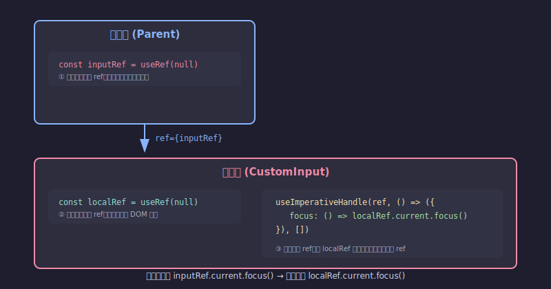
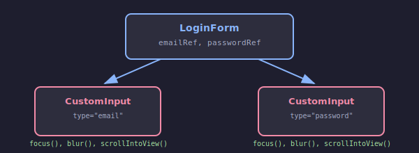
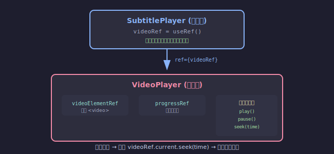

## **前言**

`useImperativeHandle` 大概是 React 中最冷門的其中一個 Hook，我自己在學習 React 的前兩年幾乎沒用過。直到最近在實作一個「字幕跟隨影片進度」的功能時，我需要讓父層元件能夠控制子層播放器元件的影片進度，才使用到這個 Hook。研究之後發現它其實解決了一個很特定但很實用的問題：**如何讓父元件以「命令式」的方式操作子元件**。這篇文章整理了我對 `useImperativeHandle` 的理解，希望能幫助讀者在遇到類似需求時知道該怎麼處理。

<br/>


## **什麼是 Imperative（命令式）？**

在深入 `useImperativeHandle` 之前，先來理解什麼是「命令式」和「宣告式」的差別，這對理解這個 Hook 的定位很重要。

### **宣告式 vs 命令式**

讓我們先用一個生活化的例子來理解這兩種程式設計風格的差異：

**情境：你想要一杯咖啡**

```
// 命令式 (Imperative)：你告訴咖啡師「每一步該怎麼做」
1. 拿一個杯子
2. 磨 20 克咖啡豆
3. 將水加熱到 92 度
4. 把熱水倒入濾杯
5. 等待 3 分鐘
6. 把咖啡倒入杯子

// 宣告式 (Declarative)：你只告訴咖啡師「你要什麼」
「我要一杯美式咖啡」
```

- **命令式**：描述「如何做」（How）—— 一步一步告訴電腦該執行什麼操作
- **宣告式**：描述「要什麼」（What）—— 只說明最終想要的結果，讓系統自己決定怎麼達成

再來看一個程式碼的例子，假設我們要把陣列中的每個數字乘以 2：

```tsx
const numbers = [1, 2, 3, 4, 5];

// 命令式：告訴電腦「每一步該怎麼做」
const doubled1 = [];
for (let i = 0; i < numbers.length; i++) {
  doubled1.push(numbers[i] * 2);
}

// 宣告式：告訴電腦「我要什麼結果」
const doubled2 = numbers.map(n => n * 2);
```

### **React 的宣告式設計哲學**

理解了宣告式與命令式的差異後，我們來看 React 是如何運用宣告式的設計理念。

React 的核心理念是**宣告式 (Declarative)**：你描述「UI 應該長什麼樣子」，React 負責處理「如何更新 DOM」。你不需要手動操作 DOM，只需要改變 state，React 會自動幫你處理 UI 的更新。

```tsx
// ✅ 宣告式：描述「狀態」，React 自動處理 UI
function Modal({ isOpen }) {
  if (!isOpen) return null;
  return <div className="modal">...</div>;
}

// 使用時：透過改變 state 來控制
<Modal isOpen={showModal} />
```

在上面的例子中，我們不需要寫 `document.getElementById('modal').style.display = 'block'` 這種命令式的程式碼，只需要改變 `showModal` 這個 state，React 就會自動幫我們顯示或隱藏 Modal。

### **但有些操作天生就是命令式的**

雖然 React 推崇宣告式，但有些操作天生就是**命令式 (Imperative)** 的，例如：

- `input.focus()` - 聚焦輸入框
- `video.play()` / `video.pause()` - 播放/暫停影片
- `video.currentTime = 30` - 跳轉到影片的第 30 秒
- `element.scrollIntoView()` - 滾動到特定元素

這些操作沒辦法用「狀態」來描述，你必須直接「命令」DOM 做某件事。例如，「跳轉」不是一個可以用 boolean 描述的狀態，而是一個需要主動觸發的動作。

### **useImperativeHandle 的定位**

`useImperativeHandle` 就是 React 用來處理這種情況的一個工具：**當你需要讓父元件以命令式的方式操作子元件時**。

它讓你可以自訂子元件透過 ref 暴露給父元件的「操作介面」，而不是直接把整個 DOM 節點交出去。這樣父元件就可以呼叫子元件提供的方法，同時保持良好的封裝性。

```tsx
// 父元件想要「命令」子元件做某件事
videoPlayerRef.current.play();           // 播放影片
videoPlayerRef.current.pause();          // 暫停影片
videoPlayerRef.current.seek(30);         // 跳轉到第 30 秒
videoPlayerRef.current.getCurrentTime(); // 取得目前播放時間
```

<br/>


## **基本語法**

### **API**

```tsx
function useImperativeHandle<T>(
  ref: React.Ref<T> | undefined,
  createHandle: () => T,
  dependencies?: React.DependencyList
): void;
```

### **參數說明**

| 參數           | 型別             | 必填 | 說明                                                                                                  |
| -------------- | ---------------- | ---- | ----------------------------------------------------------------------------------------------------- |
| `ref`          | `React.Ref<T>`   | ✅    | 從父元件傳入的 ref，通常是透過 props 接收（React 19+）或 `forwardRef` 的第二個參數（React 18 及更早） |
| `createHandle` | `() => T`        | ✅    | 一個函數，回傳一個物件，這個物件定義了要暴露給父元件的方法和屬性                                      |
| `dependencies` | `DependencyList` | ❌    | 依賴陣列，決定何時重新建立 handle。運作方式與 `useEffect` 的依賴陣列相同                              |

### **createHandle 回傳的物件**

`createHandle` 函數應該回傳一個物件，這個物件可以包含：

```tsx
useImperativeHandle(ref, () => ({
  // 方法：讓父元件可以呼叫
  focus: () => { /* ... */ },
  scrollIntoView: () => { /* ... */ },
  
  // 也可以暴露 getter 函數來取得值
  getValue: () => inputRef.current?.value,
  
  // 或是直接暴露屬性（但通常建議用方法）
  isValid: true,
}), []);
```

:::warning[注意事項]
- `createHandle` 回傳的物件會成為父元件 `ref.current` 的值
- 這個物件會**取代**原本 ref 指向的 DOM 節點，所以父元件將無法直接存取 DOM
- 如果 `dependencies` 改變，`createHandle` 會重新執行，產生新的物件
:::

<br/>


## **為什麼需要 useImperativeHandle？**

你可能會想：「如果我需要讓父元件操作子元件，直接把 ref 傳給子元件的 DOM 不就好了嗎？」確實可以這樣做，而且在很多情況下這樣就夠了。但 `useImperativeHandle` 提供了更好的封裝性和安全性。

### **方法一：直接暴露 DOM 節點（可行但有風險）**

最簡單的做法是直接把 DOM 節點暴露給父元件：

```tsx
// 子元件：直接把 ref 傳給 input
function CustomInput({ ref }) {
  return <input ref={ref} />;
}

// 父元件
function Parent() {
  const inputRef = useRef(null);
  
  const handleClick = () => {
    inputRef.current.focus();  // ✅ 可以 focus
    inputRef.current.value = 'hacked';  // ⚠️ 也可以直接改值！
    inputRef.current.style.display = 'none';  // ⚠️ 甚至可以隱藏元素！
  };
  
  return <CustomInput ref={inputRef} />;
}
```

這樣做的問題是：父元件可以對 DOM 節點做**任何事情**，這違反了元件封裝的原則。子元件完全失去了對自己內部 DOM 的控制權。

### **方法二：使用 useImperativeHandle（更好的做法）**

`useImperativeHandle` 讓你可以精確控制要暴露什麼：

```tsx
function CustomInput({ ref }) {
  const inputRef = useRef(null);
  
  useImperativeHandle(ref, () => ({
    // 只暴露 focus 方法，其他什麼都不給
    focus: () => inputRef.current.focus(),
  }), []);
  
  return <input ref={inputRef} />;
}

// 父元件
function Parent() {
  const inputRef = useRef(null);
  
  const handleClick = () => {
    inputRef.current.focus();  // ✅ 可以
    inputRef.current.value = 'hacked';  // ❌ undefined，無法存取
  };
  
  return <CustomInput ref={inputRef} />;
}
```

### **兩種方法的比較**

| 比較項目   | 直接暴露 DOM                      | 使用 useImperativeHandle         |
| ---------- | --------------------------------- | -------------------------------- |
| 實作複雜度 | 簡單                              | 稍微複雜                         |
| 封裝性     | ❌ 差，父元件可以做任何事          | ✅ 好，只暴露必要的方法           |
| API 清晰度 | ❌ 不明確，父元件需要知道 DOM 結構 | ✅ 明確，有清楚的方法定義         |
| 重構彈性   | ❌ 差，改變 DOM 結構可能影響父元件 | ✅ 好，只要保持相同的方法介面即可 |
| 適用場景   | 簡單的單一 DOM 操作               | 複雜元件、元件庫、需要封裝的場景 |

:::tip[封裝原則]
`useImperativeHandle` 的核心價值在於**封裝**：子元件可以決定要暴露哪些「能力」給父元件，而不是把整個 DOM 節點都交出去。這讓元件的 API 更清晰、更安全，也更容易維護和重構。
:::

<br/>


## **React 18 vs React 19 的差異**

在 React 19 之前，要讓子元件接收 ref，必須使用 `forwardRef`：

```tsx
// React 18 及更早版本
import { forwardRef, useImperativeHandle, useRef } from 'react';

const CustomInput = forwardRef((props, ref) => {
  const inputRef = useRef(null);
  
  useImperativeHandle(ref, () => ({
    focus: () => inputRef.current.focus(),
  }), []);
  
  return <input ref={inputRef} {...props} />;
});
```

從 React 19 開始，`ref` 可以直接作為 props 傳入：

```tsx
// React 19+
import { useImperativeHandle, useRef } from 'react';

function CustomInput({ ref, ...props }) {
  const inputRef = useRef(null);
  
  useImperativeHandle(ref, () => ({
    focus: () => inputRef.current.focus(),
  }), []);
  
  return <input ref={inputRef} {...props} />;
}
```

:::note[版本相容性]
如果你的專案還在使用 React 18 或更早版本，記得要用 `forwardRef` 包裝元件。本文後續範例會以 React 19 的語法為主。
:::

<br/>


## **實際應用場景**

### **理解範例中的多個 ref**

在使用 `useImperativeHandle` 的範例中，你會看到多個 `ref`，這很容易讓初學者混淆。讓我們先用一張圖來釐清它們的關係：



**重點整理：**

| ref                  | 定義位置              | 用途                               |
| -------------------- | --------------------- | ---------------------------------- |
| `inputRef`（父元件） | 父元件的 `useRef`     | 存放子元件暴露的方法物件           |
| `ref`（props）       | 從父元件傳入          | `useImperativeHandle` 的第一個參數 |
| `localRef`（子元件） | 子元件內部的 `useRef` | 指向實際的 DOM 節點                |

### **場景一：自訂 Input 元件**

最常見的使用場景是建立可重用的 Input 元件，只暴露必要的方法。

**元件關係圖：**



**完整程式碼：**

```tsx
import { useRef, useImperativeHandle } from 'react';

// 定義暴露給父元件的方法型別
interface CustomInputHandle {
  focus: () => void;
  blur: () => void;
  scrollIntoView: () => void;
}

// 子元件
function CustomInput({ ref, ...props }: { ref: React.Ref<CustomInputHandle> }) {
  // ② 子元件內部的 ref，指向實際的 <input> DOM 節點
  const localRef = useRef<HTMLInputElement>(null);
  
  // ③ 使用 useImperativeHandle 將 localRef 的操作暴露給父元件
  useImperativeHandle(ref, () => ({
    focus: () => localRef.current?.focus(),
    blur: () => localRef.current?.blur(),
    scrollIntoView: () => localRef.current?.scrollIntoView({ behavior: 'smooth' }),
  }), []);
  
  return (
    <div className="input-wrapper">
      {/* localRef 指向這個 input */}
      <input ref={localRef} {...props} />
    </div>
  );
}

// 父元件
function LoginForm() {
  // 1. 父元件建立的 ref，用來存放子元件暴露的方法
  const emailRef = useRef<CustomInputHandle>(null);
  const passwordRef = useRef<CustomInputHandle>(null);
  
  const handleSubmit = (e: React.FormEvent) => {
    e.preventDefault();
    // 驗證失敗時聚焦到對應欄位
    const isValidEmail = true; // 實際驗證邏輯
    if (!isValidEmail) {
      // 父元件透過 ref 呼叫子元件暴露的 focus 方法
      emailRef.current?.focus();
      return;
    }
  };
  
  return (
    <form onSubmit={handleSubmit}>
      {/* 將 emailRef 傳給子元件 */}
      <CustomInput ref={emailRef} type="email" placeholder="Email" />
      <CustomInput ref={passwordRef} type="password" placeholder="密碼" />
      <button type="submit">登入</button>
    </form>
  );
}
```

### **場景二：影片播放器元件**

這是我實際遇到的場景：實作「字幕跟隨影片進度」功能時，父元件需要控制子元件的影片播放進度。

**元件關係圖：**



**完整程式碼：**

```tsx
import { useRef, useImperativeHandle, useState } from 'react';

// 定義暴露給父元件的方法型別
interface VideoPlayerHandle {
  play: () => void;
  pause: () => void;
  seek: (time: number) => void;
  getCurrentTime: () => number;
  getDuration: () => number;
}

// 子元件：影片播放器
function VideoPlayer({ ref, src }: { ref: React.Ref<VideoPlayerHandle>; src: string }) {
  // 2. 子元件內部的 ref，指向實際的 <video> DOM 節點
  const videoElementRef = useRef<HTMLVideoElement>(null);
  // 另一個內部 ref，指向進度條
  const progressRef = useRef<HTMLDivElement>(null);
  
  // 3. 使用 useImperativeHandle 將影片操作暴露給父元件
  useImperativeHandle(ref, () => ({
    play: () => videoElementRef.current?.play(),
    pause: () => videoElementRef.current?.pause(),
    seek: (time: number) => {
      if (videoElementRef.current) {
        videoElementRef.current.currentTime = time;
      }
    },
    getCurrentTime: () => videoElementRef.current?.currentTime ?? 0,
    getDuration: () => videoElementRef.current?.duration ?? 0,
  }), []);
  
  return (
    <div className="video-player">
      {/* videoElementRef 指向這個 video */}
      <video ref={videoElementRef} src={src} />
      <div ref={progressRef} className="progress-bar">...</div>
    </div>
  );
}

// 父元件：字幕播放器
function SubtitlePlayer() {
  // 1. 父元件建立的 ref，用來存放子元件暴露的方法
  const videoRef = useRef<VideoPlayerHandle>(null);
  const [subtitles] = useState([
    { time: 0, text: '歡迎觀看' },
    { time: 5, text: '這是第二段字幕' },
    { time: 10, text: '這是第三段字幕' },
  ]);
  
  // 點擊字幕時，跳轉到對應的影片時間
  const handleSubtitleClick = (time: number) => {
    // 父元件透過 ref 呼叫子元件暴露的 seek 方法
    videoRef.current?.seek(time);
    videoRef.current?.play();
  };
  
  return (
    <div>
      {/* 將 videoRef 傳給子元件 */}
      <VideoPlayer ref={videoRef} src="/video.mp4" />
      
      <div className="subtitles">
        {subtitles.map((subtitle, index) => (
          <button key={index} onClick={() => handleSubtitleClick(subtitle.time)}>
            {subtitle.time}s: {subtitle.text}
          </button>
        ))}
      </div>
    </div>
  );
}
```

<br/>

## **Best Practice: TypeScript 型別定義**

在 TypeScript 中使用 `useImperativeHandle` 時，建議明確定義 handle 的型別：

```tsx
// 定義 handle 的型別
interface CustomInputHandle {
  focus: () => void;
  blur: () => void;
  validate: () => boolean;
}

// 子元件
function CustomInput({ ref }: { ref: React.Ref<CustomInputHandle> }) {
  const inputRef = useRef<HTMLInputElement>(null);
  
  useImperativeHandle(ref, () => ({
    focus: () => inputRef.current?.focus(),
    blur: () => inputRef.current?.blur(),
    validate: () => {
      // 驗證邏輯
      return true;
    },
  }), []);
  
  return <input ref={inputRef} />;
}

// 父元件
function Parent() {
  const inputRef = useRef<CustomInputHandle>(null);
  
  const handleClick = () => {
    inputRef.current?.focus();  // TypeScript 知道這是合法的
    inputRef.current?.validate();  // TypeScript 知道這是合法的
  };
  
  return <CustomInput ref={inputRef} />;
}
```


<br/>


## **依賴陣列的使用**

`useImperativeHandle` 的第三個參數是依賴陣列，運作方式與 `useEffect` 相同：

```tsx
useImperativeHandle(ref, () => ({
  getValue: () => value,  // 使用了 value
  validate: () => validateFn(value),  // 使用了 value 和 validateFn
}), [value, validateFn]);  // 必須包含所有用到的 reactive values
```

:::danger[常見錯誤]
如果你在 `createHandle` 中使用了 state 或 props，但沒有加入依賴陣列，父元件拿到的方法會捕獲到過時的值，導致難以追蹤的 bug。
:::

<br/>


## **使用時機與注意事項**

在使用 `useImperativeHandle` 之前，先問問自己：「這個操作是否本質上就是命令式的？」如果答案是「是」，那就放心使用；如果答案是「不確定」，很可能有更好的宣告式解法。

### **適合使用的情況**

- **操作本質上是命令式的**：`focus()`、`scroll()`、`play()`、`pause()`、`seek()` 這些都是「動作」，不是「狀態」
- **無法用狀態來描述**：例如「聚焦」不是一個可以用 `isFocused={true}` 描述的狀態，而是一個需要主動觸發的動作
- **需要暴露多個 DOM 節點的操作**：子元件內部有多個需要被操作的元素
- **想要封裝 DOM 節點**：只暴露特定方法，不讓父元件直接存取 DOM
- **建立可重用的元件庫**：需要提供清晰、穩定的 API

### **不應該使用的情況**

官方文件特別強調：**不要過度使用 ref**。如果某個行為可以用 props 表達，就不應該用 ref。

```tsx
// ❌ 不好的做法：用 ref 控制 Modal 開關
function Modal({ ref }) {
  const [isOpen, setIsOpen] = useState(false);
  
  useImperativeHandle(ref, () => ({
    open: () => setIsOpen(true),
    close: () => setIsOpen(false),
  }), []);
  
  if (!isOpen) return null;
  return <div className="modal">...</div>;
}

// 父元件
modalRef.current.open();
modalRef.current.close();
```

```tsx
// ✅ 好的做法：用 props 控制
function Modal({ isOpen, onClose }) {
  if (!isOpen) return null;
  return <div className="modal">...</div>;
}

// 父元件
<Modal isOpen={showModal} onClose={() => setShowModal(false)} />
```

上面的例子中，Modal 的開關是一個可以用 boolean 狀態描述的行為，所以應該用 props 來控制，而不是用 ref。

:::tip[判斷原則]
**不應該使用 `useImperativeHandle` 的情況：**

- **可以用 props 控制的行為** → 用 props（如：開關、顯示/隱藏、選中狀態）
- **可以用 callback props 處理的事件** → 用 callback（如：`onSubmit`、`onChange`）
- **只是為了「看起來方便」** → 重新思考元件設計

簡單來說：如果你可以用一個 boolean 或其他狀態來描述這個行為，那就應該用 props，而不是 ref。
:::

<br/>


<br/>


## **Reference**

- **[React 官方文件 - useImperativeHandle](https://react.dev/reference/react/useImperativeHandle)**
- **[useImperativeHandle Hook Ultimate Guide](https://blog.webdevsimplified.com/2022-06/use-imperative-handle/)**
- **[React 官方文件 - forwardRef](https://react.dev/reference/react/forwardRef)**
