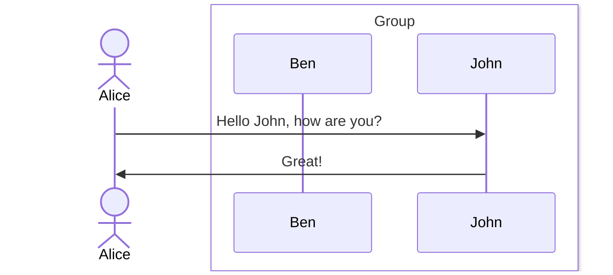
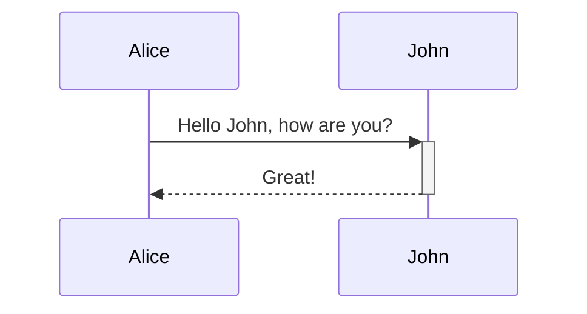
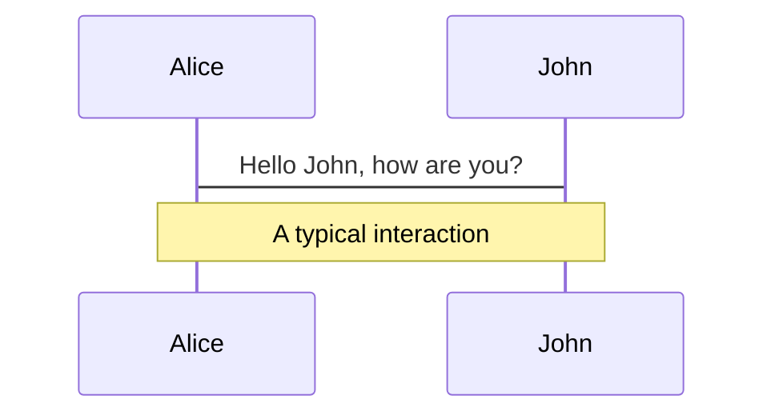
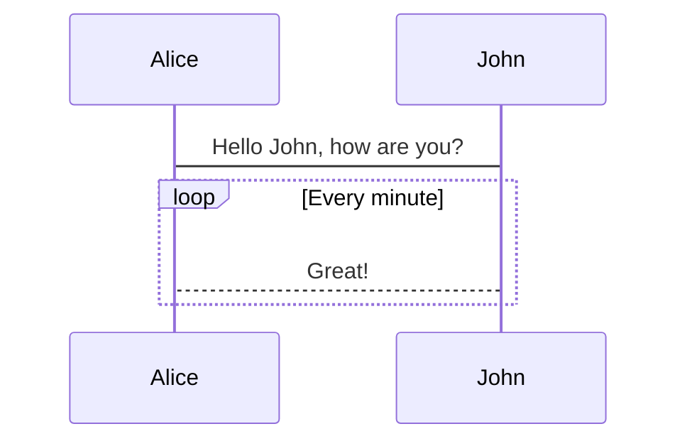
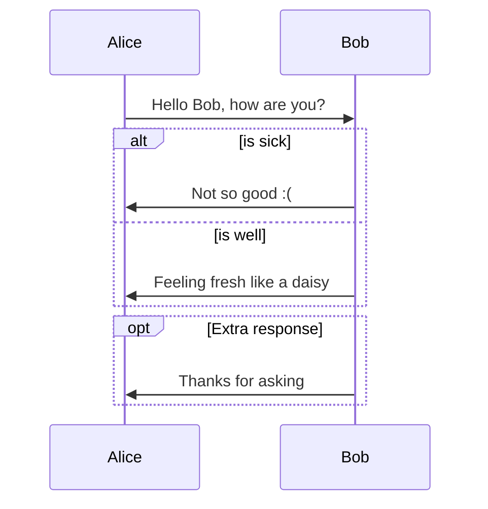
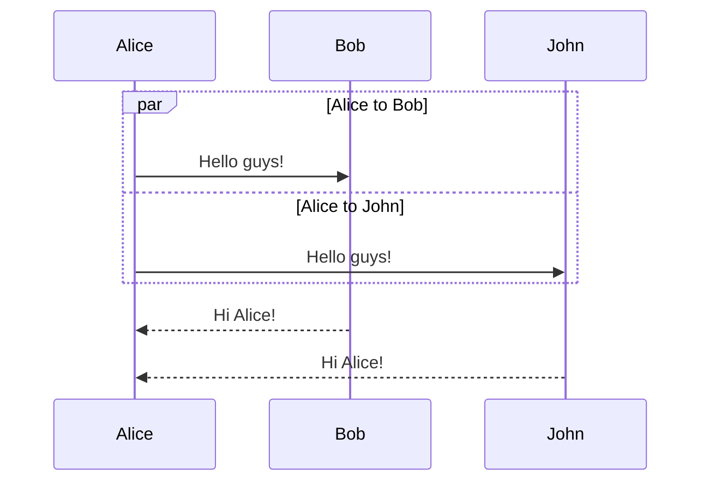
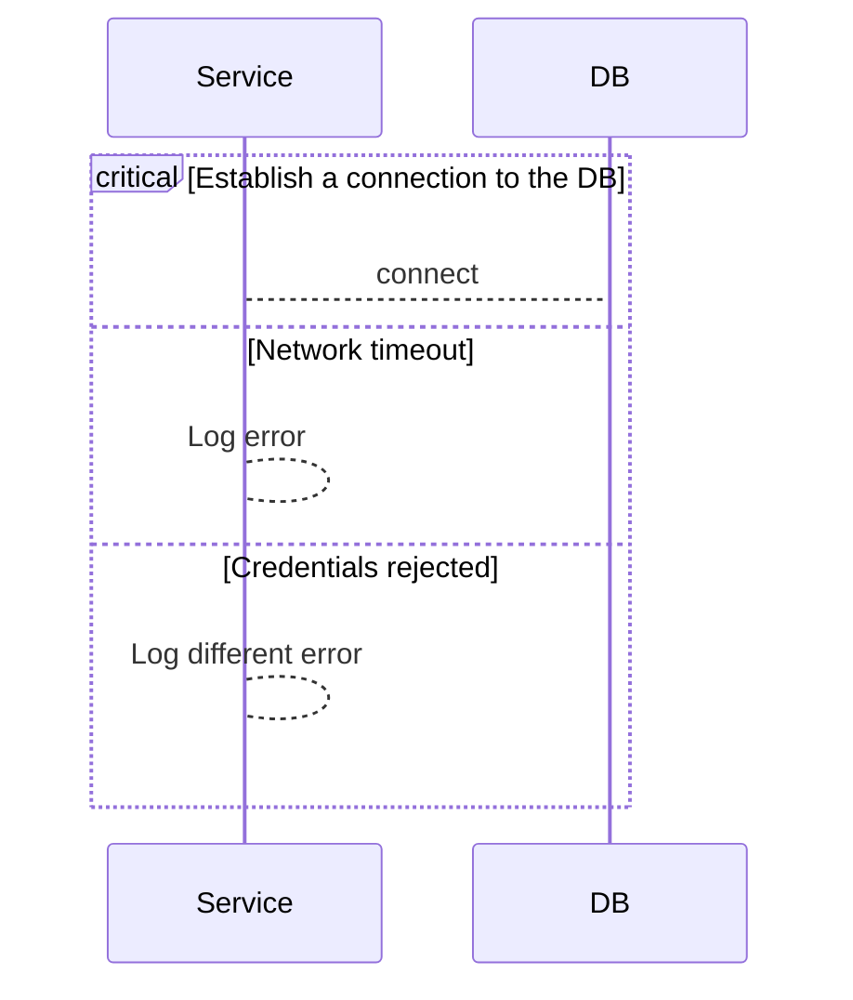
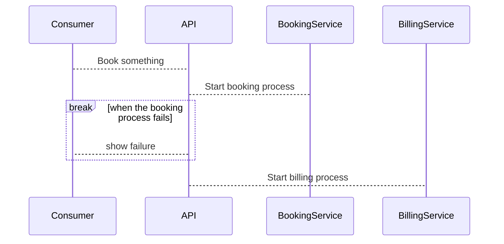
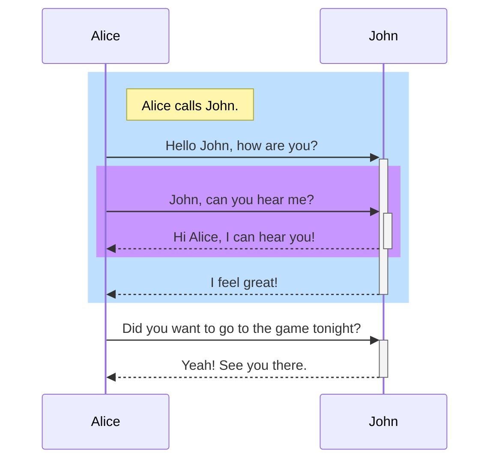

> 本篇筆記的範例來自 **@[Memaid-Sequence diagrams](https://mermaid.js.org/syntax/sequenceDiagram.html#activations)**
> 

**時序圖(Sequence Diagram)**通常用於描述實體間的交互過程和消息傳遞順序。它適合用來描繪系統內部組件、物件或角色之間的溝通流程，特別是在設計軟體架構、分析業務流程或理解系統操作。當需要清晰展示系統各部分如何通過消息進行交互，或當需要理解或說明系統的行為邏輯時，繪製時序圖就非常有用。

## **Syntax**

- **Participants:**  在時序圖中交互的實體，在圖上顯示為方形文字框
- **Actors:** 系統外部的實體，與系統進行交互的用戶或其他系統，在圖上顯示為一個小人
- **Aliases: participants** 或 actors 的替代名稱，用於簡化和參照。
- **Grouping / Box:** 用於將 participants 或 actors 分群的垂直方框

```
sequenceDiagram
    actor A as Alice
    box White Group 
    participant B as Ben
    participant J as John
    end
    A->>J: Hello John, how are you?
    J->>A: Great!
```



## **Message**

| Type | Description                |
| ---- | -------------------------- |
| ->   | 無箭頭實線                 |
| -->  | 無箭頭虛線                 |
| ->>  | 有箭頭實線                 |
| -->> | 有箭頭虛線                 |
| -x   | 實線末端有 x               |
| --x  | 虛線末端有 x               |
| -)   | 實線末端有開放式箭頭(異步) |
| --)  | 虛線末端有開放式箭頭(異步) |

## **Activations**

**syntax**

- activate/deactivate
- 在 message arrow 後加上 `+`/`-`

```
sequenceDiagram
    Alice->>+John: Hello John, how are you?
    John-->>-Alice: Great!
```



## **Notes**

**syntax**

- `Note` [ right of | left of | over ] [Actor]: 文字

```
sequenceDiagram
    Alice->John: Hello John, how are you?
    Note over Alice,John: A typical interaction
```



## **Loops**

- 用來表示迴圈

**syntax**

```
sequenceDiagram
    Alice->John: Hello John, how are you?
    loop Every minute
        John-->Alice: Great!
    end
```



## **Alt**

- 用來表示條件流程或決策點，相當於程式設計中的 "if-else" 結構。

**syntax**

```
alt Describing text
... statements ...
else
... statements ...
end
```

```
sequenceDiagram
    Alice->>Bob: Hello Bob, how are you?
    alt is sick
        Bob->>Alice: Not so good :(
    else is well
        Bob->>Alice: Feeling fresh like a daisy
    end
    opt Extra response
        Bob->>Alice: Thanks for asking
    end

```



## **Parallel**

- 用來表示並行發生的動作

**syntax**

```
par [Action 1]
... statements ...
and [Action 2]
... statements ...
and [Action N]
... statements ...
end
```

```
sequenceDiagram
    par Alice to Bob
        Alice->>Bob: Hello guys!
    and Alice to John
        Alice->>John: Hello guys!
    end
    Bob-->>Alice: Hi Alice!
    John-->>Alice: Hi Alice!
```



## **Critical Region**

- 通常用於表示需要特別注意的操作，如同步控制、事務處理或任何重要的業務邏輯區塊。

**syntax**

```
critical [Action that must be performed]
... statements ...
option [Circumstance A]
... statements ...
option [Circumstance B]
... statements ...
end
```

```
sequenceDiagram
    critical Establish a connection to the DB
        Service-->DB: connect
    option Network timeout
        Service-->Service: Log error
    option Credentials rejected
        Service-->Service: Log different error
    end
```



## **Break**

- 用於表示流程種終止

**syntax**

```
break [something happened]
... statements ...
end
```

```
sequenceDiagram
    Consumer-->API: Book something
    API-->BookingService: Start booking process
    break when the booking process fails
        API-->Consumer: show failure
    end
    API-->BillingService: Start billing process
```



## **Background Highlighting[](https://mermaid.js.org/syntax/sequenceDiagram.html#background-highlighting)**

- Sequence Diagram 可讓使用者添加帶顏色的背景方框

**syntax**

```
rect rgb(0, 255, 0)
... content ...
end
```

```
sequenceDiagram
    participant Alice
    participant John

    rect rgb(191, 223, 255)
    note right of Alice: Alice calls John.
    Alice->>+John: Hello John, how are you?
    rect rgb(200, 150, 255)
    Alice->>+John: John, can you hear me?
    John-->>-Alice: Hi Alice, I can hear you!
    end
    John-->>-Alice: I feel great!
    end
    Alice ->>+ John: Did you want to go to the game tonight?
    John -->>- Alice: Yeah! See you there.
```



## **Reference**

- **[Mermaid](https://mermaid.js.org/)**
- **[Sequence diagrams](https://mermaid.js.org/syntax/sequenceDiagram.html#sequence-diagrams)**