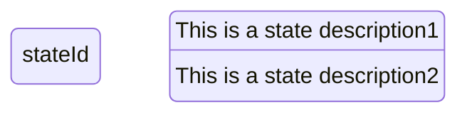
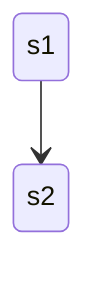
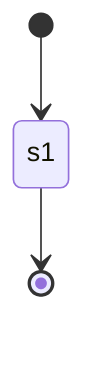
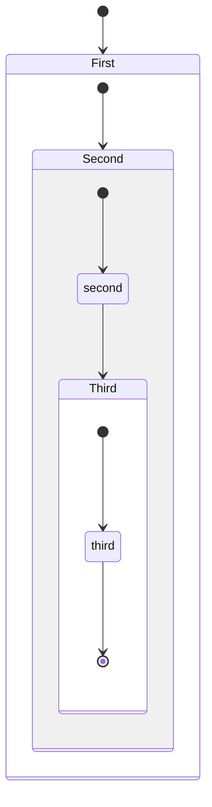
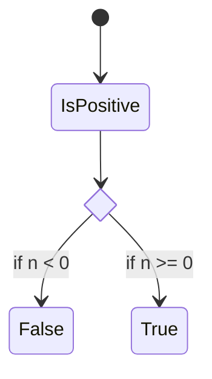
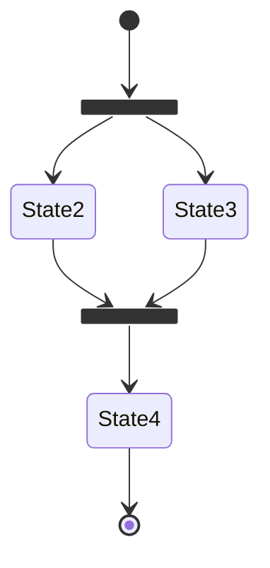
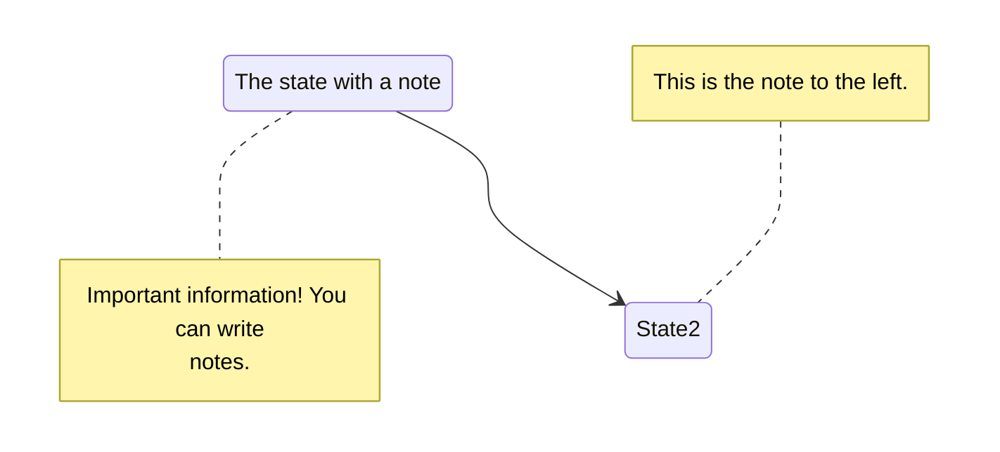
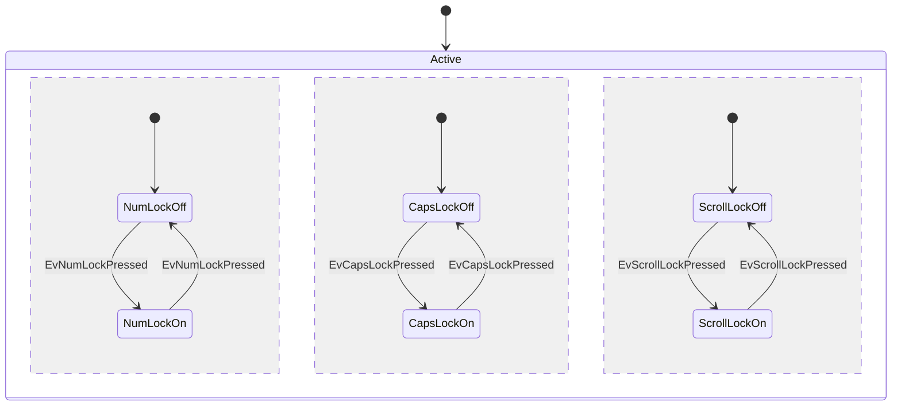

> 本篇筆記的範例來自 [**@Memaid-State diagrams**](https://mermaid.js.org/syntax/stateDiagram.html)
> 

狀態圖(State Diagrams)常用於描述系統、物件或組件的狀態變化及其在不同狀態間的轉換過程。這種圖表適合用來表示系統或對象在其生命週期內的行為，特別是在分析和設計軟體系統時，用來揭示物件如何根據不同事件或條件改變其狀態。在需要明確展示對象狀態的變遷規則、事件響應和條件邏輯時，狀態圖特別有用。

## **States**

狀態(state) 指的是系統、對象或組件在特定時間點的條件或情形。它描述了該實體在任何時刻所處的狀況，如「開啟」、「關閉」、「暫停」等。

**syntax**

```
stateDiagram-v2
    stateId
    state "This is a state description1" as s2
    s2 : This is a state description2
```



## **Transitions**

轉換(transitions) 指的是一種狀態進入另一種狀態時的路徑。

```
stateDiagram-v2
    s1 --> s2
```



## **Start and End**

**syntax**

- `[*]` 用於定義開始或停止的狀態

```
stateDiagram-v2
    [*] --> s1
    s1 --> [*]
```



## **Composite states**

在現實世界的場景中常常會遇到一個狀態內部包含多個子狀態的狀況

**syntax**

```
stateDiagram-v2
    [*] --> First

    state First {
        [*] --> Second

        state Second {
            [*] --> second
            second --> Third

            state Third {
                [*] --> third
                third --> [*]
            }
        }
    }
```



## **Choice**

有時狀態會根據不同的情境條件來決定要轉換哪一種狀態， `<<choice>>` 相當於狀態轉換的 if-else 

```
stateDiagram-v2
    state if_state <<choice>>
    [*] --> IsPositive
    IsPositive --> if_state
    if_state --> False: if n < 0
    if_state --> True : if n >= 0
```



## **Forks**

**syntax**

- `<<fork>>`
- `<<join>>`

```
   stateDiagram-v2
    state fork_state <<fork>>
      [*] --> fork_state
      fork_state --> State2
      fork_state --> State3

      state join_state <<join>>
      State2 --> join_state
      State3 --> join_state
      join_state --> State4
      State4 --> [*]
```



## **Notes**

**syntax**

- `note` [ right of | left of  ] [State id]: 文字

```
    stateDiagram-v2
        State1: The state with a note
        note right of State1
            Important information! You can write
            notes.
        end note
        State1 --> State2
        note left of State2 : This is the note to the left.
```



## **Concurrency**

系統或流程中存在並行執行的情況時，可以，可以使用 `—-` 表示並行

```
stateDiagram-v2
    [*] --> Active

    state Active {
        [*] --> NumLockOff
        NumLockOff --> NumLockOn : EvNumLockPressed
        NumLockOn --> NumLockOff : EvNumLockPressed
        --
        [*] --> CapsLockOff
        CapsLockOff --> CapsLockOn : EvCapsLockPressed
        CapsLockOn --> CapsLockOff : EvCapsLockPressed
        --
        [*] --> ScrollLockOff
        ScrollLockOff --> ScrollLockOn : EvScrollLockPressed
        ScrollLockOn --> ScrollLockOff : EvScrollLockPressed
    }
```



## **Reference**

- **[Mermaid](https://mermaid.js.org/)**
- **[State diagrams](https://mermaid.js.org/syntax/stateDiagram.html)**