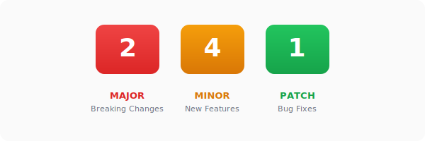
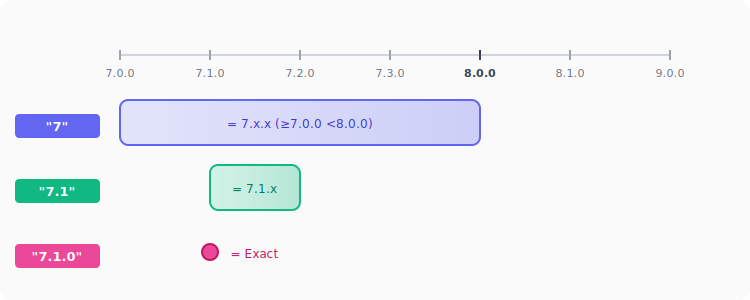

## **Semantic Versioning (SemVer) 基礎**

在開始談版本符號之前，要先了解 **Semantic Versioning**（語意化版本），簡稱 **SemVer**。這是 npm 生態系採用的版本編號規範，幾乎所有套件都遵循這個標準。

### **版本號結構**

SemVer 的版本號格式是 `MAJOR.MINOR.PATCH`，例如 `2.4.1`：



| 位置   | 名稱      | 說明       | 遞增時機                                          |
| :----- | :-------- | :--------- | :------------------------------------------------ |
| 第一位 | **MAJOR** | 主版本號   | 有**破壞性變更** (Breaking Changes)，無法相容舊版 |
| 第二位 | **MINOR** | 次版本號   | 新增功能，但**不影響現有功能**                    |
| 第三位 | **PATCH** | 修訂版本號 | Bug 修復，**不影響現有功能**                      |

### **版本號的意義**

理解版本號的意義後，就能判斷升級某個版本的風險：

- **PATCH 升級** (`2.4.1` → `2.4.2`)：通常是最安全的，只有 Bug 修復
- **MINOR 升級** (`2.4.1` → `2.5.0`)：可能有新功能，但既有的 API 應該不會壞掉
- **MAJOR 升級** (`2.4.1` → `3.0.0`)：**要小心！** 可能有 Breaking Changes，需要調整程式碼

<br/>

## **版本範圍語法**

了解了 SemVer 之後，來看看 `package.json` 中各種版本符號代表什麼意思。以下是常見的版本範圍語法：

| 類型           | 範例             | 允許的版本範圍        | 說明                     |
| :------------- | :--------------- | :-------------------- | :----------------------- |
| 完全鎖定       | `1.2.3`          | 只允許 `1.2.3`        | 不帶任何符號             |
| X-Range        | `1.2.x`          | `>=1.2.0` 且 `<1.3.0` | 萬用字元                 |
| Caret          | `^1.2.3`         | `>=1.2.3` 且 `<2.0.0` | 允許 Minor 和 Patch 更新 |
| Tilde          | `~1.2.3`         | `>=1.2.3` 且 `<1.3.0` | 只允許 Patch 更新        |
| 比較運算子組合 | `>=1.0.0 <2.0.0` | 明確指定範圍          | 進階用法                 |

### **完全鎖定（無符號）**

最簡單也最嚴格的寫法，就是直接寫完整版本號，不加任何符號：

```json title="package.json"
{
  "dependencies": {
    "lodash": "4.17.21"
  }
}
```

這種寫法表示：**只接受 `4.17.21` 這個版本，不多不少**。

:::warning 注意
完全鎖定雖然最安全，但也代表**無法自動獲得 Bug 修復和安全性更新**。如果大量套件都用完全鎖定，維護成本會很高。
:::

### **X-Range（萬用字元）**

這是初學者最容易搞混的地方。在 `package.json` 中，**如果省略了後面的版本數字，npm 會把它當作 `x`（萬用字元）處理**。

| 寫法          | 等同於              | 允許的版本範圍        |
| :------------ | :------------------ | :-------------------- |
| `"7"`         | `7.x.x`             | `>=7.0.0` 且 `<8.0.0` |
| `"7.1"`       | `7.1.x`             | `>=7.1.0` 且 `<7.2.0` |
| `"7.1.0"`     | `7.1.0`（完全鎖定） | 只允許 `7.1.0`        |
| `"*"` 或 `""` | 任意版本            | 沒有限制              |

舉例來說：

```json title="package.json"
{
  "dependencies": {
    // highlight-start
    "foo": "7", // 等於 7.x.x，允許 7.0.0 ~ 7.999.999
    "bar": "7.1", // 等於 7.1.x，允許 7.1.0 ~ 7.1.999
    "baz": "7.1.0" // 完全鎖定，只能是 7.1.0
    // highlight-end
  }
}
```



:::danger 常見誤解
很多人以為 `"7.1"` 就是指定 `7.1.0`，但其實它代表的是 `7.1.x` 這個範圍！

如果要完全鎖定版本，**必須寫出完整的三個數字** `"7.1.0"`。
:::

### **Caret (^)**

**Caret (`^`) 是 npm 預設使用的符號**。當執行 `npm install package-name` 時，寫入 `package.json` 的版本預設就會帶有 `^`。

Caret 的規則是：**允許不改變最左邊非零數字的更新**。對於 `1.0.0` 以上的版本（大部分情況），這代表允許 Minor 和 Patch 更新：

```json title="package.json"
{
  "dependencies": {
    // highlight-next-line
    "react": "^18.2.0" // 允許 >=18.2.0 且 <19.0.0
  }
}
```

也就是說：

- ✅ `18.2.1`、`18.3.0`、`18.99.99` 都可以
- ❌ `19.0.0` 不行（跨 Major 版本）

:::info 0.x.x 版本的特殊行為
當 Major 版本是 0 的時候，Caret 的行為會比較保守：

| 寫法     | 允許的範圍            | 說明              |
| :------- | :-------------------- | :---------------- |
| `^0.2.3` | `>=0.2.3` 且 `<0.3.0` | 只允許 Patch 更新 |
| `^0.0.3` | 只有 `0.0.3`          | 完全鎖定          |

這是因為 `0.x.x` 版本通常代表「開發中、API 不穩定」，所以 Caret 會自動變得更謹慎。
:::

### **Tilde (~)**

**Tilde (`~`) 比 Caret 更保守**，它只允許 Patch 版本的更新：

```json title="package.json"
{
  "dependencies": {
    // highlight-next-line
    "express": "~4.18.2" // 允許 >=4.18.2 且 <4.19.0
  }
}
```

| 寫法     | 允許的範圍            | 說明              |
| :------- | :-------------------- | :---------------- |
| `~1.2.3` | `>=1.2.3` 且 `<1.3.0` | 只允許 Patch 更新 |
| `~1.2`   | `>=1.2.0` 且 `<1.3.0` | 同 `1.2.x`        |
| `~1`     | `>=1.0.0` 且 `<2.0.0` | 同 `1.x.x`        |

### **Caret vs Tilde 比較**

這兩個符號很容易搞混，用圖來比較一下：


**選擇建議：**

| 情境                 | 建議符號           | 理由                                 |
| :------------------- | :----------------- | :----------------------------------- |
| 一般專案、大多數套件 | `^` (Caret)        | 平衡彈性與穩定性，能獲得新功能和修復 |
| 核心依賴、曾經踩過雷 | `~` (Tilde)        | 更保守，只接受 Bug 修復              |
| 非常關鍵的套件       | 無符號（完全鎖定） | 最大程度避免意外                     |

### **比較運算子與範圍組合**

除了 `^` 和 `~`，npm 還支援更靈活的版本範圍語法，不過實務上比較少用到：

```json title="package.json"
{
  "dependencies": {
    "foo": ">=1.0.0", // 1.0.0 以上的任何版本
    "bar": ">1.0.0 <2.0.0", // 大於 1.0.0 且小於 2.0.0
    "baz": "1.0.0 - 2.0.0", // 等同於 >=1.0.0 <=2.0.0（Hyphen Range）
    "qux": "<1.0.0 || >=2.0.0" // 小於 1.0.0 或大於等於 2.0.0（OR 條件）
  }
}
```

OR 條件這種語法常見於某個版本區間有已知問題，需要跳過的情況。

<br/>

## **Lock 檔與升級指令**

在了解版本符號之後，還需要知道 **lock 檔**（如 `package-lock.json`、`yarn.lock`、`pnpm-lock.yaml`）的作用，以及升級指令對它的影響。

:::tip Lock 檔的作用
`package.json` 中的版本符號定義的是「可接受的版本範圍」，而 **lock 檔記錄的是「實際安裝的確切版本」**。

舉例來說，`package.json` 寫 `"react": "^18.2.0"`，但 lock 檔可能記錄 `react@18.3.1`。當團隊成員或 CI/CD 執行 `npm install` 時，會依照 lock 檔安裝 `18.3.1`，而不是重新解析版本範圍。這確保了所有環境安裝的版本一致。

**記得把 lock 檔加入版本控制！** 這是確保團隊開發環境一致的關鍵。
:::

### **升級指令行為**

以下以 npm 為例說明升級指令的行為（yarn、pnpm 的行為類似）：

| 指令                       | `package.json` | lock 檔 | 說明                          |
| :------------------------- | :------------- | :------ | :---------------------------- |
| `npm update`               | ❌ 不變        | ✅ 更新 | 在現有範圍內升級到最新版      |
| `npm install <pkg>@latest` | ✅ 更新        | ✅ 更新 | 安裝最新版並更新 package.json |

**舉例來說：**

假設 `package.json` 寫的是 `"react": "^18.2.0"`，目前 lock 檔鎖定在 `18.2.0`，而 React 最新版是 `19.1.0`。

- 執行 `npm update react`：lock 檔更新為 `18.3.1`（範圍內最新版），`package.json` 維持 `^18.2.0`
- 執行 `npm install react@latest`：lock 檔更新為 `19.1.0`，`package.json` 更新為 `^19.1.0`

:::caution 跨 Major 版本升級
使用 `@latest` 進行升級時，如果跨越了 Major 版本，可能會有 Breaking Changes。記得先查看套件的 CHANGELOG 或 Migration Guide。
:::

<br/>

## **Reference**

- **[npm Docs - About semantic versioning](https://docs.npmjs.com/about-semantic-versioning)**
- **[npm Docs - package.json dependencies](https://docs.npmjs.com/cli/v10/configuring-npm/package-json#dependencies)**
- **[node-semver (npm 使用的 semver 實作)](https://github.com/npm/node-semver)**
- **[Semantic Versioning 2.0.0](https://semver.org/)**
