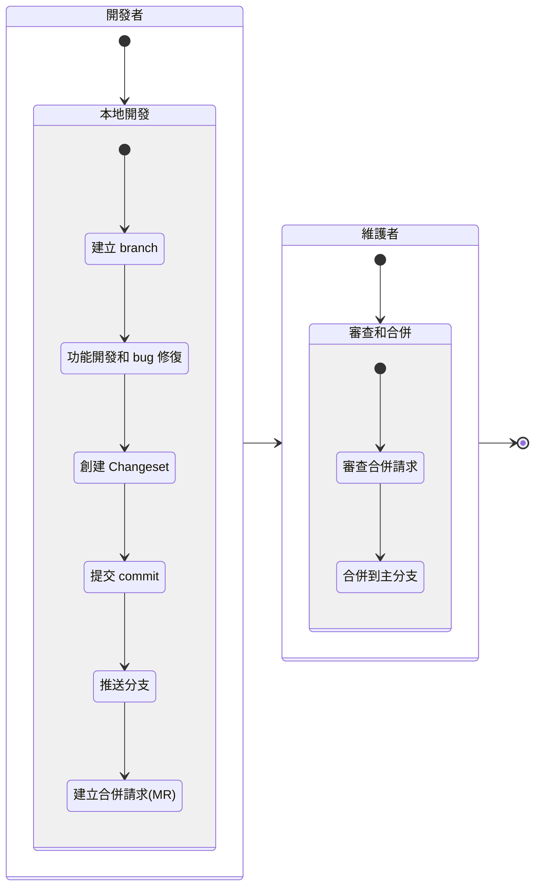
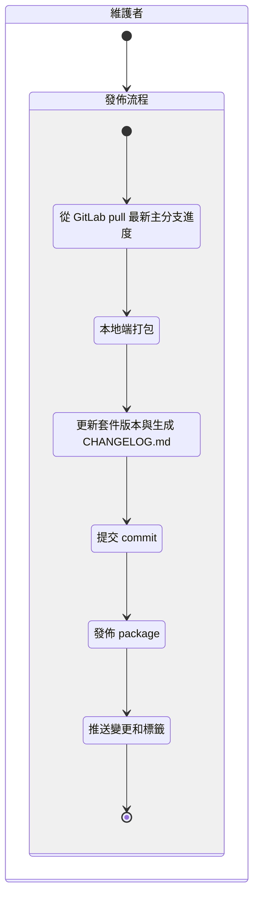

`monorepo` 是一種能夠將多個專案項目整合在一個倉庫中集中管理的一種架構，在現代軟題開發中十分盛行，許多知名的 npm 套件像是: [**material-ui**](https://github.com/mui/material-ui),  [**Chakra UI**](https://chakra-ui.com/), [**pnpm**](https://pnpm.js.org/) 等，都採用了 monorepo 架構在單一倉庫中管理多個套件。然而，使用 monorepo 同時管理多個套件同時也面臨了一個挑戰：**該如何為這些套件進行獨立版本控制 ?** 若手動進行，這將是極其繁瑣的工作。而這正是 `Changesets` 發揮作用的地方。

`Changesets` Changesets 是一個專為 monorepo 設計的版本管理工具，能夠控制管理單一倉庫中所有套件的獨立版本。它不僅簡化了多套件的版本管理工作，還提供了強大的自動化功能，幫助開發者最佳化 monorepo 的工作流程。

本文將帶你瞭解 Changesets，探索它如何幫助我們在 monorepo 環境中更高效地進行版本控制和發佈。無論你是初次接觸 monorepo，還是希望最佳化現有工作流程的開發者，希望這篇文章都為你提供有價值的見解。


## **認識 Changesets**

### **Changesets 的功能**

Changesets 的用途是簡化在單一倉庫中管理多個套件版本的過程，他的主要功能如下：

- **生成 changeset (.md 文件)**：
Changesets 提供了一套簡易的介面，能夠將開發者每次開發的程式碼變更紀錄整理成獨立且有固定排版規則的 .md 文件，我們將這些文件稱之為 changeset。
- **簡化更版流程**：
Changesets 可以自動處理版本號的遞增，並且能夠在更新套件版本時，將專案內所有的 changeset .md 文件統整成變更記錄（CHANGELOG.md），幫助團隊成員和用戶了解每次更版的改動內容。
- **管理多 package 的版本變更**：
在 monorepo 中，手動管理每個 package 的版本變更記錄是很繁瑣的工作，Changesets 可以辨識每個套件是否有變更，也可以自動彙整不同套件的變更記錄。
- **自動發布**：
整合 CI/CD 流程，自動發布新的版本，減少手動操作和錯誤。(目前僅支援 Github Action)

### **版本更新類型**

Changesets 使用`語義版本（Semantic Versioning，semver）`控制來管理和描述每次變更，確保軟體版本的一致性和可預測性。

`Semantic Versioning` 是一種版本編號規則，通常由三個數字組成：`主版本號.次版本號.修補版本號`，例如 `1.2.3`。這三個數字分別表示：

1. **主版本號（Major）**：當你做了不兼容的 API 修改時。
2. **次版本號（Minor）**：當你做了向下兼容的功能性新增時。
3. **修補版本號（Patch）**：當你做了向下兼容的錯誤修正時。

當我們每次對某個套件進行變更時，可以創建 Changeset 文件來記錄這些變更。以下是一個範例：

```bash
npx changeset
```

命令行界面會提示你選擇變更類型：

- **修補（Patch）**：小幅修正錯誤或小變更，不會影響現有功能。例如，修復了一個 bug。
- **次要更新（Minor）**：新增功能，但不會破壞現有功能。例如，添加了一個新的 API。
- **重大更新（Major）**：進行了不兼容的變更，可能會破壞現有功能。例如，重構了整個系統架構。


### **Changeset Markdown 文件**

每當開發者完成對倉庫中的套件的變更時，開發者可以使用 Changesets 的 CLI 工具記錄此次變更的詳細信息，Changesets 會將這些變更訊息轉為一個 Markdown 文件。這些文件的命名通常是隨機生成的，內部包含了變更的描述、影響的套件列表以及版本更新的類型（如修補、次要更新或重大更新）。

example:

```markdown
---
"my-package": patch
"my-package": patch
---

This change fixes a bug in my-package.
```

### **CHANGELOG.md 文件**

使用 Changeset 更新套件版本號時，Changesets 會自動生成和更新 `CHANGELOG.md` 文件。這個文件記錄了每個套件的所有變更歷史，方便開發者和使用者查閱。

example:

```markdown
# my-package

## 1.0.1

### Patch Changes

- Fix: 修復了一個小錯誤
```

### **Changesets 的基本工作流程**

1. **安裝 Changesets**：
首先需要在項目中安裝 Changesets。可以使用以下命令：
    
    ```bash
    yarn add @changesets/cli -D
    ```
    
2. **初始化 Changesets**：
安裝完成後，進行初始化設置：
    
    ```bash
    yarn changeset init
    ```
    
    這會在項目中建立一個 `.changeset` 目錄，用於存放變更記錄。
    
3. **創建變更記錄**：
當進行程式碼修改後，需要建立一個變更記錄文件：
    
    ```bash
    yarn changeset
    ```
    
    根據提示選擇需要變更的 package 和版本類型（例如：patch, minor, major），然後編寫變更說明。
    
4. **合併變更**：
當準備好發佈新版本時，可以合併所有的變更記錄：
    
    ```bash
    yarn changeset version
    ```
    
    這個命令會根據變更記錄，自動更新 package 的版本號，並生成 CHANGELOG.md。
    
5. **發佈新版本**：
最後，使用以下命令發佈新版本：
    
    ```bash
    yarn changeset publish
    ```
    
    這會將更新後的 package 發佈到 npm registry 上。
    

### **Chagesets 的規則與決策設計**

1. **Changesets 的合併方式**
    
    為了簡化變更累積的過程，Changesets 會將所有的版本提升合併為最高的**語義版本（semver）**。例如，若某個套件有兩個次要變更(minor)和一個修補變更(patch)，最終這個包的版本會提升到次要版本(minor)，確保每個變更都被正確記錄並在變更日誌中標示。
    
2. **依賴項的版本提升**
    
    在 monorepo 中，當一個包發生重大變更時，相關的依賴項也需要相應更新，以保持開發環境和生產環境的一致性。以下是一個具體的範例來說明這一過程：
    
    假設我們有兩個套件：
    
    - **packageA**：版本為 1.1.1
    - **packageB**：版本為 1.1.0，並依賴於 **packageA**，依賴範圍為 `^1.1.0`
    
    如果我們對 **packageA** 進行重大變更，例如添加了一個新的功能，使其版本提升到 2.0.0，這將超出 **packageB** 的依賴範圍。為了避免 **packageB** 在開發環境中無法正確使用 **packageA**，我們需要更新 **packageB** 的版本。
    
    這時，Changesets 會自動檢查並提升 **packageB** 的版本，通常以修補版本(patch)的方式進行。結果如下：
    
    - **packageA** 的版本從 1.1.1 提升到 2.0.0
    - **packageB** 的版本從 1.1.0 提升到 1.1.1，同時更新其依賴範圍到 `^2.0.0`
    
    這樣可以確保 **packageB** 在開發和生產環境中都能正確使用 **packageA** 的新版本。
    
    例如，CHANGELOG.md 可能如下所示：
    
    ```markdown
    # packageA
    
    ## 2.0.0
    - Major: 添加了一個新的功能
    
    # packageB
    
    ## 1.1.1
    - Patch: 更新了對 packageA 的依賴範圍到 `^2.0.0`
    ```
    
    這種自動化的版本提升方式確保了在 monorepo 中的所有套件能夠一致地更新，減少了手動處理依賴版本的繁瑣工作，提高了整體開發流程的效率和可靠性。
    

### **與 Semantic Release 的區別**

[semantic release](https://github.com/semantic-release/semantic-release) 是一個常見的自動化版本控制工具，它通過解析提交信息來自動決定版本號並發佈新版本。然而，Changesets 與 Semantic Release 存在一些顯著的區別，特別是針對 monorepo 的管理需求。以下是一些關鍵差異：

1. **專為 monorepos 設計**
    
    **Changesets** 是專門為 monorepo 設計的，它能夠更好地管理倉庫內的多個包及其相互之間的依賴關係。相比之下，**Semantic Release** 更加專注於單個套件的版本控制，而在處理 monorepo 方面則沒有這麼強的支持。
    
2. **變更信息的存儲方式**
    
    **Changesets** 將變更信息寫入磁碟（即生成 changeset Markdown 文檔），這使得開發者可以可以根據需要修改變更描述。而 **Semantic Release** 將變更信息存儲在 Git 中，這使得變更描述在提交後難以修改。
    
3. **依賴管理**
    
    Changesets 在管理 monorepo 內部依賴時更加智能。例如，當一個包發生重大變更時，Changesets 會自動更新相關依賴包的版本，確保其在開發和生產環境中的一致性。**Semantic Release** 對於依賴的管理則相對較弱，通常需要額外的配置或手動處理。
    
4. **變更類型**
    
    **Changesets** 僅使用三種類型的變更（`major`、`minor`、`patch`），這樣的設計決策使得變更類型更加簡單明了，而詳細的變更信息可以寫在 `.changeset` 文件中。**Semantic Release** 則允許更細化的變更類型（如 bugfix、feature），並根據這些類型自動轉換為語義版本號。
    
5. **與 Git 的互動**
    
    **Changesets** 的核心流程（如添加 changeset、版本控制包、編寫變更日誌、發佈包）可以在沒有 Git 的情況下運作。當用戶選擇連動 Git 時（如提交變更或檢查狀態），Changesets 會處理相關錯誤並提供反饋，確保用戶能夠及時發現並解決問題。**Semantic Release** 則高度依賴於 Git，所有版本控制和發布流程都基於 Git 提交。


<br/>


## **Changesets 使用重點**

### **Changesets 常用指令**

1. **初始化 Changesets**：
    
    ```bash
    yarn changeset init
    ```
    
    這個指令會在項目中創建一個 `.changeset` 目錄，用於存放變更記錄文件。初始化後，就可以開始創建和管理變更記錄了。
    
2. **創建變更記錄**：
    
    ```bash
    yarn changeset
    ```
    
    這個指令會啟動互動式提示，讓你選擇需要變更的 package 和變更類型（patch, minor, major），並撰寫變更說明。創建的變更記錄會以 Markdown 文件的形式保存在 `.changeset` 目錄下。
    
3. **合併變更**：
    
    ```bash
    yarn changeset version
    ```
    
    當準備發布新版本時，可以使用這個指令來合併所有的變更記錄。它會根據變更記錄文件，自動更新每個 package 的版本號，並生成 `CHANGELOG.md`。
    
4. **發布新版本**：
    
    ```bash
    yarn changeset publish
    ```
    
    這個指令會將更新後的 package 發布到 npm 上。它會自動處理所有的發佈步驟，確保每個 package 都能正確發布。
    
5. **檢查變更狀態**：
    
    ```bash
    yarn changeset status
    ```
    
    這個指令會顯示當前變更的狀態，包括哪些 package 有變更、版本號的變動以及生成的變更日誌。這有助於在發布前檢查是否所有的變更都已正確記錄。
    
6. **啟用預發佈模式**：
    
    ```bash
    yarn changeset pre enter next
    ```
    
    這個指令會啟用預發佈模式，允許你在特定的發佈分支上進行變更，並生成帶有預發佈標籤的版本。當你準備退出預發佈模式時，可以使用以下指令：
    
    ```bash
    yarn changeset pre exit
    ```
    
7. **更新變更記錄**：
如果需要對已創建的變更記錄進行修改，可以直接編輯 `.changeset` 目錄下的相應 Markdown 文件。這些文件是純文本格式，可以根據需要進行修改和調整

### **配置 Changesets**

1. **初始化 Changesets**：
當第一次在專案中初始化 Changesets 時，會自動生成一個基本配置文件。使用以下命令進行初始化：
    
    ```bash
    yarn changeset init
    ```
    
    這會在項目根目錄下創建一個 `.changeset` 目錄，並生成一個名為 `config.json` 的配置文件。
    
2. **配置文件結構**：
`config.json` 是 Changesets 的主配置文件，包含了各種配置選項。以下是一個基本的配置文件範例：
    
    ```json
    {
      "$schema": "https://unpkg.com/@changesets/config@2.0.0/schema.json",
      "changelog": ["@changesets/changelog-github"],
      "commit": false,
      "fixed": [],
      "linked": [],
      "access": "restricted",
      "baseBranch": "main",
      "updateInternalDependencies": "patch",
      "ignore": []
    }    
    ```
    
3. **主要配置選項**：
    - **changelog**：
    這個選項配置變更日誌的生成方式。默認使用 @changesets/changelog-github
    - **commit**：
    設置為 true 時，Changesets 會在 `changeset add` 和 `changeset version` 命令下自動提交 commit。默認為 false。
    - **fixed**：
    配置一組固定版本的 package，這些 package 會共享相同的版本號。
    - **linked**：
    配置一組鏈接的 package，這些 package 會在版本更新時自動同步版本號。
    - **access**：
    設置 npm package 的發佈權限。可以是 `public` 或 `restricted`。默認情況下，npm 會將 scoped npm 包發佈為 restricted，changesets 默認亦為 restricted。
    - **baseBranch**：
    baseBranch 是 changesets 合併和發布時用於比較變更的分支，通常為主要分支，如 main、master 等(默認為 main)。
    - **updateInternalDependencies**：
    指定內部依賴更新的策略。可以是 `patch`, `minor` 或 `major`。當某個 package 發生變更時，該 package 所有的內部依賴會根據此配置進行版本更新。
    - **ignore**：
    指定不需要變更記錄的 package 列表。這些 package 的變更不會觸發版本更新。

### **使用建議**

1. **保持 Changeset 檔案簡潔明了**：確保每個變更都有清晰的描述，便於團隊成員和使用者理解。
2. **定期合併 Changeset 檔案**：避免累積過多的 changeset 檔案，定期合併並發布新版本。
3. **整合 CI/CD 流程**：將 Changesets 與 CI/CD 流程整合，自動處理版本控制和發佈工作，減少手動操作。
4. **細化變更範圍**：儘量將每次變更範圍控制在一個小範圍內，避免大規模變更導致的複雜性和潛在問題。
5. **並非所有變更都需要建立 Changeset**：Changesets 主要關注的是發佈和變更日誌，因此對於不涉及這些的變更，可以不建立 Changeset。例如，以下情況可能不需要建立 Changeset：
    - **文件更新**：僅涉及項目文件的改動，通常不影響 package 的版本。
    - **內部程式碼重構**：如果重構僅涉及內部實現，且不影響公開 API 或功能，則可能不需要建立 Changeset。
    - **測試程式碼變更**：僅涉及測試程式碼的修改，對於終端使用者沒有影響。


<br/>


## **團隊開發流程 & 發布流程(手動)**

在團隊開發中，協調多個開發者的工作，並確保程式碼變更能夠順利整合和發佈，是一個重要且複雜的過程，使用 Changesets 可以極大地簡化這一過程。雖然 Changesets 可以透過 GitHub Actions 整合進 CI/CD 流程中，自動化版本控制和發布，但對於沒有 CI/CD 資源的開發團隊，或者是開發初期 CI/CD 尚未配置完成時，仍需要以手動方法處理版本更新與發布等流程，以下我將介紹一個標準的團隊開發流程和手動發佈流程。

### **開發流程**

1. **開發者**在本地端建立 branch 進行功能開發和 bug 修復。 (feature/… or bugfix/…)
2. **開發者**在完成功能後創建 Changeset，並提交 commit。 (`yarn changeset`，會在 .changeset 下產生 Changeset .md 文檔 )
3. **開發者**推送分支並建立合併請求(MR)。
4. **維護者**審查合併請求並合併到主分支。



### **發布流程**

1. **維護者**從 gitlab 上 pull 最新主分支進度
2. **維護者**在本地端打包
3. **維護者**更新套件版本與生成 `CHANGELOG.md` (`yarn changeset version`，會使用 .changeset 內的 .md 文檔在各個可升級版本的專案下生成 `CHANGELOG.md`)
4. **維護者**提交 commit
5. **維護者**發佈 package (`yarn changeset publish`，會自動在最新的 commit 打上 tags)
6. **維護者**推送變更和標籤 (`git push --follow-tags`) 




<br/>

## **Reference**

- [**changesets**](https://github.com/changesets/changesets)
- [**🦋 changesets 中文文檔**](https://changesets-docs.vercel.app/zh-CN)
- [**語意化版本控制規範（SemVer）2.0.0**](https://semver.org/lang/zh-TW/)
- [**🦋 Changesets is a game changer**](https://brionmario.medium.com/changesets-is-a-game-changer-fe752af6a8cc)
- [**Changesets Release Action**](https://github.com/changesets/action?tab=readme-ov-file)