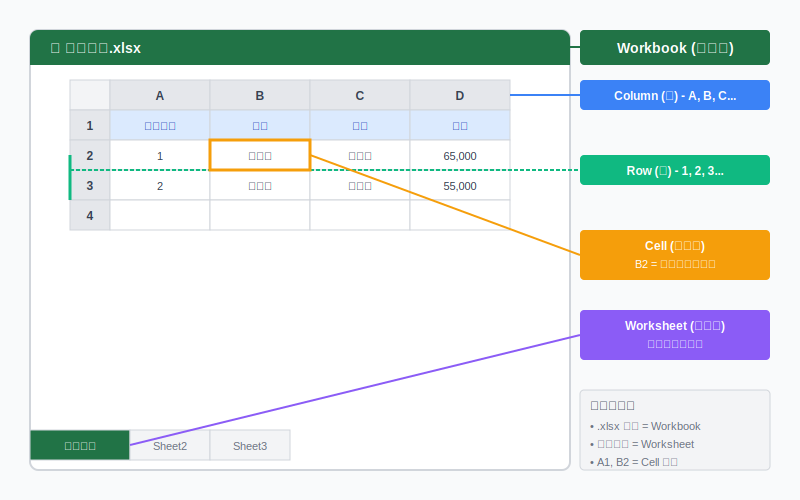
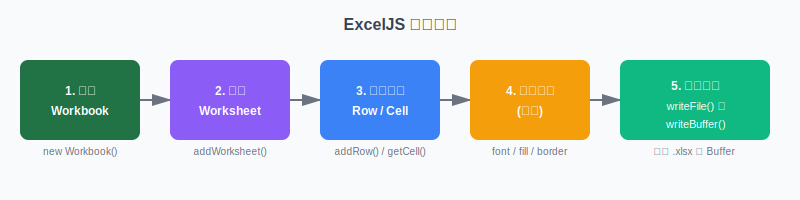
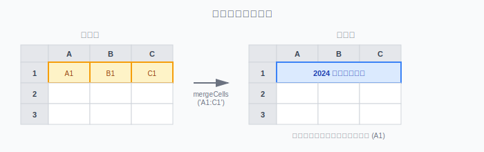

:::note
本文基於 **ExcelJS v4** 版本撰寫。
:::

## **為什麼選擇 ExcelJS？**

### **前情提要**

在 Node.js 生態系中，處理 Excel 檔案的套件主要就是 `xlsx` 和 `exceljs` 這兩個。我過往接觸的專案中大部分是使用 `xlsx`，不過最近公司專案在做弱掃的時候，掃出了 `xlsx`（SheetJS）這個套件有安全漏洞需要修復。查了一下才發現 xlsx 已經四年沒有在 npm 上更新了，一直停留在 0.18 版，而修復漏洞的版本是 0.19 以上，但這個版本只能到 SheetJS 官方的 GitHub 上取得，不再提供 npm 安裝。既然 `xlsx` 已經不再維護 npm 版本，那 `exceljs` 自然就成了首選。實際用下來，發現 `exceljs` 有幾個不錯的地方：

- **持續維護**：在 npm 上持續更新，社群也還算活躍
- **樣式支援完整**：字型、顏色、邊框、填充、對齊這些樣式設定都有支援，這點比 xlsx 的免費版本好很多
- **可以插入圖片**：如果報表需要放 logo 或圖表截圖，這個功能就很實用
- **支援串流處理**：處理大檔案的時候可以用串流 API，不會一次把整個檔案載入記憶體
- **有 TypeScript 型別定義**：開發體驗比較好


<br/>


## **基本概念：Excel 的結構**

在開始寫 code 之前，必須先了解一下 Excel 檔案的結構以及名詞定義，因為 ExcelJS 的 API 設計就是照著這個結構來的。

### **Excel 檔案的層級結構**

打開一個 Excel 檔案會看到：

1. **整個檔案**就是一個 **Workbook（活頁簿）**
2. 下方有很多分頁標籤，每個標籤就是一個 **Worksheet（工作表）**
3. 每個工作表裡面是一個表格，橫的叫 **Row（列）**，直的叫 **Column（欄）**
4. 列跟欄的交叉點就是 **Cell（儲存格）**

用圖來表示的話大概是這樣：



### **ExcelJS 的操作流程**

了解結構之後，用 ExcelJS 產生 Excel 檔案的流程大概是這樣：




<br/>


## **Workbook（活頁簿）**

Workbook 就是整個 Excel 檔案，所有操作都要從建立 Workbook 開始。

### **建立 Workbook**

```typescript
const workbook = new ExcelJS.Workbook();
```


### **設定檔案屬性**

可以設定一些 metadata，這些資訊會出現在 Excel 的「檔案 → 資訊」裡面：

```typescript
workbook.creator = 'Bosh';
workbook.lastModifiedBy = 'Bosh';
workbook.created = new Date(2024, 11, 1);
workbook.modified = new Date();
```


### **Workbook 屬性一覽**

| 屬性             | 型別          | 說明             |
| :--------------- | :------------ | :--------------- |
| `creator`        | `string`      | 建立者名稱       |
| `lastModifiedBy` | `string`      | 最後修改者名稱   |
| `created`        | `Date`        | 建立時間         |
| `modified`       | `Date`        | 最後修改時間     |
| `lastPrinted`    | `Date`        | 最後列印時間     |
| `worksheets`     | `Worksheet[]` | 所有工作表的陣列 |

---

## **Worksheet（工作表）**

Worksheet 就是 Excel 底部那些分頁標籤，每個工作表是獨立的資料表格。一個 Workbook 可以有很多個 Worksheet。

### **新增工作表**

**API 格式：**

```typescript
workbook.addWorksheet(name: string, options?: AddWorksheetOptions): Worksheet
```

**AddWorksheetOptions：**

| 屬性           | 型別              | 說明                           |
| :------------- | :---------------- | :----------------------------- |
| `properties`   | `object`          | 工作表屬性，如 `tabColor`      |
| `views`        | `WorksheetView[]` | 檢視設定，如凍結窗格、隱藏格線 |
| `pageSetup`    | `object`          | 頁面設定，如紙張大小、方向     |
| `headerFooter` | `object`          | 頁首頁尾設定                   |

**使用範例：**

```typescript
// 最基本的用法
const worksheet = workbook.addWorksheet('員工資料');

// 設定標籤顏色（讓不同工作表更容易辨識）
const sheet1 = workbook.addWorksheet('銷售報表', {
  properties: { tabColor: { argb: 'FF0000FF' } } // 藍色標籤
});

// 隱藏格線（讓報表看起來更乾淨）
const sheet2 = workbook.addWorksheet('列印用', {
  views: [{ showGridLines: false }]
});

// 凍結首列（捲動的時候標題列會固定在上面，處理大量資料的時候很好用）
const sheet3 = workbook.addWorksheet('大量資料', {
  views: [{ state: 'frozen', ySplit: 1 }]
});

// 凍結首列和首欄
const sheet4 = workbook.addWorksheet('交叉表', {
  views: [{ state: 'frozen', xSplit: 1, ySplit: 1 }]
});
```

### **取得工作表**

**API 格式：**

```typescript
workbook.getWorksheet(indexOrName: number | string): Worksheet
workbook.eachSheet(callback: (worksheet: Worksheet, id: number) => void): void
```

**使用範例：**

```typescript
// 用名稱取得
const worksheet = workbook.getWorksheet('員工資料');

// 用 id 取得（id 從 1 開始，但刪除工作表後 id 可能不連續）
const worksheet = workbook.getWorksheet(1);

// 直接用陣列取得（index 從 0 開始）
const worksheet = workbook.worksheets[0];

// 遍歷所有工作表
workbook.eachSheet((worksheet, sheetId) => {
  console.log(`工作表 ${sheetId}: ${worksheet.name}`);
});
```

### **刪除工作表**

**API 格式：**

```typescript
workbook.removeWorksheet(sheetId: number): void
```

**使用範例：**

```typescript
const sheet = workbook.addWorksheet('暫時的');
workbook.removeWorksheet(sheet.id);
```


<br/>


## **Column（欄）**

Column 就是 Excel 表格中垂直方向的欄位，用字母 A、B、C 來表示。在 ExcelJS 裡面，可以透過定義 `columns` 來設定每一欄的標題、寬度和預設樣式。

### **定義欄位結構**

Column 用來定義欄位的結構，包括標題、key、寬度、樣式，之後新增資料的時候就可以用物件的方式，key 會自動對應到正確的欄位。

**Column 定義屬性：**

| 屬性           | 型別      | 說明                       |
| :------------- | :-------- | :------------------------- |
| `header`       | `string`  | 欄位標題（會顯示在第一列） |
| `key`          | `string`  | 欄位的 key，用於物件對應   |
| `width`        | `number`  | 欄位寬度                   |
| `style`        | `Style`   | 該欄的預設樣式             |
| `hidden`       | `boolean` | 是否隱藏該欄               |
| `outlineLevel` | `number`  | 大綱層級                   |

**使用範例：**

```typescript
worksheet.columns = [
  { header: '員工編號', key: 'id', width: 12 },
  { header: '姓名', key: 'name', width: 15 },
  { header: '部門', key: 'department', width: 15 },
  { header: '薪資', key: 'salary', width: 15, style: { numFmt: '#,##0' } },
  { header: '到職日', key: 'hireDate', width: 15, style: { numFmt: 'yyyy/mm/dd' } }
];
```

定義好之後，新增資料就變得很直覺：

```typescript
// 用物件新增，key 會自動對應到欄位
worksheet.addRow({ 
  id: 1, 
  name: '王小明', 
  department: '研發部',
  salary: 65000, 
  hireDate: new Date(2020, 3, 15) 
});
```

這樣產生出來的 Excel 會長這樣：

| 員工編號 |  姓名  |  部門  |  薪資  |   到職日   |
| :------: | :----: | :----: | :----: | :--------: |
|    1     | 王小明 | 研發部 | 65,000 | 2020/04/15 |

### **存取和修改欄位**

**API 格式：**

```typescript
worksheet.getColumn(indexOrKey: number | string): Column
```

**Column 屬性：**

| 屬性           | 型別      | 說明               |
| :------------- | :-------- | :----------------- |
| `width`        | `number`  | 欄位寬度           |
| `hidden`       | `boolean` | 是否隱藏           |
| `outlineLevel` | `number`  | 大綱層級           |
| `collapsed`    | `boolean` | 是否收合（唯讀）   |
| `style`        | `Style`   | 欄位樣式           |
| `values`       | `any[]`   | 該欄所有儲存格的值 |

**使用範例：**

```typescript
// 用 key 取得
const idCol = worksheet.getColumn('id');

// 用字母取得
const colB = worksheet.getColumn('B');

// 用數字取得（從 1 開始）
const col3 = worksheet.getColumn(3);

// 修改欄位屬性
col3.width = 20;
col3.hidden = true; // 隱藏這個欄位
```


<br/>


## **Row（列）**

Row 就是 Excel 表格中水平方向的列，用數字 1、2、3 來表示。通常第一列會拿來放標題，從第二列開始放資料。

### **取得列**

**API 格式：**

```typescript
worksheet.getRow(rowNumber: number): Row
worksheet.getRows(startRow: number, length: number): Row[] | undefined
worksheet.lastRow: Row | undefined  // 唯讀屬性
```

**Row 屬性：**

| 屬性              | 型別      | 說明                     |
| :---------------- | :-------- | :----------------------- |
| `height`          | `number`  | 列高                     |
| `hidden`          | `boolean` | 是否隱藏                 |
| `outlineLevel`    | `number`  | 大綱層級                 |
| `collapsed`       | `boolean` | 是否收合（唯讀）         |
| `values`          | `any[]`   | 該列所有儲存格的值       |
| `cellCount`       | `number`  | 儲存格數量（唯讀）       |
| `actualCellCount` | `number`  | 有值的儲存格數量（唯讀） |

**使用範例：**

```typescript
// 取得第 5 列（如果不存在會建立空的）
const row = worksheet.getRow(5);

// 取得多列（從第 5 列開始，取 3 列）
const rows = worksheet.getRows(5, 3);

// 取得最後一列
const lastRow = worksheet.lastRow;
```

### **新增資料列**

**API 格式：**

```typescript
worksheet.addRow(data: any[] | object): Row
worksheet.addRows(data: (any[] | object)[]): void
```

**使用範例：**

```typescript
// 方式一：用物件（需要先定義 columns）
worksheet.addRow({ id: 1, name: '王小明' });

// 方式二：用陣列（按順序對應 A、B、C...）
worksheet.addRow([1, '王小明', '研發部']);

// 方式三：批次新增
worksheet.addRows([
  [2, '李小華', '行銷部'],
  [3, '張小美', '人資部'],
  { id: 4, name: '陳大明', department: '財務部' } // 也可以混用
]);
```

### **設定列的屬性**

```typescript
const row = worksheet.getRow(1);

// 設定列高
row.height = 30;

// 隱藏這一列
row.hidden = true;
```

### **遍歷所有列**

**API 格式：**

```typescript
worksheet.eachRow(callback: (row: Row, rowNumber: number) => void): void
worksheet.eachRow(options: { includeEmpty: boolean }, callback: (row: Row, rowNumber: number) => void): void
```

**使用範例：**

```typescript
// 只遍歷有資料的列
worksheet.eachRow((row, rowNumber) => {
  console.log(`第 ${rowNumber} 列:`, row.values);
});

// 包含空列
worksheet.eachRow({ includeEmpty: true }, (row, rowNumber) => {
  console.log(`第 ${rowNumber} 列`);
});
```


<br/>


## **Cell（儲存格）**

Cell 就是 Row 和 Column 的交叉點，也就是 Excel 裡面最小的資料單位。每個 Cell 都有一個位址，像是 `A1`（第 A 欄第 1 列）、`B2`（第 B 欄第 2 列）這樣。大部分的操作最終都是在操作 Cell，包括設定值、套用樣式等等。

### **存取儲存格**

**API 格式：**

```typescript
worksheet.getCell(address: string): Cell                    // 'A1' 格式
worksheet.getCell(row: number, col: number): Cell           // 列號, 欄號
row.getCell(indexOrKey: number | string): Cell              // 從 Row 取得
```

**使用範例：**

```typescript
// 用 A1 表示法（最常用）
const cell = worksheet.getCell('A1');

// 用列號和欄號
const cell = worksheet.getCell(1, 1); // 第 1 列第 1 欄

// 從 Row 物件取得
const row = worksheet.getRow(1);
const cell = row.getCell(1);      // 用數字
const cell = row.getCell('A');    // 用字母
const cell = row.getCell('name'); // 用 column key
```

### **設定儲存格的值**

**Cell 的 value 可以是以下型別：**

| 型別      | 說明                   | 範例            |
| :-------- | :--------------------- | :-------------- |
| `null`    | 空值                   | `null`          |
| `number`  | 數字                   | `123`, `3.14`   |
| `string`  | 字串                   | `'Hello'`       |
| `boolean` | 布林值                 | `true`, `false` |
| `Date`    | 日期                   | `new Date()`    |
| `object`  | 公式、超連結、富文本等 | 見下方範例      |

**使用範例：**

```typescript
// 基本的值
worksheet.getCell('A1').value = 'Hello';
worksheet.getCell('A2').value = 123;
worksheet.getCell('A3').value = new Date();
worksheet.getCell('A4').value = true;

// 公式
worksheet.getCell('A5').value = { formula: 'SUM(A2:A4)', result: 123 };

// 超連結
worksheet.getCell('A6').value = {
  text: '點我前往 Google',
  hyperlink: 'https://www.google.com',
  tooltip: '前往 Google 首頁'
};

// 內部連結（連到其他工作表）
worksheet.getCell('A7').value = {
  text: '前往 Sheet2',
  hyperlink: "#'Sheet2'!A1"
};
```

### **遍歷儲存格**

**API 格式：**

```typescript
row.eachCell(callback: (cell: Cell, colNumber: number) => void): void
row.eachCell(options: { includeEmpty: boolean }, callback: (cell: Cell, colNumber: number) => void): void
```

**使用範例：**

```typescript
// 只遍歷有值的儲存格
row.eachCell((cell, colNumber) => {
  console.log(`Cell ${colNumber} = ${cell.value}`);
});

// 包含空儲存格
row.eachCell({ includeEmpty: true }, (cell, colNumber) => {
  console.log(`Cell ${colNumber} = ${cell.value}`);
});
```


<br/>


## **合併儲存格**

做報表的時候常常會需要合併儲存格，例如做一個跨欄的標題。



**API 格式：**

```typescript
worksheet.mergeCells(range: string): void                           // 'A1:D1' 格式
worksheet.mergeCells(startCell: string, endCell: string): void      // 'A1', 'D1'
worksheet.mergeCells(top: number, left: number, bottom: number, right: number): void
worksheet.unMergeCells(range: string): void
```

**使用範例：**

```typescript
// 用範圍字串
worksheet.mergeCells('A1:D1');

// 用起點和終點
worksheet.mergeCells('A1', 'D1');

// 用座標（startRow, startCol, endRow, endCol）
worksheet.mergeCells(1, 1, 1, 4);

// 設定合併儲存格的值和樣式（設定在左上角的儲存格）
worksheet.getCell('A1').value = '2024 年度銷售報表';
worksheet.getCell('A1').font = { size: 16, bold: true };
worksheet.getCell('A1').alignment = { horizontal: 'center', vertical: 'middle' };

// 取消合併
worksheet.unMergeCells('A1');
```

合併儲存格之後，值和樣式都是設定在左上角的儲存格上。


<br/>


## **樣式設定**

這是 ExcelJS 比 xlsx 免費版強的地方，樣式設定很完整。

### **數字格式 (numFmt)**

數字格式可以控制數值的顯示方式，這個在做報表的時候超常用。

**常用的數字格式：**

| 格式字串              | 說明       | 範例                |
| :-------------------- | :--------- | :------------------ |
| `#,##0`               | 千分位整數 | 1,234,567           |
| `#,##0.00`            | 千分位小數 | 1,234.56            |
| `0.00%`               | 百分比     | 85.00%              |
| `"NT$"#,##0`          | 新台幣     | NT$1,234            |
| `yyyy/mm/dd`          | 日期       | 2024/12/01          |
| `yyyy-mm-dd hh:mm:ss` | 日期時間   | 2024-12-01 10:30:00 |

**使用範例：**

```typescript
worksheet.getCell('A1').value = 0.85;
worksheet.getCell('A1').numFmt = '0.00%'; // 顯示為 85.00%

worksheet.getCell('A2').value = 1234567;
worksheet.getCell('A2').numFmt = '#,##0'; // 顯示為 1,234,567
```

### **字型 (font)**

**Font 屬性：**

| 屬性        | 型別                              | 說明                   |
| :---------- | :-------------------------------- | :--------------------- |
| `name`      | `string`                          | 字型名稱，如 `'Arial'` |
| `size`      | `number`                          | 字型大小               |
| `family`    | `number`                          | 字型家族（1-14）       |
| `bold`      | `boolean`                         | 粗體                   |
| `italic`    | `boolean`                         | 斜體                   |
| `underline` | `boolean \| 'single' \| 'double'` | 底線                   |
| `strike`    | `boolean`                         | 刪除線                 |
| `color`     | `{ argb: string }`                | 顏色（AARRGGBB 格式）  |
| `vertAlign` | `'superscript' \| 'subscript'`    | 上標/下標              |

**使用範例：**

```typescript
worksheet.getCell('A1').font = {
  name: 'Arial',
  size: 14,
  bold: true,
  italic: true,
  underline: true,
  strike: true,
  color: { argb: 'FFFF0000' } // 紅色
};
```

顏色的格式是 `AARRGGBB`，AA 是透明度（FF 是不透明），RR、GG、BB 分別是紅綠藍。例如：
- `'FFFF0000'` = 紅色
- `'FF00FF00'` = 綠色
- `'FF0000FF'` = 藍色
- `'FFFFFFFF'` = 白色

### **對齊 (alignment)**

**Alignment 屬性：**

| 屬性           | 型別                                                   | 說明                            |
| :------------- | :----------------------------------------------------- | :------------------------------ |
| `horizontal`   | `'left' \| 'center' \| 'right' \| 'fill' \| 'justify'` | 水平對齊                        |
| `vertical`     | `'top' \| 'middle' \| 'bottom' \| 'distributed'`       | 垂直對齊                        |
| `wrapText`     | `boolean`                                              | 自動換行                        |
| `indent`       | `number`                                               | 縮排                            |
| `textRotation` | `number \| 'vertical'`                                 | 文字旋轉角度（-90 到 90）或垂直 |
| `shrinkToFit`  | `boolean`                                              | 縮小字型以適合欄寬              |

**使用範例：**

```typescript
worksheet.getCell('A1').alignment = {
  horizontal: 'center',
  vertical: 'middle',
  wrapText: true,
  indent: 2,
  textRotation: 45
};
```

### **邊框 (border)**

**Border 屬性：**

| 屬性       | 型別                  | 說明   |
| :--------- | :-------------------- | :----- |
| `top`      | `BorderStyle`         | 上邊框 |
| `left`     | `BorderStyle`         | 左邊框 |
| `bottom`   | `BorderStyle`         | 下邊框 |
| `right`    | `BorderStyle`         | 右邊框 |
| `diagonal` | `DiagonalBorderStyle` | 對角線 |

**BorderStyle：**

| 屬性    | 型別                                                                | 說明     |
| :------ | :------------------------------------------------------------------ | :------- |
| `style` | `'thin' \| 'medium' \| 'thick' \| 'dotted' \| 'dashed' \| 'double'` | 邊框樣式 |
| `color` | `{ argb: string }`                                                  | 邊框顏色 |

**使用範例：**

```typescript
// 四邊細邊框
worksheet.getCell('A1').border = {
  top: { style: 'thin' },
  left: { style: 'thin' },
  bottom: { style: 'thin' },
  right: { style: 'thin' }
};

// 帶顏色的邊框
worksheet.getCell('A2').border = {
  top: { style: 'thick', color: { argb: 'FF0000FF' } },
  left: { style: 'thick', color: { argb: 'FF0000FF' } },
  bottom: { style: 'thick', color: { argb: 'FF0000FF' } },
  right: { style: 'thick', color: { argb: 'FF0000FF' } }
};
```

### **填充 (fill)**

**Fill 屬性（Pattern Fill）：**

| 屬性      | 型別                                                   | 說明     |
| :-------- | :----------------------------------------------------- | :------- |
| `type`    | `'pattern'`                                            | 填充類型 |
| `pattern` | `'solid' \| 'darkVertical' \| 'darkHorizontal' \| ...` | 圖案類型 |
| `fgColor` | `{ argb: string }`                                     | 前景色   |
| `bgColor` | `{ argb: string }`                                     | 背景色   |

**Fill 屬性（Gradient Fill）：**

| 屬性       | 型別                                              | 說明                  |
| :--------- | :------------------------------------------------ | :-------------------- |
| `type`     | `'gradient'`                                      | 填充類型              |
| `gradient` | `'angle' \| 'path'`                               | 漸層類型              |
| `degree`   | `number`                                          | 角度（angle 類型用）  |
| `center`   | `{ left: number, top: number }`                   | 中心點（path 類型用） |
| `stops`    | `{ position: number, color: { argb: string } }[]` | 漸層停止點            |

**使用範例：**

```typescript
// 純色背景
worksheet.getCell('A1').fill = {
  type: 'pattern',
  pattern: 'solid',
  fgColor: { argb: 'FFFFFF00' } // 黃色背景
};

// 漸層
worksheet.getCell('A2').fill = {
  type: 'gradient',
  gradient: 'angle',
  degree: 0,
  stops: [
    { position: 0, color: { argb: 'FF0000FF' } },
    { position: 1, color: { argb: 'FFFFFFFF' } }
  ]
};
```

### **套用樣式到整欄或整列**

如果要讓整欄或整列都套用同樣的樣式，可以這樣做：

```typescript
// 整欄套用粗體
worksheet.getColumn('A').font = { bold: true };

// 整列套用背景色
worksheet.getRow(1).fill = {
  type: 'pattern',
  pattern: 'solid',
  fgColor: { argb: 'FF4472C4' }
};
worksheet.getRow(1).font = { bold: true, color: { argb: 'FFFFFFFF' } };
```

---

## **圖片**

如果報表需要放公司 logo 或是圖表截圖，可以用這個功能。

### **新增圖片到 Workbook**

**API 格式：**

```typescript
workbook.addImage(options: ImageOptions): number  // 回傳 imageId
```

**ImageOptions：**

| 屬性        | 型別                       | 說明                     |
| :---------- | :------------------------- | :----------------------- |
| `filename`  | `string`                   | 檔案路徑（Node.js 環境） |
| `buffer`    | `Buffer`                   | 圖片 Buffer              |
| `base64`    | `string`                   | Base64 編碼的圖片        |
| `extension` | `'png' \| 'jpeg' \| 'gif'` | 圖片格式                 |

**使用範例：**

```typescript
// 從檔案路徑新增（Node.js 環境）
const imageId1 = workbook.addImage({
  filename: 'logo.png',
  extension: 'png'
});

// 從 Buffer 新增
const imageId2 = workbook.addImage({
  buffer: fs.readFileSync('logo.png'),
  extension: 'png'
});

// 從 Base64 新增（前端常用）
const imageId3 = workbook.addImage({
  base64: 'data:image/png;base64,iVBORw0KGgo...',
  extension: 'png'
});
```

### **把圖片放到工作表**

**API 格式：**

```typescript
worksheet.addImage(imageId: number, range: string): void
worksheet.addImage(imageId: number, options: ImagePosition): void
```

**ImagePosition：**

| 屬性         | 型別                                      | 說明             |
| :----------- | :---------------------------------------- | :--------------- |
| `tl`         | `{ col: number, row: number }`            | 左上角位置       |
| `br`         | `{ col: number, row: number }`            | 右下角位置       |
| `ext`        | `{ width: number, height: number }`       | 圖片尺寸（像素） |
| `editAs`     | `'oneCell' \| 'absolute'`                 | 編輯模式         |
| `hyperlinks` | `{ hyperlink: string, tooltip?: string }` | 圖片超連結       |

**使用範例：**

```typescript
// 用儲存格範圍定位
worksheet.addImage(imageId1, 'A1:C5');

// 用精確座標和尺寸
worksheet.addImage(imageId2, {
  tl: { col: 0, row: 0 },      // 左上角位置
  ext: { width: 200, height: 100 } // 圖片尺寸（像素）
});
```

---

## **檔案讀寫**

ExcelJS 提供多種方式來讀取和寫入 Excel 檔案，包括直接讀寫檔案、使用串流、以及透過 Buffer。在前端環境中，通常會使用 Buffer 來產生檔案讓使用者下載。

### **寫入檔案**

寫入檔案有三種方式：直接寫入檔案系統、寫入串流、或產生 Buffer。在 Node.js 環境中三種都可以用，但在瀏覽器環境中只能用 `writeBuffer()`。

**API 格式：**

```typescript
workbook.xlsx.writeFile(filename: string): Promise<void>
workbook.xlsx.write(stream: Stream): Promise<void>
workbook.xlsx.writeBuffer(): Promise<Buffer>
```

**使用範例：**

```typescript
// 寫入檔案（Node.js 環境）
await workbook.xlsx.writeFile('output.xlsx');

// 寫入串流（Node.js 環境）
const stream = fs.createWriteStream('output.xlsx');
await workbook.xlsx.write(stream);

// 產生 Buffer（前端和後端都可以用）
const buffer = await workbook.xlsx.writeBuffer();
```

### **讀取檔案**

讀取檔案同樣有三種方式：從檔案系統讀取、從串流讀取、或從 Buffer 載入。

**API 格式：**

```typescript
workbook.xlsx.readFile(filename: string): Promise<Workbook>
workbook.xlsx.read(stream: Stream): Promise<Workbook>
workbook.xlsx.load(buffer: Buffer): Promise<Workbook>
```

**使用範例：**

```typescript
const workbook = new ExcelJS.Workbook();

// 從檔案讀取（Node.js 環境）
await workbook.xlsx.readFile('input.xlsx');

// 從串流讀取（Node.js 環境）
const stream = fs.createReadStream('input.xlsx');
await workbook.xlsx.read(stream);

// 從 Buffer 讀取（前端和後端都可以用）
await workbook.xlsx.load(buffer);
```

---

## **實用範例：員工資料表**

這邊用一個員工資料表的例子，示範如何匯出、匯入 Excel 檔案，以及處理大檔案的情況。三個範例共用同樣的資料結構：

### **資料結構**

| 欄位         | 型別     | 說明     |
| :----------- | :------- | :------- |
| `id`         | `number` | 員工編號 |
| `name`       | `string` | 姓名     |
| `department` | `string` | 部門     |
| `salary`     | `number` | 薪資     |
| `hireDate`   | `Date`   | 到職日   |

**TypeScript 介面定義：**

```typescript
interface Employee {
  id: number;
  name: string;
  department: string;
  salary: number;
  hireDate: Date;
}
```

**Excel 檔案格式：**

| 員工編號 |  姓名  |  部門  |   薪資    |   到職日   |
| :------: | :----: | :----: | :-------: | :--------: |
|    1     | 王小明 | 研發部 | NT$65,000 | 2020/04/15 |
|    2     | 李小華 | 行銷部 | NT$55,000 | 2021/08/01 |
|    3     | 張小美 | 人資部 | NT$50,000 | 2022/02/10 |

---

### **範例一：匯出員工資料表（前端下載）**

這個範例示範如何在前端產生 Excel 檔案並讓使用者下載。重點在於使用 `writeBuffer()` 產生 Buffer，然後轉成 Blob 觸發下載。

```typescript
import ExcelJS from 'exceljs';

interface Employee {
  id: number;
  name: string;
  department: string;
  salary: number;
  hireDate: Date;
}

const exportEmployeeReport = async (employees: Employee[]) => {
  const workbook = new ExcelJS.Workbook();
  workbook.creator = 'HR System';
  workbook.created = new Date();

  // 建立工作表，凍結標題列
  const worksheet = workbook.addWorksheet('員工資料', {
    views: [{ state: 'frozen', ySplit: 1 }]
  });

  // 定義欄位
  worksheet.columns = [
    { header: '員工編號', key: 'id', width: 12 },
    { header: '姓名', key: 'name', width: 15 },
    { header: '部門', key: 'department', width: 15 },
    { header: '薪資', key: 'salary', width: 15, style: { numFmt: '"NT$"#,##0' } },
    { header: '到職日', key: 'hireDate', width: 15, style: { numFmt: 'yyyy/mm/dd' } }
  ];

  // 設定標題列樣式
  const headerRow = worksheet.getRow(1);
  headerRow.font = { bold: true, color: { argb: 'FFFFFFFF' } };
  headerRow.fill = {
    type: 'pattern',
    pattern: 'solid',
    fgColor: { argb: 'FF4472C4' }
  };
  headerRow.alignment = { horizontal: 'center', vertical: 'middle' };
  headerRow.height = 25;

  // 新增資料
  employees.forEach(emp => {
    worksheet.addRow(emp);
  });

  // 幫所有儲存格加上邊框
  worksheet.eachRow((row) => {
    row.eachCell((cell) => {
      cell.border = {
        top: { style: 'thin' },
        left: { style: 'thin' },
        bottom: { style: 'thin' },
        right: { style: 'thin' }
      };
    });
  });

  return workbook.xlsx.writeBuffer();
};

// 前端下載
const handleDownload = async () => {
  const employees: Employee[] = [
    { id: 1, name: '王小明', department: '研發部', salary: 65000, hireDate: new Date(2020, 3, 15) },
    { id: 2, name: '李小華', department: '行銷部', salary: 55000, hireDate: new Date(2021, 7, 1) },
    { id: 3, name: '張小美', department: '人資部', salary: 50000, hireDate: new Date(2022, 1, 10) }
  ];

  const buffer = await exportEmployeeReport(employees);

  // 建立 Blob 並觸發下載
  const blob = new Blob([buffer], { 
    type: 'application/vnd.openxmlformats-officedocument.spreadsheetml.sheet' 
  });
  const url = URL.createObjectURL(blob);
  
  const link = document.createElement('a');
  link.href = url;
  link.download = '員工資料表.xlsx';
  link.click();
  
  URL.revokeObjectURL(url);
};
```

---

### **範例二：匯入員工資料表（前端讀取並顯示）**

這個範例示範如何在前端讀取使用者上傳的 Excel 檔案，並將資料顯示在畫面上。重點在於使用 `FileReader` 讀取檔案成 ArrayBuffer，然後用 `load()` 載入。

```typescript
import ExcelJS from 'exceljs';

interface Employee {
  id: number;
  name: string;
  department: string;
  salary: number;
  hireDate: Date;
}

const parseEmployeeExcel = async (file: File): Promise<Employee[]> => {
  // 讀取檔案成 ArrayBuffer
  const arrayBuffer = await file.arrayBuffer();
  
  const workbook = new ExcelJS.Workbook();
  await workbook.xlsx.load(arrayBuffer);

  // 取得第一個工作表
  const worksheet = workbook.worksheets[0];
  if (!worksheet) {
    throw new Error('找不到工作表');
  }

  const employees: Employee[] = [];

  // 從第二列開始讀取（第一列是標題）
  worksheet.eachRow((row, rowNumber) => {
    if (rowNumber === 1) return; // 跳過標題列

    const employee: Employee = {
      id: row.getCell(1).value as number,
      name: row.getCell(2).value as string,
      department: row.getCell(3).value as string,
      salary: row.getCell(4).value as number,
      hireDate: row.getCell(5).value as Date
    };

    employees.push(employee);
  });

  return employees;
};

// React 元件範例
const EmployeeImport: React.FC = () => {
  const [employees, setEmployees] = useState<Employee[]>([]);
  const [error, setError] = useState<string | null>(null);

  const handleFileChange = async (e: React.ChangeEvent<HTMLInputElement>) => {
    const file = e.target.files?.[0];
    if (!file) return;

    try {
      const data = await parseEmployeeExcel(file);
      setEmployees(data);
      setError(null);
    } catch (err) {
      setError('讀取檔案失敗');
      console.error(err);
    }
  };

  return (
    <div>
      <input type="file" accept=".xlsx" onChange={handleFileChange} />
      {error && <p style={{ color: 'red' }}>{error}</p>}
      {employees.length > 0 && (
        <table>
          <thead>
            <tr>
              <th>員工編號</th>
              <th>姓名</th>
              <th>部門</th>
              <th>薪資</th>
              <th>到職日</th>
            </tr>
          </thead>
          <tbody>
            {employees.map(emp => (
              <tr key={emp.id}>
                <td>{emp.id}</td>
                <td>{emp.name}</td>
                <td>{emp.department}</td>
                <td>{emp.salary.toLocaleString()}</td>
                <td>{emp.hireDate.toLocaleDateString()}</td>
              </tr>
            ))}
          </tbody>
        </table>
      )}
    </div>
  );
};
```

---

### **範例三：大檔案串流處理**

如果要處理很大的 Excel 檔案（例如幾萬筆資料），用一般的方式可能會吃掉很多記憶體。這時候可以用串流 API，邊讀邊處理或邊寫邊釋放記憶體。

:::caution
串流 API 主要用於 Node.js 環境，在瀏覽器環境中無法使用。
:::

**串流寫入：**

```typescript
import ExcelJS from 'exceljs';

const exportLargeEmployeeData = async (getEmployeeBatch: (offset: number, limit: number) => Promise<Employee[]>) => {
  const workbook = new ExcelJS.stream.xlsx.WorkbookWriter({
    filename: 'employees-large.xlsx',
    useStyles: true,
    useSharedStrings: true
  });

  const worksheet = workbook.addWorksheet('員工資料');

  worksheet.columns = [
    { header: '員工編號', key: 'id', width: 12 },
    { header: '姓名', key: 'name', width: 15 },
    { header: '部門', key: 'department', width: 15 },
    { header: '薪資', key: 'salary', width: 15 },
    { header: '到職日', key: 'hireDate', width: 15 }
  ];

  // 分批取得資料並寫入
  const batchSize = 1000;
  let offset = 0;
  let hasMore = true;

  while (hasMore) {
    const batch = await getEmployeeBatch(offset, batchSize);
    
    if (batch.length === 0) {
      hasMore = false;
      break;
    }

    // 逐列寫入，寫完就 commit 釋放記憶體
    for (const emp of batch) {
      worksheet.addRow(emp).commit();
    }

    offset += batchSize;
    console.log(`已處理 ${offset} 筆資料`);
  }

  worksheet.commit();
  await workbook.commit();
  
  console.log('匯出完成');
};
```

**串流讀取：**

```typescript
import ExcelJS from 'exceljs';

const importLargeEmployeeData = async (
  filename: string,
  onEmployee: (employee: Employee) => Promise<void>
) => {
  const workbookReader = new ExcelJS.stream.xlsx.WorkbookReader(filename);

  let rowCount = 0;

  for await (const worksheetReader of workbookReader) {
    console.log(`處理工作表: ${worksheetReader.name}`);

    for await (const row of worksheetReader) {
      rowCount++;
      
      // 跳過標題列
      if (rowCount === 1) continue;

      const employee: Employee = {
        id: row.getCell(1).value as number,
        name: row.getCell(2).value as string,
        department: row.getCell(3).value as string,
        salary: row.getCell(4).value as number,
        hireDate: row.getCell(5).value as Date
      };

      await onEmployee(employee);

      if (rowCount % 1000 === 0) {
        console.log(`已處理 ${rowCount} 筆資料`);
      }
    }
  }

  console.log(`總共處理 ${rowCount - 1} 筆資料`);
};

// 使用範例
await importLargeEmployeeData('employees-large.xlsx', async (employee) => {
  // 處理每一筆員工資料，例如存入資料庫
  await saveToDatabase(employee);
});
```

---

## **Reference**

- **[ExcelJS GitHub](https://github.com/exceljs/exceljs)**
- **[ExcelJS npm](https://www.npmjs.com/package/exceljs)**
