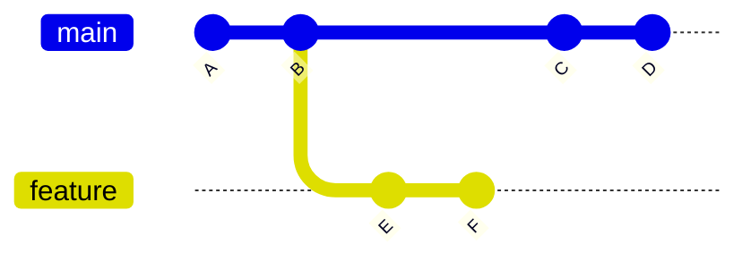
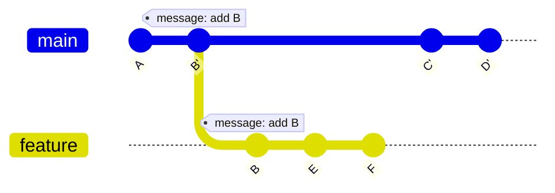

## **Git rebase 的用途**

**`git rebase`** 是一個用於重新應用或整合 Git Commit 歷史的工具，許多人對 **git rebase** 的印象就是它可以用來將一個分支變基合併到另一個分支。但其實，**git rebase** 除了用來合併分支，他還有一個很方便的功能叫做『**互動模式**』，它可用於調整 Commit 歷史，讓我們可以對每個 Commit 進行操作，包括：

1. 修改 Commit 訊息
2. 合併 Commit
3. 重新排序 Commit
4. 刪除不需要的 Commit。

本篇文章就是要帶大家了解如何使用 **git rebase** 的互動模式工具！

## **啟動互動模式**

使用 **Git Rebase** 互動模式的基本指令如下：

```bash
git rebase -i <base commit>
```

**\<base commit>** 用來告訴 git，我們要修改的範圍到是`從 <base commit> 到 HEAD，但不包括 <base commit>` 。

:::tip
眼尖的你馬上就會發現，那專案中的第一個 git commit 紀錄不就永遠都修不到了嗎？
答案是：對！Git Rebase 互動模式不允許修改**最早的 Commit**，因為這樣做可能會破壞 Git 歷史的完整性。

:::

假設我有一個如下的 commit 歷史紀錄，且 **HEAD** 停在 **D** 這個 Commit 紀錄點上，當我下了 `git rebase -i A` 指令，就代表我希望從新整理 **B~D** 的 commit 紀錄；如果我的 **HEAD** 改停在 **C**  這個 Commit 紀錄點上，當我同樣下了`git rebase -i A` 指令，則代表我希望從新整理 **B~C** 的 commit 紀錄。


:::note
commit 編號是一串很像亂碼的 SHA-1 字串，我們很難直接從 commit 編號看出所指的是哪一個 commit，因此在指定 commit 時我通常會使用`HEAD~` 和 `HEAD^`，來來引用 Git Commit 歷史中相對位置的標記。
在沒有合併分支的狀況下`HEAD~` 與`HEAD^`兩者在使用上是沒有區別的。
推薦參考這篇文章：[git在回退版本时HEAD~和HEAD^的作用和区别](https://blog.csdn.net/albertsh/article/details/106448035)
:::

## **互動模式指令**

### **pick**

**`pick`** 指令是互動模式中最基本的操作，它的作用是選取某個 commit 保持不變。當我們在重排列提交或是進行提交整理時，**pick** 命令使得該 commit 原封不動地被保留在新的提交歷史中。例如，在一系列的 commits 中，如果我們只想修改其中幾個的提交訊息或順序，其他的則保持原樣，那麼就應該對這些沒有要更動的 commit 使用 **pick**。

### **reword**

**`reword`** 用於修改 commit 的訊息而不改變其內容。

### **edit**

**`edit`** 指令允許我們在提交歷史中暫停在這個 commit 上，讓我們可以更改該 commit 的內容。這包括但不限於修改文件、新增文件或刪除文件。完成修改後，我們會使用 `git commit --amend` 命令來修改提交，然後繼續重構過程。這是在發現提交中有錯誤或遺漏時非常有用的工具。

### **squash**

使用 **`squash`** 指令可以將一個或多個提交合併到前一個提交中。這個指令通常用於合併多個小修改，以清理提交歷史。在互動模式下，**squash** 會將選定的提交與前一個提交合併，並提示你編輯一個新的提交訊息。

### **fixup**

**`fixup`** 是 **squash** 的一個變體，它也會將提交合併到前一個提交，但它會自動使用前一個提交的訊息，不會提示你進行編輯。這對於那些只是簡單修正前一個提交的錯誤而不需要留下額外提交訊息的情況非常有用。

### **drop**

**`drop`** 指令用於完全移除一個提交。如果在開發過程中產生了一些不再需要或錯誤的提交，使用 **drop** 可以將它們從提交歷史中清除。

## **使用 Git Rebase 互動模式的風險與注意事項**

上述介紹的指令中，除了 **pick** 指令以外的所有指令都會改變提交歷史，在 Git 中，如果某個提交已經被推送到遠端或是被其他分支依賴，那麼修改這些 commit 就會帶來風險，可能會影響其他正在使用依賴這些 commit 的分支的開發者。因此使用互動模式修改 git commit 歷史紀錄時，需要格外注意，只有還沒被推送到遠端或被其他分支依賴的 commit 是絕對安全的。

而使用修改 commit 歷史紀錄常見的意外情況大概有兩種：

1. **製造潛在衝突**
2. **直接與後面的 commit 發生衝突**

### **意外情況：製造潛在衝突**

我們以這張 git commit 歷史紀錄圖來舉例：

在這個例子中，我會按照固定的規則為每個 commit 創建一個文本文件並添加相應的 commit 訊息。例如，對於 commit A，我新增了名為 A.txt 的檔案，以字母「A」作為文本內容，並以「add A」作為 commit 訊息。從字母 A 到 F，每個 commit 都遵循這樣的規則來建立對應的文本文件和添加 commit 訊息。



我們接著使用 `git rebase -i HEAD~3` 指令並選擇編輯 **commit B**:

```
edit B add B
pick C add C
pick D add D
```

假設我在 commit B 中修改了 B.txt 的文本內容，將其修改為：

```
B => edit B
```

修改完成後，我以 `git commit --amend` 提交了這些修改，會發現， 此時 git commit 歷史紀錄變更如下所示：

在 main 與 feature 分支上都存在一個 message 為「add B」的 commit，但 main 分支上的「B.txt」文本內容為「**B => edit B**」，而 feature 分支上的「B.txt」文本內容仍然是「**B**」。此外，原本 main 分支上的 commit **B ~ D** 的 Hash 編號都已變更。

這是因為 **feature** 分支依賴於原始的 commit B。當我們修改 **main** 分支上的 commit B 時，Git 為了避免影響到 feature 分支的紀錄，會自動保留原本的 commit B，並將 main 上原本包含 commit 「B」以後的 commit Hash 編號換掉。然而，這也導致了一個問題：原本在建立 **feature** 分支時，我們預期 **main** 分支與 **feature** 分支的「B.txt」應該相同，但現在兩分支上的「B.txt」內容不同，這在未來將 **feature** 分支合併回 **main** 分支時，可能會在「B.txt」上引發衝突。



### **意外情況：直接與後面的 commit 發生衝突**

以前述的 git commit 歷史紀錄為例，我們現在探討當前面的 commit 直接與後面的 commit 產生衝突的情況。

我們同樣使用 `git rebase -i HEAD~3` 指令並選擇編輯 **commit B**:

```
edit B add B
pick C add C
pick D add D
```

假設這次我們在 commit **B** 上創建了原本 commit **D** 才要創建的 「D.txt」文本，並以「new D」作為文本內容。由於 commit **B** 上的修改內容與後面的 commit **D** 在 「D.txt」檔案上修改到了同一行，因此當我們以 `git commit --amend` 提交修改時，因 Git 無法自動解決這個問題而會發生直接衝突。在這種情況下，我們就必須手動解決這些衝突，並且解衝突的時候還要考慮到依賴於 commit **B** 的分支。

## **Reference**

- **[Rebase](https://git-tutorial.readthedocs.io/zh/latest/rebase.html#id3)**
- **[Rebase 互動模式](https://zlargon.gitbooks.io/git-tutorial/content/patch/rebase_interactive.html)**
- **[使用 Git Rebase Interactive 模式整理 Commit](https://www.gss.com.tw/blog/%E4%BD%BF%E7%94%A8-git-rebase-interactive-%E6%A8%A1%E5%BC%8F%E6%95%B4%E7%90%86-commit)**