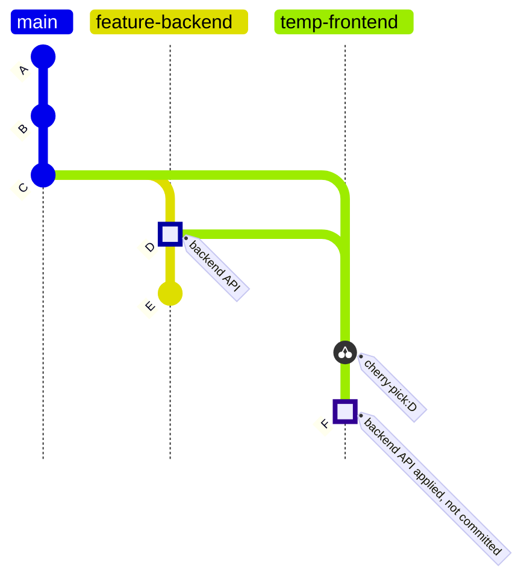
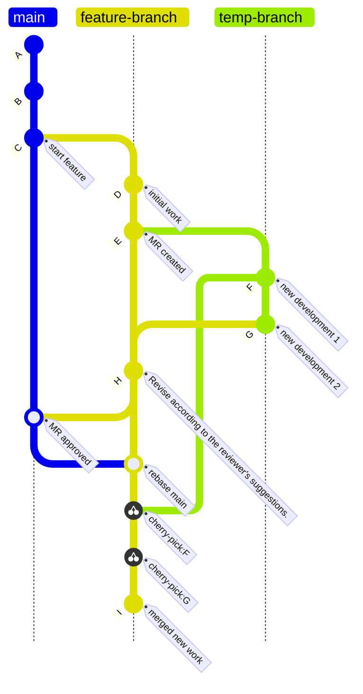

 雖然我一直都知道 `git cherry-pick` 指令的主要功能是將指定的提交（commit）從一個分支應用到另一個分，然而，在我的個人開發經驗中，其實很少遇到需要使用 cherry-pick 的場景。直到最近，我在工作中實際用 git cherry-pick 應付了一些特定的工作情境，我才發現了 git cherry-pick 的妙用之處。這篇文章將介紹 git cherry-pick 的基本概念、實際應用方法，以及在多人協作中的最佳實踐，能夠幫助開發者在團隊協作的過程中更靈活地管理分支變更，提升工作效率。


## **git cherry-pick 基本概念**

### **cherry-pick 功能**

在使用 Git 進行版本控制的過程中，有時候我們需要將其他分支上的特定變更應用到當前分支，但又不想拿到該分支上的所有變更，這時候，`git cherry-pick` 就派上用場了。cherry-pick 允許我們從某個分支選取特定的提交（commit）並將其複製到當前分支，同時保留原始分支的提交記錄不受影響。

### **基本用法**

**git cherry-pick** 的基本使用方法包括以下幾種：

1. **撿取單個 Commit 過來合併**
    
    要將某個特定 commit 從一個分支撿取並合併到當前分支，可以使用以下命令：
    
    ```bash
    git cherry-pick <commit-hash>
    ```
    
    例如，假設我們在 **feature-branch** 上有一個 commit **a1b2c3d**，我們希望將這個 commit 合併到 **main** 分支上：
    
    ```bash
    git checkout main
    git cherry-pick a1b2c3d
    ```
    
    ```mermaid
    gitGraph TB:
       commit id: "A"
       commit id: "B"
       commit id: "C"
       branch feature-branch
       checkout feature-branch
       commit id: "D" tag: "a1b2c3d" type: HIGHLIGHT
       commit id: "E"
       checkout main
       cherry-pick id: "D"
       commit id: "F" tag: "merge from D"
       commit id: "G"
    
    ```
    
2. **撿取多個 Commit 過來合併**
    
    也可以一次撿取多個 commit，方法是指定一個 commit 範圍：
    
    ```bash
    git cherry-pick <start-commit-hash>^..<end-commit-hash>
    ```
    
    例如，要將從 **a1b2c3d** 到 **e4f5g6h** 之間的所有 commit 合併到當前分支：
    
    ```bash
    git cherry-pick a1b2c3d^..e4f5g6h
    ```
    
    ```mermaid
    gitGraph TB:
       commit id: "A"
       commit id: "B"
       commit id: "C"
       branch feature-branch
       checkout feature-branch
       commit id: "D" tag: "a1b2c3d" type: HIGHLIGHT
       commit id: "E" type: HIGHLIGHT
       commit id: "F" tag: "e4f5g6h" type: HIGHLIGHT
       checkout main
       cherry-pick id: "D"
       cherry-pick id: "E"
       cherry-pick id: "F"
       commit id: "G" tag: "merge from D,E,F"
    
    ```
    
3. **撿取後先不合併**
    
    有時候可能也會想要撿取 commit，但先不合併，這時可以使用 `--no-commit` 選項：
    
    ```bash
    git cherry-pick --no-commit <commit-hash>
    ```
    
    ```bash
    git cherry-pick --no-commit a1b2c3d
    ```
    
    ```mermaid
    gitGraph TB:
       commit id: "A"
       commit id: "B"
       commit id: "C"
       branch feature-branch
       checkout feature-branch
       commit id: "D" tag: "a1b2c3d" type: HIGHLIGHT
       commit id: "E"
       checkout main
       cherry-pick id: "D"
       commit id: "F" tag: "change applied, not committed" type: HIGHLIGHT
    
    ```
    
    這樣，變更會被應用到工作區，但不會立即生成一個新的 commit，讓我們有機會在合併前進行修改。
    

### **衝突處理**

在使用 **git cherry-pick** 的過程中，如果發生衝突，Git 會提示我們手動解決衝突。衝突解決後，需要完成 **cherry-pick** 操作。

- **解決衝突後繼續 cherry-pick**

    解決衝突後，告訴 Git 已經解決並繼續 **cherry-pick**：

    ```bash
    git add <resolved-files>
    git cherry-pick --continue
    ```

- **放棄 cherry-pick**

    如果不想繼續 **cherry-pick**，可以使用以下命令放棄操作：

    ```bash
    git cherry-pick --abort
    ```

## **多人協作時常見的使用場景**

### **情境1：臨時跟同事借調特定程式碼**

現代常見的 Web 應用通常是採前後端分離式開發，將完整的 Web 應用功能分給前端和後端兩個團隊並行工作。然而，前後端的開發進度往往是不同步的。有時候前端開發者會面臨某些功能所依賴的後端 API 尚未 merge 進主分支，因此只能先擱置開發這個功能。後端有時候也會需要等待前端完成部分介面，才比較方便測試與驗證一些商業邏輯。在這種情況下， git cherry-pick 可以大大地派上用場。

在上述的情境下，假設我是在等待後端 API 上主分支的前端開發者，我可以請同事將他正在開發的分支推送到 GitLab，然後我可以將該分支拉取到本地。接下來，我可以使用 git cherry-pick 命令並搭配 --no-commit 選項，將後端同事剛剛提交的 API 程式碼應用到我的本地開發分支，但不產生新的提交記錄。等到前端功能完成後，我可以放棄這些暫時使用的後端程式碼，確保我的提交記錄中不混入這些程式碼，從而保持提交歷史的整潔。

這樣，我就能在後端功能尚未合併到主分支之前，不需要額外搭建 Mock Server，也能順利開發前端的 API 資料流功能，並且不會影響後端同事的進度，從而提升團隊的合作效率。



### **情境2：等待 Code Review 時繼續開發該分支的進度**

在我們團隊的開發流程中，我們使用 Git Flow 和 Jira 來管理任務進度。每個分支和合併請求（MR）都會對應到 Jira 的特定任務卡片。然而，有時一個 MR 只能部分完成某個 Jira 任務，即便分支被合併到主分支後，仍需要使用這個分支來繼續開發其他相關的需求。

在這種情況下，經常會遇到 MR 審查周期較長的問題，導致我在等待審查的過程中又有了大量的程式碼變更。但由於擔心審查者可能提出的修改建議，我也不太敢在原始分支上直接繼續提交新的更改。為了解決這個問題，我通常會從 MR 提交的那個點建立一個臨時分支，並在這個臨時分支上繼續開發工作。

當 MR 最終獲得批准並合併進主分支後，我會回到原始分支，首先將其 rebase 到最新的主分支，然後將臨時分支上的最新進展使用 git cherry-pick 命令挑選回來，最後刪除臨時分支。這樣做，我既能在等待審查的同時繼續開發，也不用擔心因應對審查意見而導致原分支上的提交記錄變得混亂，避免了可能需要重置新提交的麻煩。

