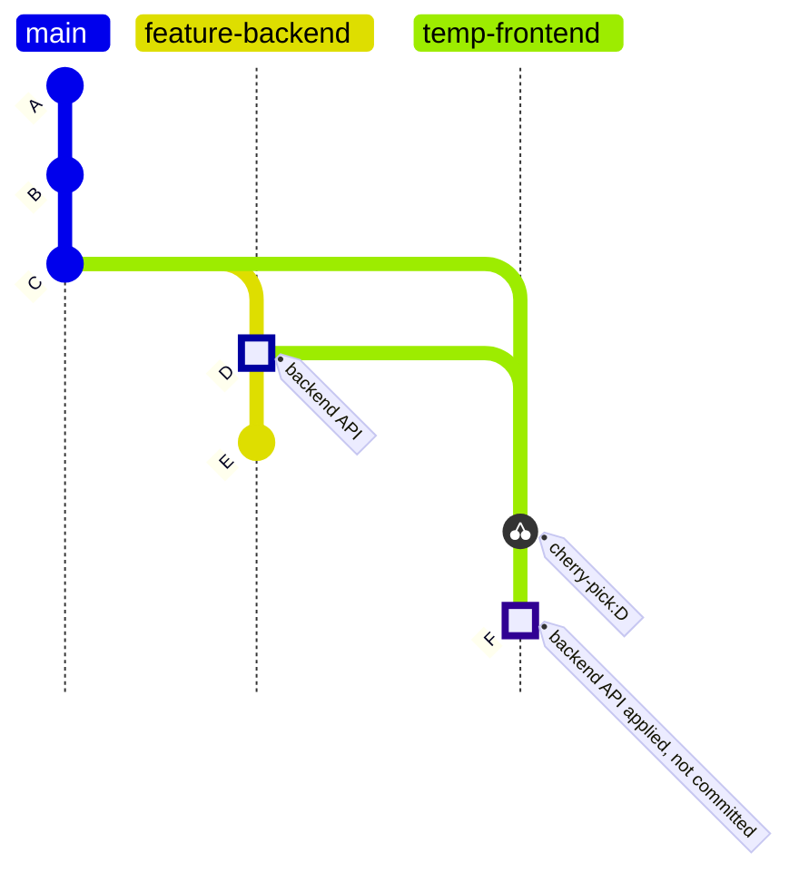
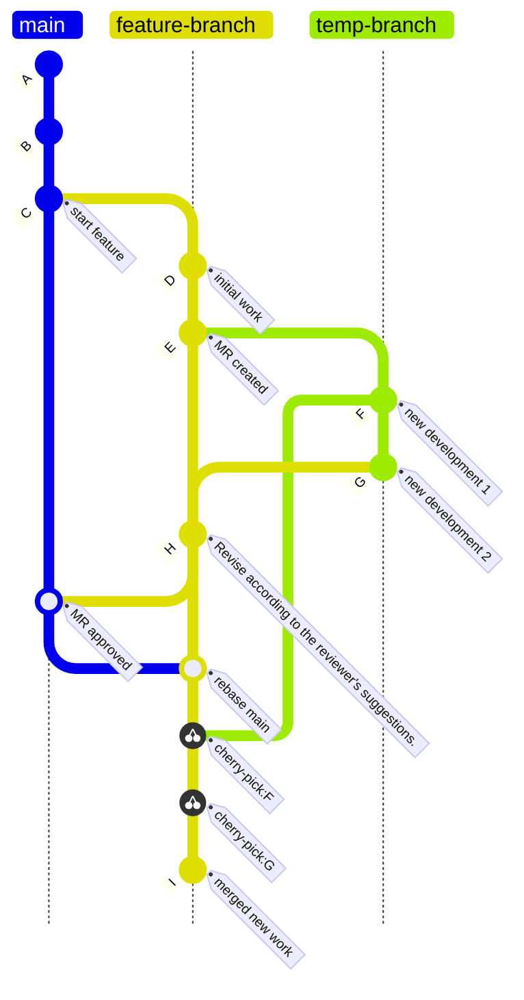

當我一開始學習 Git 的各種指令時，就知道有一個名為 `cherry-pick` 的指令，大概理解它的功能主要是用來將其他分支的 commit 拿來使用。然而，在我個人開發的過程中，其實很少遇到需要使用 cherry-pick 的場景。直到最近，在工作中遇到了幾個特定場景，我才真正發現了 **git cherry-pick** 的妙用之處。這篇文章將介紹 **git cherry-pick** 的基本概念、實際應用方法，以及在多人協作中的最佳實踐，能夠幫助開發者在團隊協作的過程中更靈活地管理分支變更，提升工作效率。


## **git cherry-pick 基本概念**

### **cherry-pick 功能**

在使用 Git 進行版本控制的過程中，有時候我們需要將別的分支上的特定變更拿到當前工作的分支上來用，但又不想拿到整個分支的變更。這時候，**`git cherry-pick`** 就派上用場了。**`cherry-pick`** 是 Git 中一個很實用的功能，它可以讓我們將某個分支上的特定 commit 複製到當前的分支上，而不會影響到那個分支的 commit 記錄。

### **基本用法**

**git cherry-pick** 的基本使用方法包括以下幾種：

1. **撿取單個 Commit 過來合併**
    
    要將某個特定 commit 從一個分支撿取並合併到當前分支，可以使用以下命令：
    
    ```bash
    git cherry-pick <commit-hash>
    ```
    
    例如，假設我們在 **feature-branch** 上有一個 commit **a1b2c3d**，我們希望將這個 commit 合併到 **main** 分支上：
    
    ```bash
    git checkout main
    git cherry-pick a1b2c3d
    ```
    
    ```mermaid
    gitGraph TB:
       commit id: "A"
       commit id: "B"
       commit id: "C"
       branch feature-branch
       checkout feature-branch
       commit id: "D" tag: "a1b2c3d" type: HIGHLIGHT
       commit id: "E"
       checkout main
       cherry-pick id: "D"
       commit id: "F" tag: "merge from D"
       commit id: "G"
    
    ```
    
2. **撿取多個 Commit 過來合併**
    
    也可以一次撿取多個 commit，方法是指定一個 commit 範圍：
    
    ```bash
    git cherry-pick <start-commit-hash>^..<end-commit-hash>
    ```
    
    例如，要將從 **a1b2c3d** 到 **e4f5g6h** 之間的所有 commit 合併到當前分支：
    
    ```bash
    git cherry-pick a1b2c3d^..e4f5g6h
    ```
    
    ```mermaid
    gitGraph TB:
       commit id: "A"
       commit id: "B"
       commit id: "C"
       branch feature-branch
       checkout feature-branch
       commit id: "D" tag: "a1b2c3d" type: HIGHLIGHT
       commit id: "E" type: HIGHLIGHT
       commit id: "F" tag: "e4f5g6h" type: HIGHLIGHT
       checkout main
       cherry-pick id: "D"
       cherry-pick id: "E"
       cherry-pick id: "F"
       commit id: "G" tag: "merge from D,E,F"
    
    ```
    
3. **撿取後先不合併**
    
    有時候可能也會想要撿取 commit，但先不合併，這時可以使用 `--no-commit` 選項：
    
    ```bash
    git cherry-pick --no-commit <commit-hash>
    ```
    
    ```bash
    git cherry-pick --no-commit a1b2c3d
    ```
    
    ```mermaid
    gitGraph TB:
       commit id: "A"
       commit id: "B"
       commit id: "C"
       branch feature-branch
       checkout feature-branch
       commit id: "D" tag: "a1b2c3d" type: HIGHLIGHT
       commit id: "E"
       checkout main
       cherry-pick id: "D"
       commit id: "F" tag: "change applied, not committed" type: HIGHLIGHT
    
    ```
    
    這樣，變更會被應用到工作區，但不會立即生成一個新的 commit，讓我們有機會在合併前進行修改。
    

### **衝突處理**

在使用 **git cherry-pick** 的過程中，如果發生衝突，Git 會提示我們手動解決衝突。衝突解決後，需要完成 **cherry-pick** 操作。

- **解決衝突後繼續 cherry-pick**

    解決衝突後，告訴 Git 已經解決並繼續 **cherry-pick**：

    ```bash
    git add <resolved-files>
    git cherry-pick --continue
    ```

- **放棄 cherry-pick**

    如果不想繼續 **cherry-pick**，可以使用以下命令放棄操作：

    ```bash
    git cherry-pick --abort
    ```

## **多人協作時常見的使用場景**

### **情境1：臨時跟同事借調特定程式碼**

在軟體開發的日常工作流程中，前端和後端的開發經常需要同步進行。假設某天早上我們從 PM 那收到了一個新的功能需求，我被指派負責前端部分，同事負責後端部分。

過了一個上午，同事已經完成並在自己的本地端 commit 了 API 的功能，但因為還有其他功能還沒開發完成，因此尚未發送 Merge Request（MR）。而我也完成其他進度，準備要來開發前端資料流相關的功能。此時，我需要使用這段還沒被 merge 進主分支的後端 API 程式碼，好讓我能確認前端資料流相關的邏輯是否能順利運作。

為了不耽誤進度，我可以請同事將他目前還在開發的分支先推送到 GitLab，讓我可以在本地端 pull 這個分支。接著，我可以使用 `cherry-pick` 配合 `--no-commit` 選項，將後端同事剛寫好的 API 程式碼應用到我的本地開發分支，但不生成新的 commit。等到前端功能完成，我可以捨棄這些借調過來的後端程式碼，確保我的 commit 記錄沒有混雜到借調過來的後端程式碼，以維持 commit 紀錄的整潔。

這樣，我就能在後端功能尚未合併到主幹之前，在不另外寫 Mock Server 的情況下，先行開發前端串接 API 的資料流相關功能，同時又不會干擾到後端同事的工作進度，大大提高團隊合作的工作效率。



### **情境2：等待 Code Review 時繼續開發該分支的進度**

在我目前所在的開發團隊中，我們使用 git flow 搭配 Jira 來管理開發流程。每個分支和 MR 都會對應到特定的 Jira 卡片。有時候，一個 MR 只能部分完成對應 Jira 卡片的需求，該分支被合併到主分支後，仍然需要繼續用這個分支來完成其他相關需求。

在這個流程中，常常會遇到 reviewer 因各種原因需要較長時間來審查 MR，而我在這段時間內已經繼續開發了，但因為擔心 reviewer 提出的修改建議，所以不敢直接在本地端的原分支上繼續提交新的 commits。為了解決這個問題，我通常會從與 MR 相同的 commit 點建立一個臨時分支，並在這個臨時分支上繼續開發。

等到 MR 被 Approve 並合併到主分支後，我會回到原分支，先 rebase 主分支，再將臨時分支上的新開發進度 `cherry-pick` 回來，最後刪除臨時分支。這樣，我既可以在等待審查期間繼續開發，又不必擔心在原分支上提交新 commit 後，遇到需要回應 reviewer 的修改建議而導致 commit 記錄變得混亂，或者需要 reset 新開發的 commit 等問題。

