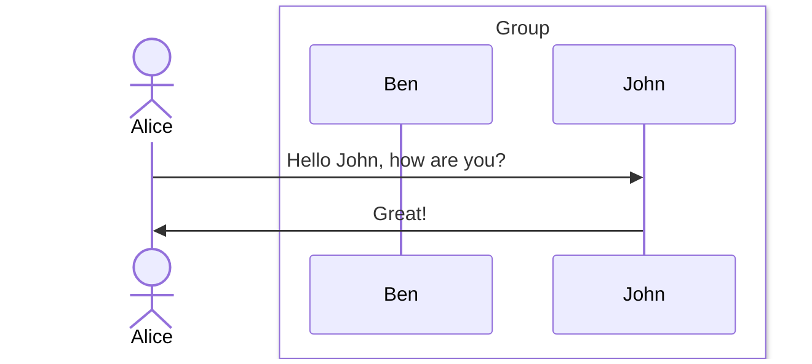
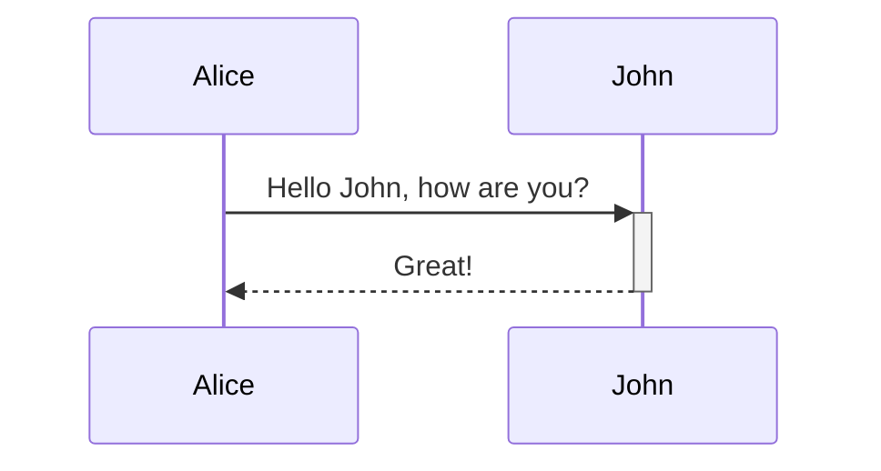
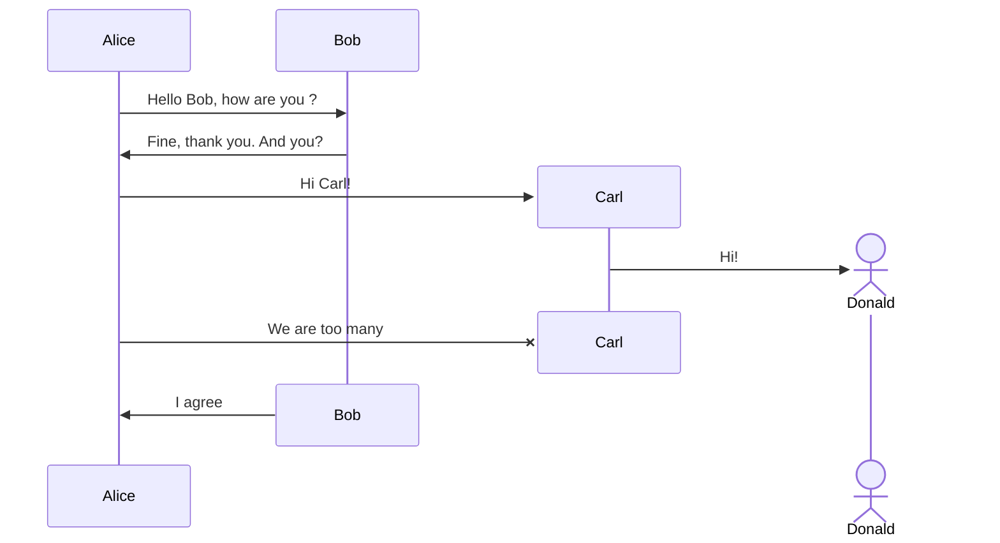
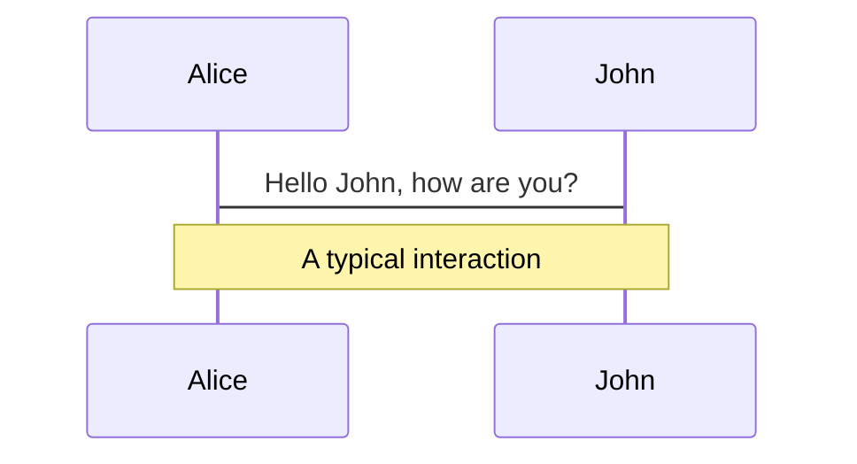
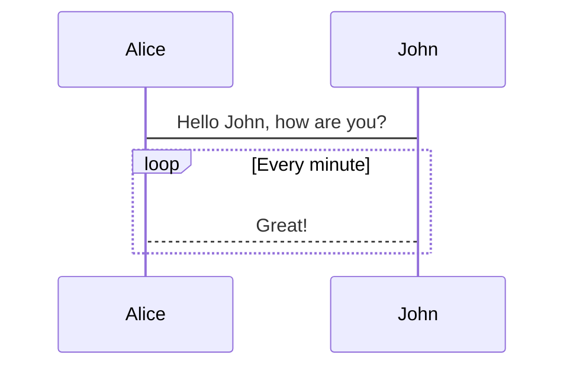
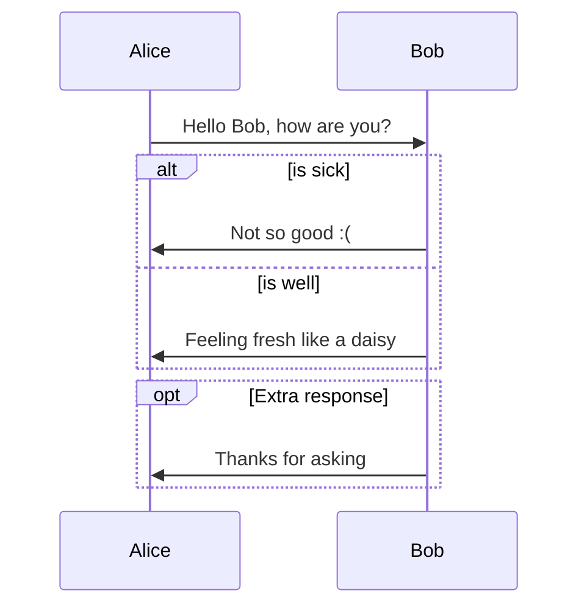
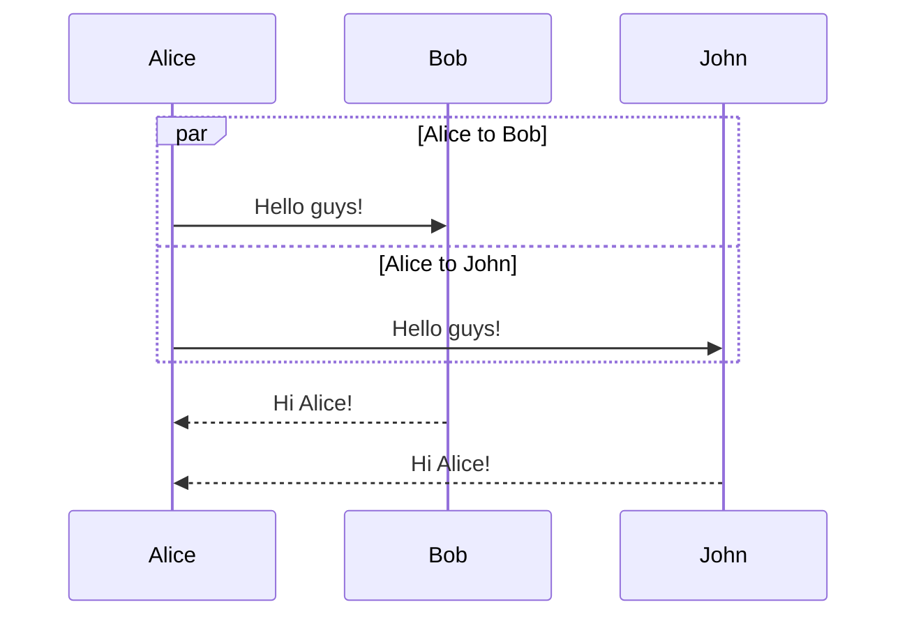
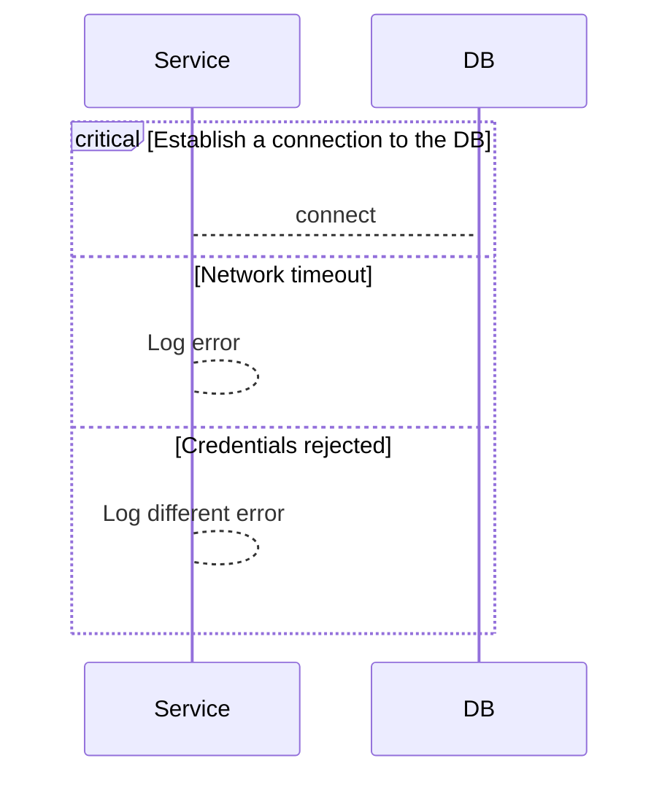
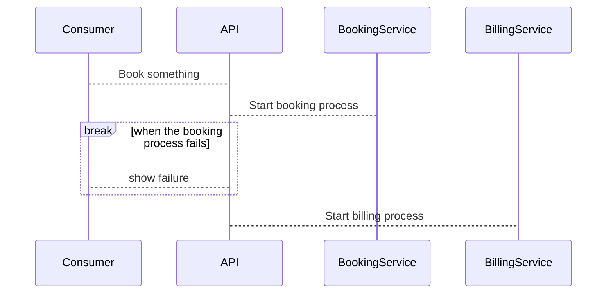
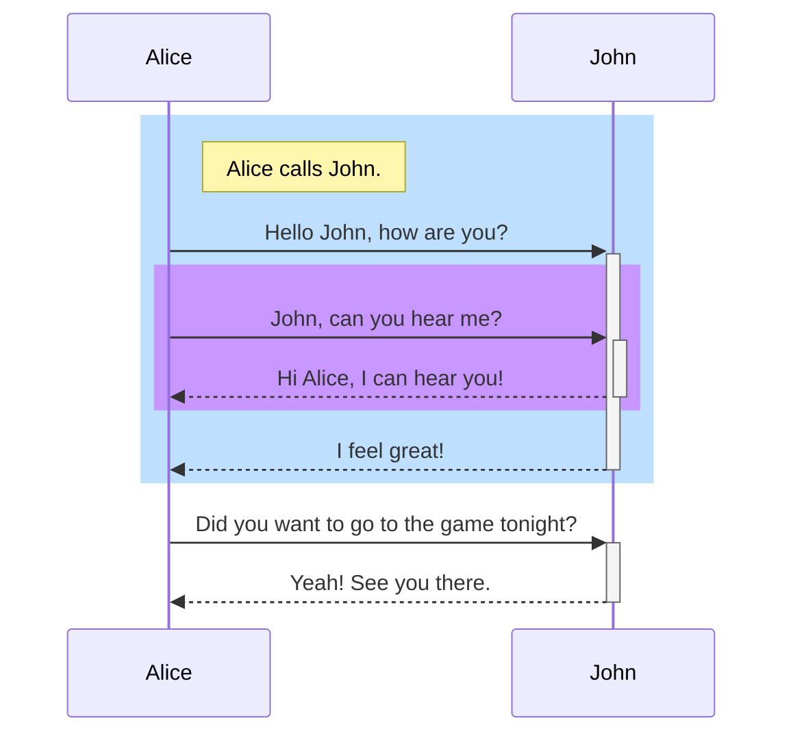

> 本篇筆記的範例來自 **[@Mermaid-Sequence diagrams](https://mermaid.js.org/syntax/sequenceDiagram.html#activations)**
> 

**時序圖(Sequence Diagram)** 通常用於描述實體間的交互過程和消息傳遞順序。它適合用來描繪系統內部組件、物件或角色之間的溝通流程，特別是在設計軟體架構、分析業務流程或理解系統操作。當需要清晰展示系統各部分如何通過消息進行交互，或當需要理解或說明系統的行為邏輯時，繪製時序圖就非常有用。

## **語法 (Syntax)**

- **參與者 (Participants)：** 在時序圖中交互的實體，在圖上顯示為方形文字框。
- **角色 (Actors)：** 系統外部的實體，與系統進行交互的用戶或其他系統，在圖上顯示為一個小人。
- **別名 (Aliases)：** `participants` 或 `actors` 的替代名稱，用於簡化和參照。
- **群組 (Grouping / Box)：** 用於將 `participants` 或 `actors` 分群的垂直方框。

```
sequenceDiagram
    actor A as Alice
    box White Group 
    participant B as Ben
    participant J as John
    end
    A->>J: Hello John, how are you?
    J->>A: Great!
```



## **消息類型 (Message Types)**

| **類型** | **描述**                   | **適用場景**                        |
| -------- | -------------------------- | ----------------------------------- |
| `->`     | **實線**，無箭頭           | 單純的流程或數據傳遞                |
| `-->`    | **虛線**，無箭頭           | 類似 `->`，但可能是次要的訊息       |
| `->>`    | **實線**，有箭頭           | **同步請求**，發送方需要等待回應    |
| `-->>`   | **虛線**，有箭頭           | **異步請求**，發送方不需要等待回應  |
| `<<->>`  | **實線**，雙向箭頭         | 雙向通信，例如 WebSocket 或雙向 API |
| `<<-->>` | **虛線**，雙向箭頭         | 雙向異步通訊，例如同步狀態機制      |
| `-x`     | **實線**，末端有 `x`       | 表示請求或連線終止                  |
| `--x`    | **虛線**，末端有 `x`       | 表示異步請求終止                    |
| `-)`     | **實線**，開放箭頭 (async) | **異步回應**，但不會影響發送者      |
| `--)`    | **虛線**，開放箭頭 (async) | **異步回應**，次要的異步事件        |

## **啟用與停用 (Activations)**

**語法：**

- `activate` / `deactivate`
- 在消息箭頭後加上 `+` 或 `-`

```
sequenceDiagram
    Alice->>+John: Hello John, how are you?
    John-->>-Alice: Great!
```



## **刪除參與者的生命週期 (Destroy Participant)**

當某個參與者 (participant) 在流程中被移除，例如 API 終止或物件被銷毀，可以使用 `destroy` 來標示其結束狀態。
```
sequenceDiagram
    Alice->>Bob: Hello Bob, how are you ?
    Bob->>Alice: Fine, thank you. And you?
    create participant Carl
    Alice->>Carl: Hi Carl!
    create actor D as Donald
    Carl->>D: Hi!
    destroy Carl
    Alice-xCarl: We are too many
    destroy Bob
    Bob->>Alice: I agree
```




## **備註 (Notes)**

**語法：**

- `Note` [ right of | left of | over ] [Actor]: 文字

```
sequenceDiagram
    Alice->John: Hello John, how are you?
    Note over Alice,John: A typical interaction
```



## **迴圈 (Loops)**

- 用來表示重複發生的動作，例如定時任務或持續輪詢。

**語法：**

```
sequenceDiagram
    Alice->John: Hello John, how are you?
    loop Every minute
        John-->Alice: Great!
    end
```



## **條件判斷 (Alt - If-Else)**

- 用來表示條件流程或決策點，相當於程式設計中的 "if-else" 結構。

**語法：**

```
alt Describing text
... statements ...
else
... statements ...
end
```

```
sequenceDiagram
    Alice->>Bob: Hello Bob, how are you?
    alt is sick
        Bob->>Alice: Not so good :(
    else is well
        Bob->>Alice: Feeling fresh like a daisy
    end
    opt Extra response
        Bob->>Alice: Thanks for asking
    end

```



## **並行 (Parallel - 並行處理)**

- 表示多個動作同時發生，例如並行處理請求或多執行緒操作。


**語法：**

```
par [Action 1]
... statements ...
and [Action 2]
... statements ...
and [Action N]
... statements ...
end
```

```
sequenceDiagram
    par Alice to Bob
        Alice->>Bob: Hello guys!
    and Alice to John
        Alice->>John: Hello guys!
    end
    Bob-->>Alice: Hi Alice!
    John-->>Alice: Hi Alice!
```



## **關鍵區塊 (Critical Region)**

- 通常用於表示需要特別注意的操作，如同步控制、事務處理或任何重要的業務邏輯區塊。

**syntax**

```
critical [Action that must be performed]
... statements ...
option [Circumstance A]
... statements ...
option [Circumstance B]
... statements ...
end
```

```
sequenceDiagram
    critical Establish a connection to the DB
        Service-->DB: connect
    option Network timeout
        Service-->Service: Log error
    option Credentials rejected
        Service-->Service: Log different error
    end
```



## **中斷流程 (Break - 終止流程)**

- 用於表示流程種終止

**語法：**

```
break [something happened]
... statements ...
end
```

```
sequenceDiagram
    Consumer-->API: Book something
    API-->BookingService: Start booking process
    break when the booking process fails
        API-->Consumer: show failure
    end
    API-->BillingService: Start billing process
```



## **背景高亮 (Background Highlighting)**

- Sequence Diagram 可讓使用者添加帶顏色的背景方框

**語法：**

```
rect rgb(0, 255, 0)
... content ...
end
```

```
sequenceDiagram
    participant Alice
    participant John

    rect rgb(191, 223, 255)
    note right of Alice: Alice calls John.
    Alice->>+John: Hello John, how are you?
    rect rgb(200, 150, 255)
    Alice->>+John: John, can you hear me?
    John-->>-Alice: Hi Alice, I can hear you!
    end
    John-->>-Alice: I feel great!
    end
    Alice ->>+ John: Did you want to go to the game tonight?
    John -->>- Alice: Yeah! See you there.
```



## **Reference**

- **[Mermaid](https://mermaid.js.org/)**
- **[Sequence diagrams](https://mermaid.js.org/syntax/sequenceDiagram.html#sequence-diagrams)**