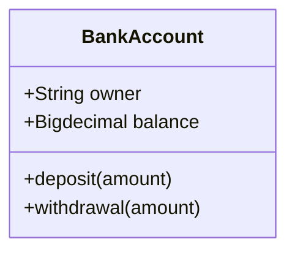
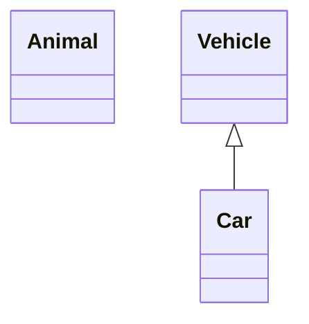
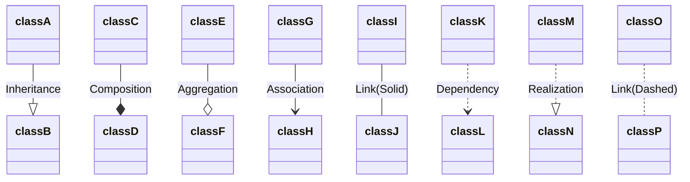
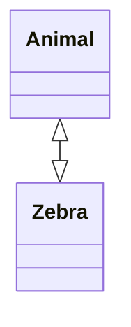
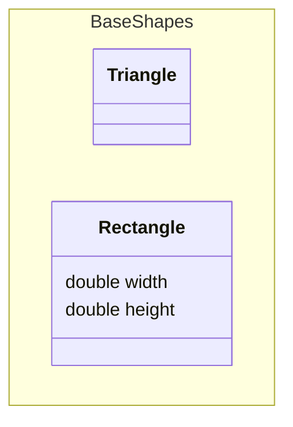
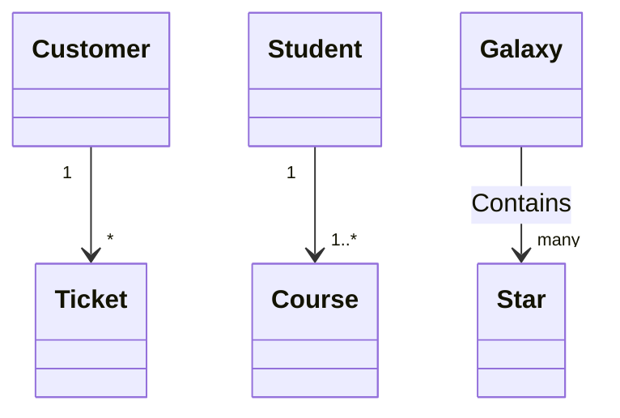

> 本篇筆記的範例來自 [**@Mermaid-Class diagrams**](https://mermaid.js.org/syntax/classDiagram.html)
> 

在軟體工程中，**類別圖（Class Diagram）** 是**統一建模語言（UML）** 中最常用的一種圖表，用於描述系統中的類別及其相互關係。它展示了類別的結構，包括類別的**屬性（Attributes）、方法（Methods），以及類別之間的繼承（Inheritance）、組合（Composition）、聚合（Aggregation）、關聯（Association）** 等關係。類別圖是**物件導向（OOP）** 建模的重要組成部分，既可用於應用程式結構的概念建模，也可用於詳細的資料建模和程式碼轉換。

本文將深入介紹如何使用 Mermaid 來繪製類別圖，詳細解釋各種類別圖元素及其語法，並提供實際範例來展示如何定義類別、屬性、方法以及類別之間的關係，從而提高系統設計的可視化效果和開發效率。

## **Syntax**

### **Class**

在UML中，類別（Class）表示系統中的物件或實體。在類別圖中，每個類別包含三個區域：

1. **類別名稱區域**：包含類別的名稱，名稱以粗體顯示並居中，首字母大寫。這個區域也可能包含描述類別性質的可選註釋文字。
2. **屬性區域**：包含類別的屬性，左對齊並首字母小寫。
3. **方法區域**：包含類別可以執行的操作，左對齊並首字母小寫。

例如：



```md
classDiagram
    class BankAccount {
        +String owner
        +Bigdecimal balance
        +deposit(amount)
        +withdrawal(amount)
    }

```


<br/>


## **Define a class**

- 使用 `class` 關鍵字顯式定義一個類別名城，如 class Animal。
- 定義兩個類別及其關係。例如，`Vehicle <|-- Car` 同時定義了 Car 繼承了 Vehicle 的類別關係。



```md
classDiagram
    class Animal
    Vehicle <|-- Car
```


### **Class labels**

- **Label a class:** 若需為類別提供標籤，可使用如下語法：
    
    ```mermaid
    classDiagram
        class Animal["Animal with a label"]
        class Car["Car with *! symbols"]
        Animal --> Car
    ```

    ```md
    classDiagram
        class Animal["Animal with a label"]
        class Car["Car with *! symbols"]
        Animal --> Car
    ```
    
- **Escape special characters:** 也可以使用**反引號（backticks）** 來轉義標籤中的特殊字符：
    
    ```mermaid
    classDiagram
        class `Animal Class!`
        class `Car Class`
        `Animal Class!` --> `Car Class`
    ```

    ```md
    classDiagram
        class `Animal Class!`
        class `Car Class`
        `Animal Class!` --> `Car Class`
    ```


<br/>


## **Defining Members of a Class**

**UML** 提供了表示類別成員（如屬性和方法）以及它們的附加資訊的機制。

Mermaid 區分屬性和函數/方法的方式是看是否存在**括號（）**
- 有括號的被視為函數/方法
- 沒有括號的被視為屬性。

在 Mermaid 語法中，有兩種方式可以定義類別的成員，無論使用哪種語法來定義成員，輸出結果都是一樣的。這兩種不同的方式如下：

- **冒號 Colon :** 
用冒號 `:` 後跟成員名稱來關聯類別的成員，適合一次定義一個成員。例如：
    
    ```mermaid
    classDiagram
    class BankAccount
    BankAccount : +String owner
    BankAccount : +BigDecimal balance
    BankAccount : +deposit(amount)
    BankAccount : +withdrawal(amount)
    
    ```

    ```md
    classDiagram
    class BankAccount
    BankAccount : +String owner
    BankAccount : +BigDecimal balance
    BankAccount : +deposit(amount)
    BankAccount : +withdrawal(amount)
    
    ```
    
- **大括號 Curly Brackets \{\}**
用大括號 `{}` 來關聯類別的成員，適合一次定義多個成員。例如：
    
    ```mermaid
    classDiagram
    class BankAccount{
        +String owner
        +BigDecimal balance
        +deposit(amount)
        +withdrawal(amount)
    }
    
    ```

    ```md
    classDiagram
    class BankAccount{
        +String owner
        +BigDecimal balance
        +deposit(amount)
        +withdrawal(amount)
    }
    
    ```
    

### **Return Type**

以在方法/函數定義的最後用資料型別結尾。

例如：

    ```mermaid
    classDiagram
    class BankAccount{
        +String owner
        +BigDecimal balance
        +deposit(amount) bool
        +withdrawal(amount) int
    }

    ```

    ```md
    classDiagram
    class BankAccount{
        +String owner
        +BigDecimal balance
        +deposit(amount) bool
        +withdrawal(amount) int
    }

    ```

### **Generic Types**

泛型可以用於定義類別，也可以用於定義類別成員/回傳型別。在 Mermaid 中要表示一個項目是泛型時，將該項目用**波浪號（~）** 括起來。

Mermaid 支援巢狀類型聲明，例如 `List<List<int>>`，但目前**不支援包含逗號的泛型**（如 `List<List<K, V>>`）。

:::caution
當在類別定義中使用泛型時，泛型型別不被視為類別名稱的一部分。也就是說，對於任何需要引用類別名稱的語法，需要刪除定義中被波浪號（~）括起來的部分。舉例來說，引用`class Square~Shape~` 時，應該寫 `Square`，而不是寫 `Square~Shape~`。這也意味著 Mermaid 目前不支援具有相同名稱但不同泛型類型的兩個類別。

:::

    ```mermaid
    classDiagram
    class Square~Shape~{
        int id
        List~int~ position
        setPoints(List~int~ points)
        getPoints() List~int~
    }

    Square : -List~string~ messages
    Square : +setMessages(List~string~ messages)
    Square : +getMessages() List~string~
    Square : +getDistanceMatrix() List~List~int~~

    ```

    ```md
    classDiagram
    class Square~Shape~{
        int id
        List~int~ position
        setPoints(List~int~ points)
        getPoints() List~int~
    }

    Square : -List~string~ messages
    Square : +setMessages(List~string~ messages)
    Square : +getMessages() List~string~
    Square : +getDistanceMatrix() List~List~int~~

    ```

### **Visibility**

為了描述類別成員的可見性（或封裝性），可以在成員名稱之前放置可選的符號：

- `+` Public
- `-` Private
- `#` Protected
- `~` Package/Internal

也可以通過在**方法**定義的末尾新增以下符號來包含其他分類符號，即：在 `()` 或返回型別之後：

- `*` `Abstract` 例如：someAbstractMethod()* 或 someAbstractMethod() int*
- `$`  `Static` 例如：someStaticMethod()\$ 或 someStaticMethod() String\$

或通過在屬性定義的末尾新增以下符號來包含其他分類符號：

- `$`  `Static` 例如：String someField\$


<br/>


## **Defining Relationship**

**Syntax:**

```
[classA][Arrow][ClassB]
```

UML 定義了八種目前支援的類別關係類型：

| 箭頭種類                          | 關係類型         | 圖示             |
| --------------------------------- | ---------------- | ---------------- |
| `父類別 <\|— 子類別`              | 繼承 Inheritance | 空心箭頭實線     |
| `組成者 *— 部分`                  | 組合 Composition | 實心菱形箭頭實線 |
| `整體 o-- 部分`                   | 聚合 Aggregation | 空心菱形箭頭實線 |
| `發起關聯的一方 --> 被關聯的一方` | 關聯 Association | 實心箭頭實線     |
| `起點角色 -- 終點角色`            | Link (Solid)     | 實線連接         |
| `依賴者 ..> 被依賴者`             | 依賴 Dependency  | 實心箭頭虛線     |
| `實現類別 ..\|> 介面`             | 實作 Realization | 實心箭頭虛線     |
| `起點角色 .. 終點角色`            | Link (Dashed)    | 虛線連接         |

- **繼承 Inheritance:**
    
    物件 A 繼承於物件 B ，且物件 Ａ 可以被當作物件 B 使用，但物件 Ａ 能夠基於物件Ｂ的實作跟介面加以擴展。
    
    ```mermaid
    classDiagram
    class B
    class A
    B <|-- A
    
    ```

    ```md
    classDiagram
    class B
    class A
    B <|-- A
    
    ```
    
- **組合 Composition（ contains-a 關係 ）:**
    
    組合表示**強擁有關係**，其中一個物件A 包含另一個物件B ，被包含的物件B 不能單獨存在，而且物件 B 的生命週期受物件 Ａ 所影響。
    
    ```mermaid
    classDiagram
    class A
    class B
    A *-- B
    
    ```

    ```md
    classDiagram
    class A
    class B
    A *-- B
    
    ```
    
- **聚合 Aggregation（ has-a 關係 ）:**
    
    聚合表示**弱擁有關係**，其中一個物件A 包含另一個物件B ，但被包含的物件B 可以單獨存在，並且物件Ｂ 的生命週期並不受物件Ａ 所控制。
    
    ```mermaid
    classDiagram
    class A
    class B
    A o-- B
    ```

    ```md
    classDiagram
    class A
    class B
    A o-- B
    ```
    
- **關聯 Association:**
    
    關聯表示類別之間的一般聯繫，這種聯繫通常表示一種業務邏輯或行為上的關係。物件A 關聯於物件B ，表示物件A 會受到物件B 的改動所影響。
    
    ```mermaid
    classDiagram
    class A
    class B
    A --> B
    
    ```

    ```md
    classDiagram
    class A
    class B
    A --> B
    
    ```
    
- **Link (Solid):**
    
    實線連接通常用於表示沒有特定含義的一般連接。
    
    ```mermaid
    classDiagram
    class A
    class B
    A -- B
    ```

    ```md
    classDiagram
    class A
    class B
    A -- B
    ```
    
- **依賴 Dependency:**
    
    依賴關係表示一個物件A 依賴於另一個物件B ，通常表示物件A 使用了物件B 的功能。物件Ａ 會受到物件Ｂ 的改動所影響。
    
    ```mermaid
    classDiagram
    class A
    class B
    A ..> B
    
    ```

    ```md
    classDiagram
    class A
    class B
    A ..> B
    
    ```
    
- **實作 Realization:**
    
    實作表示一個物件A 實現了某個介面B 的所有成員，且物件Ａ 可以被當作介面B 使用。
    
    ```mermaid
    classDiagram
    interface B
    class A
    A ..|> B
    
    ```

    ```md
    classDiagram
    interface B
    class A
    A ..|> B
    
    ```
    
- **Link (Dashed):**
    
    虛線連接通常用於表示沒有特定含義的一般連接，但這是一種較弱的關聯。
    
    ```mermaid
    classDiagram
    class A
    class B
    A .. B
    ```

    ```md
    classDiagram
    class A
    class B
    A .. B
    ```


### **Labels on Relations**

可以在關係箭頭上添加標籤文字：

**Syntax:**

```
[classA][Arrow][ClassB]:LabelText
```



```md
classDiagram
classA --|> classB : Inheritance
classC --* classD : Composition
classE --o classF : Aggregation
classG --> classH : Association
classI -- classJ : Link(Solid)
classK ..> classL : Dependency
classM ..|> classN : Realization
classO .. classP : Link(Dashed)

```

### **Two-way Relations**

可以表示為雙向關係

**Syntax:**

```
[Relation Type][Link][Relation Type]
```

雙向關係的 **Relation Type** 可以為以下所列的其中一種

| Type  | Description |
| ----- | ----------- |
| `<\|` | Inheritance |
| `*`   | Composition |
| `o`   | Aggregation |
| `>`   | Association |
| `<`   | Association |
| `\|>` | Realization |

**Link** 可以為以下所列的其中一種

| Type | Description |
| ---- | ----------- |
| `--` | Solid       |
| `..` | Dashed      |




<br/>


## **Define Namespace**

**Syntax**

- **Namespace:** 使用 `namespace` 關鍵字來定義一個命名空間，將相關的類別組織在一起。



```md
classDiagram
namespace BaseShapes {
    class Triangle
    class Rectangle {
      double width
      double height
    }
}
```


<br/>


## **Cardinality / Multiplicity on Relations**

在類別圖中，基數(**Cardinality**)或多重性(**Multiplicity**)表示一個類別的實例可以與另一個類別的實例連結的數量。例如，每家公司會有一個或多個員工（不少於一個），每個員工目前只為零或一家公司工作。


| 基數表示 | 描述                    |
| -------- | ----------------------- |
| 1        | 僅一個                  |
| 0..1     | 零或一個                |
| 1..*     | 一個或多個              |
| *        | 多個                    |
| n        | n 個（其中 n > 1）      |
| 0..n     | 零到 n 個（其中 n > 1） |
| 1..n     | 一到 n 個（其中 n > 1） |

基數可以通過將文本選項放置在引號內 `""` 來輕鬆定義，放置在給定箭頭之前或之後。

**Syntax:**

```
[classA] "cardinality1" [Arrow] "cardinality2" [ClassB]:LabelText
```

**範例:**

- **一對多 (One to Many):** 每個 Customer 可以有多個 Ticket。
- **一對多 (One to Many, 最少一個):** 每個 Student 可以參加一個或多個 Course。
- **多對多 (Many to Many):** 每個 Galaxy 可以包含多顆 Star。



```md
classDiagram
    Customer "1" --> "*" Ticket
    Student "1" --> "1..*" Course
    Galaxy --> "many" Star : Contains
```


<br/>


## **Annotations on Classes**

可以使用標註來提供類別的附加 **metadata**，這可以更清楚地指示其性質。一些常見的標註包括：

- `<<Interface>>` 表示介面類別
- `<<Abstract>>` 表示抽象類別
- `<<Service>>` 表示服務類別
- `<<Enumeration>>` 表示枚舉類別

標註在開頭 `<<` 和結尾 `>>` 內定義。有兩種方法可以將標註添加到類別，無論使用哪種方法，輸出結果都是一樣的：

- **在類別定義後的單獨行中添加標註**
    
    ```mermaid
    classDiagram
    class Shape
    <<interface>> Shape
    Shape : noOfVertices
    Shape : draw()
    ```

    ```md
    classDiagram
    class Shape
    <<interface>> Shape
    Shape : noOfVertices
    Shape : draw()
    ```
    
- **在類別定義的嵌套結構中添加標註**
    
    ```mermaid
    classDiagram
    class Shape{
        <<interface>>
        noOfVertices
        draw()
    }
    class Color{
        <<enumeration>>
        RED
        BLUE
        GREEN
        WHITE
        BLACK
    }
    ```

    ```md
    classDiagram
    class Shape{
        <<interface>>
        noOfVertices
        draw()
    }
    class Color{
        <<enumeration>>
        RED
        BLUE
        GREEN
        WHITE
        BLACK
    }
    ```


<br/>


## **Comments**

在類別圖中可以加入註解，註解需要單獨一行，並且必須以 `%%` （雙百分號）開頭。直到下一個換行符的所有文本都會被視為註解，包括任何類別圖語法。

```md
classDiagram
%% This whole line is a comment
class Shape
<<interface>> Shape
Shape : noOfVertices
Shape : draw()
```


<br/>


## **Setting the Direction of the Diagram**

在類別圖中，你可以使用 `direction` 語句來設置圖表呈現的方向。

**Syntax**

- **Direction:** 使用 `direction` 語句設置圖表的方向。
- **Direction Options**
    
    
    | Direction | 描述     |
    | --------- | -------- |
    | TB        | 自上而下 |
    | BT        | 自下而上 |
    | RL        | 自右而左 |
    | LR        | 自左而右 |
    
    ```mermaid
    classDiagram
    direction RL
    class Student {
      -idCard : IdCard
    }
    class IdCard {
      -id : int
      -name : string
    }
    class Bike {
      -id : int
      -name : string
    }
    Student "1" --o "1" IdCard : carries
    Student "1" --o "1" Bike : rides
    
    ```

    ```md
    classDiagram
    direction RL
    class Student {
      -idCard : IdCard
    }
    class IdCard {
      -id : int
      -name : string
    }
    class Bike {
      -id : int
      -name : string
    }
    Student "1" --o "1" IdCard : carries
    Student "1" --o "1" Bike : rides
    
    ```


<br/>


## **Notes**

在類別圖中可以用以下兩種方法添加註解

- `note "line1\nline2"`
- `note for <CLASS NAME> "line1\nline2"`
    
    ```md
    classDiagram
        note "This is a general note"
        note for MyClass "This is a note for a class"
        class MyClass{
        }
    ```


<br/>


## **Reference**

- [**Mermaid**](https://mermaid.js.org/)
- [**Class diagrams**](https://mermaid.js.org/syntax/classDiagram.html)
- [**UML Diagram 軟工溝通好幫手**](https://medium.com/guy-chien/uml-diagram-%E8%BB%9F%E5%B7%A5%E6%BA%9D%E9%80%9A%E5%A5%BD%E5%B9%AB%E6%89%8B-aede026bf5cf)