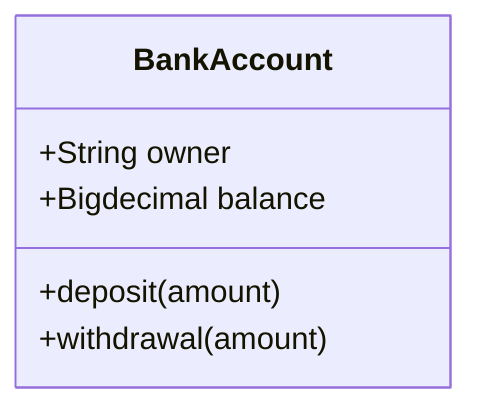
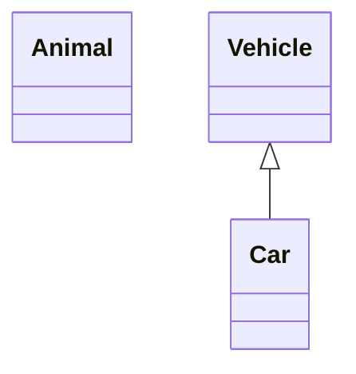
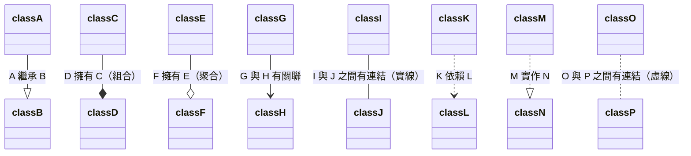
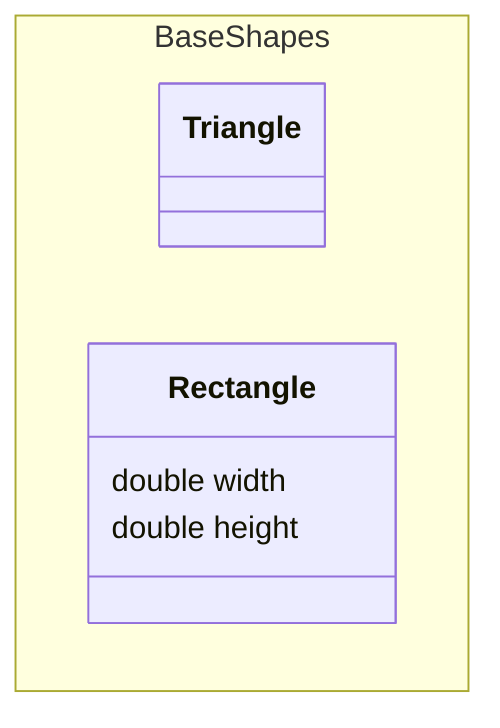
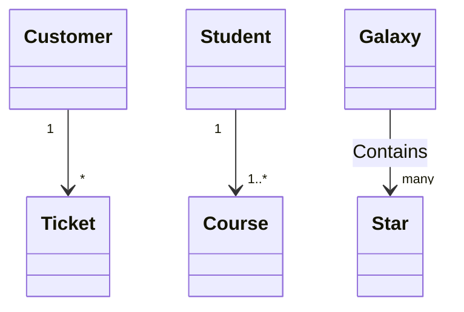

> 本篇筆記的範例來自 [**@Mermaid-Class diagrams**](https://mermaid.js.org/syntax/classDiagram.html)
> 

在軟體工程中，**類別圖（Class Diagram）** 是**統一建模語言（UML）** 中最常用的一種圖表，用於描述系統中的類別及其相互關係。它展示了類別的結構，包括類別的**屬性（Attributes）、方法（Methods），以及類別之間的繼承（Inheritance）、組合（Composition）、聚合（Aggregation）、關聯（Association）** 等關係。類別圖是**物件導向（OOP）** 建模的重要組成部分，既可用於應用程式結構的概念建模，也可用於詳細的資料建模和程式碼轉換。

本文將深入介紹如何使用 Mermaid 來繪製類別圖，詳細解釋各種類別圖元素及其語法，並提供實際範例來展示如何定義類別、屬性、方法以及類別之間的關係，從而提高系統設計的可視化效果和開發效率。

## **語法 (Syntax)**

### **類別 (Class)**

在UML中，類別（Class）表示系統中的物件或實體。在類別圖中，每個類別包含三個區域：

1. **類別名稱區域**：包含類別的名稱，名稱以粗體顯示並居中，首字母大寫。這個區域也可能包含描述類別性質的可選註釋文字。
2. **屬性區域**：包含類別的屬性，左對齊並首字母小寫。
3. **方法區域**：包含類別可以執行的操作，左對齊並首字母小寫。

例如：



```md
classDiagram
    class BankAccount {
        +String owner
        +Bigdecimal balance
        +deposit(amount)
        +withdrawal(amount)
    }
```


<br/>


## **定義類別 (Define a Class)**

- 使用 `class` 關鍵字顯式定義一個類別名城，如 class Animal。
- 定義兩個類別及其關係。例如，`Vehicle <|-- Car` 同時定義了 Car 繼承了 Vehicle 的類別關係。



```md
classDiagram
    class Animal
    Vehicle <|-- Car
```


### **類別標籤 (Class Labels)**

- **為類別添加標籤：** 若需為類別提供標籤，可使用如下語法：
    
    ```mermaid
    classDiagram
        class Animal["Animal with a label"]
        class Car["Car with *! symbols"]
        Animal --> Car
    ```

    ```md
    classDiagram
        class Animal["Animal with a label"]
        class Car["Car with *! symbols"]
        Animal --> Car
    ```
    
- **轉義特殊字元：** 也可以使用**反引號（backticks）** 來轉義標籤中的特殊字符：
    
    ```mermaid
    classDiagram
        class `Animal Class!`
        class `Car Class`
        `Animal Class!` --> `Car Class`
    ```

    ```md
    classDiagram
        class `Animal Class!`
        class `Car Class`
        `Animal Class!` --> `Car Class`
    ```


<br/>


## **定義類別的成員 (Defining Members of a Class)**

**UML** 提供了表示類別成員（如屬性和方法）以及它們的附加資訊的機制。

Mermaid 區分屬性和函數/方法的方式是看是否存在**括號（）**
- 有括號的被視為函數/方法
- 沒有括號的被視為屬性。

在 Mermaid 語法中，有兩種方式可以定義類別的成員，無論使用哪種語法來定義成員，輸出結果都是一樣的。這兩種不同的方式如下：

- **使用冒號 `:` 定義成員** 
用冒號 `:` 後跟成員名稱來關聯類別的成員，適合一次定義一個成員。例如：
    
    ```mermaid
    classDiagram
    class BankAccount
    BankAccount : +String owner
    BankAccount : +BigDecimal balance
    BankAccount : +deposit(amount)
    BankAccount : +withdrawal(amount)    
    ```

    ```md
    classDiagram
    class BankAccount
    BankAccount : +String owner
    BankAccount : +BigDecimal balance
    BankAccount : +deposit(amount)
    BankAccount : +withdrawal(amount)    
    ```
    
- **使用大括號 `{}` 定義成員**
用大括號 `{}` 來關聯類別的成員，適合一次定義多個成員。例如：
    
    ```mermaid
    classDiagram
    class BankAccount{
        +String owner
        +BigDecimal balance
        +deposit(amount)
        +withdrawal(amount)
    }
    
    ```

    ```md
    classDiagram
    class BankAccount{
        +String owner
        +BigDecimal balance
        +deposit(amount)
        +withdrawal(amount)
    }    
    ```
    

### **回傳型別 (Return Type)**

可在方法後面添加回傳型別，例如 `+withdrawal(amount) int`。

例如：

    ```mermaid
    classDiagram
    class BankAccount{
        +String owner
        +BigDecimal balance
        +deposit(amount) bool
        +withdrawal(amount) int
    }

    ```

    ```md
    classDiagram
    class BankAccount{
        +String owner
        +BigDecimal balance
        +deposit(amount) bool
        +withdrawal(amount) int
    }
    ```

### **泛型 (Generic Types)**

泛型可以用於定義類別，也可以用於定義類別成員/回傳型別。在 Mermaid 中要表示一個項目是泛型時，將該項目用**波浪號（~）** 括起來。

Mermaid 支援巢狀類型聲明，例如 `List<List<int>>`，但目前**不支援包含逗號的泛型**（如 `List<List<K, V>>`）。

:::caution
當在類別定義中使用泛型時，泛型型別不被視為類別名稱的一部分。也就是說，對於任何需要引用類別名稱的語法，需要刪除定義中被波浪號（~）括起來的部分。舉例來說，引用`class Square~Shape~` 時，應該寫 `Square`，而不是寫 `Square~Shape~`。這也意味著 Mermaid 目前不支援具有相同名稱但不同泛型類型的兩個類別。

:::

    ```mermaid
    classDiagram
    class Square~Shape~{
        int id
        List~int~ position
        setPoints(List~int~ points)
        getPoints() List~int~
    }

    Square : -List~string~ messages
    Square : +setMessages(List~string~ messages)
    Square : +getMessages() List~string~
    Square : +getDistanceMatrix() List~List~int~~

    ```

    ```md
    classDiagram
    class Square~Shape~{
        int id
        List~int~ position
        setPoints(List~int~ points)
        getPoints() List~int~
    }

    Square : -List~string~ messages
    Square : +setMessages(List~string~ messages)
    Square : +getMessages() List~string~
    Square : +getDistanceMatrix() List~List~int~~
    ```

### **可見性 (Visibility - 封裝性)**

為了描述類別成員的可見性（或封裝性），可以在成員名稱之前放置可選的符號：

| 符號 | 可見性描述                  |
| ---- | --------------------------- |
| `+`  | Public (公開)               |
| `-`  | Private (私有)              |
| `#`  | Protected (受保護)          |
| `~`  | Package/Internal (內部可見) |

在 Mermaid 的類別圖中，可以使用額外的修飾符來標示方法或屬性的特性，例如 **抽象方法 (Abstract)** 和 **靜態方法 (Static)**。

**方法 (Methods) 的修飾符**

可以在 **方法名稱後** 或 **回傳型別後** 添加修飾符來標示該方法的性質：

| **修飾符** | **描述**                       | **語法範例**                                           |
| ---------- | ------------------------------ | ------------------------------------------------------ |
| `*`        | **抽象方法 (Abstract Method)** | `someAbstractMethod()*` 或 `someAbstractMethod() int*` |
| `$`        | **靜態方法 (Static Method)**   | `someStaticMethod()$` 或 `someStaticMethod() String$`  |

---

**屬性 (Fields) 的修飾符**

可以在 **屬性名稱的最後** 添加 `$` 來表示該屬性為 **靜態屬性 (Static Field)**：

| **修飾符** | **描述**                    | **語法範例**        |
| ---------- | --------------------------- | ------------------- |
| `$`        | **靜態屬性 (Static Field)** | `String someField$` |


<br/>


## **定義類別關係 (Defining Relationships)**

**語法：**

```
[ClassA][Arrow][ClassB]
```

UML 定義了八種目前支援的類別關係類型：

| 箭頭種類                          | 關係類型         | 圖示             |
| --------------------------------- | ---------------- | ---------------- |
| `父類別 <\|— 子類別`              | 繼承 Inheritance | 空心箭頭實線     |
| `組成者 *— 部分`                  | 組合 Composition | 實心菱形箭頭實線 |
| `整體 o-- 部分`                   | 聚合 Aggregation | 空心菱形箭頭實線 |
| `發起關聯的一方 --> 被關聯的一方` | 關聯 Association | 實心箭頭實線     |
| `起點角色 -- 終點角色`            | Link (Solid)     | 實線連接         |
| `依賴者 ..> 被依賴者`             | 依賴 Dependency  | 實心箭頭虛線     |
| `實現類別 ..\|> 介面`             | 實作 Realization | 實心箭頭虛線     |
| `起點角色 .. 終點角色`            | Link (Dashed)    | 虛線連接         |

### **繼承 Inheritance**

- **符號**：`A <|-- B`
- **箭頭方向**：箭頭指向 **父類別（Superclass）**，開口在 **子類別（Subclass）** 這一側。
- **說明**：B **繼承** A，表示 B 是 A 的一種（B is-a A）。
- **例子**：
  - `Dog <|-- Animal`（狗是動物）
  - `Car <|-- Vehicle`（車是交通工具）
  
    ```mermaid
    classDiagram
        Animal <|-- Dog
        Vehicle <|-- Car
    ```

    ```md
    classDiagram
        Animal <|-- Dog
        Vehicle <|-- Car
    ```

### **組合 Composition**

- **符號**：`A *-- B`
- **箭頭方向**：**實心菱形** 在 **整體（Whole）** 一側，指向 **部分（Part）**。
- **說明**：A **擁有** B，並且 B **無法獨立存在**，如果 A 消失，B 也會消失（強關聯）。
- **例子**：
  - `House *-- Room`（房子有房間，房子沒了房間也會消失）
  - `Car *-- Engine`（車有引擎，車子沒了引擎就不能運作）

    ```mermaid
    classDiagram
        House *-- Room
        Car *-- Engine
    ```

    ```md
    classDiagram
        House *-- Room
        Car *-- Engine
    ```

### **聚合 Aggregation**

- **符號**：`A o-- B`
- **箭頭方向**：**空心菱形** 在 **整體（Whole）** 一側，指向 **部分（Part）**。
- **說明**：A **擁有** B，但 B **可以獨立存在**，即使 A 消失，B 仍然可以存在（弱關聯）。
- **例子**：
  - `Team o-- Player`（一個球隊由多個球員組成，但球員可以換隊）
  - `Library o-- Book`（圖書館擁有書，但書可以被別的圖書館擁有）

    ```mermaid
    classDiagram
        Team o-- Player
        Library o-- Book
    ```

    ```md
    classDiagram
        Team o-- Player
        Library o-- Book
    ```

### **關聯 Association**

- **符號**：`A --> B`
- **箭頭方向**：箭頭指向 **相關的類別**。
- **說明**：A 和 B **有關聯**，但關聯的強度沒有組合或聚合那麼強，彼此可以獨立存在。
- **例子**：
  - `Student --> Course`（學生選課，課程跟學生是相關的，但學生退選後課程還是存在）
  - `Doctor --> Patient`（醫生和病人有醫療關係，但病人換醫生後，兩者仍可獨立存在）

    ```mermaid
    classDiagram
        Student --> Course
        Doctor --> Patient
    ```

    ```md
    classDiagram
        Student --> Course
        Doctor --> Patient
    ```

### **連結 Link - Solid**

- **符號**：`A -- B`
- **箭頭方向**：雙方都有關係，但沒有特定方向性。
- **說明**：A 和 B **有某種關聯**，但通常沒有明確的方向，例如朋友關係或雙向互動的物件。
- **例子**：
  - `Friend -- Friend`（朋友彼此有關係）
  - `City -- Road`（城市與道路有關，但沒有明顯的方向）

    ```mermaid
    classDiagram
        Friend -- Friend
        City -- Road
    ```

    ```md
    classDiagram
        Friend -- Friend
        City -- Road
    ```

### **依賴 Dependency**

- **符號**：`A ..> B`
- **箭頭方向**：箭頭指向 **被依賴的類別**。
- **說明**：A **依賴** B，意味著 A 使用 B，但這種關係**是暫時的**，A 只是「用到」B，而不是「擁有」B。
- **例子**：
  - `Car ..> Fuel`（車需要燃料，但燃料不屬於車）
  - `Printer ..> Ink`（印表機需要墨水，但墨水用完可以換新的）

    ```mermaid
    classDiagram
        Car ..> Fuel
        Printer ..> Ink
    ```

    ```md
    classDiagram
        Car ..> Fuel
        Printer ..> Ink
    ```

### **實作 Realization**

- **符號**：`A ..|> B`
- **箭頭方向**：箭頭指向 **被實作的介面（Interface）**。
- **說明**：A **實作（implements）** B，這通常用在「介面（interface）」和「實作類別（concrete class）」之間的關係。
- **例子**：
  - `Bird ..|> Flyable`（鳥實作飛行介面）
  - `Car ..|> Drivable`（車子實作可駕駛介面）

    ```mermaid
    classDiagram
        Flyable <|.. Bird
        Drivable <|.. Car
    ```

    ```md
    classDiagram
        Flyable <|.. Bird
        Drivable <|.. Car
    ```

### **虛線連結Link - Dashed**

- **符號**：`A .. B`
- **箭頭方向**：虛線沒有方向性，表示兩者之間有某種關係，但並不嚴格。
- **說明**：這通常用來表示某種**鬆散的關聯**，例如某個類別的說明或概念性的關係，而不一定是物件間的直接聯繫。
- **例子**：
  - `Movie .. Director`（電影和導演之間有某種關係，但電影的存在不一定要有特定的導演）
  - `Student .. Scholarship`（學生和獎學金有關，但學生不一定需要獲得獎學金）

    ```mermaid
    classDiagram
        Movie .. Director
        Student .. Scholarship
    ```

    ```md
    classDiagram
        Movie .. Director
        Student .. Scholarship
    ```


<br/>


## **類別關係的標籤 (Labels on Relations)**

可以在關係箭頭上添加標籤文字：

**語法：**

```
[classA][Arrow][ClassB]:LabelText
```



```md
classDiagram
classA --|> classB : A 繼承 B
classC --* classD : D 擁有 C（組合）
classE --o classF : F 擁有 E（聚合）
classG --> classH : G 與 H 有關聯
classI -- classJ : I 與 J 之間有連結（實線）
classK ..> classL : K 依賴 L
classM ..|> classN : M 實作 N
classO .. classP : O 與 P 之間有連結（虛線）
```

<br/>


## **命名空間 (Define Namespace)**

**Syntax**

- **Namespace:** 使用 `namespace` 關鍵字來定義一個命名空間，將相關的類別組織在一起。



```md
classDiagram
namespace BaseShapes {
    class Triangle
    class Rectangle {
      double width
      double height
    }
}
```


<br/>


## **關係的基數與多重性 (Cardinality / Multiplicity on Relations)**

在類別圖中，基數(**Cardinality**)或多重性(**Multiplicity**)表示一個類別的實例可以與另一個類別的實例連結的數量。例如，每家公司會有一個或多個員工（不少於一個），每個員工目前只為零或一家公司工作。


| 基數表示 | 描述                    |
| -------- | ----------------------- |
| 1        | 僅一個                  |
| 0..1     | 零或一個                |
| 1..*     | 一個或多個              |
| *        | 多個                    |
| n        | n 個（其中 n > 1）      |
| 0..n     | 零到 n 個（其中 n > 1） |
| 1..n     | 一到 n 個（其中 n > 1） |

基數可以通過將文本選項放置在引號內 `""` 來輕鬆定義，放置在給定箭頭之前或之後。

**語法：**

```
[classA] "cardinality1" [Arrow] "cardinality2" [ClassB]:LabelText
```

**範例:**

- **一對多 (One to Many):** 每個 Customer 可以有多個 Ticket。
- **一對多 (One to Many, 最少一個):** 每個 Student 可以參加一個或多個 Course。
- **多對多 (Many to Many):** 每個 Galaxy 可以包含多顆 Star。



```md
classDiagram
    Customer "1" --> "*" Ticket
    Student "1" --> "1..*" Course
    Galaxy --> "many" Star : Contains
```


<br/>


## **類別的標註 (Annotations on Classes)**

可以使用標註來提供類別的附加 **metadata**，這可以更清楚地指示其性質。一些常見的標註包括：

- `<<Interface>>` 表示介面類別
- `<<Abstract>>` 表示抽象類別
- `<<Service>>` 表示服務類別
- `<<Enumeration>>` 表示枚舉類別

標註在開頭 `<<` 和結尾 `>>` 內定義。有兩種方法可以將標註添加到類別，無論使用哪種方法，輸出結果都是一樣的：

- **在類別定義後的單獨行中添加標註**
    
    ```mermaid
    classDiagram
    class Shape
    <<interface>> Shape
    Shape : noOfVertices
    Shape : draw()
    ```

    ```md
    classDiagram
    class Shape
    <<interface>> Shape
    Shape : noOfVertices
    Shape : draw()
    ```
    
- **在類別定義的嵌套結構中添加標註**
    
    ```mermaid
    classDiagram
    class Shape{
        <<interface>>
        noOfVertices
        draw()
    }
    class Color{
        <<enumeration>>
        RED
        BLUE
        GREEN
        WHITE
        BLACK
    }
    ```

    ```md
    classDiagram
    class Shape{
        <<interface>>
        noOfVertices
        draw()
    }
    class Color{
        <<enumeration>>
        RED
        BLUE
        GREEN
        WHITE
        BLACK
    }
    ```


<br/>


## **註解 (Comments)**

在類別圖中可以加入註解，註解需要單獨一行，並且必須以 `%%` （雙百分號）開頭。直到下一個換行符的所有文本都會被視為註解，包括任何類別圖語法。

```md
classDiagram
%% This whole line is a comment
class Shape
<<interface>> Shape
Shape : noOfVertices
Shape : draw()
```


<br/>


## **設定類別圖的方向 (Setting the Direction of the Diagram)**

在類別圖中，你可以使用 `direction` 語句來設置圖表呈現的方向。

**Syntax**

- **Direction:** 使用 `direction` 語句設置圖表的方向。
- **Direction Options**
    
    
    | Direction | 描述     |
    | --------- | -------- |
    | TB        | 自上而下 |
    | BT        | 自下而上 |
    | RL        | 自右而左 |
    | LR        | 自左而右 |
    
    ```mermaid
    classDiagram
    direction RL
    class Student {
      -idCard : IdCard
    }
    class IdCard {
      -id : int
      -name : string
    }
    class Bike {
      -id : int
      -name : string
    }
    Student "1" --o "1" IdCard : carries
    Student "1" --o "1" Bike : rides
    
    ```

    ```md
    classDiagram
    direction RL
    class Student {
      -idCard : IdCard
    }
    class IdCard {
      -id : int
      -name : string
    }
    class Bike {
      -id : int
      -name : string
    }
    Student "1" --o "1" IdCard : carries
    Student "1" --o "1" Bike : rides
    ```


<br/>


## **備註 (Notes)**

在類別圖中可以用以下兩種方法添加註解

- `note "line1\nline2"`
- `note for <CLASS NAME> "line1\nline2"`
    
    ```md
    classDiagram
        note "This is a general note"
        note for MyClass "This is a note for a class"
        class MyClass{
        }
    ```


<br/>


## **Reference**

- [**Mermaid**](https://mermaid.js.org/)
- [**Class diagrams**](https://mermaid.js.org/syntax/classDiagram.html)
- [**UML Diagram 軟工溝通好幫手**](https://medium.com/guy-chien/uml-diagram-%E8%BB%9F%E5%B7%A5%E6%BA%9D%E9%80%9A%E5%A5%BD%E5%B9%AB%E6%89%8B-aede026bf5cf)