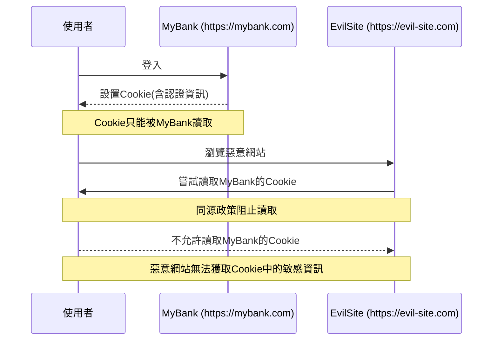
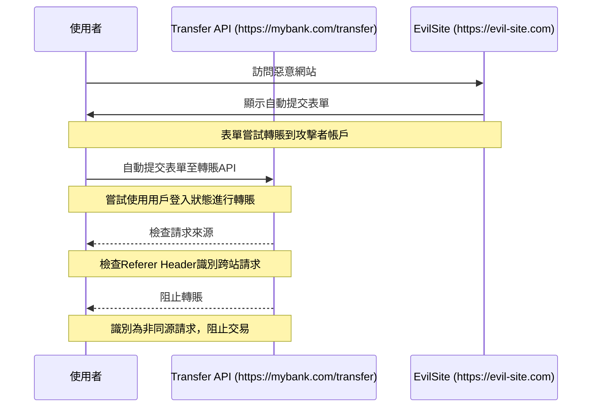
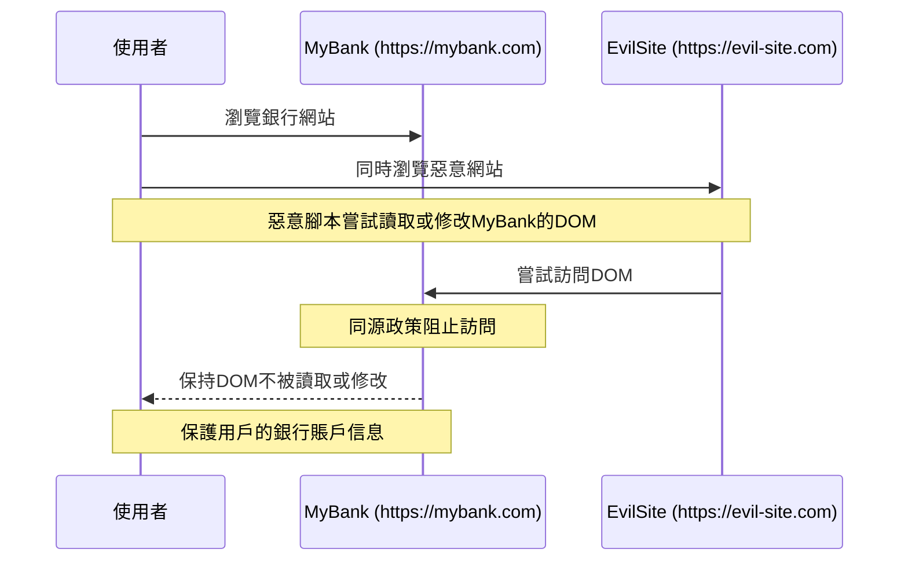
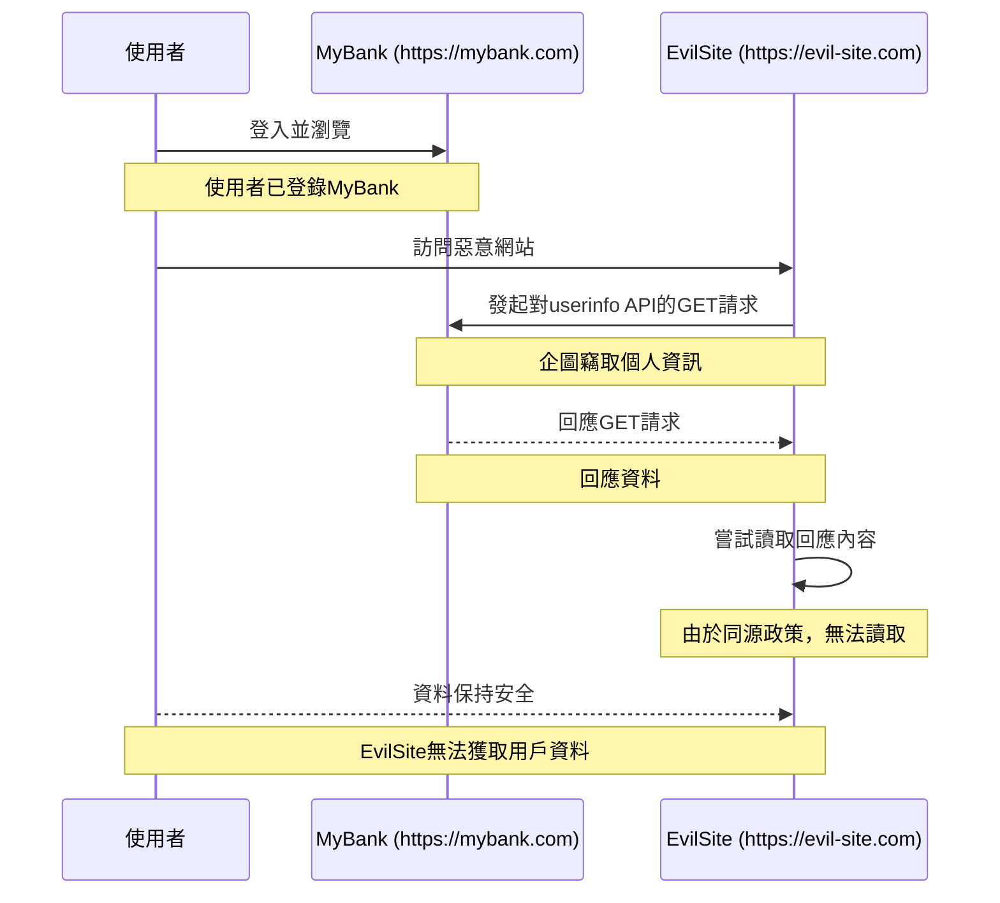
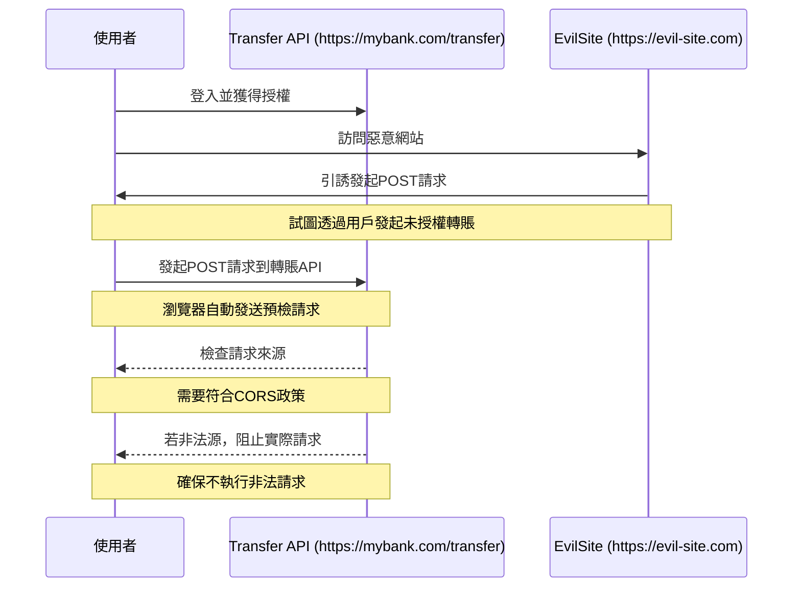
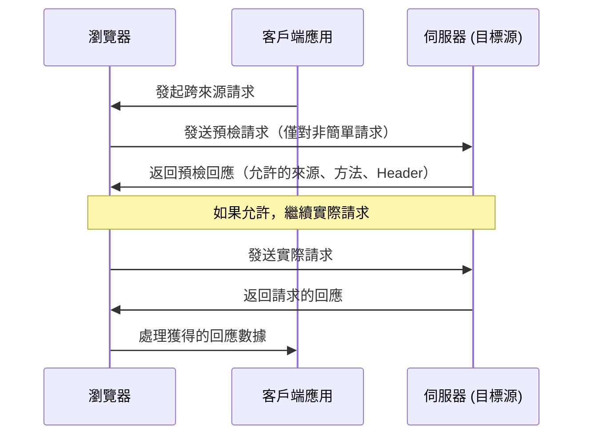

## **同源政策（Same-Origin Policy，SOP）**

**`同源政策（Same-Origin Policy，SOP）`**是一種由**瀏覽器**實施的安全措施，在網頁瀏覽器中,同源政策會限制不同源網站之間的資源訪問。所謂`"同源"`是指網址的 **通訊協定（http 或 https）**、**網域（domain）** 和**通訊埠（port）** 必須完全相同。只有同源的網頁才能互相訪問彼此的資源，如讀取JavaScript物件、操作DOM元素等。

以 `https://www.example.com` 這個網址為例，以下幾個例子說明哪些屬於同源或非同源：

```json
// 同源
1. https://www.example.com/index
2. https://www.example.com/about
// 非同源
1. http://www.example.com   // 協議不同（一個是https，另一個是http)
2. https://sub.example.com  // 的域名不同（一個是www.example.com，另一個是sub.example.com）
3. https://www.example.com:443 // 的端口號不同
```

### **為什麼要有同源政策？它保護了什麼？**

同源政策的核心目的是限制一個網站只能訪問和操作與該網站來源相同的資源，這項政策對於網路用戶的安全至關重要，主要保護範圍包括用戶隱私、敏感資訊、以及網絡應用的整體安全性。接下來讓我們來討論幾個一般用戶可能會遇到的攻擊情境，以及在這些攻擊情境下，同源政策是如何保護用戶的隱私與資訊的。

**範例1: 禁止跨域讀取 Cookies 中的敏感訊息**

- **攻擊情境：**

假設一個用戶登入了銀行網站 `MyBank (https://mybank.com)`，這個網站為用戶設置了一個含有認證信息的 Cookie。如果用戶同時瀏覽另一個惡意網站 `EvilSite (https://evil-site.com)`，這個惡意網站可能會試圖透過用戶的瀏覽器讀取 `MyBank` 設置的 Cookie 來獲取用戶的敏感信息。

- **同源政策的保護：**

由於同源政策的限制，`EvilSite` 無法讀取 `MyBank` 設置的 Cookie，因此用戶的登入憑證和其他敏感資訊得到了保護。



**範例2: 阻止CSRF攻擊**

> `CSRF` 是一種劫持受信任用戶的攻擊方式。攻擊者在受害者當前已登陸的網站上傳送伪造的惡意請求,例如更改用戶的個人信息或密碼、轉帳等高權限操作。
> 
> 
> `CSRF` 之所以能夠成功,是因為伺服器無法區分出惡意請求和合法請求,僅憑瀏覽器自動附加的Cookie 等認證就會被服務器認為是可信請求。
> 
- **攻擊情境：**

舉例來說，攻擊者創建了一個惡意網站 `EvilSite (https://evil-site.com)`，這個網站包含一個自動提交到 `Transfer API (https://mybank.com/transfer)` 的表單。這個表單會在訪問者不知情的情況下，嘗試從其銀行帳戶中轉賬到攻擊者指定的帳戶。用戶訪問 `EvilSite` 時，如果用戶之前沒有從銀行網站登出，表單就會嘗試使用用戶的登入狀態進行轉賬。

- **同源政策的保護：**

但因為銀行網站和惡意網站不是同源，瀏覽器將不會自動發送 `MyBank (https://mybank.com)` 的認證信息（如 **Cookies**）到 `EvilSite`。即使 `EvilSite` 的請求能夠帶上用戶在 `MyBank` 上的 **Cookies**，但銀行網站可以透過檢查請求的 **Referer Header**，來檢驗請求是否來自同源。如果 **Referer** 顯示請求不是來自 `MyBank`（即本案例中為 `EvilSite (https://evil-site.com)`），銀行的伺服器會識別出這是一個跨站請求，並阻止這筆交易。



**範例3: DOM無權訪問限制**

- **攻擊情境：**

假設一名用戶正在瀏覽銀行網站 `MyBank (https://mybank.com)`，同時，用戶打開了一個含有惡意腳本的網頁 `EvilSite (https://evil-site.com)`。該惡意腳本試圖透過 JavaScript 來讀取或修改 `MyBank` 上開啟的頁面的 **DOM** 內容，例如試圖讀取用戶的銀行賬戶信息或自動填充轉賬表單。

- **同源政策的保護：**

由於同源政策的限制，`EvilSite` 的腳本無法直接訪問或修改 `MyBank` 頁面的 **DOM**。這個政策確保了即使用戶的瀏覽器中同時開啟了惡意網站，這些網站也無法直接操作或竊取來自其他來源（如銀行網站）的敏感信息。



**範例4: 保護簡單請求免受資源竊取**

- **攻擊情境：**

假設一個用戶已登錄 `MyBank (https://mybank.com)` 的情況下，若該用戶同時訪問了惡意網站`EvilSite (https://evil-site.com)`，後者企圖對`https://mybank.com/api/userinfo` 發起一個 GET 請求，意圖竊取用戶的個人資訊。由於 GET 請求通常被視為 **"簡單請求"** (不會改變伺服器上的資源)，伺服器端不會檢查該請求。

- **同源政策的保護：**

根據同源政策，即便回應能從`MyBank`返回，`EvilSite` 也無法讀取這個回應的內容，因此，用戶的資料保持安全。



**範例5: 阻止惡意站點發起高風險請求**

- **攻擊情境：**

假設 `MyBank (https://mybank.com)` 允許用戶透過表單提交資料進行資金轉賬。當用戶登錄後，他們可以執行轉賬操作。與此同時，如果用戶不小心訪問了一個惡意網站 `EvilSite (https://evil-site.com)`，這個網站嘗試透過用戶的瀏覽器發起 POST 請求到 `Transfer API (https://mybank.com/transfer)` 來進行未授權的資金轉賬。

- **同源政策的保護：**

瀏覽器會首先發送預檢請求到 `MyBank` 的伺服器端，詢問是否允許來自 `EvilSite` 的跨域請求。如果 `MyBank` 的伺服器端沒有明確返回允許的回應（例如設置了正確的 CORS Header: `Access-Control-Allow-Origin`），則該請求不會執行。這種機制有效防止了惡意站點能夠發起高風險操作，如資金轉移。



### **同源政策下允許的跨域存取行為**

看到這邊可能會感到有點困惑，*網站還是會讀取非同源的圖片吧？會載入公開字體吧？甚至有時候會嵌上 Youtube, codesandbox 等其他站外資源*，難道這些都不會被瀏覽器擋下來嗎？

1. **跨來源寫入通常被允許**

跨來源寫入操作指的是從一個來源向另一個來源發送資訊，但不包括從那個來源獲取回應的能力。這類操作通常被允許，因為它們不會直接洩露用戶數據或其他敏感資訊。例如：

- 提交表單到另一個來源（如支付閘道）
- 發送GET或POST請求到API服務，但不讀取回應內容

1. **跨來源嵌入通常被允許**

嵌入操作涉及將來自其他來源的資源加載到一個頁面上。這些資源雖然在當前文檔的上下文中呈現，但它們遵循嚴格的隔離原則。這類操作通常被允許，因為它們不直接提供跨域腳本之間的互動機會。例如：

- 通過``標籤加載圖片
- 通過`<iframe>`嵌入其他網站的頁面
- 通過`<link>`加載CSS樣式表
- 通過`<script>`加載JavaScript文件

1. **跨來源讀取通常不被允許**
- 通過腳本從其他來源讀取資料（未經CORS策略明確允許）
- 透過腳本訪問嵌入`<iframe>`中的來自不同來源的DOM元素


<br/>


## **跨來源資源共享（Cross-Origin Resource Sharing，CORS）**

從上述的說明我們知道，同源政策只允許來自相同來源的資源交互，這保證了網絡的安全性，但也限制了資源共享的靈活性，畢竟總不會每一個跨網域都是惡意的，一個網站也不太可能擁有所有需要的需要的資源，有時還是必須串接第三方資源。為了解決這一矛盾，**`CORS`** 應運而生。

**`CORS`** 是一種允許伺服器顯式地指示哪些來源有權訪問伺服器上的資源的運作機制。它通過在HTTP 請求和回應中增加特殊的 HTTP Header 來實現控制，當一個網頁嘗試進行跨域 HTTP 請求時，瀏覽器會根據這些 HTTP Header 來決定是否允許該請求成功。通過 CORS 機制，我們就可以安全地進行跨源數據傳輸，克服同源策略的限制。

### **CORS 的運作機制**

**CORS** 的實際運作流程如下：

1. **預檢請求**

當你的網站想要進行一些特殊的跨域請求（比如用 POST 方法發送數據，或者請求包含自定義 Header 這類型的非簡單請求`簡單請求（simple request`）時，瀏覽器會先發送一個`“探路”`的請求，稱為`預檢請求(Preflight Request)`。這個請求用來詢問對方的伺服器是否接受你的實際請求。

1. **服務器評估與回應**

對方的伺服器會回應說：*“嘿，我看到你想要做一些交互，但我需要先檢查一下。嗯，你這是從哪個域名來的？用的什麼方法？帶了哪些 Header？”* 根據這些信息，伺服器決定是否允許這次跨域請求。

1. 實際請求

如果預檢請求得到肯定的回答（伺服器說*“可以，我允許這次請求”*），瀏覽器就會發送實際的請求。這時候，真正的資料交換才會發生。



### **簡單請求（Simple Request）與預檢請求（Preflight Request）**

**`簡單請求（simple request）`** 在CORS（跨來源資源共享）機制中指的是符合某些特定條件的HTTP請求，這些請求不會觸發CORS **`預檢（preflight）機制`**。

> 雖然對於**簡單請求**，瀏覽器會直接發出跨源請求，但是同源政策的限制依然存在，瀏覽器會攔截跨源的請求回應，除非 Header 中正確設定了 CORS 相關的 **Access-Control-Allow-Origin** 等欄位。
> 

根據 @[MDN Web Docs](https://developer.mozilla.org/en-US/docs/Web/HTTP/CORS#simple_requests) 的說明，一個請求需要滿足以下條件才能被視為簡單請求:

1. **HTTP方法**：請求使用的方法必須是以下三種之一：
    - **GET**
    - **HEAD**
    - **POST**
2. **HTTP Header**：請求中只能使用 CORS 安全列出的 Header（Fetch規範中定義），這些頭部包括：
    - **Accept**
    - **Accept-Language**
    - **Content-Language**
    - **Content-Type（只限於三個值：text/plain、multipart/form-data、application/x-www-form-urlencoded）**
3. **Content-Type**：如果請求使用 **`POST`** 方法，則其 **`Content-Type`** 頭部的值僅能是上述三種之一。

### **伺服器設置 HTTP Header**

為了支持 **CORS**，伺服器必須在 HTTP 回應中設置相應的 HTTP Header。下是一個示例：

```
Access-Control-Allow-Origin: https://example.com
Access-Control-Allow-Methods: GET, POST, HEAD
Access-Control-Allow-Headers: X-Custom-Header
Access-Control-Allow-Credentials: true
```

- `Access-Control-Allow-Origin`: 指示允許哪些域名進行跨域請求。在這個例子中，只有來自`https://example.com`的請求被允許。
- `Access-Control-Allow-Methods`: 指示允許的 HTTP 請求方法。在這個例子中，允許`GET`、`POST`和`HEAD`方法的請求。
- `Access-Control-Allow-Headers`: 指示允許的 HTTP 請求 Header。在這個例子中，只有`X-Custom-Header`被允許。
- `Access-Control-Allow-Credentials`: 指示是否允許前端 JavaScript 代碼訪問回應的資源。設置為`true`表示允許。

透過這些 HTTP Header 的設置，伺服器可以精確地控制哪些跨域請求是被允許的，從而在開放必要的資源共享的同時，保護網站的安全。所以當前端開發串接API 時遇到遇到 CORS 問題時，最直接的解方就是後端工程師在伺服器端做 CORS 標頭的設定。


<br/>


## **Reference**

- [**Cross-Origin Resource Sharing (CORS)**](https://developer.mozilla.org/en-US/docs/Web/HTTP/CORS)
- [**CORS 是什麼? 為什麼要有 CORS?**](https://www.explainthis.io/zh-hant/swe/what-is-cors)
- **[【Web】徹底理解同源政策（Same Origin Policy）](https://medium.someone.tw/web-%E5%BE%B9%E5%BA%95%E7%90%86%E8%A7%A3%E5%90%8C%E6%BA%90%E6%94%BF%E7%AD%96-same-origin-policy-3e884e4e8919)**
- **[網站安全🔒 Same Origin Policy 同源政策 ! 一切安全的基礎](https://medium.com/%E7%A8%8B%E5%BC%8F%E7%8C%BF%E5%90%83%E9%A6%99%E8%95%89/same-origin-policy-%E5%90%8C%E6%BA%90%E6%94%BF%E7%AD%96-%E4%B8%80%E5%88%87%E5%AE%89%E5%85%A8%E7%9A%84%E5%9F%BA%E7%A4%8E-36432565a226)**
- **[簡單弄懂同源政策 (Same Origin Policy) 與跨網域 (CORS)](https://medium.com/starbugs/%E5%BC%84%E6%87%82%E5%90%8C%E6%BA%90%E6%94%BF%E7%AD%96-same-origin-policy-%E8%88%87%E8%B7%A8%E7%B6%B2%E5%9F%9F-cors-e2e5c1a53a19)**
- **[[Web] 同源政策與跨來源資源共用（CORS）](https://pjchender.dev/webdev/web-cors/#%E7%B0%A1%E5%96%AE%E8%AB%8B%E6%B1%82%E8%88%87%E9%A0%90%E6%AA%A2%E8%AB%8B%E6%B1%82)**