## **身份驗證 (Authentication) vs. 授權 (Authorization)**

### **什麼是身份驗證(Authentication)？**

**身份驗證(Authentication)** 是指：確認使用者的身份是否真實。這是保護系統安全的第一步，因為只有經過身份驗證的人才能進入系統並執行相關操作。

常見的身份驗證方法有：

- **帳號密碼驗證**：使用者輸入他們的帳號和密碼來證明身份。
- **多因素驗證 (MFA)**：除了帳號和密碼，還需要額外的驗證步驟，比如一次性密碼（OTP）或指紋掃描，來增加安全性。

### **什麼是授權(Authorization)？**

**授權(Authorization)** 則是在身份驗證完成後，決定使用者可以執行哪些操作或存取哪些資源。換句話說，授權的目的是確認某個已驗證的使用者是否有權限存取特定資料或功能。

授權的例子包括：

- **API 存取**：確認使用者是否有權存取特定的 API 端點。
- **管理後台操作**：確認使用者是否能進行如修改系統設定這樣的操作。
- **文件存取**：確認使用者是否有權存取某些特定的文件或資料。

### **身份驗證與授權的差異與關聯**

身份驗證和授權是兩個不同但緊密相關的概念。身份驗證專注於確認使用者的身份，而授權則負責決定這個人可以做什麼。通常，身份驗證必須先完成，然後才進行授權，以確保系統資源只向合法的使用者開放。

舉個例子，假設你是一位進入學校圖書館的學生。首先，你需要出示學生證，這就像是**身份驗證**，用來證明你確實是這所學校的學生。接著，圖書館工作人員會根據你的身份決定你能借哪些書，這部分就相當於**授權**。

> 身份驗證是確認你是誰，而授權是確認你可以做什麼。

在網路應用中，使用者需要先用帳號和密碼通過身份驗證，然後系統根據使用者的角色決定他們能存取哪些功能或資料。這樣的流程有助於保護敏感的資源，例如用戶的個人資料或系統設定，確保只有已被驗證和授權的人能存取它們。


<br/>


## **什麼是 JWT？**

### **JWT 的定義**

**JWT**，全名為 **JSON Web Token**，是一種用於身份驗證和授權的開放標準（[RFC 7519](https://datatracker.ietf.org/doc/html/rfc7519)）。它是一個小型的數據包，用來在不同系統之間安全地傳遞信息。JWT 通常會帶有數位簽名(Digital Signature)，這個簽名可以通過對稱密鑰（例如 HMAC）或非對稱密鑰（例如 RSA 或 ECDSA）來生成，這樣可以確保只有擁有正確密鑰的發送者才能創建有效的簽名，而接收方可以確認數據的來源是可信的，並且確保內容在傳遞過程中沒有被篡改。

:::tip
JWT 的優勢在於它是**無狀態的（Stateless）**與**自包含的（Self-contained）。**

- **無狀態**是指伺服器不會保存有關用戶或客戶端會話的任何信息。
- **自包含**是指 JWT 自身包含了所有必需的信息。

每次客戶端發送請求給伺服器時，都需要攜帶完整的身份驗證信息，這些信息都包含在 JWT 中。伺服器接收到 JWT 後，可以直接解析token來驗證用戶身份，而無需查詢資料庫或其他外部資源。
:::

### **JWT 的應用場景**

JWT 可應用於許多情況，特別是在需要身份驗證和授權的場景中，以下是一些常見的使用情況：

1. **授權 (Authorization)**：JWT 最常見的應用場景之一就是授權。當用戶成功登錄後，每次發送的請求都會帶上 JWT，伺服器通過檢查這個 JWT 來驗證用戶的身份，並決定是否允許訪問特定資源。由於 JWT 小巧且可以跨域使用，特別適合實現**單點登入 (Single Sign-On, SSO)**，讓用戶只需登錄一次就能訪問所有相關的應用系統。
2. **訊息交換 (Information Exchange)**：JWT 也被用來在雙方之間安全地傳遞訊息。由於 JWT 使用數位簽名保護，接收方可以確保訊息來自於合法的發送者，並且未被篡改過。這在需要安全性和完整性的場景中特別有用。
3. **API 認證**：在微服務架構中，不同服務之間常常需要互相溝通並確保請求來自於授權的來源。JWT 在這種情況下可以作為每個請求的憑證，讓每個服務都能輕鬆地驗證用戶身份，從而統一和簡化整個認證流程。


<br/>


## **JWT 的結構解析**

JWT 的結構由三個部分組成：**Header**、**Payload** 和 **Signature**，這些部分用點號 (`.`) 分隔，形成一個格式為 `xxxx.yyyy.zzzz` 的字串。接下來，我們來詳細了解這三個部分的作用：

### **Header**

Header 是 JWT 的第一部分，它包含了 token 的基本信息，主要包括以下兩個欄位：

- **類型 (typ)**：標識 token 的類型，一般為 `"JWT"`。這個欄位可以幫助系統識別這是一個 JWT，從而能進行正確的解碼與處理。
- **簽名演算法 (alg)**：指定簽名所使用的演算法，例如 `HMAC SHA256` 或 `RSA`。這個欄位決定了用於生成和驗證簽名的加密算法，確保 JWT 在傳輸過程中保持完整性和安全性。
    
    :::tip
    
    HMAC SHA256 是一種對稱加密算法，使用相同的密鑰來進行簽名和驗證，適合應用於內部系統。而 RSA 是一種非對稱加密算法，使用私鑰簽名、公鑰驗證，適合於需要公開驗證簽名的應用場景，這樣只有擁有私鑰的一方才能生成簽名，而任何擁有公鑰人都可以做驗證。
    
    :::
    

Header 通常是一個簡單的 JSON 物件，例如：

```json
{
  "typ": "JWT",
  "alg": "HS256"
}
```

這部分會被編碼為 Base64Url 格式，成為 JWT 的第一部分。

### **Payload**

Payload 是 JWT 的第二部分，它包含了需要傳遞的訊息，這些訊息通常被稱為**聲明 (claims)**。聲明是 JWT 的核心部分，承載了用戶信息及其他需要的數據，可以包含用戶 ID 或權限信息，例如用戶的身份、角色或其他需要授權的數據。

聲明分為以下三種類型：

- **註冊的聲明 (Registered Claims)**：這些是一些標準公認的訊息，用於描述 token 的基本信息，例如：
    - `iss`（發行者）：標示誰發行了這個 token。
    - `sub`（主題）：標示 token 的主題（通常是使用者 ID）。
    - `aud`（受眾）：標示 token 的接收者。
    - `exp`（過期時間）：標示 token 的有效期限。
    - `nbf`（生效時間）：標示 token 什麼時候開始有效。
    - `iat`（簽發時間）：標示 token 的簽發時間。
    - `jti`（JWT ID）：標示 token 的唯一 ID，通常用於防止重複發放。
- **公開的聲明 (Public Claims)**：這些是可以自定義的欄位，但需要避免與 [IANA 的 JSON Web Token 註冊表](https://www.iana.org/assignments/jwt/jwt.xhtml) 中定義的 Registered Claims 名稱互相衝突。可以向官方申請定義公開聲明，會進行審核等步驟，實務上在開發上是不太會用這部分的。
- **私有的聲明 (Private Claims)**：這些是應用之間共享的自定義欄位，通常用於應用程式內部的私有數據傳遞，像是 User Account, User Role 等。此外，私有聲明中不應包含敏感信息，因為 JWT 的 Payload 是可解碼的，可能導致敏感數據洩露。

以下是一個典型的 Payload 示例：

```json
{
  "sub": "1234567890",
  "name": "John Doe",
  "admin": true
}
```

Payload 也會被編碼為 Base64Url 格式，成為 JWT 的第二部分。需要注意的是，Payload 中的信息只是經過編碼，而不是加密，這代表它不提供安全保護，任何人都可以讀取它。因此，開發者應避免將敏感信息直接放入 Payload 中，因為這些數據在傳輸過程中可能被攔截。如果需要傳遞敏感數據，應該額外使用加密技術來保護隱私。

### **Signature**

Signature 是 JWT 的第三部分，其作用是保證 token 的完整性，確保數據在傳輸過程中未被篡改。

要生成簽名，我們需要將已編碼的 Header、已編碼的 Payload 以及一個密鑰結合起來，然後使用 Header 中指定的簽名演算法進行加密。例如，使用 HMAC SHA256 的簽名生成過程如下：

```jsx
HMACSHA256(
  base64UrlEncode(header) + "." +
  base64UrlEncode(payload),
  secret
)
```

這個簽名過程會生成一個唯一的哈希值，用於驗證 JWT 的完整性。如果使用的是非對稱加密算法（例如 RSA 或 ECDSA），則需要用私鑰進行簽名，而公鑰則用於驗證簽名的真實性。這樣，只有擁有私鑰的一方可以生成有效的簽名，而驗證的伺服器可以使用公鑰來驗證這個簽名是否正確。

生成的簽名部分也會被編碼為 Base64Url，成為 JWT 的第三部分。簽名的存在使伺服器能夠驗證 JWT 是否由可信的身份驗證服務 (例如身份提供者，Identity Provider) 生成，並確保內容未被篡改。具體來說，當伺服器接收到 JWT 時，它會使用公鑰來驗證簽名是否正確，如果簽名驗證通過，就表示 JWT 沒有被篡改過。這一特性使得 JWT 非常適合用於網路上的身份驗證，尤其是在單點登錄（SSO）這樣的應用場景中，因為它可以讓不同的應用程序（例如各個服務或微服務）共享身份信息，從而提升用戶體驗。


<br/>


## **JWT 的工作原理**

### **JWT 的驗證、授權工作流程**

JWT 的工作流程涉及多個角色和它們各自的責任，包括用戶端、身份驗證伺服器（Identity Provider），以及應用伺服器。以下是 JWT 的驗證和授權的基本工作流程：

```mermaid
stateDiagram-v2
    state 客戶端 {
        [*] --> 未認證
        未認證 --> 發送登錄請求 : 輸入帳號密碼
        發送登錄請求 --> 接收JWT
        接收JWT --> 已認證 : 存儲JWT
        已認證 --> 發送API請求 : 帶有JWT
        已認證 --> 發送刷新請求 : JWT即將過期
        發送刷新請求 --> 接收JWT
        已認證 --> 未認證 : JWT過期且無法刷新
        已認證 --> [*] : 登出
    }

    state 應用伺服器 {
        接收API請求 --> 驗證JWT
        驗證JWT --> 處理請求 : JWT有效
        處理請求 --> 返回資源
        驗證JWT --> 返回401錯誤 : JWT無效或過期
    }

    state 身份驗證伺服器 {
        state 處理登錄請求 {
            接收登錄請求 --> 驗證憑證
            驗證憑證 --> 生成JWT : 驗證成功
            生成JWT --> 返回新JWT
            驗證憑證 --> 返回錯誤 : 驗證失敗
        }

        state 處理刷新請求 {
            接收刷新請求 --> 驗證刷新Token
            驗證刷新Token --> 生成新JWT : 刷新Token有效
            驗證刷新Token --> 返回錯誤 : 刷新Token無效
        }
    }

    客戶端 --> 身份驗證伺服器 : 發送登錄請求
    客戶端 --> 身份驗證伺服器 : 發送刷新請求
    身份驗證伺服器 --> 客戶端 : 返回JWT或錯誤
    客戶端 --> 應用伺服器 : 發送API請求
    應用伺服器 --> 客戶端 : 返回資源或401錯誤
```



### **JWT 的生成與簽發**

當用戶通過身份驗證後，身份驗證伺服器會根據用戶的信息生成一個 JWT，這個 token 包含用戶的身份、權限等聲明，並使用**私鑰**對其簽名，然後將這個 JWT 發送給用戶。這樣，用戶在後續的請求中可以攜帶這個 token，無需每次重新進行身份驗證。

### **用戶如何使用 JWT**

用戶端在後續的每次請求中，都會附上 JWT，以便應用伺服器能夠驗證用戶的身份。通常，JWT 被放在 HTTP Header 的 `Authorization` 欄位中，格式如下：

```
Authorization: Bearer <token>
```

用戶端通常會將 JWT 存儲在本地儲存 (localStorage) 或 Cookie 中。這樣設計可以確保每個請求都攜帶了身份驗證信息，方便應用伺服器對請求進行授權判斷。

### **伺服器如何驗證 JWT**

當應用伺服器接收到用戶的請求後，會提取出 JWT，然後通過以下步驟進行驗證：

1. **簽名驗證**：應用伺服器使用身份驗證伺服器提供的公鑰來驗證 JWT 的簽名，確保 JWT 未被篡改。
2. **JWT 過期檢查**：應用伺服器會檢查 JWT 中的聲明，如 `exp`（過期時間）是否有效，確保 token 沒有過期。

在這一過程中，應用伺服器不需要再向 Redis 請求用戶的登錄信息或維護交互狀態（session）。這是因為所有的身份和授權信息都包含在 JWT 本身中，伺服器可以直接從 JWT 中提取這些信息來完成身份驗證和授權，無需額外查詢 Redis。這大大簡化了伺服器的狀態管理，減少了伺服器對 Redis 的依賴，從而提高了系統的運行效率。

### **JWT 過期處理**

JWT 通常會包含一個 `exp`（過期時間）的聲明，指示 token 何時過期。這樣的設計確保了 token 不會無限期有效，從而提升了安全性。

- **客戶端刷新token**：客戶端應在 JWT 過期前獲取新的 token，這通常是通過**刷新token (Refresh Token)** 機制來實現。Refresh Token 是一個長期有效的 token，可以用於獲取新的短期 JWT。
- **伺服器驗證過期時間**：伺服器在驗證 JWT 時，會檢查其 `exp` 欄位。如果 token 已過期，伺服器會拒絕這個請求，要求用戶重新驗證或使用 Refresh Token 獲取新的 JWT。


<br/>


## **JWT 的優缺點分析**

### **JWT 的優點**

1. **無狀態和擴展性**
    
    JWT 是無狀態的，伺服器不需要保存 session 資訊，這意味著每次請求都可以自行驗證 token，而無需依賴伺服器的 session 記錄。這種特性使得應用的橫向擴展變得更加容易，特別適合於分散式架構和微服務環境。當使用者數量增加時，只需增加更多伺服器節點即可，無需特別考慮同步 session 資料。
    
2. **跨域和跨服務支援**
    
    JWT 可以在不同的服務或網域間傳遞，適合微服務架構中的認證需求。由於 JWT 是自包含的，這讓不同應用服務能夠有效共享認證狀態，而無需額外查詢認證伺服器。這樣的跨服務支持也使得 JWT 特別適合於需要跨越多個系統或網域的應用場景，這樣可以有效減少認證的重複操作，提升系統的整體效率。
    
3. **性能優勢**
    
    JWT 的驗證過程不需要查詢資料庫，只需解碼和驗證簽名，這顯著減少了後端的負擔。對於伺服器而言，這意味著更少的 I/O 操作和更快的處理速度，特別是在高並發的場景中表現出色。例如，當應用需要快速處理大量用戶請求時，JWT 可以幫助減少認證延遲，提升使用者體驗。
    
4. **行動裝置友好**
    
    JWT 非常適合行動裝置應用，因為它不依賴 Cookie。這意味著可以透過 HTTP Header 直接傳遞 token，非常適合那些無法支援 Cookie 的環境（如原生行動應用和某些 API 請求）。
    
5. **標準化和工具支援**
    
    JWT 是一個標準化的技術（RFC 7519），並且有大量現成的函式庫和工具支援，幾乎所有主流的程式語言都提供了 JWT 的實現和支援。這使得開發者可以輕鬆將 JWT 整合到現有系統中，而不需要從頭實現。標準化的好處在於，它能減少不同開發團隊之間的溝通成本，提升系統的可維護性。
    

### **JWT 的缺點**

1. **難以撤銷**
    
    JWT 的無狀態特性也帶來了難以撤銷的問題。一旦 token 被簽發，直到過期前都會一直有效，即使使用者登出或權限發生變更，token 依然有效。這就意味著，如果需要撤銷某個已發出的 token，就必須採取額外的機制，例如使用黑名單來追蹤並使特定的 token 失效，但這樣做會增加系統的實現複雜性和管理成本。
    
2. **安全性風險**
    
    JWT 的安全性依賴於密鑰的安全管理。如果密鑰洩漏，所有簽發的 token 都可能被冒用，這對於需要高安全性的系統是一個重大風險，特別是在防範 XSS（跨站腳本）攻擊時。攻擊者可能通過 XSS 攻擊攔截 token 或植入惡意腳本，因此開發者在使用 JWT 時必須嚴格保護密鑰安全，並盡量減少 token 的暴露風險。
    
3. **token 大小問題**
    
    與傳統的 Session ID 相比，JWT 的體積較大，因為它包含了許多自定義數據。這意味著每次請求都需要攜帶較大的 token，特別是在網路條件不佳的情況下，會增加網絡負擔並影響性能。這在某些行動裝置或低速網絡中可能會導致較差的使用者體驗，尤。
    
4. **密鑰管理挑戰**
    
    在分散式系統中，管理和更新 JWT 的簽名密鑰是一個很大的挑戰。當密鑰需要更新時，所有相關的服務和系統都需要同步更新，這在大型系統中可能導致較大的運維壓力。此外，在多個伺服器之間同步密鑰也可能帶來潛在的安全問題，需要一套可靠的密鑰管理機制來確保系統的安全性。
    
5. **靈活性有限**
    
    JWT 簽發後，其內容無法更改，這可能限制某些動態需求。例如，當使用者的權限在 token 簽發後發生變更時，除非重新簽發新的 token，否則已簽發的 token 無法反映這些變更。這對於需要經常變更權限的應用場景來說，可能會造成一些限制，因此需要在系統設計時考慮到這一點。


<br/>


## **Reference**

- [**Introduction to JSON Web Tokens**](https://jwt.io/introduction)
- [**JWT 的運作原理是什麼？**](https://www.explainthis.io/zh-hant/swe/jwt)
- [**JWT(JSON Web Token) — 原理介紹**](https://medium.com/%E4%BC%81%E9%B5%9D%E4%B9%9F%E6%87%82%E7%A8%8B%E5%BC%8F%E8%A8%AD%E8%A8%88/jwt-json-web-token-%E5%8E%9F%E7%90%86%E4%BB%8B%E7%B4%B9-74abfafad7ba)
- [**理解JWT登入機制**](https://jinewen.medium.com/%E7%90%86%E8%A7%A3jwt%E7%99%BB%E5%85%A5%E6%A9%9F%E5%88%B6-a5f0dcc6ad97)
- [**是誰在敲打我窗？什麼是 JWT ？**](https://5xcampus.com/posts/what-is-jwt.html?srsltid=AfmBOop3V0cyKV8h4bvvZ3RO3vqzNiGwLTwfVeiaATxDxD7S0-CdcuT7)