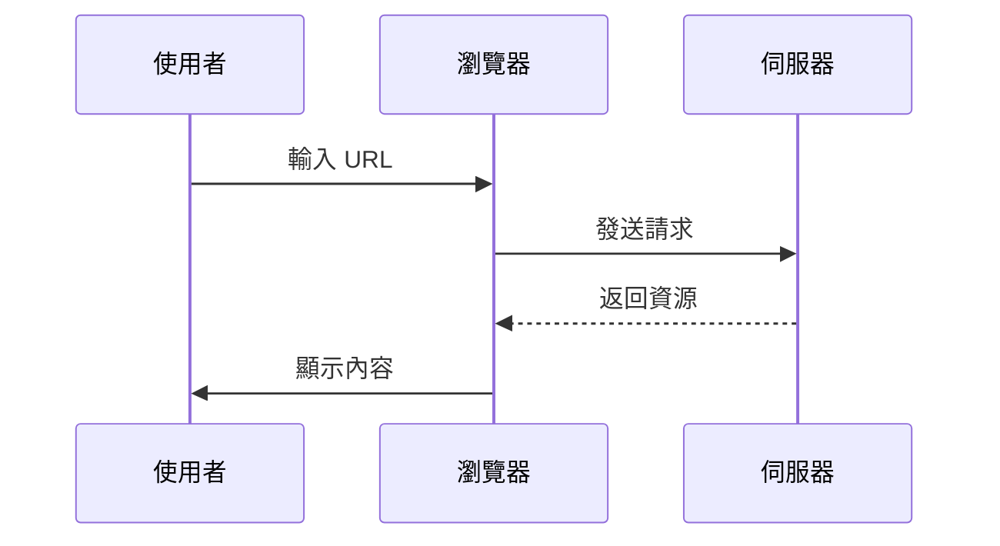

> **前言：**  
前幾天我在公司碰到了幾個跟 URL 相關的問題，這些問題主要是因為開發環境與正式環境不同而產生的。在想辦法解決這些問題的當下我才重新省思，一直以來我都覺得 URL 不是什麼需要特別學習的東西，但我好像也沒有真的很懂 URL，才會導致我在開發時沒有注意到那些上正式環境有可能會冒出來的問題。
透過這篇文章，我想要一次複習並紀錄下一些我認為 URL 重要的知識點。
>

## **什麼是 URL？**

### **URL 的定義與重要性**

**URL**，全名 **Uniform Resource Locator**，中文翻譯為「統一資源定位符」。簡單來說，它就是一個資源的「地址」。無論是網頁、圖片、影片，甚至是音樂，只要能透過網路存取的東西，都需要一個 URL 來指向它。

如果把網際網路想像成一座城市，URL 就像是每個建築物的門牌號碼，讓我們能快速找到目的地。例如，當你在瀏覽器輸入：

```
https://example.com/blog/javascript-basics
```

你實際上是在告訴瀏覽器：*「請幫我找到 example.com 網站上，位於 `/blog/javascript-basics` 這個資源。」*

### **URL 是如何運作的？**

當你輸入一個 URL 並按下 Enter，瀏覽器背後進行了一系列動作。（在這邊我們先略過 DNS 等網路層面，單純介紹 URL 在客戶端與伺服器端之間的關係。）以下是它的簡易運作過程：

1. **導覽的開始：** URL 是瀏覽器的導航指令，告訴它該去哪裡找資料。就像是你要寄信時，地址決定了信要送到哪裡。
2. **發送請求：** 瀏覽器根據 URL 中的「門牌號碼」，向對應的伺服器發送請求，告訴它：「我需要這個網頁（或其他資源）。」
3. **伺服器響應：** 當伺服器收到請求後，會處理並回應瀏覽器，將資源傳回來。
4. **內容呈現：** 瀏覽器將資源解讀並渲染出來，最終你會在螢幕上看到熟悉的網頁畫面。

讓我們透過一個簡單的流程圖來直觀了解這個過程：



### **URL 在網站架構中的角色**

對於使用者來說，URL 是到達網頁的入口。但對於網站開發者而言，它更是網站設計與架構中至關重要的一部分。

1. **連結網頁**  
    URL 讓不同頁面可以彼此連結。例如，一個部落格文章頁面可以透過 `<a>` 標籤將讀者引導到相關內容：
    
    ```html
    <a href="/blog/javascript-basics">了解 JavaScript 基礎</a>
    ```
    
2. **管理靜態資源**  
    除了網頁，CSS、JavaScript、圖片等資源也依賴 URL 來載入。例如：
    
    ```html
    <link rel="stylesheet" href="/styles/main.css">
    <script src="/scripts/app.js"></script>
    
    ```
    
3. **清晰的結構與 SEO**  
    好的 URL 不僅對使用者友善，也對搜尋引擎優化（SEO）至關重要。例如：
    
    - `https://example.com/blog/javascript-basics` 可以清楚表達這是關於 JavaScript 基礎的部落格文章。
    - 而 `https://example.com/page?id=123` 就缺乏描述性，不利於使用者與搜尋引擎的理解。
  

<br/>


## **URL 的基本結構**

如下圖所示，URL 基本上由五大部分組成，每一個部分都有其特定的功能，用來帶我們精準地找到網路上的資源。


> 圖片來源：[@MDN - What is a URL?](https://developer.mozilla.org/en-US/docs/Learn_web_development/Howto/Web_mechanics/What_is_a_URL/mdn-url-all.png)
> 
接下來，讓我們逐一拆解這些部分。

### **協議 (Scheme)**

協議是 URL 的第一部分，用於定義瀏覽器和伺服器之間通訊的規則或方式。例如：

```
https://
```


:::tip[**常見的協議類型**]

1. **HTTP（Hypertext Transfer Protocol）**
    - 是一種標準的通訊協定，用於在瀏覽器與伺服器之間傳遞資料。
    - 缺點：HTTP 的資料傳輸不加密，容易被攔截，存在安全風險。
2. **HTTPS（HTTP Secure）**
    - 是 HTTP 的升級版，通過 SSL/TLS 加密保護資料安全。
    - 現代網站幾乎都採用 HTTPS，不僅提升安全性，對 SEO 也有幫助。
3. **FTP（File Transfer Protocol）**
    - 用於在伺服器與用戶端之間傳輸檔案。
    - 例如：`ftp://ftp.example.com/`。
4. **Mailto**
    - 用於啟動電子郵件客戶端並預設收件人地址。
    - 例如：`mailto:support@example.com`。
:::

### **授權 (Authority)**

授權部分是協議後緊接著的一部分，用來指定伺服器的位置。它包含兩個主要組成部分：

```makefile
www.example.com:443
```

- **域名（Domain）**
    - 域名是伺服器的名字，例如 `www.example.com`。
    - 每個域名都是唯一的，方便使用者記住資源位置，避免直接使用難以理解的 IP 位址。
- **埠號（Port）**
    - 埠號是伺服器的「門號」，用於指定伺服器內部提供服務的端口。
    - 常見埠號：
        - HTTP：80
        - HTTPS：443
        - 預設埠號可以省略，例如：https://www.example.com 與 https://www.example.com:443
         功能上是一樣的。

### **路徑 (Path)**

路徑部分指向伺服器內部的具體資源位置，像是網站檔案的檔案路徑：

```
/blog/javascript-basics
```

- 如何組成路徑？
    - **目錄**`/blog/` 表示這個資源位於伺服器的 `blog` 目錄下。
    - **具體資源**`javascript-basics` 是特定的頁面或檔案名稱。
- 路徑的實際應用
    - 分類與組織：例如 `/products/clothing/shirts` 讓網站內容層級清晰。
    - 可讀性與 SEO：簡潔、描述性強的路徑可以幫助搜尋引擎理解內容，也方便使用者記憶。

### **參數 (Parameters)**

參數位於 URL 中的 `?` 後，用於傳遞額外的資訊，例如篩選條件或查詢資料，常見的應用像是：電商網站用於篩選商品。

```
?category=programming&sort=newest
```

**如何解讀參數？**

1. **鍵值對結構**
    - `category` 是參數的名稱（鍵）。
    - `programming` 是參數的值。
2. **多個參數**使用 `&` 分隔，例如：這表示查詢的是「分類為程式設計」並「按最新排序」的內容。
    
    ```bash
    ?category=programming&sort=newest
    ```
    

### **片段 (Fragment)**

片段部分由 `#` 開始，用於指向頁面內的特定區域或特定時間點：

```arduino
#intro
```

**片段的作用**

1. **網頁內的定位**
    
    例如：會直接將使用者帶到頁面中 `id="intro"` 的區塊。
    
    ```bash
    https://example.com/blog/javascript-basics#intro
    ```
    
2. **多媒體的時間定位**
    
    例如：表示播放影片時，直接從 2 分 30 秒開始。
    
    ```bash
    https://example.com/video#t=2m30s
    ```


<br/>


## **URL 與 URI 的關係與區別**

在談 URL 的過程中，你可能會聽到另一個相關的詞彙: **URI**。乍看之下，它們似乎是可以互換使用的。但實際上，URL 和 URI 各有明確的定義與用途。接下來，我們一起來釐清它們的關係，並了解不同的使用場景。

### **URL 與 URI 的關係**

**URI（Uniform Resource Identifier）** 是一種 **「統一資源識別符」**，它的作用是唯一地標識某個資源，可以是命名資源（URN）或定位資源（URL）。換句話說，**URI 是一個大範疇，而 URL 是其中的一個子集。**

用更直觀的比喻來說：

- **URI**：像是圖書館系統中的書籍編號，它幫助你標識出某本書，但不一定告訴你書的具體位置。
- **URL**：像是完整的書架標籤，它不僅標識這本書，還告訴你在哪個書架的哪一層可以找到。

以下是一些具體範例來幫助理解：

- **URI（URN）**：`urn:isbn:0451450523`（標識了一本書的 ISBN 編號，但沒有提供位置資訊）。
- **URI（URL）**：`https://example.com/book/12345`（標識了某本書，並提供了具體訪問路徑）。

*簡單來說，所有的 URL 都是 URI，但並不是所有的 URI 都是 URL。*

### **使用場景的差異**

1. **URI 的使用場景**
    
    URI 更注重標識資源的唯一性，因此常見於需要標準化命名的系統中。例如：
    
    - **ISBN 編號**：`urn:isbn:0451450523`
    - **命名空間**：在 XML 或 RDF 文件中，用 URI 作為名稱的標識。
2. **URL 的使用場景**
    
    URL 則是我們日常上網最常接觸到的工具，因為它不僅標識資源，還提供了具體的訪問路徑。例如：
    
    - 瀏覽網頁：`https://example.com/blog`
    - 加載靜態資源：`https://example.com/styles/main.css`
    - 提交表單：`https://example.com/login?username=john`
  

<br/>


## **URL 的最佳實踐與注意事項**

在日常開發和部署網站的過程中，URL 的設計不僅影響網站的可用性，還會對 SEO（搜尋引擎優化）和使用者體驗產生深遠的影響。那麼，如何設計出簡潔、有效且符合標準的 URL 呢？以下我們將從多個角度探討 URL 的最佳實踐與注意事項。

### **URL 的大小寫規範**

URL 中，大小寫的處理方式視不同部分而異：

1. **主機名稱（Host）:** 主機名稱不區分大小寫，`www.example.com` 和 `WWW.EXAMPLE.COM` 會被視為同一個位置。
2. **路徑（Path）:** 路徑部分區分大小寫，因此 `/Blog/Post-1` 和 `/blog/post-1` 是完全不同的資源。
3. **查詢字串（Query String）:** 查詢字串的大小寫依賴伺服器的實作，但為了一致性，建議在開發中對查詢字串也保持大小寫敏感。

:::tip[**建議：全小寫設計**]

為了避免大小寫混淆，所有 URL 預設使用小寫字母，例如：

```
https://example.com/blog/javascript-basics
```
:::

### **使用特殊符號的規範**

URL 中常見的特殊符號有不同的用途：

1. **連字符（Hyphen, `-`）與底線（Underscore, `_`）**
    - 建議使用連字符來分隔單詞，因為搜尋引擎更容易解析。例如：
        - 好的：`/javascript-basics`
        - 不佳的：`/javascript_basics`
2. **斜線（Slash, `/`）**
    - 用於表示目錄層級，例如 `/blog/javascript/`。
    - 避免多餘的結尾 `/`，除非特定資源需要。
3. **問號（Question Mark, `?`）與等號（Equal Sign, `=`）**
    - 問號用於引入查詢字串，等號用於分隔參數名稱和值，例如：
        
        ```
        ?category=programming
        ```
        
4. **井號（Hash, `#`）**
    - 用於定位頁面中的特定區域，例如：
        
        ```
        https://example.com/blog#section-2
        ```
        

### **人性化的 URL 設計**

一個好的 URL 不僅需要技術上的正確性，還要考慮使用者的理解與記憶。以下是設計人性化 URL 的幾個原則：

**1. 簡潔明瞭**

- 簡短的 URL 更容易被使用者記住，例如：`https://example.com/blog/javascript-basics` ，而非 `https://example.com/blog?id=1234567890`

**2. 描述性強**

- URL 應該傳遞資源的核心資訊。例如：
    - 好的：`/products/laptop`
    - 不佳的：`/folder1/page123`

**3. 使用關鍵字**

- URL 中包含相關關鍵字有助於搜尋引擎優化（SEO），例如：`https://example.com/learn-javascript`


<br/>


## **絕對與相對 URL 的選擇**

在設計網站的過程中，**絕對 URL** 和 **相對 URL** 是連結資源的兩種主要方式。它們在結構和用途上各有優劣，那麼，如何選擇適合的方式，才能讓網站的連結更穩定且符合需求？我們接下來一步步拆解說明。

### **什麼是絕對 URL？**

**絕對 URL** 是一個完整的資源路徑，包含協議、主機名稱以及資源位置，能夠在任何環境中準確地指向特定資源。

以下是一個典型的絕對 URL：

```arduino
https://www.example.com/blog/javascript-basics
```

包含以下部分：

- **協議**：`https://`，定義資源的傳輸方式。
- **主機名稱**：`www.example.com`，指定伺服器的位置。
- **路徑**：`/blog/javascript-basics`，定位到伺服器上的具體資源。


:::note[**何時應使用絕對 URL？**]

1. **跨域名的連結**
    
    當需要跳轉到其他網站的資源時，例如：
    
    ```
    https://partner-site.com/about
    ```
    
2. **RSS Feed 或 Email 模板**
    
    RSS 和 Email 需要能在不同環境中正確載入資源，例如：
    
    ```
    https://example.com/logo.png
    ```
    
3. **SEO**
    
    在 Sitemap 中使用絕對 URL，能幫助搜尋引擎更精確地索引頁面。
    
:::

### **什麼是相對 URL？**

**相對 URL** 是一種基於當前文件位置的簡化資源路徑。它省略了主機名稱和協議，僅包含資源的相對位置。但需要依賴上下文（例如當前頁面的 URL）來補足缺失的部分，從而定位資源。

假設當前頁面的基礎 URL 為：

```
https://www.example.com/blog/
```

以下是幾種相對 URL 的形式：

1. **根目錄相對 URL**
    
    以 `/` 開頭，忽略當前頁面的位置，直接從**伺服器的根目錄**開始查找資源：
    
    ```
    /images/logo.png
    ```
    
    完整解析後：
    
    ```
    https://www.example.com/images/logo.png
    ```
    
2. **目錄相對 URL**
    
    沒有 `/` 開頭，基於**當前目錄的相對位置**查找資源：
    
    ```
    post-1.html
    ```
    
    完整解析後：
    
    ```
    https://www.example.com/blog/post-1.html
    ```
    
3. **父層相對 URL**
    
    使用 `../` 表示返回上層目錄，例如：
    
    ```
    ../about.html
    ```
    
    完整解析後：
    
    ```
    https://www.example.com/about.html
    ```
    
4. **片段相對 URL**
    
    只有 `#` 開頭的片段，用於定位當前頁面內的特定區塊：
    
    ```arduino
    #section-2
    ```
    
    完整解析後：
    
    ```
    https://www.example.com/blog/#section-2
    ```


## **開發與部署中常見的路徑問題**

### **靜態資源的載入路徑解析問題**

承接前一個章節討論的絕對與相對路徑議題，在實際開發和部署過程中，若沒有謹慎思考相對、絕對路徑的選擇，往往會造成意想不到的路徑解析錯誤。們來看看一些常見的場景和問題。

**情境 1：目錄層級錯誤**

假設你有以下目錄結構：

```
/index.html
/blog/post-1.html
/images/logo.png
```

當你在 `/index.html` 中使用：

```html

```

會被解析為：

```ruby
https://www.example.com/images/logo.png
```

**問題：** 但是，當你將同樣的程式碼複製到 `/blog/post-1.html`，解析結果會變成：

```ruby
https://www.example.com/blog/images/logo.png
```

但實際的資源位置是 `/images/logo.png`，這會導致圖片無法載入。


:::tip[**解決方案：改用根目錄相對 URL**]

```html

```

這樣可以確保無論當前頁面位於哪個目錄，路徑都會正確解析為：

```
https://www.example.com/images/logo.png
```

:::

**情境2：跨環境的路徑解析**

在開發環境中，你的基礎 URL 為：

```
http://localhost:3000/
```

在生產環境中，基礎 URL 為：

```
https://www.example.com/
```

**問題：**

如果在程式碼中使用絕對 URL：

```html

```

當程式碼部署到生產環境後，仍會指向本地的資源。

:::tip[**解決方案：使用相對 URL 或基於根目錄的相對路徑**]

```html

```

:::

### **GitHub Pages 部署中的 URL 問題**

如果你曾使用 **Vite** 建立 React 專案並部署到 GitHub Pages，你應該見過教學文章提到要修改 `vite.config.ts` 中的 `base`，例如：

```tsx
// vite.config.ts
import { defineConfig } from 'vite';
import react from '@vitejs/plugin-react';

export default defineConfig({
  plugins: [react()],
  base: '/my-react-app/', // 將 base 設為專案名稱
});
```

**這是為什麼呢？讓我們一起來部署上 Github Page 的環境跟開發時的本地環境有什麼不同**

其實原因就在於，GitHub Pages 會為每個專案提供一個**子目錄**作為部署靜態網站資源的根目錄，例如： `https://username.github.io/<repository-name>/`

但是，**默認情況下，Vite 生成的靜態資源路徑是基於 `/` 根目錄的**。例如：

```
<script src="/assets/index.js"></script>
```

`/` 實際上會指向： `https://username.github.io/` 。

這導致資源載入失敗，因為實際的資源位置應該是：`https://username.github.io/<repository-name>/assets/index.js`。

要解決這個問題，我們需要明確指定 `base` 為 GitHub Pages 專案的子目錄名稱。例如，若你的專案名稱是 `my-react-app`，就要將 `vite.config.ts` 中的 `base` 設定為：`my-react-app`。

這樣，Vite 會在構建過程中為所有靜態資源自動加上 `base` 前綴，確保資源的 URL 正確解析為：`https://username.github.io/my-react-app/assets/index.js`

### **URL 尾端 `/` 的影響**

最後，想補充一個我前幾天才不小心撞到的問題，這個問題主要跟 **URL 中是否包含尾端 `/`** 這個議題有關。

> 先來説説我遇到的問題情境：
> 

前幾天，我請 DevOps 部門的同事幫我把一個以 React 撰寫的前端專案部署到公司內部的開發機上。這個專案我使用 Vite 打包，並且將打包腳本以及啟動 Web Server 的腳本都寫好在 Dockerfile 裡。我在本地測試過 build docker image，啟動 docker container，以及在指定對外開放的 port 上開啟網頁看起來一切都正常。

過了不久，同事說他部署好了，他幫我把我的服務部署在 `http://192.168.x.yyy:zzzzz/<service_name>` 上。然而，我在瀏覽器上輸入這串網址卻什麼也沒有跑出來。

我打開 DevTools 檢查一下 Networks 後發現，幾乎所有靜態資源的 Request URL 前綴都指向了 `http://192.168.x.yyy:zzzzz`，而不是我想像中的 `http://192.168.x.yyy:zzzzz/<service_name>`。舉例來說，我本來預期 React 的 bundle file: `react_dll.js` 的 Request URL 應該要是：

```
http://192.168.x.yyy:zzzzz/<service_name>/react_dll.js
```

但實際上 Request URL 卻是：

```
http://192.168.x.yyy:zzzzz/react_dll.js
```

後來，我將網址改為 `http://192.168.x.yyy:zzzzz/<service_name>/` 以後，上述問題就沒有發生了，網站也能正常的顯示。

**為什麼會這樣呢？讓我們來解析上述這個情境的問題：**

首先，**URL 中是否包含尾端 `/`，對於瀏覽器如何解析相對路徑資源是有區別的**。瀏覽器會根據 URL 的結構來判斷它是指向一個文件還是一個目錄：

- **沒有尾端 `/` 的 URL**：瀏覽器會將其視為文件。例如：
    
    ```
    http://example.com/blog
    ```
    
    被視為指向文件 `blog`。
    
- **有尾端 `/` 的 URL**：瀏覽器會將其視為目錄。例如：
    
    ```
    http://example.com/blog/
    ```
    
    被視為指向目錄 `blog/`。
    

在上面的情境中，當我輸入的網址為 `http://192.168.x.yyy:zzzzz/<service_name>` ，且頁面中的靜態資源引用為：

```html
<script src="react_dll.js"></script>
```

瀏覽器會將資源路徑解析為：`http://192.168.x.yyy:zzzzz/react_dll.js`

但實際的資源路徑應該是：`http://192.168.x.yyy:zzzzz/<service_name>/react_dll.js`

:::tip[**解決方法：**]

- 在部署文檔中要求用戶輸入完整的 URL，包括尾端 `/`。
- 或者，調整頁面中的資源路徑為絕對路徑：
    
    ```html
    <script src="/<service_name>/react_dll.js"></script>
    ```
    