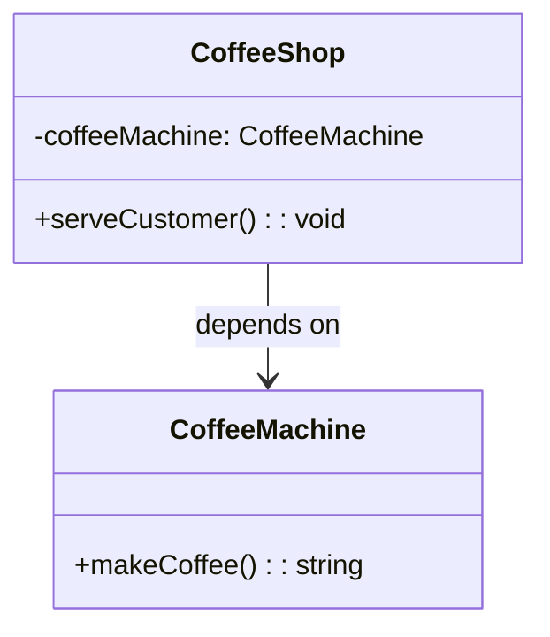
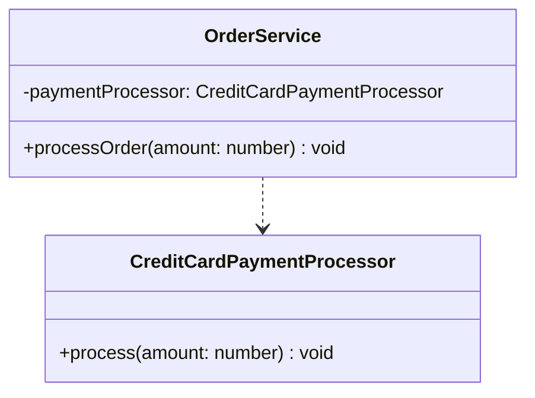
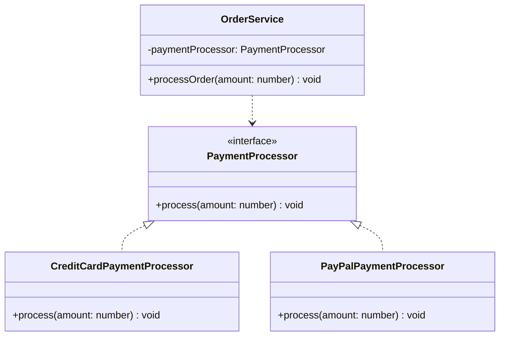
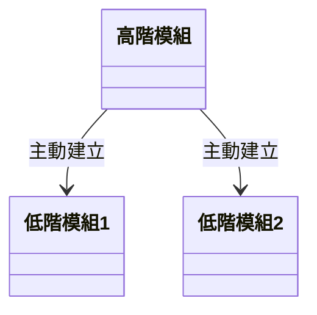
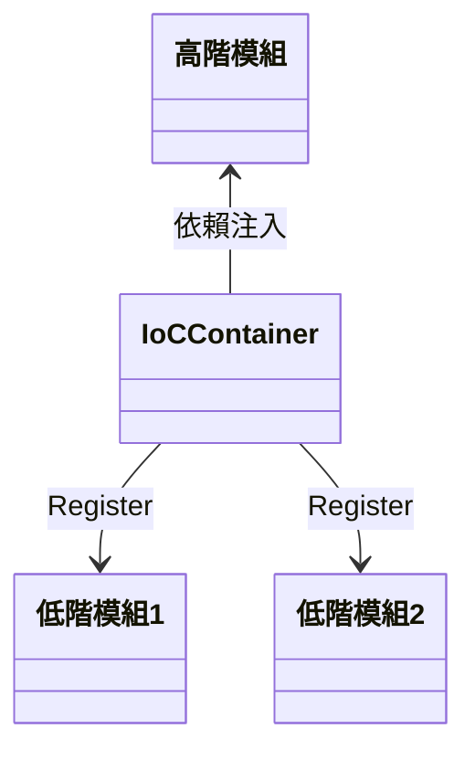

> **前情提要：**  
> 當我剛開始學習 DI、IoC 和 DIP 時，查閱了許多文章，但大多數文章一開始就充斥著「依賴」、「耦合」、「抽象」、「高低階模組」、「容器」和「注入」等 OOP 專業術語。對於剛接觸 OOP 或對 OOP 不太熟悉的人（比如我）來說，這並不太友善。這些詞彙的意思都還沒搞清楚，更別提要用它們來理解 DI、IoC 和 DIP 了。
>
> 本篇文章的目標是讓對 OOP 與 Design Pattern 不熟悉的人也能對以上三個觀念建立清楚的理解。因此，在這篇文章的開頭，我想要用最簡單易懂的方式帶大家先建立對 DI、IoC 和 DIP 的基本概念，讓大家掌握它們背後的核心思想，而不被繁雜的專業術語困擾。接下來的章節中，我們會逐步深入，探討這些術語和技術細節，以便完整理解這些設計原則。


## **快速認識依賴注入 (DI)、控制反轉 (IoC)、依賴反轉原則 (DIP)**

S.O.L.I.D 軟體架構中的 D 所代表的就是**依賴反轉原則 (Dependency Inversion Principle, DIP)** ，在物件導向設計 (OOD) 中是個非常重要的設計原則。這個原則與我們經常提到的**控制反轉 (Inversion of Control, IoC)** 和 **依賴注入 (Dependency Injection, DI)** 緊密相關，這些概念共同構成了一個強大且靈活的架構基礎。


- **DIP - Dependency Inversion Principle (依賴反轉原則)**
    
    想像你是一位經營餐廳的主廚，而食材的供應非常重要。如果你依賴某一家固定的農場供應食材，那麼如果這個農場關閉或供應中斷，你的餐廳運營就會受到影響。依賴反轉原則告訴你，不要依賴某一家具體的農場，而是應該依賴於“供應商的概念”。也就是說，你應該和一個供應系統合作，這樣無論哪家供應商提供食材，你都能正常運營。
    
    > DIP 是一種軟體架構的設計原則與思想，強調高階模組不應該依賴具體的低階模組，而是依賴抽象的接口或契約。這樣可以輕鬆替換具體的實作，系統的可擴展性和穩定性也會更好。
    > 
- **IoC - Inversion of Control (控制反轉)**
    
    接著看**控制反轉**，想像如果你是一個廚師，傳統上你可能自己去菜市場選購食材，然後每天回來準備料理。但控制反轉的概念告訴你，讓“供應商”替你負責這件事。他們知道你每天需要什麼，會自動送來。這樣，你的控制權不再在你手中，而是交給了外部的供應商，讓他們負責供應流程。你只需要專心做菜。
    
    > IoC 是一種 DIP 的具體實踐方式，它的核心在於，將控制物件的創建和依賴的管理交給外部容器或框架，讓框架來管理這些過程，讓程式模組更專注於各自的功能。
    > 
- **DI - Dependency Injection (依賴注入)**
    
    最後是**依賴注入**，它是控制反轉的一種具體實現方式。假設你每天煮飯時，食材供應商會把所有食材直接送到你的廚房。你不需要去尋找或挑選供應商，供應商會自動送來食材。這就是依賴注入，供應商在你需要時自動提供所需的資源（食材），讓你專心做自己的事。
    
    > DI 則是 IoC 的一種具體實現方式，它的重點在於，當一個模組需要某些依賴（例如服務或資源）由外部注入，而不是自己去建立。這樣可以讓程式更加模組化，易於測試和維護。
    >


<br/>


## **OOP 中的核心概念**

### **依賴**

「依賴」正是本篇文章要討論的主角，在我們開始討論依賴反轉、依賴注入之前，首先讓我們理解一下他的含義。

在 OOP 中，**依賴**是指一個物件需要外部的另一個物件或服務來完成某些功能。舉例來說：假設你經營一家咖啡店，你需要一台咖啡機來煮咖啡。你的咖啡店沒有咖啡機就無法運作，這時候可以說咖啡店**依賴**咖啡機來運行。

```tsx
// 定義 CoffeeMachine 類別
class CoffeeMachine {
  makeCoffee(): string {
    return 'Here is your coffee!';
  }
}

// CoffeeShop 類別依賴於 CoffeeMachine
class CoffeeShop {
  private coffeeMachine: CoffeeMachine;

  constructor() {
    this.coffeeMachine = new CoffeeMachine();
  }

  serveCustomer(): void {
    const coffee = this.coffeeMachine.makeCoffee();
    console.log(coffee);
  }
}
```



### **耦合**

所謂的**耦合**是指兩個或多個物件、模組或系統之間的依賴程度。當兩個系統或物件之間高度依賴時，一個物件或系統的變動會嚴重影響另一個物件或系統的運作，這就表示它們的耦合度很高。

這裡我們一樣舉個通俗易懂的例子：假設你有兩家合作的餐廳：一家專門供應食材（供應商），另一家專門烹飪食物（餐廳）。如果這家餐廳只能使用特定一家供應商的食材（高度耦合），那麼當供應商無法供應時，餐廳也會無法運作。如果餐廳能靈活地選擇不同的供應商（低耦合），即使一家供應商無法提供食材，餐廳依然可以正常運營。

當系統的耦合度過高時，系統變得難以維護，因為一個小小的變動可能會對多個部分造成連鎖反應。而 DIP 的主要概念就是盡量降低模組間的耦合度，讓程式更具可擴展性。

<aside>
💡

**耦合和依賴的關係**可以這樣理解：依賴描述了物件之間的需求，耦合描述了這種需求的強弱。高耦合往往表示依賴關係比較強，而低耦合則意味著依賴關係比較鬆散。

</aside>

### **高階模組與低階模組**

- **高階模組**：
    
    在軟體設計中，高階模組通常是那些負責應用程式的核心邏輯或業務邏輯的模組。它們通常與使用者需求或應用程式的整體行為相關，通常更抽象，負責較高層次的決策。舉例來說：假設你有一個訂單系統，OrderService 可以被視為一個高階模組，它處理訂單的創建、驗證和付款等業務邏輯，但它不應該直接關心具體的付款方法（例如信用卡、PayPal 等）。
    
- **低階模組**：
    
    低階模組是那些負責實作具體功能的模組，它們通常處理更基礎的操作或系統細節，像是資料存取、支付處理、日誌記錄等。這些模組具體處理應用程式需要的某些功能，但它們不應該包含業務邏輯。舉例來說，在同一個訂單系統中，具體的 CreditCardPaymentProcessor 和 PayPalPaymentProcessor 就是低階模組，它們分別處理不同的付款方法，但它們不關心整個訂單的業務邏輯。
    

### **抽象 x 介面  x 實作**

- **抽象：**
    
    抽象是指將物件的細節隱藏起來，僅保留最核心、最關鍵的行為或屬性。抽象讓我們專注於物件“應該做什麼”，而不是“怎麼做”。抽象可以是類別、方法或屬性，代表一個通用的概念，而具體的細節由實作來提供。
    
    ```tsx
    abstract class CoffeeMachine {
      // 抽象方法，只有定義，沒有實作
      abstract makeCoffee(): string;
    }
    ```
    
- **介面：**
    
    **介面**是一種更純粹的抽象，專門用來定義物件應該具備哪些方法和屬性，但不包含任何實作。它像是一個合約，強制實作的類別必須提供這些方法的具體行為
    
    ```tsx
    interface CoffeeMaker {
      makeCoffee(): string;
    }
    ```
    
- **實作：**
    
    **實作**是指具體提供方法或行為的細節，它是抽象的具體化。當你定義了一個抽象或介面後，具體的實作會告訴程式如何實現這些行為。
    
    ```tsx
    // CoffeeMachine 實作了 CoffeeMaker 介面
    class EspressoMachine implements CoffeeMaker {
      makeCoffee(): string {
        return 'Espresso is ready!';
      }
    }
    
    class FrenchPressMachine implements CoffeeMaker {
      makeCoffee(): string {
        return 'French Press coffee is ready!';
      }
    }
    
    // 使用實作
    const espressoMachine = new EspressoMachine();
    console.log(espressoMachine.makeCoffee()); // Output: Espresso is ready!
    
    const frenchPressMachine = new FrenchPressMachine();
    console.log(frenchPressMachine.makeCoffee()); // Output: French Press coffee is ready!
    
    ```


<br/>


## **依賴反轉原則(Dependency Inversion Principle, DIP)**

### **什麼是依賴反轉原則(DIP)？**

大致理解這些 OOP 中常見的術語後，現在我們來談談什麼是依賴反轉原則 (DIP)吧，它是 OOP 中一個非常重要的設計思維。[SOLID Principles of Object-Oriented Design and Architecture](https://www.udemy.com/course/solid-principles-object-oriented-design-architecture) 這本書提到，DIP 有兩個關鍵原則：

1. **高階模組不應依賴於低階模組，兩者都應依賴抽象。**
2. **抽象不應依賴於細節，細節應依賴於抽象。**

雖然這句話本身看起來就很抽象，但實際上其實很好理解。用白話來說，就是說你不應該讓重要的業務邏輯（高階模組）去緊密依賴具體的細節（低階模組），而是要通過一個抽象層來解耦。這樣，不管細節變動如何，你的高階邏輯仍然能保持不變。

舉一個具體的生活情境為例子：想像你是一個遠程工作者，平常用筆電工作，但突然有一天你只能用手機辦公了，結果你發現每次換工作設備時，都得修改你自己的工作流程。那這樣可不行啊！這就是高階模組依賴低階模組的典型例子，因為你的工作流程直接依賴於具體的設備。

### **為什麼不該讓高階模組直接依賴低階模組？**

以一個電商平台的訂單處理系統為例，處理訂單的 OrderService 就是負責核心業務邏輯**的高階模組**，處理支付具體操作細節的 CreditCardPaymentProcessor 則是**低階模組**。我們寫程式的時候常常會直接這樣寫：

```tsx
class CreditCardPaymentProcessor {
  processPayment(amount: number): void {
    console.log(`Processing credit card payment of ${amount}`);
  }
}

class OrderService {
  private paymentProcessor: CreditCardPaymentProcessor;

  constructor() {
    this.paymentProcessor = new CreditCardPaymentProcessor();
  }

  placeOrder(amount: number): void {
    console.log('Placing order...');
    this.paymentProcessor.processPayment(amount);
  }
}

// 使用 OrderService 處理訂單
const orderService = new OrderService();
orderService.placeOrder(100);
```

**來看看依賴關係：**



**問題在哪裡？**

- OrderService 依賴於具體的 CreditCardPaymentProcessor，這就像你只能用特定的工具（筆電）工作，任何改變都會讓你手忙腳亂。想像一下，如果你想加入 PayPal 支付方式，你會發現得改一堆程式碼。

### **如何遵循依賴反轉原則？**

現在來看怎麼用抽象來解決這個問題。首先，我們定義一個抽象的 PaymentProcessor 介面，讓高階模組 OrderService 依賴這個介面，而不是具體的支付方式。

```tsx
interface PaymentProcessor {
  process(amount: number): void;
}

class CreditCardPaymentProcessor implements PaymentProcessor {
  process(amount: number): void {
    console.log(`Processing credit card payment of ${amount}`);
  }
}

class PayPalPaymentProcessor implements PaymentProcessor {
  process(amount: number): void {
    console.log(`Processing PayPal payment of ${amount}`);
  }
}

class OrderService {
  private paymentProcessor: PaymentProcessor;

  constructor() {
	  // 現在可以在這裡更換支付方式
	  // const paypalProcessor = new PayPalPaymentProcessor();
    this.paymentProcessor = new CreditCardPaymentProcessor();
  }

  processOrder(amount: number): void {
    console.log('Order is being processed...');
    this.paymentProcessor.process(amount);
  }
}

// 使用 OrderService 處理訂單
const orderService1 = new OrderService();
orderService1.processOrder(100);
```

**來看看依賴關係：**



**從依賴低階模組的實作轉向依賴於抽象的改善**

- OrderService 現在依賴於抽象的 PaymentProcessor 介面，而不是具體的支付實作。這樣一來，如果你想使用 PayPal 支付方式，只需要在 **PayPalPaymentProcessor(低階模組)** 中實作 **PaymentProcessor(介面)**，而不需要改動 **OrderService(高階模組)** 使用支付方式的邏輯。

**還存在什麼問題？**

- 雖然現在高階模組已經依賴於抽象，但是我們可以發現， **new instance** 這個動作還是在 OrderService 裡面進行的。也就是說，如果今天我們想要換用另一種支付方式時，我們還是得手動更改要在 OrderService 裡面 new 哪一種 instance。這依然讓我們的高階模組對具體的實作有所依賴。


<br/>


## **控制反轉(Inversion of Control, IoC)**

在前一節，我們提到 OrderService 雖然已經依賴於抽象的 PaymentProcessor 介面，而不再緊密依賴具體的支付方式，但問題在於，我們依然需要在 OrderService 內部手動決定使用哪一種支付方式。這裡出現的關鍵問題就是——誰應該負責創建具體的支付實例？

> 這時候，我們需要引入 **控制反轉 (Inversion of Control, IoC)**。
> 

### **什麼是控制反轉 (IoC)？**

**控制反轉（Inversion of Control, IoC）** 是一種設計模式，核心思想是將模組的控制權（例如，具體實作的生成）從模組本身轉移到外部的框架或容器中。這樣，高階模組不需要關心如何創建和管理它依賴的低階模組。其最大的作用就是幫助高階模組**解耦(Decouple)**。

在我們的例子中，OrderService 不再需要自己決定使用哪個 PaymentProcessor，這個責任將交給 IoC 容器來處理。

### **IoC 容器（IoC Container）**

那麼，**IoC 容器**又是什麼呢？

IoC 容器是一個負責管理和注入依賴的工具。當高階模組需要某個具體的實作時，IoC 容器會負責創建這個實作並將它注入到高階模組中，而高階模組不需要自己去 new 出來。

使用 IoC 容器後，我們的 OrderService 可以不再直接決定使用哪種支付處理器，IoC 容器會自動將我們需要的具體實作注入進來。

### **使用 IoC 重構**

```tsx
// 模擬 IoC 容器
class IoCContainer {
  private services: Map<string, any> = new Map();

  // 註冊服務
  register(serviceName: string, service: any) {
    this.services.set(serviceName, service);
  }

  // 取得服務
  resolve(serviceName: string) {
    return this.services.get(serviceName);
  }
}

// 定義抽象介面和具體實作
interface PaymentProcessor {
  process(amount: number): void;
}

class CreditCardPaymentProcessor implements PaymentProcessor {
  process(amount: number): void {
    console.log(`Processing credit card payment of ${amount}`);
  }
}

class PayPalPaymentProcessor implements PaymentProcessor {
  process(amount: number): void {
    console.log(`Processing PayPal payment of ${amount}`);
  }
}

// 高階模組 OrderService 依賴於抽象介面
class OrderService {
  private paymentProcessor: PaymentProcessor;

  constructor(paymentProcessor: PaymentProcessor) {
    this.paymentProcessor = paymentProcessor;
  }

  processOrder(amount: number): void {
    console.log('Order is being processed...');
    this.paymentProcessor.process(amount);
  }
}

// 註冊依賴到 IoC 容器中
const container = new IoCContainer();
container.register('PaymentProcessor', PayPalPaymentProcessor); // 可以更換為 CreditCardPaymentProcessor

// 從容器中解決依賴
const paymentProcessor = container.resolve('PaymentProcessor');
const orderService = new OrderService(paymentProcessor);
orderService.processOrder(100);
```

**使用 IoC 後的改善**

- 透過這樣的方式，我們可以輕鬆地更換不同的 PaymentProcessor，而不需要改動 OrderService 的任何程式碼。IoC 容器自動處理了依賴的註冊和解決。

### **流程控制責任的轉移**

從上面的例子我們可以發現，創建PaymentProcessor的責任從OrderService 被移轉到了 **IoC 容器** 。對高階模組來說 **「控制流程 (Control Flow)」**，也就是獲取資源的行為，由 **「主動」** 變成 **「被動」** —— 這就是 **「控制反轉」**。

**讓我們來看看使用 IoC 前後的依賴關係：**

- 在還沒使用 IoC 重構前，高階模組主動的去建立所需要的低階模組 (資源)。



- 使用 IoC 重構後， IoC Container 在**執行的期間(Runtime)** 註冊所需要的模組，再將高階模組需要的依賴**注入**高階模組。



### **IoC 和 DIP 的差異**

DIP（**依賴反轉原則**）與 IoC（**控制反轉**）是兩個在概念層面密切相關的程式設計原則，剛開始學習時，這兩者的具體區別可能不太明顯。在這裡，我們來簡單整理一下兩者的關係和區別：

1. **依賴反轉原則（DIP）是設計原則**：
    
    DIP 是一種面向抽象的設計原則，它強調**高階模組應依賴於抽象，而不是依賴於低階模組的具體實作**。這意味著，高階模組（如業務邏輯）應該透過抽象介面與低階模組（如資料庫、支付服務等）進行交互，而不是直接耦合具體的實作。
    
2. **控制反轉（IoC）是實現 DIP 的一種技術**：
    
    IoC 是一種技術概念，它提供了具體的實現方式來達成 DIP 的目標。它讓**物件的依賴不再由高階模組自行創建**，而是由外部容器或框架負責提供。常見的 IoC 實現方式是**依賴注入（Dependency Injection, DI）**。


<br/>


## **依賴注入(Dependency Injection, DI)**

在上一章節中，我們討論了 **控制反轉 (IoC)**，並且介紹了 IoC 容器如何幫助我們在運行時自動管理依賴，讓高階模組不需要自己去控制依賴的創建。**依賴注入（Dependency Injection, DI）** 是實現控制反轉最常見的技術之一。

### **什麼是依賴注入 (DI)？**

**依賴注入（DI）** 是一種設計模式，它的核心思想是將物件的依賴（如具體的實作）**由外部注入**到物件，而不是在物件內部自行創建。換句話說，物件的依賴（例如 PaymentProcessor）並不是由高階模組自己去決定和創建，而是由外部（通常是 IoC 容器）負責生成並注入到高階模組中。

DI 幫助我們進一步實現依賴反轉原則（DIP），因為高階模組不再依賴具體的低階模組，而是依賴抽象（例如接口），並且這些抽象的具體實作是由外部注入的。

### **依賴注入與 IoC 的關係**

依賴注入是控制反轉（IoC）的具體實現方式之一。透過依賴注入，我們實現了 IoC 的核心概念——**將對依賴的控制權從高階模組轉移到外部。**

IoC 是一個更廣義的概念，描述的是將系統的控制流程由內部轉移到外部，而 DI 是實現這一目標的具體技術。透過依賴注入，我們可以讓高階模組完全依賴抽象，並且由 IoC 容器負責將合適的實作注入到這些高階模組中。

### **常見的依賴注入方式**

在依賴注入的實踐中，有幾種常見的注入方式。每一種方式都會在不同的場景下使用，具體取決於系統的架構設計與需求。

**1. 構造函數注入（Constructor Injection）**

構造函數注入是最常見的依賴注入方式。它將依賴注入到物件的構造函數中，當物件被創建時，依賴會自動被傳入並賦值。

```tsx
class OrderService {
  private paymentProcessor: PaymentProcessor;

  // 在構造函數中注入依賴
  constructor(paymentProcessor: PaymentProcessor) {
    this.paymentProcessor = paymentProcessor;
  }

  processOrder(amount: number): void {
    this.paymentProcessor.process(amount);
  }
}
```

**優點：**

- 確保所有依賴在物件被創建時就已經準備好。
- 方便進行單元測試，因為依賴可以輕易被替換成 mock 或 stub。

**2. 屬性注入（Property Injection）**

屬性注入是透過設定類別的屬性來進行依賴注入。通常這些屬性是 public 或 protected，並在物件創建後由 IoC 容器進行注入。

```tsx
class OrderService {
  // 使用屬性注入依賴
  public paymentProcessor: PaymentProcessor;

  processOrder(amount: number): void {
    this.paymentProcessor.process(amount);
  }
}

// 在 IoC 容器中設定屬性
const orderService = new OrderService();
orderService.paymentProcessor = new PayPalPaymentProcessor(); // IoC 容器負責注入
```

**優點：**

- 可以延遲注入，在物件創建後再進行依賴的設定。

**缺點：**

- 依賴注入的時機不明確，容易出現依賴未初始化的情況。
- 減少了物件創建過程中的可預測性，增加了管理的複雜度。

**3. 方法注入（Method Injection）**

方法注入是透過調用某個方法來傳入依賴。這種方式允許在物件運行的過程中動態更改依賴。

```tsx
class OrderService {
  private paymentProcessor: PaymentProcessor;

  // 使用方法來注入依賴
  setPaymentProcessor(paymentProcessor: PaymentProcessor): void {
    this.paymentProcessor = paymentProcessor;
  }

  processOrder(amount: number): void {
    this.paymentProcessor.process(amount);
  }
}

// 調用方法來注入依賴
const orderService = new OrderService();
orderService.setPaymentProcessor(new PayPalPaymentProcessor());
orderService.processOrder(100);
```

**優點：**

- 靈活性高，可以在運行過程中改變依賴。
- 適合在需要動態改變依賴的場景中使用。

**缺點：**

- 容易導致系統的依賴管理變得混亂，不容易跟蹤依賴變更的來源。


<br/>


## **Reference**

- [**深入淺出依賴反向原則 Dependency Inversion Principle**](https://www.jyt0532.com/2020/03/24/dip/)
- [**[.NET][C#][SOLID] - DI & IoC (依賴注入與控制反轉) 全面講解**](https://medium.com/wenchin-rolls-around/%E6%B7%BA%E5%85%A5%E6%B7%BA%E5%87%BA-dependency-injection-ea672ba033ca)
- [**淺入淺出 Dependency Injection**](https://medium.com/wenchin-rolls-around/%E6%B7%BA%E5%85%A5%E6%B7%BA%E5%87%BA-dependency-injection-ea672ba033ca)
- [**深入探討依賴注入**](https://old-oomusou.goodjack.tw/tdd/tdd-di/#)
- [**依赖注入是什么？如何使用它？**](https://www.freecodecamp.org/chinese/news/a-quick-intro-to-dependency-injection-what-it-is-and-when-to-use-it/)