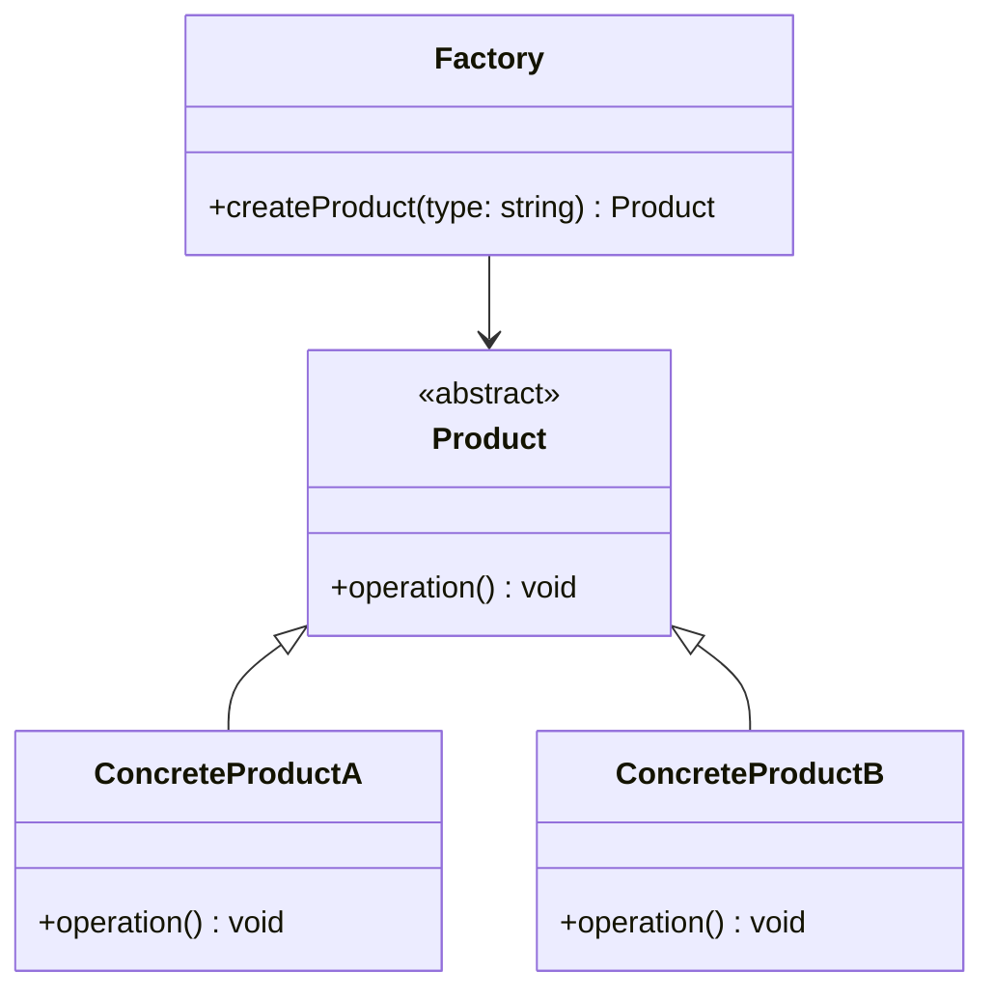

## **前言**

在學習設計模式之前，我對 **「工廠模式」** 的認識其實很模糊，只知道它和物件創建有關。那時我一直以為工廠模式就是單純的一種設計模式，但隨著開始學習設計模式後，我才發現工廠模式並不是指單一具體的模式，而是一個總稱，涵蓋了 **「簡單工廠模式 (Simple Factory Pattern)」** 、 **「工廠方法模式 (Factory Method Pattern)」** 以及 **「抽象工廠模式 (Abstract Factory Pattern)」** 三種設計模式。

這三者雖然在概念和細節實現上有所不同，但它們的共同點是——它們都源自同一個問題：「如何創建物件」。這個問題隨著系統規模的擴展和需求變化而催生出不同的工廠模式，每一種模式都有它的適用場景與特色。

這篇文章會從最基礎、最直觀的 **「簡單工廠模式」** 開始，帶你一步步了解它的動機、問題解法，並深入剖析其優缺點。現在，就讓我們從點一杯飲料的日常場景開始，看看簡單工廠模式是如何解決「手動創建物件」帶來的種種麻煩吧！

## **簡單工廠模式的設計動機**

### **手動創建物件的問題**

想像一下，你去飲料店點飲料。你說：「我要一杯珍珠奶茶！」，店員轉身就開始調製，最後交給你一杯現成的飲料。這整個過程中，你只需要告訴店員「珍珠奶茶」這個種類，至於怎麼做、用什麼材料，完全不需要你操心。

那如果沒有飲料店，每次要喝飲料都是你自己泡飲料的話，你需要：

1. 準備材料（奶茶粉、珍珠、糖、冰塊等）。
2. 按照配方製作飲料。
3. 清理工具。

這樣是不是又麻煩又耗時？(感謝飲料店🤣)

在軟體開發中，當我們需要**創建物件**時，通常會用 `new` 關鍵字直接創建物件，例如 `new BubbleTea()`。但這就像自己泡飲料例子一樣，如果每次創建物件都得明確知道如何初始化、配置，程式碼會變得冗長又難以維護。

此外，手動創建物件還可能會遇到一個問題，一旦產品類型或創建流程改變（例如珍奶從今以後都要從塑膠杯改用紙杯裝，或是老闆希望珍奶從此改名叫 qq ㄋㄟㄋㄟ好喝到咩噗茶），那麼你就需要手動修改程式碼中所有出現 `new BubbleTea()` 的地方，這樣的設計非常脆弱。

### **簡單工廠模式的解法**

> **那麼我們該如何解決「直接創建具體類別」帶來的高耦合性問題呢？**
> 

一個簡單且直觀的解法就是**將物件創建的過程封裝起來**，透過一個 **「工廠」** 來根據條件選擇正確的產品類型並返回實例。這樣的設計讓客戶端程式只需要專注於使用產品，而不必了解具體的產品類別名稱或其內部的創建細節。換句話說，客戶端只需要告訴工廠：「我需要一個什麼樣的產品」，而工廠會負責處理「這個產品要怎麼生成」。

這種方式的好處是**降低了系統的耦合性**。未來若需要增加新的產品類型或修改創建邏輯，只需調整工廠類別的實作，而無需更動客戶端程式碼，有效提升了系統的可擴展性和維護性。

此外，你可以發現到這樣的模式概念還符合了**單一責任原則（SRP）**，因為產品的創建和使用被分開處理，使程式碼結構更加清晰。無論產品的生成過程有多麼複雜，這些細節都被封裝在工廠裡，客戶端可以更專注於實現業務邏輯，而不是被繁瑣的實例化細節所干擾。


<br/>


## **簡單工廠模式的概念與原則**

### **設計概念**

簡單工廠模式的核心思想是**將「創建物件的邏輯」集中管理，並統一交由一個工廠類來處理**。工廠類的職責是根據不同的參數或條件生成對應的物件實例，從而讓客戶端程式從繁瑣的創建細節中解放出來。使用者只需呼叫工廠類，並傳入所需的產品類型，工廠便會根據該類型返回對應的物件實例。

### **設計原則**

- **單一責任原則 (Single Responsibility Principle)**：工廠類專注於負責物件的創建，其他業務邏輯則交由產品類來處理。這樣的分工方式能夠避免單一類別承擔過多責任，維持程式碼的高內聚性和低耦合性，並使後續的修改更容易進行。
- **解耦合**：客戶端程式不需要知道具體的產品類別名稱及其內部結構，只需透過工廠來獲取對應的產品物件。這樣可以有效降低客戶端與產品類別之間的依賴性，使系統在產品種類變更或新增時，不需要修改客戶端的程式碼，提升了系統的靈活性和擴展性。

## **模式結構**

簡單工廠模式的結構可以用下面的類別圖來表示：



### **角色**

- **Factory**：工廠類別，根據參數創建具體的產品物件。
- **Product**：抽象產品類別，定義了所有產品的共同行為。
- **ConcreteProductA、ConcreteProductB**：具體產品類別，實作產品的行為。


<br/>


## **Pseudocode 與實作範例**

接下來我們用一個簡單的生成不同產品的範例來幫助大家理解如何實作簡單工廠模式。

### **Pseudocode**

```
Class Factory:
Static Method createProduct(type):
    If type == "A":
        Return new ProductA()
    Else if type == "B":
        Return new ProductB()
    Else:
        Throw Error("Invalid type")

Class Product:
    Abstract Method operation()

Class ProductA Extends Product:
    Method operation():
        Print "ProductA operation executed"

Class ProductB Extends Product:
    Method operation():
        Print "ProductB operation executed"

# 使用示例
Factory.createProduct("A").operation()  # Output: ProductA operation executed
```

### **TypeScript 實作**

```tsx
// 抽象產品類：定義所有產品的共同行為
abstract class Product {
  abstract operation(): void;
}

// 具體產品類 A
class ProductA extends Product {
  operation(): void {
    console.log("ProductA operation executed");
  }
}

// 具體產品類 B
class ProductB extends Product {
  operation(): void {
    console.log("ProductB operation executed");
  }
}

// 簡單工廠類：負責根據參數創建具體產品
class Factory {
  static createProduct(type: string): Product {
    if (type === "A") {
      return new ProductA(); // 返回具體產品 A
    } else if (type === "B") {
      return new ProductB(); // 返回具體產品 B
    } else {
      throw new Error("Invalid product type"); // 若輸入無效，拋出錯誤
    }
  }
}

// 使用範例
const productA = Factory.createProduct("A"); // 創建 ProductA
productA.operation(); // Output: ProductA operation executed

const productB = Factory.createProduct("B"); // 創建 ProductB
productB.operation(); // Output: ProductB operation executed
```


<br/>


## **簡單工廠模式的優缺點分析**

### **優點**

1. **簡化物件創建，減少耦合**：客戶端程式不需要直接實例化具體產品類別，只需傳入參數即可獲得對應的物件。這樣可以有效減少客戶端與具體類別之間的耦合度，提高系統的靈活性。
2. **集中管理物件創建**：所有產品實例的創建邏輯集中在工廠類中，這樣當創建過程需要修改時，只需在工廠類進行調整即可，而無需遍歷所有使用產品的地方，提升了程式碼的可維護性。

### **缺點**

1. **違反開放-封閉原則 (Open-Closed Principle, OCP)**：每當需要新增一種類型的產品，都必須修改工廠類別的程式碼來支援新產品，這違背了 **「對修改封閉，對擴展開放」** 的原則。因此，隨著需求變化，工廠類容易成為變更的熱點。
2. **工廠類別易膨脹**：當產品類型數量增多時，工廠類中的 `createProduct` 方法會變得複雜，可能充滿大量的 `switch-case` 或 `if-else` 判斷邏輯，導致類別難以維護，尤其在大型系統中會成為不易調整的瓶頸。

### **適用與建議**

簡單工廠模式適用於**需要根據參數生成單一類型產品**，且產品種類有限、變動頻率不高的場景。例如：

- **飲料訂單系統**：依據客戶的選擇生成不同類型的飲料實例，如珍珠奶茶、紅茶、綠茶等，不需要深入了解具體製作細節，只需返回對應的飲料物件。
- **報表生成工具**：根據輸入的報表類型生成相應格式的報表實例，如 PDF 報表、Excel 報表等，減少客戶端程式碼與具體報表類別的耦合。

當你希望**簡化物件創建過程**並將物件生成的細節封裝在工廠中時，簡單工廠模式能有效提升開發效率。

> **以下情況則不建議使用：**
1. 當產品種類多且類別頻繁變動時，簡單工廠模式會隨著產品種類的增多而變得不易維護，導致工廠類別變得龐大難以擴展。
2. 當系統需要依賴多組相關聯產品時，簡單工廠模式無法有效處理多產品組合的一致性，此時應考慮使用抽象工廠模式或工廠方法模式。
> 


<br/>


## **簡單工廠模式與其他設計模式的比較**

### **與工廠方法模式的比較**

- **實現方式**：    
    簡單工廠模式通常使用**靜態方法**來創建物件，而工廠方法模式則通過**實作抽象工廠介面的子類**來生成具體產品實例。
    
- **擴展性**：    
    工廠方法模式更符合**開放-封閉原則**。當需要新增新產品時，可以通過創建新的工廠子類來實現，而無需修改原本的工廠類別，從而避免了修改既有程式碼引發的風險。
    

### **與抽象工廠模式的比較**

- **用途範圍**：    
    簡單工廠模式用於生成**單一類型的產品實例**，而抽象工廠模式則用於創建一組**相互關聯的多個產品實例**。例如，在 UI 開發中，抽象工廠可以生成各式主題都一整組相關的元件，如一致封個的按鈕、輸入框等。
    
- **靈活性**：    
    抽象工廠模式雖然更靈活，能處理多個產品家族，但相對設計較為複雜，適用於產品種類多且存在關聯性的場景。而簡單工廠模式結構簡單，適用於產品種類較少、變動頻率低的情況。
    

## **Reference**

- [**工厂模式？错！是工厂模式群！**](https://www.youtube.com/watch?v=i5hulSvMalc&list=PLaQXtukllyMIgrCDxyr3StMHyUGVepmsv&index=1&ab_channel=EfficLab%E4%B8%AD%E6%96%87)
- [**Graphic Design Patterns - 1. 简单工厂模式( Simple Factory Pattern )**](https://design-patterns.readthedocs.io/zh-cn/latest/creational_patterns/simple_factory.html#id6)