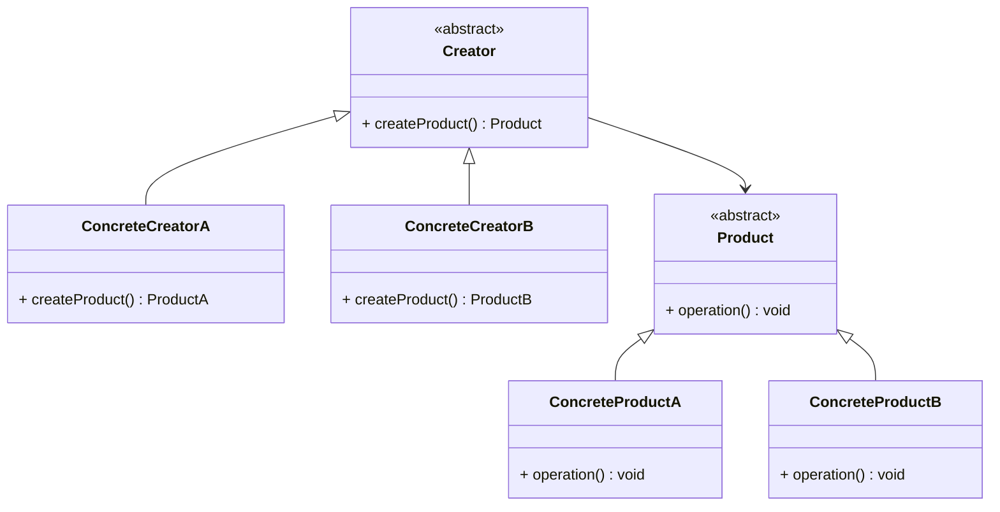

## **前言**

在學習設計模式的時候，我們常常會遇到 **「工廠模式」** 這個詞，而最常被介紹的就是 **「簡單工廠模式 (Simple Factory Pattern)」**。如果你已經讀過上一篇關於簡單工廠模式的文章，應該已經對它的概念有一定的理解。這裡我們先快速回顧一下簡單工廠模式的核心概念：

> 簡單工廠模式 將「物件的創建」封裝在一個工廠類別中，客戶端無需直接使用 `new` 關鍵字去實例化物件，而是透過工廠方法來獲得所需的物件。
> 

這樣的設計帶來了兩個好處：

1. **降低耦合度**：客戶端不需要了解具體產品類別的細節，只需向工廠請求物件即可。
2. **集中管理創建邏輯**：當產品的創建過程發生改變時，只需要修改工廠內部的邏輯，而無需動及客戶端程式碼。

然而，儘管簡單工廠模式成功解決了物件創建的耦合問題，但在面對產品種類不斷增加的情況下，其內部往往會出現過多的條件分支（例如 if-else 或 switch-case），導致程式碼逐漸複雜，甚至變成難以維護的「條件分支迷宮」。這不僅違反了 **開放-封閉原則 (OCP, Open-Closed Principle)**，也讓每次新增產品時，都必須修改已存在的工廠類別，增加了程式出錯的風險。

來看看這個例子：

```ts
class Factory {
  static createProduct(type: string): Product {
    if (type === "A") {
      return new ProductA();
    } else if (type === "B") {
      return new ProductB();
    } else {
      throw new Error("Invalid product type");
    }
  }
}
```

如果今天有個新產品 **ProductC** 要加入，我們就必須修改 `Factory` 類別，把 `if-else` 或 `switch-case` 再加上 `ProductC` 的處理邏輯。這樣一來每次的修改都可能影響既有程式碼，增加維護的複雜度與風險。

那麼，有沒有不需要動到既有程式碼，卻又能靈活擴充新產品的方法呢？這篇文章要介紹的**工廠方法模式(Factory Method Pattern)** 便是解決這個問題的方案！

## **動機與問題背景**

### **當簡單工廠不再簡單時**

剛剛我們提到，簡單工廠模式在系統規模小的時候還挺好用，但隨著系統變複雜，簡單工廠也會跟著變得複雜起來。現在，想像一下這樣一個情境：你正在開發一個 **物流管理系統**，一開始系統只支援 **卡車 (Truck)** 運輸，所以大部分程式碼都是圍繞著 `Truck` 類別運行：

```ts
class Truck {
  deliver() {
    console.log("貨物已透過卡車送達");
  }
}

// 簡單工廠負責創建卡車
class LogisticsFactory {
  static createTransport(): Truck {
    return new Truck();
  }
}

// 客戶端使用工廠來獲取運輸工具
const transport = LogisticsFactory.createTransport();
transport.deliver();
```

這套系統運行得很好，直到有一天，**海運公司來找你合作**，希望你的系統能夠支援 **船運 (Ship)**。

這時候你該怎麼辦？

最直覺的做法就是 直接修改 `LogisticsFactory`，加入對 `Ship` 的處理：

```ts
class Ship {
  deliver() {
    console.log("貨物已透過船運送達");
  }
}

class LogisticsFactory {
  static createTransport(type: string) {
    if (type === "truck") {
      return new Truck();
    } else if (type === "ship") {
      return new Ship();
    } else {
      throw new Error("未知的運輸方式");
    }
  }
}

// 使用時要傳入運輸方式
const transport = LogisticsFactory.createTransport("ship");
transport.deliver(); // 貨物已透過船運送達
```

這樣雖然暫時解決了問題，但你有沒有發現其實我們修改了 `LogisticsFactory`，這就違反了 **開放-封閉原則 (OCP)**。

### **🚨 簡單工廠的 if-else 地獄**

隨著系統越來越受歡迎，各種運輸需求接踵而來，老闆還希望我們支援更多運輸方式，例如：

- 🚢 **貨輪 (Cargo Ship)**
- 🚆 **火車 (Train)**
- ✈️ **飛機 (Airplane)**

這樣一來，我們的 `LogisticsFactory` 變成了這樣的災難現場：

```ts
class LogisticsFactory {
  static createTransport(type: string) {
    if (type === "truck") {
      return new Truck();
    } else if (type === "ship") {
      return new Ship();
    } else if (type === "cargo-ship") {
      return new CargoShip();
    } else if (type === "train") {
      return new Train();
    } else if (type === "airplane") {
      return new Airplane();
    } else {
      throw new Error("未知的運輸方式");
    }
  }
}
```

每次有新運輸方式，就得修改 `LogisticsFactory`，程式碼就越寫越亂，這讓程式變得愈來愈不穩定。如果我們繼續這樣下去，未來每次擴充功能都會變成一場災難。

所以，我們迫切需要一種更靈活、更不容易出錯的方式來處理這些問題，而這正是**工廠方法模式 (Factory Method Pattern)** 要來解決的問題。

## **工廠方法模式的解決方案**

### **當我們需要更靈活的工廠**

之前說到簡單工廠模式會變成 **if-else** 的大亂鬥，當系統裡的運輸工具越來越多時，我們不得不每次都去修改那個大工廠 (`LogisticsFactory`)，這不但讓程式碼變得難以維護，也完全違背了「**開放-封閉原則 (OCP)**」，也就是說，每次加新功能都得動現有的程式碼。

那我們該怎麼辦呢？

> 簡單來說，我們需要把「運輸工具的創建邏輯」從那個大工廠中拆出來，讓每種運輸方式都有自己專屬的工廠來管理。
> 

這樣一來，新增運輸方式就只需要新增一個工廠，而不用改動現有的程式碼。這正是**工廠方法模式 (Factory Method Pattern)** 要解決的問題！

### **將工廠抽象化**

工廠方法模式的精髓在於

> 「讓每種產品都有自己的工廠」，而不是用一個統一的大工廠來處理所有事情。
> 

也就是說，我們會把工廠的概念抽象成一個抽象類別或介面，然後由各自的具體工廠來決定要創建哪一種運輸工具。這樣做有幾個好處：

- **擴充性提升**：未來有新運輸方式時，你只需新增一個新的工廠類別，現有的程式碼都不用動。
- **降低耦合性**：客戶端只依賴抽象的工廠，不需要關心具體的運輸工具細節，這樣程式碼的穩定性也會更好。

接下來，我們就用物流管理系統的例子，來看看如何從簡單工廠模式重構成工廠方法模式。

### **重構簡單工廠模式 → 工廠方法模式**

我們來看看如何將**物流管理系統**從**簡單工廠模式**重構成**工廠方法模式**：

**1️⃣ 定義抽象產品類別**  
首先，所有的運輸方式都應該符合統一的介面 `Transport`，這樣無論是 `Truck` 還是 `Ship`，客戶端都可以統一使用它們，而不需要知道具體類別。

```ts
// 抽象產品類別：所有運輸工具都要實作 `deliver()` 方法
abstract class Transport {
  abstract deliver(): void;
}
```

**2️⃣ 具體產品類別**  
我們將不同的運輸方式各自定義成**獨立的類別**，並讓它們繼承 `Transport`。

```ts
// 具體產品類別：卡車運輸
class Truck extends Transport {
  deliver() {
    console.log("🚚 貨物已透過卡車送達");
  }
}

// 具體產品類別：船運
class Ship extends Transport {
  deliver() {
    console.log("🚢 貨物已透過船運送達");
  }
}
```

這樣一來，無論有多少種運輸方式，它們都符合 `Transport` 這個介面，讓系統更加一致。

**3️⃣ 定義抽象工廠**  
我們現在不再用一個大 `LogisticsFactory` 來決定要回傳哪種 `Transport`，而是將「**創建產品的行為**」推給不同的子工廠。

```ts
// 抽象工廠類別：定義 `createTransport()` 方法
abstract class Logistics {
  abstract createTransport(): Transport;
}
```

這個 `Logistics` 類別本身並不會真正創建 `Truck` 或 `Ship`，它只是定義了一個 `createTransport()` 方法，讓**具體的子工廠來決定要創建什麼樣的運輸方式**。

**4️⃣ 具體工廠類別**  
現在，我們讓每個運輸方式都有自己的工廠，並且各自實作 `createTransport()` 方法。

```ts
// 具體工廠類別：卡車物流
class RoadLogistics extends Logistics {
  createTransport(): Transport {
    return new Truck(); // 回傳卡車物件
  }
}

// 具體工廠類別：船運物流
class SeaLogistics extends Logistics {
  createTransport(): Transport {
    return new Ship(); // 回傳船運物件
  }
}
```

**這樣的設計有什麼好處呢？**

- 當有新運輸方式（例如 Airplane）時，只需要新增一個新的工廠，而不需要修改任何現有的程式碼！
- 符合開放-封閉原則 (OCP)，讓系統能夠持續擴展而不影響既有程式碼。

**5️⃣ 客戶端使用工廠方法模式**  
現在，客戶端不需要關心**具體的運輸方式是什麼**，它只要透過 `Logistics` 來獲取運輸工具，並執行 `deliver()` 方法即可。

```ts
// 定義一個函式來執行配送
function startDelivery(logistics: Logistics) {
  const transport = logistics.createTransport();
  transport.deliver();
}

// 使用不同的工廠來創建運輸工具
startDelivery(new RoadLogistics()); // 🚚 貨物已透過卡車送達
startDelivery(new SeaLogistics());  // 🚢 貨物已透過船運送達
```

這樣的設計，讓客戶端只需要依賴 `Logistics`，而不需要知道 `Truck` 或 `Ship` 的存在，大幅降低了耦合性。

## **工廠方法模式的核心概念**

### **設計概念**

從前一章的例子可以看到，工廠方法模式的奧妙之處就在於：

> **把「誰來創建物件」這個責任轉移到具體的子工廠身上**。
> 

簡單來說，工廠方法模式並沒有改變物件創建的本質——我們還是會用 `new` 來建立物件，只不過這個 `new` 操作只會出現在「具體工廠類別」裡，而客戶端就不需要直接看到或操作它。

有些人可能會問：*「這樣看起來不就是把 `new` 放到另一個地方而已，有什麼好處？」*  
答案就在於：

> 不同的子工廠（例如 `RoadLogistics` 或 `SeaLogistics`）可以各自定制自己的創建邏輯，而不會互相干擾。
> 

這樣一來，當我們新增運輸方式時，只要新增一個新的工廠，而不必動到現有的程式碼，客戶端也只需依賴統一的 `Transport` 介面，無需知道背後實際使用的是哪一個具體產品。

**總結一下，工廠方法模式有以下幾個重點好處：**

- **擴充方便**：新增運輸方式只需新增一個新工廠，現有的 if-else 邏輯不用再煩惱。
- **降低耦合性**：客戶端只依賴抽象的 `Transport`，不必關心是 `Truck` 還是 `Ship`。

**接下來，我們整理一下工廠方法模式的設計流程：**

1. **定義抽象工廠介面 (Creator)**    
    建立一個包含抽象工廠方法 `createTransport` 的介面或抽象類別，這個方法負責「創建產品」，但不決定具體產生哪個產品。
    
2. **實作具體工廠 (Concrete Creator)**    
    由各個具體工廠子類別來實作 `createTransport`，決定實際要產生哪一種產品（例如 `Truck` 或 `Ship`）。
    
3. **統一產品介面 (Product)**    
    所有具體的產品都必須實作同一個介面或繼承同一個抽象類別（例如 `Transport`），確保客戶端使用時是一致的。
    
4. **客戶端只依賴抽象**    
    客戶端透過抽象工廠取得產品物件，而不直接 `new` 具體產品。這樣，新增產品時，客戶端程式碼都不用改動。
    

### **設計原則**

工廠方法模式能帶來這些好處，主要是因為它符合了兩個重要的設計原則：

- **開放-封閉原則 (OCP)**

    > 程式應該對「擴展」開放，對「修改」封閉。  
    > 換句話說，當你需要新增功能（例如新增一種運輸方式），你只需要新增新類別，不必修改原有程式碼。  
    >
    > 舉個例子，若要加入 **飛機 (Airplane)**，在簡單工廠模式下，你得修改 `LogisticsFactory`；但在工廠方法模式下，只要新增一個 `AirLogistics` 就搞定了！
    > 
- **依賴反轉原則 (DIP)**
    
    > 高層模組不應該依賴低層模組，而應該依賴於抽象。  
    > 也就是說，客戶端只需要依賴抽象的 `Transport`，而不需要知道具體是 `Truck` 或 `Ship`。  
    > 這樣當產品種類增加時，客戶端不會因為直接依賴具體類別而受到影響。
    > 
    > 舉例來說，如果 `Logistics` 裡直接用 `new Truck()`，那它就依賴了具體的 `Truck` 類別；而使用工廠方法模式後，`Logistics` 只會依賴抽象的 `Transport`，無論新增什麼運輸方式，它的邏輯都不會被改到。
    > 

## **模式結構**

為了讓大家更清楚地了解工廠方法模式的整體架構，我們用 UML 類別圖來做個視覺化的說明。



### **角色**

- **抽象產品 (Product)**    
    定義所有產品的共同行為，基本上就像是一個規範，規定每個產品都該會做什麼。這可以是一個介面或者抽象類別，讓所有具體的產品都依照這個規格來實作。
    
- **具體產品 (ConcreteProduct)**    
    真正實作抽象產品中定義的行為。不同的具體產品會有各自獨特的實作方式，就像不同品牌的手機雖然基本功能一樣，但各有特色一樣。
    
- **抽象工廠 (Creator)**    
    這個角色定義了一個「工廠方法」(在這裡叫作 `createProduct`)，專門用來生產產品。不過，這個抽象工廠本身並不會真的去生產產品，而是將這個責任交給它的子類別。可以把它想成是一個統一的規範。
    
- **具體工廠 (ConcreteCreator)**    
    實際負責生產產品的角色。每個具體工廠只負責生產一種產品，這樣客戶端在使用時就不會直接用 `new` 來建立產品，而是透過這些具體工廠來獲得產品。就像你去咖啡店點一杯咖啡，你不需要知道咖啡豆怎麼煮出來的，只要點對店家就好。
    

## **Pseudocode 與實作範例**

在前一章我們透過物流管理系統的案例了解了工廠方法模式的設計原則與解決方案，這一章我們將用另一個例子來加深大家的理解：一個 **通知系統 (Notification System)**。這個系統支援多種通知方式，例如：

- 📧 **Email 通知**
- 📱 **SMS 簡訊通知**
- 🔔 **Push 通知**

每種通知方式都有不同的傳送邏輯，比如 Email 需要 SMTP 伺服器、SMS 需要電信商 API，而 Push 則需要連接推播服務。目標是設計出一個架構，讓系統可以輕鬆擴展新的通知方式，而不用動到現有程式碼。

我們希望設計一個靈活的架構，讓系統能夠根據需求擴展新的通知方式，而不需要修改現有的程式碼。

### **Pseudocode**

這裡我們使用簡化的 Pseudocode 來說明工廠方法模式的運作方式：

**1️⃣ 定義抽象產品 (Notification)**

我們先定義一個 `Notification` 介面，確保所有的通知方式都有一個 `send()` 方法。

```
Class Notification:
    Abstract Method send()
```

**2️⃣ 具體產品類別**

每個具體的通知方式都需要實作 `Notification` 介面。

```
Class EmailNotification Extends Notification:
    Method send():
        Print "📧 Email sent!"

Class SMSNotification Extends Notification:
    Method send():
        Print "📱 SMS sent!"

Class PushNotification Extends Notification:
    Method send():
        Print "🔔 Push notification sent!"
```

**3️⃣ 定義抽象工廠**

我們建立一個 `NotificationFactory`，它只定義一個**抽象方法** `createNotification()`，讓子類別決定要產生哪種類型的通知。

```
Class NotificationFactory:
    Abstract Method createNotification()
```

**4️⃣ 具體工廠類別**

每個通知方式都會有一個對應的工廠來負責創建對應的通知物件。

```
Class EmailNotificationFactory Extends NotificationFactory:
    Method createNotification():
        Return new EmailNotification()

Class SMSNotificationFactory Extends NotificationFactory:
    Method createNotification():
        Return new SMSNotification()

Class PushNotificationFactory Extends NotificationFactory:
    Method createNotification():
        Return new PushNotification()
```

**5️⃣ 客戶端使用工廠**

現在，客戶端不需要知道具體的 `Notification` 是什麼類別，它只需要依賴 `NotificationFactory` 來取得物件並執行 `send()`。

```
Function sendAlert(factory: NotificationFactory):
    notification = factory.createNotification()
    notification.send()

sendAlert(new EmailNotificationFactory())  # 📧 Email sent!
sendAlert(new SMSNotificationFactory())    # 📱 SMS sent!
sendAlert(new PushNotificationFactory())   # 🔔 Push notification sent!
```

### **TypeScript 實作**

接下來，我們使用 **TypeScript** 來實作這個通知系統：

```ts
// 抽象產品類別：定義通知行為
abstract class Notification {
  abstract send(): void;
}

// 具體產品類別：Email 通知
class EmailNotification extends Notification {
  send(): void {
    console.log("📧 Email sent!");
  }
}

// 具體產品類別：SMS 通知
class SMSNotification extends Notification {
  send(): void {
    console.log("📱 SMS sent!");
  }
}

// 具體產品類別：Push 通知
class PushNotification extends Notification {
  send(): void {
    console.log("🔔 Push notification sent!");
  }
}

// 抽象工廠類別：定義 createNotification() 方法
abstract class NotificationFactory {
  abstract createNotification(): Notification;
}

// 具體工廠類別：Email 通知工廠
class EmailNotificationFactory extends NotificationFactory {
  createNotification(): Notification {
    return new EmailNotification();
  }
}

// 具體工廠類別：SMS 通知工廠
class SMSNotificationFactory extends NotificationFactory {
  createNotification(): Notification {
    return new SMSNotification();
  }
}

// 具體工廠類別：Push 通知工廠
class PushNotificationFactory extends NotificationFactory {
  createNotification(): Notification {
    return new PushNotification();
  }
}

// 定義函式來發送通知
function sendAlert(factory: NotificationFactory) {
  const notification = factory.createNotification();
  notification.send();
}

// 使用不同的通知工廠
sendAlert(new EmailNotificationFactory());  // 📧 Email sent!
sendAlert(new SMSNotificationFactory());    // 📱 SMS sent!
sendAlert(new PushNotificationFactory());   // 🔔 Push notification sent!
```

:::tip[**如何擴展新的通知方式？**]

假設現在我們要支援 **WhatsApp 通知**，我們只需要：

1. 新增一個 `WhatsAppNotification` 類別
2. 新增一個 `WhatsAppNotificationFactory` 工廠類別
:::

**新增的產品類別：**

```ts
class WhatsAppNotification extends Notification {
  send(): void {
    console.log("💬 WhatsApp message sent!");
  }
}
```

**新增的工廠類別：**

```ts
class WhatsAppNotificationFactory extends NotificationFactory {
  createNotification(): Notification {
    return new WhatsAppNotification();
  }
}
```

客戶端可以直接使用新的 `WhatsAppNotificationFactory`，而不需要改動任何其他程式碼！

```ts
sendAlert(new WhatsAppNotificationFactory()); // 💬 WhatsApp message sent!
```

## **工廠方法模式的優缺點分析**

### **優點**

1. **符合開放-封閉原則 (OCP)**：
    - 工廠方法模式的最大優勢之一是**允許新增產品類別，而不需要修改既有程式碼**。
    - 只要新增一個 **新的具體工廠類別** 和 **新的具體產品類別**，就能支援新產品，完全不影響原有的系統。
2. **符合單一職責原則 (SRP)，讓程式碼更容易維護**：
    - 工廠方法模式把「物件的建立」和「物件的使用」分開了，每個類別都有自己專注的任務。
    - 產品的建立由工廠負責，而客戶端只管用產品，這樣不但讓程式碼結構清晰，也更容易日後維護與擴展。
3. **降低耦合，符合依賴反轉原則 (DIP)**：
    - **客戶端 (Client) 只依賴於抽象產品 (Product)，而不依賴於具體產品 (ConcreteProduct)**，減少對具體類別的耦合。
    - 當具體產品變動時，客戶端的程式碼完全不用改，整個系統更能輕鬆應對變化。
4. **可用於資源管理，減少系統資源消耗**：
    - 如果系統需要大量創建物件（例如資料庫連線、檔案系統或網路資源），工廠方法模式可以用來管理物件的建立與重用。
    - 透過工廠方法，你可以實作像 `createInstance()` 這樣的方法來回傳已建立的物件，達到物件池 (Object Pool) 的效果，避免每次都 new 出全新的物件。

### **缺點**

1. **增加程式碼的複雜度**：
    - 因為每種產品都需要一個對應的工廠類別，所以如果產品種類很多，具體工廠的數量也會急速增多，讓整個程式碼變得更冗長。
    - 與簡單工廠模式相比，工廠方法模式需要更多類別，結構也更複雜。如果沒有好好規劃抽象層級，還可能導致重複程式碼，弄得整個架構一團亂。

### **使用時機**

工廠方法模式並非適用於所有場景。

✅ 適合使用工廠方法模式的情境：

1. **物件的具體類型不確定，且未來可能會改變**
    - 當你不知道最終會用到哪一種物件，或者物件建立的方式可能隨需求變化（像多種通知方式、UI 元件等），這時候工廠方法模式就能提供很好的彈性。
2. **當系統的物件種類可能會隨著時間擴展**
    - 如果你的系統需要在未來支援新的產品類別，而不希望影響現有的客戶端程式碼，工廠方法模式是一個理想的選擇。
    - 例如：電商系統的付款方式 (`CreditCardPayment`, `PayPalPayment`, `ApplePayPayment`)。
3. **希望對物件的建立邏輯進行統一管理**
    - 在處理資料庫連線、檔案處理或網路請求這類場景時，工廠方法模式可以讓你統一管理物件的建立和回收，提升系統資源利用效率。

❌ **不適用於：**

1. **產品類型固定且變動性低**
    - 如果你的系統只固定使用少數幾種產品（例如永遠只有 `Truck` 和 `Ship`），那麼簡單工廠模式可能更合適，不必引入額外的複雜性。
2. **對效能有極高要求**
    - 由於工廠方法模式會增加抽象層，可能會對執行效率產生一些影響。在極端效能需求的情況下，這點要特別注意。
3. **產品之間具有強烈相依性，需要同時建立多個相關產品**
    - 如果產品間關係非常密切，且必須一次性建立多個產品，這時候應該考慮使用**抽象工廠模式**，而非單一的工廠方法模式。

## **工廠方法模式與其他設計模式的比較**

### **工廠方法模式 vs. 簡單工廠模式**

| **特點**         | **工廠方法模式**                                   | **簡單工廠模式**                         |
| ---------------- | -------------------------------------------------- | ---------------------------------------- |
| **是否符合 OCP** | ✅ 是，新增產品時無需修改既有程式碼                 | ❌ 否，新增產品時需要修改工廠類別         |
| **擴展性**       | ✅ 可擴展性高，新增產品時只需新增新的工廠類別       | ❌ 擴展性低，每次新增產品都要修改工廠類別 |
| **使用場合**     | 需要經常擴展新產品類別，並且希望保持原有程式碼穩定 | 產品種類較少，且變動頻率不高             |
| **實作方式**     | **每個產品都有自己的工廠類別**                     | **一個工廠類別負責生產所有產品**         |

📌 **何時選擇工廠方法模式？**

- 當產品種類可能會變多，且你不希望改動既有程式碼時，選擇工廠方法模式。
- 例如：通知系統 (`EmailNotification`, `SMSNotification`, `PushNotification`)，如果未來可能新增 `WhatsAppNotification`，使用工廠方法模式可以避免修改原有 `Factory` 的程式碼。

📌 **何時選擇簡單工廠模式？**

- 如果**產品種類變動不大**，使用簡單工廠模式可以讓程式碼更簡潔。
- 例如：資料庫連線管理 (`MySQLConnection`, `PostgreSQLConnection`) ，如果系統只會支援 2~3 種固定的資料庫，使用簡單工廠模式即可。

### **工廠方法模式 vs. 抽象工廠模式**

| **特點**     | **工廠方法模式**                         | **抽象工廠模式**                                             |
| ------------ | ---------------------------------------- | ------------------------------------------------------------ |
| **適用範圍** | 創建單一類別的變體（如 `Truck`, `Ship`） | 創建一組**相關聯**的物件（如 `MacOSButton`, `MacOSTextBox`） |
| **擴展性**   | ✅ 新增產品時不影響其他類別               | ✅ 新增一整組相關產品時更方便                                 |
| **設計概念** | 每個工廠類別只負責創建一種產品           | 工廠用來創建**一整組相關的產品**                             |
| **複雜度**   | 🟠 中等                                   | 🔴 高，因為涉及多個產品類別                                   |

📌 **何時選擇工廠方法模式？**

- 當你的系統**只需要生產單一類型的產品，但產品種類可能會變動時**。
- 例如：不同類型的文件解析器 (`CSVParser`, `JSONParser`, `XMLParser`)，每種文件格式都有一個專門的工廠。

📌 **何時選擇抽象工廠模式？**

- 當你的系統需要**產生一整組相互關聯的產品**時，選擇抽象工廠模式。
- 例如：UI 框架 (`MacOSButton`, `MacOSTextBox`, `WindowsButton`, `WindowsTextBox`)，當你選擇 `MacOSFactory` 時，它應該回傳 `MacOSButton` 和 `MacOSTextBox`，確保所有 UI 風格統一。

> **工廠方法模式適合擴展「單個類別的變體」，而抽象工廠模式適合擴展「一整組相關的類別」**。
> 

### **工廠方法模式 vs. 建造者模式 (Builder Pattern)**

| **特點**     | **工廠方法模式**                   | **建造者模式**                                             |
| ------------ | ---------------------------------- | ---------------------------------------------------------- |
| **關注點**   | 關心「應該回傳哪一種產品類別」     | 關心「如何一步步構建一個產品」                             |
| **適用場景** | **單純創建物件**，不關心其內部組成 | **需要組裝複雜物件**，例如組合多個部分                     |
| **範例**     | 建立 `Truck` 或 `Ship` 物件        | 建造一個完整的 `House`，包含 `Windows`、`Doors`、`Roof` 等 |

> **工廠方法模式適合「單一物件的選擇」，而建造者模式適合「需要多步驟建構的複雜物件」。**
> 

### **工廠方法模式 vs. 原型模式 (Prototype Pattern)**

| **特點**     | **工廠方法模式**                                         | **原型模式**                                          |
| ------------ | -------------------------------------------------------- | ----------------------------------------------------- |
| **核心概念** | **透過子類別決定要創建哪一種產品**                       | **透過複製 (clone) 來建立新物件**                     |
| **適用場景** | 需要決定要創建哪種具體類別的物件                         | 需要快速建立相似的物件，而不是每次都 `new` 一個新物件 |
| **設計方式** | 依賴**類別繼承 (Inheritance)**，讓不同子類別創建不同產品 | 依賴**物件複製 (Cloning)**，來快速建立類似的物件      |

📌 **何時選擇工廠方法模式？**

- 當我們需要創建的物件類型是「**不同的具體類別**」，例如 `Truck`、`Ship`，我們不知道確切需要哪一個，所以使用不同的工廠來決定。

📌 **何時選擇原型模式？**

- 當我們已經有一個現有的物件，並且想要**快速複製它**，而不是重新 `new` 一個新物件。
- 例如：遊戲開發中，**敵人角色 (Enemy Character) 需要重複建立**，但它們的屬性是相似的，可以透過 `clone()` 來快速建立新角色，而不需要每次都 `new` 一個新敵人。

> **工廠方法模式適合「決定創建哪一種物件」，而原型模式適合「快速複製現有物件」。**
> 

## **Reference**

- [**工厂模式？错！是工厂模式群！**](https://www.youtube.com/watch?v=i5hulSvMalc&list=PLaQXtukllyMIgrCDxyr3StMHyUGVepmsv&index=1&ab_channel=EfficLab%E4%B8%AD%E6%96%87)
- [**工厂方法模式是什么？超常用的工厂模式！【设计模式系列12】**](https://www.youtube.com/watch?v=N_EN_qLAh1E&list=PLV5qT67glKSFAhREF8DpbN6fn3VFSr8J7&index=12&t=1s&ab_channel=%E5%9B%BE%E7%81%B5%E6%98%9F%E7%90%83TuringPlanet)
- [**The Factory Method Pattern Explained and Implemented in Java | Creational Design Patterns | Geekific**](https://www.youtube.com/watch?v=EdFq_JIThqM&ab_channel=Geekific)
- [**Refactoring Guru - Factory Method**](https://refactoring.guru/design-patterns/factory-method)
- [**Design Pattern(4) - Factory Method**](https://www.jyt0532.com/2017/04/28/factory-method/)