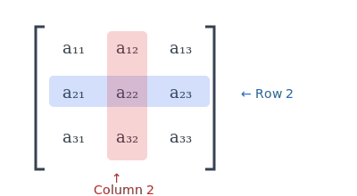
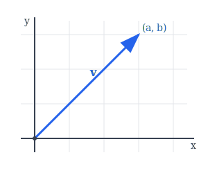
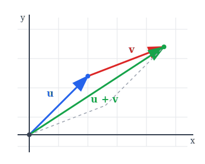
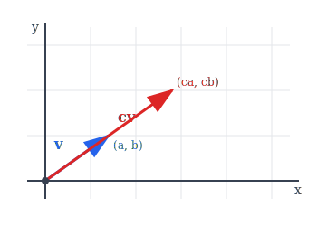

:::note
本系列文章內容參考自經典教材 **Elementary Linear Algebra (Pearson New International Edition)**。本文對應章節：**Section 1.1 Matrices and Vectors**。
:::

## **矩陣 (Matrix)**

### **定義**

**矩陣 (Matrix)** 是一個由純量 (Scalar) 組成的矩形陣列。若一個矩陣有 $m$ 列 (rows) 與 $n$ 行 (columns)，則稱該矩陣的**大小 (Size)** 為 $m \times n$（讀作「$m$ by $n$」）。

$$
A = \begin{bmatrix} a_{11} & a_{12} & \cdots & a_{1n} \\ a_{21} & a_{22} & \cdots & a_{2n} \\ \vdots & \vdots & \ddots & \vdots \\ a_{m1} & a_{m2} & \cdots & a_{mn} \end{bmatrix} = [a_{ij}] \in \mathcal{M}_{m \times n}
$$

其中 $\mathcal{M}_{m \times n}$ 表示所有大小為 $m \times n$ 的矩陣所構成的集合。

:::tip 關於「行」與「列」的釐清
剛開始學習線性代數時，常常搞混「行」和「列」。更麻煩的是，根據[維基百科](https://zh.wikipedia.org/zh-tw/%E8%A1%8C%E5%90%91%E9%87%8F%E8%88%87%E5%88%97%E5%90%91%E9%87%8F)所述，**中國大陸與台灣對「行」「列」的定義是相反的**：

|              | Row（橫向） | Column（縱向） |
| :----------: | :---------: | :------------: |
|   **台灣**   |     列      |       行       |
| **中國大陸** |     行      |       列       |

因此，**建議直接使用英文術語 Row 和 Column，避免混淆**：

- **Row**：橫向排列，像是一「排」座位
- **Column**：縱向排列，像是建築物的「柱子」

在數學符號中，$a_{ij}$ 表示第 $i$ 個 row、第 $j$ 個 column 的元素，這個順序是固定的：**先 row 後 column**。
:::

### **基本術語**

- **$(i, j)$-元素 ((i, j)-entry)**：位於第 $i$ 列、第 $j$ 行的純量 $a_{ij}$
- **方陣 (Square Matrix)**：當 $m = n$ 時，稱該矩陣為方陣
- **子矩陣 (Submatrix)**：從原矩陣中刪除若干列和/或若干行後所得到的矩陣

**範例**：

$$
B = \begin{bmatrix} 6 & 8 \\ 15 & 20 \\ 45 & 64 \end{bmatrix} \in \mathcal{M}_{3 \times 2}
$$

此矩陣 $B$ 的大小為 $3 \times 2$（3 列 2 行），其中 $b_{21} = 15$，$b_{32} = 64$。

 

## **矩陣的相等 (Equality of Matrices)**

兩個矩陣 $A$ 與 $B$ **相等 (Equal)**，若且唯若：

1. $A$ 與 $B$ 具有**相同的大小**
2. 所有對應位置的元素皆相等

$$
\text{令 } A, B \in \mathcal{M}_{m \times n}, \text{ 則 } A = B \Leftrightarrow a_{ij} = b_{ij}, \; \forall i = 1, \ldots, m, \; j = 1, \ldots, n
$$

**範例**：

$$
A = \begin{bmatrix} 6 & 8 \\ 15 & 20 \\ 45 & 64 \end{bmatrix}, \quad
B = \begin{bmatrix} 6 & 8 \\ 15 & 21 \\ 45 & 64 \end{bmatrix}, \quad
C = \begin{bmatrix} 6 & 8 \\ 15 & 20 \\ 45 & 64 \end{bmatrix}, \quad
D = \begin{bmatrix} 6 & 8 \\ 15 & 20 \\ 45 & 64 \\ 17 & 38 \end{bmatrix}
$$

- $A = C$（大小相同且所有元素相等）
- $A \neq B$（$a_{22} = 20 \neq 21 = b_{22}$）
- $A \neq D$（大小不同：$A$ 是 $3 \times 2$，$D$ 是 $4 \times 2$）

 

## **矩陣的基本運算**

### **矩陣加法 (Matrix Addition)**

若 $A$ 與 $B$ 皆為 $m \times n$ 矩陣，則其**和 (Sum)** $A + B$ 定義為：

$$
(A + B)_{ij} = a_{ij} + b_{ij}
$$

即對應位置的元素相加。

**範例**：

$$
\begin{bmatrix} 1 & 2 \\ 3 & 4 \\ 5 & 6 \end{bmatrix} + \begin{bmatrix} 1 & 1 \\ 1 & 1 \\ 1 & 2 \end{bmatrix} = \begin{bmatrix} 2 & 3 \\ 4 & 5 \\ 6 & 8 \end{bmatrix}
$$

### **純量乘法 (Scalar Multiplication)**

令 $A$ 為 $m \times n$ 矩陣，$c$ 為純量。**純量乘積 (Scalar Multiple)** $cA$ 定義為：

$$
(cA)_{ij} = c \cdot a_{ij}
$$

即矩陣中每個元素都乘以 $c$。

**範例**：

$$
3 \cdot \begin{bmatrix} 2 & 3 \\ 1 & 4 \\ -1 & 5 \end{bmatrix} = \begin{bmatrix} 6 & 9 \\ 3 & 12 \\ -3 & 15 \end{bmatrix}
$$

### **矩陣減法 (Matrix Subtraction)**

對於相同大小的矩陣 $A$ 與 $B$，其**差 (Difference)** 定義為：

$$
A - B = A + (-B) = A + (-1)B
$$

其中 $(A - B)_{ij} = a_{ij} - b_{ij}$。

 

## **零矩陣 (Zero Matrix)**

所有元素皆為 $0$ 的 $m \times n$ 矩陣稱為 **$m \times n$ 零矩陣**，記為 $O$ 或 $O_{m \times n}$。

$$
O_{2 \times 3} = \begin{bmatrix} 0 & 0 & 0 \\ 0 & 0 & 0 \end{bmatrix}
$$

**性質**：

- $A + O = O + A = A$（加法單位元素）
- $0 \cdot A = O$（任何矩陣乘以純量 0 得零矩陣）

:::caution 注意
不同大小的零矩陣雖然都記為 $O$，但它們是不同的矩陣。例如 $O_{2 \times 2}$ 與 $O_{3 \times 2}$ 是不同的零矩陣。
:::

 

## **定理 1.1：矩陣加法與純量乘法的性質**

令 $A$、$B$、$C$ 為 $m \times n$ 矩陣，$s$、$t$ 為純量，則：

| 性質 |            公式             |       名稱       |
| :--: | :-------------------------: | :--------------: |
| (a)  |       $A + B = B + A$       |    加法交換律    |
| (b)  | $(A + B) + C = A + (B + C)$ |    加法結合律    |
| (c)  |         $A + O = A$         |   加法單位元素   |
| (d)  |       $A + (-A) = O$        |    加法反元素    |
| (e)  |       $(st)A = s(tA)$       |  純量乘法結合律  |
| (f)  |    $s(A + B) = sA + sB$     | 分配律（對矩陣） |
| (g)  |    $(s + t)A = sA + tA$     | 分配律（對純量） |

 

## **轉置 (Transpose)**

### **定義**

一個 $m \times n$ 矩陣 $A$ 的**轉置 (Transpose)**，記為 $A^T$，是一個 $n \times m$ 矩陣，其 $(i, j)$-元素等於 $A$ 的 $(j, i)$-元素。

$$
(A^T)_{ij} = a_{ji}
$$

換言之，轉置操作將矩陣的列與行互換。

**範例**：

$$
C = \begin{bmatrix} 7 & 9 \\ 18 & 31 \\ 52 & 68 \end{bmatrix} \Rightarrow C^T = \begin{bmatrix} 7 & 18 & 52 \\ 9 & 31 & 68 \end{bmatrix}
$$

### **定理 1.2：轉置的性質**

令 $A$、$B$ 為 $m \times n$ 矩陣，$s$ 為純量，則：

| 性質 |          公式           |
| :--: | :---------------------: |
| (a)  | $(A + B)^T = A^T + B^T$ |
| (b)  |     $(sA)^T = sA^T$     |
| (c)  |      $(A^T)^T = A$      |

 

## **向量 (Vector)**

### **定義**

- **列向量 (Row Vector)**：只有一列的矩陣，即 $1 \times n$ 矩陣

  $$\begin{bmatrix} 1 & 2 & 3 & 4 \end{bmatrix}$$

- **行向量 (Column Vector)**：只有一行的矩陣，即 $m \times 1$ 矩陣

  $$\begin{bmatrix} 1 \\ 2 \\ 3 \\ 4 \end{bmatrix} \text{ 或等價地寫成 } \begin{bmatrix} 1 & 2 & 3 & 4 \end{bmatrix}^T$$

:::info 注意
在這本教材中，除非特別說明，**向量 (Vector)** 一詞**預設指的是 Column Vector**。
:::

### **向量空間 Rⁿ**

$\mathbb{R}^n$ 表示所有具有 $n$ 個實數分量的行向量所構成的集合：

$$
\mathbb{R}^n = \mathcal{M}_{n \times 1}
$$

對於向量 $\mathbf{v} \in \mathbb{R}^n$：

$$
\mathbf{v} = \begin{bmatrix} v_1 \\ v_2 \\ \vdots \\ v_n \end{bmatrix}
$$

其中 $v_i$ 稱為 $\mathbf{v}$ 的第 $i$ 個**分量 (Component)**。

### **零向量 (Zero Vector)**

所有分量皆為 $0$ 的向量稱為**零向量**，記為 $\mathbf{0}$。

$$
\mathbf{u} + \mathbf{0} = \mathbf{u}, \quad 0 \cdot \mathbf{u} = \mathbf{0}
$$

 

## **向量的幾何意義**

### **R² 中的向量**

在二維平面中，向量 $\mathbf{v} = \begin{bmatrix} a \\ b \end{bmatrix}$ 可視為從原點 $(0, 0)$ 指向點 $(a, b)$ 的有向線段。

### **向量加法的幾何意義**

兩個向量 $\mathbf{u}$ 與 $\mathbf{v}$ 的和 $\mathbf{u} + \mathbf{v}$ 可透過**平行四邊形法則**或**首尾相接法**來理解：

1. 將 $\mathbf{v}$ 的起點移至 $\mathbf{u}$ 的終點
2. 從原點到 $\mathbf{v}$ 新終點的向量即為 $\mathbf{u} + \mathbf{v}$

### **純量乘法的幾何意義**

純量 $c$ 與向量 $\mathbf{v}$ 的乘積 $c\mathbf{v}$：

- 當 $c > 1$ 時：向量被**拉長**
- 當 $0 < c < 1$ 時：向量被**縮短**
- 當 $c < 0$ 時：向量**反向**並依 $|c|$ 縮放

 

## **矩陣與向量的關係**

任何 $m \times n$ 矩陣 $C$ 都可以視為：

- $m$ 個**列向量**的堆疊
- $n$ 個**行向量**的並排

$$
C = \begin{bmatrix} \mathbf{c}_1 & \mathbf{c}_2 & \cdots & \mathbf{c}_n \end{bmatrix}
$$

其中每個 $\mathbf{c}_j$ 是一個 $m \times 1$ 的 column vector：

$$
\mathbf{c}_j = \begin{bmatrix} c_{1j} \\ c_{2j} \\ \vdots \\ c_{mj} \end{bmatrix}
$$

這種觀點在後續討論線性組合、column space、row space 等概念時非常重要。
