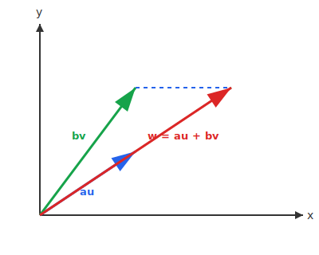
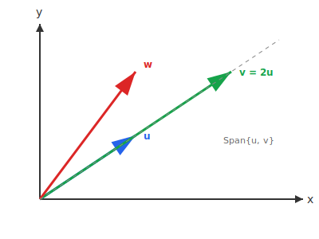
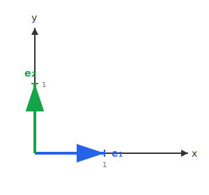
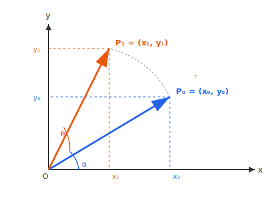

:::note
本系列文章內容參考自經典教材 **Elementary Linear Algebra (Pearson New International Edition)**。本文對應章節：**Ch1-2 Linear Combinations, Matrix–Vector Products, and Special Matrices**。
:::

## **線性組合 (Linear Combination)**

### **定義**

給定向量 $\mathbf{u}_1, \mathbf{u}_2, \ldots, \mathbf{u}_k$ 與純量 $c_1, c_2, \ldots, c_k$，則向量

$$
c_1 \mathbf{u}_1 + c_2 \mathbf{u}_2 + \cdots + c_k \mathbf{u}_k
$$

稱為 $\mathbf{u}_1, \mathbf{u}_2, \ldots, \mathbf{u}_k$ 的一個**線性組合 (Linear Combination)**。其中 $c_1, c_2, \ldots, c_k$ 稱為該線性組合的**係數 (Coefficients)**。

**範例**：

$$
\begin{bmatrix} 2 \\ 8 \end{bmatrix} = \colorbox{yellow}{$-3$} \begin{bmatrix} 1 \\ 1 \end{bmatrix} + \colorbox{yellow}{$4$} \begin{bmatrix} 1 \\ 3 \end{bmatrix} + \colorbox{yellow}{$1$} \begin{bmatrix} 1 \\ -1 \end{bmatrix}
$$

此處係數為 $\{-3, 4, 1\}$。

### **線性組合的幾何意義**

在 $\mathbb{R}^2$ 中，兩個向量 $\mathbf{u}$ 與 $\mathbf{v}$ 的線性組合 $a\mathbf{u} + b\mathbf{v}$ 可透過**平行四邊形法則 (Parallelogram Rule)** 來理解：

1. 分別將 $\mathbf{u}$ 縮放 $a$ 倍得到 $a\mathbf{u}$，將 $\mathbf{v}$ 縮放 $b$ 倍得到 $b\mathbf{v}$
2. 以 $a\mathbf{u}$ 與 $b\mathbf{v}$ 為鄰邊構成平行四邊形
3. 從原點指向平行四邊形對角頂點的向量，即為線性組合 $a\mathbf{u} + b\mathbf{v}$

### **如何求解線性組合的係數？**

給定係數，計算線性組合的結果是容易的。但反過來——給定目標向量，求解對應的係數——則需要解一個**線性方程組 (System of Linear Equations)**。

**範例**：判斷 $\begin{bmatrix} 4 \\ -1 \end{bmatrix}$ 是否為 $\begin{bmatrix} 2 \\ 3 \end{bmatrix}$ 與 $\begin{bmatrix} 3 \\ 1 \end{bmatrix}$ 的線性組合。

設 $x_1 \begin{bmatrix} 2 \\ 3 \end{bmatrix} + x_2 \begin{bmatrix} 3 \\ 1 \end{bmatrix} = \begin{bmatrix} 4 \\ -1 \end{bmatrix}$，展開得：

$$
\begin{cases}
2x_1 + 3x_2 = 4 \\
3x_1 + x_2 = -1
\end{cases}
$$

解得 $[x_1 \; x_2]^T = [-1 \; 2]^T$，因此該向量**可以**表示為給定向量的線性組合。

 

## **線性方程組的解的情況**

根據給定向量的幾何關係，線性方程組可能有三種解的情況：

|                 解的情況                 | 幾何意義                                             |
| :--------------------------------------: | :--------------------------------------------------- |
|       **唯一解 (Unique Solution)**       | 目標向量恰好落在給定向量張成的空間中，且表示方式唯一 |
| **無限多解 (Infinitely Many Solutions)** | 給定向量線性相依，目標向量可用多種方式表示           |
|          **無解 (No Solution)**          | 目標向量不在給定向量所能張成的空間中                 |

### **非平行向量可以表示 R² 中的任意向量**

若 $\mathbf{u}$ 與 $\mathbf{v}$ 是 $\mathbb{R}^2$ 中的**非平行向量 (Nonparallel Vectors)**（即 $\mathbf{u} \neq c\mathbf{v}$，且兩者皆非零向量），則 $\mathbb{R}^2$ 中的**每一個向量**都可以被**唯一地**表示為 $\mathbf{u}$ 與 $\mathbf{v}$ 的線性組合。換句話說，兩個非平行向量可以「涵蓋」整個二維平面。

:::tip 「無解」的幾何意義
當兩個向量 $\mathbf{u}$ 與 $\mathbf{v}$ **平行 (Parallel)** 時（即 $\mathbf{v} = c\mathbf{u}$，其中 $c$ 為某純量），它們的所有線性組合只能產生落在同一條直線上的向量。

若目標向量 $\mathbf{w}$ 不在這條直線上，則無論如何選擇係數，都無法將 $\mathbf{w}$ 表示為 $\mathbf{u}$ 與 $\mathbf{v}$ 的線性組合——此時方程組**無解**。

在上圖中，$\mathbf{u}$ 與 $\mathbf{v} = 2\mathbf{u}$ 平行，它們的所有線性組合只能產生虛線上的向量。目標向量 $\mathbf{w}$ 不在該直線上，因此無法被表示為 $\mathbf{u}$ 與 $\mathbf{v}$ 的線性組合。
:::

**範例**：判斷 $\begin{bmatrix} 3 \\ 4 \end{bmatrix}$ 是否為 $\begin{bmatrix} 3 \\ 2 \end{bmatrix}$ 與 $\begin{bmatrix} 6 \\ 4 \end{bmatrix}$ 的線性組合。

注意到 $\begin{bmatrix} 6 \\ 4 \end{bmatrix} = 2 \begin{bmatrix} 3 \\ 2 \end{bmatrix}$，兩向量平行。設方程組：

$$
\begin{cases}
3x_1 + 6x_2 = 3 \\
2x_1 + 4x_2 = 4
\end{cases}
$$

第一式除以 3 得 $x_1 + 2x_2 = 1$；第二式除以 2 得 $x_1 + 2x_2 = 2$。兩式矛盾，故**無解**。

 

## **標準向量 (Standard Vectors)**

### **定義**

在 $\mathbb{R}^n$ 中，**標準向量 (Standard Vectors)** $\mathbf{e}_1, \mathbf{e}_2, \ldots, \mathbf{e}_n$ 定義為：

$$
\mathbf{e}_1 = \begin{bmatrix} 1 \\ 0 \\ \vdots \\ 0 \end{bmatrix}, \quad
\mathbf{e}_2 = \begin{bmatrix} 0 \\ 1 \\ \vdots \\ 0 \end{bmatrix}, \quad \ldots, \quad
\mathbf{e}_n = \begin{bmatrix} 0 \\ 0 \\ \vdots \\ 1 \end{bmatrix}
$$

其中 $\mathbf{e}_i$ 的第 $i$ 個分量為 $1$，其餘分量皆為 $0$。

### **標準向量的重要性質**

$\mathbb{R}^n$ 中的任意向量 $\mathbf{v}$ 都可以**唯一地**表示為標準向量的線性組合：

$$
\mathbf{v} = \begin{bmatrix} v_1 \\ v_2 \\ \vdots \\ v_n \end{bmatrix} = v_1 \mathbf{e}_1 + v_2 \mathbf{e}_2 + \cdots + v_n \mathbf{e}_n
$$

換句話說，只要知道一個向量的各個分量，就能用標準向量把它「拼」出來。這也意味著標準向量是 $\mathbb{R}^n$ 中最基本、最自然的一組「建構單元」——在後續章節中，這種能夠表示空間中所有向量的向量組合，會被正式稱為**基底 (Basis)**。

 

## **矩陣與向量乘積 (Matrix–Vector Product)**

### **定義**

令 $A$ 為 $m \times n$ 矩陣，$\mathbf{v}$ 為 $n \times 1$ 向量。**矩陣與向量乘積 (Matrix–Vector Product)** $A\mathbf{v}$ 定義為 $A$ 的 column vectors 以 $\mathbf{v}$ 的分量為係數的**線性組合**：

$$
A\mathbf{v} = v_1 \mathbf{a}_1 + v_2 \mathbf{a}_2 + \cdots + v_n \mathbf{a}_n
$$

其中 $\mathbf{a}_1, \mathbf{a}_2, \ldots, \mathbf{a}_n$ 為 $A$ 的 column vectors，$v_1, v_2, \ldots, v_n$ 為 $\mathbf{v}$ 的分量。

等價地，可以寫成：

$$
A\mathbf{v} = \begin{bmatrix} \mathbf{a}_1 & \mathbf{a}_2 & \cdots & \mathbf{a}_n \end{bmatrix} \begin{bmatrix} v_1 \\ v_2 \\ \vdots \\ v_n \end{bmatrix}
$$

:::info 矩陣向量乘積的直觀理解
可以將矩陣 $A$ 想像成 $n$ 個 column vectors 的集合，向量 $\mathbf{v}$ 想像成 $n$ 個係數。則 $A\mathbf{v}$ 就是這 $n$ 個 column vectors 的線性組合，其中第 $i$ 個 column vector 的係數為 $v_i$。

這個觀點在理解線性變換、column space 等概念時非常有用。
:::

### **逐元素計算**

矩陣向量乘積的第 $i$ 個分量等於 $A$ 的第 $i$ 個 row 與 $\mathbf{v}$ 的**內積**：

$$
(A\mathbf{v})_i = a_{i1}v_1 + a_{i2}v_2 + \cdots + a_{in}v_n = \sum_{j=1}^{n} a_{ij}v_j
$$

**範例**：

$$
A\mathbf{v} = \begin{bmatrix} 1 & 2 \\ 3 & 4 \\ 5 & 6 \end{bmatrix} \begin{bmatrix} 7 \\ 8 \end{bmatrix} = 7 \begin{bmatrix} 1 \\ 3 \\ 5 \end{bmatrix} + 8 \begin{bmatrix} 2 \\ 4 \\ 6 \end{bmatrix} = \begin{bmatrix} 7 \\ 21 \\ 35 \end{bmatrix} + \begin{bmatrix} 16 \\ 32 \\ 48 \end{bmatrix} = \begin{bmatrix} 23 \\ 53 \\ 83 \end{bmatrix}
$$

### **基本性質**

對於任意矩陣 $A$ 與向量 $\mathbf{v}$：

- $A\mathbf{0} = \mathbf{0}$（矩陣乘以零向量得零向量）
- $O\mathbf{v} = \mathbf{0}$（零矩陣乘以任意向量得零向量）

 

## **單位矩陣 (Identity Matrix)**

### **定義**

對於每個正整數 $n$，$n \times n$ **單位矩陣 (Identity Matrix)** $I_n$ 是以標準向量 $\mathbf{e}_1, \mathbf{e}_2, \ldots, \mathbf{e}_n$ 為 column vectors 的方陣：

$$
I_2 = \begin{bmatrix} 1 & 0 \\ 0 & 1 \end{bmatrix}, \quad
I_3 = \begin{bmatrix} 1 & 0 & 0 \\ 0 & 1 & 0 \\ 0 & 0 & 1 \end{bmatrix}
$$

### **核心性質**

對於任意 $\mathbf{v} \in \mathbb{R}^n$：

$$
I_n \mathbf{v} = \mathbf{v}
$$

**證明**：

$$
I_n \mathbf{v} = v_1 \mathbf{e}_1 + v_2 \mathbf{e}_2 + \cdots + v_n \mathbf{e}_n = \begin{bmatrix} v_1 \\ v_2 \\ \vdots \\ v_n \end{bmatrix} = \mathbf{v}
$$

單位矩陣在矩陣乘法中扮演的角色，類似於數字 $1$ 在實數乘法中的角色——它是**乘法單位元素**。

 

## **隨機矩陣 (Stochastic Matrix)**

### **定義**

一個方陣稱為**隨機矩陣 (Stochastic Matrix)**（或**機率矩陣**），若：

1. 所有元素皆為**非負數**
2. 每一 **column** 的元素和為 $1$

隨機矩陣常用於描述**馬可夫鏈 (Markov Chain)** 中的狀態轉移機率。

**範例**：人口遷移模型

$$
A = \begin{bmatrix} 0.85 & 0.03 \\ 0.15 & 0.97 \end{bmatrix}
$$

此矩陣描述城市與郊區之間的人口遷移機率：

- $a_{11} = 0.85$：城市居民留在城市的機率
- $a_{21} = 0.15$：城市居民遷往郊區的機率
- $a_{12} = 0.03$：郊區居民遷往城市的機率
- $a_{22} = 0.97$：郊區居民留在郊區的機率

若當前人口分布為 $\mathbf{p} = \begin{bmatrix} 500 \\ 700 \end{bmatrix}$（千人），則下一年的人口分布為：

$$
A\mathbf{p} = \begin{bmatrix} 0.85 & 0.03 \\ 0.15 & 0.97 \end{bmatrix} \begin{bmatrix} 500 \\ 700 \end{bmatrix} = \begin{bmatrix} 446 \\ 754 \end{bmatrix}
$$

 

## **旋轉矩陣 (Rotation Matrix)**

### **定義**

$\theta$**-旋轉矩陣 (θ-Rotation Matrix)** $A_\theta$ 定義為：

$$
A_\theta = \begin{bmatrix} \cos\theta & -\sin\theta \\ \sin\theta & \cos\theta \end{bmatrix}
$$

此矩陣將 $\mathbb{R}^2$ 中的向量**逆時針旋轉** $\theta$ 角度。

### **推導過程**

設原始點 $P_0 = (x_0, y_0)$ 與原點的距離為 $r$，與 $x$ 軸的夾角為 $\alpha$。則：

$$
x_0 = r\cos\alpha, \quad y_0 = r\sin\alpha
$$

將 $P_0$ 逆時針旋轉 $\theta$ 角度後得到 $P_1 = (x_1, y_1)$，其與 $x$ 軸的夾角為 $\alpha + \theta$：

$$
\begin{aligned}
x_1 &= r\cos(\alpha + \theta) = r(\cos\alpha\cos\theta - \sin\alpha\sin\theta) \\
&= (r\cos\alpha)\cos\theta - (r\sin\alpha)\sin\theta \\
&= x_0\cos\theta - y_0\sin\theta
\end{aligned}
$$

$$
\begin{aligned}
y_1 &= r\sin(\alpha + \theta) = r(\sin\alpha\cos\theta + \cos\alpha\sin\theta) \\
&= (r\sin\alpha)\cos\theta + (r\cos\alpha)\sin\theta \\
&= y_0\cos\theta + x_0\sin\theta
\end{aligned}
$$

整理成矩陣形式：

$$
\begin{bmatrix} x_1 \\ y_1 \end{bmatrix} = \begin{bmatrix} \cos\theta & -\sin\theta \\ \sin\theta & \cos\theta \end{bmatrix} \begin{bmatrix} x_0 \\ y_0 \end{bmatrix}
$$

:::tip 我的記憶方式
我個人覺得這個公式用以下方式記比較方便：

旋轉矩陣的兩個 column vectors，其實就是標準向量 $(1, 0)$ 和 $(0, 1)$ 各自旋轉 $\theta$ 角度後的結果。

- **第一個 column**：$(1, 0)$ 旋轉 $\theta$ 後變成 $(\cos\theta, \sin\theta)$
- **第二個 column**：$(0, 1)$ 旋轉 $\theta$ 後變成 $(-\sin\theta, \cos\theta)$

把這兩個結果作為 column vectors 排列起來，就是旋轉矩陣：

$$
A_\theta = \begin{bmatrix} \cos\theta & -\sin\theta \\ \sin\theta & \cos\theta \end{bmatrix}
$$

:::

### **特殊角度的旋轉矩陣**

|      角度       |                       旋轉矩陣                       |
| :-------------: | :--------------------------------------------------: |
|  $\theta = 0°$  | $\begin{bmatrix} 1 & 0 \\ 0 & 1 \end{bmatrix} = I_2$ |
| $\theta = 90°$  |   $\begin{bmatrix} 0 & -1 \\ 1 & 0 \end{bmatrix}$    |
| $\theta = 180°$ |   $\begin{bmatrix} -1 & 0 \\ 0 & -1 \end{bmatrix}$   |
| $\theta = 270°$ |   $\begin{bmatrix} 0 & 1 \\ -1 & 0 \end{bmatrix}$    |
