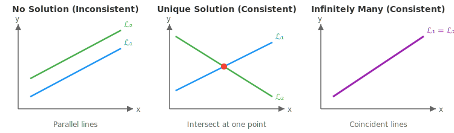

:::note
本系列文章內容參考自經典教材 **Elementary Linear Algebra (Pearson New International Edition)**。本文對應章節：**Ch1-3 Systems of Linear Equations**。
:::

## **線性方程式 (Linear Equation)**

### **定義**

一個**線性方程式 (Linear Equation)** 是形如

$$
a_1 x_1 + a_2 x_2 + \cdots + a_n x_n = b
$$

的方程式，其中：

- $x_1, x_2, \ldots, x_n$ 為**變數 (Variables)**
- $a_1, a_2, \ldots, a_n$ 為**係數 (Coefficients)**
- $b$ 為**常數項 (Constant Term)**

線性方程式的特徵是：每個變數的次方都是 $1$，且變數之間沒有相乘。

**範例**：

- $2x + 3y = 5$ ✓ 線性方程式
- $3x + y - z = 2$ ✓ 線性方程式
- $x^2 + y = 1$ ✗ 非線性（$x$ 的次方為 $2$）
- $xy + z = 3$ ✗ 非線性（$x$ 與 $y$ 相乘）

 

## **線性方程組 (System of Linear Equations)**

### **定義**

一個**線性方程組 (System of Linear Equations)** 是由多個線性方程式組成的集合。一般形式為 $m$ 個方程式、$n$ 個變數：

$$
\begin{aligned}
a_{11}x_1 + a_{12}x_2 + \cdots + a_{1n}x_n &= b_1 \\
a_{21}x_1 + a_{22}x_2 + \cdots + a_{2n}x_n &= b_2 \\
&\vdots \\
a_{m1}x_1 + a_{m2}x_2 + \cdots + a_{mn}x_n &= b_m
\end{aligned}
$$

### **解 (Solution) 與解集合 (Solution Set)**

線性方程組的一個**解 (Solution)** 是一個向量 $\mathbf{s} = \begin{bmatrix} s_1 \\ s_2 \\ \vdots \\ s_n \end{bmatrix} \in \mathbb{R}^n$，使得將 $x_i = s_i$ 代入每一個方程式後，所有方程式都成立。

所有解的集合稱為**解集合 (Solution Set)**：

$$
\text{Solution Set} = \left\{ \begin{bmatrix} x_1 \\ x_2 \\ \vdots \\ x_n \end{bmatrix} \in \mathbb{R}^n \;\middle|\; x_1, x_2, \ldots, x_n \text{ 滿足所有方程式} \right\}
$$

**範例**：考慮方程組

$$
\begin{cases}
0.80x_1 + 0.60x_2 + 0.40x_3 = 5 \\
0.20x_1 + 0.40x_2 + 0.60x_3 = 3
\end{cases}
$$

向量 $\begin{bmatrix} 2 \\ 5 \\ 1 \end{bmatrix}$ 是一個解，因為：

$$
\begin{aligned}
0.80(2) + 0.60(5) + 0.40(1) &= 1.6 + 3.0 + 0.4 = 5 \quad \checkmark \\
0.20(2) + 0.40(5) + 0.60(1) &= 0.4 + 2.0 + 0.6 = 3 \quad \checkmark
\end{aligned}
$$

 

## **Ax = b 與聯立方程式的關係**

:::tip 如何理解 Ax = b？—— x 的雙重身份
在上一篇中，我們學到矩陣向量乘積 $A\mathbf{x}$ 是「以 $\mathbf{x}$ 的分量為係數，對 $A$ 的 column vectors 做線性組合」。在那個情境下，$\mathbf{x}$ 扮演的是**係數**的角色。

但在這一篇的線性方程組 $A\mathbf{x} = \mathbf{b}$ 中，$\mathbf{x}$ 又變成了「要求的解」。這兩個角色乍看之下很不一樣，但其實是同一件事：

**我的理解方式**：

想像你有一組向量（$A$ 的 column vectors），你想知道「要用什麼係數來組合它們，才能湊出目標向量 $\mathbf{b}$」。這些係數就是 $\mathbf{x}$ 的各個分量。

- 從「線性組合」的角度：$\mathbf{x}$ 是係數
- 從「聯立方程式」的角度：$\mathbf{x}$ 是解

這兩個角度描述的是同一個東西！當我們「求解」$\mathbf{x}$ 時，其實就是在找「能讓 $A$ 的 column vectors 組合出 $\mathbf{b}$ 的係數」。
:::

將線性方程組寫成矩陣形式：

$$
\underbrace{\begin{bmatrix} a_{11} & a_{12} & \cdots & a_{1n} \\ a_{21} & a_{22} & \cdots & a_{2n} \\ \vdots & \vdots & \ddots & \vdots \\ a_{m1} & a_{m2} & \cdots & a_{mn} \end{bmatrix}}_{A} \underbrace{\begin{bmatrix} x_1 \\ x_2 \\ \vdots \\ x_n \end{bmatrix}}_{\mathbf{x}} = \underbrace{\begin{bmatrix} b_1 \\ b_2 \\ \vdots \\ b_m \end{bmatrix}}_{\mathbf{b}}
$$

這就是著名的 $A\mathbf{x} = \mathbf{b}$ 形式，其中：

- $A$ 稱為**係數矩陣 (Coefficient Matrix)**，大小為 $m \times n$
- $\mathbf{x}$ 稱為**變數向量 (Variable Vector)**，大小為 $n \times 1$
- $\mathbf{b}$ 稱為**常數向量 (Constant Vector)**，大小為 $m \times 1$

 

## **Consistent 與 Inconsistent**

### **定義**

根據解的存在性，線性方程組可分為兩類：

|            分類            | 定義                   | 解的情況           |
| :------------------------: | :--------------------- | :----------------- |
|   **Consistent（相容）**   | 方程組**至少有一個解** | 唯一解 或 無限多解 |
| **Inconsistent（不相容）** | 方程組**沒有任何解**   | 無解               |

:::info Consistent 與解的數量
**Consistent** 只表示「有解」，但不區分是唯一解還是無限多解。

- **Consistent + 唯一解**：恰好有一個解
- **Consistent + 無限多解**：有無窮多個解
- **Inconsistent**：解集合為空集 $\emptyset$
  :::

### **範例比較**

|                             方程組                              |                                                        解集合                                                        |          分類          |
| :-------------------------------------------------------------: | :------------------------------------------------------------------------------------------------------------------: | :--------------------: |
|  $\begin{cases} 3x_1 + x_2 = 10 \\ x_1 - 3x_2 = 0 \end{cases}$  |                               $\left\{ \begin{bmatrix} 3 \\ 1 \end{bmatrix} \right\}$                                |  Consistent（唯一解）  |
| $\begin{cases} 3x_1 + x_2 = 10 \\ 6x_1 + 2x_2 = 20 \end{cases}$ | $\left\{ \begin{bmatrix} 3 \\ 1 \end{bmatrix} + t \begin{bmatrix} -1 \\ 3 \end{bmatrix} : t \in \mathbb{R} \right\}$ | Consistent（無限多解） |
| $\begin{cases} 3x_1 + x_2 = 10 \\ 6x_1 + 2x_2 = 0 \end{cases}$  |                                                     $\emptyset$                                                      |  Inconsistent（無解）  |

 

## **二元一次方程組的幾何意義**

在 $\mathbb{R}^2$ 中，每個線性方程式 $ax + by = c$ 代表一條**直線**。兩個方程式組成的方程組，其解就是兩條直線的**交點**。

上圖展示了二元一次方程組的三種幾何情況：

- **無解**：兩條直線平行但不重合，永遠不會相交
- **唯一解**：兩條直線相交於一點，該點即為唯一解
- **無限多解**：兩條直線完全重合，直線上的每一點都是解

 

## **等價方程組 (Equivalent Systems)**

### **定義**

兩個線性方程組稱為**等價 (Equivalent)**，若且唯若它們具有**完全相同的解集合**。

**範例**：

|                           方程組 A                            |                            方程組 B                             |                         解集合                          | 等價？ |
| :-----------------------------------------------------------: | :-------------------------------------------------------------: | :-----------------------------------------------------: | :----: |
| $\begin{cases} 3x_1 + x_2 = 10 \\ x_1 - 3x_2 = 0 \end{cases}$ |     $\begin{cases} 3x_1 + x_2 = 10 \\ x_1 = 3 \end{cases}$      | $\left\{ \begin{bmatrix} 3 \\ 1 \end{bmatrix} \right\}$ | ✓ Yes  |
| $\begin{cases} 3x_1 + x_2 = 10 \\ x_1 - 3x_2 = 0 \end{cases}$ | $\begin{cases} 3x_1 + x_2 = 10 \\ 6x_1 + 2x_2 = 20 \end{cases}$ |                          不同                           |  ✗ No  |

等價方程組的重要性在於：我們可以將複雜的方程組**轉換**成較簡單的等價方程組來求解，而不改變解集合。

 

## **增廣矩陣 (Augmented Matrix)**

### **定義**

將係數矩陣 $A$ 與常數向量 $\mathbf{b}$ 合併成一個矩陣，稱為**增廣矩陣 (Augmented Matrix)**，記作 $[A \mid \mathbf{b}]$：

$$
[A \mid \mathbf{b}] = \begin{bmatrix} a_{11} & a_{12} & \cdots & a_{1n} & b_1 \\ a_{21} & a_{22} & \cdots & a_{2n} & b_2 \\ \vdots & \vdots & \ddots & \vdots & \vdots \\ a_{m1} & a_{m2} & \cdots & a_{mn} & b_m \end{bmatrix}
$$

增廣矩陣的大小為 $m \times (n+1)$。

**範例**：方程組

$$
\begin{cases}
x_1 - 2x_2 - x_3 = 3 \\
3x_1 - 6x_2 - 5x_3 = 3 \\
2x_1 - x_2 + x_3 = 0
\end{cases}
$$

對應的增廣矩陣為：

$$
[A \mid \mathbf{b}] = \left[\begin{array}{ccc|c} 1 & -2 & -1 & 3 \\ 3 & -6 & -5 & 3 \\ 2 & -1 & 1 & 0 \end{array}\right]
$$

 

## **基本列運算 (Elementary Row Operations)**

### **定義**

對矩陣進行以下三種操作，稱為**基本列運算 (Elementary Row Operations)**：

|            類型            | 操作                         |             符號             |
| :------------------------: | :--------------------------- | :--------------------------: |
|  **Interchange（交換）**   | 交換任意兩列的位置           |  $R_i \leftrightarrow R_j$   |
|    **Scaling（縮放）**     | 將某一列乘以一個**非零**純量 | $kR_i \to R_i$（$k \neq 0$） |
| **Row Addition（列加法）** | 將某一列的倍數加到另一列     |     $R_i + kR_j \to R_i$     |

### **重要性質**

1. **可逆性 (Reversibility)**：每種基本列運算都是可逆的

   - 交換：再交換一次即可還原
   - 縮放：乘以 $k$ 後，再乘以 $\frac{1}{k}$ 即可還原
   - 列加法：加上 $k$ 倍後，再加上 $-k$ 倍即可還原

2. **保持等價性**：對增廣矩陣進行基本列運算，得到的新方程組與原方程組**等價**

$$
A\mathbf{x} = \mathbf{b} \quad \xleftrightarrow{\text{elementary row operations}} \quad A'\mathbf{x} = \mathbf{b}'
$$

### **範例：使用基本列運算求解方程組**

$$
\begin{cases}
3x_1 + x_2 = 10 \\
x_1 - 3x_2 = 0
\end{cases}
$$

$$
\begin{bmatrix} 3 & 1 & 10 \\ 1 & -3 & 0 \end{bmatrix} \xrightarrow{R_1 \leftrightarrow R_2} \begin{bmatrix} 1 & -3 & 0 \\ 3 & 1 & 10 \end{bmatrix} \xrightarrow{R_2 - 3R_1} \begin{bmatrix} 1 & -3 & 0 \\ 0 & 10 & 10 \end{bmatrix} \xrightarrow{\frac{1}{10}R_2} \begin{bmatrix} 1 & -3 & 0 \\ 0 & 1 & 1 \end{bmatrix}
$$

從最後的矩陣可讀出 $x_2 = 1$，代回得 $x_1 = 3$。

 

## **列梯形式 (Row Echelon Form)**

### **定義**

一個矩陣稱為**列梯形式 (Row Echelon Form, REF)**，若滿足以下三個條件：

1. 所有**全零列**都在矩陣的最下方
2. 每個非零列的**領導元素 (Leading Entry)**（即該列最左邊的非零元素）所在的 column，必須在上一列領導元素的**右邊**
3. 若某 column 包含某列的領導元素，則該領導元素**下方**的所有元素都是 $0$

:::info 領導元素 (Leading Entry)
**領導元素**是指每一個非零列中，最左邊的非零元素。它也常被稱為 **pivot（主元）**。
:::

### **列梯形式的視覺特徵**

列梯形式的矩陣呈現「階梯狀」結構，領導元素形成一個從左上到右下的階梯：

$$
\begin{bmatrix} \boxed{1} & * & * & * & * \\ 0 & \boxed{1} & * & * & * \\ 0 & 0 & 0 & \boxed{1} & * \\ 0 & 0 & 0 & 0 & 0 \end{bmatrix}
$$

其中 $\boxed{1}$ 表示領導元素（不一定是 $1$），$*$ 表示任意數。

 

## **簡化列梯形式 (Reduced Row Echelon Form)**

### **為什麼需要 RREF？**

列梯形式 (REF) 雖然已經很有結構，但要從中讀出解仍需要**回代 (Back Substitution)**——從最後一列往上逐步求解。

簡化列梯形式 (RREF) 的優點是：解可以**直接讀出來**，不需要回代。這是因為 RREF 要求領導元素上下都是 $0$，使得每個 basic variable 都能獨立表示。

### **定義**

一個矩陣稱為**簡化列梯形式 (Reduced Row Echelon Form, RREF)**，若滿足列梯形式的三個條件，再加上：

4. 若某 column 包含某列的領導元素，則該 column 的**所有其他元素**都是 $0$
5. 每個非零列的領導元素都是 $1$

### **REF vs RREF 比較**

$$
\text{REF: } \begin{bmatrix} 1 & 7 & 2 & -3 & 9 & 4 \\ 0 & 0 & 1 & 4 & 6 & 8 \\ 0 & 0 & 0 & \colorbox{pink}{$2$} & 3 & 5 \\ 0 & 0 & 0 & 0 & 0 & 0 \\ 0 & 0 & 0 & 0 & 0 & 0 \end{bmatrix} \quad \text{RREF: } \begin{bmatrix} 1 & * & 0 & 0 & * \\ 0 & 0 & 1 & 0 & * \\ 0 & 0 & 0 & 1 & * \\ 0 & 0 & 0 & 0 & 0 \end{bmatrix}
$$

左邊的矩陣是 REF 但不是 RREF（第三列的領導元素是 $2$ 而非 $1$，且領導元素上方有非零元素）。

### **RREF 的唯一性**

:::tip Theorem 1.4
每個矩陣都可以透過有限次基本列運算，轉換成**唯一**的簡化列梯形式。

雖然將矩陣轉換成 RREF 的過程（即列運算的順序）可能不唯一，但最終得到的 RREF 是唯一的。
:::

 

## **Basic Variables 與 Free Variables**

### **定義**

將增廣矩陣化為 RREF 後：

- **Basic Variables（基本變數）**：對應到**領導元素所在 column**的變數
- **Free Variables（自由變數）**：對應到**非領導元素 column**的變數

:::tip 如何判斷 Basic 與 Free Variables？
我的記憶方式：

1. 先把增廣矩陣化成 RREF
2. 找出所有領導元素（每列最左邊的 $1$）
3. 領導元素所在的 **column** 對應的變數 → **Basic Variable**
4. 其他 column 對應的變數 → **Free Variable**

簡單來說：**有 pivot 的 column 是 basic，沒有 pivot 的 column 是 free**。
:::

### **範例**

考慮 RREF：

$$
\left[\begin{array}{ccccc|c} \boxed{1} & -3 & 0 & 2 & 0 & 7 \\ 0 & 0 & \boxed{1} & 6 & 0 & 9 \\ 0 & 0 & 0 & 0 & \boxed{1} & 2 \\ 0 & 0 & 0 & 0 & 0 & 0 \end{array}\right]
$$

- **領導元素**在第 $1, 3, 5$ 個 column
- **Basic Variables**：$x_1, x_3, x_5$
- **Free Variables**：$x_2, x_4$

對應的方程組：

$$
\begin{cases}
x_1 - 3x_2 + 2x_4 = 7 \\
x_3 + 6x_4 = 9 \\
x_5 = 2
\end{cases}
$$

將 basic variables 用 free variables 表示：

$$
\begin{cases}
x_1 = 7 + 3x_2 - 2x_4 \\
x_3 = 9 - 6x_4 \\
x_5 = 2
\end{cases}
$$

### **Free Variables 與解的數量**

| Free Variables 數量 | 解的情況                                  |
| :-----------------: | :---------------------------------------- |
|       $0$ 個        | **唯一解**（所有變數都由方程式唯一決定）  |
|     $\geq 1$ 個     | **無限多解**（free variables 可取任意值） |

 

## **通解 (General Solution)**

當方程組有無限多解時，我們用 free variables 作為**參數**來表示所有解。

### **範例**

承上例，令 $x_2 = s$，$x_4 = t$（$s, t \in \mathbb{R}$），則通解為：

$$
\mathbf{x} = \begin{bmatrix} x_1 \\ x_2 \\ x_3 \\ x_4 \\ x_5 \end{bmatrix} = \begin{bmatrix} 7 + 3s - 2t \\ s \\ 9 - 6t \\ t \\ 2 \end{bmatrix} = \begin{bmatrix} 7 \\ 0 \\ 9 \\ 0 \\ 2 \end{bmatrix} + s \begin{bmatrix} 3 \\ 1 \\ 0 \\ 0 \\ 0 \end{bmatrix} + t \begin{bmatrix} -2 \\ 0 \\ -6 \\ 1 \\ 0 \end{bmatrix}
$$

這個表示法清楚地展示了解的結構：一個**特解**加上 free variables 的**線性組合**。

 

## **判斷 Inconsistent 的方法**

### **關鍵特徵**

當增廣矩陣化為 REF 或 RREF 後，若出現形如

$$
\begin{bmatrix} 0 & 0 & \cdots & 0 & c \end{bmatrix} \quad \text{其中 } c \neq 0
$$

的列，則方程組**無解 (Inconsistent)**。

這是因為該列對應的方程式為 $0 = c$（$c \neq 0$），這是一個矛盾。

### **範例**

$$
\left[\begin{array}{ccc|c} 1 & 0 & -3 & 0 \\ 0 & 1 & 2 & 0 \\ 0 & 0 & 0 & \colorbox{pink}{$1$} \\ 0 & 0 & 0 & 0 \end{array}\right]
$$

第三列對應 $0x_1 + 0x_2 + 0x_3 = 1$，即 $0 = 1$，矛盾！

因此原方程組 **Inconsistent**，無解。

 

## **求解 Ax = b 的一般步驟**

:::info Theorem 1.4：求解線性方程組的標準流程

1. 寫出增廣矩陣 $[A \mid \mathbf{b}]$
2. 使用基本列運算，將增廣矩陣化為 RREF $[R \mid \mathbf{c}]$
3. **判斷解的存在性**：
   - 若 $[R \mid \mathbf{c}]$ 包含形如 $[0 \; 0 \; \cdots \; 0 \mid c]$（$c \neq 0$）的列 → **無解**
4. **若有解**，寫出對應的方程組，將 basic variables 用 free variables 表示，得到通解
   :::

### **為什麼這個方法有效？**

這個解法的核心思想是：透過基本列運算，將原方程組轉換成**等價但更簡單**的方程組。

回憶一下基本列運算的三種操作：

- **交換兩列**：相當於交換兩個方程式的順序，不影響解
- **某列乘以非零常數**：相當於方程式兩邊同乘，不影響解
- **某列加上另一列的倍數**：相當於用一個方程式消去另一個方程式中的某個變數，不影響解

這三種操作都**保持解集合不變**，所以最終得到的 RREF 與原方程組有相同的解。而 RREF 的結構讓我們可以直接讀出解。

### **完整範例**

求解方程組：

$$
\begin{cases}
x_1 - 2x_2 - x_3 = 3 \\
3x_1 - 6x_2 - 5x_3 = 3 \\
2x_1 - x_2 + x_3 = 0
\end{cases}
$$

**Step 1**：寫出增廣矩陣

$$
\left[\begin{array}{ccc|c} 1 & -2 & -1 & 3 \\ 3 & -6 & -5 & 3 \\ 2 & -1 & 1 & 0 \end{array}\right]
$$

**Step 2**：化為 RREF

$$
\xrightarrow{R_2 - 3R_1, \; R_3 - 2R_1} \left[\begin{array}{ccc|c} 1 & -2 & -1 & 3 \\ 0 & 0 & -2 & -6 \\ 0 & 3 & 3 & -6 \end{array}\right] \xrightarrow{R_2 \leftrightarrow R_3} \left[\begin{array}{ccc|c} 1 & -2 & -1 & 3 \\ 0 & 3 & 3 & -6 \\ 0 & 0 & -2 & -6 \end{array}\right]
$$

$$
\xrightarrow{\frac{1}{3}R_2, \; -\frac{1}{2}R_3} \left[\begin{array}{ccc|c} 1 & -2 & -1 & 3 \\ 0 & 1 & 1 & -2 \\ 0 & 0 & 1 & 3 \end{array}\right] \xrightarrow{R_1 + R_3, \; R_2 - R_3} \left[\begin{array}{ccc|c} 1 & -2 & 0 & 6 \\ 0 & 1 & 0 & -5 \\ 0 & 0 & 1 & 3 \end{array}\right]
$$

$$
\xrightarrow{R_1 + 2R_2} \left[\begin{array}{ccc|c} 1 & 0 & 0 & -4 \\ 0 & 1 & 0 & -5 \\ 0 & 0 & 1 & 3 \end{array}\right]
$$

**Step 3**：判斷解的存在性

沒有 $[0 \; 0 \; 0 \mid c]$（$c \neq 0$）的列，所以有解。

**Step 4**：讀出解

$$
\mathbf{x} = \begin{bmatrix} x_1 \\ x_2 \\ x_3 \end{bmatrix} = \begin{bmatrix} -4 \\ -5 \\ 3 \end{bmatrix}
$$

這是**唯一解**（沒有 free variables）。
