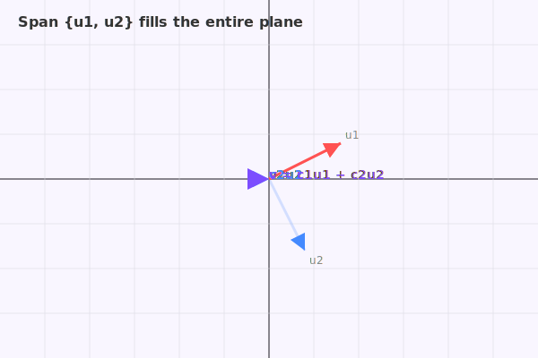
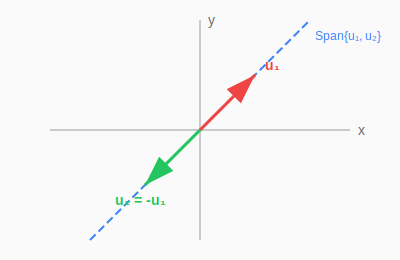

:::note
本系列文章內容參考自經典教材 **Elementary Linear Algebra (Pearson New International Edition)**。本文對應章節：**Ch1-6 The Span of a Set of Vectors**。
:::

## **什麼是 Span？**

### **直觀理解**

給定一組向量，對它們進行任意的**縮放**（乘以純量）和**相加**，所有能產生的向量就構成了這組向量的 **Span**。

Span 描述的是：**一組向量能夠「張成」多大的空間**。

### **嚴格定義**

:::info Definition: Span
對於 $\mathbb{R}^n$ 中的非空向量集合 $\mathcal{S} = \{\mathbf{u}_1, \mathbf{u}_2, \ldots, \mathbf{u}_k\}$，我們定義 $\mathcal{S}$ 的 **Span（生成空間）** 為所有 $\mathbf{u}_1, \mathbf{u}_2, \ldots, \mathbf{u}_k$ 的**線性組合**所構成的集合：

$$
\boxed{\text{Span } \mathcal{S} = \{c_1\mathbf{u}_1 + c_2\mathbf{u}_2 + \cdots + c_k\mathbf{u}_k : c_1, c_2, \ldots, c_k \in \mathbb{R}\}}
$$

也可以寫成 $\text{Span}\{\mathbf{u}_1, \mathbf{u}_2, \ldots, \mathbf{u}_k\}$。
:::

**簡單來說**：Span 就是「用這些向量能組合出的所有可能結果」的集合。

:::tip Span 是名詞還是動詞？
**兩者皆可！**

- **作為名詞**：$\text{Span } \mathcal{S}$ 是一個**集合**，代表由 $\mathcal{S}$ 中向量線性組合所張成的空間
- **作為動詞**：「向量 $\mathbf{u}_1, \mathbf{u}_2$ **span** 一個平面」表示這些向量的線性組合構成了該平面

因此「span 出的空間」這種說法是正確的，span 在此作為動詞，意思是「張成」或「生成」。
:::

 

## **Span 的幾何意義**

### **單一向量的 Span：直線**

如果 $\mathcal{S}$ 只包含一個非零向量 $\mathbf{u}$，那麼：

$$
\text{Span}\{\mathbf{u}\} = \{c\mathbf{u} : c \in \mathbb{R}\}
$$

這是所有 $\mathbf{u}$ 的純量倍數，幾何上就是一條**通過原點**、方向為 $\mathbf{u}$ 的**直線**。

上圖展示了向量 $\mathbf{u}$ 的 Span：所有 $c\mathbf{u}$（$c \in \mathbb{R}$）構成一條通過原點的直線。圖中的 $0.5\mathbf{u}$ 和 $-0.5\mathbf{u}$ 都是這條直線上的點。

### **兩個非平行向量的 Span：平面**

如果 $\mathcal{S}$ 包含兩個**非平行**（non-parallel）的向量 $\mathbf{u}_1$ 和 $\mathbf{u}_2$，那麼：

$$
\text{Span}\{\mathbf{u}_1, \mathbf{u}_2\} = \{c_1\mathbf{u}_1 + c_2\mathbf{u}_2 : c_1, c_2 \in \mathbb{R}\}
$$

這是一個**通過原點的平面**。平面上的任意向量 $\mathbf{v}$ 都可以表示為 $\mathbf{u}_1$ 和 $\mathbf{u}_2$ 的線性組合。

上圖展示了兩個非平行向量 $\mathbf{u}_1$ 和 $\mathbf{u}_2$ 的 Span：它們張成一個通過原點的平面。平面上的任意向量 $\mathbf{v}$ 都可以寫成 $\mathbf{v} = c_1\mathbf{u}_1 + c_2\mathbf{u}_2$。

### **三個非共面向量的 Span：整個 R³**

在 $\mathbb{R}^3$ 中，如果三個向量**不共面**（即沒有任何一個向量可以被其他兩個線性組合出來），那麼它們的 Span 就是整個 $\mathbb{R}^3$。

**經典例子**：標準基底向量

$$
\mathbf{e}_1 = \begin{bmatrix} 1 \\ 0 \\ 0 \end{bmatrix}, \quad \mathbf{e}_2 = \begin{bmatrix} 0 \\ 1 \\ 0 \end{bmatrix}, \quad \mathbf{e}_3 = \begin{bmatrix} 0 \\ 0 \\ 1 \end{bmatrix}
$$

則：

$$
\text{Span}\{\mathbf{e}_1, \mathbf{e}_2, \mathbf{e}_3\} = \mathbb{R}^3
$$

因為任意向量 $\begin{bmatrix} a \\ b \\ c \end{bmatrix} = a\mathbf{e}_1 + b\mathbf{e}_2 + c\mathbf{e}_3$。

上圖展示了 $\mathbb{R}^3$ 中的三個標準基底向量 $\mathbf{e}_1$、$\mathbf{e}_2$、$\mathbf{e}_3$，它們的 Span 是整個三維空間。

### **平行向量的 Span：仍是直線**

如果兩個向量是**平行**的（即其中一個是另一個的純量倍數），那麼它們的 Span 仍然只是一條直線。

**範例**：設 $\mathcal{S}_1 = \left\{\begin{bmatrix} 1 \\ -1 \end{bmatrix}\right\}$ 和 $\mathcal{S}_2 = \left\{\begin{bmatrix} 1 \\ -1 \end{bmatrix}, \begin{bmatrix} -2 \\ 2 \end{bmatrix}\right\}$

因為 $\begin{bmatrix} -2 \\ 2 \end{bmatrix} = -2 \begin{bmatrix} 1 \\ -1 \end{bmatrix}$，所以：

$$
\text{Span } \mathcal{S}_1 = \text{Span } \mathcal{S}_2 = \text{一條直線}
$$

上圖說明了當兩個向量平行時，即使有兩個向量，它們的 Span 仍然只是一條直線，因為其中一個向量是「冗餘」的。

 

## **Span 的基本性質**

:::info Properties of Span

1. $\text{Span}\{\mathbf{0}\} = \{\mathbf{0}\}$（零向量的 Span 只有零向量本身）
2. $\text{Span}\{\mathbf{u}\} = $ 所有 $\mathbf{u}$ 的純量倍數的集合
3. 如果 $\mathcal{S}$ 包含至少一個**非零向量**，則 $\text{Span } \mathcal{S}$ 包含**無限多個**向量
   :::

### **Span 的矩陣表示**

Span 也可以用矩陣來表示。設 $A = [\mathbf{u}_1 \; \mathbf{u}_2 \; \cdots \; \mathbf{u}_k]$ 是一個 $n \times k$ 矩陣，其 columns 就是 $\mathcal{S}$ 中的向量，則：

$$
\boxed{\text{Span } \mathcal{S} = \{A\mathbf{v} : \mathbf{v} \in \mathbb{R}^k\}}
$$

這個表示法將 Span 與矩陣乘法連結起來，後續討論 Column Space 時會再深入探討。

 

## **如何判斷向量是否在 Span 內？**

### **核心問題**

給定向量集合 $\mathcal{S} = \{\mathbf{u}_1, \mathbf{u}_2, \mathbf{u}_3\}$ 和向量 $\mathbf{v}$，如何判斷 $\mathbf{v} \in \text{Span } \mathcal{S}$？

### **方法：轉換為線性方程組**

:::tip 判斷 v 是否在 Span(S) 內的方法
要檢查向量 $\mathbf{v}$ 是否在 $\text{Span}(\mathcal{S})$ 裡，這等價於判斷：

**$\mathbf{v}$ 是否可以被 $\mathcal{S}$ 中的向量線性組合出來？**

也就是說，是否存在純量 $c_1, c_2, \ldots, c_k$ 使得：

$$
c_1\mathbf{u}_1 + c_2\mathbf{u}_2 + \cdots + c_k\mathbf{u}_k = \mathbf{v}
$$

這可以改寫成矩陣方程：

$$
\boxed{A\mathbf{x} = \mathbf{v}}
$$

其中 $A = [\mathbf{u}_1 \; \mathbf{u}_2 \; \cdots \; \mathbf{u}_k]$。

**結論**：$\mathbf{v} \in \text{Span } \mathcal{S}$ $\Leftrightarrow$ $A\mathbf{x} = \mathbf{v}$ 有解（consistent）
:::

上圖展示了判斷向量是否在 Span 內的概念：向量 $\mathbf{v}$ 落在 $\text{Span}\{\mathbf{u}_1, \mathbf{u}_2, \mathbf{u}_3\}$ 所張成的平面上，所以 $\mathbf{v} \in \text{Span}(\mathcal{S})$；而向量 $\mathbf{w}$ 不在這個平面上，所以 $\mathbf{w} \notin \text{Span}(\mathcal{S})$。

### **範例**

設 $\mathcal{S} = \left\{\begin{bmatrix} 1 \\ 2 \\ 1 \\ 1 \end{bmatrix}, \begin{bmatrix} -1 \\ 1 \\ -2 \\ 1 \end{bmatrix}, \begin{bmatrix} 1 \\ 8 \\ -1 \\ 5 \end{bmatrix}\right\}$，$\mathbf{v} = \begin{bmatrix} 3 \\ 0 \\ 5 \\ -1 \end{bmatrix}$，$\mathbf{w} = \begin{bmatrix} 2 \\ 1 \\ 3 \\ -1 \end{bmatrix}$

**問題**：(1) $\mathbf{v} \in \text{Span } \mathcal{S}$？ (2) $\mathbf{w} \in \text{Span } \mathcal{S}$？

**解法**：建立矩陣 $A = \begin{bmatrix} 1 & -1 & 1 \\ 2 & 1 & 8 \\ 1 & -2 & -1 \\ 1 & 1 & 5 \end{bmatrix}$，然後分別求解 $A\mathbf{x} = \mathbf{v}$ 和 $A\mathbf{x} = \mathbf{w}$。

**對於 $\mathbf{v}$**：增廣矩陣 $[A \mid \mathbf{v}]$ 的 RREF 為：

$$
\begin{bmatrix} 1 & 0 & 3 & 1 \\ 0 & 1 & 2 & -2 \\ 0 & 0 & 0 & 0 \\ 0 & 0 & 0 & 0 \end{bmatrix}
$$

沒有矛盾列 $\Rightarrow$ **有解** $\Rightarrow$ $\mathbf{v} \in \text{Span } \mathcal{S}$ ✓

**對於 $\mathbf{w}$**：增廣矩陣 $[A \mid \mathbf{w}]$ 的 RREF 為：

$$
\begin{bmatrix} 1 & 0 & 3 & 0 \\ 0 & 1 & 2 & 0 \\ 0 & 0 & 0 & 1 \\ 0 & 0 & 0 & 0 \end{bmatrix}
$$

第三列為 $[0 \; 0 \; 0 \mid 1]$，這是矛盾 $\Rightarrow$ **無解** $\Rightarrow$ $\mathbf{w} \notin \text{Span } \mathcal{S}$ ✗

 

## **生成集合 (Generating Set)**

### **定義**

:::info Definition: Generating Set
設 $\mathcal{S}, \mathcal{V} \subseteq \mathbb{R}^n$。如果 $\text{Span } \mathcal{S} = \mathcal{V}$，則我們說：

- 「$\mathcal{S}$ 是 $\mathcal{V}$ 的**生成集合 (Generating Set)**」
- 或「$\mathcal{S}$ **生成 (generates)** $\mathcal{V}$」
  :::

**白話解釋**：如果用 $\mathcal{S}$ 中的向量做線性組合，可以「製造出」$\mathcal{V}$ 中的所有向量，那麼 $\mathcal{S}$ 就是 $\mathcal{V}$ 的生成集合。

上圖說明了 Generating Set 的概念：集合 $\mathcal{S}$ 中的向量透過線性組合可以「生成」整個空間 $\mathcal{V}$，因此 $\mathcal{S}$ 是 $\mathcal{V}$ 的生成集合。

:::tip Generating Set 與 Span 的關係
我的理解方式：

- **Span** 是一個「操作」：給定一組向量，Span 告訴你它們能張成什麼空間
- **Generating Set** 是一個「身份」：如果 $\mathcal{S}$ 的 Span 恰好等於某個目標空間 $\mathcal{V}$，那麼 $\mathcal{S}$ 就獲得了「$\mathcal{V}$ 的生成集合」這個身份

簡單來說：$\mathcal{S}$ generates $\mathcal{V}$ $\Leftrightarrow$ $\text{Span } \mathcal{S} = \mathcal{V}$
:::

### **範例：判斷是否為 R³ 的生成集合**

**問題**：$\mathcal{S} = \left\{\begin{bmatrix} 1 \\ 0 \\ 0 \end{bmatrix}, \begin{bmatrix} 1 \\ 1 \\ 0 \end{bmatrix}, \begin{bmatrix} 1 \\ 1 \\ 1 \end{bmatrix}, \begin{bmatrix} 1 \\ -2 \\ 1 \end{bmatrix}\right\}$ 是否生成 $\mathbb{R}^3$？

**分析**：$\mathcal{S}$ generates $\mathbb{R}^3$ $\Leftrightarrow$ 對於**任意** $\mathbf{v} \in \mathbb{R}^3$，$A\mathbf{x} = \mathbf{v}$ 都有解。

設 $A = \begin{bmatrix} 1 & 1 & 1 & 1 \\ 0 & 1 & 1 & -2 \\ 0 & 0 & 1 & 1 \end{bmatrix}$，對任意 $\mathbf{v} \in \mathbb{R}^3$，求 $[A \mid \mathbf{v}]$ 的 RREF：

$$
R = \begin{bmatrix} 1 & 0 & 0 & 3 \\ 0 & 1 & 0 & -3 \\ 0 & 0 & 1 & 1 \end{bmatrix}
$$

觀察：$\text{rank}(A) = 3 = $ 列數（rows of $A$）

這意味著 $[R \mid \mathbf{c}]$ 不會有只含 $\mathbf{c}$ 分量的非零列，所以對任意 $\mathbf{v}$，系統都是 consistent。

**結論**：$\text{Span } \mathcal{S} = \mathbb{R}^3$，即 $\mathcal{S}$ 生成 $\mathbb{R}^3$ ✓

 

## **Span 與 Rank 的關係**

### **Theorem 1.6：Span 與 Rank 的等價條件**

:::info Theorem 1.6
對於 $m \times n$ 矩陣 $A$，以下條件等價：

**(a)** $A$ 的 columns 的 Span 是 $\mathbb{R}^m$（即 columns 生成 $\mathbb{R}^m$）

**(b)** 對於任意 $\mathbf{b} \in \mathbb{R}^m$，方程 $A\mathbf{x} = \mathbf{b}$ 至少有一個解

**(c)** $\boxed{\text{rank}(A) = m}$（$A$ 的列數）

**(d)** $A$ 的 RREF 沒有全零列

**(e)** $A$ 的每一列都有 pivot position
:::

:::tip Span 與 Rank 的關係
我的理解：

- **Span** 描述的是一組向量能張成的**空間**
- **Rank** 描述的是這個空間的**維度**

具體來說：

- 矩陣 $A$ 的 columns 張成的空間稱為 **Column Space**
- 這個空間的維度就是 $\text{rank}(A)$

所以：

- $\text{rank}(A) = m$ $\Leftrightarrow$ Column Space = $\mathbb{R}^m$ $\Leftrightarrow$ Columns 生成 $\mathbb{R}^m$
- $\text{rank}(A) < m$ $\Leftrightarrow$ Column Space 是 $\mathbb{R}^m$ 的真子集 $\Leftrightarrow$ 有些向量無法被線性組合出來

**簡言之**：Rank 就是 Span 的維度。
:::

### **Theorem 1.6 的證明思路**

- **(a) ⇔ (b)**：根據 Span 的定義，$\mathbf{b} \in \text{Span}(\text{columns of } A)$ 等價於 $A\mathbf{x} = \mathbf{b}$ 有解
- **(c) ⇔ (d)**：根據 rank 的定義
- **(b) ⇒ (c)**：若 (b) 成立但 $\text{rank}(A) < m$，則 RREF 有全零列，取 $\mathbf{b} = \mathbf{e}_m$（第 $m$ 個標準基底向量）會導致矛盾
- **(c) ⇒ (b)**：若 $\text{rank}(A) = m$，則 RREF 沒有全零列，所以不會出現 $[0 \; 0 \; \cdots \; 0 \mid d]$ 的矛盾列
- **(d) ⇔ (e)**：根據 pivot position 的定義

 

## **冗餘向量與 Span**

### **什麼是冗餘向量？**

如果一個向量可以被集合中的其他向量線性組合出來，那麼這個向量就是「冗餘」的——移除它不會改變 Span。

### **Theorem 1.7：冗餘向量的判定**

:::info Theorem 1.7
設 $\mathcal{S} = \{\mathbf{u}_1, \mathbf{u}_2, \ldots, \mathbf{u}_k\}$ 是 $\mathbb{R}^n$ 中的向量集合，$\mathbf{v}$ 是 $\mathbb{R}^n$ 中的向量。則：

$$
\text{Span}\{\mathbf{u}_1, \mathbf{u}_2, \ldots, \mathbf{u}_k, \mathbf{v}\} = \text{Span}\{\mathbf{u}_1, \mathbf{u}_2, \ldots, \mathbf{u}_k\}
$$

**若且唯若** $\mathbf{v} \in \text{Span } \mathcal{S}$（即 $\mathbf{v}$ 是其他向量的線性組合）。
:::

加入一個「冗餘」的向量不會擴大 Span；只有加入「新方向」的向量才會擴大 Span。

**證明思路**：

- **若 $\mathbf{v} \in \text{Span } \mathcal{S}$**：則 $\mathbf{v} = a_1\mathbf{u}_1 + \cdots + a_k\mathbf{u}_k$。任何 $\mathcal{S} \cup \{\mathbf{v}\}$ 的線性組合都可以只用 $\mathcal{S}$ 表示，所以 Span 不變。

- **若 $\mathbf{v} \notin \text{Span } \mathcal{S}$**：則 $\mathbf{v}$ 本身就在 $\text{Span}(\mathcal{S} \cup \{\mathbf{v}\})$ 中但不在 $\text{Span } \mathcal{S}$ 中，所以兩個 Span 不相等。

:::tip 這個定理的實用意義
這個定理告訴我們：**從集合中移除「冗餘向量」不會改變 Span**。

這在尋找「最小生成集合」（也就是**基底 Basis**）時非常重要——可以不斷移除冗餘向量，直到剩下的向量都是「必要的」。
:::
