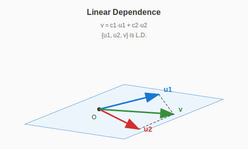
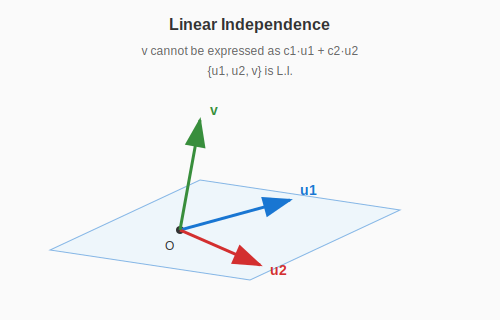
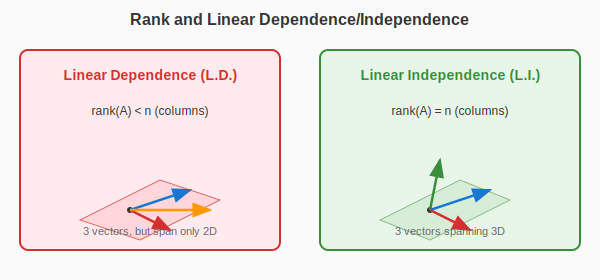

:::note
本系列文章內容參考自經典教材 **Elementary Linear Algebra (Pearson New International Edition)**。本文對應章節：**Ch1-7 Linear Dependence and Linear Independence**。
:::

## **什麼是線性相關與線性獨立？**

### **直觀理解**

在上一章我們學習了 Span（生成空間）的概念。現在我們要問一個關鍵問題：**給定一組向量，有沒有「冗餘」的向量？**

- 如果某個向量可以被其他向量「組合」出來，那它就是冗餘的——這組向量就是**線性相關 (Linearly Dependent, L.D.)**
- 如果每個向量都是「獨立」的、不能被其他向量組合出來，這組向量就是**線性獨立 (Linearly Independent, L.I.)**

> **白話來說**：線性獨立意味著「每個向量都有貢獻」，沒有人是多餘的。

### **嚴格定義**

:::info Definition: Linear Dependence (L.D.)
$\mathbb{R}^n$ 中的向量集合 $\{\mathbf{u}_1, \mathbf{u}_2, \ldots, \mathbf{u}_k\}$ 稱為**線性相關 (Linearly Dependent)**，若存在純量 $c_1, c_2, \ldots, c_k$，$\colorbox{yellow}{不全為零}$，使得：

$$
\boxed{c_1\mathbf{u}_1 + c_2\mathbf{u}_2 + \cdots + c_k\mathbf{u}_k = \mathbf{0}}
$$

此時，我們也說這些向量 $\mathbf{u}_1, \mathbf{u}_2, \ldots, \mathbf{u}_k$ 是**線性相關的**。
:::

:::info Definition: Linear Independence (L.I.)
$\mathbb{R}^n$ 中的向量集合 $\{\mathbf{u}_1, \mathbf{u}_2, \ldots, \mathbf{u}_k\}$ 稱為**線性獨立 (Linearly Independent)**，若使得

$$
c_1\mathbf{u}_1 + c_2\mathbf{u}_2 + \cdots + c_k\mathbf{u}_k = \mathbf{0}
$$

成立的**唯一**純量組合是 $c_1 = c_2 = \cdots = c_k = 0$。

此時，我們也說這些向量 $\mathbf{u}_1, \mathbf{u}_2, \ldots, \mathbf{u}_k$ 是**線性獨立的**。
:::

:::tip L.D. 定義的關鍵：「不全為零」
定義中「不全為零」這個條件非常重要！

如果 $c_1\mathbf{u}_1 + c_2\mathbf{u}_2 + \cdots + c_k\mathbf{u}_k = \mathbf{0}$ 且存在某個 $c_i \neq 0$，那麼我們可以把 $\mathbf{u}_i$ 移到等號另一邊：

$$
\mathbf{u}_i = -\frac{c_1}{c_i}\mathbf{u}_1 - \cdots - \frac{c_{i-1}}{c_i}\mathbf{u}_{i-1} - \frac{c_{i+1}}{c_i}\mathbf{u}_{i+1} - \cdots - \frac{c_k}{c_i}\mathbf{u}_k
$$

這說明 $\mathbf{u}_i$ 可以被其他向量線性組合出來——它是「冗餘」的！
:::

 

## **幾何意義**

### **線性相關：向量「共面」或「共線」**

當向量線性相關時，它們無法張成更高維度的空間。

上圖展示了線性相關的情況：向量 $\mathbf{v}$ 落在 $\mathbf{u}_1$ 和 $\mathbf{u}_2$ 張成的平面上，可以表示為 $\mathbf{v} = c_1\mathbf{u}_1 + c_2\mathbf{u}_2$。因此 $\{\mathbf{u}_1, \mathbf{u}_2, \mathbf{v}\}$ 是線性相關的——加入 $\mathbf{v}$ 並沒有擴展 Span。

### **線性獨立：向量指向「新方向」**

當向量線性獨立時，每個向量都貢獻了一個新的維度。

上圖展示了線性獨立的情況：向量 $\mathbf{v}$ 指向平面外，無法被 $\mathbf{u}_1$ 和 $\mathbf{u}_2$ 線性組合出來。因此 $\{\mathbf{u}_1, \mathbf{u}_2, \mathbf{v}\}$ 是線性獨立的——三個向量張成了三維空間。

 

## **如何判斷線性相關或線性獨立？**

### **方法：轉換為齊次方程組**

判斷向量集合 $\mathcal{S} = \{\mathbf{u}_1, \mathbf{u}_2, \ldots, \mathbf{u}_k\}$ 是否線性相關，等價於檢查方程：

$$
c_1\mathbf{u}_1 + c_2\mathbf{u}_2 + \cdots + c_k\mathbf{u}_k = \mathbf{0}
$$

是否有**非零解**。

將向量排成矩陣 $A = [\mathbf{u}_1 \; \mathbf{u}_2 \; \cdots \; \mathbf{u}_k]$，這個方程可以寫成：

$$
A\mathbf{x} = \mathbf{0}
$$

這種右邊等於零向量的方程組有一個專門的名稱：**齊次方程組**

:::note 什麼是齊次方程組？
形如 $A\mathbf{x} = \mathbf{0}$ 的線性方程組稱為**齊次方程組 (Homogeneous System)**。

齊次方程組有一個重要特性：**永遠有解**！因為 $\mathbf{x} = \mathbf{0}$ 永遠是一個解（稱為 **trivial solution**）。我們真正關心的是：除了這個「平凡解」之外，是否還有其他**非零解（nontrivial solution）**？

> 關於齊次方程組的更多性質，請見後面的 [齊次方程組](#齊次方程組-homogeneous-system) 章節。

:::

:::info Property: Condition for Linear Dependence
設 $A = [\mathbf{u}_1 \; \mathbf{u}_2 \; \cdots \; \mathbf{u}_k]$ 是 $m \times n$ 矩陣（$n$ 個向量，每個向量有 $m$ 個分量）。則：

$$
\boxed{\{\mathbf{u}_1, \mathbf{u}_2, \ldots, \mathbf{u}_k\} \text{ 線性相關} \Leftrightarrow A\mathbf{x} = \mathbf{0} \text{ 有非零解}}
$$

:::

### **用 Rank 判斷線性相關性**

:::tip 我的理解：Rank 與線性相關性的關係
這是我覺得最直觀的判斷方法：

**L.D. 用 Rank 判斷**：當 $\colorbox{#ffcdd2}{\text{rank} < \text{向量數（col 數）}}$，表示**線性相依**。

- 因為 rank 代表這幾組向量可以展開的「方向數量」
- 如果方向數量比向量數量少，代表有些向量是「冗餘」的

**L.I. 用 Rank 判斷**：當 $\colorbox{#c8e6c9}{\text{rank} = \text{向量數（col 數）}}$，表示**線性獨立**。

- 代表每個向量都各自展開一個方向
- 沒有任何向量是多餘的
  :::

上圖對比了線性相關與線性獨立的情況：左側三個向量只張成二維空間（rank = 2 < 3），所以是 L.D.；右側三個向量張成三維空間（rank = 3 = 3），所以是 L.I.。

:::tip Free Variable 與線性相關性
另一個我常用的判斷方式：

**只要有 free variable，這些向量的集合必定為 Linear Dependence！**

原因：

- Free variable 意味著 $A\mathbf{x} = \mathbf{0}$ 有無限多組解
- 無限多組解 $\Rightarrow$ 存在非零解
- 存在非零解 $\Rightarrow$ 線性相關

反過來說：

- 沒有 free variable $\Rightarrow$ 唯一解 $\mathbf{x} = \mathbf{0}$ $\Rightarrow$ 線性獨立
  :::

### **Theorem 1.8：線性獨立的等價條件**

:::info Theorem 1.8
對於 $m \times n$ 矩陣 $A$，以下條件**等價**：

**(a)** $A$ 的 columns 是**線性獨立**的

**(b)** 對於任意 $\mathbf{b} \in \mathbb{R}^m$，方程 $A\mathbf{x} = \mathbf{b}$ **至多有一個解**

**(c)** $A$ 的 **nullity 為零**（即 $A\mathbf{x} = \mathbf{0}$ 只有零解）

**(d)** $\colorbox{#c8e6c9}{\text{rank}(A) = n}$（$A$ 的行數，即 column 數）

**(e)** $A$ 的 RREF 的 columns 是 $\mathbb{R}^m$ 中的**相異標準向量**

**(f)** $A\mathbf{x} = \mathbf{0}$ 的唯一解是 $\mathbf{x} = \mathbf{0}$

**(g)** $A$ 的**每一行（column）都有 pivot position**
:::

**證明思路**：

- **(a) ⇔ (f)**：根據 L.I. 的定義
- **(b) ⇔ (f)**：若 $\mathbf{u}, \mathbf{v}$ 都是 $A\mathbf{x} = \mathbf{b}$ 的解，則 $A(\mathbf{u} - \mathbf{v}) = \mathbf{0}$。若 (f) 成立，則 $\mathbf{u} - \mathbf{v} = \mathbf{0}$，即 $\mathbf{u} = \mathbf{v}$
- **(c) ⇔ (d)**：$\text{rank}(A) + \text{nullity}(A) = n$
- **(d) ⇔ (g)**：rank 等於 pivot 數量
- **(f) ⇔ (g)**：沒有 free variable $\Leftrightarrow$ 每個 column 都有 pivot

### **Theorem 1.9：線性相關的判定**

:::info Theorem 1.9
向量 $\mathbf{u}_1, \mathbf{u}_2, \ldots, \mathbf{u}_k$ 在 $\mathbb{R}^n$ 中是**線性相關**的，若且唯若：

- $\mathbf{u}_1 = \mathbf{0}$，或
- 存在某個 $i \geq 2$ 使得 $\mathbf{u}_i$ 是前面向量 $\mathbf{u}_1, \mathbf{u}_2, \ldots, \mathbf{u}_{i-1}$ 的**線性組合**
  :::

這個定理告訴我們：線性相關等價於「某個向量可以被它前面的向量組合出來」。

### **範例：判斷線性相關性**

設 $\mathcal{S} = \left\{\begin{bmatrix} 1 \\ 2 \\ 1 \end{bmatrix}, \begin{bmatrix} 1 \\ 0 \\ 1 \end{bmatrix}, \begin{bmatrix} 1 \\ 4 \\ 1 \end{bmatrix}, \begin{bmatrix} 1 \\ 2 \\ 3 \end{bmatrix}\right\}$，判斷 $\mathcal{S}$ 是 L.D. 還是 L.I.？

**解法**：建立矩陣 $A$ 並求解 $A\mathbf{x} = \mathbf{0}$：

$$
A = \begin{bmatrix} 1 & 1 & 1 & 1 \\ 2 & 0 & 4 & 2 \\ 1 & 1 & 1 & 3 \end{bmatrix}
$$

將增廣矩陣 $[A \mid \mathbf{0}]$ 化為 RREF：

$$
\begin{bmatrix} 1 & 1 & 1 & 1 & 0 \\ 2 & 0 & 4 & 2 & 0 \\ 1 & 1 & 1 & 3 & 0 \end{bmatrix} \xrightarrow{\text{RREF}} \begin{bmatrix} 1 & 0 & 2 & 0 & 0 \\ 0 & 1 & -1 & 0 & 0 \\ 0 & 0 & 0 & 1 & 0 \end{bmatrix}
$$

觀察：

- $\text{rank}(A) = 3$
- 向量數（columns）$= 4$
- $\text{rank}(A) = 3 < 4 =$ 向量數

因為 $x_3$ 是 **free variable**，所以 $A\mathbf{x} = \mathbf{0}$ 有非零解。

**結論**：$\mathcal{S}$ 是**線性相關**的 ✓

 

## **線性相關的性質**

### **Property 1：包含零向量必定 L.D.**

:::info Property
任何包含**零向量**的集合 $\mathcal{S} = \{\mathbf{0}, \mathbf{u}_1, \mathbf{u}_2, \ldots, \mathbf{u}_k\}$ 必定是**線性相關**的。
:::

**證明**：取 $c_0 = 1$，$c_1 = c_2 = \cdots = c_k = 0$，則：

$$
1 \cdot \mathbf{0} + 0 \cdot \mathbf{u}_1 + 0 \cdot \mathbf{u}_2 + \cdots + 0 \cdot \mathbf{u}_k = \mathbf{0}
$$

這是一組「不全為零」的係數，所以 $\mathcal{S}$ 是 L.D.。

### **Property 2：單一向量的情況**

:::info Property
對於只有一個向量的集合 $\{\mathbf{u}\}$：

- $\{\mathbf{u}\}$ 是 L.I. $\Leftrightarrow$ $\mathbf{u} \neq \mathbf{0}$
- $\{\mathbf{0}\}$ 是 L.D.
  :::

### **Property 3：兩個向量的情況**

:::info Property
對於兩個向量的集合 $\{\mathbf{u}_1, \mathbf{u}_2\}$：

$$
\{\mathbf{u}_1, \mathbf{u}_2\} \text{ 是 L.D.} \Leftrightarrow \mathbf{u}_1 = \mathbf{0} \text{ 或 } \mathbf{u}_2 \text{ 是 } \mathbf{u}_1 \text{ 的純量倍數}
$$

等價於說：其中一個向量是另一個的倍數（平行）。
:::

### **Property 4：向量數超過維度必定 L.D.**

:::info Property
在 $\mathbb{R}^n$ 中，任何包含**超過 $n$ 個向量**的集合必定是**線性相關**的。
:::

**直觀理解**：$\mathbb{R}^n$ 最多只有 $n$ 個「獨立方向」，所以不可能有超過 $n$ 個線性獨立的向量。

**證明**：設 $A$ 是 $m \times k$ 矩陣（$k > m$），則 $\text{rank}(A) \leq m < k$，所以必有 free variable，因此 L.D.。

 

## **齊次方程組 (Homogeneous System)**

### **定義**

:::info Definition: Homogeneous System
形如 $A\mathbf{x} = \mathbf{0}$ 的線性方程組稱為**齊次方程組 (Homogeneous System)**。
:::

### **齊次方程組的性質**

:::info Properties of Homogeneous System $A\mathbf{x} = \mathbf{0}$

1. **永遠有解**：$\mathbf{x} = \mathbf{0}$ 永遠是一個解（稱為 **trivial solution**）

2. **非零解與 L.D.**：若 $A\mathbf{x} = \mathbf{0}$ 有非零解（nontrivial solution），則 $A$ 的 columns 是 L.D.

3. **變數多於方程必有非零解**：若變數數 $n >$ 方程數 $m$（即 $A$ 是「寬矩陣」），則必有 free variable，因此必有非零解
   :::

### **範例：齊次方程組**

設 $A = \begin{bmatrix} 1 & -4 & 2 & -1 & 2 \\ 2 & -8 & 3 & 2 & -1 \end{bmatrix}$（$2 \times 5$ 矩陣）

求 $A\mathbf{x} = \mathbf{0}$ 的通解。

**解法**：將 $[A \mid \mathbf{0}]$ 化為 RREF：

$$
\begin{bmatrix} 1 & -4 & 0 & 7 & -8 & 0 \\ 0 & 0 & 1 & -4 & 5 & 0 \end{bmatrix}
$$

通解為：

$$
\begin{cases}
x_1 = 4x_2 - 7x_4 + 8x_5 \\
x_2 = \text{free} \\
x_3 = 4x_4 - 5x_5 \\
x_4 = \text{free} \\
x_5 = \text{free}
\end{cases}
$$

有 3 個 free variables，所以解空間是三維的。

 

## **補充：線性獨立與 One-to-One 的關係**

線性獨立和「單射 (One-to-One)」之間有著深刻的等價關係。雖然 One-to-One 是第二章才會深入探討的概念，但這個連結太重要了，值得在這裡先預告。

### **什麼是 One-to-One（單射）？**

:::note 預備知識：One-to-One 的直觀理解
**One-to-One（單射）** 是描述函數的一種性質：**不同的輸入必定對應不同的輸出**。

換句話說，如果 $f(a) = f(b)$，那麼必定 $a = b$。

**生活例子**：

- ✓ **學號 → 學生**：每個學號只對應一個學生，這是 One-to-One
- ✗ **生日 → 學生**：多個學生可能同一天生日，這不是 One-to-One

在線性代數中，我們關心的是矩陣 $A$ 定義的線性變換 $T(\mathbf{x}) = A\mathbf{x}$ 是否為 One-to-One。
:::

### **L.I. 與 One-to-One 的等價關係**

設 $T: \mathbb{R}^n \to \mathbb{R}^m$ 是由 $m \times n$ 矩陣 $A$ 定義的線性變換，即 $T(\mathbf{x}) = A\mathbf{x}$。

:::info Theorem: L.I. ⟺ One-to-One

$$
\boxed{A \text{ 的 columns 線性獨立} \Leftrightarrow T(\mathbf{x}) = A\mathbf{x} \text{ 是 One-to-One}}
$$

:::

上圖對比了兩種情況：

- **左側（L.I.）**：每個輸入 $\mathbf{x}$ 對應唯一的輸出 $\mathbf{b}$，這是 One-to-One 映射
- **右側（L.D.）**：多個不同的輸入可能對應同一個輸出，這不是 One-to-One 映射

### **為什麼這兩者等價？**

我們來仔細分析這個等價關係：

|         角度         |                                                      條件                                                       |
| :------------------: | :-------------------------------------------------------------------------------------------------------------: |
|    **從 L.I. 看**    |                  $A$ 的 columns 線性獨立 $\Leftrightarrow$ $A\mathbf{x} = \mathbf{0}$ 只有零解                  |
| **從 One-to-One 看** | $T$ 是 One-to-One $\Leftrightarrow$ $T(\mathbf{x}_1) = T(\mathbf{x}_2) \Rightarrow \mathbf{x}_1 = \mathbf{x}_2$ |

**關鍵推導**：

假設 $T(\mathbf{x}_1) = T(\mathbf{x}_2)$，即 $A\mathbf{x}_1 = A\mathbf{x}_2$。

兩邊相減得到：

$$
A\mathbf{x}_1 - A\mathbf{x}_2 = \mathbf{0} \quad \Rightarrow \quad A(\mathbf{x}_1 - \mathbf{x}_2) = \mathbf{0}
$$

現在令 $\mathbf{d} = \mathbf{x}_1 - \mathbf{x}_2$，則 $A\mathbf{d} = \mathbf{0}$。

- **若 L.I.**：$A\mathbf{d} = \mathbf{0}$ 只有零解，所以 $\mathbf{d} = \mathbf{0}$，即 $\mathbf{x}_1 = \mathbf{x}_2$ ✓
  - 這說明：不同的輸入必定對應不同的輸出 → **One-to-One**
- **若 L.D.**：$A\mathbf{d} = \mathbf{0}$ 有非零解，存在 $\mathbf{d} \neq \mathbf{0}$ 使得 $A\mathbf{d} = \mathbf{0}$
  - 取任意 $\mathbf{x}_1$，令 $\mathbf{x}_2 = \mathbf{x}_1 + \mathbf{d}$，則 $\mathbf{x}_1 \neq \mathbf{x}_2$ 但 $T(\mathbf{x}_1) = T(\mathbf{x}_2)$ ✗
  - 這說明：存在不同的輸入對應相同的輸出 → **Not One-to-One**

:::tip 記憶技巧
**L.I. = 沒有「多餘」的向量 = 沒有「多餘」的輸入對應同一輸出 = One-to-One**

本質上，線性獨立保證了「輸入的唯一性」——每個輸出最多只來自一個輸入。
:::

 

## **Rank、Span、L.I. 的綜合比較**

這個總結表格連結了 Rank、Span、線性獨立三個核心概念。設 $A = [\mathbf{a}_1 \; \mathbf{a}_2 \; \cdots \; \mathbf{a}_n]$ 是 $m \times n$ 矩陣，$\mathcal{S} = \{\mathbf{a}_1, \mathbf{a}_2, \ldots, \mathbf{a}_n\}$。

:::info Summary Table

|           條件           | $A\mathbf{x} = \mathbf{b}$ 的解 |               $A$ 的 columns                |       RREF 特徵        |
| :----------------------: | :-----------------------------: | :-----------------------------------------: | :--------------------: |
|   $\text{rank}(A) = m$   | 對任意 $\mathbf{b}$ 至少有一解  |  $\text{Span}(\mathcal{S}) = \mathbb{R}^m$  |  每個 row 都有 pivot   |
|   $\text{rank}(A) = n$   | 對任意 $\mathbf{b}$ 至多有一解  |            $\mathcal{S}$ 是 L.I.            | 每個 column 都有 pivot |
| $\text{rank}(A) = m = n$ |  對任意 $\mathbf{b}$ 恰有一解   | $\mathcal{S}$ 是 L.I. 且生成 $\mathbb{R}^m$ |       $R = I_n$        |

:::

**為什麼 rank = m 代表 Span 滿、解存在？**

**RREF 特徵**：每個 row 都有 pivot position

- Rank = pivot 數量 = $m$ = row 數，所以每個 row 都有 pivot

**Span 覆蓋 $\mathbb{R}^m$**：

- 每個 row 都有 pivot 意味著增廣矩陣 $[A \mid \mathbf{b}]$ 不會出現 $[0 \; 0 \; \cdots \; 0 \mid c]$（$c \neq 0$）的矛盾列
- 因此對任意 $\mathbf{b} \in \mathbb{R}^m$，系統都是 consistent
- 這正是 Span 覆蓋整個 $\mathbb{R}^m$ 的意思

**解的存在性**：

- Span 覆蓋 $\mathbb{R}^m$ $\Leftrightarrow$ 每個 $\mathbf{b}$ 都能被表示為 columns 的線性組合

---

**範例：m < n（寬矩陣，解存在但不唯一）**

$A = \begin{bmatrix} 1 & 0 & 2 \\ 0 & 1 & 3 \end{bmatrix}$（$2 \times 3$ 矩陣）

- $\text{rank}(A) = 2 = m$ ✓
- RREF：$\begin{bmatrix} 1 & 0 & 2 \\ 0 & 1 & 3 \end{bmatrix}$，每個 row 都有 pivot
- Span = $\mathbb{R}^2$，對任意 $\mathbf{b} \in \mathbb{R}^2$ 都有解
- 但有 free variable（$x_3$），所以解不唯一

**為什麼 rank = n 代表 L.I.、解唯一？**

**RREF 特徵**：每個 column 都有 pivot position

- Rank = pivot 數量 = $n$ = column 數，所以每個 column 都有 pivot

**線性獨立**：

- 每個 column 都有 pivot $\Leftrightarrow$ 沒有 free variable
- 沒有 free variable $\Leftrightarrow$ $A\mathbf{x} = \mathbf{0}$ 只有零解
- 這正是線性獨立的定義

**解的唯一性**：

- 沒有 free variable 意味著解（如果存在）是唯一的
- 結合前面的等價關係：L.I. $\Leftrightarrow$ One-to-One

---

**範例：m > n（高矩陣，解唯一但不一定存在）**

$A = \begin{bmatrix} 1 & 0 \\ 0 & 1 \\ 0 & 0 \end{bmatrix}$（$3 \times 2$ 矩陣）

- $\text{rank}(A) = 2 = n$ ✓
- RREF：$\begin{bmatrix} 1 & 0 \\ 0 & 1 \\ 0 & 0 \end{bmatrix}$，每個 column 都有 pivot
- Columns 是 L.I.，$A\mathbf{x} = \mathbf{0}$ 只有零解
- 若解存在，則解唯一（但不是每個 $\mathbf{b}$ 都有解）

**為什麼 rank = m = n 代表恰有唯一解？**

**RREF 特徵**：$R = I_n$（單位矩陣）

- 每個 row 都有 pivot + 每個 column 都有 pivot + $m = n$
- 唯一可能的形式就是單位矩陣

**結合前兩個條件**：

- Rank = $m$ $\Rightarrow$ 至少有一解（存在性）
- Rank = $n$ $\Rightarrow$ 至多有一解（唯一性）
- 合起來 $\Rightarrow$ **恰有一解**

---

**範例：方陣且滿秩**

$A = \begin{bmatrix} 1 & 2 \\ 3 & 4 \end{bmatrix}$（$2 \times 2$ 矩陣）

- $\text{rank}(A) = 2 = m = n$ ✓
- RREF：$\begin{bmatrix} 1 & 0 \\ 0 & 1 \end{bmatrix} = I_2$
- 對任意 $\mathbf{b} \in \mathbb{R}^2$，$A\mathbf{x} = \mathbf{b}$ 恰有唯一解
- 例如 $\mathbf{b} = \begin{bmatrix} 5 \\ 11 \end{bmatrix}$，唯一解為 $\mathbf{x} = \begin{bmatrix} 1 \\ 2 \end{bmatrix}$

