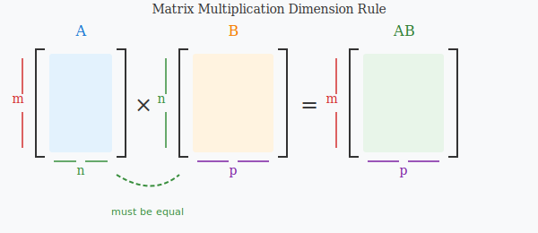
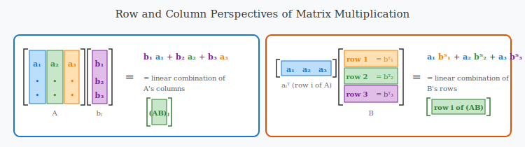
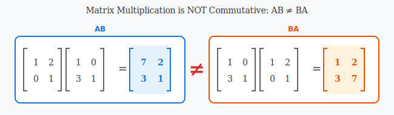

:::note
本系列文章內容參考自經典教材 **Elementary Linear Algebra (Pearson New International Edition)**。本文對應章節：**Ch2-1 Matrix Multiplication**。
:::

## **矩陣乘法的定義 (Definition of Matrix Multiplication)**

### **運算規則**

給定一個 $m \times n$ 矩陣 $A$ 與一個 $n \times p$ 矩陣 $B$，其**乘積 (Product)** $AB$ 是一個 $m \times p$ 矩陣，其中第 $(i, j)$ 元素由以下公式定義：

$$
\colorbox{yellow}{$(AB)_{ij} = \sum_{k=1}^{n} a_{ik} b_{kj} = a_{i1}b_{1j} + a_{i2}b_{2j} + \cdots + a_{in}b_{nj}$}
$$

換言之，$AB$ 的第 $(i, j)$ 元素，是 $A$ 的**第 $i$ 個 row** 與 $B$ 的**第 $j$ 個 column** 對應元素相乘後加總的結果。

上圖展示了矩陣乘法中單一元素 $(AB)_{ij}$ 的計算過程：$A$ 的第 $i$ 個 row 與 $B$ 的第 $j$ 個 column 進行**點積 (Dot Product)** 運算，產生結果矩陣中對應位置的元素。

### **維度要求 (Dimension Requirement)**

矩陣乘法 $AB$ **只有在 $A$ 的 column 數等於 $B$ 的 row 數時才有定義**。具體而言：

- 若 $A$ 為 $m \times n$ 矩陣，$B$ 為 $n \times p$ 矩陣
- 則 $AB$ 為 $m \times p$ 矩陣

$$
\underbrace{A}_{m \times \colorbox{yellow}{$n$}} \times \underbrace{B}_{\colorbox{yellow}{$n$} \times p} = \underbrace{AB}_{m \times p}
$$

上圖以視覺化方式呈現矩陣乘法的維度規則：**內部維度必須匹配**（圖中以相同顏色標示），結果矩陣的維度取決於外部維度。

**範例**：

若 $A \in \mathcal{M}_{3 \times 2}$，$B \in \mathcal{M}_{2 \times 4}$，則 $AB \in \mathcal{M}_{3 \times 4}$。

$$
A = \begin{bmatrix} 1 & 2 \\ 3 & 4 \\ 5 & 6 \end{bmatrix}, \quad
B = \begin{bmatrix} 1 & 2 & 3 & 4 \\ 5 & 6 & 7 & 8 \end{bmatrix}
$$

$$
AB = \begin{bmatrix}
1 \cdot 1 + 2 \cdot 5 & 1 \cdot 2 + 2 \cdot 6 & 1 \cdot 3 + 2 \cdot 7 & 1 \cdot 4 + 2 \cdot 8 \\
3 \cdot 1 + 4 \cdot 5 & 3 \cdot 2 + 4 \cdot 6 & 3 \cdot 3 + 4 \cdot 7 & 3 \cdot 4 + 4 \cdot 8 \\
5 \cdot 1 + 6 \cdot 5 & 5 \cdot 2 + 6 \cdot 6 & 5 \cdot 3 + 6 \cdot 7 & 5 \cdot 4 + 6 \cdot 8
\end{bmatrix}
= \begin{bmatrix}
11 & 14 & 17 & 20 \\
23 & 30 & 37 & 44 \\
35 & 46 & 57 & 68
\end{bmatrix}
$$

 

## **矩陣乘法的列與行觀點 (Row and Column Perspectives)**

除了逐元素計算，矩陣乘法還有兩種重要的整體觀點：

### **Column Perspective（行觀點）**

$AB$ 的**每一個 column** 都是 $A$ 的各 columns 以 $B$ 的對應 column 元素為係數的**線性組合**：

$$
\colorbox{yellow}{$(AB)_{\text{column } j} = A\mathbf{b}_j = b_{1j}\mathbf{a}_1 + b_{2j}\mathbf{a}_2 + \cdots + b_{nj}\mathbf{a}_n$}
$$

其中 $\mathbf{a}_k$ 是 $A$ 的第 $k$ 個 column，而 $b_{kj}$ 是 $B$ 第 $j$ 個 column 的第 $k$ 個元素。這意味著：

- **結果矩陣的第 $j$ 個 column，只跟 $B$ 的第 $j$ 個 column 有關。**

**範例**：
考慮以下矩陣 $A$ 與 $B$：

$$
A = \begin{bmatrix} \colorbox{cyan}{1} & \colorbox{yellow}{2} \\ \colorbox{cyan}{0} & \colorbox{yellow}{1} \end{bmatrix}, \quad B = \begin{bmatrix} \colorbox{cyan}{1} & 0 \\ \colorbox{yellow}{3} & 1 \end{bmatrix}
$$

計算 $AB$ 的第 1 個 column：

$$
(AB)_{\text{column 1}} = \colorbox{cyan}{1} \begin{bmatrix} 1 \\ 0 \end{bmatrix} + \colorbox{yellow}{3} \begin{bmatrix} 2 \\ 1 \end{bmatrix} = \begin{bmatrix} 1+6 \\ 0+3 \end{bmatrix} = \begin{bmatrix} 7 \\ 3 \end{bmatrix}
$$

### **Row Perspective（列觀點）**

$AB$ 的**每一個 row** 都是 $B$ 的各 rows 以 $A$ 的對應 row 元素為係數的**線性組合**：

$$
\colorbox{yellow}{$(AB)_{\text{row } i} = \mathbf{a}_i^T B = a_{i1}\mathbf{b}_1^T + a_{i2}\mathbf{b}_2^T + \cdots + a_{in}\mathbf{b}_n^T$}
$$

其中 $\mathbf{a}_i^T$ 是 $A$ 的第 $i$ 個 row，而 $\mathbf{b}_k^T$ 是 $B$ 的第 $k$ 個 row。這意味著：

- **結果矩陣的第 $i$ 個 row，只跟 $A$ 的第 $i$ 個 row 有關。**

**範例**：
同樣使用以下矩陣 $A$ 與 $B$：

$$
A = \begin{bmatrix} \colorbox{pink}{1} & \colorbox{orange}{2} \\ 0 & 1 \end{bmatrix}, \quad B = \begin{bmatrix} \colorbox{pink}{1} & \colorbox{pink}{0} \\ \colorbox{orange}{3} & \colorbox{orange}{1} \end{bmatrix}
$$

計算 $AB$ 的第 1 個 row：

$$
(AB)_{\text{row 1}} = \colorbox{pink}{1} \begin{bmatrix} 1 & 0 \end{bmatrix} + \colorbox{orange}{2} \begin{bmatrix} 3 & 1 \end{bmatrix} = \begin{bmatrix} 1+6 & 0+2 \end{bmatrix} = \begin{bmatrix} 7 & 2 \end{bmatrix}
$$

 

## **矩陣乘法的性質 (Properties of Matrix Multiplication)**

### **定理 2.1：矩陣乘法的代數性質**

令 $A$、$B$、$C$ 為適當大小的矩陣，$s$ 為純量，則：

| 性質 |          公式           |              名稱               |
| :--: | :---------------------: | :-----------------------------: |
| (a)  |     $(AB)C = A(BC)$     |     結合律 (Associativity)      |
| (b)  |  $A(B + C) = AB + AC$   | 左分配律 (Left Distributivity)  |
| (c)  |  $(A + B)C = AC + BC$   | 右分配律 (Right Distributivity) |
| (d)  | $(sA)B = A(sB) = s(AB)$ |           純量結合律            |
| (e)  |       $I_m A = A$       |           左單位元素            |
| (f)  |       $A I_n = A$       |           右單位元素            |

其中，對於性質 (e) 與 (f)，$A$ 為 $m \times n$ 矩陣。

:::caution 注意：矩陣乘法不滿足交換律
矩陣乘法**一般而言不可交換**，即：

$$
\colorbox{yellow}{$AB \neq BA$}
$$

這是矩陣乘法與實數乘法最重要的差異之一。即使 $AB$ 與 $BA$ 都有定義，它們的結果通常也不相同。
:::

### **不可交換性的反例**

考慮以下兩個矩陣：

$$
A = \begin{bmatrix} 1 & 2 \\ 0 & 1 \end{bmatrix}, \quad
B = \begin{bmatrix} 1 & 0 \\ 3 & 1 \end{bmatrix}
$$

計算 $AB$ 與 $BA$：

$$
AB = \begin{bmatrix} 1 & 2 \\ 0 & 1 \end{bmatrix} \begin{bmatrix} 1 & 0 \\ 3 & 1 \end{bmatrix}
= \begin{bmatrix} 7 & 2 \\ 3 & 1 \end{bmatrix}
$$

$$
BA = \begin{bmatrix} 1 & 0 \\ 3 & 1 \end{bmatrix} \begin{bmatrix} 1 & 2 \\ 0 & 1 \end{bmatrix}
= \begin{bmatrix} 1 & 2 \\ 3 & 7 \end{bmatrix}
$$

顯然 $AB \neq BA$，驗證了矩陣乘法的不可交換性。

 

## **單位矩陣與矩陣乘法 (Identity Matrix and Matrix Multiplication)**

**單位矩陣 (Identity Matrix)** $I_n$ 在矩陣乘法中扮演的角色，類似於數字 $1$ 在實數乘法中的角色：

$$
I_n A = A I_n = A
$$

（當矩陣維度相容時）

更一般地，若 $A$ 為 $m \times n$ 矩陣：

$$
I_m A = A, \quad A I_n = A
$$

 

## **矩陣的冪次 (Powers of a Matrix)**

對於**方陣** $A$，我們可以定義其冪次：

$$
A^0 = I, \quad A^1 = A, \quad A^2 = AA, \quad A^k = \underbrace{A \cdot A \cdots A}_{k \text{ 個}}
$$

**冪次運算律**：

$$
A^r A^s = A^{r+s}, \quad (A^r)^s = A^{rs}
$$

其中 $r, s$ 為非負整數。

:::warning 冪次運算不適用於不同矩陣的乘積
由於 $AB \neq BA$，因此：

$$
(AB)^2 = ABAB \neq A^2 B^2 = AABB
$$

這與實數中 $(ab)^2 = a^2 b^2$ 的性質不同。類似地，$(A+B)^2 \neq A^2 + 2AB + B^2$，因為展開時會出現 $AB$ 與 $BA$ 兩項，而它們通常不相等。
:::

 

## **轉置與乘積的關係 (Transpose of a Product)**

### **定理 2.2：乘積的轉置**

若 $A$ 為 $m \times n$ 矩陣，$B$ 為 $n \times p$ 矩陣，則：

$$
\colorbox{yellow}{$(AB)^T = B^T A^T$}
$$

注意順序**反轉**了！這是一個常見的考點。

**證明**：

設 $(AB)^T$ 的 $(i, j)$ 元素為第 $(j, i)$ 位置的 $AB$ 元素：

$$
[(AB)^T]_{ij} = (AB)_{ji} = \sum_{k=1}^{n} a_{jk} b_{ki}
$$

另一方面，$(B^T A^T)$ 的 $(i, j)$ 元素為：

$$
(B^T A^T)_{ij} = \sum_{k=1}^{n} (B^T)_{ik} (A^T)_{kj} = \sum_{k=1}^{n} b_{ki} a_{jk} = \sum_{k=1}^{n} a_{jk} b_{ki}
$$

兩者相等，證明完成。

### **推廣至多個矩陣的乘積**

$$
(ABC)^T = C^T B^T A^T
$$

一般而言，對於 $k$ 個矩陣的乘積：

$$
(A_1 A_2 \cdots A_k)^T = A_k^T A_{k-1}^T \cdots A_1^T
$$

 

## **可逆矩陣 (Invertible Matrix)**

### **定義**

一個 $n \times n$ 方陣 $A$ 稱為**可逆的 (Invertible)**（或**非奇異的 (Nonsingular)**），若存在一個 $n \times n$ 矩陣 $A^{-1}$，使得：

$$
AA^{-1} = A^{-1}A = I_n
$$

此時，$A^{-1}$ 稱為 $A$ 的**反矩陣 (Inverse Matrix)**。

若不存在這樣的矩陣，則稱 $A$ 為**不可逆的 (Noninvertible)** 或**奇異的 (Singular)**。

### **反矩陣的唯一性**

若反矩陣存在，則必唯一。

**證明**：假設 $B$ 與 $C$ 都是 $A$ 的反矩陣，則：

$$
B = BI = B(AC) = (BA)C = IC = C
$$

故 $B = C$。

 

## **反矩陣與乘積的關係 (Inverse of a Product)**

### **定理 2.3：乘積的反矩陣**

若 $A$ 與 $C$ 皆為 $n \times n$ 可逆矩陣，則 $AC$ 也可逆，且：

$$
\colorbox{yellow}{$(AC)^{-1} = C^{-1}A^{-1}$}
$$

注意順序同樣**反轉**了！這與轉置的規則類似。

**證明**：

$$
(AC)(C^{-1}A^{-1}) = A(CC^{-1})A^{-1} = AIA^{-1} = AA^{-1} = I
$$

$$
(C^{-1}A^{-1})(AC) = C^{-1}(A^{-1}A)C = C^{-1}IC = C^{-1}C = I
$$

由反矩陣的定義，$(AC)^{-1} = C^{-1}A^{-1}$。

:::tip 順序反轉的直覺記憶法
我覺得記住這個公式的最好方法是用「穿衣服與脫衣服」的比喻：

假設你先穿**襪子 (A)**，再穿**鞋子 (C)**，這對應於矩陣乘積 $AC$。

當你要脫掉它們時，必須**先脫鞋子 (C⁻¹)**，**再脫襪子 (A⁻¹)**，這對應於 $(AC)^{-1} = C^{-1}A^{-1}$。

同樣的道理也適用於轉置：$(AB)^T = B^T A^T$。「先做的事」在反向操作時要「後做」。
:::

### **推廣至多個矩陣的乘積**

若 $A_1, A_2, \ldots, A_k$ 皆為可逆矩陣，則：

$$
(A_1 A_2 \cdots A_k)^{-1} = A_k^{-1} A_{k-1}^{-1} \cdots A_1^{-1}
$$

 

## **反矩陣的其他性質**

### **定理 2.4：反矩陣的基本性質**

若 $A$ 為可逆矩陣，$c$ 為非零純量，則：

| 性質 |              公式               |          說明          |
| :--: | :-----------------------------: | :--------------------: |
| (a)  |       $(A^{-1})^{-1} = A$       |  反矩陣的反矩陣是自己  |
| (b)  |    $(A^T)^{-1} = (A^{-1})^T$    | 轉置與反矩陣可交換順序 |
| (c)  | $(cA)^{-1} = \frac{1}{c}A^{-1}$ | 純量乘法對反矩陣的影響 |

**性質 (b) 的證明**：

$$
A^T (A^{-1})^T = (A^{-1}A)^T = I^T = I
$$

$$
(A^{-1})^T A^T = (AA^{-1})^T = I^T = I
$$

故 $(A^T)^{-1} = (A^{-1})^T$。

 

## **補充：2 × 2 矩陣的反矩陣公式**

對於 $2 \times 2$ 矩陣，存在一個簡潔的反矩陣公式。

設 $A = \begin{bmatrix} a & b \\ c & d \end{bmatrix}$，定義 $A$ 的**行列式 (Determinant)** 為：

$$
\det(A) = ad - bc
$$

若 $\det(A) \neq 0$，則 $A$ 可逆，且：

$$
A^{-1} = \frac{1}{ad - bc} \begin{bmatrix} d & -b \\ -c & a \end{bmatrix}
$$

**記憶技巧**：

1. 主對角線元素 $a$ 與 $d$ **交換位置**
2. 副對角線元素 $b$ 與 $c$ **變號**
3. 整體除以行列式

**範例**：

$$
A = \begin{bmatrix} 2 & 3 \\ 1 & 4 \end{bmatrix}, \quad \det(A) = 2 \cdot 4 - 3 \cdot 1 = 5
$$

$$
A^{-1} = \frac{1}{5} \begin{bmatrix} 4 & -3 \\ -1 & 2 \end{bmatrix} = \begin{bmatrix} 0.8 & -0.6 \\ -0.2 & 0.4 \end{bmatrix}
$$

驗證：

$$
AA^{-1} = \begin{bmatrix} 2 & 3 \\ 1 & 4 \end{bmatrix} \begin{bmatrix} 0.8 & -0.6 \\ -0.2 & 0.4 \end{bmatrix}
= \begin{bmatrix} 1 & 0 \\ 0 & 1 \end{bmatrix} = I_2 \; \checkmark
$$
