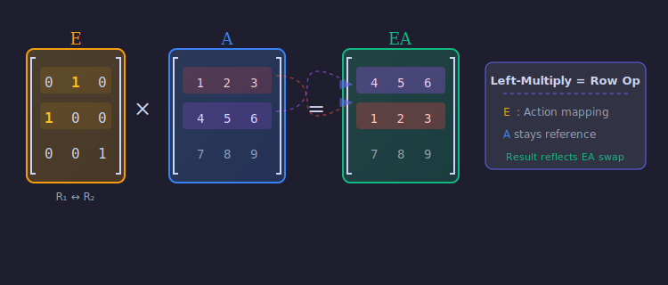
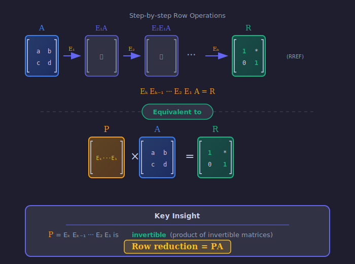

:::note
本系列文章內容參考自經典教材 **Elementary Linear Algebra (Pearson New International Edition)**。本文對應章節：**Ch2-3 Invertibility and Elementary Matrices**。
:::

## **基本列運算 (Elementary Row Operations)**

在解線性方程組時，我們經常使用**基本列運算 (Elementary Row Operations)** 來將增廣矩陣化簡為簡化列梯形形式 (RREF)。這些運算有三種類型：

### **三種基本列運算**

| 類型 | 運算名稱                 |         符號表示          | 說明                              |
| :--: | :----------------------- | :-----------------------: | :-------------------------------- |
|  I   | 列交換 (Row Interchange) | $R_i \leftrightarrow R_j$ | 交換第 $i$ 列與第 $j$ 列          |
|  II  | 列倍乘 (Row Scaling)     |      $kR_i \to R_i$       | 將第 $i$ 列乘以非零常數 $k$       |
| III  | 列取代 (Row Replacement) |   $R_i + kR_j \to R_i$    | 將第 $j$ 列的 $k$ 倍加到第 $i$ 列 |

這三種運算的共同特性是**可逆性**：每一種運算都可以透過另一次相同類型的運算「撤銷」回去。

:::info 基本列運算 (row operations) 的直覺理解
在求解線性方程組時，基本列運算 (row operations) 對應於我們對方程式可以進行的「合法操作」：

- **列交換**：調換兩個方程式的順序，這顯然不改變解
- **列倍乘**：將一個方程式兩邊同乘非零常數，同樣不改變解
- **列取代**：將某方程式加上另一個方程式的倍數，也不改變解集

這就是為什麼透過列運算化簡後的矩陣，與原矩陣具有相同的解。
:::

 

## **基本矩陣 (Elementary Matrices)**

本章最重要的洞見是：**每一個基本列運算 (row operations) 都可以表示成一種矩陣乘法**。

### **定義**

**基本矩陣 (Elementary Matrix)** 是對單位矩陣 $I_n$ 執行**一次**基本列運算所得到的矩陣。

$$
\colorbox{yellow}{$E = \text{(對 } I_n \text{ 執行一次基本列運算)}$}
$$

### **三種基本矩陣**

對應三種基本列運算，我們有三種類型的基本矩陣：

**Type I：列交換矩陣**

對 $I_3$ 執行 $R_1 \leftrightarrow R_2$ 得到：

$$
E_1 = \begin{bmatrix} 0 & 1 & 0 \\ 1 & 0 & 0 \\ 0 & 0 & 1 \end{bmatrix}
$$

**Type II：列倍乘矩陣**

對 $I_3$ 執行 $3R_2 \to R_2$ 得到：

$$
E_2 = \begin{bmatrix} 1 & 0 & 0 \\ 0 & 3 & 0 \\ 0 & 0 & 1 \end{bmatrix}
$$

**Type III：列取代矩陣**

對 $I_3$ 執行 $R_1 + 4R_3 \to R_1$ 得到：

$$
E_3 = \begin{bmatrix} 1 & 0 & 4 \\ 0 & 1 & 0 \\ 0 & 0 & 1 \end{bmatrix}
$$

 

## **基本矩陣與列運算的對應 (Correspondence Between Elementary Matrices and Row Operations)**

### **核心定理**

:::tip Left-Multiply = Row Operation

當我們把基本矩陣 $E$ 放在矩陣 $A$ 的**左邊**相乘，效果等同於對 $A$ 執行**對應的列運算**。這讓我們能用「矩陣乘法」這個統一的框架來理解和記錄所有的列運算！
:::

**定理**：令 $E$ 為對 $I_n$ 執行某個基本列運算 $\mathcal{R}$ 所得到的基本矩陣，$A$ 為任意 $n \times m$ 矩陣。則：

$$
EA = \text{(對 } A \text{ 執行列運算 } \mathcal{R} \text{ 的結果)}
$$

**驗證範例**：

設 $A = \begin{bmatrix} 1 & 2 & 3 \\ 4 & 5 & 6 \\ 7 & 8 & 9 \end{bmatrix}$，對 $A$ 執行 $R_1 \leftrightarrow R_2$ 的結果為 $\begin{bmatrix} 4 & 5 & 6 \\ 1 & 2 & 3 \\ 7 & 8 & 9 \end{bmatrix}$。

現在驗證 $E_1 A$ 是否相同：

$$
E_1 A = \begin{bmatrix} 0 & 1 & 0 \\ 1 & 0 & 0 \\ 0 & 0 & 1 \end{bmatrix} \begin{bmatrix} 1 & 2 & 3 \\ 4 & 5 & 6 \\ 7 & 8 & 9 \end{bmatrix} = \begin{bmatrix} 4 & 5 & 6 \\ 1 & 2 & 3 \\ 7 & 8 & 9 \end{bmatrix} \;\checkmark
$$

上圖以動態方式展示了基本矩陣 $E$ 如何透過左乘將矩陣 $A$ 進行列運算。

 

## **基本矩陣的可逆性 (Invertibility of Elementary Matrices)**

### **定理：基本矩陣皆可逆**

每一個基本矩陣都是可逆的，且其逆矩陣也是同類型的基本矩陣（執行「相反操作」所對應的矩陣）。

| 基本矩陣 $E$ |         對應運算          |          逆運算           |       逆矩陣 $E^{-1}$       |
| :----------: | :-----------------------: | :-----------------------: | :-------------------------: |
|    Type I    | $R_i \leftrightarrow R_j$ | $R_i \leftrightarrow R_j$ |        $E^{-1} = E$         |
|   Type II    |      $kR_i \to R_i$       | $\frac{1}{k}R_i \to R_i$  | 將 $k$ 替換為 $\frac{1}{k}$ |
|   Type III   |   $R_i + kR_j \to R_i$    |   $R_i - kR_j \to R_i$    |     將 $k$ 替換為 $-k$      |

**範例**：

$$
E_2 = \begin{bmatrix} 1 & 0 & 0 \\ 0 & 3 & 0 \\ 0 & 0 & 1 \end{bmatrix} \implies E_2^{-1} = \begin{bmatrix} 1 & 0 & 0 \\ 0 & \frac{1}{3} & 0 \\ 0 & 0 & 1 \end{bmatrix}
$$

$$
E_3 = \begin{bmatrix} 1 & 0 & 4 \\ 0 & 1 & 0 \\ 0 & 0 & 1 \end{bmatrix} \implies E_3^{-1} = \begin{bmatrix} 1 & 0 & -4 \\ 0 & 1 & 0 \\ 0 & 0 & 1 \end{bmatrix}
$$

:::note 列交換矩陣的特殊性質
Type I 基本矩陣是**自逆的 (Self-inverse)**，即 $E^{-1} = E$，因為交換兩列執行兩次等於恢復原狀。

這類矩陣也稱為**置換矩陣 (Permutation Matrix)** 的特例。
:::

 

## **列等價與基本矩陣乘積 (Row Equivalence and Products of Elementary Matrices)**

### **定義：列等價 (Row Equivalence)**

若矩陣 $B$ 可由矩陣 $A$ 透過有限次基本列運算得到，則稱 $A$ 與 $B$ **列等價 (Row Equivalent)**，記作 $A \sim B$。

### **核心定理：PA = R**

:::tip 我的核心記憶點
這是我認為本章最重要的結論：

**所有列運算的累積效果可以表示為一個可逆矩陣 $P$**。

如果 $A$ 經過 $k$ 次列運算化簡為 RREF $R$，這 $k$ 次運算分別對應基本矩陣 $E_1, E_2, \ldots, E_k$，則：

$$
\colorbox{yellow}{$E_k E_{k-1} \cdots E_2 E_1 A = R$}
$$

令 $P = E_k E_{k-1} \cdots E_2 E_1$，則 $P$ 是可逆矩陣，且：

$$
\colorbox{yellow}{$PA = R$}
$$

換句話說，透過多次基本列運算「化簡到 RREF」這件事可以用「左乘一個可逆矩陣 $P$」來實現！
:::

**直覺理解**：矩陣 $P$ 可視為「累積運算記錄器」，它記住了所有列運算的順序與內容。由於每個 $E_i$ 都可逆，$P$ 作為可逆矩陣的乘積，本身也必定可逆。

上圖展示了從矩陣 $A$ 經過一連串基本列運算（對應基本矩陣 $E_1, E_2, \ldots, E_k$）最終化簡為 RREF $R$，而這一連串操作等價於左乘可逆矩陣 $P$。
