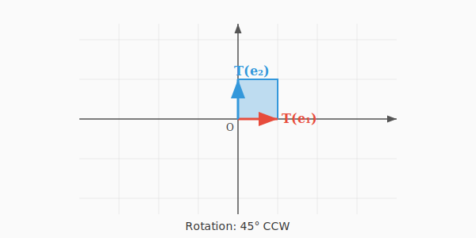
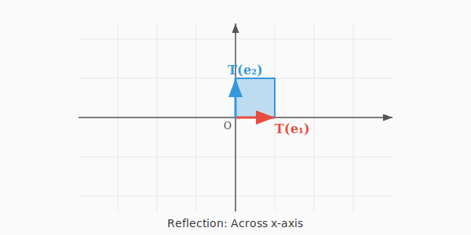
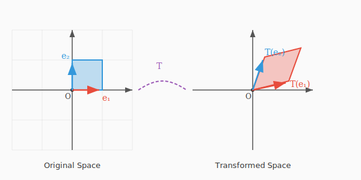
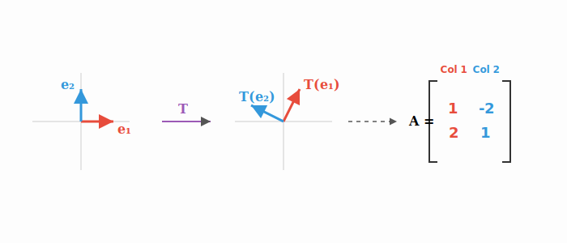
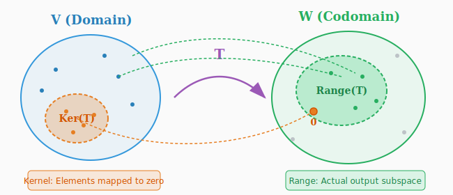

:::note
本系列文章內容參考自經典教材 **Elementary Linear Algebra (Pearson New International Edition)**。本文對應章節：**Ch2-7 Linear Transformations and Matrices**。
:::

## **從函數到變換 (From Functions to Transformations)**

在學習線性代數的過程中，我們逐漸將「矩陣」從一個靜態的數字表格，轉變為可以「作用」在向量上的動態工具。本章將正式引入**線性變換 (Linear Transformation)** 的概念，揭示矩陣與函數之間深刻的聯繫。

我們先回顧函數的概念：一個從集合 $V$ 到集合 $W$ 的**函數 (Function)** $T$，記作 $T: V \to W$，是一種對應規則，將 $V$ 中的每個元素 $\mathbf{v}$ 對應到 $W$ 中唯一的元素 $T(\mathbf{v})$。

當 $V$ 和 $W$ 都是向量空間時，我們習慣使用以下術語：

| 術語                      | 說明                                                         |
| :------------------------ | :----------------------------------------------------------- |
| **變換 (Transformation)** | 向量空間之間的函數                                           |
| **運算子 (Operator)**     | 從向量空間映射到自身的變換（$T: V \to V$）                   |
| **定義域 (Domain)**       | 輸入集合 $V$                                                 |
| **對應域 (Codomain)**     | 輸出所屬的集合 $W$                                           |
| **值域 (Range / Image)**  | 所有實際輸出的集合 $\{T(\mathbf{v}) \mid \mathbf{v} \in V\}$ |

 

## **線性變換的定義 (Definition of Linear Transformation)**

並非所有變換都值得特別研究。線性代數關注的是那些「保持結構」的變換——也就是**線性變換**。

### **定義**

設 $V$ 和 $W$ 是向量空間，一個變換 $T: V \to W$ 稱為**線性變換 (Linear Transformation)**，若且唯若對於所有 $\mathbf{u}, \mathbf{v} \in V$ 和所有純量 $c$，滿足以下兩個條件：

$$
\boxed{
\begin{aligned}
&\text{(i) 加法保持性：} && T(\mathbf{u} + \mathbf{v}) = T(\mathbf{u}) + T(\mathbf{v}) \\[0.5em]
&\text{(ii) 純量乘法保持性：} && T(c\mathbf{u}) = cT(\mathbf{u})
\end{aligned}
}
$$

這兩個條件可以合併為一個等價條件：

$$
\colorbox{yellow}{$T(c_1\mathbf{u} + c_2\mathbf{v}) = c_1T(\mathbf{u}) + c_2T(\mathbf{v})$}
$$

更一般地，線性變換保持**線性組合 (Linear Combination)**：

$$
T(c_1\mathbf{v}_1 + c_2\mathbf{v}_2 + \cdots + c_k\mathbf{v}_k) = c_1T(\mathbf{v}_1) + c_2T(\mathbf{v}_2) + \cdots + c_kT(\mathbf{v}_k)
$$

### **重要性質**

從定義可以直接推導出線性變換的一個關鍵性質：

$$
\colorbox{yellow}{$T(\mathbf{0}) = \mathbf{0}$}
$$

**證明**：$T(\mathbf{0}) = T(0 \cdot \mathbf{v}) = 0 \cdot T(\mathbf{v}) = \mathbf{0}$。 $\square$

:::tip 判斷線性變換的快速方法
這個性質提供了一個**快速排除法**：如果 $T(\mathbf{0}) \neq \mathbf{0}$，那麼 $T$ **一定不是**線性變換！

舉例來說，考慮 $T(x) = 2x + 3$：

- $T(0) = 2(0) + 3 = 3 \neq 0$

因此 $T(x) = 2x + 3$ **不是**線性變換。這是因為它包含了一個常數項 $+3$，使得原點不再映射到原點。

記憶口訣：**「線性必過原點」**。只要有任何「平移」成分（如 $+3$），就不可能是線性變換。
:::

 

## **線性變換的範例 (Examples of Linear Transformations)**

### **範例 1：零變換 (Zero Transformation)**

定義 $T_0: V \to W$，$T_0(\mathbf{v}) = \mathbf{0}$（對所有 $\mathbf{v} \in V$）。

這是一個線性變換，因為對任意 $\mathbf{u}, \mathbf{v} \in V$ 和純量 $c$：

- $T_0(\mathbf{u} + \mathbf{v}) = \mathbf{0} = \mathbf{0} + \mathbf{0} = T_0(\mathbf{u}) + T_0(\mathbf{v})$ ✓
- $T_0(c\mathbf{u}) = \mathbf{0} = c \cdot \mathbf{0} = cT_0(\mathbf{u})$ ✓

### **範例 2：恆等變換 (Identity Transformation)**

定義 $I: V \to V$，$I(\mathbf{v}) = \mathbf{v}$（對所有 $\mathbf{v} \in V$）。

這也是一個線性變換：

- $I(\mathbf{u} + \mathbf{v}) = \mathbf{u} + \mathbf{v} = I(\mathbf{u}) + I(\mathbf{v})$ ✓
- $I(c\mathbf{u}) = c\mathbf{u} = cI(\mathbf{u})$ ✓

### **範例 3：純量乘法變換**

定義 $T_k: V \to V$，$T_k(\mathbf{v}) = k\mathbf{v}$，其中 $k$ 是固定純量。

- $T_k(\mathbf{u} + \mathbf{v}) = k(\mathbf{u} + \mathbf{v}) = k\mathbf{u} + k\mathbf{v} = T_k(\mathbf{u}) + T_k(\mathbf{v})$ ✓
- $T_k(c\mathbf{u}) = k(c\mathbf{u}) = c(k\mathbf{u}) = cT_k(\mathbf{u})$ ✓

### **範例 4：矩陣變換 (Matrix Transformation)**

給定一個 $m \times n$ 矩陣 $A$，定義 $T_A: \mathbb{R}^n \to \mathbb{R}^m$，$T_A(\mathbf{x}) = A\mathbf{x}$。

由矩陣乘法的性質：

- $T_A(\mathbf{u} + \mathbf{v}) = A(\mathbf{u} + \mathbf{v}) = A\mathbf{u} + A\mathbf{v} = T_A(\mathbf{u}) + T_A(\mathbf{v})$ ✓
- $T_A(c\mathbf{u}) = A(c\mathbf{u}) = cA\mathbf{u} = cT_A(\mathbf{u})$ ✓

**這是本章最重要的範例**——每個矩陣都自然地定義了一個線性變換！

 

## **矩陣變換的幾何意義 (Geometric Interpretation of Matrix Transformations)**

既然知道每個線性變換 $T$ 都對應一個標準矩陣 $A$，我們就可以透過**觀察矩陣 $A$ 的樣子**，來推斷這個變換的幾何行為。

以下展示幾種常見的 $\mathbb{R}^2$ 線性變換與其對應的標準矩陣：

### **縮放變換 (Scaling)**

矩陣 $A = \begin{bmatrix} s_x & 0 \\ 0 & s_y \end{bmatrix}$ 會將向量沿 $x$ 軸和 $y$ 軸分別縮放 $s_x$ 和 $s_y$ 倍。

### **旋轉變換 (Rotation)**

矩陣 $R_\theta = \begin{bmatrix} \cos\theta & -\sin\theta \\ \sin\theta & \cos\theta \end{bmatrix}$ 會將向量繞原點逆時針旋轉 $\theta$ 角度。

### **反射變換 (Reflection)**

矩陣 $\begin{bmatrix} 1 & 0 \\ 0 & -1 \end{bmatrix}$ 會將向量相對於 $x$ 軸反射（即上下翻轉）。

### **剪切變換 (Shear)**

矩陣 $\begin{bmatrix} 1 & k \\ 0 & 1 \end{bmatrix}$ 會沿 $x$ 方向進行剪切變換。

下圖以動態方式展示一個單位正方形在不同線性變換下的形變過程。注意到格線保持平行且等距，這正是線性變換的幾何特徵：**直線保持為直線，原點保持不動，且平行線仍保持平行**。

 

## **標準矩陣 (Standard Matrix)**

### **什麼是標準矩陣？**

前面提到線性變換 $T$ 是一個抽象的函數規則（例如「逆時針旋轉 45 度」）。為了方便計算，我們需要一個具體的數學工具——**矩陣**。

事實上，每一個線性變換 $T$ 都有一個唯一的矩陣 $A$ 與之對應，使得：

$$
T(\mathbf{x}) = A\mathbf{x}
$$

這個矩陣 $A$ 就稱為 $T$ 的**標準矩陣 (Standard Matrix)**。

### **如何建構標準矩陣？**

找標準矩陣的方法非常簡單：我們只需要知道 **「標準基底向量」變換後去了哪裡**。在數學上，變換後的結果 $T(\mathbf{x})$ 稱為 $\mathbf{x}$ 在 $T$ 作用下的 **像 (Image)**。

具體步驟（以 $\mathbb{R}^2$ 為例）：

1.  **準備基底**：拿出 $\mathbf{e}_1 = \begin{bmatrix} 1 \\ 0 \end{bmatrix}$ 和 $\mathbf{e}_2 = \begin{bmatrix} 0 \\ 1 \end{bmatrix}$。
2.  **執行變換**：找出它們的像 $T(\mathbf{e}_1)$ 和 $T(\mathbf{e}_2)$。
3.  **填入矩陣**：將這些像向量依序填入矩陣的**行 (Column)**。

$$
\colorbox{yellow}{$A = \Big[ T(\mathbf{e}_1) \ \ \big| \ \ T(\mathbf{e}_2) \ \ \big| \ \ \dots \ \ \big| \ \ T(\mathbf{e}_n) \Big]$}
$$

:::tip 原理：為什麼只看基底就夠了？
你可能會好奇，為什麼只看 $\mathbf{e}_1, \mathbf{e}_2$ 就知道所有向量 $\mathbf{x}$ 的變換結果？

這是因為任何向量 $\mathbf{x} = \begin{bmatrix} x_1 \\ x_2 \end{bmatrix}$ 都可以寫成基底的組合：$\mathbf{x} = x_1\mathbf{e}_1 + x_2\mathbf{e}_2$。如果 $T$ 是線性的，則：

$$
T(\mathbf{x}) = T(x_1\mathbf{e}_1 + x_2\mathbf{e}_2) = x_1 \colorbox{yellow}{$T(\mathbf{e}_1)$} + x_2 \colorbox{yellow}{$T(\mathbf{e}_2)$}
$$

這正好就是矩陣乘法 $A\mathbf{x}$ 的定義！所以，只要掌握了基底的像，我們就掌握了一切。
:::

### **圖解建構過程**

下圖展示了如何透過觀察基底向量的變化來「組裝」出標準矩陣 $A$。

:::tip 核心觀念：行向量的意義
矩陣 $A$ 的**第 $j$ 行 (Column)**，其實就是第 $j$ 個標準基底向量 $\mathbf{e}_j$ 經過變換後的結果 $T(\mathbf{e}_j)$。
:::

### **經典範例集錦 (Classic Examples)**

這裡我們透過幾個經典範例，來熟悉如何建構標準矩陣。

#### **範例 1：投影變換 (Projection)**

**題目**：設 $T: \mathbb{R}^2 \to \mathbb{R}^2$ 是「投影到 X 軸」的線性變換。求其標準矩陣 $A$。

**解**：

1.  $\mathbf{e}_1 = (1, 0)$ 在 X 軸上，投影後不變 $\Rightarrow T(\mathbf{e}_1) = \begin{bmatrix} 1 \\ 0 \end{bmatrix}$
2.  $\mathbf{e}_2 = (0, 1)$ 在 Y 軸上，投影到 X 軸變原點 $\Rightarrow T(\mathbf{e}_2) = \begin{bmatrix} 0 \\ 0 \end{bmatrix}$

$$
A = \begin{bmatrix} 1 & 0 \\ 0 & 0 \end{bmatrix}
$$

現在若想知道 $\mathbf{x} = (3, 5)$ 投影後的結果，直接計算 $A\mathbf{x} = \begin{bmatrix} 1 & 0 \\ 0 & 0 \end{bmatrix}\begin{bmatrix} 3 \\ 5 \end{bmatrix} = \begin{bmatrix} 3 \\ 0 \end{bmatrix}$，結果正確（Y 分量被消除了）。

---

#### **範例 2：已知線性轉換在兩個向量上的值，求其他向量的像**

**題目**：設 $T: \mathbb{R}^2 \to \mathbb{R}^2$ 為一線性轉換，且已知

$$
T\begin{bmatrix} 1 \\ 1 \end{bmatrix} = \begin{bmatrix} 2 \\ 3 \end{bmatrix}, \qquad T\begin{bmatrix} 1 \\ -1 \end{bmatrix} = \begin{bmatrix} 4 \\ -1 \end{bmatrix}.
$$

請回答下列問題：

1. 求 $T\left(\begin{bmatrix} 3 \\ 3 \end{bmatrix}\right)$
2. 求 $T\left(\begin{bmatrix} 1 \\ 0 \end{bmatrix}\right)$ 與 $T\left(\begin{bmatrix} 0 \\ 1 \end{bmatrix}\right)$

**解**：

**(1) 求 $T\left(\begin{bmatrix} 3 \\ 3 \end{bmatrix}\right)$**

觀察向量關係：

$$
\begin{bmatrix} 3 \\ 3 \end{bmatrix} = 3\begin{bmatrix} 1 \\ 1 \end{bmatrix}
$$

因為 $T$ 是線性轉換，滿足**齊次性 (Scalar Multiplication)**：$T(c\mathbf{v}) = cT(\mathbf{v})$。因此：

$$
T\left(\begin{bmatrix} 3 \\ 3 \end{bmatrix}\right) = T\left(3\begin{bmatrix} 1 \\ 1 \end{bmatrix}\right) = 3T\left(\begin{bmatrix} 1 \\ 1 \end{bmatrix}\right) = 3\begin{bmatrix} 2 \\ 3 \end{bmatrix} = \begin{bmatrix} 6 \\ 9 \end{bmatrix}
$$

**(2) 求 $T\left(\begin{bmatrix} 1 \\ 0 \end{bmatrix}\right)$**

先將 $\begin{bmatrix} 1 \\ 0 \end{bmatrix}$ 表成已知向量的線性組合：

$$
\begin{bmatrix} 1 \\ 0 \end{bmatrix} = \frac{1}{2}\begin{bmatrix} 1 \\ 1 \end{bmatrix} + \frac{1}{2}\begin{bmatrix} 1 \\ -1 \end{bmatrix}
$$

利用線性轉換的**可加性 (Additivity)** 與齊次性：

$$
T\left(\begin{bmatrix} 1 \\ 0 \end{bmatrix}\right) = \frac{1}{2}T\left(\begin{bmatrix} 1 \\ 1 \end{bmatrix}\right) + \frac{1}{2}T\left(\begin{bmatrix} 1 \\ -1 \end{bmatrix}\right) = \frac{1}{2}\begin{bmatrix} 2 \\ 3 \end{bmatrix} + \frac{1}{2}\begin{bmatrix} 4 \\ -1 \end{bmatrix} = \begin{bmatrix} 3 \\ 1 \end{bmatrix}
$$

**(3) 求 $T\left(\begin{bmatrix} 0 \\ 1 \end{bmatrix}\right)$**

同樣先做向量分解：

$$
\begin{bmatrix} 0 \\ 1 \end{bmatrix} = \frac{1}{2}\begin{bmatrix} 1 \\ 1 \end{bmatrix} - \frac{1}{2}\begin{bmatrix} 1 \\ -1 \end{bmatrix}
$$

因此：

$$
T\left(\begin{bmatrix} 0 \\ 1 \end{bmatrix}\right) = \frac{1}{2}T\left(\begin{bmatrix} 1 \\ 1 \end{bmatrix}\right) - \frac{1}{2}T\left(\begin{bmatrix} 1 \\ -1 \end{bmatrix}\right) = \frac{1}{2}\begin{bmatrix} 2 \\ 3 \end{bmatrix} - \frac{1}{2}\begin{bmatrix} 4 \\ -1 \end{bmatrix} = \begin{bmatrix} -1 \\ 2 \end{bmatrix}
$$

---

#### **範例 3：由基底向量求一般向量的線性轉換**

**題目**：承上題，已知：

$$
T\left(\begin{bmatrix} 1 \\ 0 \end{bmatrix}\right) = \begin{bmatrix} 3 \\ 1 \end{bmatrix}, \quad T\left(\begin{bmatrix} 0 \\ 1 \end{bmatrix}\right) = \begin{bmatrix} -1 \\ 2 \end{bmatrix}
$$

求任意向量 $\mathbf{x} = \begin{bmatrix} x_1 \\ x_2 \end{bmatrix}$ 在轉換 $T$ 下的結果。

**解**：

任意向量都可以用標準基底表示：

$$
\begin{bmatrix} x_1 \\ x_2 \end{bmatrix} = x_1\begin{bmatrix} 1 \\ 0 \end{bmatrix} + x_2\begin{bmatrix} 0 \\ 1 \end{bmatrix}
$$

利用線性轉換性質：

$$
\begin{aligned}
T\left(\begin{bmatrix} x_1 \\ x_2 \end{bmatrix}\right) &= x_1 T\left(\begin{bmatrix} 1 \\ 0 \end{bmatrix}\right) + x_2 T\left(\begin{bmatrix} 0 \\ 1 \end{bmatrix}\right) \\[0.5em]
&= x_1\begin{bmatrix} 3 \\ 1 \end{bmatrix} + x_2\begin{bmatrix} -1 \\ 2 \end{bmatrix} \\[0.5em]
&= \begin{bmatrix} 3x_1 - x_2 \\ x_1 + 2x_2 \end{bmatrix}
\end{aligned}
$$

也可寫成矩陣形式：

$$
\colorbox{yellow}{$T(\mathbf{x}) = \begin{bmatrix} 3 & -1 \\ 1 & 2 \end{bmatrix}\begin{bmatrix} x_1 \\ x_2 \end{bmatrix}$}
$$

---

#### **範例 4：驗證一個轉換是否為線性轉換**

**題目**：定義轉換 $T: \mathbb{R}^2 \to \mathbb{R}^2$ 為

$$
T\left(\begin{bmatrix} x_1 \\ x_2 \end{bmatrix}\right) = \begin{bmatrix} 2x_1 - x_2 \\ x_1 \end{bmatrix}
$$

請證明 $T$ 是線性轉換。

**解**：

**(1) 驗證可加性**

令 $\mathbf{u} = \begin{bmatrix} u_1 \\ u_2 \end{bmatrix}$，$\mathbf{v} = \begin{bmatrix} v_1 \\ v_2 \end{bmatrix}$。計算：

$$
T(\mathbf{u} + \mathbf{v}) = T\left(\begin{bmatrix} u_1 + v_1 \\ u_2 + v_2 \end{bmatrix}\right) = \begin{bmatrix} 2(u_1 + v_1) - (u_2 + v_2) \\ u_1 + v_1 \end{bmatrix}
$$

另一方面：

$$
T(\mathbf{u}) + T(\mathbf{v}) = \begin{bmatrix} 2u_1 - u_2 \\ u_1 \end{bmatrix} + \begin{bmatrix} 2v_1 - v_2 \\ v_1 \end{bmatrix} = \begin{bmatrix} 2(u_1 + v_1) - (u_2 + v_2) \\ u_1 + v_1 \end{bmatrix}
$$

兩者相等，故滿足可加性。✓

**(2) 驗證齊次性**

令 $c$ 為任意純量：

$$
T(c\mathbf{u}) = T\left(\begin{bmatrix} cu_1 \\ cu_2 \end{bmatrix}\right) = \begin{bmatrix} 2cu_1 - cu_2 \\ cu_1 \end{bmatrix} = c\begin{bmatrix} 2u_1 - u_2 \\ u_1 \end{bmatrix} = cT(\mathbf{u})
$$

故滿足齊次性。✓

**結論**：$T$ 同時滿足可加性與齊次性，因此 $T$ 為線性轉換。

---

#### **範例 5：將線性轉換表示為矩陣轉換**

**題目**：承上題，找出矩陣 $A$，使得 $T(\mathbf{x}) = A\mathbf{x}$。

**解**：

由定義可直接讀出：

$$
A = \begin{bmatrix} 2 & -1 \\ 1 & 0 \end{bmatrix}
$$

驗證：

$$
A\begin{bmatrix} x_1 \\ x_2 \end{bmatrix} = \begin{bmatrix} 2x_1 - x_2 \\ x_1 \end{bmatrix} = T\left(\begin{bmatrix} x_1 \\ x_2 \end{bmatrix}\right) \quad \checkmark
$$

:::tip 重要結論（核心定理）
**任何定義在 $\mathbb{R}^n$ 上、值域在 $\mathbb{R}^m$ 的線性轉換，都可以表示為某個矩陣所對應的矩陣轉換。**
:::

 

## **值域與核 (Range and Kernel)**

對於線性變換，我們關心兩個重要的向量子空間：**值域**和**核**。

上圖展示了線性變換 $T: V \to W$ 的結構。定義域 $V$ 中的 **核（橘色區域）** 包含所有被映射到**零向量**的元素；而 **值域（綠色區域）** 是 $W$ 中實際被「映射」的子空間。

### **值域 (Range / Image)**

線性變換 $T: V \to W$ 的**值域**，記作 $\text{Range}(T)$ 或 $\text{Im}(T)$，是所有**輸出向量的集合**：

$$
\text{Range}(T) = \{T(\mathbf{v}) \mid \mathbf{v} \in V\}
$$

值域問的是：「把所有可能的輸入 $\mathbf{x}$ 都丟進去，輸出能涵蓋哪些向量？」

### **核 (Kernel / Null Space)**

線性變換 $T: V \to W$ 的**核 (Kernel)**，記作 $\text{Ker}(T)$ 或 $\text{Null}(T)$，是所有被映射到**零向量**的**輸入向量的集合**：

$$
\colorbox{yellow}{$\text{Ker}(T) = \{\mathbf{v} \in V \mid T(\mathbf{v}) = \mathbf{0}\}$}
$$

:::tip 想像 $T$ 是一台處理機器：

- **值域**：這台機器「能產出什麼」
- **核**：這台機器把「哪些東西磨成零」
  :::

**對於矩陣變換的特例**：

當 $T_A(\mathbf{x}) = A\mathbf{x}$ 時，核就是齊次線性方程組 $A\mathbf{x} = \mathbf{0}$ 的解集，即 **零空間 (Null Space)**。

### **值域與行空間 (Column Space) 的關係**

這是一個值得深入理解的觀念連結：**為什麼矩陣變換的值域恰好等於矩陣各 column vector 的 Span？**

讓我們看矩陣乘法的本質。設 $A = [\mathbf{a}_1 \ \mathbf{a}_2 \ \dots \ \mathbf{a}_n]$，則：

$$
A\mathbf{x} = x_1\mathbf{a}_1 + x_2\mathbf{a}_2 + \dots + x_n\mathbf{a}_n
$$

這說明：**每個輸出 $T(\mathbf{x})$ 都是矩陣各 column vector 的線性組合！**

因此，所有可能的輸出集合（值域），就是所有 column vector 的生成空間（Span）：

$$
\colorbox{yellow}{\text{Range}(T) = \text{Span}\{\text{Columns of } A\} = \text{Col}(A)}
$$

:::tip 總結

- **核 (Kernel)** $\leftrightarrow$ **零空間 (Null Space)**：解 $A\mathbf{x}=\mathbf{0}$
- **值域 (Range)** $\leftrightarrow$ **行空間 (Column Space)**：生成 $\text{Span}(\text{Cols})$
  :::
