:::note
本系列文章內容參考自經典教材 **Elementary Linear Algebra (Pearson New International Edition)**。本文對應章節：**Ch2-8 Composition and Invertibility of Linear Transformations**。
:::

## **前言：連結值域與 Column Space**

在前一篇筆記中，我們認識了**值域 (Range)** 和**核 (Kernel)** 的概念。本篇將更深入地探討線性變換的兩個重要性質——**映成 (Onto)** 與 **一對一 (One-to-One)**，並揭示它們與**秩 (Rank)**、**零空間 (Null Space)**、**Column Space** 之間的深層連結。

### **複習：Range = Column Space**

首先讓我們複習一個核心觀念：**線性變換的值域 (Range) 就是其標準矩陣的 Column Space**。

為什麼這個關係成立？讓我們從矩陣乘法的本質來理解。

設 $T: \mathbb{R}^n \to \mathbb{R}^m$ 是線性變換，其標準矩陣為 $A = [\mathbf{a}_1 \ \mathbf{a}_2 \ \cdots \ \mathbf{a}_n]$。對於任意輸入向量 $\mathbf{x} = \begin{bmatrix} x_1 \\ x_2 \\ \vdots \\ x_n \end{bmatrix}$：

$$
T(\mathbf{x}) = A\mathbf{x} = x_1\mathbf{a}_1 + x_2\mathbf{a}_2 + \cdots + x_n\mathbf{a}_n
$$

這說明：**每一個輸出 $T(\mathbf{x})$ 都是矩陣 $A$ 的 column vectors 的線性組合**！

因此，所有可能輸出的集合（值域），就是所有 column vectors 能生成的空間：

$$
\colorbox{yellow}{$\text{Range}(T) = \text{Span}\{\mathbf{a}_1, \mathbf{a}_2, \ldots, \mathbf{a}_n\} = \text{Col}(A)$}
$$

 

## **Null Space 深入解析**

在前一篇筆記中我們初步認識了 **Kernel (核)** 的概念。在矩陣語言中，這對應到 **Null Space (零空間)**。
在深入探討**映成 (Onto)** 與 **一對一 (One-to-One)** 之前，我們有必要先對它做更完整的理解，因為它是判斷矩陣性質的關鍵指標。

### **複習：Null Space = Kernel**

**零空間 (Null Space)** 或 **核 (Kernel)** 是所有被變換**映射到零向量**的輸入向量集合（也就是被變換「消滅」的向量）：

$$
\text{Null}(A) = \text{Ker}(T) = \{\mathbf{x} \in \mathbb{R}^n \mid A\mathbf{x} = \mathbf{0}\}
$$

### **計算 Null Space**

求 Null Space 就是求解齊次方程組 $A\mathbf{x} = \mathbf{0}$：

1. 將 $A$ 化為 RREF（Reduced Row Echelon Form）
2. 找出自由變數（非 pivot columns）
3. 用自由變數表達 pivot 變數
4. 寫出通解形式

**範例**：設 $A = \begin{bmatrix} 1 & 2 & 1 \\ 2 & 4 & 2 \end{bmatrix}$

化為 RREF：$\begin{bmatrix} 1 & 2 & 1 \\ 0 & 0 & 0 \end{bmatrix}$

- 自由變數：$x_2, x_3$（第 2、3 個 column 無 pivot）
- 從 $x_1 + 2x_2 + x_3 = 0$ 得 $x_1 = -2x_2 - x_3$

$$
\text{Null}(A) = \text{Span}\left\{\begin{bmatrix} -2 \\ 1 \\ 0 \end{bmatrix}, \begin{bmatrix} -1 \\ 0 \\ 1 \end{bmatrix}\right\}
$$

這個 Null Space 是 $\mathbb{R}^3$ 中的一個平面。

### **Nullity 與自由變數**

**Nullity** 定義為 Null Space 的維度：

$$
\text{nullity}(A) = \dim(\text{Null}(A))
$$

從計算過程可以發現一個重要結論：

$$
\text{nullity}(A) = n - \text{rank}(A) = \text{自由變數的個數}
$$

這告訴我們 Nullity 代表了系統中的「自由度」或被壓縮的維度數量。

 

## **映成 (Onto / Surjective)**

### **定義**

一個線性變換 $T: V \to W$ 稱為**映成 (Onto)** 或**滿射 (Surjective)**，若且唯若 $W$ 中的**每一個**向量都是某個 $V$ 中向量的像 (image)：

$$
\boxed{\text{T is Onto} \iff \forall \mathbf{w} \in W, \exists \mathbf{v} \in V \text{ such that } T(\mathbf{v}) = \mathbf{w}}
$$

用值域的語言來說：

$$
\colorbox{yellow}{$\text{T is Onto} \iff \text{Range}(T) = W$}
$$

### **空間中的幾何意義**

「映成」的直覺意義是：**變換的輸出能「覆蓋」整個目標空間**。

下圖動態展示了 Onto 與 Not Onto 的差異。注意觀察 Domain 與 Codomain 之間的**連線**：

- **左側 (Onto)**：Codomain 中的**每一個**點都有連線指向 Domain，表示每個輸出都有對應的「原像 (preimage)」。
- **右側 (Not Onto)**：Codomain 中有些點**沒有連線**（標示「no preimage」），這些向量無法被任何輸入映射到。輸出只能「打到」一條線上。

:::info 空間想像
想像一台投影機（變換 $T$）照射在牆壁上（Codomain）：

- **Onto**：光線能照亮整面牆
- **Not Onto**：光線只能照亮牆的一部分

「照不到的地方」就是 Codomain 中沒有原像的向量。
:::

### **如何用 Rank 判斷 Onto？**

設 $T: \mathbb{R}^n \to \mathbb{R}^m$ 是線性變換，$A$ 是其對應的 $m \times n$ **標準矩陣**（也就是 $T(\mathbf{x}) = A\mathbf{x}$）。

我們已經知道 $\text{Range}(T) = \text{Col}(A)$。而 Column Space 的維度就是矩陣的 **Rank**：

$$
\dim(\text{Range}(T)) = \dim(\text{Col}(A)) = \text{rank}(A)
$$

現在，$T$ 是 Onto 意味著 $\text{Range}(T) = \mathbb{R}^m$，也就是 Column Space 必須「填滿」整個 $\mathbb{R}^m$。

而 $\mathbb{R}^m$ 的維度是 $m$，因此我們需要：

$$
\colorbox{yellow}{$\text{T is Onto} \iff \text{rank}(A) = m$}
$$

這個條件稱為**Full Row Rank**。

:::note 為什麼叫「Full Row Rank」？

雖然我們是透過 Column Space 來推導，但 $\text{rank}(A) = m$ 這個條件等價於「$A$ 化簡後每一個 row 都有 pivot」。也可以理解為：row 的數量 $m$ 「沒有浪費」，每個 row 都對輸出空間的維度有貢獻。
:::

### **Onto 與 Ax = b 的關係**

$T$ 是 Onto 這個性質可以用線性方程組的語言重新詮釋：

$$
\colorbox{lightblue}{$T \text{ is Onto} \iff \text{對於任意 } \mathbf{b} \in \mathbb{R}^m, \text{ 方程式 } A\mathbf{x} = \mathbf{b} \text{ 至少有一解}$}
$$

**邏輯連結**：

1. $T$ 是 Onto 表示：任意 $\mathbf{b} \in \mathbb{R}^m$ 都在 $\text{Range}(T)$ 內
2. $\mathbf{b} \in \text{Range}(T)$ 表示：存在某個 $\mathbf{x}$ 使得 $T(\mathbf{x}) = A\mathbf{x} = \mathbf{b}$
3. 這正是「$A\mathbf{x} = \mathbf{b}$ 有解」的定義！

**範例**：考慮 $A = \begin{bmatrix} 1 & 0 & 2 \\ 0 & 1 & 3 \end{bmatrix}$，對應的變換 $T: \mathbb{R}^3 \to \mathbb{R}^2$。

- $A$ 是 $2 \times 3$ 矩陣，共有 2 個 rows
- $\text{rank}(A) = 2$（兩個 row 都有 pivot）
- 因此 $\text{rank}(A) = m = 2$，$T$ **是 Onto**

這意味著：無論選擇什麼 $\mathbf{b} \in \mathbb{R}^2$，方程 $A\mathbf{x} = \mathbf{b}$ 都一定有解（可能有無限多解）。

**反例**：考慮 $A = \begin{bmatrix} 1 & 2 \\ 2 & 4 \end{bmatrix}$，對應的變換 $T: \mathbb{R}^2 \to \mathbb{R}^2$。

- $A$ 是 $2 \times 2$ 矩陣，化簡後：$\begin{bmatrix} 1 & 2 \\ 0 & 0 \end{bmatrix}$
- $\text{rank}(A) = 1 < 2 = m$，$T$ **不是 Onto**

例如 $\mathbf{b} = \begin{bmatrix} 1 \\ 1 \end{bmatrix}$ 時，方程 $A\mathbf{x} = \mathbf{b}$ 無解（因為 $\mathbf{b}$ 不在 Column Space 內）。

 

## **一對一 (One-to-One / Injective)**

### **定義**

一個線性變換 $T: V \to W$ 稱為**一對一 (One-to-One)** 或**單射 (Injective)**，若且唯若不同的輸入必定產生不同的輸出：

$$
\boxed{\text{T is One-to-One} \iff T(\mathbf{u}) = T(\mathbf{v}) \Rightarrow \mathbf{u} = \mathbf{v}}
$$

等價地，這表示每個輸出**最多只有一個**對應的輸入。

### **空間中的幾何意義**

「一對一」的直覺意義是：**變換不會將不同的向量「壓縮」到同一點**。

下圖動態展示了 One-to-One 與 Not One-to-One 的差異。注意觀察連線的對應關係：

- **左側 (One-to-One)**：每條連線都是「一對一」，不同的輸入點映射到不同的輸出點。
- **右側 (Not One-to-One)**：多條連線指向**同一個**輸出點（$u, v, w$ 都映到同一點），這就是「多對一」的情況。

:::info 空間想像
想像把一張紙（2D）投射到一條線（1D）上：

- 原本不同位置的點可能投影到線上的同一點
- 這就是「多對一」的情況，不是 One-to-One
- 資訊被壓縮了，無法從投影恢復原始位置
  :::

### **Null Space 與 One-to-One 的關係**

這是理解 One-to-One 的關鍵定理：

$$
\colorbox{yellow}{$\text{T is One-to-One} \iff \text{Null}(A) = \{\mathbf{0}\}$}
$$

為什麼 Null Space 必須要是 $\mathbf{0}$ 才能 One-to-One？我們可以從**資訊遺失 (Collapse)** 的角度來思考。

**直覺解釋**：

1.  **若 Null Space 包含非零向量 $\mathbf{u}$**（如圖左側的紅色圓點）：

    - 這表示 $A\mathbf{u} = \mathbf{0}$。
    - 但我們也知道 $A\mathbf{0} = \mathbf{0}$（線性變換必將零映射到零）。
    - 結果：**兩個不同的輸入 ($\mathbf{u}$ 和 $\mathbf{0}$) 映射到了同一個輸出 ($\mathbf{0}$)**。
    - **結論**：這就是「多對一」，所以**不是** One-to-One。

2.  **若 Null Space 只有 $\{\mathbf{0}\}$**：
    - 表示**只有** $\mathbf{0}$ 會被映射到 $\mathbf{0}$。
    - 沒有任何其他非零的方向被「壓扁」成零。
    - 這意味著沒有資訊遺失，變換保持了 One-to-One 的性質。

:::tip 核心觀念
**Null Space $\neq \{0\} \iff$ Information Loss**

只要 Null Space 裡有非零的東西，就代表有維度「崩塌」了，原本分開的點（如 $\mathbf{u}$ 和 $\mathbf{0}$）在變換後疊在了一起，因此不可能是 One-to-One。
:::

### **如何用 Rank 判斷 One-to-One？**

我們在前面介紹了 Nullity 的概念。現在我們利用它來建立與 One-to-One 的連結。

**Rank-Nullity 定理**

對於 $m \times n$ 矩陣 $A$，有：

$$
\colorbox{lightblue}{$\text{rank}(A) + \text{nullity}(A) = n$}
$$

其中 $n$ 是 column 的數量（也就是 **Domain 的維度**）。

這個定理告訴我們：變換保留的維度 (rank) 加上被壓扁的維度 (nullity) 等於原始空間的維度。

**判斷 One-to-One**

因為 $T$ 是 One-to-One $\Leftrightarrow$ $\text{Null}(A) = \{\mathbf{0}\}$ $\Leftrightarrow$ $\text{nullity}(A) = 0$

由 Rank-Nullity 定理，$\text{nullity}(A) = 0$ 等價於 $\text{rank}(A) = n$。因此：

$$
\colorbox{yellow}{$\text{T is One-to-One} \iff \text{rank}(A) = n$}
$$

這個條件稱為**滿 Column Rank (Full Column Rank)**——矩陣的所有 $n$ 個 column 都是線性獨立的。

### **One-to-One 與 Ax = b 的關係**

$T$ 是 One-to-One 這個性質也可以用線性方程組來詮釋：

$$
\colorbox{lightblue}{$T \text{ is One-to-One} \iff \text{對於任意 } \mathbf{b} \in \mathbb{R}^m, \text{ 方程式 } A\mathbf{x} = \mathbf{b} \text{ 最多有一解}$}
$$

**邏輯連結**：

1. 如果 $A\mathbf{x} = \mathbf{b}$ 有兩個不同的解 $\mathbf{x}_1 \neq \mathbf{x}_2$
2. 則 $T(\mathbf{x}_1) = T(\mathbf{x}_2) = \mathbf{b}$
3. 這違反了 One-to-One 的定義

注意：「最多有一解」包含「無解」和「恰一解」兩種情況。One-to-One 只保證解的**唯一性**，不保證解的存在性。

 

## **Rank 與維度限制的整合觀點**

現在我們可以把 Onto 和 One-to-One 的條件用 Rank 統一起來。對於 $m \times n$ 矩陣 $A$：

| 性質           | Rank 條件              | 等價說法                    |
| :------------- | :--------------------- | :-------------------------- |
| **Onto**       | $\text{rank}(A) = m$   | Columns 張成 $\mathbb{R}^m$ |
| **One-to-One** | $\text{rank}(A) = n$   | Columns 線性獨立            |
| **兩者皆是**   | $\text{rank}(A) = m=n$ | $A$ 是可逆方陣              |

:::tip 如何記憶 m 與 n？（空間觀點）

- **Onto (關注 $m$)**:

  - **目標**：讓 **Column Space** 完全填滿轉換後的空間 (**Codomain** $\mathbb{R}^m$)。
  - **關鍵**：因為 $m$ 代表的是**轉換後空間的維度**，如果要覆蓋整個空間，Column Space 的維度 (Rank) 必須夠大，也就是必須等於 $m$。
  - **記憶方式**：檢查 Rank 是否等於 **Codomain 維度** $m$。

- **One-to-One (關注 $n$)**:
  - **目標**：完整保留 **Domain** ($\mathbb{R}^n$) 的所有資訊，確保沒有任何方向的資訊被壓縮成零。
  - **關鍵**：因為 $n$ 代表的是**轉換前空間的維度**，要不壓縮資訊，就必須確保 Null Space 只包含零向量（每個 Column 都是 pivot column，沒有 free variable）。也就是 Rank 必須完全等於 $n$。
  - **記憶方式**：檢查 Rank 是否等於 **Domain 維度** $n$。

:::

### **維度限制的重要結論**

由於 $\text{rank}(A) \leq \min(m, n)$，矩陣的形狀決定了它可能具有的性質：

#### **Case 1：$m > n$（「高瘦」矩陣，Row 多於 Column）**

因為 $\text{rank}(A) \leq n < m$，所以 $\text{rank}(A) \neq m$，**不可能 Onto**。

但如果 $\text{rank}(A) = n$，則**可以是 One-to-One**。

**範例**：$A = \begin{bmatrix} 1 & 0 \\ 0 & 1 \\ 0 & 0 \end{bmatrix}$（$3 \times 2$ 矩陣）

- $\text{rank}(A) = 2 = n$：$T$ **是 One-to-One**
- $\text{rank}(A) = 2 < 3 = m$：$T$ **不是 Onto**

這個變換把 $\mathbb{R}^2$ 嵌入 $\mathbb{R}^3$（如圖：一張紙懸浮在三維空間中），沒有資訊損失（One-to-One），但無法覆蓋整個 $\mathbb{R}^3$（Not Onto）。

#### **Case 2：$m < n$（「矮胖」矩陣，Column 多於 Row）**

因為 $\text{rank}(A) \leq m < n$，所以 $\text{rank}(A) \neq n$，**不可能 One-to-One**。

但如果 $\text{rank}(A) = m$，則**可以是 Onto**。

**範例**：$A = \begin{bmatrix} 1 & 0 & 2 \\ 0 & 1 & 3 \end{bmatrix}$（$2 \times 3$ 矩陣）

- $\text{rank}(A) = 2 = m$：$T$ **是 Onto**
- $\text{rank}(A) = 2 < 3 = n$：$T$ **不是 One-to-One**

這個變換把 $\mathbb{R}^3$ 投射到 $\mathbb{R}^2$（如圖：3D 物體的影子投射到地面），可以覆蓋整個 $\mathbb{R}^2$（Onto），但有維度塌縮，資訊有損失（Not One-to-One）。

#### **Case 3：$m = n$（方陣）**

這是唯一可能同時 Onto 且 One-to-One 的情況！

若 $\text{rank}(A) = m = n$，則 $A$ 是**可逆矩陣 (Invertible Matrix)**。

**範例**：$A = \begin{bmatrix} 1 & 2 \\ 3 & 4 \end{bmatrix}$（$2 \times 2$ 矩陣）

- $\det(A) = 4 - 6 = -2 \neq 0$
- $\text{rank}(A) = 2 = m = n$
- $T$ **既是 Onto 又是 One-to-One**，且 $A$ 可逆

**反例**：$A = \begin{bmatrix} 1 & 2 \\ 2 & 4 \end{bmatrix}$（$2 \times 2$ 矩陣）

- $\det(A) = 4 - 4 = 0$
- Column 2 是 Column 1 的 2 倍，Linearly Dependent
- $\text{rank}(A) = 1 < 2$，**不可逆**
- 幾何上，整個平面被壓扁成一條線 $y = 2x$
  - 因為被壓扁，多對一（Not One-to-One）
  - 因為只是一條線，無法覆蓋整個平面（Not Onto）
- 這也驗證了：對於方陣，**Onto 與 One-to-One 是共存亡的**。若其中一個不成立，另一個也一定不成立。

:::tip 維度直覺

- **Onto**：需要足夠的 columns 來「填滿」整個 Codomain
- **One-to-One**：不能有太多 columns，否則會有「多餘」的自由度

當 $m > n$ 時，columns 數量不夠，無法張成整個 $\mathbb{R}^m$。
當 $m < n$ 時，columns 太多必有線性相依，導致 Null Space 非平凡。
:::

 

 
