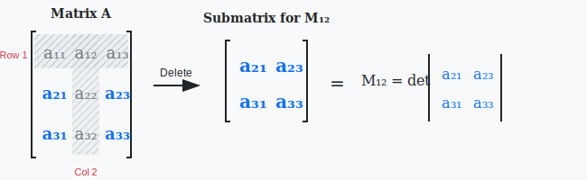
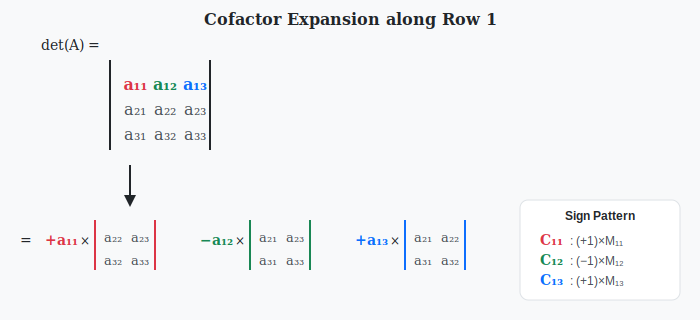
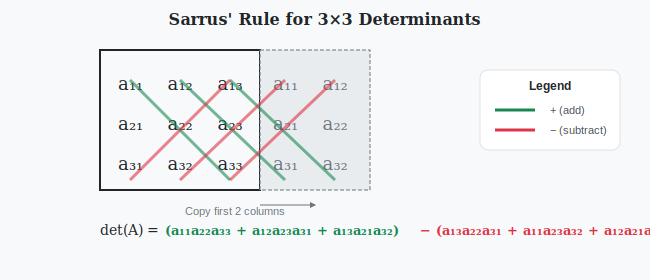
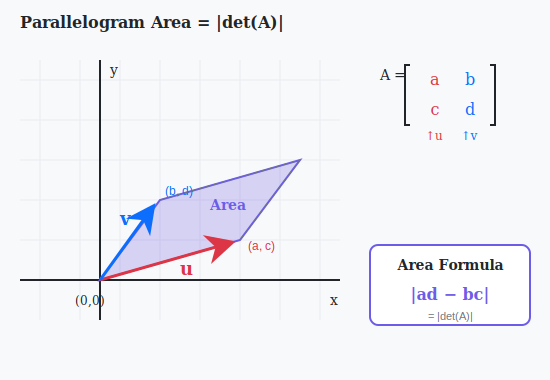
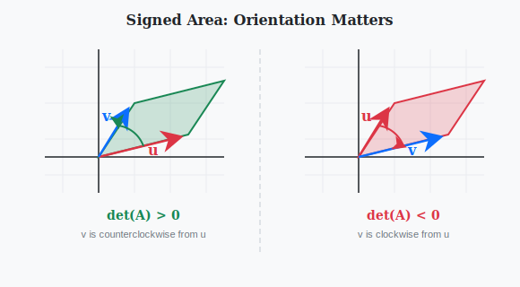
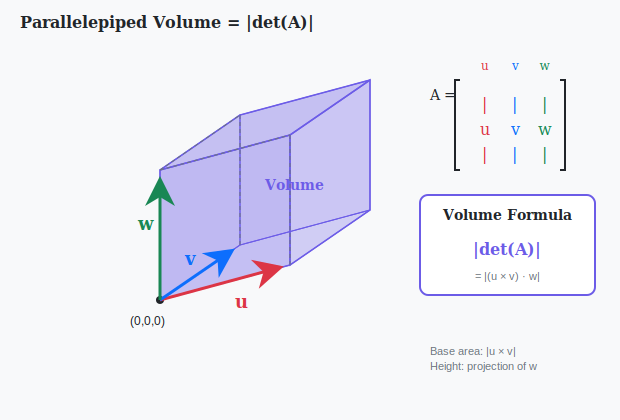

:::note
本系列文章內容參考自經典教材 **Elementary Linear Algebra (Pearson New International Edition)**。本文對應章節：**Ch3-1 Cofactor Expansion**。
:::

## **行列式的定義與符號 (Definition and Notation of Determinant)**

**行列式 (Determinant)** 是一個將方陣映射到純量的函數，在線性代數中扮演著舉足輕重的角色。它不僅可以用來判斷矩陣是否可逆，還具有深刻的幾何意義。

### **符號表示**

對於一個 $n \times n$ 的方陣 $A$，其行列式可以用以下兩種符號表示：

$$
\det(A) = |A|
$$

若 $A = \begin{bmatrix} a_{11} & a_{12} & \cdots & a_{1n} \\ a_{21} & a_{22} & \cdots & a_{2n} \\ \vdots & \vdots & \ddots & \vdots \\ a_{n1} & a_{n2} & \cdots & a_{nn} \end{bmatrix}$，也可寫成：

$$
\det(A) = \begin{vmatrix} a_{11} & a_{12} & \cdots & a_{1n} \\ a_{21} & a_{22} & \cdots & a_{2n} \\ \vdots & \vdots & \ddots & \vdots \\ a_{n1} & a_{n2} & \cdots & a_{nn} \end{vmatrix}
$$

:::warning 注意
行列式只對**方陣 (Square Matrix)** 有定義！非方陣沒有行列式。
:::

### **2×2 矩陣的行列式**

最簡單的非平凡情況是 2×2 矩陣。對於 $A = \begin{bmatrix} a & b \\ c & d \end{bmatrix}$，其行列式定義為：

$$
\colorbox{yellow}{$\det(A) = ad - bc$}
$$

 

## **子式與餘因子 (Minor and Cofactor)**

要理解高階矩陣的行列式計算，首先需要認識「子式」與「餘因子」這兩個關鍵概念。

### **子式的定義 (Minor)**

設 $A$ 是一個 $n \times n$ 矩陣，**子式 (Minor)** $M_{ij}$ 定義為：

:::info 定義
$M_{ij}$ = 刪除 $A$ 的第 $i$ 個 Row 與第 $j$ 個 Column 後，所得到的 $(n-1) \times (n-1)$ 子矩陣的行列式。
:::

下圖展示了如何從 3×3 矩陣中獲取子式 $M_{12}$：

上圖說明，計算 $M_{12}$ 時，我們刪除第 1 個 Row（橫向灰色區域）和第 2 個 Column（縱向灰色區域），然後計算剩餘 2×2 子矩陣的行列式。

### **餘因子的定義 (Cofactor)**

**餘因子 (Cofactor)** $C_{ij}$ 是子式加上適當的正負號：

$$
\colorbox{yellow}{$C_{ij} = (-1)^{i+j} \cdot M_{ij}$}
$$

其中 $(-1)^{i+j}$ 決定了正負號，形成一個「棋盤格」模式：

$$
\begin{bmatrix}
+ & - & + & - & \cdots \\
- & + & - & + & \cdots \\
+ & - & + & - & \cdots \\
- & + & - & + & \cdots \\
\vdots & \vdots & \vdots & \vdots & \ddots
\end{bmatrix}
$$

 

## **餘因子展開公式 (Cofactor Expansion Formula)**

有了子式與餘因子的概念，就可以定義任意 $n \times n$ 矩陣的行列式。

### **定理：沿任意 Row 或 Column 展開**

對於 $n \times n$ 矩陣 $A$，其行列式可以沿著**任意一個 Row 或 Column** 展開：

**沿第 $i$ 個 Row 展開**：

$$
\det(A) = a_{i1}C_{i1} + a_{i2}C_{i2} + \cdots + a_{in}C_{in} = \sum_{j=1}^{n} a_{ij}C_{ij}
$$

**沿第 $j$ 個 Column 展開**：

$$
\det(A) = a_{1j}C_{1j} + a_{2j}C_{2j} + \cdots + a_{nj}C_{nj} = \sum_{i=1}^{n} a_{ij}C_{ij}
$$

無論選擇哪一個 Row 或 Column 展開，計算結果都相同

:::info 策略提示
實際計算時，應選擇**含有最多零元素**的 Row 或 Column 進行展開，這樣可以減少需要計算的子式數量。
:::

### **餘因子展開的遞迴本質**

餘因子展開將 $n \times n$ 行列式轉化為 $n$ 個 $(n-1) \times (n-1)$ 行列式的計算問題。這是一個**遞迴定義 (Recursive Definition)**：

- $1 \times 1$ 矩陣：$\det([a]) = a$
- $n \times n$ 矩陣：利用餘因子展開，拆解成 $(n-1) \times (n-1)$ 的子問題

 

## **3×3 行列式的計算 (Computing 3×3 Determinants)**

對於 3×3 矩陣，餘因子展開提供了系統化的計算方法。

### **沿第一個 Row 展開**

設 $A = \begin{bmatrix} a_{11} & a_{12} & a_{13} \\ a_{21} & a_{22} & a_{23} \\ a_{31} & a_{32} & a_{33} \end{bmatrix}$，沿第一個 Row 展開：

$$
\det(A) = a_{11}C_{11} + a_{12}C_{12} + a_{13}C_{13}
$$

展開各項：

$$
\begin{aligned}
\det(A) &= a_{11} \cdot (+1) \begin{vmatrix} a_{22} & a_{23} \\ a_{32} & a_{33} \end{vmatrix} + a_{12} \cdot (-1) \begin{vmatrix} a_{21} & a_{23} \\ a_{31} & a_{33} \end{vmatrix} + a_{13} \cdot (+1) \begin{vmatrix} a_{21} & a_{22} \\ a_{31} & a_{32} \end{vmatrix} \\[1em]
&= a_{11}(a_{22}a_{33} - a_{23}a_{32}) - a_{12}(a_{21}a_{33} - a_{23}a_{31}) + a_{13}(a_{21}a_{32} - a_{22}a_{31})
\end{aligned}
$$

### **範例計算**

計算 $\det\begin{bmatrix} 1 & 2 & 3 \\ 4 & 5 & 6 \\ 7 & 8 & 9 \end{bmatrix}$。

**解**：沿第一個 Row 展開：

$$
\begin{aligned}
\det(A) &= 1 \cdot \begin{vmatrix} 5 & 6 \\ 8 & 9 \end{vmatrix} - 2 \cdot \begin{vmatrix} 4 & 6 \\ 7 & 9 \end{vmatrix} + 3 \cdot \begin{vmatrix} 4 & 5 \\ 7 & 8 \end{vmatrix} \\[0.5em]
&= 1(45 - 48) - 2(36 - 42) + 3(32 - 35) \\[0.5em]
&= 1(-3) - 2(-6) + 3(-3) \\[0.5em]
&= -3 + 12 - 9 \\[0.5em]
&= 0
\end{aligned}
$$

 

## **補充：Sarrus 法則 (Sarrus' Rule)**

對於 3×3 矩陣，存在一個快速的記憶法則——**Sarrus 法則**，但請注意這個方法**僅適用於 3×3 矩陣**。

計算方式如下：

1. 將前兩個 Column 複製到矩陣右側
2. 計算三條向右下斜線的乘積，全部相加（正號項）
3. 計算三條向左下斜線的乘積，全部相減（負號項）

$$
\det(A) = (a_{11}a_{22}a_{33} + a_{12}a_{23}a_{31} + a_{13}a_{21}a_{32}) - (a_{13}a_{22}a_{31} + a_{11}a_{23}a_{32} + a_{12}a_{21}a_{33})
$$

:::warning 重要提醒
Sarrus 法則**不能推廣**到 4×4 或更高階矩陣！對於高階矩陣，必須使用餘因子展開或其他方法。
:::

 

## **行列式的幾何意義 (Geometric Interpretation of Determinants)**

行列式不僅是一個代數工具，更有著深刻的幾何意義。這正是理解線性變換「縮放效果」的關鍵。

### **二維空間：平行四邊形的有向面積**

考慮二維向量 $\mathbf{u} = \begin{bmatrix} a \\ c \end{bmatrix}$ 和 $\mathbf{v} = \begin{bmatrix} b \\ d \end{bmatrix}$，它們張成一個平行四邊形。

上圖展示了由向量 $\mathbf{u}$（紅色）和 $\mathbf{v}$（藍色）構成的平行四邊形，其面積的絕對值即為 $|\det(A)|$，其中 $A = \begin{bmatrix} a & b \\ c & d \end{bmatrix}$。

#### **面積公式**

將矩陣 $A$ 的兩個 Column 視為構成平行四邊形的兩個邊向量，則：

$$
\colorbox{yellow}{$\text{平行四邊形面積} = |ad - bc| = |\det(A)|$}
$$

#### **有向面積的概念與意義**

實際上，行列式計算的是**有向面積 (Signed Area)**，而非普通面積。「有向」的意思是：**結果帶有正負號，而這個正負號編碼了向量的相對方向資訊**。

- $\det(A) > 0$：從 $\mathbf{u}$ 轉到 $\mathbf{v}$ 是**逆時針**旋轉
- $\det(A) < 0$：從 $\mathbf{u}$ 轉到 $\mathbf{v}$ 是**順時針**旋轉
- $\det(A) = 0$：$\mathbf{u}$ 和 $\mathbf{v}$ **共線**，沒有張成平面

上圖對比了正向與負向行列式對應的向量相對位置關係：左側的 $\mathbf{v}$ 在 $\mathbf{u}$ 的逆時針方向，右側則相反。

### **三維空間：平行六面體的有向體積**

考慮三個向量 $\mathbf{u}, \mathbf{v}, \mathbf{w} \in \mathbb{R}^3$，設矩陣 $A$ 的三個 Column 分別為這三個向量：

$$
A = \begin{bmatrix} | & | & | \\ \mathbf{u} & \mathbf{v} & \mathbf{w} \\ | & | & | \end{bmatrix}
$$

則：

$$
\colorbox{yellow}{$\text{平行六面體體積} = |\det(A)|$}
$$

上圖展示了由三個向量 $\mathbf{u}$、$\mathbf{v}$、$\mathbf{w}$ 構成的平行六面體，其體積的絕對值等於 $|\det(A)|$。

#### **體積公式的直覺解釋**

回顧體積公式：$V = \text{底面積} \times \text{高}$。

1. **底面積**：由 $\mathbf{u}$ 和 $\mathbf{v}$ 張成的平行四邊形面積，可用**叉積 (Cross Product)** 表示為 $\|\mathbf{u} \times \mathbf{v}\|$
2. **高**：$\mathbf{w}$ 在法向量 $\mathbf{u} \times \mathbf{v}$ 方向上的投影長度

將這兩者結合，體積 = $|(\mathbf{u} \times \mathbf{v}) \cdot \mathbf{w}|$，這正是三重純量積 (Scalar Triple Product)，其值恰好等於 $|\det(A)|$。

#### **有向體積的意義**

與二維類似，三維行列式給出的是**有向體積**：

- $\det(A) > 0$：三向量依 $\mathbf{u} \to \mathbf{v} \to \mathbf{w}$ 順序符合**右手定則**
- $\det(A) < 0$：三向量依相反順序排列（等效於左手系統）
- $\det(A) = 0$：三向量**共面**，無法張成三維體積

### **一般化：n 維的超體積**

這個幾何解釋可以推廣到任意維度：

對於 $n$ 個 $n$ 維向量 $\mathbf{v}_1, \mathbf{v}_2, \ldots, \mathbf{v}_n$，它們張成的 $n$ 維**平行多面體 (Parallelotope)** 的有向「超體積」為：

$$
\text{有向超體積} = \det\begin{bmatrix} | & | & & | \\ \mathbf{v}_1 & \mathbf{v}_2 & \cdots & \mathbf{v}_n \\ | & | & & | \end{bmatrix}
$$

:::info 線性變換的縮放因子
從另一個角度理解：若線性變換 $T: \mathbb{R}^n \to \mathbb{R}^n$ 的標準矩陣為 $A$，則 $T$ 對任意區域的「體積縮放因子」為 $|\det(A)|$。

例如，若 $\det(A) = 3$，則經過變換 $T$ 後，所有區域的「體積」都變成原來的 3 倍。
:::

 

## **行列式與可逆性 (Determinants and Invertibility)**

行列式與矩陣可逆性之間存在著優雅的等價關係。

### **定理：可逆性的行列式判別**

方陣 $A$ 可逆 $\Longleftrightarrow$ $\det(A) \neq 0$

**等價地**：$A$ 不可逆（奇異）$\Longleftrightarrow$ $\det(A) = 0$

### **幾何解釋**

這個定理的幾何意義非常直觀：

- $\det(A) \neq 0$：$A$ 的各 Column 向量線性獨立，能張成完整的 $n$ 維空間
- $\det(A) = 0$：$A$ 的各 Column 向量線性相依，「坍縮」到更低維度的空間中，導致資訊遺失而不可逆

:::tip 統一觀點
回顧先前學過的「矩陣可逆的等價條件」，現在我們又多了一個新的判別方式：只需檢查行列式是否為零！這在理論推導中非常實用。
:::

 

## **三角矩陣的行列式 (Determinants of Triangular Matrices)**

對於特殊形式的矩陣，行列式計算可以大幅簡化。

### **定理：三角矩陣的行列式**

若 $A$ 是**三角矩陣** (Triangular Matrix)——包括上三角、下三角或對角矩陣，則：

$$
\colorbox{yellow}{$\det(A) = a_{11} \cdot a_{22} \cdot a_{33} \cdots a_{nn} = \prod_{i=1}^{n} a_{ii}$}
$$

**行列式等於主對角線元素的乘積！**

### **直覺理解**

對於上三角矩陣，沿第一個 Column 展開：

$$
A = \begin{bmatrix} a_{11} & * & * & \cdots & * \\ 0 & a_{22} & * & \cdots & * \\ 0 & 0 & a_{33} & \cdots & * \\ \vdots & \vdots & \vdots & \ddots & \vdots \\ 0 & 0 & 0 & \cdots & a_{nn} \end{bmatrix}
$$

第一個 Column 只有 $a_{11}$ 非零，所以展開後只有一項。遞迴下去，每次展開都只有一項存活，最終結果就是所有對角線元素相乘。

### **推論：單位矩陣的行列式**

$$
\det(I_n) = 1
$$

因為單位矩陣是對角矩陣，對角線元素全為 1，乘積自然為 1。
