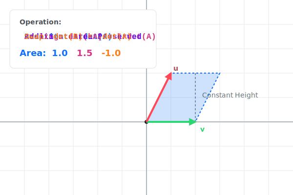
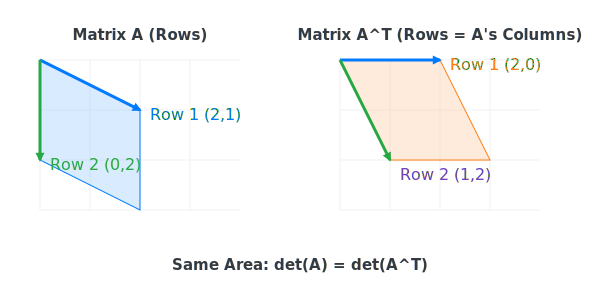
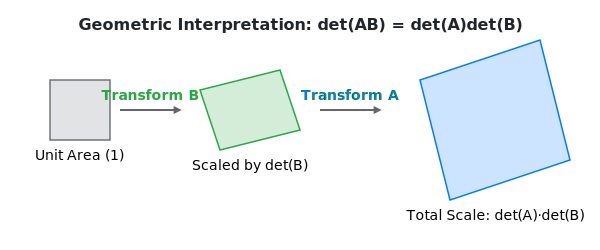

:::note
本系列文章內容參考自經典教材 **Elementary Linear Algebra (Pearson New International Edition)**。本文對應章節：**Ch3-2 Properties of Determinants**。
:::

## **Row Operations 對行列式的影響 (Effect of Row Operations)**

在計算行列式時，頻繁使用 **Row Operations** 能將矩陣化簡為三角矩陣，進而大幅提升計算效率。然而，不同的 Row Operation 對行列式的數值有著不同的影響。

### **三種 Row Operations 的影響法則**

設 $A$ 為一個 $n \times n$ 矩陣：

1.  **Row Interchange (交換兩 Row)**：
    若矩陣 $B$ 是由 $A$ 交換兩個 Row 得到，則：
    $$
    \colorbox{lightpink}{$\det(B) = -\det(A)$}
    $$
2.  **Row Scaling (某 Row 乘以 $k$ 倍)**：
    若矩陣 $B$ 是由 $A$ 的其中一個 Row 乘以純量 $k$ 得到，則：
    $$
    \colorbox{lightgreen}{$\det(B) = k \cdot \det(A)$}
    $$
3.  **Row Addition (一 Row 的 $k$ 倍加至另一 Row)**：
    若矩陣 $B$ 是由 $A$ 的一 Row 加上另一 Row 的倍數得到，則：
    $$
    \colorbox{lightblue}{$\det(B) = \det(A)$}
    $$

### **幾何直覺與視覺化**

從幾何角度來看，行列式代表了由 Row 向量構成的平行四邊形（或高維體積）。

- **Shear (Row Addition)**：將一個 Row 的倍數加到另一個 Row，相當於對形狀進行「剪切」。如上圖動畫所示，雖然形狀改變了，但「底」與「高」始終保持不變，因此**面積保持不變**。
- **Scaling**：將一個 Row 向量拉長 $k$ 倍，顯然面積也會跟著變成 $k$ 倍。
- **Swap**：交換兩個軸的位置會改變空間的**方向性 (Orientation)**，使有向面積的正負號反轉。

 

## **更多重要代數性質 (Key Algebraic Properties)**

除了基本的 Row Operations，行列式還具備幾個非常強大的代數特徵。

### **轉置矩陣的行列式 (Determinant of Transpose)**

對任意方陣 $A$，其轉置矩陣的行列式等於原矩陣的行列式：

$$
\colorbox{yellow}{$\det(A^T) = \det(A)$}
$$

這意味著：**所有關於 Row 的行列式性質，同樣適用於 Column**。例如，交換兩個 Column 也會導致行列式變號。

幾何上，轉置相當於將 Row 向量轉換為 Column 向量，或者說是沿對角線翻轉。如上圖所示，即便向量分量交換了位置，它們所張成的平行四邊形面積依然保持一致。

### **相乘矩陣的行列式 (Multiplicative Property)**

對於兩個同維度的方陣 $A$ 與 $B$：

$$
\colorbox{yellow}{$\det(AB) = \det(A) \cdot \det(B)$}
$$

:::warning 注意
雖然相乘具備此性質，但**相加則不然**！一般情況下，$\det(A+B) \neq \det(A) + \det(B)$。
:::

上圖展示了複合線性變換的幾何效果：第一個變換 $B$ 先將單位面積縮放了 $\det(B)$ 倍，接著變換 $A$ 再將其進一步縮放了 $\det(A)$ 倍。因此，複合後的總縮放倍率即為兩者行列式的乘積。

 

## **行列式與可逆矩陣 (Determinants and Invertibility)**

這是行列式在線性理論中最核心的應用之一：判斷一個矩陣是否具備反矩陣。

### **可逆性的判別準則**

一個方陣 $A$ 是**可逆的 (Invertible)**，若且唯若其行列式不為零：

$$
\colorbox{orange}{$A \text{ is invertible} \iff \det(A) \neq 0$}
$$

這個定理告訴我們：

- 若 $\det(A) = 0$，表示矩陣代表的變換會使空間「坍縮」（例如三維變二維），導致不可逆。
- 若 $\det(A) \neq 0$，則該變換保持了空間的完整維度。

### **特殊零行列式情況**

如果矩陣 $A$ 滿足以下任一條件，則其行列式必定為 $0$：

- 存在一個全零的 Row 或 Column。
- 存在兩個完全相同的 Row 或 Column。
- 存在兩個成比例的 Row 或 Column。

:::tip 計算策略
雖然上一節學了「餘因子展開」，但如果直接去暴力計算 5x5 以上的矩陣會累死。

最好的方法是混用以下計算策略：

1. **Row Operations**：先利用「Row Addition」把大部分元素變成 0（不改變行列式）。
2. **Triangular Form**：將矩陣化簡成三角矩陣後，行列式就是「主對角線乘積」。
3. **Swap**：如果中間有交換過 Row，記得最後結果要加個負號。

:::
