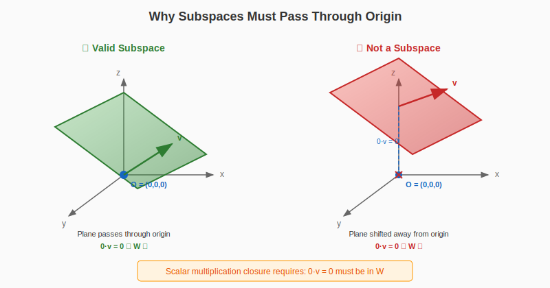
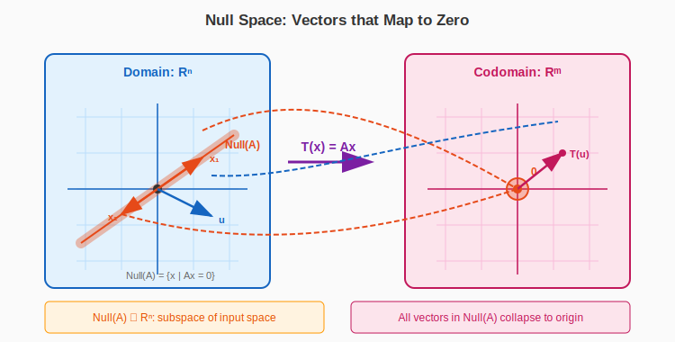

:::note
本系列文章內容參考自經典教材 **Elementary Linear Algebra (Pearson New International Edition)**。本文對應章節：**Ch4-1 Subspaces**。
:::

## **子空間的定義 (Definition of Subspace)**

在正式進入向量空間 (Vector Space) 的抽象概念之前，讓我們先從 $\mathbb{R}^n$ 中最核心的結構——**子空間 (Subspace)** 開始。子空間是向量空間中的「小宇宙」，它繼承了母空間所有的代數運算性質。

### **直觀理解**

想像 $\mathbb{R}^3$ 是整個三維空間。在這個空間中，有些特殊的「區域」本身也具備向量空間的性質，例如：

- 通過原點的一條直線
- 通過原點的一個平面
- 整個 $\mathbb{R}^3$ 本身
- 只有原點 $\{\mathbf{0}\}$

這些「區域」都是 $\mathbb{R}^3$ 的子空間。

### **嚴格定義**

設 $V$ 是一個向量空間，$W$ 是 $V$ 的非空子集合。若 $W$ 滿足以下三個條件，則稱 $W$ 是 $V$ 的**子空間 (Subspace)**：

$$
\boxed{
\begin{aligned}
&\textbf{1. 包含零向量：} \quad \mathbf{0} \in W \\[6pt]
&\textbf{2. 對向量加法封閉：} \quad \forall \mathbf{u}, \mathbf{v} \in W, \quad \mathbf{u} + \mathbf{v} \in W \\[6pt]
&\textbf{3. 對純量乘法封閉：} \quad \forall \mathbf{v} \in W, \forall c \in \mathbb{R}, \quad c\mathbf{v} \in W
\end{aligned}
}
$$

換句話說，子空間必須對**線性組合 (Linear Combination)** 封閉——取任意元素做加法、乘以任意純量，結果都還在這個集合內。

:::tip 為何子空間一定通過原點？
這是初學者常見的疑問。答案就藏在第一個條件中：**子空間必須包含零向量**。

讓我們從「封閉性」的觀點來理解：若 $W$ 是子空間，$\mathbf{v} \in W$，則根據純量乘法封閉性：

$$
0 \cdot \mathbf{v} = \mathbf{0} \in W
$$

因此，只要 $W$ 非空且滿足封閉性，它**必然包含零向量**！

:::

### **幾何圖解：經過原點的必要性**

下圖展示了為何子空間必須通過原點。左側的平面通過原點是一個合法的子空間；右側的平面不通過原點，雖然「看起來」很像子空間，但它不滿足封閉性條件。

觀察右側：取平面上的任意向量 $\mathbf{v}$，將它乘以 $0$ 會得到 $\mathbf{0}$，但 $\mathbf{0}$ 不在這個平移後的平面上！這就違反了純量乘法封閉的條件。

 

## **Span 與 Subspace 的關係**

### **Span 的定義回顧**

關於 Span 的完整定義與幾何意義，可參考 [Ch1-5 向量的張成](../01-Chapter1/05-span-of-vectors.md)。這裡簡要回顧：

給定一組向量 $\{\mathbf{v}_1, \mathbf{v}_2, \ldots, \mathbf{v}_k\}$，它們的**張成空間 (Span)** 定義為所有線性組合的集合：

$$
\text{Span}\{\mathbf{v}_1, \mathbf{v}_2, \ldots, \mathbf{v}_k\} = \left\{ c_1\mathbf{v}_1 + c_2\mathbf{v}_2 + \cdots + c_k\mathbf{v}_k \mid c_i \in \mathbb{R} \right\}
$$

### **核心定理：Span 產生的一定是 Subspace**

這是連結 Span 與 Subspace 最重要的橋樑：

> **Theorem 4.1**：設 $\mathbf{v}_1, \mathbf{v}_2, \ldots, \mathbf{v}_k$ 是 $\mathbb{R}^n$ 中的向量，則 $\text{Span}\{\mathbf{v}_1, \mathbf{v}_2, \ldots, \mathbf{v}_k\}$ 是 $\mathbb{R}^n$ 的子空間。

**證明思路**：

1. **包含零向量**：令所有係數為 $0$，則 $0\mathbf{v}_1 + 0\mathbf{v}_2 + \cdots + 0\mathbf{v}_k = \mathbf{0}$
2. **對加法封閉**：兩個線性組合相加，仍是線性組合
3. **對純量乘法封閉**：線性組合乘以純量，仍是線性組合

:::info Subspace 與 Span 的本質關係
可以這樣理解兩者的關係：

- **Span** 是一種「生成子空間的方式」——給我一些向量，我就能生成一個子空間
- **Subspace** 是滿足封閉性條件的集合——只要滿足那三個條件，就是子空間

重要的觀察是：

$$
\colorbox{yellow}{$\text{每個 Subspace 都可以寫成某個向量集合的 Span}$}
$$

這個向量集合就是該子空間的**基底 (Basis)**。我們將在後續章節深入探討基底的概念。
:::

### **幾何圖解：Span 生成 Subspace**

下圖動態展示了 $\mathbb{R}^2$ 中兩個向量如何「張成」整個平面。當 $\mathbf{v}_1$ 與 $\mathbf{v}_2$ 線性獨立時，它們的 Span 覆蓋了整個 $\mathbb{R}^2$。

 

## **與矩陣關聯的重要子空間**

每個矩陣 $A$ 都自然地關聯著幾個重要的子空間。這些子空間揭示了矩陣的核心性質，也是理解線性方程組和線性變換的關鍵。

### **Null Space (零空間)**

**Null Space**（或稱 **Kernel**）是所有被矩陣 $A$ 映射到零向量的輸入向量集合：

$$
\text{Null}(A) = \{\mathbf{x} \in \mathbb{R}^n \mid A\mathbf{x} = \mathbf{0}\}
$$

**幾何意義**：Null Space 代表了被線性變換「消滅」的方向——那些經過變換後塌縮到原點的向量。

:::tip 回顧：Null Space 與 One-to-One
在 [Ch2-8 線性變換的組成與可逆性](../02-Chapter2/05-composition-invertibility.md) 中，我們已經學過：

- $T$ 是 **One-to-One** $\Leftrightarrow$ $\text{Null}(A) = \{\mathbf{0}\}$
- Null Space 非平凡（包含非零向量）意味著有資訊損失
  :::

### **Null Space 是一個 Subspace**

> **Theorem 4.2**：設 $A$ 是一個 $m \times n$ 矩陣，則 $\text{Null}(A)$ 是 $\mathbb{R}^n$ 的子空間。

**證明**：

1. **包含零向量**：$A\mathbf{0} = \mathbf{0}$，所以 $\mathbf{0} \in \text{Null}(A)$
2. **對加法封閉**：若 $A\mathbf{u} = \mathbf{0}$ 且 $A\mathbf{v} = \mathbf{0}$，則 $A(\mathbf{u} + \mathbf{v}) = A\mathbf{u} + A\mathbf{v} = \mathbf{0} + \mathbf{0} = \mathbf{0}$
3. **對純量乘法封閉**：若 $A\mathbf{v} = \mathbf{0}$，則 $A(c\mathbf{v}) = cA\mathbf{v} = c\mathbf{0} = \mathbf{0}$

下圖展示了 Null Space 的幾何意義：Domain 中屬於 Null Space 的向量（橘色）被變換映射到 Codomain 的原點，而不在 Null Space 中的向量（藍色）則被映射到其他位置。

:::info 為什麼 Null Space 的維度與「輸入」維度相關？
對於 $m \times n$ 矩陣 $A$，注意到：

- $A\mathbf{x} = \mathbf{0}$ 是一個關於 $\mathbf{x} \in \mathbb{R}^n$ 的方程
- 解集合 $\text{Null}(A)$ 自然是 $\mathbb{R}^n$ 的子集

因此，$\text{Null}(A)$ 是 $\mathbb{R}^n$（輸入空間）的子空間，而非 $\mathbb{R}^m$（輸出空間）的子空間。

這與 Theorem 4.2 的內容一致：Null Space 的維度 (Nullity) 與矩陣的 **column 數量 $n$** 相關，透過 Rank-Nullity 定理：

$$
\colorbox{lightblue}{$\text{rank}(A) + \text{nullity}(A) = n$}
$$

:::

### **計算 Null Space**

求解 Null Space 就是求解齊次線性方程組 $A\mathbf{x} = \mathbf{0}$：

**範例**：設 $A = \begin{bmatrix} 1 & 3 & 5 & 7 \\ 2 & 4 & 6 & 8 \end{bmatrix}$

**Step 1**：將 $[A \mid \mathbf{0}]$ 化為 RREF

$$
\begin{bmatrix} 1 & 3 & 5 & 7 \\ 2 & 4 & 6 & 8 \end{bmatrix} \xrightarrow{\text{RREF}} \begin{bmatrix} 1 & 0 & -1 & -2 \\ 0 & 1 & 2 & 3 \end{bmatrix}
$$

**Step 2**：識別 pivot 和 free variables

- Pivot columns：第 1、2 個 column
- Free variables：$x_3$、$x_4$

**Step 3**：用 free variables 表達通解

$$
\begin{cases}
x_1 = x_3 + 2x_4 \\
x_2 = -2x_3 - 3x_4 \\
x_3 = x_3 \\
x_4 = x_4
\end{cases}
$$

**Step 4**：寫成 Span 形式

$$
\text{Null}(A) = \text{Span}\left\{ \begin{bmatrix} 1 \\ -2 \\ 1 \\ 0 \end{bmatrix}, \begin{bmatrix} 2 \\ -3 \\ 0 \\ 1 \end{bmatrix} \right\}
$$

 

## **Column Space (Column 空間)**

### **定義**

**Column Space** 是矩陣 $A$ 所有 column vectors 的 Span：

$$
\text{Col}(A) = \text{Span}\{\mathbf{a}_1, \mathbf{a}_2, \ldots, \mathbf{a}_n\}
$$

其中 $\mathbf{a}_1, \ldots, \mathbf{a}_n$ 是 $A$ 的 column vectors。

由於 Column Space 是某些向量的 Span，根據 Theorem 4.1，它自動是一個子空間。

### **Column Space = Range！**

這是連結線性變換與矩陣最重要的觀察之一：

$$
\colorbox{yellow}{$\text{Col}(A) = \text{Range}(T_A)$}
$$

其中 $T_A: \mathbb{R}^n \to \mathbb{R}^m$ 定義為 $T_A(\mathbf{x}) = A\mathbf{x}$。

:::tip 回顧：Range 的本質
在 [Ch2-8](../02-Chapter2/05-composition-invertibility.md) 中，我們已經推導過這個關係。核心觀察是：

$$
A\mathbf{x} = x_1\mathbf{a}_1 + x_2\mathbf{a}_2 + \cdots + x_n\mathbf{a}_n
$$

也就是說，$A\mathbf{x}$ 永遠是 $A$ 的 column vectors 的線性組合。所有可能的輸出集合，就是所有線性組合的集合——也就是 Column Space！

**線性變換的值域 (Range) 就是其標準矩陣的 Column Space。**
:::

### **判斷向量是否屬於 Column Space**

如何判斷一個向量 $\mathbf{u}$ 是否屬於 $\text{Col}(A)$？

$$
\colorbox{lightblue}{$\mathbf{u} \in \text{Col}(A) \iff \text{方程式 } A\mathbf{x} = \mathbf{u} \text{ 有解}$}
$$

這個判斷標準非常實用！只需檢查增廣矩陣 $[A \mid \mathbf{u}]$ 是否 consistent。

**範例**：設 $A = \begin{bmatrix} 1 & 2 \\ 3 & 6 \end{bmatrix}$，判斷 $\mathbf{u} = \begin{bmatrix} 5 \\ 15 \end{bmatrix}$ 與 $\mathbf{v} = \begin{bmatrix} 1 \\ 2 \end{bmatrix}$ 是否屬於 $\text{Col}(A)$。

**Solution for $\mathbf{u}$**：

$$
[A \mid \mathbf{u}] = \begin{bmatrix} 1 & 2 & 5 \\ 3 & 6 & 15 \end{bmatrix} \xrightarrow{\text{RREF}} \begin{bmatrix} 1 & 2 & 5 \\ 0 & 0 & 0 \end{bmatrix}
$$

系統 consistent！因此 $\mathbf{u} \in \text{Col}(A)$。

**Solution for $\mathbf{v}$**：

$$
[A \mid \mathbf{v}] = \begin{bmatrix} 1 & 2 & 1 \\ 3 & 6 & 2 \end{bmatrix} \xrightarrow{\text{RREF}} \begin{bmatrix} 1 & 2 & 0 \\ 0 & 0 & 1 \end{bmatrix}
$$

最後一個 row 是 $[0 \ 0 \mid 1]$，代表 $0 = 1$，矛盾！系統 inconsistent，因此 $\mathbf{v} \notin \text{Col}(A)$。

 

## **Row Space (Row 空間)**

### **定義**

**Row Space** 是矩陣 $A$ 所有 row vectors 的 Span。如果 $A$ 的 rows 為 $\mathbf{r}_1, \mathbf{r}_2, \ldots, \mathbf{r}_m$（視為 row vectors），則：

$$
\text{Row}(A) = \text{Span}\{\mathbf{r}_1, \mathbf{r}_2, \ldots, \mathbf{r}_m\}
$$

等價地，$\text{Row}(A) = \text{Col}(A^T)$。

### **Row Space 的重要性質**

Row Space 有一個非常重要的不變性：

> **Theorem**：Row Reduction 不改變 Row Space。

這意味著 $A$ 與其 RREF $R$ 有相同的 Row Space！因此，$R$ 的非零 rows 就是 $\text{Row}(A)$ 的一組基底。

 

## **矩陣的四大基本子空間 (The Four Fundamental Subspaces)**

每個 $m \times n$ 矩陣 $A$ 都關聯著四個基本子空間。這些空間的維度之間有著深刻的關係：

| 子空間                                 | 定義                                | 所屬空間       | 維度                 |
| :------------------------------------- | :---------------------------------- | :------------- | :------------------- |
| **Column Space** $\text{Col}(A)$       | $A$ 的 column vectors 的 Span       | $\mathbb{R}^m$ | $\text{rank}(A)$     |
| **Row Space** $\text{Row}(A)$          | $A$ 的 row vectors 的 Span          | $\mathbb{R}^n$ | $\text{rank}(A)$     |
| **Null Space** $\text{Null}(A)$        | $A\mathbf{x} = \mathbf{0}$ 的解集   | $\mathbb{R}^n$ | $n - \text{rank}(A)$ |
| **Left Null Space** $\text{Null}(A^T)$ | $A^T\mathbf{y} = \mathbf{0}$ 的解集 | $\mathbb{R}^m$ | $m - \text{rank}(A)$ |

### **維度關係總整理**

設 $A$ 是 $m \times n$ 矩陣，令 $r = \text{rank}(A)$：

$$
\begin{aligned}
\dim(\text{Col}(A)) &= r \\
\dim(\text{Row}(A)) &= r \\
\dim(\text{Null}(A)) &= n - r \\
\dim(\text{Null}(A^T)) &= m - r
\end{aligned}
$$

特別注意：

$$
\colorbox{yellow}{$\dim(\text{Col}(A)) + \dim(\text{Null}(A)) = n$}
$$

$$
\colorbox{yellow}{$\dim(\text{Row}(A)) + \dim(\text{Null}(A^T)) = m$}
$$

這就是著名的 **Rank-Nullity Theorem** 的兩種形式！

 

 
