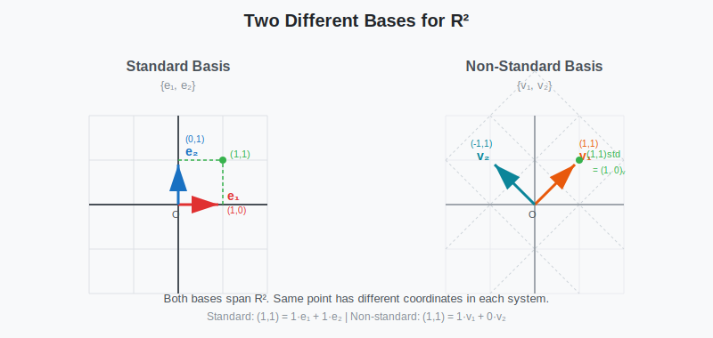
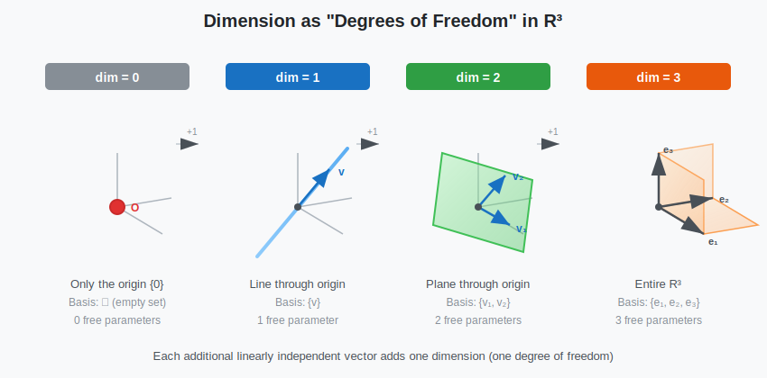

:::note
本系列文章內容參考自經典教材 **Elementary Linear Algebra (Pearson New International Edition)**。本文對應章節：**Ch4-2 Basis and Dimension**。
:::

## **基底的直觀理解 (Intuitive Understanding of Basis)**

在學習線性代數時，我們經常會問：「如何用最少的向量來描述一個空間？」

想像你在 $\mathbb{R}^2$ 平面上，你需要一套「座標系統」來描述任意一點的位置。最自然的選擇是使用兩個垂直的方向——**水平和垂直**。

> 但其實，只要這兩個方向不「重疊」（線性獨立），任何一對方向都可以建立座標系統！

**基底 (Basis)** 就是這樣的概念：它是一組向量，能夠：

1. **生成**整個空間（每個點都能表示）
2. **沒有冗餘**（每個向量都「貢獻」了獨特的方向）

換句話說，基底是描述空間最「精簡」且「完整」的向量集合。

 

## **Generating Set (生成集)**

在定義基底之前，我們先回顧「生成」(Span) 的概念。

:::info 回顧：Span 的定義
關於 Span 的完整討論，請參考 [Ch1-6 向量的張成](../01-Chapter1/05-span-of-vectors.md)。
:::

### **定義**

一個向量集合 $S = \{\mathbf{v}_1, \mathbf{v}_2, \ldots, \mathbf{v}_k\}$ 被稱為子空間 $V$ 的 **Generating Set（生成集）** 或 **Spanning Set**，如果：

$$
V = \text{Span}\{\mathbf{v}_1, \mathbf{v}_2, \ldots, \mathbf{v}_k\}
$$

也就是說，$V$ 中的每個向量都可以寫成 $S$ 中向量的線性組合。

### **生成向量空間需要多少向量？**

> **Theorem**：任何能生成 $\mathbb{R}^n$ 的向量集合，至少要有 $n$ 個向量。

**直觀理解**：$\mathbb{R}^n$ 有 $n$ 個「獨立的方向」。如果向量數量少於 $n$，根本無法「覆蓋」所有方向。

例如，在 $\mathbb{R}^3$ 中，僅用 2 個向量最多只能張成一個平面，無法覆蓋整個三維空間。

 

## **Linear Independence (線性獨立)**

另一個構成基底的關鍵概念是「線性獨立」。

:::info 回顧：線性獨立的定義
關於線性獨立的完整討論，請參考 [Ch1-7 線性相依與線性獨立](../01-Chapter1/06-linear-dependence-independence.md)。
:::

### **定義回顧**

一個向量集合 $\{\mathbf{v}_1, \mathbf{v}_2, \ldots, \mathbf{v}_k\}$ 是 **線性獨立 (Linearly Independent)** 的，若且唯若：

$$
c_1\mathbf{v}_1 + c_2\mathbf{v}_2 + \cdots + c_k\mathbf{v}_k = \mathbf{0} \implies c_1 = c_2 = \cdots = c_k = 0
$$

換句話說，要組合出零向量，唯一的方法是所有係數都為零。

### **線性獨立集合最多有幾個向量？**

> **Theorem**：在 $\mathbb{R}^n$ 中，任何線性獨立的向量集合最多只能有 $n$ 個向量。

**直觀理解**：$\mathbb{R}^n$ 只有 $n$ 個「獨立的維度」。如果向量超過 $n$ 個，必然有些向量可以被其他向量「表示出來」，也就是產生線性相依。

例如，在 $\mathbb{R}^2$ 中，任意 3 個向量必定線性相依，因為第 3 個向量一定可以用前兩個的線性組合表示。

 

## **基底的定義 (Definition of Basis)**

### **定義**

設 $V$ 是 $\mathbb{R}^n$ 的子空間，一個向量集合 $B = \{\mathbf{v}_1, \mathbf{v}_2, \ldots, \mathbf{v}_k\}$ 被稱為 $V$ 的 **基底 (Basis)**，如果：

$$
\boxed{
\begin{aligned}
&\textbf{1. } B \text{ 生成 } V \text{：} \quad V = \text{Span}(B) \\[6pt]
&\textbf{2. } B \text{ 線性獨立}
\end{aligned}
}
$$

基底同時滿足「能表達一切」和「沒有冗餘」兩個條件。

### **基底的向量數量**

結合前面兩個定理，我們可以推導出一個重要的性質：

對於 $\mathbb{R}^n$ 本身的基底：

- **生成 $\mathbb{R}^n$ 需要「至少」$n$ 個向量**
- **線性獨立的集合「最多」$n$ 個向量**

因此，$\mathbb{R}^n$ 的基底**恰好有 $n$ 個向量**。

可以證明：**一個子空間 $V$ 的所有基底都包含相同數量的向量**。這個數量就是子空間的「維度」（我們稍後會正式定義）。

:::tip 判定基底的捷徑
對於 $\mathbb{R}^n$：若 $S$ 恰有 $n$ 個向量，只需驗證 $S$ 線性獨立**或** $S$ 生成 $\mathbb{R}^n$ 其中一個條件，就能確認 $S$ 是基底。

這是因為對於恰好 $n$ 個向量：

- 若線性獨立，必定能生成 $\mathbb{R}^n$（否則會少於 $n$ 維）
- 若生成 $\mathbb{R}^n$，必定線性獨立（否則可以移除冗餘向量）
  :::

### **基底的唯一表示性**

基底有一個非常優美的性質：

> **Theorem (Unique Representation)**：設 $B = \{\mathbf{v}_1, \ldots, \mathbf{v}_k\}$ 是子空間 $V$ 的基底，則 $V$ 中每個向量 $\mathbf{u}$ **恰好**有一種方式表示為 $B$ 中向量的線性組合：
>
> $$\mathbf{u} = c_1\mathbf{v}_1 + c_2\mathbf{v}_2 + \cdots + c_k\mathbf{v}_k$$
>
> 且係數 $c_1, c_2, \ldots, c_k$ 是唯一的。

**證明**：假設存在兩種表示方式：
$$\mathbf{u} = c_1\mathbf{v}_1 + \cdots + c_k\mathbf{v}_k = d_1\mathbf{v}_1 + \cdots + d_k\mathbf{v}_k$$

相減得：
$$(c_1 - d_1)\mathbf{v}_1 + \cdots + (c_k - d_k)\mathbf{v}_k = \mathbf{0}$$

由於 $\{\mathbf{v}_1, \ldots, \mathbf{v}_k\}$ 線性獨立，所有係數必為零，即 $c_i = d_i$。∎

 

## **標準基底 (Standard Basis)**

$\mathbb{R}^n$ 中最自然的基底是**標準基底 (Standard Basis)**：

$$
\mathcal{E} = \{\mathbf{e}_1, \mathbf{e}_2, \ldots, \mathbf{e}_n\}
$$

其中：

$$
\mathbf{e}_1 = \begin{bmatrix} 1 \\ 0 \\ \vdots \\ 0 \end{bmatrix}, \quad
\mathbf{e}_2 = \begin{bmatrix} 0 \\ 1 \\ \vdots \\ 0 \end{bmatrix}, \quad \ldots, \quad
\mathbf{e}_n = \begin{bmatrix} 0 \\ 0 \\ \vdots \\ 1 \end{bmatrix}
$$

**驗證它是基底**：

1. **線性獨立**：$c_1\mathbf{e}_1 + \cdots + c_n\mathbf{e}_n = \mathbf{0}$ 得 $\begin{bmatrix} c_1 \\ c_2 \\ \vdots \\ c_n \end{bmatrix} = \mathbf{0}$，故 $c_i = 0$。
2. **生成 $\mathbb{R}^n$**：任意 $\mathbf{x} = \begin{bmatrix} x_1 \\ x_2 \\ \vdots \\ x_n \end{bmatrix} = x_1\mathbf{e}_1 + x_2\mathbf{e}_2 + \cdots + x_n\mathbf{e}_n$。

標準基底的好處是係數直接就是向量的分量！

### **兩組不同基底的比較**

下圖展示了 $\mathbb{R}^2$ 中的兩組不同基底——標準基底和另一組非標準基底。兩者都能「生成」整個平面，但「座標系統」不同。

 

## **維度的定義 (Definition of Dimension)**

### **維度的定義**

由於一個子空間的所有基底都包含相同數量的向量，我們可以定義：

> **Definition (Dimension)**：子空間 $V$ 的**維度 (Dimension)**，記作 $\dim(V)$，是 $V$ 的任一基底所含向量的數量。

根據這個定義：

- $\dim(\mathbb{R}^n) = n$（標準基底有 $n$ 個向量）
- $\dim(\{\mathbf{0}\}) = 0$

:::info 為何零空間的維度是 0？
只包含零向量的子空間 $\{\mathbf{0}\}$ 是一個特殊情況。根據基底的定義，基底必須是線性獨立的，但 $\{\mathbf{0}\}$ 本身並不線性獨立（因為 $1 \cdot \mathbf{0} = \mathbf{0}$ 有非零係數解）。

因此 $\{\mathbf{0}\}$ 的基底是**空集合** $\emptyset$，而空集合包含 0 個向量，所以 $\dim(\{\mathbf{0}\}) = 0$。
:::

### **維度的幾何意義**

維度代表空間的「自由度」——需要多少個獨立參數才能描述空間中的所有點。

| 子空間類型                                                  | 幾何形狀       | 維度 |
| :---------------------------------------------------------- | :------------- | :--: |
| $\{\mathbf{0}\}$                                            | 一個點（原點） |  0   |
| $\text{Span}\{\mathbf{v}\}$（$\mathbf{v} \neq \mathbf{0}$） | 通過原點的直線 |  1   |
| $\text{Span}\{\mathbf{v}_1, \mathbf{v}_2\}$（線性獨立）     | 通過原點的平面 |  2   |
| $\mathbb{R}^3$                                              | 整個三維空間   |  3   |

下圖展示了 $\mathbb{R}^3$ 中不同維度的子空間：從 0 維（原點）到 3 維（整個空間），每增加一個獨立方向，維度就增加 1。

 

## **求子空間基底的方法**

### **方法一：從 Span 中提取基底**

給定一個子空間 $V = \text{Span}\{\mathbf{v}_1, \mathbf{v}_2, \ldots, \mathbf{v}_k\}$，如何找出 $V$ 的基底？

**步驟**：

1. 將向量排成矩陣的 columns：$A = [\mathbf{v}_1 \ \mathbf{v}_2 \ \cdots \ \mathbf{v}_k]$
2. 化為 RREF，找出 **pivot columns**
3. 原矩陣 $A$ 中對應 pivot columns 的向量就是基底

**範例**：設 $V = \text{Span}\left\{ \begin{bmatrix} 1 \\ 2 \\ 3 \end{bmatrix}, \begin{bmatrix} 2 \\ 4 \\ 6 \end{bmatrix}, \begin{bmatrix} 1 \\ 1 \\ 1 \end{bmatrix} \right\}$

**Step 1：將向量排成矩陣**

$$
A = \begin{bmatrix} 1 & 2 & 1 \\ 2 & 4 & 1 \\ 3 & 6 & 1 \end{bmatrix}
$$

**Step 2：化為 RREF**

$$
\begin{bmatrix} 1 & 2 & 1 \\ 2 & 4 & 1 \\ 3 & 6 & 1 \end{bmatrix}
\xrightarrow{R_2 - 2R_1}
\begin{bmatrix} 1 & 2 & 1 \\ 0 & 0 & -1 \\ 3 & 6 & 1 \end{bmatrix}
\xrightarrow{R_3 - 3R_1}
\begin{bmatrix} 1 & 2 & 1 \\ 0 & 0 & -1 \\ 0 & 0 & -2 \end{bmatrix}
$$

$$
\xrightarrow{R_3 - 2R_2}
\begin{bmatrix} 1 & 2 & 1 \\ 0 & 0 & -1 \\ 0 & 0 & 0 \end{bmatrix}
\xrightarrow{-R_2}
\begin{bmatrix} 1 & 2 & 1 \\ 0 & 0 & 1 \\ 0 & 0 & 0 \end{bmatrix}
\xrightarrow{R_1 - R_3}
\begin{bmatrix} 1 & 2 & 0 \\ 0 & 0 & 1 \\ 0 & 0 & 0 \end{bmatrix}
$$

**Step 3：識別 pivot columns**

RREF 為 $\begin{bmatrix} 1 & 2 & 0 \\ 0 & 0 & 1 \\ 0 & 0 & 0 \end{bmatrix}$，pivot 出現在第 1 和第 3 個 column（leading 1 的位置）。

**Step 4：從原矩陣取對應的 columns**

第 2 個 column（$\begin{bmatrix} 2 \\ 4 \\ 6 \end{bmatrix}$）不是 pivot column，這代表它是其他向量的線性組合（實際上它是第 1 個向量的 2 倍），所以是「冗餘」的。

$$
\text{Basis of } V = \left\{ \begin{bmatrix} 1 \\ 2 \\ 3 \end{bmatrix}, \begin{bmatrix} 1 \\ 1 \\ 1 \end{bmatrix} \right\}, \quad \dim(V) = 2
$$

:::warning 注意！
基底要取的是**原矩陣** $A$ 的 columns，不是 RREF 的 columns！

RREF 告訴我們「哪些 columns 是 pivot」，但基底向量要從原始向量集合中取。
:::

### **方法二：從方程組描述求基底**

有時子空間以「滿足某些限制條件」的形式給出，例如：

$$
V = \left\{ \begin{bmatrix} x \\ y \\ z \end{bmatrix} \in \mathbb{R}^3 : x + 2y - z = 0 \right\}
$$

**步驟**：

1. 解出自由變數表示式
2. 將通解寫成自由變數的線性組合
3. 組合中的向量就是基底

**解法**：從 $x + 2y - z = 0$ 得 $x = -2y + z$

令 $y = s, z = t$（自由變數），則：

$$
\begin{bmatrix} x \\ y \\ z \end{bmatrix} = \begin{bmatrix} -2s + t \\ s \\ t \end{bmatrix} = s\begin{bmatrix} -2 \\ 1 \\ 0 \end{bmatrix} + t\begin{bmatrix} 1 \\ 0 \\ 1 \end{bmatrix}
$$

因此：

$$
\text{Basis of } V = \left\{ \begin{bmatrix} -2 \\ 1 \\ 0 \end{bmatrix}, \begin{bmatrix} 1 \\ 0 \\ 1 \end{bmatrix} \right\}, \quad \dim(V) = 2
$$

:::tip 限制式與維度的關係
$V$ 雖然活在 3 維空間 $\mathbb{R}^3$ 內，但因為有一個限制方程式，自由度就少了一個：

$$
\text{維度} = \text{變數個數} - \text{限制式個數} = 3 - 1 = 2
$$

所以 $V$ 實際上是一個 **2 維的平面**（通過原點）。

若 $V$ 由 $k$ 個獨立的線性方程式定義於 $\mathbb{R}^n$ 中，則：

$$
\dim(V) = n - k
$$

既然 $V$ 的維度是 2，那麼任何一組位於 $V$ 中且線性獨立的向量，只要數量剛好是 2 個，它們就自動構成 $V$ 的基底。
:::

下圖直觀展示了這個關係：$\mathbb{R}^3$ 中的子空間 $V$ 由一個方程 $x + 2y - z = 0$ 定義，因此維度從 3 降到了 2，形成一個通過原點的平面。

 

## **範例：找出子空間的基底**

:::info 同一子空間有多種基底
一個子空間可以有**無限多種不同的基底**，但所有基底的**向量數量（維度）是唯一固定的**。

下面的兩個範例展示了同一個子空間 $V$（由 $a - b + c = 0$ 定義）的兩組不同基底：

- 範例 1 得到 $\left\{ \begin{bmatrix} 1 \\ 1 \\ 0 \end{bmatrix}, \begin{bmatrix} -1 \\ 0 \\ 1 \end{bmatrix} \right\}$
- 範例 2 驗證 $\left\{ \begin{bmatrix} 1 \\ 2 \\ 1 \end{bmatrix}, \begin{bmatrix} 2 \\ 1 \\ -1 \end{bmatrix} \right\}$ 也是基底

兩組基底完全不同，但都有 2 個向量，因為 $\dim(V) = 2$。
:::

### **範例 1：由方程描述的子空間**

設 $V = \left\{ \begin{bmatrix} a \\ b \\ c \end{bmatrix} \in \mathbb{R}^3 : a - b + c = 0 \right\}$，求 $V$ 的基底與維度。

**Solution**：

由 $a - b + c = 0$ 得 $a = b - c$，令 $b = s, c = t$：

$$
\begin{bmatrix} a \\ b \\ c \end{bmatrix} = \begin{bmatrix} s - t \\ s \\ t \end{bmatrix} = s\begin{bmatrix} 1 \\ 1 \\ 0 \end{bmatrix} + t\begin{bmatrix} -1 \\ 0 \\ 1 \end{bmatrix}
$$

**基底**：$\left\{ \begin{bmatrix} 1 \\ 1 \\ 0 \end{bmatrix}, \begin{bmatrix} -1 \\ 0 \\ 1 \end{bmatrix} \right\}$，$\dim(V) = 2$

### **範例 2：判斷向量集是否為子空間的基底**

已知 $V$ 是上例的子空間（$\dim(V) = 2$）。判斷 $S = \left\{ \begin{bmatrix} 1 \\ 2 \\ 1 \end{bmatrix}, \begin{bmatrix} 2 \\ 1 \\ -1 \end{bmatrix} \right\}$ 是否為 $V$ 的基底。

**Solution**：

**Step 1：驗證 $S \subseteq V$（每個向量都滿足 $a - b + c = 0$）**

- $\begin{bmatrix} 1 \\ 2 \\ 1 \end{bmatrix}$：$1 - 2 + 1 = 0$ ✓
- $\begin{bmatrix} 2 \\ 1 \\ -1 \end{bmatrix}$：$2 - 1 + (-1) = 0$ ✓

**Step 2：$S$ 有 2 個向量，恰好等於 $\dim(V) = 2$**

**Step 3：只需驗證線性獨立。將向量排成矩陣：**

$$
\begin{bmatrix} 1 & 2 \\ 2 & 1 \\ 1 & -1 \end{bmatrix} \xrightarrow{\text{RREF}} \begin{bmatrix} 1 & 0 \\ 0 & 1 \\ 0 & 0 \end{bmatrix}
$$

兩個 pivot columns，確認線性獨立 ✓

**結論**：$S$ 是 $V$ 的基底！

 
