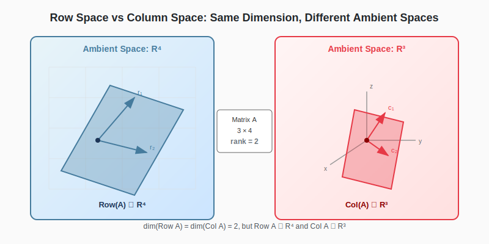

:::note
本系列文章內容參考自經典教材 **Elementary Linear Algebra (Pearson New International Edition)**。本文對應章節：**Ch4-3 The Dimension of Subspaces Associated with a Matrix**。
:::

## **矩陣相關的基本子空間 (Fundamental Subspaces of a Matrix)**

每一個矩陣 $A$ 都會自然地對應幾個重要的子空間。設 $A$ 是一個 $m \times n$ 矩陣（$m$ 個 Row，$n$ 個 Column），則：

:::info 回顧：子空間的定義
關於 Row Space、Column Space 與 Null Space 的完整定義，請參考 [Ch4-1 子空間](./01-subspaces.md)。
:::

### **Row Space (Row 空間)**

**Row Space** 是由 $A$ 的所有 Row 向量所生成的子空間：

$$
\text{Row}(A) = \text{Span}\{\text{row}_1(A), \text{row}_2(A), \ldots, \text{row}_m(A)\}
$$

由於每個 Row 向量有 $n$ 個分量，Row Space 是 $\mathbb{R}^n$ 的子空間。

### **Column Space (Column 空間)**

**Column Space** 是由 $A$ 的所有 Column 向量所生成的子空間：

$$
\text{Col}(A) = \text{Span}\{\text{col}_1(A), \text{col}_2(A), \ldots, \text{col}_n(A)\}
$$

由於每個 Column 向量有 $m$ 個分量，Column Space 是 $\mathbb{R}^m$ 的子空間。

### **Null Space (零空間)**

**Null Space** 是所有滿足 $A\mathbf{x} = \mathbf{0}$ 的向量所構成的集合：

$$
\text{Null}(A) = \{\mathbf{x} \in \mathbb{R}^n : A\mathbf{x} = \mathbf{0}\}
$$

由於 $\mathbf{x}$ 是 $n$ 維向量，Null Space 是 $\mathbb{R}^n$ 的子空間。

### **四大基本子空間總覽**

對於 $m \times n$ 矩陣 $A$，以下是四個基本子空間的維度關係：

| 子空間             | 所屬空間       | 維度                                                             |
| :----------------- | :------------- | :--------------------------------------------------------------- |
| $\text{Col}(A)$    | $\mathbb{R}^m$ | $\text{rank}(A)$                                                 |
| $\text{Null}(A)$   | $\mathbb{R}^n$ | $\text{nullity}(A) = n - \text{rank}(A)$                         |
| $\text{Row}(A)$    | $\mathbb{R}^n$ | $\text{rank}(A)$                                                 |
| $\text{Null}(A^T)$ | $\mathbb{R}^m$ | $m - \text{rank}(A)$（因為 $\text{rank}(A) = \text{rank}(A^T)$） |

:::info 回顧：Rank 與 Nullity
關於 Rank、Nullity 的定義以及 Rank-Nullity Theorem，請參考 [Ch1-4 高斯消去法](../01-Chapter1/04-gaussian-elimination.md#秩-rank-與零度-nullity)。
:::

 

## **求 Row Space 與 Column Space 的基底**

### **Row Space 的基底**

要找出 Row Space 的基底，我們可以利用**Row Echelon Form (REF)** 或 **Reduced Row Echelon Form (RREF)**。

> **Theorem**：矩陣 $A$ 與其 Row Echelon Form $R$ 具有相同的 Row Space：
> $$\text{Row}(A) = \text{Row}(R)$$

:::tip **為什麼 Elementary Row Operations 不會改變 Row Space？**

考慮三種 Elementary Row Operations：

1. **Row Interchange**（$R_i \leftrightarrow R_j$）：只是重新排列 Row 的順序，生成集合的元素不變，Span 自然不變。

2. **Row Scaling**（$R_i \to cR_i$，$c \neq 0$）：將某個 Row 乘以非零常數。由於 $\text{Span}\{\mathbf{v}\} = \text{Span}\{c\mathbf{v}\}$（$c \neq 0$），所以不影響整體的 Span。

3. **Row Addition**（$R_i \to R_i + cR_j$）：這是最關鍵的情況。設原本的 Rows 是 $\mathbf{r}_1, \ldots, \mathbf{r}_m$，操作後變成 $\mathbf{r}_1, \ldots, \mathbf{r}_i + c\mathbf{r}_j, \ldots, \mathbf{r}_m$。
   - **新 Row 可被舊 Rows 表示**：$\mathbf{r}_i + c\mathbf{r}_j$ 本來就是舊 Rows 的線性組合
   - **舊 Row 可被新 Rows 表示**：$\mathbf{r}_i = (\mathbf{r}_i + c\mathbf{r}_j) - c\mathbf{r}_j$，也是新 Rows 的線性組合
   - 因此兩組向量生成相同的 Span

因此，Row Echelon Form 中的**非零 Row** 向量就構成 Row Space 的一組基底。
:::

**範例**：設 $A = \begin{bmatrix} 1 & 2 & -1 & 3 \\ 2 & 4 & 0 & 2 \\ 1 & 2 & 1 & -1 \end{bmatrix}$

化為 RREF：

$$
A \xrightarrow{\text{RREF}} \begin{bmatrix} 1 & 2 & 0 & 1 \\ 0 & 0 & 1 & -2 \\ 0 & 0 & 0 & 0 \end{bmatrix}
$$

Row Space 的基底為：$\left\{ \begin{bmatrix} 1 \\ 2 \\ 0 \\ 1 \end{bmatrix}, \begin{bmatrix} 0 \\ 0 \\ 1 \\ -2 \end{bmatrix} \right\}$（將 Row 寫成 Column 形式）

因此 $\dim(\text{Row}(A)) = 2$。

### **Column Space 的基底**

要找出 Column Space 的基底，我們使用**Pivot Columns**。

> **Theorem**：設 $A \xrightarrow{\text{RREF}} R$，則 $A$ 中與 $R$ 的 **pivot columns** 對應的 columns 構成 $\text{Col}(A)$ 的基底。

:::warning 注意！
這裡取的是**原矩陣 $A$** 的 columns，不是 RREF 的 columns！

RREF 告訴我們「哪些 columns 有 pivot」，基底向量要從原始矩陣取。
:::

**範例**（續上例）：

從 RREF 可知，pivot columns 在第 1 個和第 3 個位置，因此：

Column Space 的基底為：$\left\{ \begin{bmatrix} 1 \\ 2 \\ 1 \end{bmatrix}, \begin{bmatrix} -1 \\ 0 \\ 1 \end{bmatrix} \right\}$

因此 $\dim(\text{Col}(A)) = 2$。

### **範例：判斷向量集合是否為 Null Space 的基底**

設 $A = \begin{bmatrix} 1 & 3 & 2 & 1 & 0 \\ 2 & 6 & 5 & 0 & 4 \\ 1 & 3 & 3 & -1 & 4 \\ 5 & 15 & 12 & 1 & 8 \end{bmatrix}$，$B = \left\{ \begin{bmatrix} -3 \\ 1 \\ 0 \\ 0 \\ 0 \end{bmatrix}, \begin{bmatrix} -5 \\ 0 \\ 2 \\ 1 \\ 0 \end{bmatrix}, \begin{bmatrix} 8 \\ 0 \\ -4 \\ 0 \\ 1 \end{bmatrix} \right\}$

判斷 $B$ 是否為 $\text{Null}(A)$ 的基底。

**Solution**：

要判斷 $B$ 是否為 $\text{Null}(A)$ 的基底，需要驗證兩件事：

1. $B$ 中的向量是否都在 $\text{Null}(A)$ 中？
2. $B$ 中的向量數量是否等於 $\dim(\text{Null}(A))$，且 $B$ 線性獨立？

**Step 1：計算 $\text{nullity}(A)$**

將 $A$ 化為 RREF：

$$
A \xrightarrow{\text{RREF}} R = \begin{bmatrix} 1 & 3 & 0 & 5 & -8 \\ 0 & 0 & 1 & -2 & 4 \\ 0 & 0 & 0 & 0 & 0 \\ 0 & 0 & 0 & 0 & 0 \end{bmatrix}
$$

- Pivot columns：第 1 和第 3 個 → $\text{rank}(A) = 2$
- $A$ 有 $n = 5$ 個 columns
- $\text{nullity}(A) = n - \text{rank}(A) = 5 - 2 = 3$

**Step 2：驗證 $B \subseteq \text{Null}(A)$**

需要確認 $B$ 中的每個向量 $\mathbf{v}$ 都滿足 $A\mathbf{v} = \mathbf{0}$。（計算省略，可直接驗證）

**Step 3：判斷 $B$ 是否為基底**

由於：

- $B$ 中有 3 個向量，恰好等於 $\dim(\text{Null}(A)) = 3$
- $B \subseteq \text{Null}(A)$
- $B$ 中的向量線性獨立（可從它們的結構看出：每個向量在不同位置有唯一的非零分量）

> 根據上一篇筆記的 [判定基底的捷徑](./02-basis-and-dimension.md#基底的定義-definition-of-basis)：當向量數量恰等於子空間維度時，只需驗證線性獨立或 $B$ 生成 $\text{Null}(A)$ 其中一個條件即可。

**結論**：$B$ 是 $\text{Null}(A)$ 的基底。

 

## **Row Space 與 Column Space 的維度關係**

從上面的範例中可見，$\dim(\text{Row}(A)) = \dim(\text{Col}(A)) = 2$。以下定理說明這個等式對所有矩陣都成立。

### **Row Rank = Column Rank**

> **Theorem**：對於任何矩陣 $A$，Row Space 和 Column Space 的維度相等：
>
> $$\colorbox{yellow}{$\dim(\text{Row}(A)) = \dim(\text{Col}(A)) = \text{rank}(A)$}$$

**證明概述**：

設 $A$ 的 RREF 為 $R$，其中有 $r$ 個 pivot positions。

1. **Row 方面**：$R$ 有 $r$ 個非零 Row，且由於 $\text{Row}(A) = \text{Row}(R)$，故 $\dim(\text{Row}(A)) = r$。
2. **Column 方面**：$R$ 有 $r$ 個 pivot columns，這些 pivot columns 對應 $A$ 中構成 Column Space 基底的向量，故 $\dim(\text{Col}(A)) = r$。

因此，$\dim(\text{Row}(A)) = \dim(\text{Col}(A)) = r = \text{rank}(A)$。∎

此外，由於 $A^T$ 的 Row Space 就是 $A$ 的 Column Space，反之亦然，所以 $\text{rank}(A) = \text{rank}(A^T)$，也就是**轉置不改變 Rank**。

 

## **Row Space 與 Column Space 的關鍵差異**

:::tip 維度相同 ≠ 空間相同
雖然 $\dim(\text{Row}(A)) = \dim(\text{Col}(A)) = \text{rank}(A)$，但這不代表 Row Space 和 Column Space 是「同一個空間」。

對於一個 $m \times n$ 矩陣 $A$：

- **Row Space** 是 $\mathbb{R}^n$ 的子空間（因為每個 Row 有 $n$ 個分量）
- **Column Space** 是 $\mathbb{R}^m$ 的子空間（因為每個 Column 有 $m$ 個分量）

當 $m \neq n$ 時，這兩個空間在**完全不同的維度世界**裡！

例如，若 $A$ 是 $3 \times 5$ 矩陣：

- Row Space $\subseteq \mathbb{R}^5$
- Column Space $\subseteq \mathbb{R}^3$

它們的維度可能都是 2（rank = 2），但一個是 $\mathbb{R}^5$ 中的 2 維子空間，另一個是 $\mathbb{R}^3$ 中的 2 維子空間。
:::

下圖直觀展示了這個關鍵概念：對於一個 $3 \times 4$ 矩陣，Row Space 和 Column Space 雖然維度相等，但它們「住」在不同的空間中。

 

## **範例：綜合應用**

### **完整分析矩陣的子空間維度**

設 $A = \begin{bmatrix} 1 & 2 & 0 & 1 \\ 2 & 4 & 1 & 0 \\ 0 & 0 & 1 & -2 \end{bmatrix}$

**Step 1：求 RREF**

$$
A \xrightarrow{\text{RREF}} \begin{bmatrix} 1 & 2 & 0 & 1 \\ 0 & 0 & 1 & -2 \\ 0 & 0 & 0 & 0 \end{bmatrix}
$$

**Step 2：讀取 Rank**

Pivot 位置：(1,1) 和 (2,3)，共 2 個 pivot。

$$\text{rank}(A) = 2$$

**Step 3：計算 Nullity**

矩陣有 $n = 4$ 個 columns，由 Rank-Nullity Theorem：

$$\text{nullity}(A) = n - \text{rank}(A) = 4 - 2 = 2$$

**Step 4：找出 Row Space 基底**

RREF 中的非零 rows：

$$\text{Row Space 基底} = \left\{ \begin{bmatrix} 1 \\ 2 \\ 0 \\ 1 \end{bmatrix}, \begin{bmatrix} 0 \\ 0 \\ 1 \\ -2 \end{bmatrix} \right\}$$

**Step 5：找出 Column Space 基底**

原矩陣 $A$ 中第 1 和第 3 個 column（對應 pivot columns）：

$$\text{Column Space 基底} = \left\{ \begin{bmatrix} 1 \\ 2 \\ 0 \end{bmatrix}, \begin{bmatrix} 0 \\ 1 \\ 1 \end{bmatrix} \right\}$$

**Step 6：找出 Null Space 基底**

從 RREF 解出 $A\mathbf{x} = \mathbf{0}$，自由變數為 $x_2 = s$，$x_4 = t$：

$$
\mathbf{x} = \begin{bmatrix} -2s - t \\ s \\ 2t \\ t \end{bmatrix} = s\begin{bmatrix} -2 \\ 1 \\ 0 \\ 0 \end{bmatrix} + t\begin{bmatrix} -1 \\ 0 \\ 2 \\ 1 \end{bmatrix}
$$

$$\text{Null Space 基底} = \left\{ \begin{bmatrix} -2 \\ 1 \\ 0 \\ 0 \end{bmatrix}, \begin{bmatrix} -1 \\ 0 \\ 2 \\ 1 \end{bmatrix} \right\}$$

**驗證**：$\dim(\text{Row}(A)) = \dim(\text{Col}(A)) = \text{rank}(A) = 2$ ✓

 
