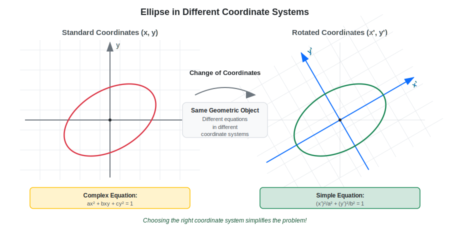
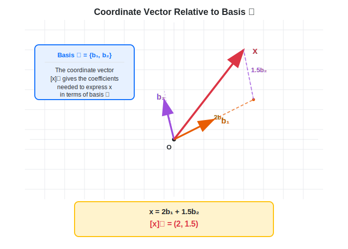
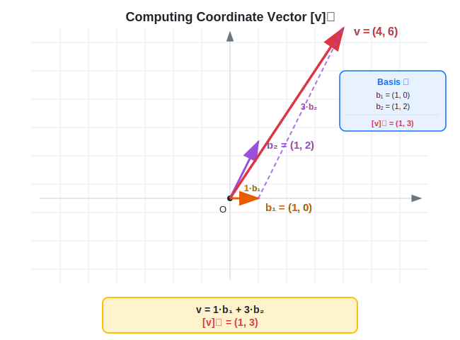
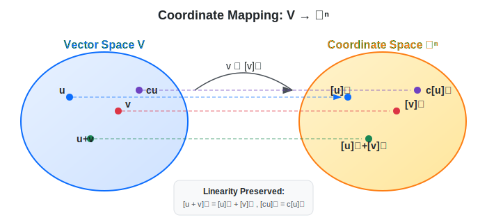

:::note
本系列文章內容參考自經典教材 **Elementary Linear Algebra (Pearson New International Edition)**。本文對應章節：**Ch4-4 Coordinate Systems**。
:::

## **座標系統的幾何意義**

### **同一向量，不同座標**

在線性代數中，一個關鍵的觀念是：**向量本身是不變的幾何物件**，但它的「座標」取決於我們選擇的基底。

想像你在地圖上標記一個地點。這個地點的實際位置不會改變，但你可以用不同的方式描述它：

- 經緯度：(25.0330, 121.5654)
- 街道地址：台北市信義區信義路五段 7 號
- 相對位置：距離台北 101 北方 500 公尺

同樣地，在向量空間中，一個向量 $\mathbf{v}$ 的幾何位置是固定的，但它的**座標表示**會隨著我們選擇的基底而改變。

下圖展示了同一個向量 $\mathbf{v}$ 在兩種不同基底下的表示：

### **選對座標系統讓問題變簡單**

選擇適當的座標系統，往往能讓複雜的問題變得簡潔優美。

**經典範例：橢圓方程式**

考慮一個旋轉的橢圓。在標準座標系 $(x, y)$ 下，橢圓的方程式可能是：

$$
ax^2 + bxy + cy^2 = 1
$$

這個方程式包含 $xy$ 交叉項，計算和分析都很複雜。

但如果我們選擇一個**旋轉後的座標系** $(x', y')$，使新坐標軸與橢圓的主軸對齊，方程式就變成：

$$
\frac{(x')^2}{a^2} + \frac{(y')^2}{b^2} = 1
$$

沒有交叉項！這是橢圓的標準形式，簡潔且易於理解。

下圖展示了同一個橢圓在兩種座標系統下的方程式對比：

:::tip 核心觀念：選對基底，問題會變簡單
同一個幾何物件（向量、子空間、線性變換），在不同座標系下，方程式會長得不一樣。如果能選擇「對」的基底，原本複雜的問題可能變得非常簡潔。

例如：對角化矩陣、主成分分析（PCA）、解微分方程等應用，本質上都是在尋找「讓問題變簡單」的基底。
:::

 

## **座標向量 (Coordinate Vector)**

### **定義**

設 $\mathcal{B} = \{\mathbf{b}_1, \mathbf{b}_2, \ldots, \mathbf{b}_n\}$ 是向量空間 $V$ 的一組基底 (basis)，則 $V$ 中任意向量 $\mathbf{v}$ 可以**唯一地**表示為：

$$
\mathbf{v} = c_1\mathbf{b}_1 + c_2\mathbf{b}_2 + \cdots + c_n\mathbf{b}_n
$$

我們將這組唯一的係數 $(c_1, c_2, \ldots, c_n)$ 稱為 $\mathbf{v}$ **相對於基底 $\mathcal{B}$ 的座標向量 (Coordinate Vector)**，記作：

$$
\boxed{[\mathbf{v}]_\mathcal{B} = \begin{bmatrix} c_1 \\ c_2 \\ \vdots \\ c_n \end{bmatrix}}
$$

下圖展示了座標向量的幾何意義：

:::info 直觀理解
把基底 $\mathcal{B} = \{\mathbf{b}_1, \mathbf{b}_2, \ldots, \mathbf{b}_n\}$ 想像成一組新的「座標軸」：

- $\mathbf{v}$ 是用**原始座標系**（標準基底）表示的向量
- $[\mathbf{v}]_\mathcal{B}$ 是用**新座標系** $\mathcal{B}$ 表示的向量

座標向量 $[\mathbf{v}]_\mathcal{B}$ 告訴我們：要沿著 $\mathbf{b}_1$ 方向走多少（$c_1$）、沿著 $\mathbf{b}_2$ 方向走多少（$c_2$），以此類推，才能到達 $\mathbf{v}$ 這個點。
:::

 

## **計算座標向量**

給定向量 $\mathbf{v}$ 和基底 $\mathcal{B} = \{\mathbf{b}_1, \mathbf{b}_2, \ldots, \mathbf{b}_n\}$，要找 $[\mathbf{v}]_\mathcal{B}$，我們需要解方程：

$$
c_1\mathbf{b}_1 + c_2\mathbf{b}_2 + \cdots + c_n\mathbf{b}_n = \mathbf{v}
$$

將基底向量排成矩陣的 columns：

$$
P_\mathcal{B} = [\mathbf{b}_1 \ \mathbf{b}_2 \ \cdots \ \mathbf{b}_n]
$$

則上述方程等價於矩陣方程：

$$
P_\mathcal{B} \begin{bmatrix} c_1 \\ c_2 \\ \vdots \\ c_n \end{bmatrix} = \mathbf{v}
$$

### **理論公式**

若 $P_\mathcal{B}$ 可逆（當 $\mathcal{B}$ 是基底時必然可逆），則：

$$
\colorbox{yellow}{$[\mathbf{v}]_\mathcal{B} = P_\mathcal{B}^{-1}\mathbf{v}$}
$$

### **實際計算方法**

在實務上，通常透過以下兩種方式計算：

1. **使用數值計算工具**：直接計算 $P_\mathcal{B}^{-1}\mathbf{v}$（例如使用 MATLAB、Python NumPy）
2. **手算時使用 Row Reduction**：建立增廣矩陣 $[P_\mathcal{B} \ | \ \mathbf{v}]$ 並化為 RREF
   - 優點：不需先顯式計算反矩陣
   - Row Reduction 本質上就是求反矩陣的過程

### **範例 1：計算座標向量**

設 $\mathcal{B} = \left\{ \mathbf{b}_1 = \begin{bmatrix} 1 \\ 0 \end{bmatrix}, \mathbf{b}_2 = \begin{bmatrix} 1 \\ 2 \end{bmatrix} \right\}$ 是 $\mathbb{R}^2$ 的一組基底。

求向量 $\mathbf{v} = \begin{bmatrix} 4 \\ 6 \end{bmatrix}$ 相對於 $\mathcal{B}$ 的座標向量 $[\mathbf{v}]_\mathcal{B}$。

**Solution**：

根據公式 $[\mathbf{v}]_\mathcal{B} = P_\mathcal{B}^{-1}\mathbf{v}$，其中：

$$
P_\mathcal{B} = [\mathbf{b}_1 \ \mathbf{b}_2] = \begin{bmatrix} 1 & 1 \\ 0 & 2 \end{bmatrix}
$$

**步驟 1：計算 $P_\mathcal{B}^{-1}$**

對於 $2 \times 2$ 矩陣 $\begin{bmatrix} a & b \\ c & d \end{bmatrix}$，反矩陣為 $\frac{1}{ad-bc}\begin{bmatrix} d & -b \\ -c & a \end{bmatrix}$：

$$
P_\mathcal{B}^{-1} = \frac{1}{(1)(2)-(1)(0)}\begin{bmatrix} 2 & -1 \\ 0 & 1 \end{bmatrix} = \frac{1}{2}\begin{bmatrix} 2 & -1 \\ 0 & 1 \end{bmatrix} = \begin{bmatrix} 1 & -1/2 \\ 0 & 1/2 \end{bmatrix}
$$

**步驟 2：計算 $[\mathbf{v}]_\mathcal{B} = P_\mathcal{B}^{-1}\mathbf{v}$**

$$
[\mathbf{v}]_\mathcal{B} = \begin{bmatrix} 1 & -1/2 \\ 0 & 1/2 \end{bmatrix} \begin{bmatrix} 4 \\ 6 \end{bmatrix} = \begin{bmatrix} 4 - 3 \\ 0 + 3 \end{bmatrix} = \begin{bmatrix} 1 \\ 3 \end{bmatrix}
$$

因此：

$$
[\mathbf{v}]_\mathcal{B} = \begin{bmatrix} 1 \\ 3 \end{bmatrix}
$$

**驗證**：$1 \cdot \begin{bmatrix} 1 \\ 0 \end{bmatrix} + 3 \cdot \begin{bmatrix} 1 \\ 2 \end{bmatrix} = \begin{bmatrix} 1 \\ 0 \end{bmatrix} + \begin{bmatrix} 3 \\ 6 \end{bmatrix} = \begin{bmatrix} 4 \\ 6 \end{bmatrix}$ ✓

**幾何意義**：下圖展示了 $\mathbf{v}$ 如何分解為 $1$ 倍的 $\mathbf{b}_1$ 加上 $3$ 倍的 $\mathbf{b}_2$：

 

## **座標映射 (Coordinate Mapping)**

### **座標映射的定義與性質**

設 $\mathcal{B}$ 是 $n$ 維向量空間 $V$ 的一組基底。定義**座標映射 (Coordinate Mapping)**：

$$
\phi_\mathcal{B}: V \to \mathbb{R}^n, \quad \mathbf{v} \mapsto [\mathbf{v}]_\mathcal{B}
$$

這個映射將 $V$ 中的向量對應到 $\mathbb{R}^n$ 中的座標向量。

:::tip 重要性質

座標映射具有以下關鍵性質：

1. **One-to-One（一對一）**：不同的向量有不同的座標
   - 詳見 [Ch2-8 線性變換的組成與可逆性 - 一對一 (One-to-One / Injective)](../02-Chapter2/05-composition-invertibility.md#一對一-one-to-one--injective) 的 One-to-One 定義
2. **Onto（映成）**：每個座標都對應到某個向量
   - 詳見 [Ch2-8 線性變換的組成與可逆性 - 映成 (Onto / Surjective)](../02-Chapter2/05-composition-invertibility.md#映成-onto--surjective) 的 Onto 定義

因此，座標映射是一個**雙射 (Bijection)**，建立了 $V$ 和 $\mathbb{R}^n$ 之間的一一對應關係。

這表示我們可以將抽象向量空間 $V$ 的問題「翻譯」成熟悉的 $\mathbb{R}^n$ 中的問題來處理！
:::

### **座標映射保持線性結構**

更重要的是，座標映射**保持線性運算**：

$$
\begin{aligned}
[\mathbf{u} + \mathbf{v}]_\mathcal{B} &= [\mathbf{u}]_\mathcal{B} + [\mathbf{v}]_\mathcal{B} \\[6pt]
[c\mathbf{u}]_\mathcal{B} &= c[\mathbf{u}]_\mathcal{B}
\end{aligned}
$$

**證明**：設 $[\mathbf{u}]_\mathcal{B} = \begin{bmatrix} u_1 \\ \vdots \\ u_n \end{bmatrix}$，$[\mathbf{v}]_\mathcal{B} = \begin{bmatrix} v_1 \\ \vdots \\ v_n \end{bmatrix}$，則：

$$
\mathbf{u} = u_1\mathbf{b}_1 + \cdots + u_n\mathbf{b}_n, \quad \mathbf{v} = v_1\mathbf{b}_1 + \cdots + v_n\mathbf{b}_n
$$

因此：

$$
\mathbf{u} + \mathbf{v} = (u_1 + v_1)\mathbf{b}_1 + \cdots + (u_n + v_n)\mathbf{b}_n
$$

所以：

$$
[\mathbf{u} + \mathbf{v}]_\mathcal{B} = \begin{bmatrix} u_1 + v_1 \\ \vdots \\ u_n + v_n \end{bmatrix} = [\mathbf{u}]_\mathcal{B} + [\mathbf{v}]_\mathcal{B}
$$

純量乘法的證明類似。∎

這個性質保證了座標映射不僅是一個雙射，更是一個**同構 (Isomorphism)**——它完全保持了向量空間的結構。

下圖展示了座標映射如何建立 $V$ 與 $\mathbb{R}^n$ 的對應關係：

 

## **基底轉換矩陣 (Change of Coordinates Matrix)**

### **問題背景**

假設同一個向量空間 $V$ 有兩組不同的基底：

- 基底 $\mathcal{B} = \{\mathbf{b}_1, \ldots, \mathbf{b}_n\}$
- 基底 $\mathcal{C} = \{\mathbf{c}_1, \ldots, \mathbf{c}_n\}$

對於 $V$ 中的同一個向量 $\mathbf{v}$，它在兩組基底下會有不同的座標表示：$[\mathbf{v}]_\mathcal{B}$ 和 $[\mathbf{v}]_\mathcal{C}$。

> **核心問題**：如何從 $[\mathbf{v}]_\mathcal{B}$ 計算出 $[\mathbf{v}]_\mathcal{C}$？

### **定義**

存在一個矩陣 $\underset{\mathcal{C} \leftarrow \mathcal{B}}{P}$，使得：

$$
\boxed{[\mathbf{v}]_\mathcal{C} = \underset{\mathcal{C} \leftarrow \mathcal{B}}{P} \cdot [\mathbf{v}]_\mathcal{B}}
$$

這個矩陣稱為**從 $\mathcal{B}$ 到 $\mathcal{C}$ 的基底轉換矩陣 (Change of Coordinates Matrix from $\mathcal{B}$ to $\mathcal{C}$)**。

:::tip 記號理解
$\underset{\mathcal{C} \leftarrow \mathcal{B}}{P}$ 的下標「$\mathcal{C} \leftarrow \mathcal{B}$」表示「從 $\mathcal{B}$ 座標轉換到 $\mathcal{C}$ 座標」。

箭頭方向指向「目標座標系」。
:::

### **如何計算基底轉換矩陣**

關鍵觀察：$\underset{\mathcal{C} \leftarrow \mathcal{B}}{P}$ 的 columns 就是 $\mathcal{B}$ 的基底向量在 $\mathcal{C}$ 座標下的表示：

$$
\underset{\mathcal{C} \leftarrow \mathcal{B}}{P} = \begin{bmatrix} [\mathbf{b}_1]_\mathcal{C} & [\mathbf{b}_2]_\mathcal{C} & \cdots & [\mathbf{b}_n]_\mathcal{C} \end{bmatrix}
$$

**直觀理解**：要從 $\mathcal{B}$ 座標轉換到 $\mathcal{C}$ 座標，我們需要知道 $\mathcal{B}$ 的每個基底向量在 $\mathcal{C}$ 中「長什麼樣子」。

### **範例 2：計算基底轉換矩陣**

設 $\mathcal{B} = \left\{ \mathbf{b}_1 = \begin{bmatrix} 1 \\ 1 \end{bmatrix}, \mathbf{b}_2 = \begin{bmatrix} 1 \\ -1 \end{bmatrix} \right\}$ 和 $\mathcal{C} = \left\{ \mathbf{c}_1 = \begin{bmatrix} 1 \\ 0 \end{bmatrix}, \mathbf{c}_2 = \begin{bmatrix} 0 \\ 1 \end{bmatrix} \right\}$ 是 $\mathbb{R}^2$ 的兩組基底。

（注意 $\mathcal{C}$ 就是標準基底。）

求 $\underset{\mathcal{C} \leftarrow \mathcal{B}}{P}$。

**Solution**：

由於 $\mathcal{C}$ 是標準基底，$[\mathbf{v}]_\mathcal{C} = \mathbf{v}$（標準座標就是向量本身）。

因此：

$$
[\mathbf{b}_1]_\mathcal{C} = \mathbf{b}_1 = \begin{bmatrix} 1 \\ 1 \end{bmatrix}, \quad [\mathbf{b}_2]_\mathcal{C} = \mathbf{b}_2 = \begin{bmatrix} 1 \\ -1 \end{bmatrix}
$$

所以：

$$
\underset{\mathcal{C} \leftarrow \mathcal{B}}{P} = \begin{bmatrix} [\mathbf{b}_1]_\mathcal{C} & [\mathbf{b}_2]_\mathcal{C} \end{bmatrix} = \begin{bmatrix} 1 & 1 \\ 1 & -1 \end{bmatrix}
$$

**驗證**：若 $[\mathbf{v}]_\mathcal{B} = \begin{bmatrix} 2 \\ 3 \end{bmatrix}$，則：

$$
\mathbf{v} = 2\mathbf{b}_1 + 3\mathbf{b}_2 = 2\begin{bmatrix} 1 \\ 1 \end{bmatrix} + 3\begin{bmatrix} 1 \\ -1 \end{bmatrix} = \begin{bmatrix} 5 \\ -1 \end{bmatrix}
$$

用轉換矩陣計算：

$$
[\mathbf{v}]_\mathcal{C} = \underset{\mathcal{C} \leftarrow \mathcal{B}}{P} \cdot [\mathbf{v}]_\mathcal{B} = \begin{bmatrix} 1 & 1 \\ 1 & -1 \end{bmatrix} \begin{bmatrix} 2 \\ 3 \end{bmatrix} = \begin{bmatrix} 5 \\ -1 \end{bmatrix} \quad \checkmark
$$

 

## **基底轉換矩陣的性質**

### **性質 1：轉換矩陣必可逆**

基底轉換矩陣 $\underset{\mathcal{C} \leftarrow \mathcal{B}}{P}$ 必定是**可逆矩陣**。

**理由**：座標映射是雙射（One-to-One 且 Onto），因此對應的矩陣必定可逆。

直觀地說，既然能從 $\mathcal{B}$ 座標轉到 $\mathcal{C}$ 座標，自然也能反向轉換。

### **性質 2：反向轉換**

從 $\mathcal{C}$ 座標轉回 $\mathcal{B}$ 座標的轉換矩陣，就是原轉換矩陣的反矩陣：

$$
\colorbox{yellow}{$\underset{\mathcal{B} \leftarrow \mathcal{C}}{P} = \left(\underset{\mathcal{C} \leftarrow \mathcal{B}}{P}\right)^{-1}$}
$$

**原因**：若 $[\mathbf{v}]_\mathcal{C} = \underset{\mathcal{C} \leftarrow \mathcal{B}}{P} \cdot [\mathbf{v}]_\mathcal{B}$，則：

$$
[\mathbf{v}]_\mathcal{B} = \left(\underset{\mathcal{C} \leftarrow \mathcal{B}}{P}\right)^{-1} \cdot [\mathbf{v}]_\mathcal{C}
$$

這正是從 $\mathcal{C}$ 轉回 $\mathcal{B}$ 的轉換，所以反向轉換矩陣就是反矩陣。

### **性質 3：連鎖轉換**

若有三組基底 $\mathcal{B}, \mathcal{C}, \mathcal{D}$，則：

$$
\underset{\mathcal{D} \leftarrow \mathcal{B}}{P} = \underset{\mathcal{D} \leftarrow \mathcal{C}}{P} \cdot \underset{\mathcal{C} \leftarrow \mathcal{B}}{P}
$$

這符合矩陣乘法的結合律，也與「先從 $\mathcal{B}$ 到 $\mathcal{C}$，再從 $\mathcal{C}$ 到 $\mathcal{D}$」的直觀一致。

### **範例 3：計算反向轉換矩陣**

延續範例 2，計算 $\underset{\mathcal{B} \leftarrow \mathcal{C}}{P}$。

**Solution**：

$$
\underset{\mathcal{B} \leftarrow \mathcal{C}}{P} = \left(\underset{\mathcal{C} \leftarrow \mathcal{B}}{P}\right)^{-1} = \begin{bmatrix} 1 & 1 \\ 1 & -1 \end{bmatrix}^{-1}
$$

對於 $2 \times 2$ 矩陣 $\begin{bmatrix} a & b \\ c & d \end{bmatrix}$，反矩陣為 $\frac{1}{ad-bc}\begin{bmatrix} d & -b \\ -c & a \end{bmatrix}$：

$$
\underset{\mathcal{B} \leftarrow \mathcal{C}}{P} = \frac{1}{(1)(-1)-(1)(1)}\begin{bmatrix} -1 & -1 \\ -1 & 1 \end{bmatrix} = \frac{1}{-2}\begin{bmatrix} -1 & -1 \\ -1 & 1 \end{bmatrix} = \begin{bmatrix} 1/2 & 1/2 \\ 1/2 & -1/2 \end{bmatrix}
$$

**驗證**：若 $[\mathbf{v}]_\mathcal{C} = \begin{bmatrix} 5 \\ -1 \end{bmatrix}$，則：

$$
[\mathbf{v}]_\mathcal{B} = \underset{\mathcal{B} \leftarrow \mathcal{C}}{P} \cdot [\mathbf{v}]_\mathcal{C} = \begin{bmatrix} 1/2 & 1/2 \\ 1/2 & -1/2 \end{bmatrix} \begin{bmatrix} 5 \\ -1 \end{bmatrix} = \begin{bmatrix} 2 \\ 3 \end{bmatrix} \quad \checkmark
$$

 

## **在 R^n 空間中的實用計算方法**

當 $V = \mathbb{R}^n$ 時，有一個高效的計算方法可以同時求出從 $\mathcal{B}$ 到 $\mathcal{C}$ 的轉換矩陣，以及反向轉換矩陣（即從 $\mathcal{C}$ 到 $\mathcal{B}$ 的轉換矩陣，其值等於前者的反矩陣）。

設 $P_\mathcal{B}$ 和 $P_\mathcal{C}$ 分別是由基底 $\mathcal{B}$ 和 $\mathcal{C}$ 的向量構成的矩陣（向量排成 columns）：

$$
P_\mathcal{B} = [\mathbf{b}_1 \ \mathbf{b}_2 \ \cdots \ \mathbf{b}_n], \quad P_\mathcal{C} = [\mathbf{c}_1 \ \mathbf{c}_2 \ \cdots \ \mathbf{c}_n]
$$

則轉換矩陣可以表示為：

$$
\underset{\mathcal{C} \leftarrow \mathcal{B}}{P} = P_\mathcal{C}^{-1} P_\mathcal{B}
$$

### **轉換公式的推導**

根據座標向量的定義：

$$
\mathbf{v} = P_\mathcal{B} [\mathbf{v}]_\mathcal{B} = P_\mathcal{C} [\mathbf{v}]_\mathcal{C}
$$

因此：

$$
P_\mathcal{C} [\mathbf{v}]_\mathcal{C} = P_\mathcal{B} [\mathbf{v}]_\mathcal{B}
$$

兩邊左乘 $P_\mathcal{C}^{-1}$：

$$
[\mathbf{v}]_\mathcal{C} = P_\mathcal{C}^{-1} P_\mathcal{B} [\mathbf{v}]_\mathcal{B}
$$

所以 $\underset{\mathcal{C} \leftarrow \mathcal{B}}{P} = P_\mathcal{C}^{-1} P_\mathcal{B}$。

### **使用 Row Reduction 計算**

使用 Row Reduction 可以避免顯式計算反矩陣：

$$
\left[ P_\mathcal{C} \ | \ P_\mathcal{B} \right] \xrightarrow{\text{RREF}} \left[ I \ | \ \underset{\mathcal{C} \leftarrow \mathcal{B}}{P} \right]
$$

**原理**：對 $[P_\mathcal{C} \ | \ P_\mathcal{B}]$ 做 row reduction 使左邊變成單位矩陣，相當於左乘 $P_\mathcal{C}^{-1}$。因此右邊變成 $P_\mathcal{C}^{-1} P_\mathcal{B}$，正是我們要的轉換矩陣。

### **範例 4：使用 Row Reduction 計算**

設 $\mathcal{B} = \left\{ \begin{bmatrix} 1 \\ 2 \end{bmatrix}, \begin{bmatrix} 3 \\ 5 \end{bmatrix} \right\}$ 和 $\mathcal{C} = \left\{ \begin{bmatrix} 1 \\ 1 \end{bmatrix}, \begin{bmatrix} 1 \\ 2 \end{bmatrix} \right\}$。

求 $\underset{\mathcal{C} \leftarrow \mathcal{B}}{P}$。

**Solution**：

$$
P_\mathcal{B} = \begin{bmatrix} 1 & 3 \\ 2 & 5 \end{bmatrix}, \quad P_\mathcal{C} = \begin{bmatrix} 1 & 1 \\ 1 & 2 \end{bmatrix}
$$

建立增廣矩陣並進行 row reduction：

$$
\left[ P_\mathcal{C} \ | \ P_\mathcal{B} \right] = \left[\begin{array}{cc|cc} 1 & 1 & 1 & 3 \\ 1 & 2 & 2 & 5 \end{array}\right]
$$

$$
\xrightarrow{R_2 - R_1}
\left[\begin{array}{cc|cc} 1 & 1 & 1 & 3 \\ 0 & 1 & 1 & 2 \end{array}\right]
\xrightarrow{R_1 - R_2}
\left[\begin{array}{cc|cc} 1 & 0 & 0 & 1 \\ 0 & 1 & 1 & 2 \end{array}\right]
$$

因此：

$$
\underset{\mathcal{C} \leftarrow \mathcal{B}}{P} = \begin{bmatrix} 0 & 1 \\ 1 & 2 \end{bmatrix}
$$

 
