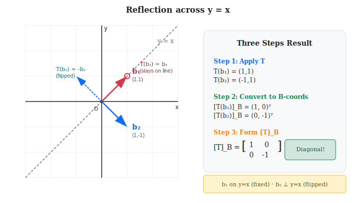

:::note
本系列文章內容參考自經典教材 **Elementary Linear Algebra (Pearson New International Edition)**。本文對應章節：**Ch4-5 Matrix Representations of Linear Operators**。
:::

## **線性算子 (Linear Operator)**

### **定義**

當一個線性變換的定義域 (domain) 和對應域 (codomain) 是同一個向量空間時，這個變換有一個特別的名字：

> **線性算子 (Linear Operator)**：一個從向量空間 $V$ 到自己 $V$ 的線性變換 $T: V \to V$。

常見的線性算子包括：

| 算子                  | 描述                       | 例子                                    |
| --------------------- | -------------------------- | --------------------------------------- |
| **旋轉 (Rotation)**   | 將向量繞原點旋轉某個角度   | $\mathbb{R}^2$ 中繞原點旋轉 $\theta$ 度 |
| **反射 (Reflection)** | 將向量相對於某軸或平面反射 | 相對於 $x$ 軸的反射                     |
| **伸縮 (Scaling)**    | 沿各方向放大或縮小         | 將所有向量放大 2 倍                     |
| **剪切 (Shear)**      | 沿某方向「傾斜」空間       | 沿 $x$ 方向的剪切變換                   |
| **投影 (Projection)** | 將向量投影到子空間         | 投影到某平面                            |

:::info 算子 vs 變換
雖然「線性算子」是「線性變換」的特例，但「算子」強調的是「**在同一個空間內的操作**」。

這個區別在實際應用中很重要：因為輸入和輸出在同一空間，我們可以討論「重複作用」（如 $T^2 = T \circ T$）、「特徵值與特徵向量」等概念。
:::

 

## **核心問題：如何用矩陣表示線性算子？**

### **回顧：標準矩陣**

在 $\mathbb{R}^n$ 中，每個線性變換 $T: \mathbb{R}^n \to \mathbb{R}^m$ 都可以用一個 $m \times n$ 矩陣 $A$ 來表示：

$$
T(\mathbf{x}) = A\mathbf{x}
$$

這個矩陣稱為 $T$ 的**標準矩陣 (Standard Matrix)**，它的 columns 就是 $T(\mathbf{e}_1), T(\mathbf{e}_2), \ldots, T(\mathbf{e}_n)$，其中 $\{\mathbf{e}_1, \ldots, \mathbf{e}_n\}$ 是標準基底。

### **新問題**

> 如果我們選擇一個**非標準的基底** $\mathcal{B}$，線性算子 $T$ 對應的矩陣會是什麼？

同一個向量在不同基底下有不同的座標表示。同樣地，**同一個線性算子在不同基底下也會有不同的矩陣表示**。

我們將這個「相對於基底 $\mathcal{B}$ 的矩陣」記作 $[T]_\mathcal{B}$。

 

## **建構 [T]\_B 的三步驟**

讓我們透過一個具體範例，一步步理解如何求出線性算子相對於某個基底的矩陣表示。

### **範例：反射變換**

設 $T: \mathbb{R}^2 \to \mathbb{R}^2$ 是相對於直線 $y = x$ 的反射變換。

$T$ 的標準矩陣為：

$$
A = \begin{bmatrix} 0 & 1 \\ 1 & 0 \end{bmatrix}
$$

（可驗證：$T\begin{bmatrix} 1 \\ 0 \end{bmatrix} = \begin{bmatrix} 0 \\ 1 \end{bmatrix}$，$T\begin{bmatrix} 0 \\ 1 \end{bmatrix} = \begin{bmatrix} 1 \\ 0 \end{bmatrix}$）

設 $\mathcal{B} = \left\{ \mathbf{b}_1 = \begin{bmatrix} 1 \\ 1 \end{bmatrix}, \mathbf{b}_2 = \begin{bmatrix} 1 \\ -1 \end{bmatrix} \right\}$ 是 $\mathbb{R}^2$ 的另一組基底。

**目標**：求 $[T]_\mathcal{B}$。

下圖展示了這個範例的幾何意義與三步驟的計算結果：

### **Step 1：在原座標系做變換**

首先，計算 $T$ 對基底向量 $\mathbf{b}_1, \mathbf{b}_2$ 的作用（這裡的輸入輸出都是**標準座標**）：

$$
T(\mathbf{b}_1) = A \mathbf{b}_1 = \begin{bmatrix} 0 & 1 \\ 1 & 0 \end{bmatrix} \begin{bmatrix} 1 \\ 1 \end{bmatrix} = \begin{bmatrix} 1 \\ 1 \end{bmatrix}
$$

$$
T(\mathbf{b}_2) = A \mathbf{b}_2 = \begin{bmatrix} 0 & 1 \\ 1 & 0 \end{bmatrix} \begin{bmatrix} 1 \\ -1 \end{bmatrix} = \begin{bmatrix} -1 \\ 1 \end{bmatrix}
$$

**幾何理解**：

- $\mathbf{b}_1 = \begin{bmatrix} 1 \\ 1 \end{bmatrix}$ 在直線 $y=x$ 上，反射後不動：$T(\mathbf{b}_1) = \mathbf{b}_1$
- $\mathbf{b}_2 = \begin{bmatrix} 1 \\ -1 \end{bmatrix}$ 垂直於直線 $y=x$，反射後方向相反：$T(\mathbf{b}_2) = -\mathbf{b}_2$

### **Step 2：把 T(b_i) 轉成 B 座標**

現在我們需要把 $T(\mathbf{b}_1)$ 和 $T(\mathbf{b}_2)$ 表示成 $\mathcal{B}$ 座標。

回顧[座標向量的公式](./04-coordinate-systems.md#理論公式)：

$$
\colorbox{yellow}{$[\mathbf{v}]_\mathcal{B} = P_\mathcal{B}^{-1} \mathbf{v}$}
$$

其中 $P_\mathcal{B} = [\mathbf{b}_1 \ \mathbf{b}_2] = \begin{bmatrix} 1 & 1 \\ 1 & -1 \end{bmatrix}$ 稱為**基底矩陣**。

**計算 $P_\mathcal{B}^{-1}$**：

$$
P_\mathcal{B}^{-1} = \frac{1}{(1)(-1) - (1)(1)} \begin{bmatrix} -1 & -1 \\ -1 & 1 \end{bmatrix} = \frac{1}{-2} \begin{bmatrix} -1 & -1 \\ -1 & 1 \end{bmatrix} = \begin{bmatrix} 1/2 & 1/2 \\ 1/2 & -1/2 \end{bmatrix}
$$

**將 $T(\mathbf{b}_1)$ 和 $T(\mathbf{b}_2)$ 轉換成 $\mathcal{B}$ 座標**：

$$
[T(\mathbf{b}_1)]_\mathcal{B} = P_\mathcal{B}^{-1} T(\mathbf{b}_1) = \begin{bmatrix} 1/2 & 1/2 \\ 1/2 & -1/2 \end{bmatrix} \begin{bmatrix} 1 \\ 1 \end{bmatrix} = \begin{bmatrix} 1 \\ 0 \end{bmatrix}
$$

$$
[T(\mathbf{b}_2)]_\mathcal{B} = P_\mathcal{B}^{-1} T(\mathbf{b}_2) = \begin{bmatrix} 1/2 & 1/2 \\ 1/2 & -1/2 \end{bmatrix} \begin{bmatrix} -1 \\ 1 \end{bmatrix} = \begin{bmatrix} 0 \\ -1 \end{bmatrix}
$$

**驗證**：

- $[T(\mathbf{b}_1)]_\mathcal{B} = \begin{bmatrix} 1 \\ 0 \end{bmatrix}$ 表示 $T(\mathbf{b}_1) = 1 \cdot \mathbf{b}_1 + 0 \cdot \mathbf{b}_2 = \mathbf{b}_1$ ✓
- $[T(\mathbf{b}_2)]_\mathcal{B} = \begin{bmatrix} 0 \\ -1 \end{bmatrix}$ 表示 $T(\mathbf{b}_2) = 0 \cdot \mathbf{b}_1 + (-1) \cdot \mathbf{b}_2 = -\mathbf{b}_2$ ✓

### **Step 3：排成矩陣 [T]\_B**

將上面得到的座標向量**作為 columns 排列**，就得到 $[T]_\mathcal{B}$：

$$
\boxed{[T]_\mathcal{B} = \begin{bmatrix} [T(\mathbf{b}_1)]_\mathcal{B} & [T(\mathbf{b}_2)]_\mathcal{B} \end{bmatrix} = \begin{bmatrix} 1 & 0 \\ 0 & -1 \end{bmatrix}}
$$

:::tip 驚人的結果！
在基底 $\mathcal{B}$ 下，反射變換的矩陣表示竟然是**對角矩陣**！

這比標準矩陣 $A = \begin{bmatrix} 0 & 1 \\ 1 & 0 \end{bmatrix}$ 簡潔多了。

對角線上的 $1$ 和 $-1$ 直接告訴我們：

- 沿 $\mathbf{b}_1$ 方向不變（乘以 1）
- 沿 $\mathbf{b}_2$ 方向反向（乘以 -1）

這就是「選對基底讓問題變簡單」的威力！
:::

 

## **歸納公式：如何計算 [T]\_B**

從上面的範例，我們可以歸納出計算 $[T]_\mathcal{B}$ 的一般步驟：

### **三步驟方法**

設 $T: V \to V$ 是線性算子，$\mathcal{B} = \{\mathbf{b}_1, \ldots, \mathbf{b}_n\}$ 是基底，$A$ 是 $T$ 的標準矩陣。

| 步驟       | 操作                                                                                                                              | 說明                          |
| ---------- | --------------------------------------------------------------------------------------------------------------------------------- | ----------------------------- |
| **Step 1** | 計算 $T(\mathbf{b}_i) = A \mathbf{b}_i$                                                                                           | 在標準座標下做變換            |
| **Step 2** | 計算 $[T(\mathbf{b}_i)]_\mathcal{B} = P_\mathcal{B}^{-1} T(\mathbf{b}_i)$                                                         | 把結果轉成 $\mathcal{B}$ 座標 |
| **Step 3** | 排成矩陣 $[T]_\mathcal{B} = \begin{bmatrix} [T(\mathbf{b}_1)]_\mathcal{B} & \cdots & [T(\mathbf{b}_n)]_\mathcal{B} \end{bmatrix}$ | 座標向量作為 columns          |

 

## **如何使用 [T]\_B**

上面我們學會了如何**建構** $[T]_\mathcal{B}$（用基底向量的輸出來建立矩陣）。

現在來看如何**使用** $[T]_\mathcal{B}$（用這個矩陣來變換任意向量）。

### **核心公式**

一旦有了 $[T]_\mathcal{B}$，對於**任意向量** $\mathbf{v} \in V$，我們可以這樣計算 $T(\mathbf{v})$ 的 $\mathcal{B}$ 座標：

$$
\colorbox{yellow}{$[T(\mathbf{v})]_\mathcal{B} = [T]_\mathcal{B} \cdot [\mathbf{v}]_\mathcal{B}$}
$$

### **符號釐清**

| 符號                          | 意義                                                  | 類型                                  |
| ----------------------------- | ----------------------------------------------------- | ------------------------------------- |
| $[T]_\mathcal{B}$             | $T$ 相對於基底 $\mathcal{B}$ 的**矩陣表示**           | $n \times n$ 矩陣（**變換用的工具**） |
| $[\mathbf{v}]_\mathcal{B}$    | $\mathbf{v}$ 在基底 $\mathcal{B}$ 下的**座標向量**    | $n \times 1$ 向量（**輸入**）         |
| $[T(\mathbf{v})]_\mathcal{B}$ | $T(\mathbf{v})$ 在基底 $\mathcal{B}$ 下的**座標向量** | $n \times 1$ 向量（**輸出**）         |

**白話解讀**：「$T(\mathbf{v})$ 的 $\mathcal{B}$ 座標」等於「$T$ 的 $\mathcal{B}$ 矩陣」乘以「$\mathbf{v}$ 的 $\mathcal{B}$ 座標」。

:::info [T]\_B 的本質
$[T]_\mathcal{B}$ 就是「**直接在 $\mathcal{B}$ 座標系裡做 $T$ 的運算**」。

- 輸入：$[\mathbf{v}]_\mathcal{B}$（$\mathbf{v}$ 的 $\mathcal{B}$ 座標）
- 輸出：$[T(\mathbf{v})]_\mathcal{B}$（$T(\mathbf{v})$ 的 $\mathcal{B}$ 座標）
- 過程：乘以矩陣 $[T]_\mathcal{B}$

整個運算都在 $\mathcal{B}$ 座標系裡完成，不需要回到標準座標！
:::

 

## **公式推導：[T]\_B = B^(-1) A B**

### **觀察計算過程**

回顧上面的範例，我們做了什麼：

$$
[T(\mathbf{b}_i)]_\mathcal{B} = P_\mathcal{B}^{-1} \cdot T(\mathbf{b}_i) = P_\mathcal{B}^{-1} \cdot A \cdot \mathbf{b}_i
$$

將所有 $i$ 合起來考慮（把基底向量排成矩陣 $P_\mathcal{B}$）：

$$
[T]_\mathcal{B} = \begin{bmatrix} [T(\mathbf{b}_1)]_\mathcal{B} & \cdots & [T(\mathbf{b}_n)]_\mathcal{B} \end{bmatrix} = P_\mathcal{B}^{-1} A \begin{bmatrix} \mathbf{b}_1 & \cdots & \mathbf{b}_n \end{bmatrix}
$$

因為 $\begin{bmatrix} \mathbf{b}_1 & \cdots & \mathbf{b}_n \end{bmatrix} = P_\mathcal{B}$，我們得到：

$$
\boxed{[T]_\mathcal{B} = P_\mathcal{B}^{-1} A P_\mathcal{B}}
$$

或者用更簡潔的記號（設 $B = P_\mathcal{B}$）：

$$
\colorbox{yellow}{$[T]_\mathcal{B} = B^{-1} A B$}
$$

### **驗證範例的公式**

讓我們用公式驗證之前的結果：

$$
B = P_\mathcal{B} = \begin{bmatrix} 1 & 1 \\ 1 & -1 \end{bmatrix}, \quad
B^{-1} = \begin{bmatrix} 1/2 & 1/2 \\ 1/2 & -1/2 \end{bmatrix}, \quad
A = \begin{bmatrix} 0 & 1 \\ 1 & 0 \end{bmatrix}
$$

$$
[T]_\mathcal{B} = B^{-1} A B = \begin{bmatrix} 1/2 & 1/2 \\ 1/2 & -1/2 \end{bmatrix} \begin{bmatrix} 0 & 1 \\ 1 & 0 \end{bmatrix} \begin{bmatrix} 1 & 1 \\ 1 & -1 \end{bmatrix}
$$

先算 $AB$：

$$
AB = \begin{bmatrix} 0 & 1 \\ 1 & 0 \end{bmatrix} \begin{bmatrix} 1 & 1 \\ 1 & -1 \end{bmatrix} = \begin{bmatrix} 1 & -1 \\ 1 & 1 \end{bmatrix}
$$

再算 $B^{-1}(AB)$：

$$
B^{-1} A B = \begin{bmatrix} 1/2 & 1/2 \\ 1/2 & -1/2 \end{bmatrix} \begin{bmatrix} 1 & -1 \\ 1 & 1 \end{bmatrix} = \begin{bmatrix} 1 & 0 \\ 0 & -1 \end{bmatrix} \quad \checkmark
$$

與前面三步驟方法得到的結果一致！

### **反向公式**

從 $[T]_\mathcal{B} = B^{-1} A B$，我們也可以反推：

$$
A = B \cdot [T]_\mathcal{B} \cdot B^{-1}
$$

**這告訴我們**：已知某個基底下的矩陣表示 $[T]_\mathcal{B}$，可以還原出標準矩陣 $A$。

 

## **相似矩陣 (Similar Matrices)**

### **定義**

若存在可逆矩陣 $P$ 使得：

$$
B = P^{-1} A P
$$

則稱矩陣 $A$ 和 $B$ 是**相似的 (Similar)**，記作 $A \sim B$。

### **相似矩陣的幾何意義**

從我們的推導可知：

> **相似矩陣代表同一個線性算子在不同基底下的表示。**

- $A$ 是算子 $T$ 的標準矩陣
- $[T]_\mathcal{B} = B^{-1}AB$ 是 $T$ 相對於基底 $\mathcal{B}$ 的矩陣
- 它們是相似的，因為它們描述的是**同一個變換**，只是「觀察角度」（基底）不同

### **相似矩陣的性質**

既然相似矩陣代表同一個變換，它們共享許多重要的代數性質：

| 性質           | 說明                                |
| -------------- | ----------------------------------- |
| **行列式**     | $\det(A) = \det(B)$                 |
| **跡 (Trace)** | $\text{tr}(A) = \text{tr}(B)$       |
| **秩 (Rank)**  | $\text{rank}(A) = \text{rank}(B)$   |
| **特徵值**     | $A$ 和 $B$ 有相同的特徵值           |
| **可逆性**     | $A$ 可逆 $\Leftrightarrow$ $B$ 可逆 |

:::info 對角化的預告
尋找「好」的基底，使得線性算子的矩陣表示盡可能簡單（例如對角矩陣），是線性代數的核心課題之一。

這就是**對角化 (Diagonalization)** 的目標——找到一組基底使得 $[T]_\mathcal{B}$ 是對角矩陣。

在反射變換的例子中，我們恰好選到了讓 $[T]_\mathcal{B}$ 成為對角矩陣的基底！
:::

 

## **知道基底的輸出，就知道整個變換**

現在我們有了 $[T]_\mathcal{B} = B^{-1}AB$ 這個公式，可以討論一個更深刻的問題：

:::tip 核心問題
假設變換 $T$ 是**未知的**，但我們知道 $T$ 把某幾個向量送到哪裡：

$$
T(\mathbf{b}_1) = \mathbf{u}_1, \quad T(\mathbf{b}_2) = \mathbf{u}_2, \quad T(\mathbf{b}_3) = \mathbf{u}_3
$$

我們能不能完全確定這個變換 $T$？

**答案是 Yes**，但有一個關鍵前提：

> $\{\mathbf{b}_1, \mathbf{b}_2, \mathbf{b}_3\}$ 必須是一組 **基底 (Basis)**。

**為什麼？**

因為基底是空間的「骨架」。知道骨架（基底向量）去哪裡了，整個空間的其他向量也會跟著「線性地」移動。

具體來說：任何向量 $\mathbf{v}$ 都可以表示為基底的線性組合 $\mathbf{v} = c_1\mathbf{b}_1 + c_2\mathbf{b}_2 + c_3\mathbf{b}_3$。

既然 $T$ 是線性的：

$$
T(\mathbf{v}) = c_1 T(\mathbf{b}_1) + c_2 T(\mathbf{b}_2) + c_3 T(\mathbf{b}_3) = c_1 \mathbf{u}_1 + c_2 \mathbf{u}_2 + c_3 \mathbf{u}_3
$$

所以，**只要輸入是基底，這個變換 $T$ 就被「鎖死」了**——只有一種可能性。
:::

### **範例：從基底的輸出反求變換矩陣**

設 $T: \mathbb{R}^2 \to \mathbb{R}^2$ 是一個**未知的**線性算子，$\mathcal{B} = \left\{ \mathbf{b}_1 = \begin{bmatrix} 1 \\ 2 \end{bmatrix}, \mathbf{b}_2 = \begin{bmatrix} 3 \\ 5 \end{bmatrix} \right\}$ 是 $\mathbb{R}^2$ 的一組基底。

已知：

$$
T(\mathbf{b}_1) = \begin{bmatrix} 2 \\ 1 \end{bmatrix}, \quad T(\mathbf{b}_2) = \begin{bmatrix} 0 \\ 3 \end{bmatrix}
$$

**目標**：求 $T$ 的標準矩陣 $A$。

**Solution**：

**步驟 1：先求 $[T]_\mathcal{B}$**

把 $T(\mathbf{b}_1)$ 和 $T(\mathbf{b}_2)$ 轉成 $\mathcal{B}$ 座標：

$$
B = P_\mathcal{B} = \begin{bmatrix} 1 & 3 \\ 2 & 5 \end{bmatrix}
$$

計算 $B^{-1}$（使用 $2 \times 2$ 反矩陣公式）：

$$
B^{-1} = \frac{1}{(1)(5) - (3)(2)} \begin{bmatrix} 5 & -3 \\ -2 & 1 \end{bmatrix} = \frac{1}{-1} \begin{bmatrix} 5 & -3 \\ -2 & 1 \end{bmatrix} = \begin{bmatrix} -5 & 3 \\ 2 & -1 \end{bmatrix}
$$

$$
[T(\mathbf{b}_1)]_\mathcal{B} = B^{-1} T(\mathbf{b}_1) = \begin{bmatrix} -5 & 3 \\ 2 & -1 \end{bmatrix} \begin{bmatrix} 2 \\ 1 \end{bmatrix} = \begin{bmatrix} -7 \\ 3 \end{bmatrix}
$$

$$
[T(\mathbf{b}_2)]_\mathcal{B} = B^{-1} T(\mathbf{b}_2) = \begin{bmatrix} -5 & 3 \\ 2 & -1 \end{bmatrix} \begin{bmatrix} 0 \\ 3 \end{bmatrix} = \begin{bmatrix} 9 \\ -3 \end{bmatrix}
$$

所以：

$$
[T]_\mathcal{B} = \begin{bmatrix} -7 & 9 \\ 3 & -3 \end{bmatrix}
$$

**步驟 2：用反向公式求標準矩陣 A**

$$
A = B \cdot [T]_\mathcal{B} \cdot B^{-1}
$$

先算 $B \cdot [T]_\mathcal{B}$：

$$
B \cdot [T]_\mathcal{B} = \begin{bmatrix} 1 & 3 \\ 2 & 5 \end{bmatrix} \begin{bmatrix} -7 & 9 \\ 3 & -3 \end{bmatrix} = \begin{bmatrix} -7+9 & 9-9 \\ -14+15 & 18-15 \end{bmatrix} = \begin{bmatrix} 2 & 0 \\ 1 & 3 \end{bmatrix}
$$

再乘 $B^{-1}$：

$$
A = \begin{bmatrix} 2 & 0 \\ 1 & 3 \end{bmatrix} \begin{bmatrix} -5 & 3 \\ 2 & -1 \end{bmatrix} = \begin{bmatrix} -10 & 6 \\ 1 & 0 \end{bmatrix}
$$

**驗證**：檢查 $A \mathbf{b}_1 = T(\mathbf{b}_1)$：

$$
A \mathbf{b}_1 = \begin{bmatrix} -10 & 6 \\ 1 & 0 \end{bmatrix} \begin{bmatrix} 1 \\ 2 \end{bmatrix} = \begin{bmatrix} -10 + 12 \\ 1 + 0 \end{bmatrix} = \begin{bmatrix} 2 \\ 1 \end{bmatrix} = T(\mathbf{b}_1) \quad \checkmark
$$

 

## **範例：計算 [T]\_B（非標準基底）**

設 $T: \mathbb{R}^3 \to \mathbb{R}^3$ 是線性算子，其標準矩陣為：

$$
A = \begin{bmatrix} 1 & 2 & 0 \\ 0 & 1 & 1 \\ 1 & 0 & 1 \end{bmatrix}
$$

設 $\mathcal{B} = \left\{ \mathbf{b}_1 = \begin{bmatrix} 1 \\ 0 \\ 0 \end{bmatrix}, \mathbf{b}_2 = \begin{bmatrix} 1 \\ 1 \\ 0 \end{bmatrix}, \mathbf{b}_3 = \begin{bmatrix} 1 \\ 1 \\ 1 \end{bmatrix} \right\}$

求 $[T]_\mathcal{B}$。

**Solution**：

使用公式 $[T]_\mathcal{B} = B^{-1} A B$。

**步驟 1：寫出基底矩陣 B**

$$
B = \begin{bmatrix} 1 & 1 & 1 \\ 0 & 1 & 1 \\ 0 & 0 & 1 \end{bmatrix}
$$

**步驟 2：計算 B^{-1}**

由於 $B$ 是上三角矩陣，可以用 row reduction 或觀察法求逆。

$$
B^{-1} = \begin{bmatrix} 1 & -1 & 0 \\ 0 & 1 & -1 \\ 0 & 0 & 1 \end{bmatrix}
$$

（可驗證 $B B^{-1} = I$）

**步驟 3：計算 AB**

$$
AB = \begin{bmatrix} 1 & 2 & 0 \\ 0 & 1 & 1 \\ 1 & 0 & 1 \end{bmatrix} \begin{bmatrix} 1 & 1 & 1 \\ 0 & 1 & 1 \\ 0 & 0 & 1 \end{bmatrix} = \begin{bmatrix} 1 & 3 & 3 \\ 0 & 1 & 2 \\ 1 & 1 & 2 \end{bmatrix}
$$

**步驟 4：計算 B^{-1}(AB)**

$$
[T]_\mathcal{B} = B^{-1} A B = \begin{bmatrix} 1 & -1 & 0 \\ 0 & 1 & -1 \\ 0 & 0 & 1 \end{bmatrix} \begin{bmatrix} 1 & 3 & 3 \\ 0 & 1 & 2 \\ 1 & 1 & 2 \end{bmatrix}
$$

$$
= \begin{bmatrix} 1-0 & 3-1 & 3-2 \\ 0-1 & 1-1 & 2-2 \\ 1 & 1 & 2 \end{bmatrix} = \begin{bmatrix} 1 & 2 & 1 \\ -1 & 0 & 0 \\ 1 & 1 & 2 \end{bmatrix}
$$

 
